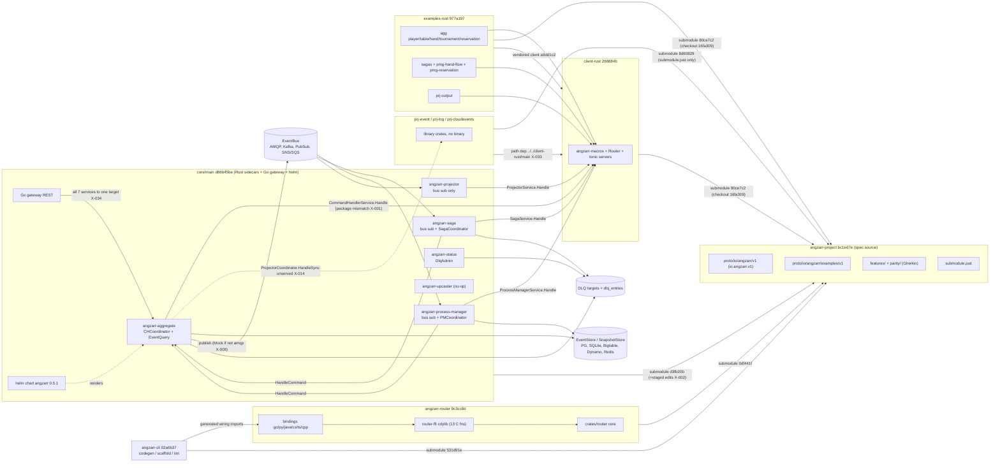
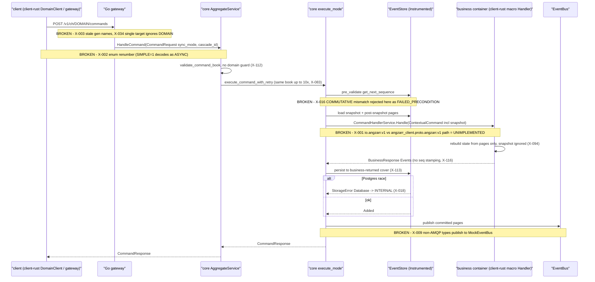
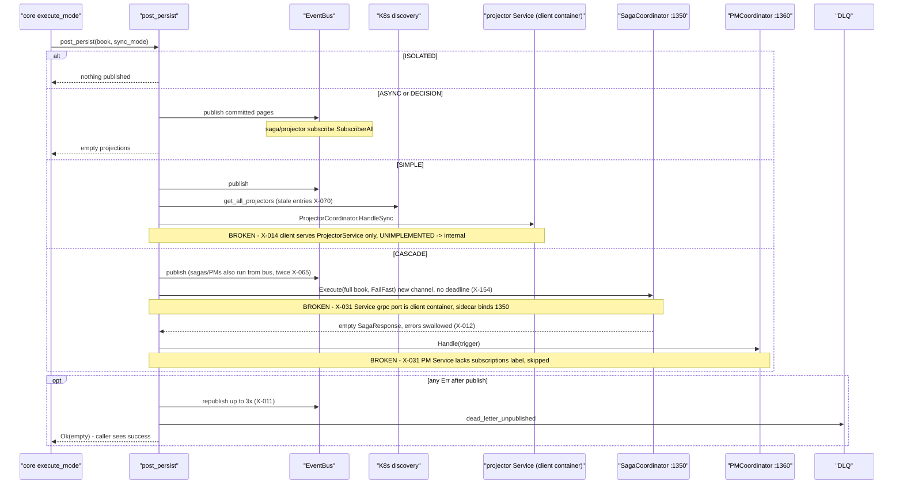
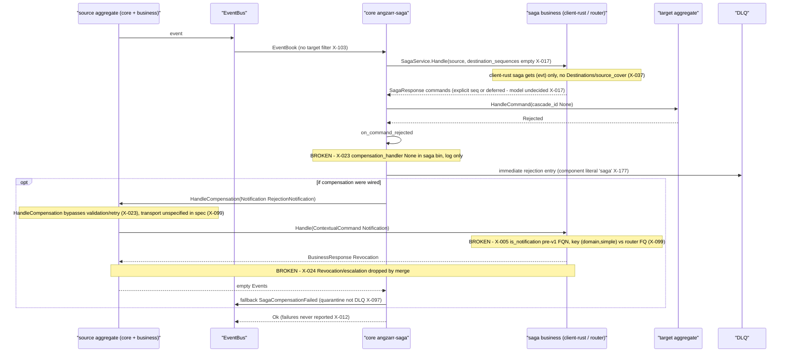
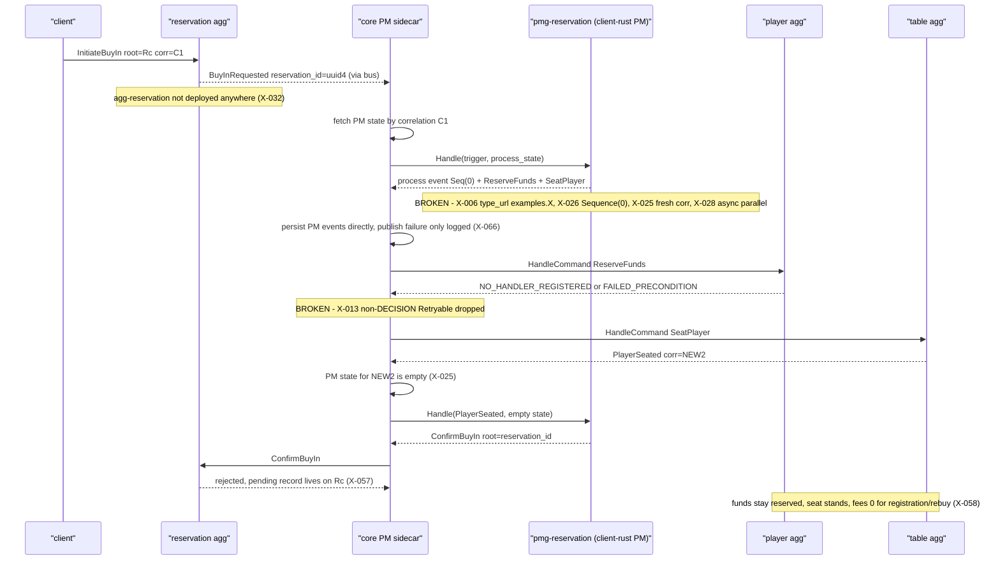
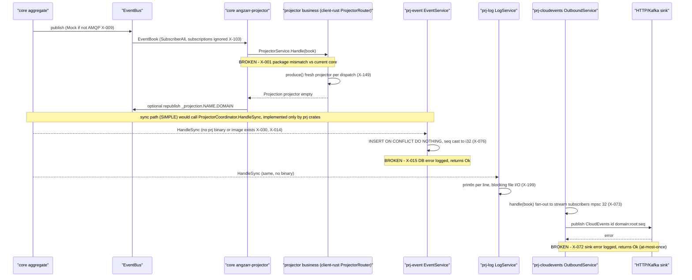
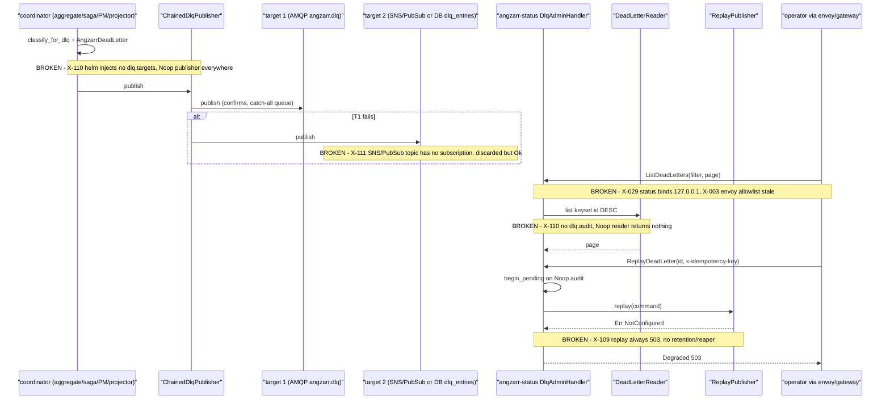
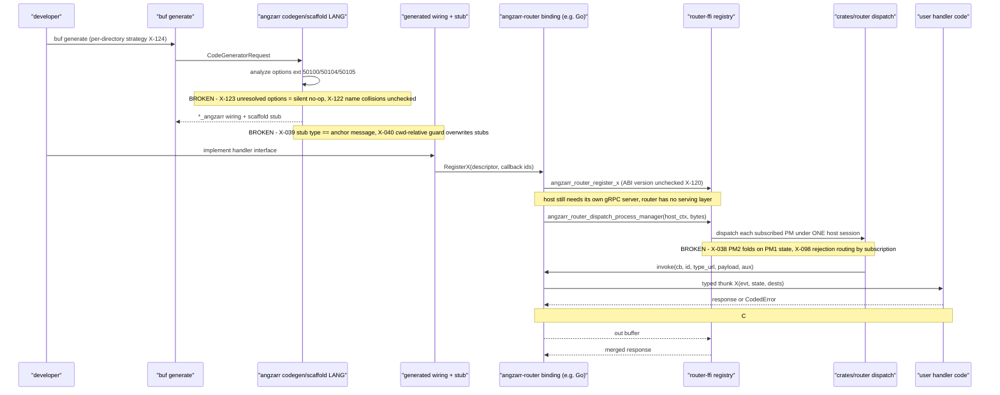
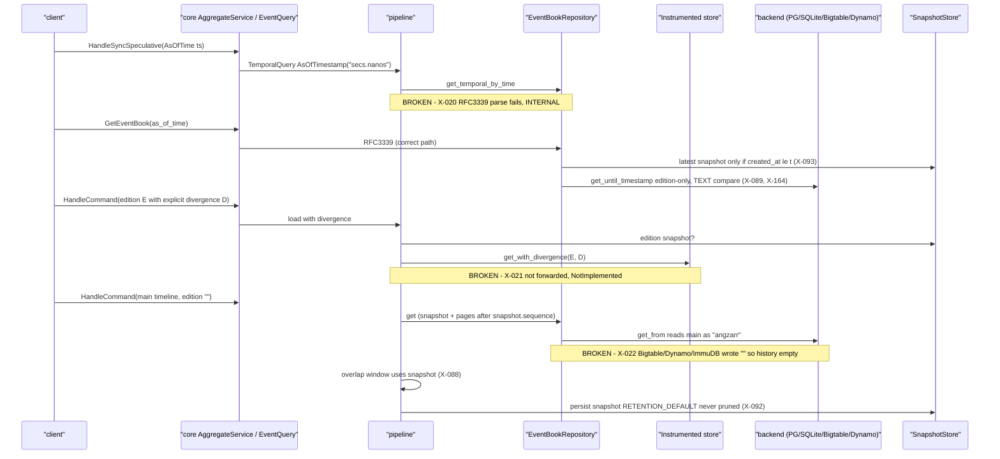

# angzarr ecosystem — architecture index

## 0. How to use this index
Merged from 12 per-repo/per-slice reviews in this directory (`core-{orchestration,services,storage,bus,dlq-config}.md`, `client-rust.md`, `angzarr-router.md`, `angzarr-cli.md`, `prj-projectors.md`, `examples-{hand,domains}.md`, `angzarr-project.md`); `findings.jsonl` holds the same canonical findings machine-readably. Canonical IDs are `X-###` (sorted high→med→low, then by theme); every source ID (`CORE-ORCH-nn`, `CORE-SVC-nn`, `CORE-STORAGE-nn`, `CORE-BUS-nn`, `CORE-DLQCFG-nn`, `CLIENT-RUST-nn`, `ROUTER-nn`, `CLI-Fn`, `PRJ-nn`, `EXAMPLES-HAND-nn`, `EXAMPLES-DOMAINS-EXD-nn`, `ANGZARR-PROJECT-nn`) maps to exactly one X-ID (all 311 checked); `-§n` suffixes cite a report section and `-audit-Fn` a prior-finding audit row. Repo-relative paths use `repo:path:line`. Per-repo detail (component inventories, per-slice diagrams, invariants, read ledgers) lives only in the source reports; this file holds cross-repo structure, contracts, themes and the deduplicated register. Verification: `read` = reviewer read the code, `probe-test` = reviewer wrote a throwaway test in a scratch copy, `ran` = reviewer executed build/tests, `merger-read`/`merger ran` = checked again during this merge.

## 1. Repos & revisions
| repo | path | branch@sha | dirty? | role | report file | files read/in-scope |
|---|---|---|---|---|---|---|
| core | /home/babbitt/workspace/angzarr/core/main | feat/snapshot-temporal-wiring@d86b45be | yes: orchestration/{aggregate,fact,process_manager,saga}, services/{aggregate,pm_coord,saga_coord}.rs, proto_ext/{mod,pages}.rs + untracked enums.rs, utils/saga_compensation; submodule angzarr-project has staged uncommitted proto edits (X-002). `.gitignore **/bin/` hides src/bin from plain rg | Rust sidecars (aggregate, saga, PM, projector, status, upcaster), Go gateway, helm chart 0.5.1 | core-orchestration.md, core-services.md, core-storage.md, core-bus.md, core-dlq-config.md | orch 30 src + 19 tests full (reaper.test skimmed); services 49 full + supporting; storage all storage/repository/migrations; bus 50 full; dlq-config config/dlq/status/utils + all angzarr chart templates |
| client-rust | /home/babbitt/workspace/angzarr/client-rust/main | feat/python-rust-parity-cleanup@268884b | yes: rustfmt-only src diffs, ~1.2k lines WIP step stubs, gitlink pinned 80ce7c2 but 16fa309 checked out | Rust client SDK (angzarr-client 0.5.0 + angzarr-macros 0.1.0) | client-rust.md | all src/, macros, tests/common, 31 step files, tests/router; generated proto skipped |
| angzarr-router | /home/babbitt/workspace/angzarr/angzarr-router/main | main@9c3cc8d | in scope clean (untracked bindings/python egg-info) | shared Rust dispatch core + C ABI + Go/Py/Java/C#/TS/C++ bindings | angzarr-router.md | all non-generated crates + bindings source; most binding tests and all gen/ excluded |
| angzarr-cli | /home/babbitt/workspace/angzarr/angzarr-cli/main | main@02a6b37 | not recorded (earlier template, no ledger) | protoc plugins: codegen/scaffold/lint targeting router bindings | angzarr-cli.md | 16 files (cmd/, codegen/, justfile, buf.gen.yaml, docs) verified read |
| prj-event | /home/babbitt/workspace/angzarr/prj-event/main | main@201df30 | in scope clean; submodule angzarr-client-rust dirty (justfile podman→docker) | SQL event-log projector library | prj-projectors.md | all src + tests |
| prj-log | /home/babbitt/workspace/angzarr/prj-log/main | main@0d39463 | same as prj-event | stdout/file log projector library | prj-projectors.md | all src + tests |
| prj-cloudevents | /home/babbitt/workspace/angzarr/prj-cloudevents/main | main@24e105a | same as prj-event | CloudEvents outbound/stream library | prj-projectors.md | all src + tests + local protos |
| examples-rust | /home/babbitt/workspace/angzarr/examples-rust/main | refactor/reservation@977a197 | yes: staged hand_steps/game_rules_steps, untracked process_manager/table/saga/projector steps, acceptance/steps.rs +518, proto/src/lib.rs, submodule 80ce7c2→16fa309, vendored client a9dd1c2 dirty | Rust poker example domains (player, table, hand, tournament, reservation, PMs, prj-output) | examples-hand.md, examples-domains.md | hand + pmg-hand-flow full; player/table/tournament/reservation/pmg-reservation/prj-output/utils/deploy/tests full (hand_steps excluded from domains slice) |
| angzarr-project | /home/babbitt/workspace/angzarr/angzarr-project | fix/pin-denest-hook-core@bc1ed7e | clean; local-only branch, 68 commits behind origin/main 5b02b1f | spec source: framework + example protos, Gherkin features, toolchain images, submodule.just | angzarr-project.md | 25 protos + all features/parity + build images; site/ skipped |

Submodule pins of angzarr-project: core d3fb20b (+staged edits), client-rust 80ce7c2 (checkout 16fa309), examples-rust 80ce7c2 (checkout 16fa309), router 0df441f, cli 531d91e, prj-* 8d60829. Package rename to `io.angzarr.v1` happened at d3fb20b (2026-06-12); 80ce7c2/16fa309 predate it (merger-verified with git).

## 2. System context diagram

## 3. Deployment topology diagram
As the core helm chart 0.5.1 templates actually render (dotted = broken edge). examples-rust CI deploys this chart with its own values: agg-player :50001, agg-table :50002, agg-hand :50003, saga-table-hand :50011, saga-hand-player :50014, pmg-hand-flow :50391, pmg-reservation :50392, prj-output :50030; agg-reservation, agg-tournament and several sagas are deployed nowhere (X-032).

```mermaid
flowchart TB
  subgraph NS["namespace (helm angzarr 0.5.1 as rendered)"]
    subgraph AGGP["Deployment DOMAIN-aggregate<br/>component=aggregate, angzarr.io/domain"]
      AGC["container client-logic :port grpc"]
      AGS["container angzarr-aggregate<br/>binds 0.0.0.0:1310 (TCP__HOST set)<br/>1315 declared, no listener"]
    end
    AGSV["Service DOMAIN-aggregate<br/>grpc 1310, query 1315"]
    AGDBG["opt NodePort DOMAIN-aggregate-debug"]
    subgraph SAGAP["Deployment NAME-saga<br/>component=saga"]
      SGC["container saga client :50051 grpc"]
      SGS["container angzarr-saga<br/>declares 1310/1315, binds 0.0.0.0:1350"]
    end
    SGSV["Service NAME-saga<br/>angzarr.io/source-domain<br/>grpc port -> CLIENT container"]
    subgraph PMP["Deployment NAME-pm<br/>component=process-manager"]
      PMC["container PM client"]
      PMS["container angzarr-process-manager<br/>declares 1310/1315, binds 0.0.0.0:1360"]
    end
    PMSV["Service NAME-pm grpc 1310<br/>NO angzarr.io/subscriptions"]
    subgraph PRJP["Deployment NAME-projector<br/>component=projector"]
      PRC["container projector client<br/>serves ProjectorService"]
      PRS["container angzarr-projector<br/>no gRPC server, no health"]
    end
    PRSV["Service NAME-projector grpc -> client"]
    subgraph STP["Deployment FULLNAME-status x2"]
      STS["angzarr-status<br/>binds 127.0.0.1:1390"]
      STE["opt envoy :8080 stale allowlist"]
    end
    STSV["Service FULLNAME-status 1390 (+8080)"]
    GWP["Deployment FULLNAME-grpc-gateway :8080<br/>GRPC_TARGET single target"]
    STRM["stream / log Deployments<br/>legacy images, not built"]
  end
  PG[("postgres angzarr-db")]
  MQ[("rabbitmq angzarr-mq<br/>exchange angzarr.events")]
  AGSV --> AGS
  AGS -->|"UDS/TCP business"| AGC
  AGS --> PG
  AGS --> MQ
  PMS --> PG
  MQ --> SGS
  MQ --> PMS
  MQ --> PRS
  SGSV --> SGC
  PMSV -.->|"BROKEN X-031: 1310 has no listener"| PMS
  PRSV --> PRC
  AGS -.->|"CASCADE Execute via K8s discovery grpc port: hits CLIENT X-031"| SGSV
  AGS -.->|"CASCADE Handle: PM Service skipped by discovery X-031"| PMSV
  AGS -.->|"SIMPLE HandleSync: client lacks ProjectorCoordinator X-014"| PRSV
  SGS -->|"HandleCommand via ANGZARR_STATIC_ENDPOINTS"| AGSV
  PMS -->|"HandleCommand"| AGSV
  STSV -.->|"BROKEN X-029: localhost bind"| STS
  STE -.->|"BROKEN X-003"| STS
  GWP -->|"all REST to one aggregate X-034"| AGSV
  STS -.->|"reader Noop: no dlq.audit X-110"| PG
```

## 4. End-to-end sequence diagrams

### (a) client command → aggregate sidecar → client-rust handler → store → bus

### (b) post-persist fan-out: ASYNC / DECISION / SIMPLE / CASCADE

### (c) saga → command → rejection → compensation round-trip

### (d) PM multi-step workflow: examples reservation buy-in

### (e) projector path incl. prj-* sinks

### (f) DLQ write → admin list → replay

### (g) CLI codegen/scaffold → router FFI → user code

### (h) edition / temporal read + snapshot usage

## 5. Cross-repo contract table
| contract | defined in (angzarr-project path) | produced by | consumed by | status | finding IDs |
|---|---|---|---|---|---|
| framework proto package / gRPC full method names | proto/io/angzarr/v1/*.proto (`io.angzarr.v1` since d3fb20b) | core build.rs (d3fb20b), router (0df441f) | client-rust + examples-rust (80ce7c2: `angzarr_client.proto.angzarr.v1`), prj-* vendored client (`angzarr`) | BROKEN | X-001 |
| SyncMode / CascadeErrorMode / MergeStrategy numbering | types.proto:80-107 | core (staged renumber UNSPECIFIED=0) | every other repo (old numbering, ASYNC/FAIL_FAST/COMMUTATIVE=0) | BROKEN | X-002 |
| EventRequest route_to_handler vs skip_handler | types.proto:245-249 | core staged `skip_handler` | clients (route_to_handler, default false) | DRIFT | X-008, X-002 |
| Cover.ext propagation | types.proto:32-44 (16fa309+) | spec; router stamps fill-only | client-rust (no stamping; E0063 at 16fa309) | DRIFT | X-004, X-116 |
| command/event type URLs | `type.googleapis.com/<FQN>` (event_decoding.feature:17-27) | client-rust full_type_url, router canonical `/FQN` | examples PM + acceptance use `examples.X` | BROKEN | X-006 |
| Notification / RejectionNotification FQN | types.proto:350-384 | core HandleCompensation | client-rust is_notification (pre-v1 FQN) | BROKEN | X-005 |
| rejection routing key + transport | options.proto:48-55 (FQ type); rejected_compensation.feature:22-30 ((domain, command)); no rpc takes Notification | core (Notification in CommandBook) | client-rust (domain, simple name), router (FQ type only) | DRIFT | X-099, X-023, X-024 |
| saga/PM sequencing (explicit seq vs angzarr_deferred, destination_sequences, basis_seq) | saga.proto:15-48; types.proto:150-192; wire_parity.feature:12-17 | core stamps deferred, never sends destination_sequences | client-rust Destinations (explicit), examples PMs (explicit Seq(0)) | DRIFT | X-017, X-026, X-037 |
| merge-strategy semantics | types.proto:102-107 vs merge_strategy.feature:84-107 | core pre-validate | all clients (default COMMUTATIVE) | DRIFT | X-016, X-083 |
| CommandHandlerService {Handle, HandleFact, Replay} | command_handler.proto:17-26 | client-rust tonic servers; router via host server | core aggregate GrpcBusinessLogic | BROKEN (package) | X-001, X-036 |
| CommandHandlerCoordinatorService (aggregate :1310) | command_handler.proto:48-80 | core angzarr-aggregate | client-rust clients, saga/PM sidecars (static endpoints), gateway | DRIFT | X-034, X-112, X-113 |
| SagaCoordinatorService (saga :1350 default) | saga.proto:16-39 | core angzarr-saga (ANGZARR_COORDINATOR_PORT) | aggregate CASCADE via discovery Service port `grpc` | BROKEN | X-031, X-012 |
| ProcessManagerCoordinatorService (PM :1360 default) | process_manager.proto:28-56 | core angzarr-process-manager | aggregate CASCADE (needs angzarr.io/subscriptions) | BROKEN | X-031 |
| ProjectorCoordinatorService {HandleSync, Handle, HandleSpeculative} | projector.proto:16-46 | prj-event, prj-log (libraries, no binary); core ProjectorCoord (unserved) | core aggregate SIMPLE/CASCADE; client-rust speculative client | BROKEN | X-014, X-030, X-035 |
| ProjectorService.HandleSpeculative (no side effects) | projector.proto:40 | client-rust (calls real handler), prj-event (writes DB) | core never calls it | BROKEN | X-035 |
| EventStreamService.Subscribe | stream.proto:15-22 | prj-cloudevents OutboundService (lib), core StreamService (unserved) | gateway /v1/stream | BROKEN | X-034, X-073 |
| DlqAdminService (:1390) | NOT in angzarr-project: core proto/io/angzarr/status/v1/dlq_admin.proto | core angzarr-status | envoy transcoder, gateway | BROKEN | X-003, X-029, X-061 |
| EventQueryService | query.proto:16-31 | core aggregate | client-rust QueryClient | DRIFT | X-095, X-165 |
| UpcasterService | upcaster.proto:15-19 | client business | core aggregate (ANGZARR_UPCASTER_*) | OK (unvalidated responses) | X-179 |
| grpc.health service names | unspecified | client-rust `angzarr_client.proto.angzarr.<Svc>`, Python bare name | helm probes (service "") | DRIFT | X-005 |
| error trailer grpc-status-details-bin (google.rpc.Status + ErrorInfo domain angzarr.io) | unspecified | client-rust, router FFI | core / Python (emits none) | DRIFT | X-005, X-185 |
| headers x-correlation-id, traceparent | unspecified | client-rust correlated_request, core grpc_trace_layer | core | OK | - |
| correlation → PM root UUIDv5; correlation fill-only-if-empty | parity/client/identity.feature:33-57; types.proto | core shared.rs:34-57 | examples PMs mint fresh uuid4 | BROKEN (usage) | X-025 |
| K8s discovery labels (component, angzarr.io/domain, source-domain, subscriptions; port name `grpc`) | unspecified (core discovery/k8s/mod.rs:62-78) | core helm chart | core discovery | BROKEN | X-031, X-070, X-173 |
| sidecar ports 1310/1315/1350/1360/1390, gateway 8080 | unspecified | core bins | helm templates | BROKEN | X-031, X-029, X-173 |
| sidecar env (ANGZARR__*, ANGZARR_SUBSCRIPTIONS, ANGZARR_STATIC_ENDPOINTS, ANGZARR_COORDINATOR_PORT, ANGZARR_DISCOVERY) | unspecified (core config) | helm | core bins | DRIFT | X-103, X-104, X-170, X-031 |
| client server env (PORT/GRPC_PORT, UDS_BASE_PATH+SERVICE_NAME+DOMAIN vs TRANSPORT_TYPE) | unspecified | client-rust / client-python | helm client container | DRIFT | X-117 |
| bus naming (AMQP `angzarr.events`, rk `{domain}.{hex root}`, queues `{saga,process-manager,projector}-{domain}`; Kafka `{p}.events.{d}`; PubSub `{p}-events-{d}`; SNS `{p}-events-{d}.fifo`; `_projection.{name}.{domain}`) | unspecified | core bus | core subscribers, Python EventStreamSubscriber | DRIFT | X-010, X-103, X-067 |
| messaging.type selection | core bus config | helm (amqp only rendered) | aggregate/PM bins (amqp else Mock) | BROKEN | X-009 |
| DLQ schema (AngzarrDeadLetter; `angzarr.dlq.{domain}`; AMQP `angzarr.dlq` + `.catchall`; Kafka `{prefix}-{domain}`; SNS/PubSub `angzarr-dlq-{domain}`; `dlq_entries`) | types.proto:470-521 (no feature) | core DLQ publishers | status reader | DRIFT | X-111, X-177, X-062, X-063 |
| snapshot semantics (sequence = last folded event; retention) | types.proto:113-127, 218-247 | core snapshot_handler | client-rust (ignores), router Rebuilder (covered_through>0) | DRIFT | X-094, X-092, X-166 |
| main-timeline edition sentinel | types.proto:30,56 (`""`) vs meta.proto:17 (`angzarr`) | core pipeline `""` | NoSQL backends read `angzarr`, hybrid uses `main` | BROKEN | X-022, X-162 |
| temporal as-of-time encoding | query.proto / types.proto Timestamp | EventQuery (RFC3339) | speculative path (`secs.nanos`) | BROKEN | X-020 |
| codegen options ext 50100/50104/50105, ComponentKind 0..4 | options.proto:25-74 | angzarr-project | angzarr-cli | DRIFT | X-126, X-123 |
| router FFI ABI v1 (13 fns, AngzarrBuf, callback) | not in angzarr-project (router abi.proto + docs) | router-ffi | 6 bindings, CLI-generated wiring | DRIFT | X-120, X-121, X-038 |
| client-rust macro signatures used by examples (saga `source_cover`) | parity/client (Python template) | client-rust a9dd1c2 | examples-rust saga-table | BROKEN | X-037 |
| feature file paths | features/, parity/ | angzarr-project | client-rust runner (30 paths), examples symlink, core private copies | DRIFT | X-004, X-061, X-193 |
| submodule.just recipes | submodule.just:27-142 | angzarr-project | cli, prj-* (8d60829 lacks GIT_DIR fix at :92) | DRIFT | - |

## 6. Themes

### Proto v1 migration & submodule drift (`proto-drift`)
- Description: The `angzarr_client.proto.*` → `io.angzarr.v1` rename (d3fb20b) and later spec edits have not propagated: each repo pins a different angzarr-project commit, core carries unpublished wire-breaking edits, and stale names persist in gateway, envoy and client literals. The spec repo has no CI gate.
- Affected repos: core, client-rust, examples-rust, prj-*, angzarr-router, angzarr-project
- Canonical findings: X-001(H), X-002(H), X-003(H), X-004(H), X-005(H), X-006(H), X-007(H), X-008(H), X-061(M), X-062(M), X-063(M), X-064(M), X-153(L)
- Related (other themes): X-017, X-061, X-099
- Suggested direction: Publish core's staged edits via an angzarr-project PR; add buf lint/breaking + feature lint CI there; bump every consumer pin in one coordinated cascade; add a cross-repo wire-parity smoke (core sidecar ↔ each client) to catch package/enum drift.

### Delivery semantics (duplicates, filtering, ordering, retries, non-AMQP buses) (`delivery`)
- Description: Publishing and fan-out mix bus and synchronous paths: non-AMQP buses silently mock or subscribe to nothing, CASCADE runs handlers twice and cannot fail, post-persist errors are masked as success, retries are uncapped or dropped, subscriptions are ignored and the sync projector target is unserved.
- Affected repos: core, prj-*
- Canonical findings: X-009(H), X-010(H), X-011(H), X-012(H), X-013(H), X-014(H), X-015(H), X-065(M), X-066(M), X-067(M), X-068(M), X-069(M), X-070(M), X-071(M), X-072(M), X-073(M), X-074(M), X-075(M), X-076(M), X-077(M), X-154(L), X-155(L), X-156(L)
- Related (other themes): X-001, X-031, X-110, X-111
- Suggested direction: Separate publish (with DLQ capture) from sync fan-out; honour CascadeErrorMode; route every bin through init_event_bus with hard failure; per-root ordering + retry caps + poison DLQ; wire subscriptions; decide who serves ProjectorCoordinatorService.

### Concurrency, merge strategy, 2PC and idempotency (`consistency`)
- Description: Optimistic-concurrency and merge semantics are inconsistent between spec, core pipeline and storage backends: COMMUTATIVE is effectively STRICT, 2PC is half-built, saga sequencing is undecided, backend races and pagination lose or misclassify writes.
- Affected repos: core, angzarr-project, client-rust
- Canonical findings: X-016(H), X-017(H), X-018(H), X-019(H), X-078(M), X-079(M), X-080(M), X-081(M), X-082(M), X-083(M), X-084(M), X-085(M), X-086(M), X-087(M), X-157(L), X-158(L), X-159(L), X-160(L)
- Related (other themes): X-026, X-113
- Suggested direction: Decide COMMUTATIVE and saga-sequencing semantics in angzarr-project first; restrict pre-validate to STRICT; finish or reject cascade_id; normalise backend error mapping and pagination with contract tests on every backend.

### Edition / snapshot / temporal (`temporal`)
- Description: Temporal and edition reads are broken or backend-divergent: as-of-time format mismatch, divergence reads not forwarded, two main-timeline sentinels, non-composite range reads, unpruned snapshots, and clients ignoring snapshots that core sends.
- Affected repos: core, client-rust, angzarr-router, angzarr-project
- Canonical findings: X-020(H), X-021(H), X-022(H), X-088(M), X-089(M), X-090(M), X-091(M), X-092(M), X-093(M), X-094(M), X-095(M), X-096(M), X-161(L), X-162(L), X-163(L), X-164(L), X-165(L), X-166(L)
- Related (other themes): X-080
- Suggested direction: Typed Timestamp through the pipeline; forward all trait methods in Instrumented (make defaults required); one canonical main sentinel at every key builder; composite range/time reads; specify snapshot/temporal rules and run storage contract tests on every backend.

### Compensation broken end-to-end (`compensation`)
- Description: No rejection→compensation round trip works: the saga bin wires no compensation handler, PMs log only, the transport and routing key are unspecified and differ per implementation, client-rust cannot detect v1 Notifications and both client-rust and router drop Revocation/escalation responses.
- Affected repos: core, client-rust, angzarr-router, angzarr-project
- Canonical findings: X-023(H), X-024(H), X-097(M), X-098(M), X-099(M), X-167(L)
- Related (other themes): X-005, X-012, X-017, X-177
- Suggested direction: Specify rejection transport, key and compensator-merge in angzarr-project (cucumber first); wire compensation in saga/PM bins; fix client FQN; add an E2E scenario covering saga→reject→compensate.

### PM-vs-aggregate and PM sync-policy violations (`pm`)
- Description: Example PMs break core's correlation contract, stamp explicit Sequence(0), fire dependent commands async in parallel, and pmg-hand-flow is a single-domain sequencer that belongs in the hand aggregate.
- Affected repos: examples-rust, core
- Canonical findings: X-025(H), X-026(H), X-027(H), X-028(H), X-100(M), X-168(L)
- Related (other themes): X-006, X-013, X-066, X-082, X-129
- Suggested direction: Leave correlation and sequence unset so core fills them; use SIMPLE/CASCADE when the next step depends on the result; fold pmg-hand-flow into HandAggregate; keep pmg-reservation as a pure cross-domain coordinator.

### Config accepted but ignored (`config`)
- Description: Many config sections, env vars and Helm values are parsed and dropped (limits, compensation, offload, subscriptions, snapshots_enable, CLI viper), documented env forms do not work, and no struct denies unknown fields.
- Affected repos: core, angzarr-cli, prj-cloudevents
- Canonical findings: X-101(M), X-102(M), X-103(M), X-104(M), X-105(M), X-106(M), X-169(L), X-170(L), X-171(L), X-172(L)
- Related (other themes): X-009, X-031
- Suggested direction: Add deny_unknown_fields and a config-consumption test; wire or delete each dead key; generate Helm env from the config schema.

### Deploy / build artifacts missing or wrong (`deploy`)
- Description: The chart renders sidecars on the wrong ports/labels, binds status to localhost, references images nobody builds, and examples/prj build configs are broken or depend on sibling worktrees.
- Affected repos: core, examples-rust, prj-*
- Canonical findings: X-029(H), X-030(H), X-031(H), X-032(H), X-033(H), X-107(M), X-108(M), X-173(L), X-174(L), X-175(L), X-176(L)
- Related (other themes): X-003, X-009, X-110
- Suggested direction: Render ANGZARR_COORDINATOR_PORT, HOST and discovery labels; build every referenced image in CI; derive examples targets/values from workspace members; replace sibling path deps with pinned versions.

### DLQ operability (`dlq`)
- Description: DLQ writes work in isolation but Helm deploys get Noop publishers/readers, replay is always Noop, broker DLQs discard, and nothing retains or reaps entries.
- Affected repos: core
- Canonical findings: X-109(M), X-110(M), X-111(M), X-177(L)
- Related (other themes): -
- Suggested direction: Render dlq.targets/dlq.audit from values; wire replay + audit + migrations or hide the RPCs; create catch-all subscriptions; add retention.

### API boundary and trust (`boundary`)
- Description: Service boundaries trust inputs they should validate (domain, business-returned cover, upcaster output) and the gateway/speculative surfaces do not match what is served.
- Affected repos: core, client-rust, prj-*
- Canonical findings: X-034(H), X-035(H), X-036(H), X-112(M), X-113(M), X-114(M), X-115(M), X-178(L), X-179(L), X-180(L), X-181(L)
- Related (other themes): X-001, X-014
- Suggested direction: Validate domain/cover at the coordinator; route the gateway per service/domain; implement HandleSpeculative as side-effect free everywhere.

### Cross-language / engine parity (`parity`)
- Description: client-rust diverges from the Python template and from angzarr-router on handler arguments, stamping, env contract and validation codes, while the router meant to unify engines is used only by CLI output.
- Affected repos: client-rust, angzarr-router, angzarr-cli
- Canonical findings: X-037(H), X-116(M), X-117(M), X-118(M), X-119(M), X-182(L), X-183(L)
- Related (other themes): X-005, X-024, X-099
- Suggested direction: Specify handler signatures, stamping and env contract in parity features; pick one engine (router or per-language) and retire the other.

### Router FFI safety (`ffi`)
- Description: The shared router's FFI layer shares host sessions across PMs, skips ABI checks, and several bindings have double-free or status-0 hazards.
- Affected repos: angzarr-router
- Canonical findings: X-038(H), X-120(M), X-121(M), X-184(L), X-185(L)
- Related (other themes): -
- Suggested direction: Per-component sessions; check ABI on load in every binding; idempotent close/SafeHandle; mutation-test registry.rs.

### Codegen correctness (`codegen`)
- Description: CLI scaffold output collides with generated types and can overwrite user code; lint misses collisions and silently no-ops when options cannot be resolved.
- Affected repos: angzarr-cli, angzarr-project, client-rust
- Canonical findings: X-039(H), X-040(H), X-122(M), X-123(M), X-124(M), X-125(M), X-126(M), X-186(L)
- Related (other themes): X-126
- Suggested direction: Add lint errors for name collisions/unresolved options; resolve scaffold paths against out:; compile generated output in CI.

### Tests that cannot fail / fake behaviour (`fake-tests`)
- Description: Several gates cannot fail: client-rust cucumber exits 0, step worlds simulate the library, examples step files are no-ops or bookkeeping, PM BDD drives test-only models, and key suites are absent from CI.
- Affected repos: client-rust, examples-rust, core, angzarr-router, prj-*
- Canonical findings: X-041(H), X-042(H), X-043(H), X-044(H), X-045(H), X-127(M), X-128(M), X-129(M), X-130(M), X-187(L)
- Related (other themes): X-007, X-010(CI only AMQP), X-018(contract test swallows Err)
- Suggested direction: Use run_and_exit and fail on unimplemented steps; drive steps through production routers/clients; assert on bus events; add missing suites and mutation testing to CI.

### Examples domain correctness (money ledger, hand lifecycle) (`domain`)
- Description: A hand cannot complete, betting rules are wrong, the money ledger mints and destroys chips, reservations cannot confirm, tournaments never pay out, and several poker spec scenarios are themselves wrong.
- Affected repos: examples-rust, angzarr-project
- Canonical findings: X-046(H), X-047(H), X-048(H), X-049(H), X-050(H), X-051(H), X-052(H), X-053(H), X-054(H), X-055(H), X-056(H), X-057(H), X-058(H), X-059(H), X-060(H), X-131(M), X-132(M), X-133(M), X-134(M), X-135(M), X-136(M), X-137(M), X-138(M), X-139(M), X-140(M), X-141(M), X-142(M), X-143(M), X-144(M), X-145(M), X-146(M), X-147(M), X-148(M), X-149(M), X-150(M), X-188(L), X-189(L), X-190(L)
- Related (other themes): X-025, X-026, X-027, X-028
- Suggested direction: Pick one ledger model (reserve→deduct→cash-out) and fix spec scenarios first; move round/showdown/award into HandAggregate; route table/hand via correct roots.

### Docs, dead code, spec hygiene (`hygiene`)
- Description: Stale docs, dead surfaces, change commentary and malformed feature IDs across repos.
- Affected repos: all
- Canonical findings: X-151(M), X-152(M), X-191(L), X-192(L), X-193(L), X-194(L), X-195(L), X-196(L), X-197(L), X-198(L), X-199(L)
- Related (other themes): -
- Suggested direction: Delete or wire dead code; refresh docs from code; add feature-ID CI.

## 7. Findings register
199 canonical findings (high 60, med 92, low 47) deduplicated from 311 source findings. Same content in `findings.jsonl`.

| ID | Sev | Theme | Repo(s) | Primary path:line | Finding | Source IDs | Verification | Conflicts/notes |
|---|---|---|---|---|---|---|---|---|
| X-001 | high | proto-drift | core, angzarr-router, client-rust, examples-rust, prj-event, prj-log, prj-cloudevents, angzarr-project | core:build.rs:47-58 | gRPC package split: core and router speak io.angzarr.v1 (renamed at angzarr-project d3fb20b), client-rust/examples-rust pin 80ce7c2 (angzarr_client.proto.angzarr.v1) and prj-* vendored client uses `angzarr`, so full method paths differ and core-to-business calls get UNIMPLEMENTED. | PRJ-05, CLIENT-RUST-§8, ANGZARR-PROJECT-§8, CORE-SVC-§8 | read+ran(merger git show of package lines at 80ce7c2,16fa309,d3fb20b,0df441f) | Raised from PRJ-05 med. Published chart-0.5.1 images may predate the rename (unverified); break applies to anything built from current core/main. |
| X-002 | high | proto-drift | core, angzarr-project, client-rust, examples-rust, angzarr-router | core:angzarr-project(staged):proto/io/angzarr/v1/types.proto | Core's submodule carries staged, never-committed proto edits (SyncMode/CascadeErrorMode/MergeStrategy renumbered with UNSPECIFIED=0, route_to_handler->skip_handler, basis_seq) that core's working tree depends on; peers still send old numbers (SIMPLE=1 decodes as ASYNC, STRICT=1 as COMMUTATIVE, DECISION=3 as CASCADE). | ANGZARR-PROJECT-06, CORE-BUS-§5, CORE-SVC-§5, CORE-ORCH-I13 | read+ran(merger git diff --cached in core/main/angzarr-project) | CORE-BUS judged the enum helpers sound in isolation; the wire shift is only visible cross-repo. |
| X-003 | high | proto-drift | core | core:gateway/main.go:22,27 | Go gateway imports a stale gitignored gen tree (angzarr_client.proto.angzarr.*) that a fresh buf generate would not produce, and the envoy transcoder allowlist names angzarr_client.proto.angzarr.status.DlqAdminService; both miss the served io.angzarr.* services. | CORE-SVC-03, CORE-DLQCFG-04 | read (gateway build not run; scratch buf generate denied) | - |
| X-004 | high | proto-drift | client-rust, examples-rust, angzarr-project | client-rust:src/builder.rs:128,263 | client-rust and examples-rust have angzarr-project 16fa309 checked out against gitlink 80ce7c2: client-rust's dirty tree fails E0063 (Cover.ext) and 12 runner feature paths vanish; examples bindings were not regenerated. | CLIENT-RUST-02, EXAMPLES-DOMAINS-EXD-29, ANGZARR-PROJECT-§8 | ran (client-rust cargo test in scratch copy) | - |
| X-005 | high | proto-drift | client-rust | client-rust:src/compensation.rs:33,39,318-320 | client-rust keeps pre-v1 FQN literals: is_notification returns false for every real v1 Notification, and health names, the error-trailer Cover type_url and PROJECTION_TYPE_URL are stale. | CLIENT-RUST-06, CLIENT-RUST-07 | read | Python uses bare health name "CommandHandlerService"; no cross-language agreement. |
| X-006 | high | proto-drift | examples-rust | examples-rust:pmg-reservation/src/lib.rs:97-99 | pmg-reservation and the acceptance client pack commands as type.googleapis.com/examples.X while handlers register angzarr_client.proto.examples.v1.X, so every such command is NO_HANDLER_REGISTERED; InProcessClient suffix matching hides it. | EXAMPLES-DOMAINS-EXD-01, EXAMPLES-DOMAINS-EXD-24 | read (not run) | - |
| X-007 | high | proto-drift | angzarr-project | angzarr-project:.github/workflows/build-images.yml:1 | The sole spec repo has no CI running buf lint/breaking or any gherkin parse/ID check. | ANGZARR-PROJECT-01 | read | - |
| X-008 | high | proto-drift | angzarr-project, core | angzarr-project:proto/io/angzarr/v1/types.proto:245-249 | EventRequest.route_to_handler is documented default true but is a proto3 bool (false), so callers that omit it bypass HandleFact; the skip_handler fix exists only as core's staged edit. | ANGZARR-PROJECT-04, CORE-SVC-§5 | read | - |
| X-009 | high | delivery | core | core:src/bin/angzarr_aggregate.rs:157-171 | Aggregate and PM build publishers by hand and fall back to MockEventBus for any messaging type but amqp (and in the gcp-k8s/aws-k8s/gcp-cloudrun profiles), so events persist but are never published; the path also skips InstrumentedBus and offloading. | CORE-SVC-05, CORE-BUS-02, CORE-DLQCFG-11 | read | DLQCFG-11 rated med; canonical high. |
| X-010 | high | delivery | core | core:src/bus/pubsub/bus.rs:166-176 | On Pub/Sub and SNS/SQS a SubscriberAll with no configured domains subscribes to a `{p}-events-events` topic nothing publishes to, and every bin uses SubscriberAll; CI runs only the AMQP contract suite. | CORE-BUS-01 | read (not executed) | - |
| X-011 | high | delivery | core | core:src/orchestration/aggregate/pipeline.rs:507-551 | post_persist bundles bus publish with sync projector/saga/PM calls; any downstream error republishes up to 3x, DLQs the book as unpublished and returns Ok with no projections. | CORE-ORCH-02 | read | - |
| X-012 | high | delivery | core | core:src/orchestration/saga/mod.rs:502-527,737-742 | CASCADE cannot fail fast: SagaRetryBuilder returns (), SagaCoord returns an empty OK, and CascadeErrorMode is written but never read. | CORE-ORCH-03, CORE-SVC-audit-F2 | read | - |
| X-013 | high | delivery | core | core:src/orchestration/process_manager/mod.rs:873-879 | A PM command classified Retryable outside DECISION is logged and dropped (no retry, DLQ or error) after PM state is persisted, so redelivery never re-emits it. | CORE-ORCH-06 | read | - |
| X-014 | high | delivery | core, prj-event, prj-log, client-rust | core:src/orchestration/aggregate/grpc/mod.rs:352-390 | SIMPLE/CASCADE call ProjectorCoordinatorService.HandleSync on every component=projector Service, but no core bin serves it, chart projector Services point at the client container (ProjectorService) and the prj-* crates that implement it ship no binary; only NotFound is skipped, so UNIMPLEMENTED becomes Internal and feeds the post_persist DLQ path. | CORE-ORCH-§4.5, CORE-SVC-audit-F10, CORE-DLQCFG-§3c, PRJ-§5 | read+merger-read(grpc/mod.rs:379-385 skips only NotFound) | Merger-derived from four reports; no single reviewer connected the chain. |
| X-015 | high | delivery | prj-event | prj-event:src/event.rs:321-341 | prj-event logs INSERT failures and returns OK, so a DB outage silently loses projected rows with no redelivery. | PRJ-02 | probe-test | - |
| X-016 | high | consistency | core, angzarr-project | core:src/orchestration/aggregate/pipeline.rs:199-207,673-676 | COMMUTATIVE (the default, wire 0) behaves as STRICT: pre-validation rejects any mismatch with retryable FAILED_PRECONDITION before load, the field-diff reflection pool is only initialised in the status bin, and the spec itself contradicts types.proto on what COMMUTATIVE means; MANUAL never reaches its DLQ for client commands. | CORE-ORCH-01, CORE-BUS-07, ANGZARR-PROJECT-03 | read+merger-read(pipeline.rs:199-207,673-676; grpc/mod.rs:712-740; single_sequence_check.rs:74-86) | Which side is correct (proto comment vs feature) is an open spec question. |
| X-017 | high | consistency | angzarr-project, core, client-rust | angzarr-project:proto/io/angzarr/v1/saga.proto:15-19,42-48 | The saga/PM sequencing model is undecided: saga.proto says the framework stamps angzarr_deferred, features require clients to stamp explicit sequences (erasing rejection provenance in the same oneof), and core never populates destination_sequences so basis_seq is always 0. | ANGZARR-PROJECT-02, CORE-ORCH-15 | read | - |
| X-018 | high | consistency | core | core:src/storage/postgres/event_store.rs:183-317 | A Postgres concurrent-append race hits the unique constraint and surfaces as StorageError::Database, so the aggregate returns Internal and the PM path DLQs instead of retrying; the contract test swallows any Err. | CORE-STORAGE-04 | read | - |
| X-019 | high | consistency | core | core:src/storage/dynamo/event_store.rs:121-130,285-300,493-501 | No DynamoDB Query/Scan follows LastEvaluatedKey, so replay, dedup probes, cascade scans and cleanup silently truncate at 1 MB. | CORE-STORAGE-03 | read | - |
| X-020 | high | temporal | core | core:src/services/aggregate.rs:226-229 | HandleSyncSpeculative AsOfTime passes an untyped "{secs}.{nanos}" string into a path that parses RFC3339, so every as-of-time speculation fails INTERNAL. | CORE-ORCH-12, CORE-SVC-01, CORE-STORAGE-22 | read | - |
| X-021 | high | temporal | core | core:src/advice/instrumented.rs:70-391 | Instrumented<T> wraps every production store but does not forward get_with_divergence, so explicit-divergence edition loads without a snapshot always get NotImplemented. | CORE-SVC-02, CORE-STORAGE-01 | read | - |
| X-022 | high | temporal | core, angzarr-project | core:src/orchestration/aggregate/parsing.rs:152 | Two main-timeline sentinels ("" and "angzarr"): Bigtable/Dynamo/ImmuDB write under "" but read main as "angzarr", so aggregate replay returns empty history and the next write conflicts forever; the spec itself names both. | CORE-STORAGE-02, ANGZARR-PROJECT-13 | read | No Bigtable/Dynamo harness exists; immudb test marks it as known failure. |
| X-023 | high | compensation | core | core:src/bin/angzarr_saga.rs:174-181 | Compensation is inert in distributed mode: the saga bin passes compensation_handler None, GrpcPMContext keeps the log-only on_command_rejected (handle_revocation unreachable), and HandleCompensation bypasses validation, retry and merge strategy. | CORE-ORCH-16, CORE-SVC-audit-F4, CORE-SVC-audit-F12 | read | Raised from med: together with compensator-merge and client-prev1-fqn no compensation path works end to end. |
| X-024 | high | compensation | client-rust, angzarr-router, angzarr-project | client-rust:src/router/runtime.rs:193-215 | Compensator responses are merged inconsistently: client-rust keeps only Events so the documented delegate_to_framework Revocation is dropped, and the router returns one compensator verbatim but drops escalations with two or more; no spec defines the merge. | CLIENT-RUST-03, ROUTER-03 | read+probe-test(router) | Python has no Revocation path either (spec gap). |
| X-025 | high | pm | examples-rust | examples-rust:pmg-hand-flow/src/lib.rs:559 | Both example PMs mint a fresh uuid4 correlation per command; core keeps non-empty correlations and loads PM state by correlation, so every reply lands on empty PM state (hand stalls at big blind; reservation replies orphaned). | EXAMPLES-HAND-02, EXAMPLES-DOMAINS-EXD-03 | read | - |
| X-026 | high | pm | examples-rust, core | examples-rust:pmg-reservation/src/lib.rs:91-96,105-128 | pmg-reservation stamps explicit Sequence(0) on commands (skipping angzarr_deferred and idempotency) and on process events; on any non-empty target the command fails FAILED_PRECONDITION and the async PM drops it, and a second process event per correlation would conflict. | EXAMPLES-DOMAINS-EXD-02, EXAMPLES-DOMAINS-EXD-07 | read+merger-read | Mechanism corrected by merger: pre-validation rejects before the Replay gate EXD-02 cites (see section 8). |
| X-027 | high | pm | examples-rust | examples-rust:pmg-hand-flow/src/lib.rs:159-384 | pmg-hand-flow is a single-domain hand sequencer (all commands target hand; EndHand duplicates saga-hand-table), violating the PM-vs-aggregate policy. | EXAMPLES-HAND-06 | read | - |
| X-028 | high | pm | examples-rust | examples-rust:pmg-reservation/src/lib.rs:357-373,583-604,834-855 | pmg-reservation sends ReserveFunds async in parallel with Seat/Enroll/ProcessRebuy with no #[rejected] handler, although the next step depends on the reserve outcome (policy requires SIMPLE/CASCADE). | EXAMPLES-DOMAINS-EXD-05 | read | - |
| X-029 | high | deploy | core | core:deploy/k8s/helm/angzarr/templates/status-deployment.yaml:74-112 | The chart sets only the status port, so angzarr-status binds 127.0.0.1:1390 and kubelet probes and the ClusterIP Service cannot reach it. | CORE-DLQCFG-01 | read | - |
| X-030 | high | deploy | core, prj-event, prj-log, prj-cloudevents | core:Containerfile:244-283 | Images the chart enables or references (angzarr-status, stream, log, upcaster) are built nowhere, and prj-event/log/cloudevents are library crates with no bin, Containerfile or CI build despite core claiming each ships an image. | CORE-DLQCFG-02, PRJ-04 | read | - |
| X-031 | high | deploy | core | core:deploy/k8s/helm/angzarr/templates/deployment.yaml:583-620,780-819 | The chart never sets ANGZARR_COORDINATOR_PORT (saga binds 1350, PM 1360 while the chart declares 1310/1315), the PM Service lacks angzarr.io/subscriptions so discovery skips it, and the saga Service grpc port targets the client container. | CORE-DLQCFG-03, CORE-SVC-§7-OQ | read+merger-read(rg -uu: no COORDINATOR_PORT/subscriptions in templates) | Project memory says SagaCoordinator must bind 1310; not implemented in core/main chart. |
| X-032 | high | deploy | examples-rust | examples-rust:Containerfile:41-44,131-134,143-219 | examples-rust Containerfile cannot build (proto cp glob misses v1/, h4h manifest not copied), skaffold/values reference deleted PMs, nothing deploys agg-reservation/agg-tournament, and standalone.yaml has stale ports and binary names. | EXAMPLES-DOMAINS-EXD-21, EXAMPLES-HAND-32 | read | - |
| X-033 | high | deploy | prj-event, prj-log, prj-cloudevents | prj-event:Cargo.toml:17 | prj-* depend on ../../client-rust/main (sibling worktree) instead of their vendored 1798afb submodule; builds fail E0063 against client-rust HEAD and pass only against the vendored copy. | PRJ-01 | ran (scratch builds both ways) | - |
| X-034 | high | boundary | core, examples-rust | core:gateway/main.go:42-88 | The gateway registers 7 services on one ClientConn to a single aggregate that serves only 2; EventStream/ProjectorCoord are served nowhere, DlqAdmin lives in status, and /v1/ch/{domain} ignores the domain. | CORE-SVC-04 | read | - |
| X-035 | high | boundary | prj-event, prj-log, core, client-rust | prj-event:src/event.rs:392-401 | Projector HandleSpeculative ("no side effects") is broken at every layer: prj-event persists rows, ProjectorCoord and client-rust call the real handler, and core's bus handler returns an empty Projection without ever calling HandleSpeculative. | PRJ-03, CORE-SVC-12, CLIENT-RUST-17, CORE-ORCH-20 | probe-test(prj-event)+read | - |
| X-036 | high | boundary | client-rust | client-rust:src/router/runtime.rs:778-833 | client-rust HandleFact/Replay produce every factory and use the first command handler regardless of domain, handles_fact or supports_replay. | CLIENT-RUST-05 | read | - |
| X-037 | high | parity | client-rust, examples-rust | client-rust:angzarr-macros/src/lib.rs:1081,1368 | client-rust saga/PM handlers receive only (evt)/(evt,&state): no Destinations, source_cover or source_seq, unlike Python and the router; examples-rust saga-table already declares source_cover and cannot compile against its pinned client. | CLIENT-RUST-04, EXAMPLES-HAND-§8 | read | - |
| X-038 | high | ffi | angzarr-router | angzarr-router:crates/router-ffi/src/registry.rs:495,627-642 | Co-resident PMs matching one trigger share one host session, so PM2 folds on PM1's state; differing state types give cast failures (INTERNAL) or UB in C++. | ROUTER-01 | probe-test | - |
| X-039 | high | codegen | angzarr-cli, angzarr-project | angzarr-cli:codegen/golang.go:91-93 | scaffold names the stub type after the anchor message when no component name is set (every saga, incl. canonical TableHandSaga), which does not compile in Go/Java/C#/C++; lint does not catch it. | CLI-F1 | ran (scaffold on canonical protos) | - |
| X-040 | high | codegen | angzarr-cli | angzarr-cli:cmd/scaffold.go:100-103 | scaffold's generate-once guard stats a cwd-relative path, so with any out: other than . developer-owned stubs are silently overwritten. | CLI-F2 | ran (stub edit wiped on re-run) | - |
| X-041 | high | fake-tests | client-rust | client-rust:tests/features.rs:50-274 | client-rust's features runner discards cucumber's Writer, so failed, ambiguous, skipped and missing features all exit 0 (ran: 23 failed, 8 skipped, EXIT=0). | CLIENT-RUST-01 | ran | - |
| X-042 | high | fake-tests | client-rust, angzarr-project | client-rust:tests/steps/merge_strategy_steps.rs:574-577 | About 10 client-rust step worlds never call the library (self-satisfying asserts, empty Thens), including coordinator-contract simulations the spec README says no suite executes. | CLIENT-RUST-08, ANGZARR-PROJECT-21 | read | - |
| X-043 | high | fake-tests | examples-rust | examples-rust:tests/tests/hand_steps.rs:1-5081 | All 626 step bodies in the staged hand_steps.rs are `let _ = world;`, so all 219 hand.feature scenarios pass vacuously (HEAD had 61 asserts). | EXAMPLES-HAND-12 | read (counts re-run) | - |
| X-044 | high | fake-tests | examples-rust | examples-rust:tests/tests/acceptance/steps.rs:226-279,657-925 | The acceptance hand lifecycle never sends PostBlind/PlayerAction/AwardPot; pots and winners are local bookkeeping and HandComplete/HandEnded are synthesized. | EXAMPLES-HAND-13 | read | - |
| X-045 | high | fake-tests | examples-rust | examples-rust:tests/tests/tournament_steps.rs:53-1851 | Vacuous examples tests: 225 no-op tournament steps, 59 no-op acceptance steps, TODO table steps and 52 router tests whose body is only `let _ = run(ctx)`. | EXAMPLES-DOMAINS-EXD-25, EXAMPLES-HAND-15, EXAMPLES-HAND-30 | read | - |
| X-046 | high | domain | examples-rust | examples-rust:hand/agg/src/handlers/player_action.rs:24-147 | No production code emits BettingRoundComplete or ShowdownStarted, so a hand never leaves preflop and showdown/draw/RevealCards are unreachable. | EXAMPLES-HAND-01 | read | - |
| X-047 | high | domain | examples-rust | examples-rust:table/saga-hand/src/lib.rs:28 | saga-table-hand sets DealCards.table_root = hand_root, so both EndHand emitters target a non-existent table (TableNotFound) and the table stays in_hand forever. | EXAMPLES-HAND-03, EXAMPLES-DOMAINS-audit-F03 | read | - |
| X-048 | high | domain | examples-rust | examples-rust:hand/agg/src/state.rs:134-142 | There is only one main pot (eligible_players never written), so short all-ins can win chips they could not contest. | EXAMPLES-HAND-04 | read | - |
| X-049 | high | domain | examples-rust | examples-rust:pmg-hand-flow/src/lib.rs:579-597 | The PM awards by splitting the pot evenly among non-folded players with no hand evaluation and the odd chip to lowest position (pot_distribution unused). | EXAMPLES-HAND-05 | read | - |
| X-050 | high | domain | examples-rust, angzarr-project | examples-rust:hand/agg/src/handlers/declare_action.rs:98-106 | DeclareAction writes amount_to_call where the applier expects an absolute current_bet (a declared raise lowers current_bet); the proto never defines ActionTaken.amount semantics and scenarios contradict each other. | EXAMPLES-HAND-07, ANGZARR-PROJECT-27 | read | - |
| X-051 | high | domain | examples-rust | examples-rust:hand/agg/src/handlers/declare_action.rs:66-113 | DeclareAction skips status, all-in, check-facing-bet and min-raise checks. | EXAMPLES-HAND-08 | read | - |
| X-052 | high | domain | examples-rust | examples-rust:hand/agg/src/state.rs:195-197 | min_raise is set only from blinds and never updated by raises. | EXAMPLES-HAND-09 | read | - |
| X-053 | high | domain | examples-rust | examples-rust:hand/agg/src/handlers/player_action.rs:24-147 | Turn order is not enforced; action_on_position is written only by ActionClockStarted. | EXAMPLES-HAND-10 | read | - |
| X-054 | high | domain | examples-rust | examples-rust:hand/agg/src/lib.rs:368-380 | UnderbetCorrected and BringInCorrected appliers credit stacks without reducing the pot, creating chips. | EXAMPLES-HAND-11 | read | - |
| X-055 | high | domain | examples-rust | examples-rust:table/agg/src/handlers/end_hand.rs:30-35 | Hand winnings are credited to both table stacks and the bankroll and losers are never debited. | EXAMPLES-DOMAINS-EXD-10, EXAMPLES-HAND-26 | read | - |
| X-056 | high | domain | examples-rust | examples-rust:table/agg/src/handlers/leave.rs:35-42 | PlayerLeft has no consumer that credits the player, so leaving a table destroys all chips. | EXAMPLES-DOMAINS-EXD-11 | read | - |
| X-057 | high | domain | examples-rust | examples-rust:reservation/agg/src/lib.rs:30-32,128-132 | Confirm/Release target root = reservation_id minted in the handler, but the pending record lives on the client-chosen Initiate root, so no caller can align them. | EXAMPLES-DOMAINS-EXD-04 | read | - |
| X-058 | high | domain | examples-rust | examples-rust:reservation/agg/src/lib.rs:197,289,395 | Registration and rebuy fees resolve to 0 in production (reserve/deduct rejected) while the tournament prize pool still grows. | EXAMPLES-DOMAINS-EXD-06 | read | - |
| X-059 | high | domain | examples-rust | examples-rust:table/saga-tournament-h4h/src/lib.rs:62,72-76,119-148 | Hand-for-hand is dead end to end: saga source/table mismatch, hard-coded empty roots, no HandForHandEnded emitter, and no build/deploy target. | EXAMPLES-DOMAINS-EXD-08 | read | - |
| X-060 | high | domain | examples-rust | examples-rust:tournament/agg/src/handlers/hand_for_hand.rs:92-110 | RecordTableHandComplete emits two pages with the same sequence. | EXAMPLES-DOMAINS-EXD-09 | read | - |
| X-061 | med | proto-drift | core, prj-cloudevents, angzarr-project | core:proto/io/angzarr/status/v1/dlq_admin.proto:17 | angzarr-project is not the sole source: core owns dlq_admin.proto and diverged copies of 13 feature files, and prj-cloudevents compiles a package-rewritten local copy of cloudevents.proto. | ANGZARR-PROJECT-§1, CORE-DLQCFG-§8, PRJ-24 | read | - |
| X-062 | med | proto-drift | angzarr-project | angzarr-project:proto/io/angzarr/v1/types.proto:31,203,234-235,271-273,322,383,505-521 | 16 removed field numbers are commented but not reserved (core's staged fix still misses AngzarrDeadLetter 4-6). | ANGZARR-PROJECT-14 | read | - |
| X-063 | med | proto-drift | angzarr-project | angzarr-project:features/ | No scenario covers 2PC, DECISION/ISOLATED/CASCADE, CascadeErrorMode, DLQ, MERGE_MANUAL, SnapshotRetention, EventStream or descriptors; deleted sync_modes/poker_game features are still cited. | ANGZARR-PROJECT-09 | read (git grep) | - |
| X-064 | med | proto-drift | angzarr-project | angzarr-project:features/coordinator-contract/fact_flow.feature:33-37,63-69 | Coordinator-contract errors: fact_flow expects 1-based sequences (4/5 instead of 3/4) and a removed Cover.external_id. | ANGZARR-PROJECT-07, ANGZARR-PROJECT-08 | read | - |
| X-065 | med | delivery | core | core:src/orchestration/aggregate/grpc/mod.rs:664-706 | CASCADE both publishes to the bus and calls sagas/PMs synchronously, so each runs twice; PM triggers have no dedup. | CORE-ORCH-14 | read | - |
| X-066 | med | delivery | core | core:src/orchestration/process_manager/grpc/mod.rs:139-147 | PM event persist succeeds but bus publish failure is only logged (no DLQ capture); PM path also skips snapshots and upcasting. | CORE-ORCH-17 | read | - |
| X-067 | med | delivery | core | core:src/bus/amqp/mod.rs:398-408,676-691 | After a handler failure AMQP (requeue, no qos) and SQS (batch continues) process later same-root events first. | CORE-BUS-03 | read | - |
| X-068 | med | delivery | core | core:src/bus/amqp/mod.rs:676-691 | No backend caps handler-failure retries or dead-letters poison messages (only AMQP DLXs undecodable ones), so one bad message blocks its key forever. | CORE-BUS-04, CORE-BUS-audit-F18 | read | - |
| X-069 | med | delivery | core | core:src/transport/client.rs:79-80,106-108 | The 10 MiB gRPC limit is applied only to servers; clients keep tonic's 4 MiB decode limit. | CORE-BUS-06 | read | - |
| X-070 | med | delivery | core | core:src/discovery/k8s/mod.rs:571-605,592-596,749-765 | K8s discovery never evicts: Delete events miss the inner static registry and watcher relists do not reset caches, so deleted Services keep being routed to. | CORE-SVC-07, CORE-SVC-08 | read | - |
| X-071 | med | delivery | core | core:src/orchestration/aggregate/client.rs:37-59 | tokio Mutex guards held across RPC awaits serialize business, saga/PM and upcaster calls per sidecar (possible deadlock on cyclic cascades, not reproduced). | CORE-ORCH-21, CORE-SVC-10 | read | ORCH rated low, SVC med; canonical med. |
| X-072 | med | delivery | prj-cloudevents | prj-cloudevents:src/outbound.rs:237-239,307,316-333 | prj-cloudevents has three fan-out error semantics: handle logs sink errors and returns Ok (at-most-once), process_projection aborts mid-fan-out, and build errors are dropped by .ok(). | PRJ-10, PRJ-11 | probe-test | - |
| X-073 | med | delivery | prj-cloudevents, core | prj-cloudevents:src/outbound.rs:86-97,363 | Stream subscribers silently lose events once 32 are buffered (same code in core StreamService). | PRJ-09 | probe-test | - |
| X-074 | med | delivery | prj-cloudevents | prj-cloudevents:src/outbound.rs:508 | Default CloudEvent ids domain:root:(projection.sequence+idx) collide across projections emitting >1 event. | PRJ-13 | probe-test | - |
| X-075 | med | delivery | prj-event, prj-log, prj-cloudevents | prj-event:src/event.rs:283-287 | A missing cover.root becomes "unknown", so root-less books collide in PKs and CloudEvent ids. | PRJ-07 | read | - |
| X-076 | med | delivery | prj-event | prj-event:src/event.rs:101 | prj-event casts u32 sequences to i32, storing values above i32::MAX as negatives. | PRJ-06 | probe-test | - |
| X-077 | med | delivery | prj-cloudevents | prj-cloudevents:src/proto_reflect/mod.rs:82,100 | The embedded descriptor pool holds only CloudEvents/WKT types and nothing initialises it, so client data never decodes to JSON. | PRJ-14 | probe-test | - |
| X-078 | med | consistency | core | core:src/orchestration/aggregate/grpc/mod.rs:517-526,649-657 | 2PC is half-built: nothing writes Confirmation, CascadeReaper is never constructed and cascade_id never propagates, so events written under a cascade_id stay invisible forever. | CORE-ORCH-04 | read (rg) | - |
| X-079 | med | consistency | core | core:src/orchestration/aggregate/two_phase.rs:182-186 | The cascade conflict gate counts own/confirmed/revoked cascades as locked and replays raw markers; its Conflict path has no test (cited merge.test.rs does not exist). | CORE-ORCH-10 | read | - |
| X-080 | med | consistency | core | core:src/orchestration/aggregate/pipeline.rs:867-870,988-993 | speculative_mode and the fact pipeline skip the 2PC transform (and speculative ignores divergence), so they see raw unresolved pages. | CORE-ORCH-11 | read | - |
| X-081 | med | consistency | core | core:src/orchestration/aggregate/pipeline.rs:922,965,1069-1082 | The fact pipeline publishes NoOp books, propagates post-persist errors and skips correlation validation. | CORE-ORCH-13 | read | - |
| X-082 | med | consistency | core | core:src/orchestration/process_manager/mod.rs:572-582,765-782 | Triggers that emit commands without PM events reuse the same deferred idempotency key, so destinations swallow later commands as cached. | CORE-ORCH-07 | read | - |
| X-083 | med | consistency | core | core:src/orchestration/aggregate/pipeline.rs:81-92,248-256 | Sequence mismatches retry the identical book up to 10x (plus saga-level retries), while the overlap message is misclassified non-retryable. | CORE-ORCH-08 | read | - |
| X-084 | med | consistency | core | core:src/storage/bigtable/event_store.rs:1381-1533 | Bigtable/Dynamo cascade queries keep pre-C-02 global semantics; partially revoked cascades are never reaped. | CORE-STORAGE-09 | read | - |
| X-085 | med | consistency | core | core:src/storage/bigtable/event_store.rs:1197-1271 | delete_edition_events has no main-timeline guard on Bigtable/Dynamo/Mock (latent: no caller). | CORE-STORAGE-10 | read | - |
| X-086 | med | consistency | core | core:src/storage/bigtable/event_store.rs:817-878 | Bigtable/Dynamo multi-event add is per-row CAS, so a mid-batch failure leaves partial commands. | CORE-STORAGE-11 | read | - |
| X-087 | med | consistency | core | core:src/storage/sqlite/event_store.rs:456-470,487 | SQLite raw BEGIN IMMEDIATE paths return early without ROLLBACK, possibly releasing a pooled connection mid-transaction. | CORE-STORAGE-12 | read | - |
| X-088 | med | temporal | core | core:src/orchestration/aggregate/merge.rs:73-79,135-149 | The commutative/deferred overlap window loses intervening changes when a snapshot is newer than expected. | CORE-ORCH-09 | read | - |
| X-089 | med | temporal | core | core:src/storage/sqlite/event_store.rs:545-607 | get_from_to/get_until_timestamp are edition-only on every backend, so as-of reads, ranges and gap-fill on a branch drop the main prefix. | CORE-STORAGE-07, CORE-STORAGE-audit-F12 | read | - |
| X-090 | med | temporal | core | core:src/storage/bigtable/event_store.rs:800-809 | Bigtable/Dynamo cannot branch at an explicit divergence below main head (first write must equal main max+1). | CORE-STORAGE-08 | read | - |
| X-091 | med | temporal | core | core:migrations/postgres/0007_nullable_edition.sql:121-140 | Postgres returns [] for the first implicit read of a new edition while every other backend returns the full main timeline. | CORE-STORAGE-26, CORE-STORAGE-audit-OQ | read | - |
| X-092 | med | temporal | core, angzarr-project | core:src/services/snapshot_handler/mod.rs:66 | Every production snapshot is RETENTION_DEFAULT and no store prunes DEFAULT (Bigtable prunes nothing), so snapshots grow unbounded. | CORE-STORAGE-05 | read | - |
| X-093 | med | temporal | core | core:src/storage/bigtable/snapshot_store.rs:200-240 | get_at_seq is exact-match on Bigtable and ignores seq on Mock, and temporal reads use only the latest snapshot. | CORE-STORAGE-06, CORE-STORAGE-audit-F26 | read | - |
| X-094 | med | temporal | client-rust | client-rust:angzarr-macros/src/lib.rs:601-618,1463-1475 | client-rust (and Python) rebuild state from pages only and ignore EventBook.snapshot, while core does send snapshot + post-snapshot pages in ContextualCommand. | CLIENT-RUST-12 | read+merger-read(pipeline.rs:773-776; grpc/mod.rs:456-459) | Live whenever a business handler returns snapshot state. |
| X-095 | med | temporal | core | core:src/services/event_query/mod.rs:207-276 | GetEvents ignores query.selection and edition validation, always streaming the full current book. | CORE-SVC-11 | read | - |
| X-096 | med | temporal | angzarr-project | angzarr-project:proto/io/angzarr/v1/types.proto:218-225,308-315 | TemporalQuery says no snapshots while Snapshot.created_at says snapshots are used for temporal-by-time. | ANGZARR-PROJECT-05 | read | - |
| X-097 | med | compensation | core | core:src/utils/saga_compensation/mod.rs:162-190,814-821,876-889 | Saga compensation quarantine republishes to the bus (gated on an unused URL), never to the DLQ, and can publish the same fallback book twice. | CORE-DLQCFG-09 | read | - |
| X-098 | med | compensation | angzarr-router | angzarr-router:crates/router-ffi/src/registry.rs:626-631 | FFI PM routing filters by subscription before the notification check, so rejections addressed to the PM's own domain never reach compensators and shared-input ones run every PM's compensator. | ROUTER-02 | probe-test | - |
| X-099 | med | compensation | angzarr-project, client-rust, angzarr-router | angzarr-project:proto/io/angzarr/v1/options.proto:48-55 | Rejection delivery transport is unspecified (no rpc takes Notification) and the routing key diverges: options.proto and router key on FQ type, features on (source_domain, command), client-rust on (domain, simple name). | ANGZARR-PROJECT-10, ANGZARR-PROJECT-12, CLIENT-RUST-§5, ROUTER-§5 | read | - |
| X-100 | med | pm | examples-rust | examples-rust:pmg-hand-flow/src/lib.rs:175-199 | on_cards_dealt assumes HandStarted was already applied; cross-domain bus order is not guaranteed so it can emit PostBlind to root []. | EXAMPLES-HAND-25 | read | - |
| X-101 | med | config | core | core:src/config/mod.rs:87,97-113 | server, limits, saga_compensation, payload_offload, client_logic, projectors, sagas and process_managers are parsed and ignored (no deny_unknown_fields). | CORE-SVC-14, CORE-DLQCFG-08 | read (rg) | - |
| X-102 | med | config | core | core:src/bus/factory.rs:65-78 | Claim-check payload offload is unwired and unwireable (S: Sized vs Arc<dyn PayloadStore>, consumers unwrapped), so books over 256 KiB/1 MiB fail after persist. | CORE-BUS-05, CORE-BUS-audit-F4 | read | - |
| X-103 | med | config | core | core:src/bin/angzarr_saga.rs:134-161,182-190 | Saga and projector sidecars parse ANGZARR_SUBSCRIPTIONS then subscribe SubscriberAll (#), invoking their client for every event on the bus. | CORE-SVC-06, CORE-BUS-audit-F13 | read | - |
| X-104 | med | config | core | core:config.example.yaml:4-5 | The documented ANGZARR_<SECTION>__<KEY> env form is ignored; only ANGZARR__SECTION__KEY works. | CORE-DLQCFG-07 | read (config-rs source) | - |
| X-105 | med | config | angzarr-cli | angzarr-cli:cmd/root.go:31-53 | CLI initialises viper/--config/ANGZARR_* for every command but reads no key; an unparseable --config is ignored. | CLI-F7 | read | - |
| X-106 | med | config | prj-cloudevents | prj-cloudevents:src/lib.rs:65-74 | prj-cloudevents docs name OUTBOUND_SINKS (default none) but code reads CLOUDEVENTS_SINK defaulting to Http, and CLOUDEVENTS_BATCH_SIZE=0 panics in publish. | PRJ-12, PRJ-08 | probe-test(batch 0)+read | - |
| X-107 | med | deploy | core | core:src/bin/angzarr_saga.rs:218-260 | Saga/PM/projector stop only on ctrl_c (no SIGTERM drain or telemetry flush), ignore transport config, and the projector has no health endpoint. | CORE-SVC-15, CORE-DLQCFG-22 | read | - |
| X-108 | med | deploy | examples-rust | examples-rust:tests/scripts/bootstrap-cluster.sh:76-83 | The kind bootstrap exports PLAYER/TABLE/HAND URLs all as the gateway, which targets only player-aggregate. | EXAMPLES-DOMAINS-EXD-23 | read | Memory says cluster acceptance should use 31320-31324 debug NodePorts. |
| X-109 | med | dlq | core | core:src/bin/angzarr_status.rs:106 | Status wires Noop replay and audit (ReplayDeadLetter always 503, H-31/H-32 dead, FreshSequence missing), DeleteDeadLetter has no authn/audit, and nothing retains or reaps dlq_entries. | CORE-SVC-13, CORE-DLQCFG-05 | read | - |
| X-110 | med | dlq | core | core:deploy/k8s/helm/angzarr/templates/deployment.yaml:1 | The chart injects no dlq.targets or dlq.audit, so every Helm sidecar uses the Noop DLQ and status the Noop reader. | CORE-DLQCFG-06 | read | - |
| X-111 | med | dlq | core | core:src/dlq/publishers/sns_sqs.rs:120-208 | SNS and Pub/Sub DLQ publishers create topics with no subscription, discarding dead letters while the chain reports success. | CORE-DLQCFG-10 | read | - |
| X-112 | med | boundary | core | core:src/services/aggregate.rs:38-57,184-205,327-355 | AggregateService never checks cover.domain against its TARGET domain, so facts/commands for any domain are persisted into its store. | CORE-SVC-09 | read | - |
| X-113 | med | boundary | core | core:src/orchestration/aggregate/grpc/mod.rs:529-548,596-603 | persist_events writes to the business-returned cover, so a buggy client can append to another aggregate while the snapshot goes to the requested root. | CORE-ORCH-05 | read | - |
| X-114 | med | boundary | client-rust | client-rust:src/server.rs:420-426,454,469-470 | client-rust readiness stays NOT_SERVING up to 30s after bind and TCP marks bound before binding. | CLIENT-RUST-13 | read | - |
| X-115 | med | boundary | client-rust | client-rust:src/handler.rs:53,74,95,129,162,192,280 | Synchronous Handler::dispatch runs on tokio workers, so blocking user I/O starves the runtime. | CLIENT-RUST-14 | read | - |
| X-116 | med | parity | client-rust | client-rust:angzarr-macros/src/lib.rs:259,675 | client-rust passes command-handler output through with no page sequence stamping or Cover.ext propagation (Python and router both stamp). | CLIENT-RUST-11 | read | - |
| X-117 | med | parity | client-rust | client-rust:src/server.rs:86-127 | Rust selects UDS via UDS_BASE_PATH+SERVICE_NAME+DOMAIN while Python's runner uses TRANSPORT_TYPE defaults; the server env contract is unspecified. | CLIENT-RUST-16 | read | - |
| X-118 | med | parity | angzarr-router, client-rust | angzarr-router:crates/router/src/lib.rs:3-5 | Docs say the router replaces client-* engines, but client-rust/go/python keep their own engines and only CLI output and examples-python (untracked vendor copy) use the router: N+1 engines. | ROUTER-07 | read | - |
| X-119 | med | parity | angzarr-cli | angzarr-cli:codegen/python.go:452-470 | Python emitter filters projectors on the union of handler event domains while the other five use input_domain. | CLI-F3 | read | - |
| X-120 | med | ffi | angzarr-router | angzarr-router:bindings/go/ffirouter.go:117-119 | Go, Python and C++ bindings never check angzarr_abi_version and Java/C# return a constant, contrary to the ADR. | ROUTER-05 | read | - |
| X-121 | med | ffi | angzarr-router | angzarr-router:bindings/java/src/main/java/io/angzarr/router/Router.java:58-60 | Java/C#/TS close/Dispose frees the router on every call without clearing the pointer (double free, use-after-free; C# also leaks). | ROUTER-04 | read | - |
| X-122 | med | codegen | angzarr-cli | angzarr-cli:codegen/lint.go:295-299,319-329 | ANZ011 misses method-name collisions across handlers/appliers/rejections/Finish, producing uncompilable interfaces. | CLI-F4 | read | - |
| X-123 | med | codegen | angzarr-cli | angzarr-cli:codegen/model.go:127-160 | If options extensions cannot be resolved, lint prints OK and codegen emits nothing. | CLI-F5 | read | - |
| X-124 | med | codegen | angzarr-cli | angzarr-cli:codegen/lint.go:118-148,166-181 | Components spanning directories break under buf's default per-directory plugin strategy. | CLI-F6 | read | - |
| X-125 | med | codegen | client-rust | client-rust:angzarr-macros/src/lib.rs:748-775,846-859,1796-1799 | Malformed client-rust markers are silently dropped then stripped, so handlers never route; conflicting markers are undetected. | CLIENT-RUST-15 | read | - |
| X-126 | med | codegen | angzarr-project | angzarr-project:proto/io/angzarr/v1/options.proto:34-46 | ComponentOptions.output_domain is singular while sagas/PMs target multiple domains. | ANGZARR-PROJECT-11 | read | - |
| X-127 | med | fake-tests | client-rust | client-rust:tests/steps/command_handler_steps.rs:218,353 | Old and new step vocabularies match the same text (ambiguous) and 193 panic!("WIP") stubs exist; the step set matches neither pin nor checkout. | CLIENT-RUST-09 | ran | - |
| X-128 | med | fake-tests | client-rust | client-rust:justfile.container:75-78 | tests/router.rs (trybuild, fact/replay, 42 tests) never runs in CI. | CLIENT-RUST-10 | ran (42 pass serially) | - |
| X-129 | med | fake-tests | examples-rust | examples-rust:tests/tests/process_manager_steps.rs:25-28,188-809 | PM/orchestration BDD drives the test-only HandProcess model or hand-filled PM state with suffix type matching, encoding the production defects. | EXAMPLES-HAND-14, EXAMPLES-DOMAINS-EXD-26 | read | - |
| X-130 | med | fake-tests | angzarr-router | angzarr-router:justfile.container:26 | registry.rs holds routing semantics (where ROUTER-01/02 live) but is excluded from mutation testing. | ROUTER-06 | read | - |
| X-131 | med | domain | examples-rust | examples-rust:hand/agg/src/state.rs:177-197 | Antes are treated as live bets toward calling. | EXAMPLES-HAND-16 | read | - |
| X-132 | med | domain | examples-rust | examples-rust:hand/agg/src/handlers/deal_cards.rs:51-63 | DealCards has no players x hole-cards bound (panics past 52) and allows duplicate players/positions. | EXAMPLES-HAND-17 | read | - |
| X-133 | med | domain | examples-rust | examples-rust:hand/agg/src/game_rules.rs:144-151 | Stud, Razz and Hi/Lo variants silently use Hold'em rules. | EXAMPLES-HAND-18 | read | - |
| X-134 | med | domain | examples-rust | examples-rust:hand/agg/src/handlers/award_pot.rs:24-73 | AwardPot accepts negative amounts, gives the remainder to award[0] and has no status gate. | EXAMPLES-HAND-19 | read | - |
| X-135 | med | domain | examples-rust | examples-rust:hand/agg/src/handlers/redeal_hand.rs:44-66 | RedealHand cannot redeal (hand_id kept) and resets nothing. | EXAMPLES-HAND-20 | read | - |
| X-136 | med | domain | examples-rust | examples-rust:hand/agg/src/state.rs:339-347 | Misdeal/fouled-deck only set flags; no refund or void. | EXAMPLES-HAND-21 | read | - |
| X-137 | med | domain | examples-rust | examples-rust:hand/agg/src/handlers/pull_back_prior_chip.rs:5-8 | Pull-back-prior-chip binding is documented but not enforced (applier no-op). | EXAMPLES-HAND-22 | read | - |
| X-138 | med | domain | examples-rust | examples-rust:hand/agg/src/handlers/request_draw.rs:36-100 | A player can draw repeatedly in one draw round. | EXAMPLES-HAND-23 | read | - |
| X-139 | med | domain | examples-rust | examples-rust:hand/agg/src/state.rs:396-401 | StudCommunityCardDealt does not consume the card from the deck. | EXAMPLES-HAND-24 | read | - |
| X-140 | med | domain | examples-rust | examples-rust:hand/agg/src/handlers/reveal_cards.rs:70-89 | CardsRevealed/CardsMucked have no applier, so reveals repeat and ranks are not retained. | EXAMPLES-HAND-27 | read | - |
| X-141 | med | domain | examples-rust | examples-rust:table/saga-player/src/lib.rs:16-43 | saga-table-player releases funds keyed by hand_root, which is always rejected (and undeployed). | EXAMPLES-DOMAINS-EXD-12 | read | - |
| X-142 | med | domain | examples-rust | examples-rust:player/agg/src/handlers/transfer.rs:18-44 | TransferFunds is credit-only, accepts negatives and never debits the sender. | EXAMPLES-DOMAINS-EXD-13 | read | - |
| X-143 | med | domain | examples-rust | examples-rust:player/agg/src/handlers/deduct.rs:34 | A partial deduct removes the whole reservation key, stranding the residual. | EXAMPLES-DOMAINS-EXD-14 | read | - |
| X-144 | med | domain | examples-rust | examples-rust:tournament/agg/src/handlers/lifecycle.rs:92-93,237-242 | No tournament payout, bounty or refund reaches any player. | EXAMPLES-DOMAINS-EXD-15 | read | - |
| X-145 | med | domain | examples-rust | examples-rust:tournament/agg/src/handlers/player_lifecycle.rs:122-146 | Re-entry is free and unguarded. | EXAMPLES-DOMAINS-EXD-16 | read | - |
| X-146 | med | domain | examples-rust | examples-rust:tournament/agg/src/state.rs:168 | CloseRegistration is a no-op and OpenRegistration is allowed from Paused/Completed. | EXAMPLES-DOMAINS-EXD-17 | read | - |
| X-147 | med | domain | examples-rust | examples-rust:table/agg/src/handlers/start_hand.rs:11-25 | Table ignores hand_for_hand, ChangeSeats moves nobody, and join/seat/rebuy are accepted mid-hand. | EXAMPLES-DOMAINS-EXD-18 | read | - |
| X-148 | med | domain | examples-rust | examples-rust:table/agg/src/handlers/join.rs:59-67 | JoinTable seats chips with no funds link; its player compensation is unreachable. | EXAMPLES-DOMAINS-EXD-19 | read | - |
| X-149 | med | domain | examples-rust | examples-rust:prj-output/src/main.rs:18-25 | prj-output gets a fresh instance per dispatch (client-rust factory semantics), losing names/board, and ignores reservation/tournament. | EXAMPLES-DOMAINS-EXD-20 | read | - |
| X-150 | med | domain | angzarr-project | angzarr-project:features/example/unit/hand.feature:1996-2014,2723-2768 | Poker scenarios are internally wrong: EU-1260 loses 100 chips, EU-1339 contradicts EU-1341, EU-0575 has one player on button and BB. | ANGZARR-PROJECT-22, ANGZARR-PROJECT-23, ANGZARR-PROJECT-24 | read | - |
| X-151 | med | hygiene | angzarr-project | angzarr-project:features/example/unit/table.feature:292-346,914-966 | @EU-0531 is reused 7 times, @EU-1184B..F are malformed and 276/1021 scenarios have no ID. | ANGZARR-PROJECT-18 | read (python scan) | - |
| X-152 | med | hygiene | angzarr-cli | angzarr-cli:README.md:9-14,24,44 | CLI README/DX docs describe removed services/rpcs, an old Emitter API and only go/python support. | CLI-F8 | read | - |
| X-153 | low | proto-drift | angzarr-project | angzarr-project:proto/io/angzarr/examples/v1/player.proto:1 | Example protos emit into the client-go module path, coupling the framework client to poker. | ANGZARR-PROJECT-31 | read | - |
| X-154 | low | delivery | core | core:src/orchestration/aggregate/grpc/mod.rs:252-282,316-345 | CASCADE opens a new channel per saga/PM call with no deadline. | CORE-ORCH-25, CORE-ORCH-audit-F23 | read | - |
| X-155 | low | delivery | core | core:src/orchestration/fact/grpc/mod.rs:63-69 | Fact injection always uses SyncMode::Async. | CORE-ORCH-26 | read | - |
| X-156 | low | delivery | core | core:src/bus/kafka/bus.rs:333-348 | Bus nits: create_subscriber drops prefix/SASL, Pub/Sub trace span and create races, rootless books accepted, backoff capped at 3 steps then 30s. | CORE-BUS-08, CORE-BUS-09, CORE-BUS-10, CORE-BUS-11, CORE-BUS-12 | read | - |
| X-157 | low | consistency | core | core:src/cascade/reaper.rs:337-341 | A fact carrying a client cascade_id on a committed page can mask a stale cascade from the (unwired) reaper. | CORE-ORCH-28 | read | - |
| X-158 | low | consistency | core | core:src/storage/helpers/mod.rs:95-104 | Storage contract nits: sequence contiguity not enforced, snapshot put not atomic, NoSQL positions can regress. | CORE-STORAGE-13, CORE-STORAGE-14, CORE-STORAGE-15 | read | - |
| X-159 | low | consistency | core | core:src/storage/immudb/event_store.rs:419-427 | ImmuDB second-precision timestamps, a wrong partial-index predicate on idx_events_source, and a Bigtable mutex plus full scans. | CORE-STORAGE-19, CORE-STORAGE-20, CORE-STORAGE-24 | read | - |
| X-160 | low | consistency | core | core:src/orchestration/aggregate/grpc/mod.rs:41-69,104-108 | Duplicate deferred-to-SourceInfo helpers disagree on bad-UUID handling. | CORE-ORCH-27 | read | - |
| X-161 | low | temporal | core | core:src/orchestration/process_manager/mod.rs:691-705 | PM rejection-routing cover has edition None, so branch rejections route to the main-timeline PM. | CORE-ORCH-19 | read | - |
| X-162 | low | temporal | core | core:src/orchestration/destination/hybrid.rs:161-167,192-196 | PM state lookup picks the first book from a HashMap and defaults edition to a third sentinel "main". | CORE-ORCH-18 | read | - |
| X-163 | low | temporal | core | core:migrations/postgres/0001_initial_schema.sql:43-49 | The editions table is never used, so divergence metadata is never persisted. | CORE-STORAGE-16 | read | - |
| X-164 | low | temporal | core | core:src/storage/sqlite/event_store.rs:593,891 | Time bounds compare TEXT created_at lexicographically, correct only for chrono UTC RFC3339. | CORE-STORAGE-21 | read | - |
| X-165 | low | temporal | core | core:src/services/event_query/mod.rs:278-435 | Synchronize skips validation and GetAggregateRoots lists only main-edition roots and swallows per-domain errors. | CORE-SVC-19 | read | - |
| X-166 | low | temporal | angzarr-router | angzarr-router:crates/router/src/rebuild.rs:98-106 | Rebuilder's covered_through>0 gate mishandles a snapshot at seq 0 and skips history even with no loader. | ROUTER-13 | read | - |
| X-167 | low | compensation | client-rust | client-rust:angzarr-macros/src/lib.rs:1062-1065,1342-1344 | Saga/PM #[rejected] metadata has no dispatch path and response types are never produced. | CLIENT-RUST-18 | read | - |
| X-168 | low | pm | examples-rust | examples-rust:pmg-reservation/src/lib.rs:282-333,376-439 | PM hygiene: pmg-reservation keeps test-only pre-validation decision logic and no reservation_id/phase guards; pmg-hand-flow claims rejection branching it lacks. | EXAMPLES-DOMAINS-EXD-30, EXAMPLES-DOMAINS-EXD-31, EXAMPLES-HAND-31 | read | - |
| X-169 | low | config | core | core:src/descriptor.rs:69-76,103-117 | Dotted subscription types must equal the full type_url and tokens are not trimmed. | CORE-SVC-17 | read | - |
| X-170 | low | config | core | core:src/storage/config.rs:28-29,282 | Inert config: snapshots_enable, validate() never called, bus backend fields unread, default messaging type 'channel' fails, unprefixed env source, many unread Helm values/env (SERVER__*, COMMAND_BUS__*). | CORE-STORAGE-17, CORE-BUS-15, CORE-BUS-17, CORE-DLQCFG-15, CORE-DLQCFG-16, CORE-DLQCFG-audit-F19 | read | - |
| X-171 | low | config | core | core:src/bus/offloading.rs:93-163 | Offload heuristics ignore snapshot/envelope, and payload stores have unconfined reads, reaper races and bucket-wide deletes (latent, unwired). | CORE-BUS-13, CORE-BUS-14 | read | - |
| X-172 | low | config | prj-log | prj-log:src/log.rs:47-67 | prj-log swallows an unreadable DESCRIPTOR_PATH. | PRJ-18 | read | - |
| X-173 | low | deploy | core | core:deploy/k8s/helm/angzarr/templates/serviceaccount.yaml:14-54 | Chart nits: services list/watch only in the gateway Role, HPA targets a non-existent Deployment, port 1315 has no listener, mesh charts and values-production use wrong names. | CORE-DLQCFG-12, CORE-DLQCFG-13, CORE-DLQCFG-14, CORE-DLQCFG-§3 | read | - |
| X-174 | low | deploy | core | core:src/bin/angzarr_process_manager.rs:71-72 | PM bin skips the rustls provider, projector embedded-mode socket naming breaks on TCP, UDS setup chmods/deletes arbitrary paths. | CORE-SVC-24, CORE-SVC-23, CORE-BUS-18 | read | - |
| X-175 | low | deploy | angzarr-cli, angzarr-router, examples-rust | angzarr-cli:justfile:8-9,41,56 | Build hygiene: CLI version unstamped and fixed /tmp files, router toolchain images :latest, examples kind-load omits PMs, committed build.json. | CLI-F16, CLI-F17, ROUTER-18, EXAMPLES-DOMAINS-EXD-22, EXAMPLES-DOMAINS-EXD-34 | read | - |
| X-176 | low | deploy | angzarr-router | angzarr-router:crates/router-ffi/build.rs:4-8,23 | router-ffi build.rs ignores ANGZARR_PROJECT_PROTO and hardcodes /usr/include. | ROUTER-15 | read | - |
| X-177 | low | dlq | core | core:src/dlq/config.rs:233 | DLQ nits: Kafka prefix angzarr.dlq vs angzarr-dlq, inline DDL (reader without table fails), source_component literals 'aggregate'/'saga'. | CORE-DLQCFG-17, CORE-DLQCFG-21, CORE-SVC-audit-F24, CORE-ORCH-audit-F24 | read | - |
| X-178 | low | boundary | core | core:src/bus/amqp/mod.rs:205-209 | AMQP and database URIs (with credentials) are logged at INFO in bus, DLQ publisher, reader and audit writer. | CORE-BUS-audit-F17, CORE-DLQCFG-audit-F17, CORE-STORAGE-audit-F17 | read | - |
| X-179 | low | boundary | core | core:src/services/upcaster.rs:132-160 | Upcaster responses are trusted without checking page count/sequences. | CORE-SVC-20 | read | - |
| X-180 | low | boundary | core | core:gateway/discovery/descriptor.go:84-97 | Gateway discovery skips the wrong package prefix, emits dangling $refs, documents a non-existent env var and has no timeouts/auth. | CORE-SVC-21 | read | - |
| X-181 | low | boundary | client-rust | client-rust:src/builder.rs:232-236 | client-rust nits: range(..0) selects seq 0, max_attempts 0 panics, stream-limit error classed as Connection, build-time factory probe, silent PORT fallback, unqualified upcaster macro paths, per-page produce. | CLIENT-RUST-20, CLIENT-RUST-21, CLIENT-RUST-22, CLIENT-RUST-23, CLIENT-RUST-24, CLIENT-RUST-25, CLIENT-RUST-28 | read | - |
| X-182 | low | parity | client-rust | client-rust:src/router/runtime.rs:81-140,301-329 | Empty domain/type_url produce different error codes than Python. | CLIENT-RUST-26 | read | - |
| X-183 | low | parity | client-rust | client-rust:src/identity.rs:19-57 | compute_root concatenates without a separator (cross-language) and prod re-exports e-commerce/testing helpers. | CLIENT-RUST-27 | read | - |
| X-184 | low | ffi | angzarr-router | angzarr-router:bindings/python/angzarr_router_ffi/_dispatch.py:582,612 | FFI nits: Python BaseException returns STATUS_OK, duplicate aggregates shadowed, fold statuses discarded, C++/TS parity gaps, dynamic UNHANDLED messages, capacity-assuming dealloc. | ROUTER-08, ROUTER-09, ROUTER-10, ROUTER-11, ROUTER-12, ROUTER-14 | read | - |
| X-185 | low | ffi | angzarr-router | angzarr-router:bindings/csharp/src/Statuses.cs:34-40 | A C#/TS/C++ CodedError with grpc 0 returns STATUS_OK with Status bytes, turning a rejection into success. | ROUTER-19 | read | - |
| X-186 | low | codegen | angzarr-cli | angzarr-cli:codegen/cpp.go:404-406,448-454 | CLI nits: cppQuote unescaped, C++ scaffold include path, Java snakeToPascal digits, unreachable ANZ001, duplicated plugin plumbing/helpers, stale emitter comments/godoc. | CLI-F9, CLI-F10, CLI-F11, CLI-F12, CLI-F13, CLI-F14, CLI-F15, CLI-F18 | read | - |
| X-187 | low | fake-tests | core, prj-log, prj-cloudevents, angzarr-router | core:src/orchestration/saga/grpc/mod.test.rs:43-68 | Weak tests: saga grpc tests assert literals, Mock stores skip contract macros, prj tests assert nothing on failure paths, binding conformance collapses the two-compensator case. | CORE-ORCH-24, CORE-STORAGE-23, PRJ-23, ROUTER-16 | read | - |
| X-188 | low | domain | angzarr-project | angzarr-project:features/example/unit/tournament.feature:508-518,1110-1149 | Poker spec nits: missing tournament statuses, wrong TDA rule citations, weak/impossible scenarios. | ANGZARR-PROJECT-25, ANGZARR-PROJECT-26, ANGZARR-PROJECT-29, ANGZARR-PROJECT-33, ANGZARR-PROJECT-34, ANGZARR-PROJECT-35 | read | - |
| X-189 | low | domain | examples-rust | examples-rust:hand/agg/src/handlers/player_action.rs:80-119 | Hand nits: short all-in BET rejected, dead deck/phase helpers (BDD tests a different shuffle), predictable deck seed. | EXAMPLES-HAND-28, EXAMPLES-HAND-29, EXAMPLES-HAND-33 | read | - |
| X-190 | low | domain | examples-rust | examples-rust:reservation/agg/src/lib.rs:93-101 | Domain nits: generic reservation errors and non-idempotent Initiate, dead saga-player-table/CrossAggregateQuery, blind-equality naming, ColorUp/Rebalance stubs. | EXAMPLES-DOMAINS-EXD-27, EXAMPLES-DOMAINS-EXD-28, EXAMPLES-DOMAINS-EXD-32, EXAMPLES-DOMAINS-EXD-33 | read | - |
| X-191 | low | hygiene | angzarr-project | angzarr-project:features/client/multi_handler.feature:48-52 | Spec tier nits: poker vocabulary in client tier, client tier needs a backend, client naming drift. | ANGZARR-PROJECT-19, ANGZARR-PROJECT-20, ANGZARR-PROJECT-30 | read | - |
| X-192 | low | hygiene | angzarr-project | angzarr-project:proto/io/angzarr/v1/types.proto:10-13,71-72,534-542 | Framework proto doc nits: SyncMode order omits ISOLATED, cascade_id comment names wrong field, orphan GetDescriptor messages, stale sererr comment. | ANGZARR-PROJECT-15, ANGZARR-PROJECT-16, ANGZARR-PROJECT-17 | read | - |
| X-193 | low | hygiene | angzarr-project, examples-rust | angzarr-project:features/example/acceptance/README.md:8-16 | READMEs and examples-rust still cite deleted poker_game/sync_modes features; @wip left on EA-0004. | ANGZARR-PROJECT-28, ANGZARR-PROJECT-§8 | read | - |
| X-194 | low | hygiene | angzarr-project, core | angzarr-project:proto/io/angzarr/examples/v1/tournament.proto:544-554 | History/ticket commentary in protos, features and core code violates the no-change-commentary rule. | ANGZARR-PROJECT-32, CORE-ORCH-audit-F28 | read | - |
| X-195 | low | hygiene | core | core:src/process/mod.rs:1-216 | Dead core surface: src/process, ProjectorCoord, StreamService, AggregateCommandHandler, registration, client_traits, GapFiller, CommandBus, bus::Instrumented aliases, legacy storage inventory + ImmuDB, unused utils/DLQ helpers and metrics. | CORE-ORCH-22, CORE-SVC-16, CORE-SVC-18, CORE-BUS-19, CORE-DLQCFG-18, CORE-DLQCFG-19, CORE-STORAGE-18 | read | - |
| X-196 | low | hygiene | core | core:src/orchestration/aggregate/mod.rs:34 | Core doc drift (CASCADE 'no bus', execute_atomic, embedded mode, Prepare phase, removed backends, README keys, Aborted retryable, example config keys). | CORE-ORCH-23, CORE-SVC-22, CORE-BUS-16, CORE-STORAGE-25, CORE-DLQCFG-20, CORE-DLQCFG-23 | read | - |
| X-197 | low | hygiene | client-rust | client-rust:src/lib.rs:20-21 | client-rust docs describe non-existent APIs and fan-out behaviour. | CLIENT-RUST-19 | read | - |
| X-198 | low | hygiene | angzarr-router | angzarr-router:README.md:49-57 | Router README/architecture/decision docs are stale (FFI 'lands later', client-go engine doc, unimplemented ABI). | ROUTER-17 | read | - |
| X-199 | low | hygiene | prj-cloudevents, prj-event, prj-log | prj-cloudevents:src/coordinator.rs:101-286 | prj nits: duplicated conversion and hand-rolled base64, dead helpers, router keyed by simple name, first-page timestamps, CE extension validation/truncation, interleaved stdout and blocking file I/O. | PRJ-15, PRJ-16, PRJ-17, PRJ-19, PRJ-20, PRJ-21, PRJ-22 | read | - |

## 8. Disagreements & corrections between reviews
| # | topic | claim A (source) | claim B (source) | resolution | evidence |
|---|---|---|---|---|---|
| 1 | why COMMUTATIVE/PM Sequence(0) commands fail | EXD-02: mismatch under COMMUTATIVE needs Replay, no `supports_replay`, degrades to STRICT (pipeline.rs:343-376) | CORE-ORCH-01: pre-validation rejects every non-deferred mismatch before load; CORE-BUS-07: reflection pool uninitialised | SETTLED: ORCH-01 mechanism is first; explicit-sequence commands are non-deferred, so pre-validate returns FAILED_PRECONDITION `Sequence mismatch:` (retryable) before the Replay gate. EXD-02's outcome (command lost via PM Retryable drop) stands. Merged into X-016 / X-026 | merger-read core pipeline.rs:199-207,673-676; grpc/mod.rs:712-740; utils/single_sequence_check.rs:74-86 |
| 2 | is COMMUTATIVE→FAILED_PRECONDITION a bug? | CORE-ORCH-01: bug (types.proto says field-overlap merge) | ANGZARR-PROJECT-03: merge_strategy.feature specifies exactly FAILED_PRECONDITION retryable | NOT SETTLED (spec contradiction; code matches the feature, not the proto comment) | X-016; open question Q1 |
| 3 | saga/PM coordinator port | project memory: SagaCoordinator must bind 1310 | CORE-DLQCFG-03: binaries default 1350/1360, chart never sets ANGZARR_COORDINATOR_PORT; CORE-SVC OQ asked | SETTLED for core/main: no template sets the port or `angzarr.io/subscriptions` (only `source-domain` at service.yaml:115) | merger `rg -uu COORDINATOR_PORT/subscriptions` over templates + src/bin/angzarr_saga.rs:68-71 |
| 4 | does core send snapshots to clients? | CLIENT-RUST OQ: unknown, CLIENT-RUST-12 conditional | CORE-ORCH §4.1: Current load = snapshot + post-snapshot pages | SETTLED: yes, ContextualCommand.events = loaded prior_events incl. snapshot; X-094 live whenever a handler returns snapshot state | merger-read pipeline.rs:773-776; grpc/mod.rs:456-459 |
| 5 | wire package compatibility | CLIENT-RUST §8 lists package `angzarr_client.proto.angzarr.v1` without flagging it; CORE-SVC-03 treats `io.angzarr.v1` as current | PRJ-05: three packages in play, UNIMPLEMENTED | SETTLED (severity raised to high, X-001): d3fb20b renamed to io.angzarr; client-rust/examples pin 80ce7c2/16fa309 (pre-rename); router 0df441f post-rename | merger `git show <pin>:…command_handler.proto | grep ^package`, `git merge-base --is-ancestor` |
| 6 | enum helpers | CORE-BUS: enums.rs maps UNSPECIFIED to defaults, "sound" | ANGZARR-PROJECT-06: renumber is wire-breaking and unpublished | Both true: correct locally, breaking cross-repo (SIMPLE 1→2, STRICT 1→2, DECISION 3→4) | merger `git diff --cached` in core/main/angzarr-project |
| 7 | SIMPLE/CASCADE projector call outcome | CORE-ORCH §4.5: NotFound skipped, others fail | CORE-SVC: no server implements it; CORE-DLQCFG: projector Service port → client; PRJ: prj crates implement it | SETTLED: only NotFound is skipped; UNIMPLEMENTED → Internal → post_persist DLQ path (X-014) | merger-read grpc/mod.rs:379-385 |
| 8 | mutex across RPC severity | CORE-ORCH-21: low | CORE-SVC-10: med | canonical med (X-071); deadlock-on-cycle unverified by both | - |
| 9 | MockEventBus fallback severity | CORE-SVC-05 / CORE-BUS-02: high | CORE-DLQCFG-11: med | canonical high (X-009) | - |
| 10 | compensation severity | CORE-ORCH-16: med | theme evidence across 4 repos | merger raised X-023 to high (no E2E path works) | X-023, X-024, X-005, X-099 |
| 11 | acceptance "59 stubs" | EXAMPLES-HAND: hand-related acceptance steps are bookkeeping, "59 stubs" not recounted | EXAMPLES-DOMAINS-EXD-25: 59 step fns from :1591 (55 no-op) | Not conflicting: different ranges (hand lifecycle 226-925 vs tournament 1591-2102) | X-044, X-045 |
| 12 | EndHand sent twice | prior examples report F11 | EXAMPLES-HAND: PARTIAL, helm does not deploy saga-hand-table; EXAMPLES-DOMAINS topology agrees | duplicate only in standalone; both EndHands fail on TableNotFound first (X-047) | examples values.yaml:60-88 |
| 13 | generated Rust Cover lacks ext | prior client-rust report | CLIENT-RUST audit: REFUTED (on-disk Cover has ext; tree fails to compile instead) | REFUTED | X-004 |
| 14 | PG proc empty-edition behaviour | prior core-infra OQ | CORE-STORAGE: REFUTED framing; real issue = new implicit edition returns [] on PG only | reframed as X-091 | migrations/postgres/0007:121-140 |
| 15 | config constants "read elsewhere" (TRANSPORT_TYPE, UDS_BASE_PATH, PORT, …) | prior core-infra §8 | CORE-DLQCFG: REFUTED (rg -uu -w finds no readers) | REFUTED | X-170 |
| 16 | Redis/NoSQL snapshot sentinel split | prior core-infra F2 | CORE-STORAGE: PARTIAL (events only; snapshot/position stores self-consistent) | narrowed to events, X-022 | - |
| 17 | health-name probing | prior client-rust R1: Python derives FQN from descriptor | CLIENT-RUST: REFUTED (Python uses bare name); severity lowered | DRIFT recorded in X-005 | client-python server.py:388 |
| 18 | CLI claims about router | angzarr-cli.md: generated code targets router bindings; compile/conformance delegated | ROUTER: CONFIRMED both; Go framework-type duplication PARTIAL | confirmed; Go duplication left open (Q14) | router bindings/go/gen/…counter_aggregate_angzarr.pb.go:7 |

## 9. Coverage & caveats
- Reports read: all 12, every line (6,859 lines). angzarr-cli.md uses an earlier template (no read ledger / prior audit; IDs F1..F18 → CLI-Fn). core-bus.md was returned as text by its reviewer (Write refused) and saved by the caller.
- Reviewed revisions are working trees, several dirty (see §1): core (orchestration/services/proto_ext/saga_compensation + staged submodule proto edits), client-rust (WIP tests, submodule checkout ≠ pin), examples-rust (staged/untracked step files, submodule bump without regeneration), prj-* (dirty vendored client submodule). angzarr-project was reviewed on a local-only branch 68 commits behind origin/main (origin moved features/example/unit → poker/, framework/ and changed options.proto + 9 example protos); the router and CLI pins (0df441f, 531d91e) are not ancestors of the reviewed HEAD.
- Not reviewed: client-go, client-python, client-java, client-csharp, client-cpp, client-typescript; examples-python/go/java/csharp/cpp/ts (Python is the structural template; parity claims about Python rest on spot reads cited in client-rust.md and angzarr-router.md); angzarr-project `site/`; core `features/**` private copies (only diffed); generated code (core src/proto, gateway/gen except grep, client-rust src/proto, router gen/).
- Partially read tests: core cascade/reaper.test.rs (skimmed), core services/dlq/status/utils tests (grep or unread), router binding tests (mostly unread), examples tests/tests/shape_classification.rs, TEST_ARCHITECTURE.md and player/upc router tests (unread); examples-domains excluded hand tests (covered by examples-hand).
- Not executed: core gateway build (buf generate denied), any cluster/helm render (claims from template reading), non-AMQP bus suites, Bigtable/Dynamo backends (no harness). Executed: client-rust cargo tests (scratch copy), prj-* builds + probes, router probes, CLI go test/vet + codegen/scaffold/lint.
- Merger verification (read-only, this merge): git package/ancestry checks across pins, core staged enum diff, core pipeline pre-validate/merge gate, sync projector error handling, ContextualCommand construction, chart port/label search (`rg -uu`).
- Memory notes treated as context, not evidence: chart 0.5.1 across 6 repos, saga bind 1310, NodePorts 31320-31324; published images may differ from the reviewed trees.

## 10. Open questions
| # | repo | question | who could answer |
|---|---|---|---|
| Q1 | angzarr-project, core | Is COMMUTATIVE a field-overlap merge (types.proto) or retryable FAILED_PRECONDITION (merge_strategy.feature)? Decides whether pre-validate is a bug (X-016). | spec owner |
| Q2 | angzarr-project, core, clients | Canonical saga/PM sequencing: client explicit stamping or framework angzarr_deferred + basis_seq? (X-017) | spec owner |
| Q3 | angzarr-project | How is a rejection delivered (Notification in CommandBook vs dedicated rpc) and what is the routing key: FQ type or (domain, command)? What is the compensator-merge/Revocation contract? (X-099, X-024) | spec owner |
| Q4 | core | Intended CASCADE contract: suppress bus publish or mark events cascade-handled? Who writes Confirmation, and should cascade_id be rejected until 2PC lands? (X-065, X-078) | core maintainer |
| Q5 | core, helm | Where is the gateway deployed and with which target; per-domain routing or single aggregate? Do published images use the stale gateway/gen? (X-034, X-003) | ops/helm owner |
| Q6 | core, prj-* | Which projector surface is intended: ProjectorCoordinatorService (prj-* called directly) or ProjectorService behind angzarr-projector? Who serves HandleSync? (X-014) | core maintainer |
| Q7 | angzarr-project | Snapshot rules: is snapshot.sequence always "last folded event" (incl. DEFAULT every-16 cadence), and are snapshots used for temporal-by-time? (X-092, X-096) | spec owner |
| Q8 | core | Named-edition first write: stamp at divergence D or main max+1? Semantics of implicit new branch (full main vs empty)? (X-090, X-091) | core maintainer |
| Q9 | core | Saga factory component = bootstrap.domain: can two sagas on one source domain collide on idempotency keys? | core maintainer |
| Q10 | core | BusinessResponse.notification maps to an empty book (NoOp success): is it forwarded anywhere? Is EventQuery returning RAW (pre-2PC) books intended? | core maintainer |
| Q11 | core | sqlx-sqlite behaviour releasing a connection inside BEGIN IMMEDIATE; lapin channel close on drop; gcloud paused ordering keys; SQS access policy; Kafka start_consuming readiness; SQS visibility vs batch. | core maintainer (library checks) |
| Q12 | core infra | Dynamo GSI projections (cascade-index needs pk/seq) and Bigtable tables/families/GC policy: provisioned where? | ops owner |
| Q13 | client-rust | Is the 16fa309 bump meant to land on this branch (runner must drop 12 paths)? Which health name does anything probe? Does Endpoint::timeout bound GetEvents streams? Parallel trybuild flake cause? | client-rust maintainer |
| Q14 | angzarr-cli, angzarr-router | Go framework-type duplication (options.proto go_package vs router bindings/go/gen): resolved by M mapping/managed mode in consumers? Is buf remote plugin use OK under "no BSR in CI"? No CLI CI exists: intended? | router/CLI maintainer |
| Q15 | angzarr-router | Are multiple PMs/sagas per router a production topology (X-038)? How does core deliver PM-command rejections to a PM (trigger cover = pm_domain vs aggregate path) and is SagaDispatch on_rejected ever reached? Has the ABI-freeze review happened? | router maintainer + core maintainer |
| Q16 | angzarr-cli | TS type-only imports under verbatimModuleSyntax; Java output dir vs java_package; packageless protos; duplicate emits entries; should lint flag saga event domain ≠ input_domain? | CLI maintainer |
| Q17 | prj-* | Meaning of Projection.sequence (last vs next source seq, X-074); home of CloudEventsRouter (client-rust 487c806 extracted it to angzarr-io/cloudevents); jsonb vs text; Cargo.lock ignored once binaries exist. | prj maintainer |
| Q18 | examples-rust | Ledger model: reserve→deduct at buy-in or reserved until cash-out? Reservation aggregate root (per player/reservation/global)? JoinTable fate? House/cashier aggregate for tournament money? (X-055..X-058) | examples owner |
| Q19 | examples-rust | Which topology is authoritative (helm values-ci, values.yaml, standalone.yaml)? Is the WIP (stub steps, submodule bump) meant to land? Hand root keying for redeal? Is "Keep HandController as PM" superseded by the PM policy? | examples owner |
| Q20 | angzarr-project | Cross-domain correlation queries (REST path requires domain); EventRequest.sync_mode on HandleSync meaning; timing of the UNSPECIFIED=0 renumber cascade; should betting_round.feature run outside Python? | spec owner |
| Q21 | core | CORE-SVC: can multiple Services per domain (e.g. *-aggregate-debug NodePorts) collide in discovery `{domain}-aggregate` keys? Would is_watcher_healthy restart healthy pods on quiet namespaces? Should HandleCompensation/HandleEvent enforce limits? | core maintainer |
| Q22 | core | Is the compensation fallback book (published, never persisted) intended? Do all classify_for_dlq sites check is_retryable_status first? Are mesh charts aimed at examples naming? | core maintainer |
