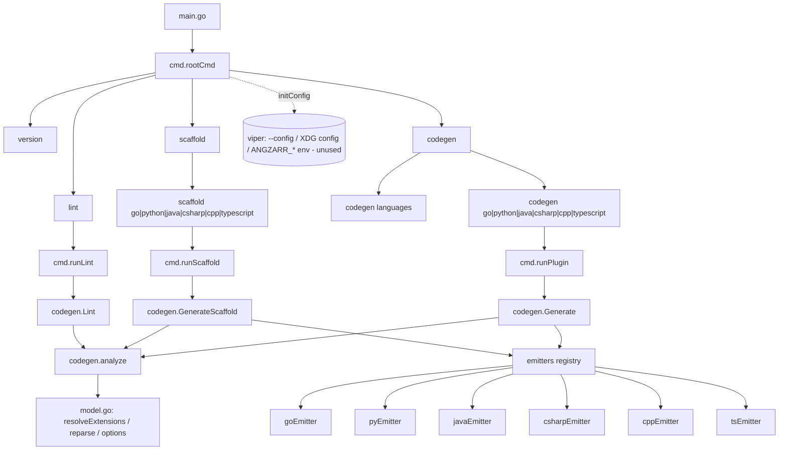
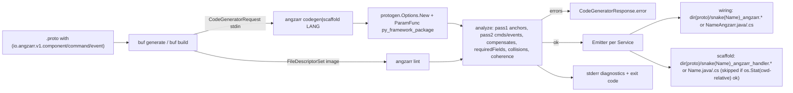
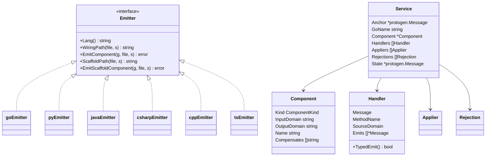
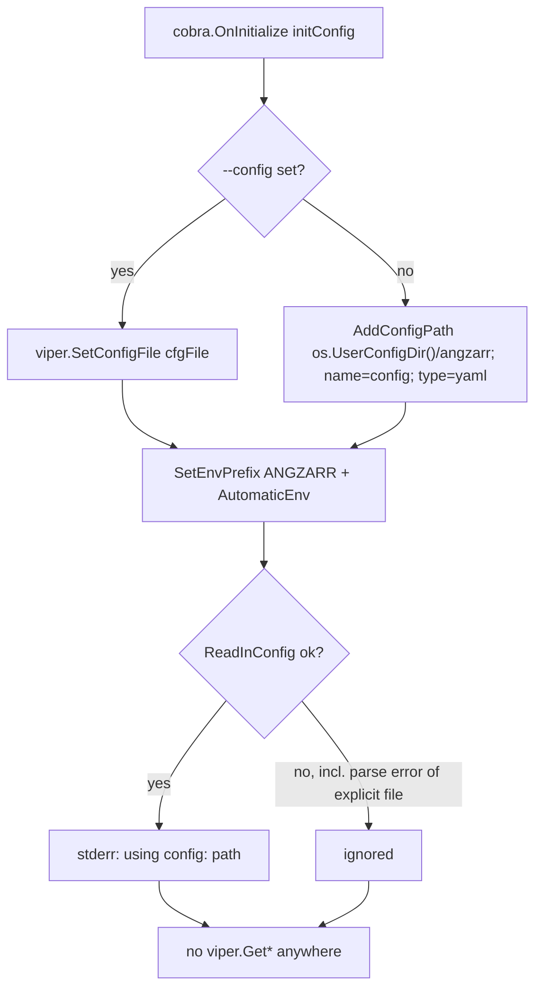
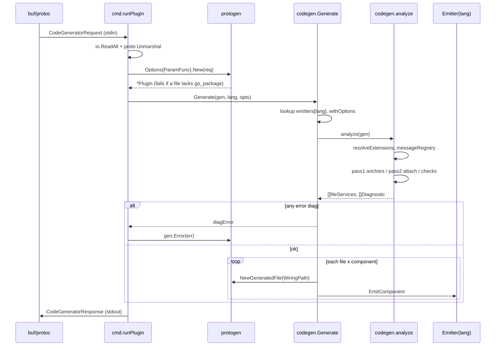
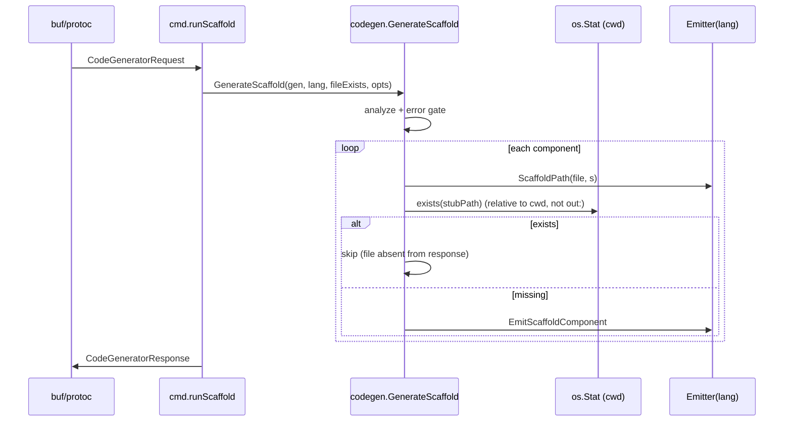
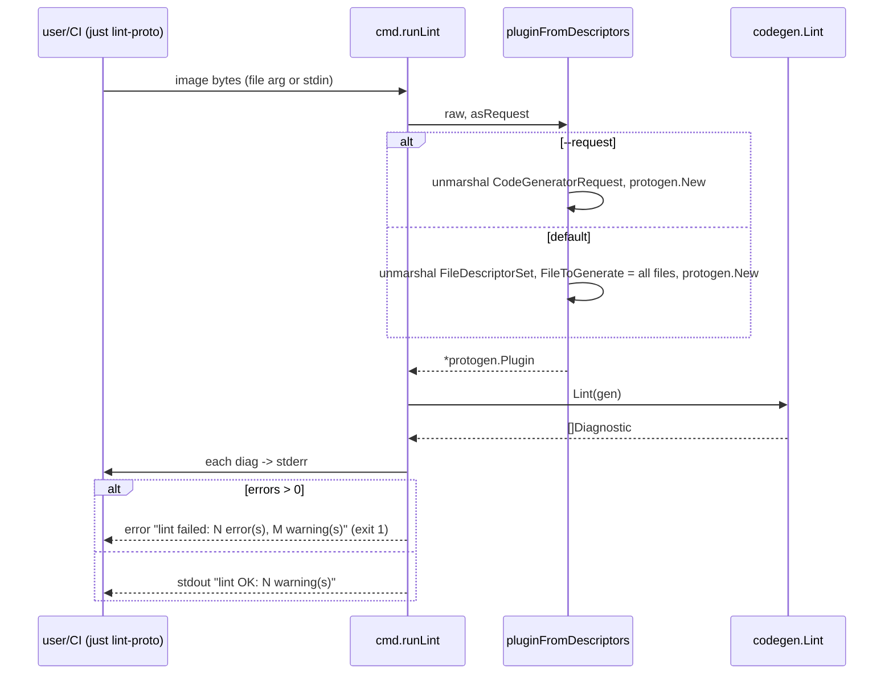
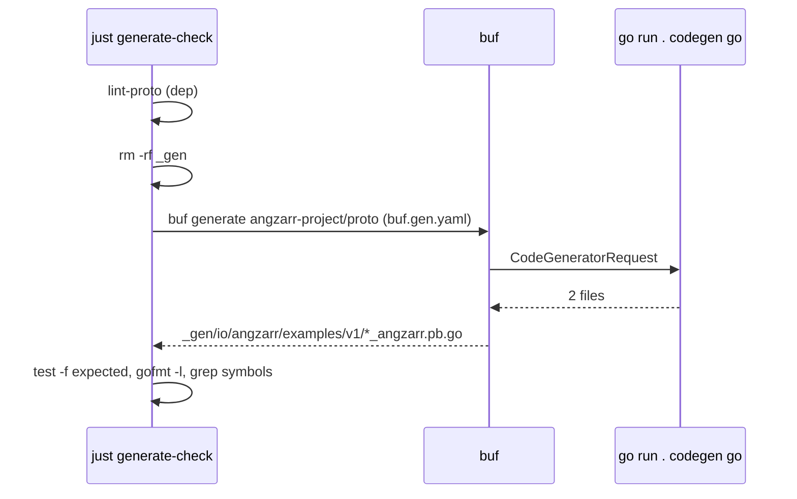

# angzarr-cli

Repo: `/home/babbitt/workspace/angzarr/angzarr-cli/main` (branch main, HEAD `02a6b37`). Module `github.com/angzarr-io/angzarr-cli` (go 1.24.4; cobra, viper, google.golang.org/protobuf). Submodule `angzarr-project` @ `531d91e`. All paths below are relative to the repo root.

Verification done: read all of `cmd/`, `codegen/`, `justfile`, `buf.gen.yaml`, README, docs. Ran `go test ./...` and `go vet` (both pass). Built the binary into the scratchpad and ran `lint`, `codegen <lang>` and `scaffold <lang>` for all 6 languages against `angzarr-project/proto` through `buf generate`, with output in the scratchpad only.

## 1. Summary
- The CLI is offline only. It never makes gRPC calls, never runs kubectl or helm, and never reads the network. Its surface is 3 functional command groups: `codegen <lang>` (protoc plugin), `scaffold <lang>` (protoc plugin), and `lint` (descriptor-set validator). There is also `version` and `codegen languages` (`cmd/*.go`).
- Its single job is to read message-level custom options `(io.angzarr.v1.component|command|event)` (ext numbers 50100/50104/50105, `codegen/model.go:46-48`) and emit per-component dispatch wiring over the **angzarr-router FFI bindings**, not the client-* libraries (`codegen/golang.go:36-37`, `python.go:47`, `java.go:27-38`, `csharp.go:26-37`, `cpp.go:26-37`, `typescript.go:38`).
- Pipeline: `protogen.Plugin` → `analyze()` builds the model and collects diagnostics (`codegen/lint.go:109-183`) → error-severity diagnostics block emission (`codegen/generate.go:91-94`) → one `Emitter` per language writes 1 wiring file per component (`generate.go:96-103`).
- Six emitters are registered in a static map: go, python, java, csharp, cpp, typescript (`codegen/generate.go:40-47`). Cobra subcommands are generated from that registry (`cmd/codegen.go:39-44`, `cmd/scaffold.go:43-46`).
- Options are decoded dynamically, keyed on extension number, so the CLI has no compiled angzarr protos (`codegen/model.go:1-24,127-160`). `_gen/` is only a disposable self-check output (`justfile:26-47`, `.gitignore`).
- Viper config and `ANGZARR_*` env are wired up (`cmd/root.go:38-53`), but no code reads any key. This is dead configuration.
- **High:** `scaffold` for any component without an explicit `name` (every saga marker, including the canonical `TableHandSaga`) emits a type with the same name as the anchor proto message. In Go, Java, C# and C++ that is a compile error. Lint does not catch it. Verified on the canonical protos.
- **High:** `scaffold`'s "generate once" guard checks `os.Stat(path)` relative to the process cwd, not the `out:` dir (`cmd/scaffold.go:100-103`). With any `out:` other than `.`, developer-owned stubs are silently overwritten. Verified: an appended marker was wiped on re-run.
- **Medium parity break:** Python projectors filter on the union of the handlers' `(event).domain` values (`python.go:452-470`). The other 5 emitters filter on `component.input_domain` (`golang.go:383`, `java.go:299`, `csharp.go:292`, `cpp.go:296`, `typescript.go:382`).
- The docs are substantially stale. README describes services/rpcs and an old `Emitter` API. Header comments in the Java, C# and C++ emitters describe a per-proto-file layout that was replaced by per-component files.

## 2. Command inventory
| Command | Flags | Location path:line | What it does | External deps |
|---|---|---|---|---|
| `angzarr` (root) | `--config string` (persistent) | `cmd/root.go:14-22,31-34` | Root command with `SilenceUsage`. `cobra.OnInitialize(initConfig)` loads viper config and env | FS: `--config` file or `$XDG_CONFIG_HOME/angzarr/config.yaml` (`root.go:38-53`); env `ANGZARR_*`. None of it is consumed |
| `angzarr version` | – | `cmd/version.go:11-20` | Prints `cmd.version`, which is `"dev"` unless set by `-ldflags -X` | none; `justfile:9` build does not stamp it |
| `angzarr codegen` | – | `cmd/codegen.go:26-37,39-53` | Parent command only | – |
| `angzarr codegen languages` | – | `cmd/codegen.go:43-51` | Prints `codegen.Languages()` sorted | – |
| `angzarr codegen <go\|python\|java\|csharp\|cpp\|typescript>` | none. The plugin params come through `CodeGeneratorRequest.parameter`: `paths=…`, `M…`, `module=…` (protogen) and `py_framework_package=<pkg>` (`cmd/codegen.go:87-94`). Any other param is an error | `cmd/codegen.go:55-64,72-108` | protoc/buf plugin. Reads CodeGeneratorRequest on stdin, runs `codegen.Generate` and writes CodeGeneratorResponse on stdout. Generation errors go into `resp.error` (`codegen.go:99-101`) | stdin/stdout. Every request file needs `go_package` (protogen requirement, `cmd/lint.go:112`) |
| `angzarr scaffold <lang>` | same plugin params as codegen (`cmd/scaffold.go:75-82`) | `cmd/scaffold.go:30-41,50-59,64-96` | protoc plugin. Emits a handler stub only when `os.Stat(<response path>)` fails | FS read relative to **cwd** (`scaffold.go:100-103`) |
| `angzarr lint [image\|-]` | `--request bool` (reads a CodeGeneratorRequest instead of an FDS/buf image) | `cmd/lint.go:26-55,57-60,64-87,94-115` | Parses a FileDescriptorSet or buf image (or a request). Marks every file for generation, runs `codegen.Lint` and prints diagnostics to stderr. Exits 1 on any error-severity diagnostic | FS (file arg) or stdin. Input is typically `buf build proto -o -` |

## 3. Component inventory
| Component | Kind | Location path:line | Responsibility | Depends on |
|---|---|---|---|---|
| `main` | entrypoint | `main.go:8-10` | Calls `cmd.Execute()` | cmd |
| `rootCmd` / `initConfig` | cobra root + viper init | `cmd/root.go:14-53` | CLI root and config loading (unused) | cobra, viper |
| `runPlugin` | protoc plugin adapter | `cmd/codegen.go:72-108` | Request unmarshal, protogen with ParamFunc, `codegen.Generate`, response marshal. Does not use `protogen.Options.Run` (`codegen.go:70-71`) | protogen, pluginpb, codegen |
| `runScaffold` / `fileExists` | protoc plugin adapter | `cmd/scaffold.go:64-103` | Same shape as `runPlugin`, plus an existence predicate. Duplicates about 30 lines of `runPlugin` | codegen |
| `runLint` / `pluginFromDescriptors` | CLI adapter | `cmd/lint.go:64-115` | FDS or request → `protogen.Plugin` → `codegen.Lint` → diagnostics | codegen |
| `Emitter` | interface | `codegen/generate.go:16-29` | `Lang`, `WiringPath`, `EmitComponent`, `ScaffoldPath`, `EmitScaffoldComponent` | protogen |
| `emitters` registry, `Languages` | package var | `codegen/generate.go:40-57` | Static language → emitter map | 6 emitters |
| `Options` / `withOptions` | config struct | `codegen/generate.go:69-81` | Only `PyFrameworkPackage`, injected into `pyEmitter` | – |
| `Generate` / `GenerateScaffold` | orchestrators | `codegen/generate.go:83-105,113-139` | Set FEATURE_PROTO3_OPTIONAL, `analyze`, gate on errors, iterate `fileServices` × `Service` | analyze, emitters |
| `componentFile` | path helper | `codegen/generate.go:34-36` | `dir(GeneratedFilenamePrefix)/stem+suffix`. Depends on protogen's Go-oriented `paths=` handling | protogen |
| Extension decoding (`resolveExtensions`, `dynamicTypes`, `reparse`, `componentOptions`/`commandOptions`/`eventOptions`) | dynamic proto reflection | `codegen/model.go:127-327` | Finds the ext descriptors by number on `google.protobuf.MessageOptions`, rebuilds them against the process `descriptor.proto`, and re-decodes message options | protodesc, dynamicpb |
| Model types `Component`, `command`, `eventConsumer`, `Handler`, `Applier`, `Rejection`, `Service`, `fileServices` | IR | `codegen/model.go:82-106,334-383,425-428` | Intermediate model that the emitters consume | – |
| `analyze` | model builder + validator | `codegen/lint.go:109-183` | Pass 1: anchors. Pass 2: attach commands/events. Then compensates, required fields, collisions and coherence; results grouped by anchor file (`file.Generate` only) | model.go |
| Diagnostics (`Severity`, `Diagnostic`, `Lint`, `HasErrors`, `diagError`, `posOf`) | lint API | `codegen/lint.go:28-104,381-418` | Stable `ANZxxx` codes and source positions from SourceCodeInfo | protodesc |
| `goEmitter` | emitter | `codegen/golang.go:41-445` | `*_angzarr.pb.go` and `*_angzarr_handler.go` over `angzarr-router/bindings/go` | angzarr-router Go binding |
| `pyEmitter` | emitter | `codegen/python.go:59-521` | `*_angzarr.py` / `*_angzarr_handler.py`. Uses relative imports or `frameworkPkg` | `angzarr_router_ffi`, protoletariat-style layout |
| `javaEmitter` | emitter | `codegen/java.go:51-379` | `<Name>Angzarr.java` / `<Name>.java`, with fully-qualified names under `io.angzarr.router` and `io.angzarr` | Java router binding |
| `csharpEmitter` | emitter | `codegen/csharp.go:49-377` | `<Name>Angzarr.cs` / `<Name>.cs`, under `Angzarr.Router` and `Angzarr` | C# router binding |
| `cppEmitter` | emitter | `codegen/cpp.go:50-389` | `*_angzarr.h` / `*_angzarr_handler.h`, `angzarr::router::*`, includes `angzarr/router/router.h` | C++ router binding |
| `tsEmitter` | emitter | `codegen/typescript.go:69-473` | `*_angzarr.ts` / `*_angzarr_handler.ts`, using `@angzarr/router` and `@bufbuild/protobuf` `create` | TS router binding, protoc-gen-es `_pb` modules |
| `justfile` | build | `justfile:1-55` | `build`, `test`, `lint` (go vet), `lint-proto`, `generate-check`, `fmt`, `fmt-fix`, and imports `angzarr-project/submodule.just` | buf, go, gofmt |
| `buf.gen.yaml` | self-check config | `buf.gen.yaml:5-9` | `go run . codegen go` → `_gen`, source_relative | – |
| `lefthook.yml` | git hooks | `lefthook.yml:9-28` | Submodule guard, `fmt-fix`, `test` on pre-commit | just |

## 4. Architecture diagram(s)

## 5. Sequence diagrams

### 5.1 `angzarr codegen <lang>` (buf plugin)

- stdin is read and unmarshalled at `cmd/codegen.go:73-80`.
- `ParamFunc` accepts only `py_framework_package` and rejects anything else (`cmd/codegen.go:87-94`). protogen handles `paths`, `M` and `module` itself.
- The unknown-language check is at `codegen/generate.go:84-87`. Python options are injected at `generate.go:88,75-81`.
- `analyze` runs at `codegen/lint.go:109-183`. Extensions are resolved at `codegen/model.go:127-160`.
- The error gate is `codegen/generate.go:91-94`. It is surfaced through `gen.Error` at `cmd/codegen.go:99-101`, so the process exits 0 and buf reports the error.
- Emission is one file per component: `codegen/generate.go:96-103`.
- The response is marshalled at `cmd/codegen.go:102-107`.

### 5.2 `angzarr scaffold <lang>`

- Plugin plumbing is at `cmd/scaffold.go:64-96`. The predicate is at `cmd/scaffold.go:100-103`.
- The skip logic is `codegen/generate.go:128-131`. A `nil` predicate overwrites (`generate.go:111-112`).
- Stub shapes:
  - Go: `golang.go:76-106`, which writes `type <Name> struct{}` and `var _ <Name>Handler = <Name>{}`.
  - Python: `python.go:233-252`.
  - Java: `java.go:359-379`.
  - C#: `csharp.go:355-377`.
  - C++: `cpp.go:363-389`.
  - TS: `typescript.go:455-473`.

### 5.3 `angzarr lint`

- The file-or-stdin choice is `cmd/lint.go:43-51`.
- The FDS path marks every file for generation (`cmd/lint.go:102-109`). A build error hints at go_package or managed mode (`lint.go:110-113`).
- The `--request` path is `cmd/lint.go:95-100`. It has no `ParamFunc`, so a request carrying `py_framework_package` fails.
- Output and exit handling: `cmd/lint.go:74-86`.
- The justfile entry point is `justfile:18-19`: `buf build angzarr-project/proto -o - | go run . lint -`. On the current canonical protos it gives 1 warning (ANZ101 for `TableHandSaga` → `hand`) and exits 0. Verified.

### 5.4 `just generate-check` (self-check pipeline)

- The recipe is `justfile:25-47`. It checks only that the output exists, is gofmt-clean and contains the expected symbols. It does not compile. Compile and conformance testing is delegated to angzarr-router (`justfile:49-52`).
- `version` is not diagrammed: it is trivial (`cmd/version.go:14-19`). The CLI has no projector, config, rename or cluster/gateway commands.

## 6. Key invariants & contracts
- **Declaration surface:** message options only, with no services or rpcs. The extension numbers 50100/50104/50105 on `google.protobuf.MessageOptions` are the contract, not package names (`codegen/model.go:40-48`). Matching by number lets `io.angzarr.v1` and the legacy `angzarr_client.proto.angzarr.v1` decode the same way (tests at `codegen/generate_test.go:330-361`).
- **Options.proto dependency limit:** it must import only `google/protobuf/descriptor.proto`. Otherwise the rebuild at `model.go:139-142` fails silently, no extensions are found, and nothing is generated and nothing is linted.
- **ComponentKind enum numbers are wire contract:** 0 = UNSPECIFIED, 1 = AGGREGATE, 2 = SAGA, 3 = PM, 4 = PROJECTOR (`model.go:57-64`). UNSPECIFIED is treated as "no component" (`model.go:284-286`).
- **Required fields** (ANZ008, `lint.go:253-276`):
  - aggregate: `input_domain`
  - saga: `input_domain` + `output_domain`
  - PM: `output_domain`, and every non-`applies` trigger needs `(event).domain` (ANZ006)
  - projector: `input_domain`
- **Type references:** `component`, `emits` and `compensates` must be fully-qualified message names present in the compiled set (ANZ002/004/005/007).
- **Diagnostic codes:** Errors are ANZ001–008, ANZ010 and ANZ011. Warnings are ANZ100–103. ANZ009 is unassigned. Output format is `file:line:col: severity[CODE]: msg` (`lint.go:65-73`).
- **Method naming:**
  - Command handler: the command's GoName.
  - Trigger handler: the event's GoName.
  - Applier: `Apply` + event GoName (`model.go:412-414`).
  - Rejection: `On<Short>Rejected` (`lint.go:158`).
  - Python uses snake_case; Java and TS use lowerFirst.
- **Typed emit:** exactly one `emits` gives a typed list return and the wiring packs the EventBook. Zero or more than one gives a raw EventBook (`model.go:352-354`).
- **Dispatch key:** the fully-qualified proto name (`golang.go:449-455`).
- **Output layout** is `dir(file.GeneratedFilenamePrefix)` joined with (`generate.go:34-36`):

| lang | wiring | scaffold |
|---|---|---|
| go | `snake(Name)_angzarr.pb.go` (`golang.go:45-47`) | `snake(Name)_angzarr_handler.go` (`golang.go:49-51`) |
| python | `snake(Name)_angzarr.py` (`python.go:63-65`) | `snake(Name)_angzarr_handler.py` (`python.go:67-69`) |
| java | `<Name>Angzarr.java` (`java.go:58-60`) | `<Name>.java` (`java.go:62-64`) |
| csharp | `<Name>Angzarr.cs` (`csharp.go:55-57`) | `<Name>.cs` (`csharp.go:59-61`) |
| cpp | `snake(Name)_angzarr.h` (`cpp.go:54-56`) | `snake(Name)_angzarr_handler.h` (`cpp.go:58-60`) |
| typescript | `snake(Name)_angzarr.ts` (`typescript.go:73-75`) | `snake(Name)_angzarr_handler.ts` (`typescript.go:77-79`) |

- **Output location is Go-oriented for every language.** Because `GeneratedFilenamePrefix` follows protogen's Go rules, non-Go targets need `opt: paths=source_relative` and a `go_package` (or `M` mapping) on every request file. The docs require managed mode for this (`docs/developer-experience.md:109-116`).
- **Scaffold contract:** requires `out: .` and `paths=source_relative`, and buf must run from the module root (`cmd/scaffold.go:15-21`).
- **Python import contract:**
  - Default: domain and framework modules are imported relatively (`python.go:139-149`).
  - With `py_framework_package=<pkg>`: framework modules (`io/angzarr/v1/*`, `sererr/*`, `python.go:161-163`) are imported from `<pkg>.io.angzarr.v1.*_pb2` (`python.go:173-178`).
  - A top-level proto (no dir) is imported absolutely (`python.go:200-201`).
- **Config:** `--config`, then `$XDG_CONFIG_HOME/angzarr/config.yaml`, plus `ANGZARR_*` env (`root.go:38-53`). The config format is YAML, but no keys are defined or read anywhere.

## 7. Findings
| ID | Severity | Category | path:line | Finding | Suggested direction |
|---|---|---|---|---|---|
| F1 | high | correctness | `codegen/golang.go:91-93`, `java.go:367`, `csharp.go:363`, `cpp.go:374`, `model.go:432-437` | The scaffold stub type name is `s.GoName`, which defaults to the anchor message name. It is emitted in the same package/namespace as the proto-generated message, so they collide: Go redeclaration, Java/C# duplicate class, C++ redefinition (the stub includes the wiring, which includes the `.pb.h`). Every saga without `name` hits this. Verified: the canonical `TableHandSaga` Go stub has `type TableHandSaga struct{}` and protoc-gen-go also emits `type TableHandSaga struct` (`components.proto:24`). The docs call it a "gotcha" (`docs/developer-experience.md:362-367`), but lint doesn't enforce it. | Add a lint error (e.g. ANZ012) when the effective name equals the anchor message name, or give the stub a suffix such as `<Name>Impl`. Fix the canonical `TableHandSaga` in angzarr-project. |
| F2 | high | correctness / ux | `cmd/scaffold.go:100-103`, `codegen/generate.go:128-131` | The generate-once guard uses `os.Stat(responsePath)` relative to the process cwd, not buf's `out:` dir. With any `out:` other than `.`, or when buf runs from a subdirectory, the check always misses and the developer-owned stub is **overwritten**. Verified: `// MINE` appended to a stub under `out: out_go` was wiped on re-run. | Fail fast when the parameters don't match `paths=source_relative`, or accept an explicit `out_dir=` plugin parameter and resolve against it. At minimum, refuse to emit when the target's parent dir doesn't exist relative to cwd. |
| F3 | medium | correctness (parity) | `codegen/python.go:452-470` vs `golang.go:383`, `java.go:299`, `csharp.go:292`, `cpp.go:296`, `typescript.go:382` | Projector domain filtering diverges. Python uses the union of the handlers' `(event).domain` and ignores `input_domain`; with no handler domains it filters nothing. The other 5 use the single `component.input_domain`. The Python fix (commit `d8a9958`) was not propagated. No test covers `ForDomains`/`for_domains`. | Pick one contract, put it in a cucumber feature in angzarr-project, and apply it to all 6 emitters. Consider making `input_domain` optional or repeated for projectors. |
| F4 | medium | correctness | `codegen/lint.go:295-299,319-329` | ANZ011 checks duplicates only within handlers and within appliers, not across them or against rejections or the projector's fixed `Finish`. Examples: command `ApplyFoo` + event `Foo` on one aggregate gives two `ApplyFoo` methods; an event named `Finish` on a projector; an event named `OnXRejected`. All produce uncompilable interfaces. | Check one combined method-name set per Service, including `Finish`/`finish` for projectors and the snake/lowerFirst variants. |
| F5 | medium | error-handling | `codegen/model.go:127-160`, `lint.go:75-81` | If the options extensions can't be resolved (options.proto missing from the request, or an options.proto that imports anything besides descriptor.proto so the rebuild at `model.go:139-142` fails), `analyze` finds no components. `lint` prints "lint OK" and codegen emits nothing, with no signal. | Emit a warning or error when any file imports an options.proto-like file (a MessageOptions extension at 50100) that couldn't be rebuilt, or when annotated option bytes stay unknown. |
| F6 | medium | design | `codegen/lint.go:118-148,166-181` + buf default `strategy: directory` | Components span files by string reference, not imports. buf invokes local plugins per directory by default. Consequences: a command or event in directory A whose anchor is in directory B, and which doesn't import B, fails with ANZ002/005 in A's run; B's run produces an interface missing those handlers. | Document `strategy: all` for the angzarr plugins, or detect a partial request (FileToGenerate ⊂ files that reference anchors) and error. |
| F7 | medium | dead-code | `cmd/root.go:31-53` | Viper config, `--config` and `ANGZARR_*` env are initialised for every command, including plugin mode, but no `viper.Get*` exists anywhere. An explicit `--config` that fails to parse is silently ignored (`root.go:50`). | Remove viper, or define real keys. If kept, error when an explicit `--config` fails to read. |
| F8 | medium | naming / docs | `README.md:9-14,24,44`; `docs/developer-experience.md:135,137-141,281` | README describes services/rpcs with `(angzarr.v1.rejected/applies/reacts)`, `out: proto`, and an Emitter with `Suffix, EmitFile`, none of which exist now. The DX doc says only "`go` and `python`" are supported, gives `<proto>_angzarr.pb.go` naming (it is now per-component `snake(Name)`), and shows a saga signature without `sourceCover`. | Rewrite README from `generate.go:16-29` and the current option surface, and update the DX doc. |
| F9 | low | naming (stale comments) | `codegen/java.go:3-13,110,390-397`; `csharp.go:3-8,353-354`; `cpp.go:3-6,361` | The header comments say "each proto file's components are emitted into ONE wiring file … named `<protofile>_angzarr`". The code is per-component `<Name>Angzarr` / `snake(Name)_angzarr.h`. `java.go:110` mentions a "(future) scaffold" that already exists. The `parseAny` doc at `java.go:390-397` is an unedited stream of thought. The C# and C++ comments refer to a nonexistent `EmitScaffold`. | Rewrite the comments to describe current behavior. |
| F10 | low | naming | `codegen/generate.go:59-68` | `Generate`'s doc comment is attached to `type Options`, so `Generate` has no godoc and `Options` has a wrong one. | Split the comment. |
| F11 | low | dead-code | `codegen/lint.go:124-127` | ANZ001 (duplicate component) is unreachable: `services` is keyed by message full name, and protogen/protoregistry already reject duplicate full names in `protogen.Options.New`. | Remove it, or re-key on something that can actually collide. |
| F12 | low | complexity | `cmd/codegen.go:72-108` vs `cmd/scaffold.go:64-96` | The plugin read/parse/ParamFunc/marshal code is duplicated nearly line for line. A new plugin param has to be added in 2 places, and 3 counting lint's `--request` path, which has no ParamFunc (`cmd/lint.go:95-100`). | Extract a single `newPlugin(in, params)` and `writeResponse` pair. |
| F13 | low | complexity | `codegen/java.go:432-443`, `csharp.go:438-449`, `cpp.go:428-439`, `typescript.go:479-491`; `python.go:551-566` ≡ `typescript.go:538-553`; `python.go:569-579` | 4 copies of the nested-name parent walk, 2 identical quote functions, and a hand-rolled `itoa` ("strconv-free", although strconv is stdlib). | Share one `nestedNames(md) []string` and join per language; use `strconv.Itoa`. |
| F14 | low | correctness | `codegen/cpp.go:404-406` | `cppQuote` doesn't escape `"` or `\`, unlike every other emitter's quote. Domain strings are free-form option values. | Escape, or reuse `quote` (Go `%q` is valid C++ for ASCII). |
| F15 | low | correctness | `codegen/cpp.go:448-454` vs `cpp.go:54-56` | The scaffold's `#include` uses `file.Desc.Path()`'s dir, but the wiring is written at `dir(GeneratedFilenamePrefix)`. They diverge unless `paths=source_relative`. | Derive the include from `WiringPath`. |
| F16 | low | ux | `cmd/version.go:11`, `justfile:8-9` | `just build` doesn't stamp `-ldflags -X …cmd.version`, so `angzarr version` always prints `dev`. The repo has no release config. | Stamp from `git describe` in `build`. |
| F17 | low | design | `justfile:41,56` | `generate-check` and `fmt` write fixed `/tmp/angzarr-cli-*.out` files, so parallel runs race and the files are left behind. | Use `mktemp` or pipe directly. |
| F18 | low | correctness | `codegen/java.go:482-498` | `snakeToPascal` for the Java outer class doesn't capitalise after digits the way protoc does (`foo2bar` → protoc `Foo2Bar`). This only matters when `java_multiple_files=false`. | Match protoc's `UnderscoresToCamelCase`. |

## 8. Open questions / unclear areas
- TS: the wiring and scaffold import protobuf-es v2 message **types** (`Foo`) without the `type` modifier alongside `FooSchema` values (`typescript.go:142-149`). Under `verbatimModuleSyntax` or `isolatedModules` this may be an error (TS1484). What tsconfig does the TS binding and consumer use? Not verified.
- Go framework-type duplication: domain protos that reference `io.angzarr.v1` messages get protoc-gen-go imports of `options.proto`'s `go_package` (`github.com/benjaminabbitt/angzarr/client/go/proto/io/angzarr/v1`, `options.proto:7`). The generated wiring uses `github.com/angzarr-io/angzarr-router/bindings/go/gen/io/angzarr/v1` (`golang.go:37`). Two Go packages would then register the same proto names. Is this resolved by an `M` mapping or managed-mode override in consumers?
- Java output dir = proto dir (`io/angzarr/examples/v1`), but package = `java_package` (`io.angzarr.examples`). Is that acceptable to the Gradle/Maven layout in the consumers?
- Saga and projector `(event).domain` is carried in `Handler.SourceDomain`, but saga dispatch ignores it in every emitter; it uses `component.input_domain`. Should lint flag an event domain that differs from the saga's `input_domain`?
- Empty proto package gives C++ `namespace  {` (an anonymous namespace in a header, `cpp.go:73`) and C# `namespace ;` (`csharp.go:68`). Are packageless protos officially unsupported?
- `Handler.Emits` with duplicate entries (e.g. `[A, A]`) counts as multi-type and falls back to a raw EventBook (`model.go:352-354`). Is that intended?
- No CI workflow exists in the repo (`.github/` is absent). Is this CLI tested in CI anywhere other than downstream via angzarr-router (`justfile:49-52`)?

## 9. Cross-repo interface surface
- **angzarr-project (submodule `angzarr-project`, `.gitmodules`):**
  - Proto root is `angzarr-project/proto` (`justfile:19,32`).
  - `io/angzarr/v1/options.proto` provides ext 50100/50104/50105 and the field names `kind`, `input_domain`, `output_domain`, `name`, `compensates`, `component`, `emits`, `domain`, `applies`, read by name at `model.go:265-327`.
  - `generate-check` expects `io/angzarr/examples/v1/{table,components}.proto` to yield `TableAggregate` and `TableHandSaga` (`justfile:34-45`).
  - `justfile:5` imports `angzarr-project/submodule.just`, which provides `install-submodule-hooks` and `check-submodules-clean`.
- **angzarr-router:** all generated code targets the router bindings, not client-*.
  - Go: `github.com/angzarr-io/angzarr-router/bindings/go`, symbols `SagaDispatch`, `NewSagaDispatch`, `AggregateDispatch[T]`, `NewAggregateDispatch`, `ProcessManagerDispatch[T]`, `ProjectorDispatch[T]`, `NewRebuilder`, `Rebuilder.WithSnapshot/Apply`, `Destinations`, `CommandContext`, `Pack`, `AnyDecodeError`, `Router.RegisterSaga`, `RegisterAggregate/RegisterProcessManager/RegisterProjector` (free funcs), `ForDomains`, `Finish`, `OnEvent`, `OnCommand`, `OnRejected`. Framework protos come from `.../bindings/go/gen/io/angzarr/v1` (`golang.go:36-37`).
  - Python: module `angzarr_router_ffi` (`Rebuilder`, `AggregateDispatch`, `SagaDispatch(targets=)`, `ProcessManagerDispatch`, `ProjectorDispatch.for_domains/finish`, `pack`, `any_decode_error`, `Router.register_*`, `Destinations`, `CommandContext`), plus framework pb2 `io.angzarr.v1.{types,command_handler,process_manager}_pb2`, optionally under `py_framework_package` such as `angzarr_router_ffi.gen` (`python.go:40-51,170-208`, `cmd/codegen.go:83-86`).
  - Java: `io.angzarr.router.{Router,AggregateDispatch,SagaDispatch,ProjectorDispatch,ProcessManagerDispatch,Rebuilder,CommandContext,Destinations,Pack,CodedError.parse,Thunks.SagaEmission,Thunks.PmRejection}`; messages `io.angzarr.*` (`java.go:26-49`).
  - C#: `Angzarr.Router.{…,CodedError.Parse,Pack.Wrap,SagaEmission,PmRejection}`; messages `Angzarr.*`; `Google.Protobuf.MessageExtensions.MergeFrom` (`csharp.go:25-47,231`).
  - C++: header `angzarr/router/router.h`, `angzarr::router::{…,CodedError::Parse<T>/Merge,Pack::Wrap}`, messages `io::angzarr::v1::*`, `.pb.h` includes by proto path (`cpp.go:25-48,68,442-444`).
  - TS: npm `@angzarr/router` (`Router`, dispatches, `Rebuilder`, `Pack.merge/wrap/eventBook`, `parseAny`, `SagaEmission`, `PmRejection`, framework message types), plus `@bufbuild/protobuf` `create` and protoc-gen-es `*_pb` modules imported by relative extensionless paths (`typescript.go:37-67,493-505`).
  - The README states that compile and conformance validation of the generated code lives in angzarr-router, which bakes this CLI into its Go toolchain image (`justfile:49-52`).
- **Consumers (examples-*, client repos):**
  - They must run the plugins via buf with `paths=source_relative`, and use managed mode or a `go_package` on every file (`docs/developer-experience.md:109-130`).
  - Framework protos should have managed mode disabled for Python descriptor-pool identity (`docs/developer-experience.md:146-181`).
  - Scaffold must use `out: .` (see F2).
  - The Python generated tree assumes protoletariat-style relative pb2 imports (`python.go:19-23`).
  - Consumers pin the CLI through go.mod (`buf.gen.yaml:1-4`).
- **Env vars / endpoints:** only `ANGZARR_*` (unused, `root.go:48-49`) and `$XDG_CONFIG_HOME`. No network endpoints, no core/coordinator gRPC services, no kubectl/helm, and no cluster ports.
