# angzarr-project
Repo: /home/babbitt/workspace/angzarr/angzarr-project @ fix/pin-denest-hook-core bc1ed7e (working tree clean; branch is local-only — `git branch -r --contains bc1ed7e` → none; it forks from d3fb20b and is **68 commits behind origin/main 5b02b1f**, which has since moved `features/example/unit/*` → `features/example/{poker,framework}/*`, deleted `game_rules/betting_round/raise_tracking` from `unit/`, and changed `options.proto` + 9 example protos. Framework `io/angzarr/v1/*.proto` except options.proto are identical to origin/main.)

## 1. Summary
- angzarr-project holds three contract kinds: framework protos (`proto/io/angzarr/v1`, 11 files, 8 services / 24 rpcs), poker example protos (`proto/io/angzarr/examples/v1`, 11 files), and Gherkin specs in 3 trees: `features/client` (16), `features/coordinator-contract` (4), `features/example/{unit,acceptance}` (13), `parity/client` (12). 1021 scenarios total, 276 carry no scenario-ID tag.
- **No CI validates the protos or features.** `.github/workflows` has only `build-images.yml` and `deploy.yml`; buf lint/breaking (configured in `proto/buf.yaml:4-18`) never runs. Consequence visible in the protos: 16 removed field numbers are commented-but-unreserved.
- **Core spec contradictions (high):** (a) saga.proto says sagas emit `angzarr_deferred` and the *framework* stamps sequences, while saga.feature C-0052/53, wire_parity.feature and client-rust `Destinations::stamp_command` stamp an explicit `PageHeader.sequence` — which, being in the same `oneof`, erases the `AngzarrDeferredSequence` provenance that rejection routing depends on. (b) `MergeStrategy.MERGE_COMMUTATIVE` = "allow if field mutations don't overlap" in types.proto vs "return FAILED_PRECONDITION retryable" in merge_strategy.feature, which also omits `MERGE_MANUAL`. (c) `EventRequest.route_to_handler` documented "default true" but is a proto3 bool (default false).
- **Large unspecified surface:** zero scenarios for 2PC (`no_commit`, `cascade_id`, Confirmation/Revocation/CascadeCommit/Rollback), `SYNC_MODE_DECISION/ISOLATED`, `CascadeErrorMode`, DLQ (`AngzarrDeadLetter`), `MERGE_MANUAL`, `SnapshotRetention`, `EventStreamService`, `ComponentDescriptor`. `sync_modes.feature` and `poker_game.feature` — still cited by features/example/acceptance/README.md and examples-rust — were deleted in 4024e16.
- `TemporalQuery` comment ("no snapshots") contradicts `Snapshot.created_at` comment (snapshots usable for temporal-by-time).
- Rejection delivery transport is unspecified: no framework rpc accepts `Notification`/`RejectionNotification`, yet features and `components.proto` declare rejection handlers on aggregates and sagas.
- Feature hygiene: duplicate ID @EU-0531 ×7, malformed IDs @EU-1184B..F, poker vocabulary in client tier (multi_handler C-0012, upcaster, testing, decorators), `@wip` left on EA-0004, stale READMEs (unit README omits 4 files; acceptance README cites deleted files). Several poker scenarios contradict themselves or each other (EU-1339 vs EU-1341, EU-1260 ledger, EU-0575 dead button, EU-0844).
- Consumer pins: core d3fb20b (but **core's submodule has staged, never-committed proto edits** that renumber 3 enums and add fields its WIP code depends on); client-rust/examples-rust pin 80ce7c2 but have 16fa309 checked out (12 client-rust feature paths do not exist at 16fa309); examples-rust references `poker_game.feature`/`sync_modes.feature`, which are absent at its pin; router/cli/prj-* use only protos or submodule.just.
- Core keeps its own diverged copies of angzarr-project features (`core/main/features/**`), and its own framework proto `io/angzarr/status/v1/dlq_admin.proto`. Both violate "angzarr-project is the sole source".

## 2. Component inventory
| Component | Kind | path:line | Responsibility | Depends on |
|---|---|---|---|---|
| Core types | proto msgs | proto/io/angzarr/v1/types.proto:21-542 | Cover/Edition/PageHeader/EventBook/CommandBook/Snapshot/Query/Notification/2PC/DLQ/descriptor | any, timestamp, sererr |
| CommandHandlerService | proto svc (client-implemented) | command_handler.proto:17-26 | Handle/HandleFact/Replay | types |
| CommandHandlerCoordinatorService | proto svc (core-implemented) | command_handler.proto:48-80 | HandleCommand/HandleEvent/HandleSyncSpeculative/HandleCompensation (+REST) | types, google.api |
| SagaService / SagaCoordinatorService | proto svc | saga.proto:16-39 | Handle / Execute / ExecuteSpeculative | types |
| ProcessManagerService / …CoordinatorService | proto svc | process_manager.proto:28-56 | Handle / Handle / HandleSpeculative | types |
| ProjectorService / …CoordinatorService | proto svc | projector.proto:16-46 | Handle, HandleSpeculative / HandleSync, Handle, HandleSpeculative | types |
| EventQueryService | proto svc (core) | query.proto:16-31 | GetEventBook, GetEvents, Synchronize, GetAggregateRoots | types |
| EventStreamService | proto svc (core) | stream.proto:15-22 | Subscribe(correlation) | types |
| UpcasterService | proto svc (client) | upcaster.proto:15-19 | Upcast | types |
| Component options | proto ext | options.proto:25-74 | codegen declarations (component/rejected/applies/reacts) | descriptor.proto |
| CloudEvent | proto msg | cloudevents.proto:22-52 | projector→sink payload | any |
| Meta | proto msg | meta.proto:18-21 | DeleteEditionEvents | — |
| sererr | vendored proto | proto/sererr/v1/sererr.proto:59-177 | structured stack traces for DLQ | — |
| googleapis | vendored proto | proto/google/api/{annotations,http}.proto | REST transcoding annotations | descriptor |
| Poker protos | proto msgs + component decls | proto/io/angzarr/examples/v1/*.proto | player/table/hand/tournament/buy-in/rebuy/registration/AI sidecar | framework types, options |
| Client-tier features | Gherkin | features/client/*.feature | router/dispatch/client surface | — |
| Coordinator-contract features | Gherkin (declared "not executed") | features/coordinator-contract/README.md:17-26 | merge/facts/state-building/edition | — |
| Parity features | Gherkin | parity/client/*.feature | cross-language public API names, wire bytes | — |
| Example features | Gherkin | features/example/unit, acceptance | poker rules + cluster E2E | example protos |
| Toolchain images | Containerfiles + skaffold | build/images/skaffold.yaml:18-70 | base/rust/python/go/java/csharp build images | ghcr |
| submodule.just | just recipes | submodule.just:27-142 | install-submodule-hooks, check-submodules-clean | git |
| justfile | just recipes | justfile:1-29 | site dev/build; `vendor` clone | npm, git |

## 3. Architecture diagrams

### 3a. Service / RPC map (who implements vs who calls)
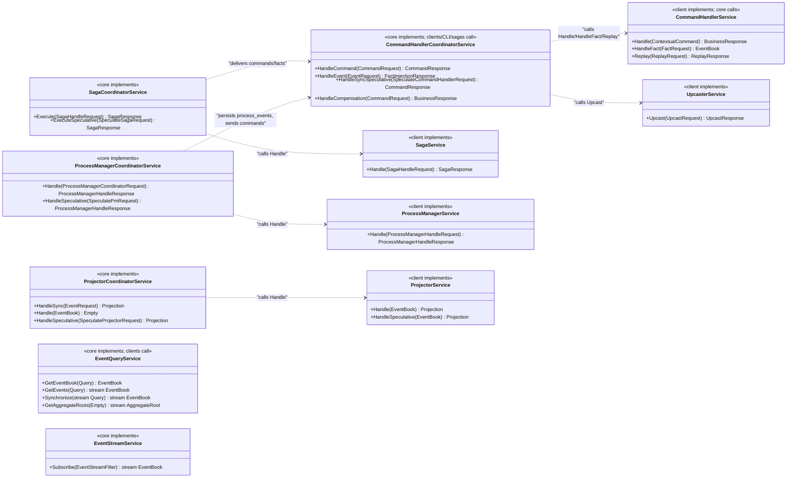

### 3b. Domain model
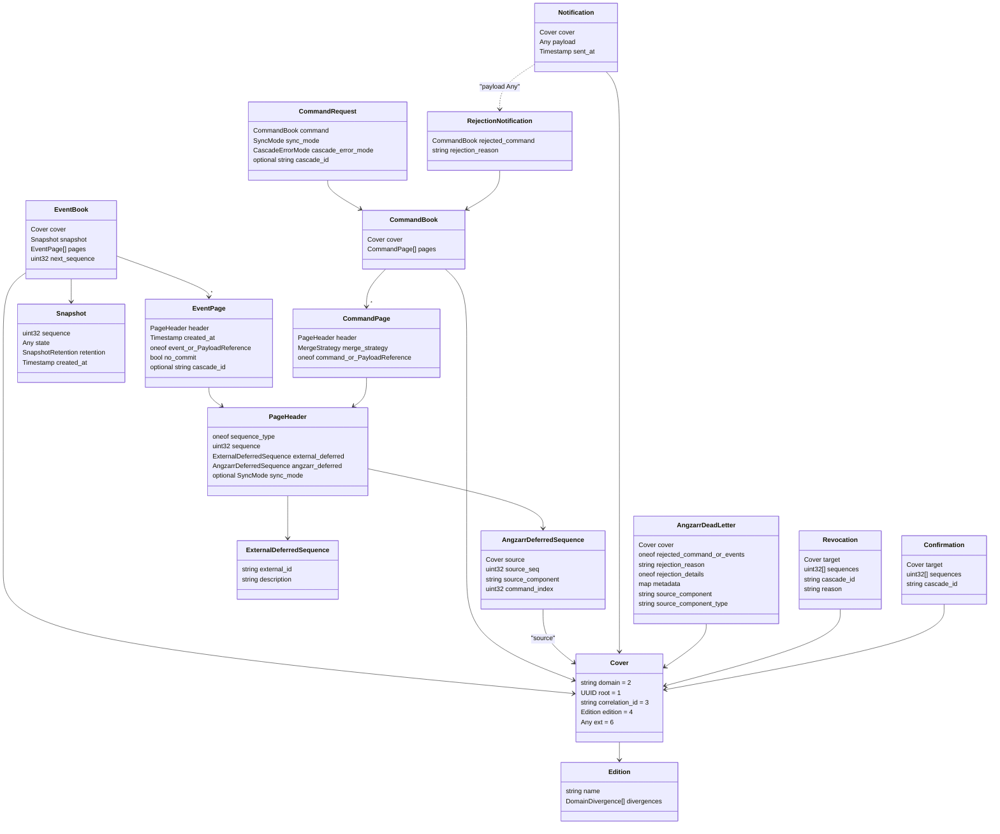

### 3c. Spec tiers and consumers (HEAD bc1ed7e)
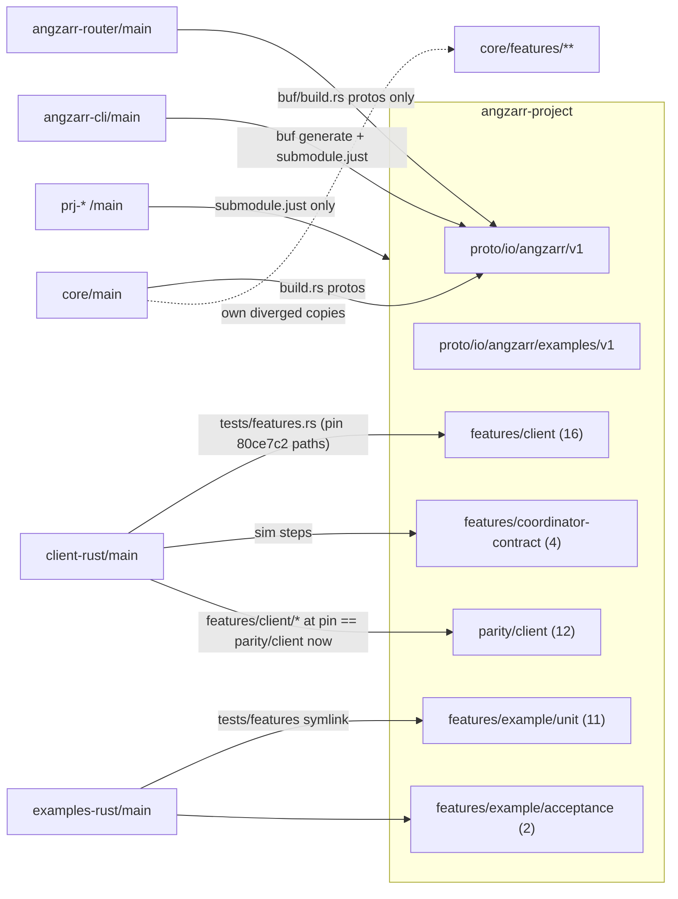

## 4. Sequence diagrams (flows the feature files specify)

### 4a. Aggregate command: dispatch, state rebuild, sequence, merge strategy
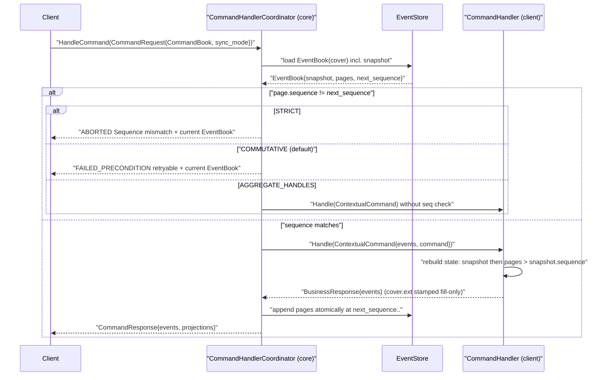
1. Command carries `CommandPage.header.sequence` + `merge_strategy` (types.proto:149-164, 259-266); client builder defaults sequence 0 and COMMUTATIVE (parity/client/command_builder.feature:60-63, 126-128).
2. Stale sequence refused (features/client/aggregate_client.feature:44-47); first command must be seq 0 (:144-147).
3. Strategy-specific status: STRICT→ABORTED (features/coordinator-contract/merge_strategy.feature:57-64), COMMUTATIVE→FAILED_PRECONDITION retryable + EventBook (:100-107), AGGREGATE_HANDLES bypass (:145-152), default COMMUTATIVE (:130-134, :254-258).
4. State rebuilt before dispatch; zero events → default state (features/client/command_handler.feature:19-23, 52-59); snapshot + later events only (features/coordinator-contract/state_building.feature:57-71).
5. Emitted events start at next sequence, consecutive, atomic (aggregate_client.feature:108-118; command_handler.feature:13-17).
6. `Cover.ext` from command copied fill-only onto emitted EventBook (command_handler.feature:69-86; types.proto:32-44).
7. Unknown command type → INVALID_ARGUMENT (command_handler.feature:25-28; router.feature:36-40).

### 4b. Saga: event → commands with destination sequences, edition propagation
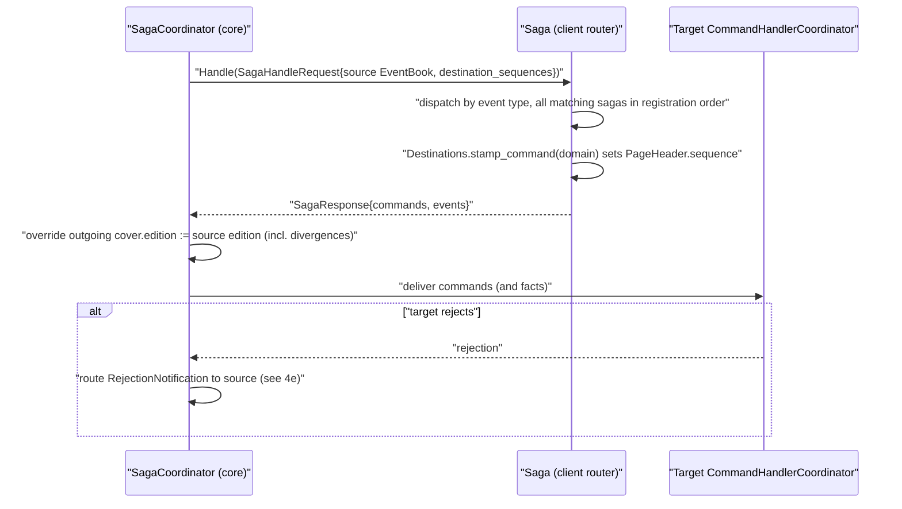
1. Saga receives source events + `destination_sequences` (saga.proto:44-49; features/client/saga.feature:24-28).
2. One command per matching handler; unmatched events → no commands (saga.feature:12-21); multiple sagas fan out in registration order, each once per event (features/client/multi_handler.feature:61-70, 101-106).
3. Per-domain explicit stamping (saga.feature:30-37; parity/client/wire_parity.feature:12-17) — contradicts saga.proto:15-18 (see F-02).
4. Coordinator forces source edition onto every emitted cover, overriding handler values, preserving divergences (features/coordinator-contract/edition_propagation.feature:12-48).
5. Facts in `SagaResponse.events` are persisted without validation at next sequence (features/coordinator-contract/fact_flow.feature:33-37); failure to reach target domain fails the saga (:75-79).

### 4c. Process manager (framework + poker buy-in orchestration)
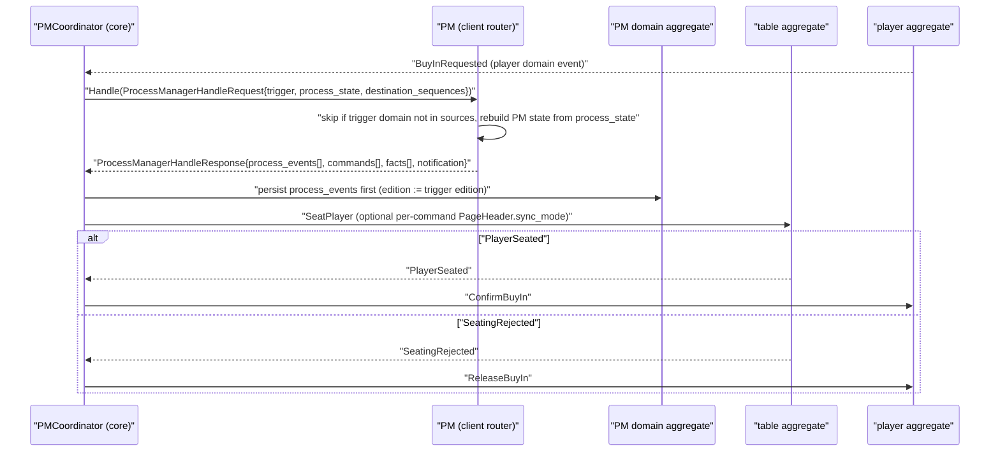
1. Request/response shape and execution order: process_events → commands → facts (process_manager.proto:72-103).
2. Domain filter and state rebuild (features/client/process_manager.feature:16-30).
3. Edition propagation to commands and every process_events book (edition_propagation.feature:54-75).
4. Buy-in: request asks table to seat (features/example/unit/process_manager.feature:266-270), seated → confirm (:279-282), refused → release (:291-294); cross-domain outcome view in features/example/unit/orchestration.feature:54-66.
5. Per-command sync override for PM-emitted commands (types.proto:155-163).

### 4d. Projector and sync modes
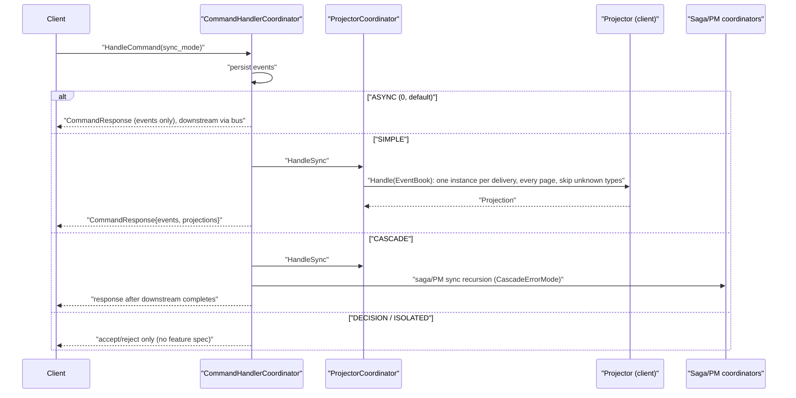
1. Sync mode enum and semantics (types.proto:80-86); per-command override (:163).
2. Feature coverage limited to three abstract scenarios: fire-and-forget, wait for projectors, wait for sagas (features/client/aggregate_client.feature:68-83). No scenario names DECISION/ISOLATED/CascadeErrorMode (search in §3 of Read Ledger notes).
3. Projector dispatch: every event → handler; unknown skipped; other domains ignored; single instance per delivery (features/client/projector.feature:12-31); multiple projectors each run (multi_handler.feature:81-89).
4. Poker display projector rendering (features/example/unit/projector.feature:23-276).

### 4e. Rejection → compensation
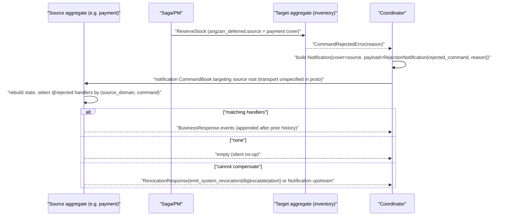
1. Rejection carries full rejected command + reason; source info in `pages[].header.angzarr_deferred` (types.proto:380-384; features/client/compensation.feature:20-57).
2. Notification wrapper has cover + sent_at + RejectionNotification payload (compensation.feature:63-71); notification CommandBook targets source aggregate, preserves correlation (:77-86).
3. Routing by (source domain, command); fan-out in registration order; unmatched = no events (features/client/rejection.feature:34-49; features/client/rejected_compensation.feature:22-39, 50-55).
4. State rebuilt before compensation; compensation events appended after prior sequence (rejected_compensation.feature:11-20, 41-48).
5. Framework-requested actions (command_handler.proto:91-106); PM escalation (process_manager.proto:99-102).
6. Poker: rejected seating releases funds (features/example/unit/orchestration.feature:61-66; player.feature:695-710).

### 4f. Snapshots, editions, temporal / speculative
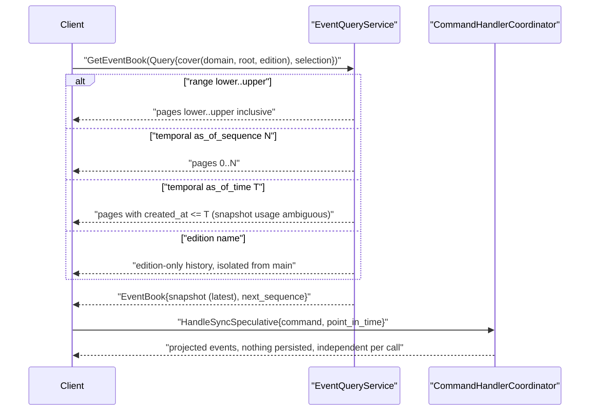
1. Unknown aggregate → empty, next_sequence 0 (features/client/query_client.feature:20-23); range inclusive upper (:48-54); as-of-sequence returns 0..N (:65-69); as-of-time (:71-74); edition isolation (:80-91); latest snapshot surfaced (:110-113).
2. next_sequence arithmetic incl. snapshot (features/coordinator-contract/state_building.feature:132-150; types.proto:236; merge_strategy.feature:246-252).
3. Speculative execution: no persistence, temporal base, independence (features/client/speculative_client.feature:19-111).
4. Snapshot/temporal contradiction documented in F-05.

### 4g. Fact injection
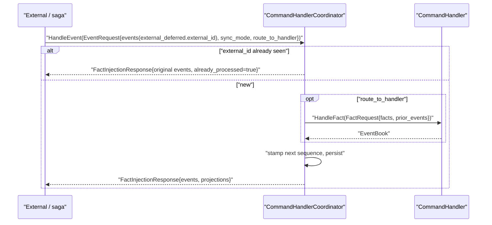
1. Contract: command_handler.proto:56-64, 118-134; types.proto:166-171, 242-250.
2. Features: sequencing (fact_flow.feature:33-37 — off-by-one, F-07), idempotency (:81-85), poker fact propagation (:25-57).

### 4h. DLQ (proto-only; no feature specifies it)
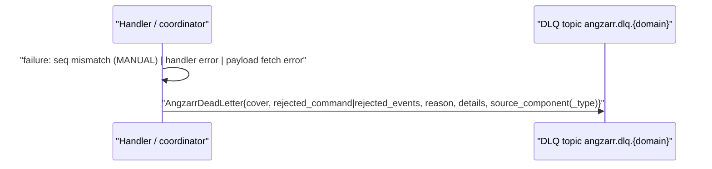
1. types.proto:470-521 only. CascadeErrorMode.DEAD_LETTER (types.proto:96) and MERGE_MANUAL (types.proto:106) both route here; `RevocationResponse.send_to_dead_letter_queue` (command_handler.proto:93). No `.feature` in this repo mentions DLQ (`git grep -c -i -E 'dead.?letter|DLQ' HEAD -- '*.feature'` → 0).

## 5. Invariants & contracts
- Sequences are 0-based; `next_sequence` = last page seq + 1, or snapshot.sequence + 1 when no pages, else 0 (types.proto:236; state_building.feature:132-150). Snapshot.sequence therefore means "last event folded in".
- A page's provenance is exclusive: exactly one of explicit sequence / external_deferred / angzarr_deferred (types.proto:150-154).
- Saga/PM idempotency key = (source, source_seq, source_component, command_index) (types.proto:177-191).
- Editions: empty name = main timeline (types.proto:30,56); meta.proto:17 also says `'angzarr'` is main (ambiguity, F-13). Coordinator always overrides emitted edition with source edition (edition_propagation.feature:28-34).
- Cover.ext propagated fill-only by clients (command_handler.feature:69-86); framework treats it as opaque (types.proto:36-37).
- Only one CommandHandler per (domain, command_type); sagas/PMs/projectors fan out in registration order (multi_handler.feature:8-11, 34-89).
- Rejection dispatch keys on the fully-qualified command type (options.proto:50-54), but features key on (source_domain, command) (rejected_compensation.feature:22-30) — F-10.
- Upcasters chain in registration order (upcaster.feature:24-44).
- Decode requires full type-name match (parity/client/event_decoding.feature:17-27).
- UUIDv5 root derivation fixtures are byte-pinned across languages (parity/client/identity.feature:33-57; testing.feature:12-23).
- Notifications are never persisted and have no sequence (types.proto:350-358).
- 2PC: pending events `no_commit=true` hidden until Confirmation; Revocation/Compensate markers read back as NoOp (types.proto:206-207, 387-453).

## 6. Findings
| ID | Severity | Category | path:line | Finding | Evidence/how verified | Suggested direction |
|---|---|---|---|---|---|---|
| ANGZARR-PROJECT-01 | high | spec/CI | .github/workflows/ (build-images.yml, deploy.yml only); proto/buf.yaml:4-18 | No CI runs buf lint/breaking, and nothing parses the .feature files. The repo that is "sole source of truth" has no gate on its contracts. | `ls .github/workflows` → 2 files; read both fully; neither invokes buf or a gherkin parser. | Add a `just proto-check` (buf lint + buf breaking against origin/main) and a gherkin lint/ID-uniqueness check; call them from a thin CI workflow. |
| ANGZARR-PROJECT-02 | high | contradiction | proto/io/angzarr/v1/saga.proto:15-19 vs :42-48; types.proto:150-154,173-192; features/client/saga.feature:24-37; parity/client/wire_parity.feature:12-17 | saga.proto says sagas return `angzarr_deferred` commands and the framework stamps sequences. But the same request passes `destination_sequences` "for command stamping", and the features/wire parity require the client to stamp an explicit `sequence`. Because `sequence` and `angzarr_deferred` share the `sequence_type` oneof, client stamping erases the source/source_seq provenance. Rejections "route back to source" (types.proto:175) via that provenance. | Read all cited lines. Cross-checked client-rust `src/router/state.rs:117-120` sets `SequenceType::Sequence(seq)` on every page. core WIP adds `basis_seq` inside AngzarrDeferredSequence (core/main/angzarr-project staged diff), which confirms the conflict is live. | Decide one model. Either sagas emit deferred and core stamps (drop destination_sequences and stamp_command), or move the observed destination sequence into `AngzarrDeferredSequence.basis_seq`. Then update the saga.feature/wire_parity hashes. |
| ANGZARR-PROJECT-03 | high | contradiction | types.proto:102-107; command_handler.proto:23-25; features/coordinator-contract/merge_strategy.feature:8-11,84-107 | MERGE_COMMUTATIVE means "allow if state field mutations don't overlap" (Replay RPC exists for this), but merge_strategy.feature defines it as "stale → FAILED_PRECONDITION retryable, client reloads". The feature also says "Three strategies are available" and omits MERGE_MANUAL. | Read both. | Rewrite merge_strategy.feature around field-overlap semantics and add MANUAL→DLQ scenarios, or change the enum comment. |
| ANGZARR-PROJECT-04 | high | wire bug | types.proto:245-249; command_handler.proto:58,125 | `route_to_handler` is documented "default: true", but it is a proto3 bool, so it defaults to false. A client that omits it bypasses HandleFact validation. | Read. core/main/doc/reviews/2026-06-09-findings-gateway-protos.md:19-20 (grep) records the same issue; the fix exists only as an uncommitted edit in core's submodule (see -06). | Land `skip_handler` (reserve tag 3) in angzarr-project. |
| ANGZARR-PROJECT-05 | med | contradiction | types.proto:308-315 vs :218-225 | TemporalQuery says it "Replays events from sequence 0 (no snapshots)", while Snapshot.created_at says snapshots ARE used for temporal-by-time iff created_at ≤ target. The two comments cannot both hold. | Read. | Pick one rule, and add a query_client scenario with a snapshot plus a temporal query. |
| ANGZARR-PROJECT-06 | high | cross-repo drift | core/main/angzarr-project (staged, uncommitted) | core's submodule has staged edits to types.proto/command_handler.proto: SyncMode/CascadeErrorMode/MergeStrategy renumbered with UNSPECIFIED=0 (wire-breaking), `route_to_handler`→`skip_handler`, `basis_seq`, and reserved tags. These exist in no angzarr-project ref. core's working tree uses them (e.g. src/orchestration/process_manager/mod.rs:760,822, working tree), but its gitlink stays at d3fb20b. | `git -C core/main/angzarr-project diff --cached`. Checked every angzarr-project ref with `git grep -e skip_handler -e SYNC_MODE_UNSPECIFIED -e basis_seq <ref> -- proto` → no hits. | Move these edits to an angzarr-project PR, then bump the pointer. This is exactly what submodule.just:9-12 prohibits. |
| ANGZARR-PROJECT-07 | med | spec error | features/coordinator-contract/fact_flow.feature:33-37 | Says "3 existing events → fact persisted with sequence 4, subsequent 5". With 0-based sequences (state_building.feature:137-140, merge_strategy.feature:35-40) this should be 3 then 4. | Read all three. | Fix to 3/4. |
| ANGZARR-PROJECT-08 | med | spec/proto mismatch | fact_flow.feature:63-69 vs types.proto:31 | The fact scenario requires "the fact Cover has external_id set", but `Cover.external_id` (field 5) was removed and moved to `PageHeader.external_deferred.external_id`. | Read. | Reword to the PageHeader field. |
| ANGZARR-PROJECT-09 | med | spec gap | features/**, parity/** | No scenario covers 2PC (`no_commit`/`cascade_id`/Confirmation/Revocation/CascadeCommit/Rollback), SYNC_MODE DECISION/ISOLATED/CASCADE by name, CascadeErrorMode, DLQ, MERGE_MANUAL, SnapshotRetention, EventStreamService.Subscribe, GetAggregateRoots/Synchronize, ComponentDescriptor or CloudEvents. `sync_modes.feature` was deleted (4024e16) but is still cited. | `git grep -n -E '2PC|cascade_id|no_commit|Confirmation\b' HEAD -- '*.feature'` → 0; the same for `SYNC_MODE|\bDECISION\b|\bISOLATED\b|\bCASCADE\b`, `FAIL_FAST|CONTINUE|DEAD_LETTER`, `MERGE_MANUAL|\bMANUAL\b`, `EventStream|Subscribe` → 0 each; `-i 'dead.?letter|DLQ'` → 0; `git log --all --diff-filter=D` shows 4024e16 deleted sync_modes/poker_game.feature. | Author coordinator-contract features for these areas (core already has private dlq.feature). |
| ANGZARR-PROJECT-10 | med | proto gap | options.proto:48-55; features/client/rejected_compensation.feature:22-30 | `RejectedOptions` has only `command` (FQ type), but the features route compensation by (source_domain, command). Two rejections of the same command type from different domains cannot be told apart in codegen. | Read. | Add `domain` to RejectedOptions, or state that type alone is the key and fix the feature. |
| ANGZARR-PROJECT-11 | med | proto gap | options.proto:34-46; features/client/saga.feature:30-37 | `ComponentOptions.output_domain` is singular, while saga.feature C-0053 has one saga target two domains and PMs have multiple targets (process_manager.feature:10). | Read. | Make output_domain repeated, or add a per-rpc target option. |
| ANGZARR-PROJECT-12 | med | proto gap | framework services in proto/io/angzarr/v1/*.proto; types.proto:364-384 | No framework rpc accepts Notification/RejectionNotification. How a rejection reaches an aggregate, or a saga (components.proto:43,60 declare such handlers), is undocumented. compensation.feature:77-86 implies it is packed into a CommandBook. | `git grep -n -E 'rpc ' HEAD -- proto/io/angzarr/v1 \| grep -c Notification` → 0 of 24 rpcs. | Document the envelope (Notification packed in CommandPage.command Any, or a dedicated rpc). |
| ANGZARR-PROJECT-13 | low | ambiguity | meta.proto:17 vs types.proto:30,56 | The main timeline is "'angzarr' or empty" in meta.proto but "empty" in types.proto. | Read. | Choose a single canonical value and reference the DEFAULT_EDITION constant (parity.feature:87). |
| ANGZARR-PROJECT-14 | med | wire hygiene | types.proto:31,203,234-235,271-273,322,383, 505-521 | Removed fields are commented, not `reserved`: Cover 5, EventPage 5, EventBook 4-5, CommandBook 3-5, Query 2, RejectionNotification 3-6, AngzarrDeadLetter 4-6 (gap between 3 and 7). Snapshot 1 is also absent. | Read. Only Notification:368-369 and CommandResponse (command_handler.proto:86-87) reserve. | Add `reserved` numbers and names. Note that core's staged fix still misses AngzarrDeadLetter 4-6. |
| ANGZARR-PROJECT-15 | low | doc | types.proto:71-72, 282 vs 206 | The SyncMode ordering omits ISOLATED. CommandRequest.cascade_id says "committed=false" but the field is `no_commit`. | Read. | Fix the comments. |
| ANGZARR-PROJECT-16 | low | proto | types.proto:534-542 | `GetDescriptorRequest` is "Request for GetDescriptor RPC", but no service declares GetDescriptor. | `git grep -n GetDescriptor HEAD -- proto` → only types.proto:541-542; `rg GetDescriptor core/main/src` → 0. | Declare the rpc on a component service or delete the dead messages. |
| ANGZARR-PROJECT-17 | low | stale doc | types.proto:10-13 | Comment says build chains add sererr's proto root via -I. The file is actually vendored at proto/sererr/v1/sererr.proto, while sererr's own layout is `sererr/sererr.proto` (core/main/sererr/proto/sererr/sererr.proto is byte-identical). Adding both roots would define sererr.v1 twice. | diff shows identical; paths differ. | Update the comment to "vendored". |
| ANGZARR-PROJECT-18 | med | feature hygiene | features/example/unit/table.feature:292-346; :914-966 | @EU-0531 is reused on 7 scenarios, and @EU-1184B..F break the ID format (STEP_VOCABULARY.md:118-124). 276/1021 scenarios have no ID (all of aggregate_client, compensation, domain-client, query_client, router, speculative_client, fact_flow, merge_strategy, state_building, and 6 parity files; 28 in player.feature, 9 in game_rules.feature). | Python scan over all .feature files (tags directly above each Scenario). | Allocate unique IDs and add a CI check. |
| ANGZARR-PROJECT-19 | low | tier purity | features/client/multi_handler.feature:48-52; upcaster.feature:11-17; parity/client/testing.feature:33-46; decorators.feature:22-27 | Poker vocabulary (Player, RegisterPlayer, DepositFunds, "player" domain) appears in the client tier, against STEP_VOCABULARY.md:95-100, 126-131. | Read. | Rename to Order/Payment. |
| ANGZARR-PROJECT-20 | low | tier contract | features/client/README.md:30-37 vs aggregate_client.feature:12-13,124-132; domain-client.feature:21-23; query_client.feature:123-126 | The client tier is declared "No CommandClient, no sidecars, no gRPC", but these files need a running backend and exercise timeouts/connection failure. | Read. | Move them to parity/ or an integration tier. |
| ANGZARR-PROJECT-21 | med | contradiction | features/coordinator-contract/README.md:17-21,30-36 vs client-rust/main tests/features.rs (HEAD) | README says these features are "NOT executed by any test suite" and the simulation step files were deleted. client-rust still runs fact_flow/merge_strategy/state_building through "coordinator-contract sim" worlds. | `git show HEAD:tests/features.rs` in client-rust (lines ~229-261 of that file). | Delete the sims or update the README. |
| ANGZARR-PROJECT-22 | med | spec error | features/example/unit/hand.feature:1996-2014 | EU-1260: Alice bets 100, the uncalled 100 is "returned to Alice's stack", yet the scenario asserts stack 400 and pot 15. 100 chips vanish, which violates chip conservation. | Arithmetic from the scenario text. | Assert 500 (or 495 if Alice posted SB). |
| ANGZARR-PROJECT-23 | med | contradiction | hand.feature:2723-2736 vs 2756-2768 | EU-1339's title/comments say an open pair on 4th "locks lower limit in Stud Hi/Lo **and Razz**". EU-1341 says a Razz open pair does NOT affect the limit. | Read. | Scope EU-1339 to Hi/Lo only. |
| ANGZARR-PROJECT-24 | med | spec error | features/example/unit/table.feature:709-726 | EU-0575 ("dead button") asserts dealer=seat 0 AND big blind=seat 0 at a 3-handed table: one player posts BB while holding the button. This contradicts the TDA Rule 32 it cites and its own title ("BB skips to next active seat"). | Read the scenario. Seats 0,1,3 are occupied. | Re-derive with the dead-button rule. |
| ANGZARR-PROJECT-25 | low | spec error | features/example/unit/tournament.feature:508-518 | EU-0844 "after registration closes" asserts status "RegistrationOpen". TournamentStatus has no closed-registration value (tournament.proto:19-34), so the closed state is not representable in the status field. | Read. | Add TOURNAMENT_REGISTRATION_CLOSED or assert a flag. |
| ANGZARR-PROJECT-26 | low | spec/proto mismatch | tournament.feature:1149 vs tournament.proto:27-33 | EU-1375 expects status BAGGING_AND_TAGGING, which doesn't exist (the proto has HALTING/BAGGED). | `git grep -w BAGGING_AND_TAGGING HEAD -- proto` → 0. | Align. |
| ANGZARR-PROJECT-27 | low | spec ambiguity | hand.proto:364-372 (ActionTaken.amount), :65-68; hand.feature:208-215, 2911-2926 | The meaning of `amount` is unspecified: chips put in this action vs raise-to target. EU-0014 asserts "puts 25 more"; EU-1352 asserts "raise of 400" but "owes 500". WIP_TRIAGE.md:432 admits the ambiguity. | Read. | Document the field semantics in the proto. |
| ANGZARR-PROJECT-28 | low | stale docs | features/example/acceptance/README.md:8-9,14-16; features/example/unit/README.md:8-18; RULES.md:52,249-260; cluster.feature:74-78 | These cite deleted poker_game/sync_modes files, omit cluster_tournament/game_rules/betting_round/raise_tracking/tournament, list EA-0012 as @wip, and keep `@wip` on EA-0004 after 20d53e6 "strip all @wip". | Read + `git log`. | Refresh. |
| ANGZARR-PROJECT-29 | low | mis-citation | cluster_tournament.feature:238,310; table.feature:748; tournament.feature:641 | Rule numbers are wrong: "TDA Rule 28" for color-up (RULES.md:78 → rabbit hunting; color-up is 24A), "TDA Rule 12" for H4H (Rule 12 = cards speak; H4H is RP-8), "TDA Rule 6" button alternates (Rule 6 = language), "TDA Rule 30" late stacks (should be 8A). | Cross-read against RULES.md table. | Fix the citations. |
| ANGZARR-PROJECT-30 | low | naming drift | parity/client/connection.feature:86,98-113; command_builder.feature:12 vs parity.feature:19-23 | Connection/builder features use AggregateClient, GatewayClient and "Client", while parity pins CommandHandlerClient/QueryClient/SpeculativeClient/DomainClient. | Read. | Rename. |
| ANGZARR-PROJECT-31 | low | design | proto/io/angzarr/examples/v1/*.proto:go_package; features/client/README.md:21-24 | Example (poker) bindings are emitted into the client-go module path (`…/client/go/proto/io/angzarr/examples/v1`). That couples the framework client to poker protos, which the client README says to avoid. | Read go_package lines; client-go go.mod module = github.com/benjaminabbitt/angzarr/client/go. | Emit examples into the examples-go module. |
| ANGZARR-PROJECT-32 | low | change commentary | tournament.proto:544-554; tournament.feature:312-314 | The comments narrate history ("Without this event the handler had no way…", "IDs renumbered…"), against the no-change-commentary rule. | Read. | Move the history into commit messages. |
| ANGZARR-PROJECT-33 | low | weak spec | raise_tracking.feature:165-172; hand.feature:517-525 | EU-1007's title claims "does not reopen" but only asserts arithmetic already implied by the Given. EU-0044 "Split pot" never asserts a split. | Read. | Strengthen the Then steps. |
| ANGZARR-PROJECT-34 | low | contradiction | hand.feature:1516-1523 (header "TDA Rule 47B" vs body "Rule 47A"); hand.feature:249-262 | The section header cites 47B, but the content is 47A (RULES.md:105-107). EU-0018 cites a one-burn rule, yet asserts only 3 cards removed from the deck (the burn is uncounted). | Read. | Fix. |
| ANGZARR-PROJECT-35 | low | spec narrative | tournament.feature:1110-1118 | EU-1373: "exactly 2 players left" and "both go all-in and lose at the same showdown" is impossible. | Read. | Rephrase (last-two scenario needs a third winner). |

## 7. Open questions
- Which saga model is canonical: explicit client stamping or framework-stamped deferred (F-02)? core's WIP `basis_seq` suggests "deferred + basis".
- Is snapshot.sequence "last applied event" (implied by next_sequence formula) everywhere, including the RETENTION_DEFAULT "every 16 events" cadence (types.proto:113)?
- Correlation queries: the REST path requires `{cover.domain}` (query.proto:19), and an empty domain is refused (query_client.feature:119-121). Is a cross-domain correlation query (query_client.feature:97-100 "across every aggregate") supported at all?
- Does `EventRequest.sync_mode` on `ProjectorCoordinatorService.HandleSync` (projector.proto:26) mean anything?
- The planned wire-breaking enum renumber (UNSPECIFIED=0) needs a coordinated cascade. Should it land before v0.1.0 as core's doc suggests?
- Should betting_round.feature (which mirrors Python-only `run_game.py`, betting_round.feature:27-28) run in non-Python repos? examples-rust does run it.

## 8. Cross-repo interface surface
**Relied on by others:**
- Protos: core (build.rs:8-11 rerun-if-changed on angzarr-project/proto), angzarr-router (buf.yaml `path: angzarr-project/proto`; crates/router-ffi/build.rs:6-7; crates/conformance/build.rs:15), angzarr-cli (buf.gen.yaml; justfile:25,36; codegen/model.go:43 matches options.proto extension numbers 50100-50103).
- `submodule.just`: imported by angzarr-cli, prj-cloudevents, prj-event, prj-log (justfile:4-5 each).
- Features: client-rust tests/features.rs (26 paths), examples-rust tests/tests/*.rs via the `tests/features -> ../angzarr-project/features` symlink (this breaks the "No symlinks" rule in features/README.md:56-58), examples-python (justfile.container:61,72 at origin/main-era paths `features/example/{poker,framework}`), and other clients through directory globs.
- Toolchain images ghcr.io/angzarr-io/angzarr-{base,rust,python,go,java,csharp} (skaffold.yaml:27-70), `:latest` retagged on main (build-images.yml:60-70).

**Pins (gitlink at repo HEAD vs checked-out):**
| Repo | HEAD branch | Pinned | Checked out | Harness references missing at pin |
|---|---|---|---|---|
| core/main | feat/snapshot-temporal-wiring d86b45be | d3fb20b | d3fb20b + **staged proto edits** (F-06) | Uses its own `core/main/features/**` (diverged copies of 13 angzarr-project files, e.g. fact_flow/merge_strategy/state_building/hand/player/table/saga all differ). No angzarr-project feature path. Its `features/client/dlq.feature` and `features/acceptance/end_to_end.feature` exist in core. |
| client-rust/main | feat/python-rust-parity-cleanup 268884b | 80ce7c2 | 16fa309 (10 commits ahead of pin; ` M`) | None at the pin: all 30 paths exist. At the checked-out 16fa309, and at bc1ed7e, 12 paths are missing because the files moved to `parity/client/`: parity, identity, testing, connection, command_builder, query_builder, error_handling, event_decoding, retry, decorators, wire_parity, destinations. |
| examples-rust/main | refactor/reservation 977a197 | 80ce7c2 | 16fa309 (` M`) | `features/example/unit/poker_game.feature` and `sync_modes.feature` (tests/tests/poker_game_unit.rs:25,34) are absent at the pin, checkout, bc1ed7e and origin/main. All 11 unit paths are also absent at origin/main (renamed to poker/, framework/). |
| angzarr-router/main | main 9c3cc8d | 0df441f | 0df441f | n/a (runs its own conformance/features/*.feature) |
| angzarr-cli/main | main 02a6b37 | 531d91e | 531d91e | n/a (protos only) |
| prj-cloudevents/main | main 24e105a | 8d60829 | 8d60829 | n/a (submodule.just only; 8d60829 lacks the GIT_DIR fix at submodule.just:92) |
| prj-event/main | main 201df30 | 8d60829 | 8d60829 | n/a |
| prj-log/main | main 0d39463 | 8d60829 | 8d60829 | n/a |

All pins are ancestors of origin/main. 0df441f and 531d91e are **not** ancestors of this HEAD (bc1ed7e), so this review's tree is older than the router/cli pins.

**Relies on:** googleapis annotations (vendored), sererr (vendored copy), GitHub Pages (deploy.yml), external clones for `vendor/` (justfile:22-25; deploy.yml:28-31 checks out submodules, but .gitmodules was removed in bc1ed7e, so the site build gets no vendored code).

### Feature coverage matrix (which repo runs which file; in-scope repos verified by path, others approximated from grep of directory globs)
| Feature file (bc1ed7e path) | client-rust | examples-rust | core | router/cli/prj | other clients (grep, approx.) |
|---|---|---|---|---|---|
| features/client/{aggregate_client,builder,command_handler,compensation,domain-client,multi_handler,process_manager,projector,query_client,rejected_compensation,rejection,saga,speculative_client,upcaster,validation} | yes (tests/features.rs) | – | own copies of 5 (diverged) | – | dir-glob in client-go/java/csharp/cpp |
| features/client/router.feature | **no** (retired in Rust, tests/features.rs comment) | – | – | – | dir-glob |
| features/coordinator-contract/{fact_flow,merge_strategy,state_building} | yes, as simulations (contradicts README) | – | own diverged copies | – | client-go references the dir |
| features/coordinator-contract/edition_propagation | – | – | Rust unit tests cite it (src/orchestration/process_manager/edition_propagation.test.rs:2) | – | – |
| parity/client/* (12) | yes, via old features/client/* paths at pin | – | copies of 5 (3 identical) | – | client-python (parity/client/*) |
| features/example/unit/* (11) | – | yes (11 runners) | own copies of 7 (diverged) | – | examples-go (player), examples-csharp (process_manager); examples-python uses origin/main paths |
| features/example/acceptance/cluster.feature | – | yes (acceptance, feature-gated) | – | – | examples-python |
| features/example/acceptance/cluster_tournament.feature | – | **no** | – | – | examples-python (dir) |

## 9. Prior findings audit
No prior report (per instructions).

## 10. Read Ledger
| File | Total lines | Lines read (ranges) | Notes |
|---|---|---|---|
| proto/buf.yaml | 18 | 1-18 | |
| proto/google/api/annotations.proto | 31 | 1-31 | vendored googleapis |
| proto/google/api/http.proto | 370 | 1-370 | vendored googleapis |
| proto/sererr/v1/sererr.proto | 177 | 1-177 | |
| proto/io/angzarr/v1/types.proto | 542 | 1-542 | |
| proto/io/angzarr/v1/command_handler.proto | 135 | 1-135 | |
| proto/io/angzarr/v1/process_manager.proto | 103 | 1-103 | |
| proto/io/angzarr/v1/saga.proto | 72 | 1-72 | |
| proto/io/angzarr/v1/projector.proto | 51 | 1-51 | |
| proto/io/angzarr/v1/query.proto | 31 | 1-31 | |
| proto/io/angzarr/v1/stream.proto | 23 | 1-23 | |
| proto/io/angzarr/v1/upcaster.proto | 28 | 1-28 | |
| proto/io/angzarr/v1/meta.proto | 21 | 1-21 | |
| proto/io/angzarr/v1/options.proto | 74 | 1-74 | |
| proto/io/angzarr/v1/cloudevents.proto | 53 | 1-53 | |
| proto/io/angzarr/examples/v1/components.proto | 65 | 1-65 | |
| proto/io/angzarr/examples/v1/orchestration.proto | 56 | 1-56 | |
| proto/io/angzarr/examples/v1/poker_types.proto | 203 | 1-203 | |
| proto/io/angzarr/examples/v1/player.proto | 187 | 1-187 | |
| proto/io/angzarr/examples/v1/table.proto | 372 | 1-372 | |
| proto/io/angzarr/examples/v1/hand.proto | 850 | 1-850 | |
| proto/io/angzarr/examples/v1/tournament.proto | 926 | 1-926 | |
| proto/io/angzarr/examples/v1/buy_in.proto | 178 | 1-178 | |
| proto/io/angzarr/examples/v1/rebuy.proto | 162 | 1-162 | |
| proto/io/angzarr/examples/v1/registration.proto | 122 | 1-122 | |
| proto/io/angzarr/examples/v1/ai_sidecar.proto | 258 | 1-258 | |
| features/README.md | 59 | 1-59 | |
| features/STEP_VOCABULARY.md | 131 | 1-131 | |
| features/client/README.md | 68 | 1-68 | |
| features/client/aggregate_client.feature | 147 | 1-147 | |
| features/client/builder.feature | 60 | 1-60 | |
| features/client/command_handler.feature | 86 | 1-86 | |
| features/client/compensation.feature | 128 | 1-128 | |
| features/client/domain-client.feature | 56 | 1-56 | |
| features/client/multi_handler.feature | 106 | 1-106 | |
| features/client/process_manager.feature | 34 | 1-34 | |
| features/client/projector.feature | 31 | 1-31 | |
| features/client/query_client.feature | 126 | 1-126 | |
| features/client/rejected_compensation.feature | 55 | 1-55 | |
| features/client/rejection.feature | 49 | 1-49 | |
| features/client/router.feature | 163 | 1-163 | |
| features/client/saga.feature | 45 | 1-45 | |
| features/client/speculative_client.feature | 124 | 1-124 | |
| features/client/upcaster.feature | 44 | 1-44 | |
| features/client/validation.feature | 52 | 1-52 | |
| features/coordinator-contract/README.md | 36 | 1-36 | |
| features/coordinator-contract/edition_propagation.feature | 75 | 1-75 | |
| features/coordinator-contract/fact_flow.feature | 85 | 1-85 | |
| features/coordinator-contract/merge_strategy.feature | 258 | 1-258 | |
| features/coordinator-contract/state_building.feature | 184 | 1-184 | |
| features/example/README.md | 66 | 1-66 | |
| features/example/RULES.md | 273 | 1-273 | |
| features/example/WIP_TRIAGE.md | 445 | 1-445 | |
| features/example/ACCEPTANCE_REMEDIATION_PLAN.md | 242 | 1-242 | |
| features/example/acceptance/README.md | 64 | 1-64 | |
| features/example/acceptance/cluster.feature | 103 | 1-103 | |
| features/example/acceptance/cluster_tournament.feature | 360 | 1-360 | |
| features/example/unit/README.md | 62 | 1-62 | |
| features/example/unit/betting_round.feature | 123 | 1-123 | |
| features/example/unit/game_rules.feature | 786 | 1-786 | |
| features/example/unit/hand.feature | 3128 | 1-800, 800-1599, 1600-2399, 2400-3128 | read in 4 pages |
| features/example/unit/orchestration.feature | 165 | 1-165 | |
| features/example/unit/player.feature | 710 | 1-710 | |
| features/example/unit/process_manager.feature | 436 | 1-436 | |
| features/example/unit/projector.feature | 276 | 1-276 | |
| features/example/unit/raise_tracking.feature | 172 | 1-172 | |
| features/example/unit/saga.feature | 258 | 1-258 | |
| features/example/unit/table.feature | 1051 | 1-1051 | |
| features/example/unit/tournament.feature | 1193 | 1-1193 | |
| parity/client/command_builder.feature | 149 | 1-149 | |
| parity/client/connection.feature | 149 | 1-149 | |
| parity/client/decorators.feature | 27 | 1-27 | |
| parity/client/destinations.feature | 37 | 1-37 | |
| parity/client/error_handling.feature | 176 | 1-176 | |
| parity/client/event_decoding.feature | 159 | 1-159 | |
| parity/client/identity.feature | 74 | 1-74 | |
| parity/client/parity.feature | 167 | 1-167 | |
| parity/client/query_builder.feature | 150 | 1-150 | |
| parity/client/retry.feature | 44 | 1-44 | |
| parity/client/testing.feature | 53 | 1-53 | |
| parity/client/wire_parity.feature | 17 | 1-17 | |
| build/images/skaffold.yaml | 70 | 1-70 | |
| build/images/base/Containerfile | 79 | 1-79 | |
| build/images/rust/Containerfile | 76 | 1-76 | |
| build/images/python/Containerfile | 41 | 1-41 | |
| build/images/go/Containerfile | 39 | 1-39 | |
| build/images/java/Containerfile | 36 | 1-36 | |
| build/images/csharp/Containerfile | 37 | 1-37 | |
| justfile | 29 | 1-29 | |
| submodule.just | 142 | 1-142 | |
| README.md | 21 | 1-21 | |
| .github/workflows/build-images.yml | 82 | 1-82 | extra (CI evidence) |
| .github/workflows/deploy.yml | 65 | 1-65 | extra |
| .gitignore | 29 | 1-29 | extra |
| vendor/ | 0 files | listed | `vendor/client`, `vendor/examples` are empty untracked dirs; the nested python submodules were removed in bc1ed7e (`git show --stat`); `just vendor` (justfile:22-25) re-clones them |
| site/** | — | not read | out of scope: Astro site (astro.config.mjs, src, scripts, public, dist, node_modules) |
| LICENSE, .idea/**, .claude/**, .gemini/**, .mcp.json*, .reprise/cache/** | — | not read | non-source tooling/cache, out of scope |
