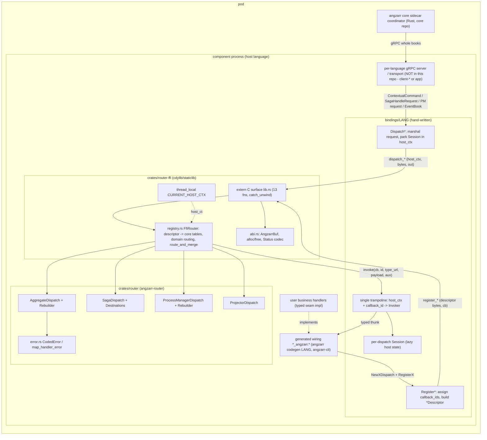
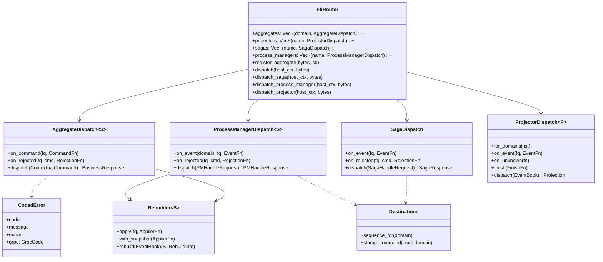
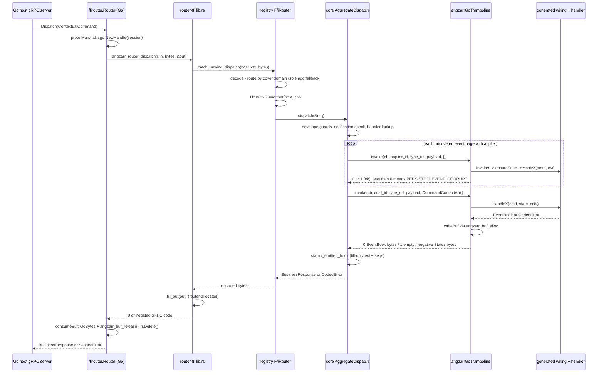
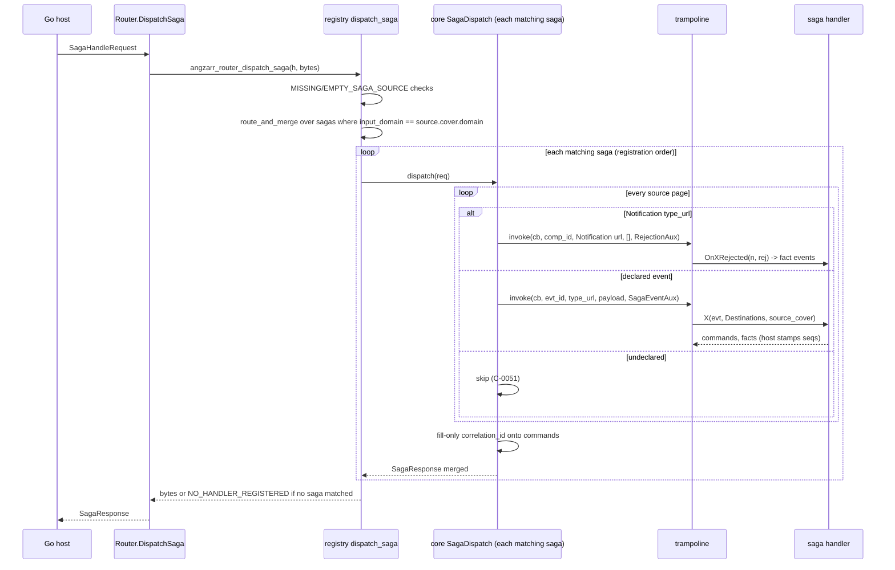
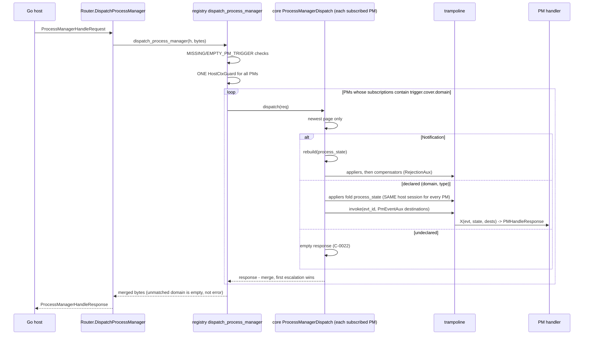
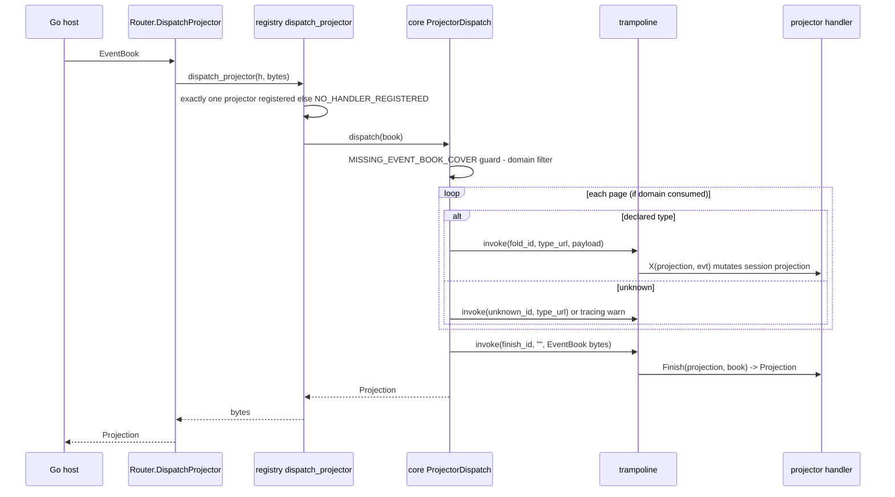

# angzarr-router
Repo: /home/babbitt/workspace/angzarr/angzarr-router/main @ main 9c3cc8d. Working tree: in-scope paths clean except untracked `bindings/python/angzarr_router_ffi.egg-info/` (pip artifact); other dirty files are ctxloom/.claude tooling, out of scope. Read-only; runtime probes built in scratch (`scratchpad/router-probe`, CARGO_TARGET_DIR in scratch).

## 1. Summary
- Two Rust crates: `crates/router` (dispatch semantics: Rebuilder, Aggregate/Saga/PM/Projector dispatch, Destinations, CodedError) and `crates/router-ffi` (13 `extern "C"` fns + descriptor→table registry). A third crate, `crates/conformance`, runs 4 shared Gherkin features against the core natively. It does NOT go through the FFI.
- Six hand-written bindings (Go/cgo, Python/cffi ABI-mode, Java/Panama FFM, C#/P/Invoke `UnmanagedCallersOnly`, TS/koffi, C++/static link). They share one shape: registry of `callback_id → Invoker`, one trampoline, and a per-dispatch Session parked in `host_ctx` with lazily created host state.
- angzarr-cli's generated code targets these router bindings, not client-*. Verified: `angzarr-cli/main/codegen/golang.go:36-37`, `python.go:182`, `java.go:27-33`, `csharp.go:26-37`, `cpp.go:68`, `typescript.go:38`, plus generated `bindings/go/gen/test/counter/counter_aggregate_angzarr.pb.go:7` importing `angzarr-router/bindings/go`. This confirms reviews/angzarr-cli.md.
- Relation to client-*: the intent (ADR 0001, plan §8) is to replace client-* engines. Today it is a parallel implementation. client-rust has no dependency on it (`rg angzarr-router --glob Cargo.toml client-rust/main` → 0). client-go still has `engine.go`/`engine_compose.go`/`engine_grpc.go`. client-python keeps its own `angzarr_client/router/`. The only runtime consumer found is examples-python, through a git-untracked `vendor/angzarr-router-ffi` copy (`examples-python/main/pyproject.toml:43`, `git ls-files vendor` → 0).
- The router has no serving/transport layer. Each host still needs a per-language gRPC server to adapt coordinator RPCs to `Router.Dispatch*`.
- **High:** process managers (PMs) in one router share a single host session. The FFI dispatches every subscribed PM under one `host_ctx`, so PM2 rebuilds on top of PM1's folded state. With different state types this becomes a cast failure, or UB in C++. Verified by probe.
- **Medium:**
  - PM compensation routing through the FFI depends on `trigger.cover.domain` being an input domain.
  - The aggregate multi-compensator fan-out drops escalations.
  - Java/C#/TS `close` is not idempotent (double free).
  - Low: C# `CodedError` with grpc 0 turns a rejection into STATUS_OK (ROUTER-19).
  - Go/Python/C++ never check the ABI version, although the ADR says every binding does.
  - The registry holds routing semantics and is excluded from mutation testing.
- Core semantics are well tested: 106/106 mutants caught in `mutants.out` for `crates/router` only. FFI tests are thorough on the aggregate path. Binding conformance collapses the compensator fan-out to one handler, so fan-out across the FFI is untested in the bindings.
- Docs are substantially stale. README says the FFI "lands later". `docs/architecture.md` is a copy of client-go's engine doc. The decision doc's ABI (serve/shutdown/config/upcaster/capabilities, reentrancy assert) is unimplemented.

## 2. Component inventory
| Component | Kind | path:line | Responsibility | Depends on |
|---|---|---|---|---|
| lib helpers | module | crates/router/src/lib.rs:22-107 | type-URL canon `/`, FQN notification match, next_sequence, rejection key | prost |
| Rebuilder<S> | struct | crates/router/src/rebuild.rs:34-120 | snapshot-first fold, covered-page skip, PERSISTED_EVENT_CORRUPT | error |
| AggregateDispatch<S> | struct | crates/router/src/aggregate.rs:57-261 | guards, validate-before-rebuild, CommandContext, fill-only stamping, FQ rejection fan-out | Rebuilder, error |
| SagaDispatch | struct | crates/router/src/saga.rs:47-239 | every-page walk, notification→compensators, fill-only correlation | Destinations |
| ProcessManagerDispatch<S> | struct | crates/router/src/process_manager.rs:49-240 | newest-page trigger, (domain,type) table, rebuild, first escalation wins | Rebuilder, Destinations |
| ProjectorDispatch
 | struct | crates/router/src/projector.rs:31-154 | one instance per delivery, domain filter, on_unknown/warn, finish | tracing |
| Destinations | struct | crates/router/src/destinations.rs:15-60 | per-domain next-sequence, stamp_command | error |
| CodedError / map_handler_error | struct/fn | crates/router/src/error.rs:73-183 | code/message/extras/grpc; Other→UNHANDLED (INTERNAL) | — |
| extern "C" surface | module | crates/router-ffi/src/lib.rs:46-345 | 13 exported fns, catch_unwind, null guards | registry, abi |
| ABI vocab | module | crates/router-ffi/src/abi.rs:10-162 | AngzarrBuf, alloc/free, fill/consume, Status⇄CodedError | google.rpc protos |
| FfiRouter | struct | crates/router-ffi/src/registry.rs:81-646 | descriptor→core tables with `()` state, domain routing, route_and_merge, TLS host_ctx | core |
| ABI aux protos | proto | proto/io/angzarr/router/ffi/v1/abi.proto:16-120 | descriptors + CommandContextAux/SagaEventAux/PmEventAux/RejectionAux | io.angzarr.v1 |
| conformance fixtures | crate | crates/conformance/src/lib.rs:86-718 | Counter aggregate/projector, OrderSaga, OrderPM on native core | core, prost-reflect |
| Go binding | pkg | bindings/go/ffirouter.go:141-716, trampoline.go:31-97, api.go | cgo link, cgo.Handle session | router-ffi cdylib |
| Python binding | pkg | bindings/python/angzarr_router_ffi/_dispatch.py:387-859, _abi.py:14-85 | cffi dlopen, new_handle session | cdylib |
| Java binding | pkg | bindings/java/.../Ffi.java:29-344, Router.java:42-352 | FFM downcalls/upcall, session-id map | cdylib |
| C# binding | pkg | bindings/csharp/src/Ffi.cs:32-385, Router.cs:25-368 | DllImport + UnmanagedCallersOnly, GCHandle session | cdylib |
| TS binding | pkg | bindings/typescript/src/ffi.ts:29-226, router.ts:90-531 | koffi, session-id map (uint64 host_ctx) | cdylib |
| C++ binding | headers | bindings/cpp/include/angzarr/router/router.h:44-401, support.h:90-107 | header-only, links staticlib, Session* as host_ctx | staticlib |

## 3. Architecture diagrams

Ecosystem position: client-rust, client-go, client-python and the other client-* libraries each still carry their own engine, running in parallel with this repo (see §1). angzarr-cli emits only against `bindings/*`. examples-python is the only runtime consumer.

### 3.1 FFI ABI contract (crates/router-ffi/src/lib.rs, abi.rs; ABI_VERSION=1 abi.rs:10)
| Fn | Signature | Args encoding | Return / out | Ownership | Errors |
|---|---|---|---|---|---|
| angzarr_abi_version | `() -> u32` (lib.rs:46-49) | — | 1 | — | — |
| angzarr_buf_alloc | `(usize) -> *mut u8` (53-56) | len | zeroed bytes; NULL for 0 (abi.rs:41-49) | router heap; host fills callback `out` with it; router frees via consume_out (abi.rs:81-89) | — |
| angzarr_buf_release | `(ptr, len)` (63-66) | exactly a router-issued ptr/len | — | frees `Vec::from_raw_parts(ptr,len,len)` (abi.rs:55-59) | UB if ptr/len mismatched; no-op on null/0 |
| angzarr_router_new | `() -> *mut c_void` (69-72) | — | Box<FfiRouter> | caller must free once | — |
| angzarr_router_free | `(r)` (78-83) | router ptr | — | drops Box; null tolerated | double-free UB |
| angzarr_router_register_{aggregate,projector,saga,process_manager} | `(r, *const u8, usize, AngzarrCb) -> i32` (92-111,120-139,185-204,250-269) | serialized `*Descriptor` (abi.proto:30-106) | 0 ok; `-grpc` on failure; NO status payload | descriptor borrowed for call; `cb` must outlive router | ANY_DECODE_FAILED(-3); null router → -13; panic → -13 |
| angzarr_router_dispatch | `(r, host_ctx, *const u8, usize, *mut AngzarrBuf) -> i32` (318-345) | ContextualCommand bytes | 0 + BusinessResponse bytes in out | out is router-allocated; host copies then `buf_release` | <0 = −grpc; out = google.rpc.Status + ErrorInfo(reason, domain "angzarr.io", metadata) (abi.rs:95-110) |
| angzarr_router_dispatch_saga | same (214-241) | SagaHandleRequest | SagaResponse | same | same |
| angzarr_router_dispatch_process_manager | same (280-307) | ProcessManagerHandleRequest | ProcessManagerHandleResponse | same | same |
| angzarr_router_dispatch_projector | same (149-176) | EventBook | Projection | same | same |
| host callback AngzarrCb | `(host_ctx, id:u64, type_url*,len, payload*,len, aux*,len, *mut AngzarrBuf) -> i32` (abi.rs:27-37) | inputs router-owned, valid only during the call (lib.rs:14-15) | 0 = payload in out; 1 = OK_EMPTY (abi.rs:13-15); <0 = −grpc, out = Status bytes | out must be allocated with angzarr_buf_alloc and len set exactly; router takes ownership (registry.rs:73) | Status decoded by status_to_coded (abi.rs:115-149). Missing bytes → code "" plus fallback grpc. Undecodable → UNHANDLED |

Aux per callback (registry.rs):

| Callback | aux | type_url / payload | out expected |
|---|---|---|---|
| applier / snapshot | [] | Any.type_url / value (116-131) | ignored; `ret<0` → PERSISTED_EVENT_CORRUPT |
| command | CommandContextAux (140-145) | cmd Any | EventBook, or 1 for None |
| aggregate compensator | RejectionAux{notification, rejection, cctx} (167-176) | NOTIFICATION_TYPE_URL / [] | BusinessResponse |
| projector fold | [] (225) | event Any | ignored; `ret<0` → "host fold failed" UNHANDLED |
| projector unknown | [] (234) | type_url / [] | ret ignored |
| projector finish | [] (240) | "" / EventBook bytes | Projection (0 or 1 both decode) |
| saga event | SagaEventAux{destination_sequences, source_cover} (351-355) | event Any | SagaResponse |
| saga compensator | RejectionAux, cctx=None (379-385) | NOTIFICATION / [] | SagaResponse (events only) |
| PM event | PmEventAux (527-531) | event Any | ProcessManagerHandleResponse |
| PM compensator | RejectionAux, cctx=None (554-560) | NOTIFICATION / [] | PMHandleResponse (process_events, notification) |

Threading: host_ctx is a `thread_local` set by HostCtxGuard for one dispatch (registry.rs:21-44, 291, 319, 454, 627). Callbacks run synchronously on the dispatching thread, and nested dispatch restores the previous value (guard `prev`).

### 3.2 Per-binding parity
| Aspect | Go | Python | Java | C# | TS | C++ |
|---|---|---|---|---|---|---|
| Declares all 13 fns | yes ffirouter.go:27-39 | yes _abi.py:28-56 | yes Ffi.java:46-66 | yes Ffi.cs:89-170 | yes ffi.ts:44-80 | yes ffi.h:24-43 |
| Uses all 4 register + 4 dispatch | yes | yes | yes | yes | yes | yes |
| ABI version checked at load | NO (fn exposed only, ffirouter.go:117) | NO (_dispatch.py:856) | yes Ffi.java:78-88 | yes Ffi.cs:57-65 (static ctor); `Router.AbiVersion()` is a constant 1 (Router.cs:36) | yes on first Router, ffi.ts:186-191 / router.ts:95-101 | NO (declared, never called) |
| Lib location | link rpath target/debug (ffirouter.go:16-18) | env or target/debug (_abi.py:61-82) | -D prop / env required (Ffi.java:90-100) | env required (Ffi.cs:77-84) | env required (ffi.ts:19-27) | staticlib (CMakeLists.txt:14) |
| host_ctx carrier | cgo.Handle (ffirouter.go:458) | ffi.new_handle (_dispatch.py:707) | session-id map (Ffi.java:75,223) | GCHandle (Router.cs:209) | session-id map, declared uint64 (ffi.ts:39,69-89) | raw Session* (router.h:190-194) |
| Trampoline firewall | recover() (trampoline.go:38-44) | `except Exception` only (_dispatch.py:612) | Throwable (Ffi.java:259,264) | inner `catch (Exception)` → Statuses.ErrorResult (Ffi.cs:310-313, Statuses.cs:34-40); outer catch → Fail (Ffi.cs:317-320) | catch-all (ffi.ts:163) | catch(...) (router.h:398) |
| Unknown callback_id / no session | UNHANDLED Status | UNHANDLED | UNHANDLED | UNHANDLED (null host_ctx or missing id, Ffi.cs:290-299) | -13 with NO Status (ffi.ts:150-154) | UNHANDLED |
| Emits STATUS_OK_EMPTY | cmd/rej nil | cmd/rej/finish None | cmd/rej null | cmd/rej null (Router.cs:261-263, 281-283); finish/saga/PM always 0 | cmd/rej undefined | never (router.h:251,270) |
| Projector on_unknown | yes | yes | yes | yes (ProjectorDispatch.cs:53-57; Router.cs:96-99) | yes | NO (dispatch.h:78-104) |
| ErrorInfo detail match (host decode) | UnmarshalTo type (api.go:234) | detail.Is (_dispatch.py:375) | exact URL (Statuses.java:64) | exact (Statuses.cs:17,70) | endsWith (statuses.ts:79) | exact (statuses.h:49) |
| close/free idempotent | yes (ffirouter.go:157-162) | yes (_dispatch.py:650-654) | NO (Router.java:58-60) | NO: `Dispose() => Ffi.RouterFree(_ptr)`, `_ptr` readonly, no guard, no finalizer (Router.cs:27,38) | NO (router.ts:109-111) | RAII, non-copyable (router.h:47-49) |
| Registration serialized | mutex | lock | synchronized | `lock (_lock)` per Register* (Router.cs:55,87,110,134); registry ConcurrentDictionary (Router.cs:28) | single-threaded | registry mutex only; native Register unlocked (router.h:180-186) |
| Destinations.stamp mutates vs copies | mutates | mutates | copy | copy (Destinations.cs:47-52) | copy | copy |
| CodedError with grpc 0 guarded | yes, 0→INVALID_ARGUMENT (api.go:212-215) | yes (_dispatch.py:349) | n/a (enum has no 0, null→INTERNAL CodedError.java:33) | NO (Statuses.cs:39, CodedError.cs:30-41) | NO, needs cast (statuses.ts:52) | NO, needs static_cast (router.h:375,391) |
| Session state type-checked | type assertion panic (ffirouter.go:715) | none | cast in generated lambda | untyped `IMessage` state (Session.cs:16,22); `(TState)` cast in each invoker (Router.cs:250,260,280,293,305,345,359) → InvalidCastException | none | unchecked static_cast (support.h:101) |

## 4. Sequence diagrams (Go binding)
### 4.1 Aggregate

1. `Router.Dispatch` marshals the request and creates a `cgo.Handle` session (bindings/go/ffirouter.go:450-468).
2. The C entry point runs inside `catch_unwind` (crates/router-ffi/src/lib.rs:318-345). Routing is by cover domain, with a sole-aggregate fallback (registry.rs:270-289). host_ctx is installed at registry.rs:291.
3. Guards come first: MISSING_COMMAND_BOOK/PAGE/PAYLOAD. Then the notification check, then handler lookup with NO_HANDLER_REGISTERED before any rebuild (aggregate.rs:142-181).
4. Rebuild calls the host appliers (rebuild.rs:78-119 → registry.rs:114-132 → trampoline.go:31-61 → applierInvoker ffirouter.go:496-504). Host state is lazily created (ffirouter.go:711-716).
5. The command callback gets CommandContextAux (registry.rs:139-159; ffirouter.go:506-527). Errors are mapped by errorStatus (api.go:209-219).
6. Fill-only stamping (aggregate.rs:195-198, 269-286). The response goes into the router-allocated out (lib.rs:334-344; abi.rs:63-77). Go copies and releases it (ffirouter.go:482-491), and decodes errors with decodeStatus (api.go:224-242).

### 4.2 Saga

1. ffirouter.go:304-330 → lib.rs:214-241 → registry.rs:414-475. Source validation is at 432-445 and routing at 453-464. An unmatched domain returns NO_HANDLER_REGISTERED (467-473).
2. Core walk: saga.rs:161-182. Correlation fill: 187-199. Compensators: 206-238.
3. Host side: sagaEventInvoker rebuilds Destinations from the aux (ffirouter.go:608-625), and sagaRejectionInvoker handles compensation (627-651).

### 4.3 Process manager

1. ffirouter.go:390-416 → lib.rs:280-307 → registry.rs:590-645. Validation is at 606-619. A single guard at 627 covers every PM. The route predicate `subscriptions().contains_key(domain)` is at 631, and the merge at 633-641.
2. Core: newest page at process_manager.rs:156-169. The notification check comes before the domain check (172-174). Domain and type lookup at 176-186, rebuild at 188, compensators at 197-239.
3. Host side: pmEventInvoker and pmRejectionInvoker share `ensureState` (ffirouter.go:658-716). This is the source of finding ROUTER-01.

### 4.4 Projector

1. ffirouter.go:420-446 → lib.rs:149-176 → registry.rs:299-322. Exactly one projector is allowed (308-317).
2. Core: projector.rs:106-153. The finish callback receives the EventBook as its payload (registry.rs:237-251; ffirouter.go:576-595).

## 5. Invariants & contracts
- Validate-before-rebuild. An unknown command yields NO_HANDLER_REGISTERED (UNIMPLEMENTED) and never a rebuild error (aggregate.rs:172-183; error.rs:120-124). Test: aggregate.test.rs:73-91.
- Notification detection matches the full FQN under any prefix (lib.rs:39-41; lib.test.rs:20-38).
- Fill-only stamping. The ext and header-less page sequences are filled only when absent (aggregate.rs:269-286). Saga correlation is also fill-only (saga.rs:187-199). PM-emitted commands get NO correlation fill (process_manager.rs:188-190).
- Rebuild:
  - A corrupt payload fails with DATA_LOSS (rebuild.rs:90-92, 113-115).
  - The covered-page skip is inclusive, gated on `covered_through > 0` (rebuild.rs:98-106).
  - `had_prior_events` is true when the book has pages or a snapshot (rebuild.rs:84).
- Rejection routing:
  - Keys are the FQ command type only; the domain is ignored (lib.rs:91-107; aggregate.rs:234).
  - An undeclared rejection yields an empty response (aggregate.rs:235-238; saga.rs:229-231; process_manager.rs:224-226).
- ABI safety:
  - Every entry point is wrapped in catch_unwind (lib.rs:99,127,157,192,222,257,288,326), and panics become UNHANDLED/INTERNAL (361-377).
  - Null router → -13 (lib.rs:100-102). Null request pointer or len 0 is treated as empty (lib.rs:347-353).
  - A null `out` silently discards the response while still returning 0 (abi.rs:64-66).
- Memory:
  - Every host-filled buffer must come from `angzarr_buf_alloc` with `len` exactly equal to the allocation (abi.rs:81-89).
  - Router→host buffers are released with `angzarr_buf_release` (lib.rs:58-66).
  - Callback inputs are only borrowed. For empty inputs Rust passes dangling non-null pointers, and every binding checks len==0 first (e.g. trampoline.go:84-97).
- Concurrency: concurrent dispatch on one router is supported (lib.rs:23-27; lib.test.rs:763-788). Register takes `&mut` (lib.rs:103,131,196,261), so register-vs-dispatch concurrency is UB, and this is not stated in the ABI doc.
- Error model: the host→router Status is accepted only with the exact ErrorInfo type URL `type.googleapis.com/google.rpc.ErrorInfo` (abi.rs:91,131). Unknown wire codes degrade to INTERNAL (abi.rs:153-161).

## 6. Findings
| ID | Severity | Category | path:line | Finding | Evidence/how verified | Suggested direction |
|---|---|---|---|---|---|---|
| ROUTER-01 | high | correctness / memory-safety | crates/router-ffi/src/registry.rs:627-642, 495; bindings/go/ffirouter.go:711-716; _dispatch.py:400-404; Session.java:23-28; Session.cs:22; router.ts:351-357; cpp support.h:96-102 | Co-resident PMs matching one trigger all run under ONE host_ctx and session. The FFI Rebuilder uses unit `()` state (registry.rs:495), so host state is created once per dispatch, not once per PM. PM2's appliers fold on top of PM1's state, and both fold the same `process_state`, which is PM-specific. With different state types: Go type-assert panic → INTERNAL; Java cast exception → INTERNAL; C# `(TState)session.EnsureState(factory)` (Router.cs:250,345,359 over Session.cs:22 `_state ??= factory()`) throws InvalidCastException, caught at Ffi.cs:310 → UNHANDLED_HANDLER_ERROR/INTERNAL, while a same-typed PM2 silently reuses PM1's folded message. The Router.cs:20-23 claim that the cast is "guaranteed correct because the same factory produces the state" does not hold here; Python/TS silently use the wrong object; C++ does an unchecked `static_cast` (UB). | Probe `scratchpad/router-probe/tests/probe.rs::co_resident_pms_share_one_host_session`: folds on host_ctx = [1,1,2,2]; PM2's handler saw 4 folds (PM1: 2). Code read confirms each binding's lazy state. | Give each component dispatch its own session: a fresh host_ctx/generation per component, or a component index in the callback that resets state. Otherwise refuse overlapping PM subscriptions at register time. |
| ROUTER-02 | med | correctness / routing | registry.rs:626-631; process_manager.rs:172-174 | FFI PM routing selects PMs by `subscriptions().contains_key(trigger.cover.domain)` before the core's Notification-first logic runs. A rejection notification whose trigger cover is the PM's own domain never reaches a compensator. One on a shared input domain runs EVERY PM's compensator for that command type, because routing is not keyed by the issuing PM. core stamps PM-issued commands with the PM's own domain/root for compensation routing (core/main/src/orchestration/process_manager/mod.rs:689-705). | Probe: cover.domain="pm1" → 0 compensator calls; ="orders" → 2 calls (both PMs). | Route Notification triggers by pm_domain (or the issuing component in `angzarr_deferred.source_component`) before the subscription predicate. Add a conformance scenario. |
| ROUTER-03 | med | correctness | crates/router/src/aggregate.rs:244-256 | With one compensator, its BusinessResponse (including a Notification escalation or other result) is returned verbatim. With ≥2, only `Events` are merged and escalations are dropped silently. Compensation events are also never fill-stamped (no `stamp_emitted_book` on this path). | Probe `aggregate_multi_compensator_drops_escalation...`: 1 comp → `Notification`, 2 comps → empty `Events`. | Define the merge: first escalation wins, as PM does (process_manager.rs:234-236). Also decide whether stamping applies here. |
| ROUTER-04 | med | memory-safety (binding) | bindings/java/.../Router.java:58-60; bindings/csharp/src/Router.cs:27,38; bindings/typescript/src/router.ts:109-111 | `close()`/`Dispose()` calls `angzarr_router_free(ptr)` on every call and never clears the pointer, so a double close is a double free. Dispatch after close is use-after-free. Go and Python guard this (ffirouter.go:157-162; _dispatch.py:650-654). In C#, `_ptr` is `readonly`, `Dispose` is the expression `Ffi.RouterFree(_ptr)`, and there is no finalizer or SafeHandle, so an undisposed Router also leaks. | Read (C# re-read in full with Read). | Null the pointer and guard it, or use a SafeHandle/Cleaner. |
| ROUTER-05 | med | ABI versioning | bindings/go/ffirouter.go:117-119; _dispatch.py:856-859; cpp ffi.h:24 | Go, Python and C++ never check `angzarr_abi_version` at load. The decision doc (§4.5, decision-shared-rust-router.md:285) and ADR (angzarr-project/docs/adr/0001…:88-89) promise that "every binding" refuses a drifted cdylib. Java/C# `abiVersion()` return a constant 1 instead of querying (Router.java:53-55; Router.cs:36). | `rg -n -i 'abi_version\|AbiVersion' bindings --glob '!**/gen/**'` → checks only in Ffi.java:81, Ffi.cs:60, ffi.ts:187; Go/Py only in tests. | Check on library load in every binding. |
| ROUTER-06 | med | test/process | justfile.container:26; crates/router-ffi/src/lib.rs:1-2 | The claim "No semantics in this layer" is false. registry.rs holds domain routing, the sole-aggregate fallback, the single-projector rule, the multi-saga/PM merge, saga-vs-PM unmatched semantics, and the ordering of source validation. mutation-test lists only `crates/router/src/*`, so registry.rs (where ROUTER-01/02 live) is not mutation-tested. | Read justfile.container:26; registry.rs:270-289, 308-317, 453-473, 626-672. | Move routing into the core (a native router over the component tables) or add registry.rs to cargo-mutants. |
| ROUTER-07 | med | architecture / drift | crates/router/src/lib.rs:3-5; README.md:5-6; adr 0001:52-55 | Docs claim client-rust consumes the core natively and per-language engines retire at parity. In fact client-rust has no dependency, client-go keeps engine.go, and client-python keeps `angzarr_client/router/`. The CLI emits only against router bindings. Net result: N+1 engines today. | `rg angzarr-router --glob Cargo.toml client-rust/main` → 0; `ls client-go/main/engine*.go`; `ls client-python/main/angzarr_client/router`. | Track retirement explicitly. Until then, pin one conformance suite across client-* and the router. |
| ROUTER-08 | low | robustness | bindings/python/angzarr_router_ffi/_dispatch.py:582,612 | `@ffi.callback("angzarr_cb")` has no `error=`/`onerror`, and only `Exception` is caught. A BaseException (KeyboardInterrupt, SystemExit) escaping the callback makes cffi return its default 0 = STATUS_OK with `out` unset. The core then decodes an empty EventBook as success. | Read. The cffi callback default error return value is 0. | `@ffi.callback(..., error=-13)` or `onerror`, and catch BaseException. |
| ROUTER-09 | low | correctness | registry.rs:198,276-277; 308-317 | A duplicate aggregate domain is accepted and silently shadowed (first `find` wins). There is no C-0010 duplicate-claim check. A second registered projector makes every projector dispatch fail NO_HANDLER_REGISTERED, which is asymmetric with sagas/PMs. | Read. | Reject at register time with a coded error. |
| ROUTER-10 | low | error fidelity | registry.rs:224-229, 232-235; lib.rs:107-110 | The coded Status from a host projector fold is discarded and replaced with "host fold failed" UNHANDLED. The unknown-callback status is ignored. register_* returns only `-grpc` with no Status, so bindings report empty code and the misleading message "host callback failed without a status payload" (Statuses.java:51-54, Statuses.cs:48-55, statuses.ts:63-69, statuses.h:43-44). | Read. | Propagate host_error for folds. Give register an out Status buffer. |
| ROUTER-11 | low | parity | bindings/cpp/include/angzarr/router/dispatch.h:78-104; router.h:85-99 | The C++ binding has no projector `OnUnknown`. It never emits STATUS_OK_EMPTY (router.h:251,270). The TS no-session path returns -13 with no Status, so the core yields an empty code (ffi.ts:150-154). TS declares host_ctx as uint64 where the ABI uses `void*` (ffi.ts:39,69-79), and the Java buffer layout hardcodes a 64-bit size_t (Ffi.java:41-44). | Read. | Close the parity gaps. Declare `void*`/size_t natively. |
| ROUTER-12 | low | contract | crates/router/src/error.rs:69-70 vs 138-145; lib.rs(ffi):365 | CodedError doc says messages are static text. UNHANDLED carries dynamic handler/panic text (error.test.rs:52 asserts "boom"), which crosses the wire in Status.message. The decision/plan docs say the panic message goes "in metadata". | Read + test. | Put the dynamic cause in extras and use a static message, or fix the docs. |
| ROUTER-13 | low | latent correctness | crates/router/src/rebuild.rs:98-106 | The `covered_through > 0` gate means a snapshot at seq 0 does not skip page 0. core persists `snapshot.sequence = last event seq`, which can be 0 (core/main/src/services/snapshot_handler/mod.rs:36-37). Pages without an explicit Sequence header (deferred) read as 0 and are skipped when a snapshot exists. A snapshot is also honoured for skipping even when no loader is registered, which silently loses covered history. This matches client-go (engine.go:124-134). | Read. | Use `Option<u32>` covered bound. Skip only when the loader applied. |
| ROUTER-14 | low | memory-safety (latent) | crates/router-ffi/src/abi.rs:45-47,57,85 | Deallocation assumes `vec![0u8; len].capacity() == len`, which holds in practice but is not documented. consume_out trusts the host's `len` as the capacity, so a mis-sized host `len` is UB. | Read. | Allocate `Box<[u8]>` and free with `Box::from_raw(slice_from_raw_parts_mut)`. |
| ROUTER-15 | low | build | crates/router-ffi/build.rs:4-8,23 | Ignores the `ANGZARR_PROJECT_PROTO` override that router/build.rs honours (router/build.rs:6-8). Hardcodes `/usr/include` for WKTs. rerun-if-changed covers only `proto/`. | Read. | Share the proto_root resolution. |
| ROUTER-16 | low | test gap | bindings/go/conformance/fixtures_test.go:69-77; tests/fixture.py:55-61; conformance/proto/test/counter/counter.proto:72-74 vs conformance/FIXTURE.md:26 | Binding conformance collapses the "two compensators" into one handler, so FFI ordered fan-out through any binding is never exercised. Only lib.test.rs:692-720 covers it. FIXTURE.md still says two. | Read. | Add a two-compensator case to the generated fixture or to a binding test. |
| ROUTER-17 | low | docs | README.md:49-57; docs/architecture.md:27-35,124-127; docs/decision-shared-rust-router.md:176-197,274-275,289; docs/plan-shared-router-bootstrap.md:29-83; bindings/python/buf.gen.yaml:38; tests/test_framework_pool_coexistence.py:21; scripts/fixup_gen_imports.py:19-20; Ffi.java:20, Ffi.cs:19, ffi.ts:1 | Stale or dangling docs: - README says the FFI and conformance crates "land later". - architecture.md is client-go's engine doc (engine.go, `go tool`). - The decision ABI's serve/shutdown/config/register_component/upcaster/`has_capability` do not exist. - The "debug builds assert" reentrancy guard does not exist (`rg debug_assert crates/router-ffi/src` → 0). - The plan status stops at unit 6 and lists Go/Python only. - `framework-proto-collision.design.md` does not exist (`find` → none). - fixup script says the tree "is committed" but it is gitignored. - "11 exported functions" should be 13. | Read + searches cited. | Refresh the docs. Mark decision §4.1 as superseded by the per-kind ABI. |
| ROUTER-18 | low | supply chain | justfile:26-32 | All toolchain images default to `:latest`. | Read. | Pin tags/digests. |
| ROUTER-19 | low | error handling (binding) | bindings/csharp/src/Statuses.cs:34-40; CodedError.cs:30-41; also statuses.ts:52, router.h:375,391 | A C# handler that throws `new CodedError(code, msg, default, null)` has `Grpc == 0`, because `GrpcCode` has no 0 member and the constructor does not validate. ErrorResult then returns status `-(int)0 == 0` = STATUS_OK with Status bytes as the payload. The core decodes those bytes as the success message (e.g. EventBook), so a coded rejection silently becomes success. Go (api.go:212-215) and Python (_dispatch.py:349) map 0→INVALID_ARGUMENT. TS/C++ have the same gap but need an explicit cast. | Read. | Validate in the CodedError ctor, or coerce 0→INVALID_ARGUMENT in ErrorResult/errorResult/trampoline. Core-side: reject a status 0 whose payload decodes as google.rpc.Status. |

## 7. Open questions
1. How does core deliver a PM-issued-command rejection to a PM component? By `ProcessManagerHandleRequest` with `trigger.cover.domain = pm_domain`, or as a ContextualCommand to the pm_domain aggregate path? This decides ROUTER-02's real-world impact (core/main/src/orchestration/process_manager/mod.rs:661-705 says "PMs are aggregates — they receive Notifications the same way aggregates do").
2. Saga rejections: core routes the Notification as a command to the *source aggregate* (core/main/src/utils/saga_compensation/mod.rs:428-452). Is SagaDispatch's on_rejected path (saga.rs:167-169) ever reached in production, or is it spec-only?
3. Is hosting multiple PMs/sagas in one router (the registry.rs:447-452 / 621-625 rationale, "the in-process coordinator the poker example needs") an intended production topology? If yes, ROUTER-01 blocks it. If no, why merge responses at all?
4. Has the ABI-freeze review happened (plan §6, ADR "remain")? The bindings for 6 languages exist before it.
5. Is buf remote plugin use (`remote: buf.build/...` in 5 `buf.gen.yaml`) acceptable under the org "no BSR in CI" policy?
6. The Destinations stamping helper is re-implemented in all 6 bindings (e.g. api.go/saga_api.go:97-111). Is that intended as "sugar", per decision §4.2, or semantics duplication?

## 8. Cross-repo interface surface
- **Relies on:**
  - `angzarr-project` submodule protos (`io/angzarr/v1/{types,command_handler,saga,process_manager}.proto`) via crates/router/build.rs:3-36 and buf.yaml:3.
  - Vendored `google/rpc/{status,error_details}.proto` (proto/google/rpc/*).
  - The `angzarr` CLI baked into toolchain images as a buf local plugin (bindings/*/buf.gen.yaml).
  - Org images `ghcr.io/angzarr-io/angzarr-{rust,go,python,java,csharp,cpp,typescript}` (justfile:26-32).
- **Relied on by:**
  - angzarr-cli emitters (Go import path `github.com/angzarr-io/angzarr-router/bindings/go` [+ `/gen/io/angzarr/v1`]; Python `angzarr_router_ffi`; Java `io.angzarr.router.*`; C# `Angzarr.Router.*` incl. `SagaEmission`/`PmRejection` (Thunks.cs:71-78); C++ `angzarr/router/router.h`; TS `@angzarr/router`). Every symbol in reviews/angzarr-cli.md:358-364 exists in the bindings (checked: Go api.go/saga_api.go/projector_api.go/process_manager_api.go; Python __init__.py:15-30; Java CodedError.parse CodedError.java:63, Thunks.SagaEmission Thunks.java:89; C# CodedError.Parse CodedError.cs:67, Pack.Wrap Pack.cs:19; C++ CodedError::Parse/Merge coded_error.h:75-88, Pack::Wrap support.h:65; TS Pack.merge/wrap/eventBook pack.ts:26-63, parseAny codedError.ts:75).
  - examples-python (untracked vendored copy of bindings/python).
- **Wire contract:** consumes/produces the core sidecar's framework messages unchanged (ContextualCommand→BusinessResponse, SagaHandleRequest→SagaResponse, ProcessManagerHandleRequest→ProcessManagerHandleResponse, EventBook→Projection). Canonical produced type URL is bare `/FQN` (lib.rs:25). ErrorInfo domain is `angzarr.io`.
- **Not provided:** gRPC serving, readiness, transport config, upcasters, composition validation (C-0010/C-0060..65), CloudEvents. These remain in client-* or the host app.
- **client-* overlap:** semantics duplicate client-go `engine.go` (transliterated, see saga.rs:3-4 and rebuild.test.rs:1-5) and client-python `angzarr_client/router/`. There is no code sharing with client-rust. The Go binding's framework types (`bindings/go/gen/io/angzarr/v1`) are a different Go package from client-go's, so apps mixing both hit registry collisions (plan §3 "No old-client linking").

## 9. Prior findings audit
No prior report for angzarr-router. Cross-checked reviews/angzarr-cli.md:
- "CLI-generated code targets this router's FFI bindings rather than the client-* libraries" (angzarr-cli.md:9, 358-365) is **CONFIRMED**. Emitter import constants: angzarr-cli/main/codegen/golang.go:36-37, python.go:182, java.go:27-33, csharp.go:26-37, cpp.go:68, typescript.go:38. Generated Go wiring in this repo imports `github.com/angzarr-io/angzarr-router/bindings/go` (bindings/go/gen/test/counter/counter_aggregate_angzarr.pb.go:7). All referenced binding symbols exist (see §8).
- "Compile and conformance testing is delegated to angzarr-router" (angzarr-cli.md:280, 365) is **CONFIRMED**. Each `*-binding-gen` runs `angzarr codegen <lang>` (e.g. bindings/go/buf.gen.yaml:30-32), and conformance fixtures implement the generated Handler interfaces (bindings/go/conformance/fixtures_test.go:5-9; tests/fixture.py:1-5).
- Open question angzarr-cli.md:345 (Go framework-type duplication between client-go's go_package and router gen) is **PARTIAL**. The router side re-homes `io.angzarr.v1` under `bindings/go/gen` through managed mode (bindings/go/buf.gen.yaml:14-21). This confirms two Go packages for the same proto names exist across ecosystems, but nothing in this repo resolves a mixed-link scenario (plan-shared-router-bootstrap.md:416-431 explicitly avoids it).

## 10. Read Ledger
| File | Total lines | Lines read (ranges) | Notes |
|---|---|---|---|
| README.md | 79 | 1-79 | |
| Cargo.toml | 14 | 1-14 | |
| justfile | 302 | 1-302 | |
| justfile.container | 223 | 1-223 | |
| buf.yaml | 5 | 1-5 | |
| AGENTS.md | 428 | full (auto-injected via hook on first Read) | generic ctxloom guidance, no repo facts |
| proto/io/angzarr/router/ffi/v1/abi.proto | 120 | 1-120 | |
| proto/google/rpc/status.proto | 18 | 1-18 | vendored |
| proto/google/rpc/error_details.proto | 16 | 1-16 | vendored |
| docs/architecture.md | 172 | 1-172 | |
| docs/decision-shared-rust-router.md | 481 | 1-481 | |
| docs/plan-shared-router-bootstrap.md | 740 | 1-740 | |
| crates/router/Cargo.toml | 14 | 1-14 | |
| crates/router/build.rs | 37 | 1-37 | |
| crates/router/src/lib.rs | 115 | 1-115 | |
| crates/router/src/aggregate.rs | 290 | 1-290 | |
| crates/router/src/rebuild.rs | 124 | 1-124 | |
| crates/router/src/error.rs | 187 | 1-187 | |
| crates/router/src/saga.rs | 243 | 1-243 | |
| crates/router/src/process_manager.rs | 244 | 1-244 | |
| crates/router/src/projector.rs | 158 | 1-158 | |
| crates/router/src/destinations.rs | 64 | 1-64 | |
| crates/router/src/proto.rs | 19 | 1-19 | |
| crates/router/src/test_support.rs | 124 | 1-124 | test support |
| crates/router/src/*.test.rs (aggregate 418, rebuild 256, saga 385, process_manager 468, projector 215, error 87, lib 109, destinations 111) | 2049 | all 1-end | tests, read fully for behavioral claims |
| crates/router-ffi/Cargo.toml | 17 | 1-17 | |
| crates/router-ffi/build.rs | 26 | 1-26 | |
| crates/router-ffi/src/lib.rs | 381 | 1-381 | |
| crates/router-ffi/src/abi.rs | 166 | 1-166 | |
| crates/router-ffi/src/registry.rs | 672 | 1-672 | |
| crates/router-ffi/src/proto.rs | 20 | 1-20 | |
| crates/router-ffi/src/abi.test.rs | 80 | 1-80 | test |
| crates/router-ffi/src/lib.test.rs | 1286 | 1-1286 | test |
| crates/conformance/Cargo.toml | 36 | 1-36 | |
| crates/conformance/build.rs | 41 | 1-41 | |
| crates/conformance/src/lib.rs | 745 | 1-745 | |
| crates/conformance/tests/cucumber.rs | 267 | 1-267 | test |
| crates/conformance/tests/process_manager.rs | 152 | 1-152 | test |
| crates/conformance/tests/saga.rs | 127 | 1-30 | test, skimmed (harness shape only) |
| crates/conformance/tests/projector.rs | 83 | 1-30 | test, skimmed |
| conformance/FIXTURE.md | 46 | 1-46 | |
| conformance/features/{counter,process_manager,saga,projector}.feature | 85/46/39/27 | all | |
| conformance/proto/test/counter/counter.proto | 126 | 1-126 | |
| conformance/fixtures/*.txtpb (4) | 35 | all (cat) | 6-10 lines each |
| bindings/go/ffirouter.go | 716 | 1-716 | |
| bindings/go/trampoline.go | 97 | 1-97 | |
| bindings/go/api.go | 242 | 1-242 | |
| bindings/go/saga_api.go | 111 | 1-111 | |
| bindings/go/projector_api.go | 69 | 1-69 | |
| bindings/go/process_manager_api.go | 60 | 1-60 | |
| bindings/go/doc.go | 12 | 1-12 | |
| bindings/go/go.mod | 20 | 1-20 | |
| bindings/go/buf.gen.yaml | 32 | 1-32 | |
| bindings/go/conformance/fixtures_test.go | 152 | 1-152 | test |
| bindings/go/conformance/dispatch_test.go | 103 | 1-103 | test |
| bindings/go/{api_test,ffirouter_test}.go, other conformance/*_test.go | — | not read (only ffirouter_test.go:10-12 via rg) | tests; no claims made |
| bindings/go/gen/** | — | counter_aggregate_angzarr.pb.go 1-80 via cat; rest excluded | generated (protoc-gen-go + angzarr codegen) |
| bindings/python/angzarr_router_ffi/_abi.py | 85 | 1-85 | |
| bindings/python/angzarr_router_ffi/_dispatch.py | 859 | 1-859 | |
| bindings/python/angzarr_router_ffi/__init__.py | 47 | 1-47 | |
| bindings/python/pyproject.toml | 50 | 1-50 | |
| bindings/python/buf.gen.yaml | 64 | 1-64 | |
| bindings/python/scripts/fixup_gen_imports.py | 73 | 1-73 | |
| bindings/python/angzarr_router_ffi/tests/fixture.py | 133 | 1-133 | test |
| bindings/python/angzarr_router_ffi/tests/test_framework_pool_coexistence.py | 143 | 1-143 | test |
| bindings/python other tests | — | not read | tests; no claims |
| bindings/python/{.venv,gen,__pycache__,egg-info,uv.lock} | — | excluded | venv/generated/lock/build artifacts |
| bindings/java/src/main/java/io/angzarr/router/Ffi.java | 344 | 1-344 | |
| bindings/java/.../Router.java | 352 | 1-352 | |
| bindings/java/.../{Session 29, Statuses 78, Thunks 94, CodedError 70} | 271 | all | Read tool |
| bindings/java/.../{AggregateDispatch 40, CommandContext 13, Destinations 57, GrpcCode 34, Invoker 19, Pack 21, ProcessManagerDispatch 42, ProjectorDispatch 53, Rebuilder 36, SagaDispatch 42} | 357 | all | Read tool (also cat -n earlier) |
| bindings/java/{build.gradle.kts 65, settings.gradle.kts 1, buf.gen.yaml 33} | 99 | all | |
| bindings/java/src/test/**, .gradle/, build/ | — | excluded/not read | tests / gradle caches / generated |
| bindings/csharp/src/Ffi.cs | 385 | 1-385 | |
| bindings/csharp/src/Router.cs | 368 | 1-368 | |
| bindings/csharp/src/Session.cs | 23 | 1-23 | Read tool (re-read after audit) |
| bindings/csharp/src/Statuses.cs | 88 | 1-88 | Read tool |
| bindings/csharp/src/Thunks.cs | 78 | 1-78 | Read tool |
| bindings/csharp/src/CodedError.cs | 79 | 1-79 | Read tool |
| bindings/csharp/src/Destinations.cs | 54 | 1-54 | Read tool |
| bindings/csharp/src/AggregateDispatch.cs | 46 | 1-46 | Read tool |
| bindings/csharp/src/ProcessManagerDispatch.cs | 61 | 1-61 | Read tool |
| bindings/csharp/src/ProjectorDispatch.cs | 58 | 1-58 | Read tool |
| bindings/csharp/src/SagaDispatch.cs | 47 | 1-47 | Read tool |
| bindings/csharp/src/Rebuilder.cs | 36 | 1-36 | Read tool |
| bindings/csharp/src/Invoker.cs | 19 | 1-19 | Read tool |
| bindings/csharp/src/GrpcCode.cs | 33 | 1-33 | Read tool |
| bindings/csharp/src/Pack.cs | 24 | 1-24 | Read tool |
| bindings/csharp/src/CommandContext.cs | 13 | 1-13 | Read tool |
| bindings/csharp/{Angzarr.Router.csproj 38, buf.gen.yaml 32, .csharpierignore 4} | 74 | all | first pass was Bash cat into a persisted file that was then Read in full. Non-code config, not re-read. `ls bindings/csharp/src` shows 16 .cs files (1412 lines), all now Read directly |
| bindings/csharp/{gen,conformance,bin,obj} | — | excluded | generated / tests / build |
| bindings/typescript/src/ffi.ts | 226 | 1-226 | |
| bindings/typescript/src/router.ts | 531 | 1-531 | |
| bindings/typescript/src/{dispatch 160, statuses 92, thunks 105, codedError 84, pack 64, destinations 62, index 46, session 24, rebuilder 26, grpcCode 30} | 694 | all | |
| bindings/typescript/{package.json 24, tsconfig.json 19, cucumber.mjs 8, buf.gen.yaml 32} | 83 | all | |
| bindings/typescript/{node_modules,gen,package-lock.json,conformance} | — | excluded / not read | deps, generated, lock, tests |
| bindings/cpp/include/angzarr/router/router.h | 403 | 1-403 | |
| bindings/cpp/include/angzarr/router/{ffi.h 50, support.h 142, statuses.h 64, dispatch.h 140, coded_error.h 91} | 487 | all | |
| bindings/cpp/src/smoke.cpp | 57 | 1-57 | |
| bindings/cpp/{CMakeLists.txt 50, buf.gen.yaml 26} | 76 | all | |
| bindings/cpp/{gen,build,conformance} | — | excluded / not read | generated (protoc + angzarr codegen), build, tests |
| mutants.out/ | — | caught/missed/timeout counts only | gitignored tool output |
| angzarr-project/docs/adr/0001-shared-rust-router-via-ffi.md | 115 | 1-115 | submodule; read for context |
