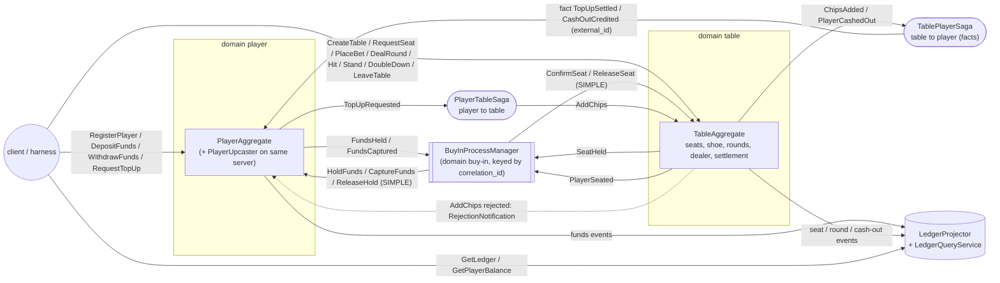
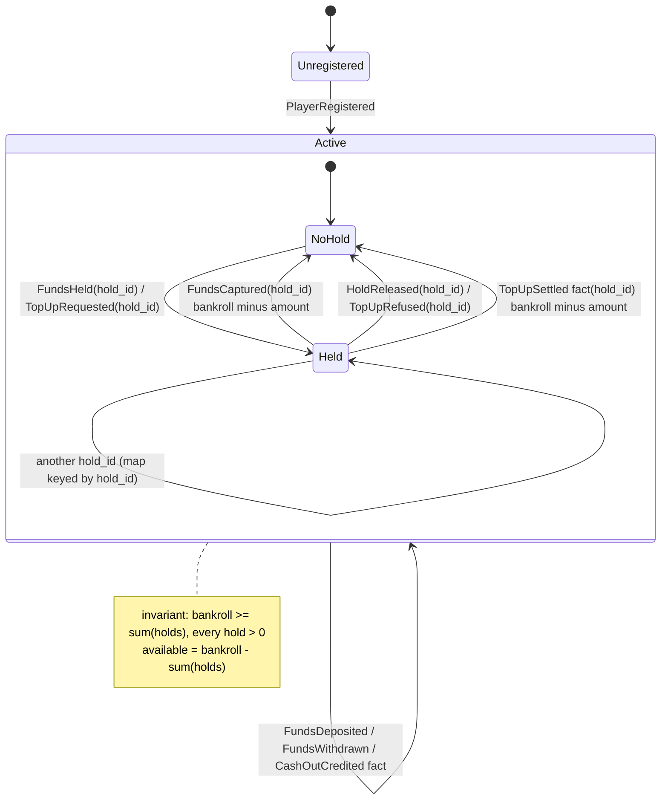
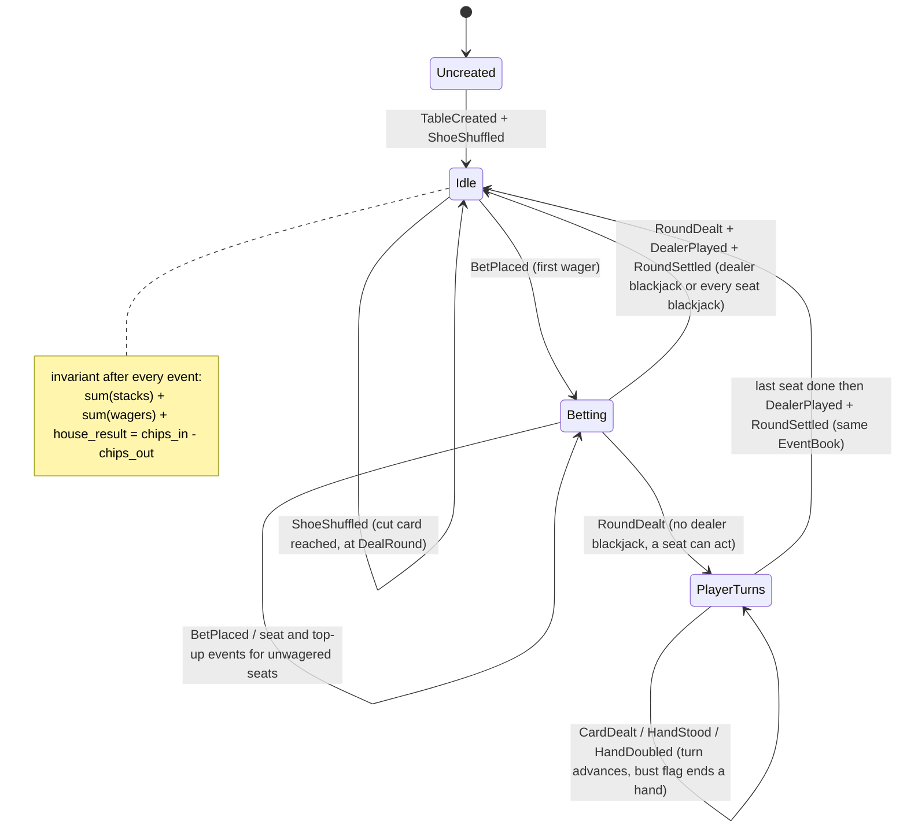
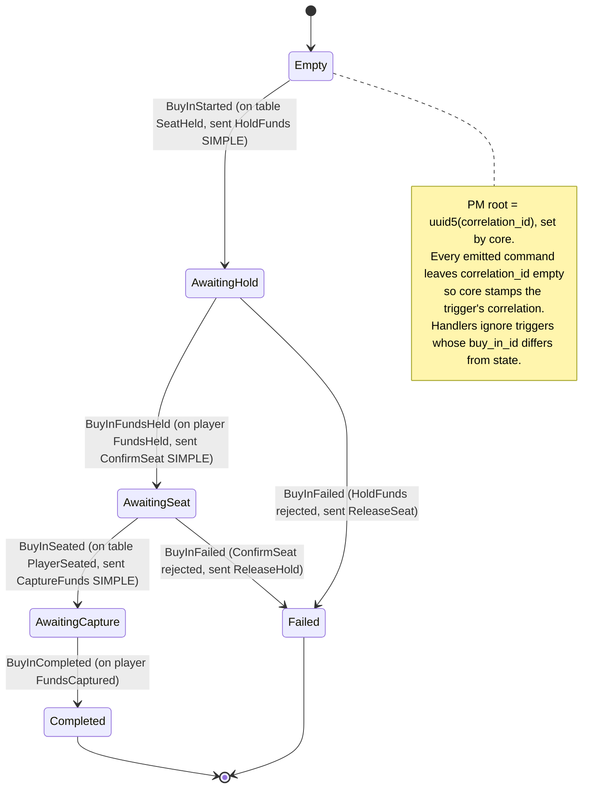
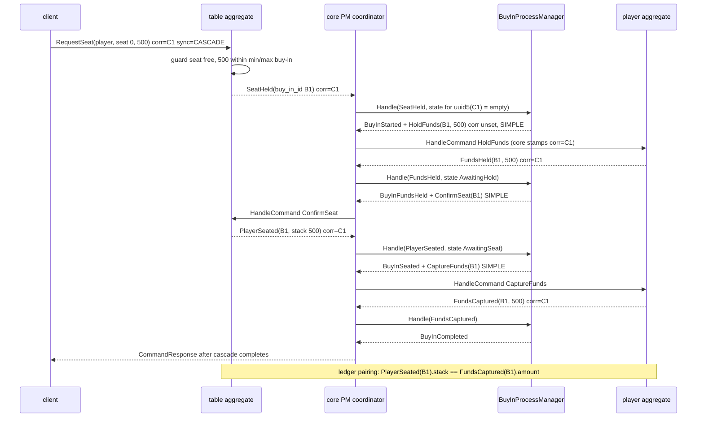
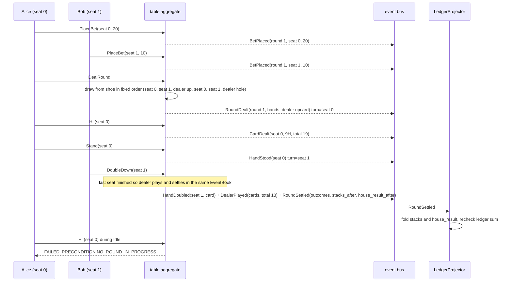
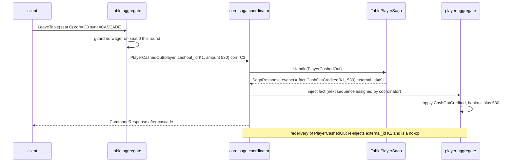
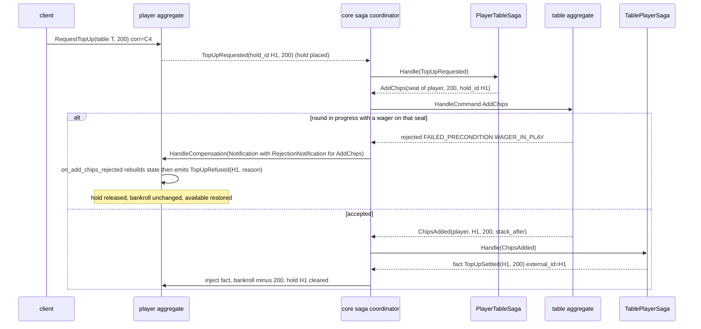
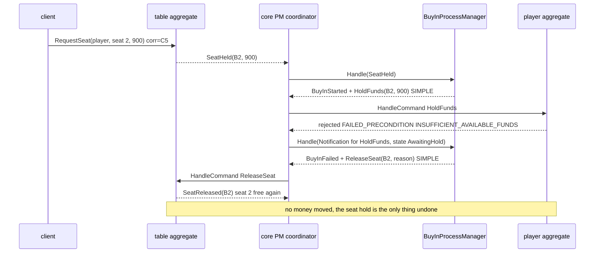
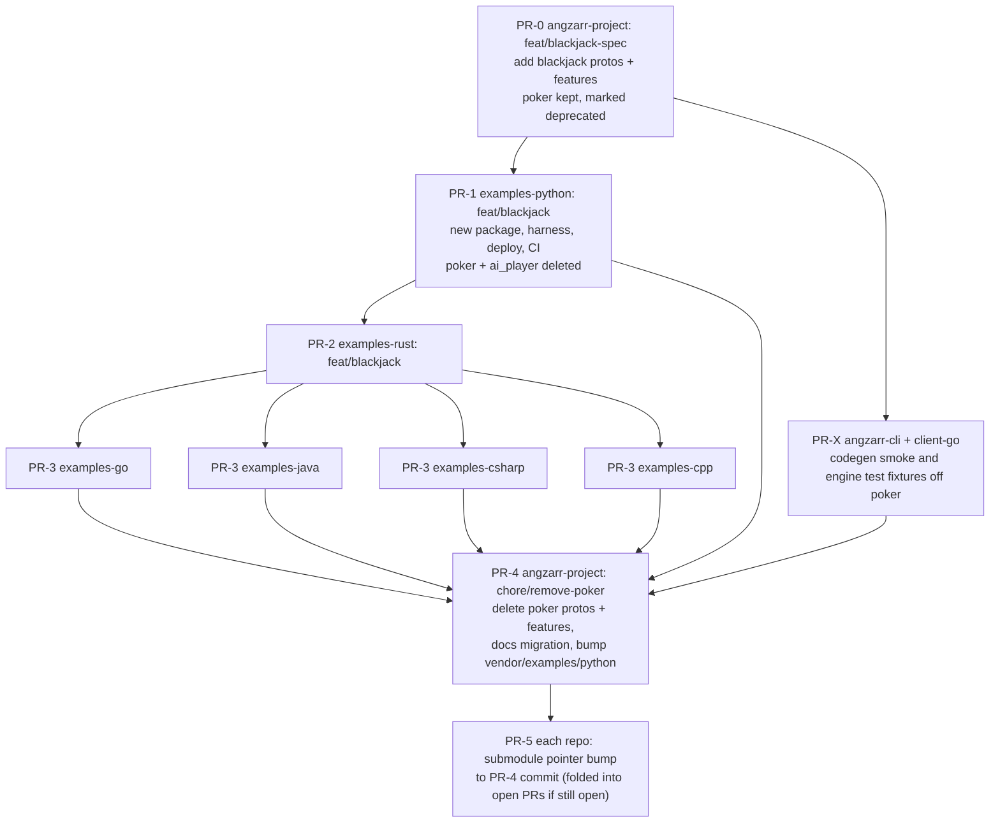

# Blackjack example — replacement plan

Status: DRAFT for user review (2026-09-30). Nothing has been implemented or modified.
Baselines read: angzarr-project `origin/main` 5b02b1f; examples-python `refactor/python-src-layout` 9d62d8a (101 ahead of origin/main, the de-facto template); other examples repos on `unify-naming-and-oo-style` / `refactor/reservation`; core `feat/snapshot-temporal-wiring`; review set `reviews-v2/`.
All mermaid blocks below were validated with mmdc (sources in `scratchpad/mmd/blackjack/01..10-*.mmd`).

**Constraint sources applied:**
- `core/rem-integration/CLAUDE.md`: Coordinators; Saga/PM "Facts over state rebuilding"; Event Design; Subscriptions; Project Layout and naming; Testing/Gherkin authoring; Skaffold-mandatory; 90% mutation target.
- `core/rem-integration/plans/review-2026-09/REMEDIATION.md` decided semantics:
  - MERGE_COMMUTATIVE = field-overlap merge.
  - Sagas/PMs emit `angzarr_deferred` commands; the framework stamps sequences and `basis_seq`.
  - Enum numbering is unchanged.
  - Poker findings are not fixed, because poker is being replaced.
  - angzarr-project spec work goes on `fix/review-2026-09` (worktree `angzarr-project.review`), which now carries `b993c65`: `skip_handler` (facts route through `handle_fact` by default) and `basis_seq`.

---

## 1. Goals & non-goals

### Goals
1. Replace poker with a **small blackjack table** example: spec (protos and features in angzarr-project) and all six `examples-*` repos. Delete poker completely rather than keeping both.
2. **Every framework capability the old example claimed is exercised correctly at least once** (§3). This covers the ones poker had broken: PM correlation, PM sync, compensation end to end, facts, snapshots and the ledger.
3. **Money provably balances.** One ledger model with stated invariants, asserted at unit, in-process and cluster tiers (§2.4).
4. **No PM for single-domain orchestration.** Dealing, player turns, dealer play and settlement all run inside `TableAggregate`. The PM exists only for the one cross-domain flow that needs it (buy-in).
5. **Tests that can fail.** Real assertions, no step that does nothing, runners fail on undefined or skipped steps, and a mutation gate. Cluster assertions are bus-driven (EventStreamSubscriber) or query-driven, never bookkeeping mirrors.
6. **Thin CI.** Workflows call `just ci-*` recipes, and no copies or symlinks of protos or features.

### Non-goals
- Poker parity, tournaments, multi-table coordination, split, insurance, surrender, even money, side bets, action clocks and timeouts.
- ML/AI (§5.1 decision: delete it).
- Fixing core defects inside the example. Core defects the example exposes are listed as **prerequisites** (§8), and the example's scenarios are the end-to-end proof that they are fixed.

### Size targets (hand-written code; generated code, vendored code and model binaries excluded; counts are approximate)
| Repo | Current LOC (src+tests) | Current deployables | Target LOC | Target deployables |
|---|---|---|---|---|
| angzarr-project spec | 15 example protos / 4,124 lines; 21 example md+feature files / 9,468 lines (~600 scenarios) | — | 6 protos / ~550 lines; ~9 feature/md files / ~1,600 lines (~95 scenarios) | — |
| examples-python | 26.6k (src 7.9k, tests 14.5k, ai_player 4.0k) + ~181 MB of untracked `.pt` models | 15 images + AI player | ~4.5k (src ~1.8k, tests ~2.7k) | 6 |
| examples-rust | 41.6k (tests 17.5k) | ~12 targets (several undeployable, X-032) | ~5.5k | 6 |
| examples-go | 24.2k (tests 16.8k) | ~10 | ~4.5k | 6 |
| examples-java | 19.1k (tests 13.1k) | ~8 | ~5k | 6 |
| examples-csharp | 15.2k (tests 9.8k) | ~9 | ~5k | 6 |
| examples-cpp | 24.6k (tests 16.2k) | ~10 (+ `-oo` duplicates) | ~5.5k | 6 |

Component count goes from (5 aggregates, 2 PMs, 6–9 sagas, 2–3 projectors, 1–2 upcasters, AI sidecar) to **(2 aggregates, 1 PM, 2 sagas, 1 projector, 1 upcaster hosted in the player aggregate's server)**.

---

## 2. Domain design

### 2.1 Bounded contexts and components (each one justified)



| Component | Kind | Why it exists (and why it can't be removed or merged) |
|---|---|---|
| `PlayerAggregate` (`player`) | aggregate | Owns the wallet: bankroll, holds, deposits and withdrawals. It is the source of truth for money not at a table. It also hosts the only **aggregate-level compensator** (`compensates: AddChips`). |
| `TableAggregate` (`table`) | aggregate | Owns seats, stacks, the shoe, the current round, dealer play, settlement and the house result. Everything within one table is a single consistency boundary, so the whole round lifecycle happens in-aggregate: multi-event books, no PM (policy). |
| `BuyInProcessManager` | PM | Buy-in has to secure **two resources in two domains**: a seat hold at the table and a funds hold at the player. Each is confirmed or released depending on the other's outcome. Neither aggregate owns that flow state, and every next step depends on the previous result. That is the textbook cross-domain orchestration case. It is the only PM. |
| `PlayerTableSaga` | saga | Top-up is choreography: one resource (funds) plus one remote validation (the table accepts the chips). A stateless translation `TopUpRequested → AddChips` is enough. It exists to demonstrate **saga → rejection → source-aggregate compensation**, the path poker never got working (X-023/X-005/X-024). |
| `TablePlayerSaga` | saga | Translates table-side money movements that are already final into player **facts** (`TopUpSettled`, `CashOutCredited`), keyed by `external_id`. The table's decision cannot be refused by the player, so these are facts, not commands. It exists to demonstrate fact injection and idempotency, which `coordinator-contract/fact_flow.feature` specifies but nothing executes today. |
| `LedgerProjector` + `LedgerQueryService` | projector (+ example read API) | A read model over **both** domains (multi-domain subscription). It serves per-player balances (the successor to `PlayerBalanceProjection`/EA-0004) and a global ledger row with a `balanced` flag, which is one of the three places the ledger invariant is asserted. It is also the target of SIMPLE sync ("wait for projectors"). |
| `PlayerUpcaster` | upcaster (served by the player aggregate binary, as the chart expects: `upcaster.enabled`, same address) | Demonstrates the UpcasterService contract (`FundsDepositedV1 → FundsDeposited`). It is not a separate deployable. |

**Deployable / module names** (CLAUDE.md naming: `agg-{domain}`, `saga-{source}-{target}`, `projector-{source}-{feature}`, `pmg-{name}`; one crate/module per component, never env-switched combined binaries):

| Component | Name | Directory (CLAUDE.md Project Layout, all six repos) |
|---|---|---|
| PlayerAggregate (+ upcaster) | `agg-player` | `player/agg/` |
| TableAggregate | `agg-table` | `table/agg/` |
| PlayerTableSaga | `saga-player-table` | `player/saga-table/` |
| TablePlayerSaga | `saga-table-player` | `table/saga-player/` |
| BuyInProcessManager | `pmg-buy-in` | `pmg-buy-in/` |
| LedgerProjector | `projector-player-table-ledger` (multi-source: sources are joined in the name) | `prj-ledger/` |

**Output kinds** (CLAUDE.md "Facts over state rebuilding"):
- `saga-table-player` emits **facts** (`TopUpSettled`, `CashOutCredited`). This is the norm: the table's decision is final and the player only records it.
- Facts route through the player's `handle_fact` (the `skip_handler=false` default from b993c65) for error checking only. They are never business-rejected.
- `saga-player-table` emits a **command** (`AddChips`), because the table must validate and can reject (mid-round, over max). That rejection is the point of the flow.
- `pmg-buy-in` emits **commands** with `SyncMode::SIMPLE`, because each step's accept/reject decides the next.
- Neither saga nor the PM queries or rebuilds destination state. Events are enriched at the source: `TopUpRequested` carries `table_root` and `amount`; `PlayerCashedOut` carries `player_root` and `amount`.
- All saga/PM commands are `angzarr_deferred`. The framework stamps the sequence and `basis_seq`; no component sets explicit sequences. The current Python `TableHandSaga` pattern of `dests.sequence_for(...)` plus explicit `header.sequence` must **not** be ported.

**Handler style** (CLAUDE.md Aggregates): every command handler is `guard(state)` → `validate(cmd, state)` → `compute(cmd, state, validated)`, as pure functions with unit tests on each. The player domain is written functionally; the table is object-oriented, keeping the two styles CLAUDE.md prescribes.

Rejected alternatives:
- A separate reservation aggregate. Poker's version (X-057) added a root-alignment problem for nothing.
- A hand aggregate or round PM. That is single-domain, so it belongs in-aggregate (X-027).
- A narrator/output projector. It only renders text; the ledger projector covers the projector capabilities, and the docs switch to it.
- A cashier aggregate. The house result lives on the table.

### 2.2 Blackjack rules scope (house rules "AHR-n", cited from features via `# Rule:`)
| ID | Rule |
|---|---|
| AHR-1 | 1–7 seats, one player and one hand per seat. `decks` 1–8 (default 1). |
| AHR-2 | Cards: rank 1..13 (A=1, J/Q/K=10 points), suit 0..3, index = (suit·13 + rank−1). Ace counts 11 unless that busts (soft/hard totals). |
| AHR-3 | **Deterministic shuffle.** `ShoeShuffled` records the full card order (so replay needs no RNG). The order is produced by Fisher–Yates driven by SplitMix64 from a `uint64` seed, using unbiased bounded draws (rejection sampling). The exact algorithm is pinned in `cards.proto` comments with golden vectors in `shoe.feature`. The next shoe's seed is `splitmix64(prev_seed)`. |
| AHR-4 | **Reshuffle bound.** At `DealRound`, reshuffle (same EventBook, before `RoundDealt`) if remaining cards < 11 × (wagered seats + 1). 11 is the maximum number of cards in a hand totalling ≤ 21, so a round can never exhaust the shoe and no mid-round reshuffle exists. |
| AHR-5 | Bets: `min_bet ≤ bet ≤ max_bet`, **even** amounts only (so 3:2 is always integral), one bet per seat per round, placed only when there is no round in progress. |
| AHR-6 | Deal order: each wagered seat ascending, dealer up-card, each seat again, dealer hole card. |
| AHR-7 | Dealer peeks when the up-card is A or 10-value. On dealer blackjack the round settles immediately (player blackjacks push, everyone else loses). |
| AHR-8 | Player blackjack (A + 10-value on the first two cards) with no dealer blackjack pays **3:2**. The hand is complete immediately. |
| AHR-9 | Turn order: wagered seats ascending, skipping completed hands. Only the seat on turn may act. |
| AHR-10 | Actions: Hit; Stand; **Double** (first two cards only, stack ≥ wager, exactly one card, then the hand ends). A bust ends the hand. No split, insurance, surrender or even money. |
| AHR-11 | The dealer **stands on all 17s (S17)** and draws only if at least one non-busted, non-blackjack player hand remains. |
| AHR-12 | Settlement: win pays 1:1, blackjack 3:2, push returns the wager, loss pays 0. `house_delta = Σ wagers − Σ returned`. |
| AHR-13 | Seating, top-up and leave are allowed only for a seat with **no wager in the current round**. Buy-in and top-up amounts must stay within `[min_buy_in, max_buy_in]` for the resulting stack. |

Tests need specific card sequences. **Unit tier:** seed history with a `ShoeShuffled` event whose card list is given in the scenario ("Given the shoe is: A♠ K♦ 9♣ …"). This is the normal given-prior-events pattern and adds no test-only production surface. **Cluster tier:** use named golden seeds from `shoe.feature` (e.g. "seed 7 deals Alice a blackjack").

### 2.3 Messages (proto sketches, package `io.angzarr.examples.v1`, using `(io.angzarr.v1.component|command|event)` annotations as today)

`cards.proto` (replaces `poker_types.proto`)
```proto
enum Suit { SUIT_UNSPECIFIED = 0; CLUBS = 1; DIAMONDS = 2; HEARTS = 3; SPADES = 4; }
message Card { uint32 rank = 1; /* 1..13 */ Suit suit = 2; }
// SplitMix64 + Fisher-Yates algorithm spec and golden vectors documented here.
```

`player.proto`
```proto
// Commands (component: PlayerState)
message RegisterPlayer   { string display_name = 1; string email = 2; }  // field tags kept: core tests/acceptance_features.rs mirrors them
message DepositFunds     { int64 amount = 1; }
message WithdrawFunds    { int64 amount = 1; }
message RequestTopUp     { bytes table_root = 1; int64 amount = 2; bytes request_id = 3; } // client; request_id -> hold_id (idempotent)
message HoldFunds        { bytes hold_id = 1; bytes table_root = 2; int64 amount = 3; }   // PM only
message CaptureFunds     { bytes hold_id = 1; }                                          // PM only
message ReleaseHold      { bytes hold_id = 1; string reason = 2; }                       // PM only
// Events (each also carries (event) entries for LedgerProjection / BuyInState / PlayerTableSaga as applicable)
message PlayerRegistered { string display_name = 1; string email = 2; Timestamp at = 3; }
message FundsDeposited   { int64 amount = 1; Timestamp at = 2; }
message FundsDepositedV1 { int64 amount_chips = 1; }            // legacy shape, only ever seen by PlayerUpcaster
message FundsWithdrawn   { int64 amount = 1; Timestamp at = 2; }
message FundsHeld        { bytes hold_id = 1; bytes table_root = 2; int64 amount = 3; }     // -> BuyInState trigger
message FundsCaptured    { bytes hold_id = 1; int64 amount = 2; }                            // -> BuyInState trigger
message HoldReleased     { bytes hold_id = 1; int64 amount = 2; string reason = 3; }
message TopUpRequested   { bytes hold_id = 1; bytes table_root = 2; int64 amount = 3; }     // -> PlayerTableSaga
message TopUpRefused     { bytes hold_id = 1; int64 amount = 2; string code = 3; }          // compensation output
message TopUpSettled     { bytes hold_id = 1; int64 amount = 2; bytes table_root = 3; }     // FACT from TablePlayerSaga
message CashOutCredited  { bytes cashout_id = 1; int64 amount = 2; bytes table_root = 3; }  // FACT from TablePlayerSaga
message Hold { bytes table_root = 1; int64 amount = 2; string purpose = 3; /* "buy_in" | "top_up" */ }
message PlayerState {
  option (io.angzarr.v1.component) = { kind: COMPONENT_KIND_AGGREGATE input_domain: "player" name: "PlayerAggregate"
                                       compensates: "io.angzarr.examples.v1.AddChips" };
  string display_name = 1; string email = 2; bool registered = 3;
  int64 bankroll = 4;                // includes held funds
  map<string, Hold> holds = 5;       // key = hex(hold_id)
  int64 total_deposited = 6; int64 total_withdrawn = 7;
  int64 total_to_tables = 8; int64 total_from_tables = 9;
}
```
Player rejections:
- `PLAYER_ALREADY_EXISTS`, `PLAYER_NOT_FOUND`, `INSUFFICIENT_AVAILABLE_FUNDS`, `HOLD_NOT_FOUND`, `HOLD_CONFLICT` (same id, different amount) → FAILED_PRECONDITION.
- `AMOUNT_NOT_POSITIVE`, `DISPLAY_NAME_REQUIRED` → INVALID_ARGUMENT.
- `HoldFunds`/`CaptureFunds`/`ReleaseHold` with an already-applied id and identical payload succeed with no events (Postel: PM redelivery is harmless).

`table.proto`
```proto
// Commands (component: TableState)
message CreateTable  { string name = 1; int64 min_bet = 2; int64 max_bet = 3; int64 min_buy_in = 4; int64 max_buy_in = 5;
                       int32 seats = 6; int32 decks = 7; uint64 shoe_seed = 8; }
message RequestSeat  { bytes player_root = 1; int32 seat = 2; int64 amount = 3; bytes request_id = 4; } // client; request_id -> buy_in_id
message ConfirmSeat  { bytes buy_in_id = 1; }                         // PM only
message ReleaseSeat  { bytes buy_in_id = 1; string reason = 2; }      // PM only
message AddChips     { bytes player_root = 1; bytes hold_id = 2; int64 amount = 3; } // PlayerTableSaga only
message LeaveTable   { int32 seat = 1; }
message PlaceBet     { int32 seat = 1; int64 amount = 2; }
message DealRound    {}
message Hit          { int32 seat = 1; }
message Stand        { int32 seat = 1; }
message DoubleDown   { int32 seat = 1; }
// Events
message TableCreated    { /* config echo */ }
message ShoeShuffled    { uint32 shoe_number = 1; uint64 seed = 2; repeated Card cards = 3; }
message SeatHeld        { bytes buy_in_id = 1; bytes player_root = 2; int32 seat = 3; int64 amount = 4; } // -> BuyInState trigger
message SeatReleased    { bytes buy_in_id = 1; int32 seat = 2; string reason = 3; }
message PlayerSeated    { bytes buy_in_id = 1; bytes player_root = 2; int32 seat = 3; int64 stack = 4; }  // -> BuyInState, Ledger
message ChipsAdded      { bytes hold_id = 1; bytes player_root = 2; int32 seat = 3; int64 amount = 4; }  // -> TablePlayerSaga, Ledger
message PlayerCashedOut { bytes cashout_id = 1; bytes player_root = 2; int32 seat = 3; int64 amount = 4; } // -> TablePlayerSaga, Ledger
message BetPlaced       { uint32 round = 1; int32 seat = 2; int64 amount = 3; }
message SeatHand        { int32 seat = 1; repeated Card cards = 2; uint32 total = 3; bool soft = 4; bool blackjack = 5; }
message RoundDealt      { uint32 round = 1; repeated SeatHand hands = 2; Card dealer_up = 3; Card dealer_hole = 4; int32 turn = 5; /* -1 none */ }
message CardDealt       { int32 seat = 1; Card card = 2; uint32 total = 3; bool soft = 4; bool busted = 5; int32 next_turn = 6; }
message HandStood       { int32 seat = 1; int32 next_turn = 2; }
message HandDoubled     { int32 seat = 1; int64 added = 2; Card card = 3; uint32 total = 4; bool busted = 5; int32 next_turn = 6; }
message DealerPlayed    { repeated Card drawn = 1; uint32 total = 2; bool busted = 3; bool blackjack = 4; }
enum Outcome { OUTCOME_UNSPECIFIED = 0; LOSE = 1; PUSH = 2; WIN = 3; BLACKJACK = 4; }
message SeatOutcome     { int32 seat = 1; bytes player_root = 2; int64 wager = 3; Outcome outcome = 4; int64 returned = 5; int64 stack_after = 6; }
message RoundSettled    { uint32 round = 1; repeated SeatOutcome outcomes = 2; int64 house_delta = 3; int64 house_result_after = 4; }
message TableState {
  option (io.angzarr.v1.component) = { kind: COMPONENT_KIND_AGGREGATE input_domain: "table" name: "TableAggregate" };
  /* config, shoe (remaining cards, shoe_number, seed), seats map<int32,Seat{player_root, stack}>,
     seat_holds map<string,SeatHold>, phase (IDLE|BETTING|PLAYER_TURNS), round, wagers, hands, dealer cards,
     turn, house_result, chips_in, chips_out */
}
```
- `cashout_id = uuid5(table_root_uuid, "cashout/" + next_sequence)`, using `CommandContext.next_sequence`, so it is deterministic and replay-safe.
- `buy_in_id` and `hold_id` are client-supplied request ids. That makes `RequestSeat`/`RequestTopUp` idempotent and fixes the non-idempotent-initiate problem EXD-27 describes.

Table rejections:
- FAILED_PRECONDITION: `TABLE_ALREADY_EXISTS`, `TABLE_NOT_FOUND`, `SEAT_TAKEN` (seated or held), `PLAYER_ALREADY_SEATED`, `SEAT_HOLD_NOT_FOUND`, `NOT_SEATED`, `WAGER_IN_PLAY`, `ROUND_IN_PROGRESS`, `ALREADY_BET`, `INSUFFICIENT_STACK`, `NO_BETS`, `NO_ROUND_IN_PROGRESS`, `NOT_YOUR_TURN`, `DOUBLE_NOT_ALLOWED`.
- INVALID_ARGUMENT: `INVALID_TABLE_CONFIG`, `SEAT_OUT_OF_RANGE`, `BUY_IN_OUT_OF_RANGE`, `TOP_UP_EXCEEDS_MAX`, `BET_OUT_OF_RANGE`, `BET_NOT_EVEN`.
- **Multi-event books.** `DealRound` may emit `ShoeShuffled + RoundDealt [+ DealerPlayed + RoundSettled]`. The command that ends the last hand emits `CardDealt|HandStood|HandDoubled + DealerPlayed + RoundSettled`.

`buy_in.proto` (PM)
```proto
message BuyInState {
  option (io.angzarr.v1.component) = { kind: COMPONENT_KIND_PROCESS_MANAGER output_domain: "player" name: "BuyInProcessManager"
    compensates: "io.angzarr.examples.v1.HoldFunds" compensates: "io.angzarr.examples.v1.ConfirmSeat" };
  bytes buy_in_id = 1; bytes player_root = 2; bytes table_root = 3; int32 seat = 4; int64 amount = 5;
  enum Phase { PHASE_UNSPECIFIED = 0; AWAITING_HOLD = 1; AWAITING_SEAT = 2; AWAITING_CAPTURE = 3; COMPLETED = 4; FAILED = 5; }
  Phase phase = 6; string failure_code = 7;
}
// Process events (applies: true): BuyInStarted, BuyInFundsHeld, BuyInSeated, BuyInCompleted, BuyInFailed
// Triggers ((event) entries with domain): table.SeatHeld, player.FundsHeld, table.PlayerSeated, player.FundsCaptured
```
PM rules:
1. **Never set `correlation_id` on emitted commands.** Core fills it from the trigger, and PM state is keyed by `uuid5(correlation)`. A unit test asserts the emitted cover's correlation is empty or equal to the trigger's (X-025).
2. **Never set an explicit sequence.** Leave it deferred (X-026).
3. **Every emitted command carries `sync_mode = SIMPLE`**, because the next step depends on the outcome (X-028).
4. **Every handler guards `event.buy_in_id == state.buy_in_id` and the phase**, so foreign or redelivered triggers are no-ops (EXD-31).
5. **No decision logic** beyond branching on outcomes. Validation lives in the aggregates (EXD-30).

`sagas.proto` (replaces `components.proto`): `PlayerTableSaga {SAGA input "player" output "table"}` and `TablePlayerSaga {SAGA input "table" output "player"}`.

`ledger.proto` (replaces `projection.proto` + `player_projection_query.proto`)
```proto
message LedgerProjection { option (io.angzarr.v1.component) = { kind: COMPONENT_KIND_PROJECTOR input_domain: "player" name: "LedgerProjector" };
  /* per-player: bankroll, held; per-table: stacks, wagers, house_result, chips_in, chips_out; global: deposits, withdrawals */ }
service LedgerQueryService {
  rpc GetPlayerBalance(GetPlayerBalanceRequest) returns (PlayerBalanceView); // found flag kept (EA-0004 semantics)
  rpc GetLedger(GetLedgerRequest) returns (LedgerView);                      // totals + balanced flag + in_flight
}
```

Protos deleted: `ai_sidecar`, `hand`, `tournament`, `rebuy`, `registration`, `reservation`, `orchestration`, `order_workflow` (a PM with no aggregates, used by no consumer), `poker_types`, `projection`, `player_projection_query`, `components`; `player`, `table` and `buy_in` are rewritten.

### 2.4 State machines

**Player (funds holds)**


**Table (round lifecycle, all in-aggregate)**

(The reshuffle is emitted in the `DealRound` book, per AHR-4.)

**BuyInProcessManager**


### 2.5 Ledger model and invariants (where each is asserted)

**Model:** hold, then seat, then capture for buy-in; hold, then add chips, then settle (fact) for top-up; chips stay at the table across rounds; cash-out is a credit fact. The house result is tracked on each table (an unbounded float, signed).

| # | Invariant | Asserted where |
|---|---|---|
| L1 | Player: `bankroll ≥ Σ holds ≥ 0`, each hold > 0, `bankroll = deposited − withdrawn − to_tables + from_tables` | Unit property test (hypothesis/proptest over random command sequences) + an assertion inside the applier in debug builds; `player.feature` "the player's ledger is consistent" Then-step after every scenario that moves money |
| L2 | Table: `Σ stacks + Σ wagers + house_result = chips_in − chips_out` after **every** event | Unit property test over random rounds with random seeds; `round.feature` scenarios end with "the table ledger balances"; the settlement unit test pins exact payouts |
| L3 | Pairing: each `PlayerSeated(buy_in_id,X)` ⇔ exactly one `FundsCaptured(buy_in_id,X)`; each `ChipsAdded(hold_id,X)` ⇔ exactly one `TopUpSettled(hold_id,X)`; each `PlayerCashedOut(cashout_id,Y)` ⇔ exactly one `CashOutCredited(cashout_id,Y)` | Framework in-process scenario (full session through the in-process router with PM and sagas wired); cluster scenario via **EventQuery correlation query** across both domains |
| L4 | Global, at quiescence (all BuyIn PMs terminal, all sagas drained): `Σ bankroll + Σ(stacks + wagers) + Σ house_result = Σ deposits − Σ withdrawals` | In-process framework scenario; cluster: `LedgerQueryService.GetLedger().balanced == true` **and** the harness recomputes it from EventQuery books (authoritative) and checks it equals the projection |

The transient window (seated before captured, or chips added before settled) is exposed as `LedgerView.in_flight`. L4 is asserted only when `in_flight == 0`, and the cluster step waits for that.

### 2.6 Cross-domain flows

**Join table + buy-in (PM, CASCADE from the client)**


**One full round (single-domain; no PM)**


**Cash-out (saga → fact)**


**Rejection → compensation, path 1: saga → source aggregate (top-up refused mid-round)**


**Rejection → compensation, path 2: PM compensation (insufficient funds)**


---

## 3. Framework capability coverage matrix

| # | Capability | Spec reference | Poker component today (status) | Blackjack component | Tier asserting it |
|---|---|---|---|---|---|
| 1 | Aggregate command dispatch, state rebuild, typed events | client/command_handler, router | all 5 aggregates (hand never completes, X-046) | Player, Table | unit + cluster |
| 2 | Multi-event atomic command | client/aggregate_client "multi-event lands atomically" | tournament RecordTableHandComplete (duplicate seqs, X-060) | Table `DealRound` / final action → `DealerPlayed + RoundSettled` | unit (exact pages) + cluster |
| 3 | Typed rejections (FAILED_PRECONDITION vs INVALID_ARGUMENT, codes) | client/rejection, validation | per-aggregate error catalogs | Player + Table catalogs | unit tests (exact codes/messages), features (outcome only) |
| 4 | Saga event→command translation, source filter | client/saga, multi_handler | saga-table-hand (misroutes root, X-047) | PlayerTableSaga | framework + cluster |
| 5 | Saga → rejection → **source-aggregate compensation** | client/rejected_compensation, core features/acceptance/compensation_* | player `rejected(table, JoinTable)` (unreachable, EXD-19) | Player `compensates: AddChips` → TopUpRefused | framework + cluster (**needs core X-023/X-005/X-099/X-024**) |
| 6 | **Fact injection** + external_id idempotency | coordinator-contract/fact_flow | saga-player-table (dead code, EXD-28) | TablePlayerSaga → TopUpSettled, CashOutCredited | framework + cluster (redelivery no-op) |
| 7 | PM cross-domain orchestration, triggers + own-state appliers | client/process_manager | pmg-reservation (broken: X-006/025/026/028) | BuyInProcessManager | framework + cluster |
| 8 | PM compensation (`compensates` on PM) | client/rejection "Process manager rejections…" | none (no rejected handlers) | BuyIn compensates HoldFunds, ConfirmSeat | framework + cluster |
| 9 | PM correlation propagation / PM root = uuid5(correlation) | parity/client/identity.feature | violated (fresh uuid4, X-025) | BuyIn leaves correlation empty | unit (cover assertion) + cluster (correlation query) |
| 10 | PM sync policy (SIMPLE/CASCADE when outcome matters) | memory policy | violated (async parallel, X-028) | BuyIn emits SIMPLE | unit (sync_mode asserted on emitted cover) |
| 11 | Client sync modes ASYNC / SIMPLE / CASCADE | client/aggregate_client | acceptance partial | Deposit SIMPLE (projector visible on return); RequestSeat/LeaveTable CASCADE (seated / credited on return); PlaceBet ASYNC | cluster (**needs core X-014, X-031, X-012**) |
| 12 | Projector + example read-model query service | client/projector; EA-0004 | PlayerProjector + PlayerProjectionQueryService | LedgerProjector + LedgerQueryService | framework + cluster |
| 13 | Multi-domain projector subscription | multi_handler fan-out | OutputProjector (fresh instance per dispatch, X-149) | LedgerProjector (player + table) | framework + cluster |
| 14 | Projector idempotence on replay | framework/projector | OutputProjector | Ledger (keyed by root+sequence) | framework |
| 15 | Snapshots (write + rebuild from snapshot + tail) | coordinator-contract/state_building; query_client "latest snapshot" | claimed, clients ignore (X-094) | Table snapshot every N events (helm `snapshots`) | framework (rebuild equivalence) + cluster (query surfaces snapshot) |
| 16 | Upcaster | client/upcaster | upc-player passthrough (rust/go only) | PlayerUpcaster `FundsDepositedV1 → FundsDeposited` | unit + cluster (seeded legacy event replays) |
| 17 | Temporal query (as-of sequence/time) | client/query_client | none | "bankroll as of before round 2" | cluster (as-of-time **needs core X-020**) |
| 18 | Editions (what-if timeline) | client/query_client editions; coordinator-contract/edition_propagation | none | "replay round 1 in edition `alt-seed`" on the table | cluster (**needs core X-021/X-022**) |
| 19 | Speculative execution | client/speculative_client | none | speculative `WithdrawFunds` / `PlaceBet` returns events without persisting (the table shoe-leak caveat is documented) | cluster |
| 20 | Query client range + correlation query | client/query_client | acceptance polling | ledger audit L3 by correlation | cluster |
| 21 | Optimistic concurrency / MERGE_COMMUTATIVE = field-overlap merge (decided) | coordinator-contract/merge_strategy (being rewritten) | claimed (why-poker #7) | two racing `Hit`s on one seat overlap (shoe, hand, turn): the stale one gets retryable FAILED_PRECONDITION and on retry is NOT_YOUR_TURN or lands; a `DepositFunds` racing a `HoldFunds` touches disjoint fields (bankroll/totals vs holds), so both land; the saga's deferred `AddChips` carries `basis_seq` | unit (field-overlap expectation per command) + cluster |
| 22 | One event, several consumers ((event) repeated) | options.proto | HandStarted (saga + fold) | SeatHeld/PlayerSeated (fold + PM + projector), ChipsAdded (fold + saga + projector) | codegen + framework |
| 23 | Deterministic replay of nondeterminism | — | deck seed (predictable, test shuffle differs, X-189) | ShoeShuffled records the order; golden vectors | unit (cross-language byte parity) |
| 24 | Cross-language identity parity (uuid5 NAMESPACE_OID roots) | parity/client/identity | Python uses sha256 (violates policy) | all harnesses uuid5 | unit + cluster |
| 25 | Codegen from options (component/command/event/compensates) | options.proto; CLI | all poker protos; CLI generate-check fixture | all blackjack protos; CLI fixture moved (§5.6) | CLI + each repo build |
| 26 | Durability across restart | EA-0003 | player | player + table | cluster |
| 27 | K8s discovery: saga source-domain, PM subscriptions, projector | core chart | partially broken (X-031) | values for 6 components | cluster |
| 28 | Idempotent client commands (request ids) | — | non-idempotent initiate (EXD-27) | RequestSeat/RequestTopUp request_id | unit |
| — | Cover.ext, DLQ, stream service, CloudEvents | client tier / core / prj-* | TableExt; prj-cloudevents in go/cs/cpp | **not in example** (client/core tier owns them; CloudEvents dropped for Python-template parity, see §8 Q6) | — |

---

## 4. Spec changes in angzarr-project

### 4.1 Protos (`proto/io/angzarr/examples/v1/`)
- **Add:** `cards.proto`, `player.proto` (rewrite), `table.proto` (rewrite), `buy_in.proto` (rewrite), `sagas.proto`, `ledger.proto`.
- **Delete:** `ai_sidecar`, `hand`, `tournament`, `rebuy`, `registration`, `reservation`, `orchestration`, `order_workflow`, `poker_types`, `projection`, `player_projection_query`, `components`.
- Keep `RegisterPlayer` FQN and field tags 1/2. `core/main/tests/acceptance_features.rs` mirrors them.
- Gates: `buf lint`; `angzarr lint` (CLI lint-proto: annotation resolution plus the X-122 collision check); breaking changes in the `examples` package are allowed by explicit buf config (`except` for `io/angzarr/examples`).

### 4.2 Features
New layout: `features/example/{blackjack,framework,acceptance}/`. New tag ranges: `@EU-1400..1599` and `@EA-0014..0049`. All poker IDs are retired and never reused.

**`blackjack/player.feature`** (EU-1400–1429)
- Registering a player opens an empty wallet
- A second registration for the same player is refused
- Deposits increase the bankroll
- A non-positive deposit is refused
- Withdrawals decrease the bankroll
- A withdrawal cannot touch held funds
- Holding funds reduces what is available but not the bankroll
- A hold larger than the available balance is refused
- Repeating an identical hold is harmless
- Reusing a hold id for a different amount is refused
- Capturing a hold spends it
- Releasing a hold restores availability
- Requesting a top-up places a hold for the table
- A refused top-up releases its hold
- A settled top-up spends its hold
- Cash-out credits arrive as facts and raise the bankroll
- A legacy deposit event is upcast on replay
- The player ledger balances after any sequence of money moves (L1)

**`blackjack/table.feature`** (EU-1430–1459)
- Creating a table shuffles its first shoe from the seed
- Invalid table configurations are refused
- A seat request holds the seat for the buy-in
- A taken or held seat cannot be requested
- A seat request outside the buy-in range is refused
- A player cannot hold two seats
- Confirming a held seat seats the player with the buy-in as stack
- Releasing a held seat frees it
- Adding chips to an idle seat raises the stack
- Adding chips while a wager is in play is refused
- A top-up that would exceed the maximum buy-in is refused
- Leaving cashes out the whole stack
- A player with a wager in play cannot leave
- The table ledger balances after seating, top-up and cash-out (L2)

**`blackjack/round.feature`** (EU-1460–1519)
- Bets must be even and within the table limits
- A seat can bet once per round
- A bet cannot exceed the stack
- Dealing with no bets is refused
- Cards are dealt seat by seat, then the dealer, twice
- The first seat that can act gets the turn
- Only the seat on turn may act
- Hitting adds a card and keeps the turn below 21
- Busting ends the hand and passes the turn
- Standing passes the turn
- Doubling adds one card and ends the hand
- Doubling after the first two cards is refused
- Doubling without enough stack is refused
- A player blackjack is not asked to act
- The dealer stands on soft 17
- The dealer draws to 16
- The dealer does not draw when every hand is busted or blackjack
- Dealer blackjack settles the round at once
- Player and dealer blackjack push
- A winning hand is paid even money
- A player blackjack is paid three to two
- A push returns the wager
- A losing hand forfeits the wager to the house
- Settlement happens in the same step as the last action
- Acting between rounds is refused
- The shoe is reshuffled before a round that could run it out
- Soft totals count an ace as eleven until it would bust
- Every round keeps the table ledger balanced (L2; Scenario Outline over ~12 golden seeds)

**`blackjack/shoe.feature`** (EU-1520–1529)
- Seed 1, one deck: first 12 cards
- Seed 42, one deck: first 12 cards
- Seed 7, six decks: first 12 cards
- The next shoe's seed follows from the previous one
- A shuffled shoe contains every card exactly `decks` times

These are golden vectors for cross-language byte parity.

**`framework/saga.feature`** (EU-1530–1545, rewrite)
- A top-up request becomes an AddChips command for the table
- The saga ignores player events it does not handle
- Chips added at the table become a settled top-up fact for the player
- A cash-out becomes a credit fact for the player
- Redelivering the same cash-out does not credit twice
- A refused AddChips is compensated by the player releasing the hold
- The compensation handler sees the player's current state
- A rejection of an unrelated command does not trigger the top-up compensation

**Gherkin authoring rule (CLAUDE.md):** titles and steps say what happens and why, never how. Technical contract checks live in each repo's native unit tests (`test_*_logic.py`, `*_test.go`, `*.test.rs`, …), not in features:
- emitted commands have an empty correlation
- `sync_mode = SIMPLE`
- the sequence is `angzarr_deferred`
- `external_id` equals `cashout_id`/`hold_id`
- `cashout_id = uuid5(...)`
- exact rejection codes

**`framework/process_manager.feature`** (EU-1546–1565, rewrite; `orchestration.feature` folded in)
- A seat hold starts a buy-in and asks the player to hold funds
- Held funds lead to confirming the seat
- A seated player leads to capturing the funds
- Captured funds complete the buy-in
- Refused funds release the seat and fail the buy-in
- A refused seat confirmation releases the funds and fails the buy-in
- Triggers for a different buy-in are ignored
- Redelivered triggers do not repeat steps
- The buy-in state is rebuilt from its own events

**`framework/projector.feature`** (EU-1566–1580, rewrite)
- A registered player appears with a zero balance
- Deposits and withdrawals update the balance
- Held funds show as held, not spent
- Seating moves money from bankroll to table stack in the ledger
- Round settlement updates stacks and house result
- The ledger reports balanced when nothing is in flight
- The ledger reports in-flight money between seat and capture
- Replaying the same events leaves the ledger unchanged
- An unknown player is reported as not found

**`framework/session.feature`** (EU-1581–1590, new: in-process full session with PM + sagas + projector wired through the in-process router)
- A two-player session from deposit to cash-out balances the global ledger (L3, L4)
- Every buy-in, top-up and cash-out is paired exactly once (L3)
- A table state rebuilt from its snapshot equals the fully replayed state

**`acceptance/cluster.feature`** (EA-0014–0030, rewrite; `cluster_tournament.feature` deleted)
- Smoke: two players buy in, play one round and cash out across services
- A player who asks for a seat and waits sees themselves seated when the request returns
- A deposit made with read-your-writes is already in the ledger when it returns
- A deposit appears in the ledger within 3 seconds (successor to EA-0004)
- A buy-in with insufficient funds frees the seat (PM compensation)
- A top-up during a round is refused and its hold released (saga compensation)
- A cash-out credits the bankroll exactly once
- The global ledger balances after a scripted session (projection **and** EventQuery recompute)
- A correlation query gathers the buy-in across both domains
- Player and table state survive a service restart
- The table serves the latest snapshot after many rounds
- The bankroll as of before a round is queryable
- A what-if round in an edition leaves the main timeline untouched
- A speculative withdrawal returns events without persisting them
- Two racing hits for one seat: exactly one card is dealt
- A deposit racing a buy-in hold both succeed
- A legacy deposit event in the store is upcast on read

### 4.3 Other angzarr-project files
- `features/example/RULES.md`: rewrite as the Angzarr House Rules (AHR-1..13) with the bidirectional rule↔scenario index.
- `features/example/check_rule_citations.py`: scan `blackjack/` and `acceptance/` instead of `poker/`.
- **Delete:** `features/example/WIP_TRIAGE.md`, `ACCEPTANCE_REMEDIATION_PLAN.md`, `poker/` (7 files), `framework/orchestration.feature`, `acceptance/cluster_tournament.feature`.
- **Rewrite in blackjack vocabulary:** `features/README.md` (tier table), `features/example/README.md` ("Why blackjack"), `framework/README.md`, `acceptance/README.md` (env vars `PLAYER_URL`, `TABLE_URL`, `LEDGER_URL`), `STEP_VOCABULARY.md` §13 ("features/example — only blackjack types").
- `coordinator-contract/fact_flow.feature`: rewrite its poker vocabulary ("Hand injects ActionRequested…", "Player sitting out…") to generic or blackjack (CashOutCredited). `merge_strategy.feature`: drop the "Why poker exercises…" block.
- Top-level `justfile`: `check-rules` text, plus a new `ci` recipe (buf lint, `angzarr lint`, gherkin parse, scenario-ID uniqueness, `check-rules`).
- Add a thin `.github/workflows/ci.yml` calling `just ci`. This fixes X-007 (the spec repo has no CI).
- `README.md`: example description.

---

## 5. Per-repo migration

### 5.1 AI driver decision
**Delete it entirely:** `ai_player/` (4.0k LOC, its own Containerfile, uv.lock and chart), `models/` and `ai_player/models/` (~181 MB of untracked `.pt` files, plus `selfplay_new.db`), `k8s-game-job.yaml`, `deploy/k8s/helm/ai-player/`, the `ai-*`/`deploy-ai`/`run-game-ai` recipes, `AI_IMAGE`, `ai_sidecar.proto` and `TrainingProjection`.

Justification:
- It is poker-specific, Python-only by design, and not a framework capability.
- It drags in torch and model artifacts.
- Nothing in the coverage matrix needs it.

Replacement: a **~60-line basic-strategy bot** at `examples-python/tools/play_session.py` behind `just demo-session`, which reuses the acceptance gRPC client (hard totals: stand on 17+, 12–16 stand vs dealer 2–6 else hit, double on 10/11 vs a lower dealer card). It is not a component and not deployed. It keeps "watch a live session" demoable and doubles as a smoke/load driver. Like the AI driver, it is intentionally Python-only.

`site/.../features/ml-training.mdx` stays as an illustrative, generic page with its examples reworded (§6).

### 5.2 examples-python (template; lands first)
Base: continue on `refactor/python-src-layout`, which carries the src layout, CLI-codegen and FFI-router infrastructure, and replace poker within it (§8 Q1). Port the bus-driven harness pieces from `fix/eu-1375-1376-day2-resume` (`tests/event_log.py`, `tests/event_stream_subscriber.py`), then delete that branch.

**Delete:**
- `src/angzarr_poker/{hand,tournament,reservation,table,player,_shared}/**`
- all 15 poker `unit_steps/*.py`
- `acceptance_steps/cluster_steps.py` (1.5k lines of poker)
- `ai_player/`, `models/`, `k8s-game-job.yaml`, `deploy/k8s/helm/ai-player/`
- the duplicate `values.yaml` or `deploy/k8s/helm/values*.yaml` (keep one set)
- the duplicate `kind-config.yaml` or `deploy/kind/cluster.yaml` (keep one)
- `values-debug.yaml`, the committed `.coverage`, stray `mutants/`
- **Keep and rewrite `skaffold.yaml`**: Skaffold is mandatory for all image builds/deploys (CLAUDE.md, kind tag-cache staleness). It gets six artifacts, and `just up` is reworked to `skaffold run`, replacing today's `docker build` + `kind load` recipes (fix on contact).

**New package `src/angzarr_blackjack/`** (renamed from `angzarr_poker`; pyproject, codegen out-dir and mutmut paths follow):
```
_runtime/server.py, servicers.py (+ UpcasterServicer, since the router has no upcaster dispatch)
_gen/                                     (generated, gitignored)
cards.py                                  (Card helpers, SplitMix64, Fisher–Yates, totals)
player/agg/{handler.py, logic.py, upcaster.py, main.py}   agg-player (functional guard/validate/compute in logic.py; main also serves the upcaster)
player/saga_table/{handler.py, main.py}                   saga-player-table
table/agg/{handler.py, rules.py, main.py}                 agg-table (OO; rules.py = pure totals/dealer/settlement)
table/saga_player/{handler.py, main.py}                   saga-table-player
pmg_buy_in/{handler.py, main.py}                          pmg-buy-in
prj_ledger/{handler.py, query.py, main.py}                projector-player-table-ledger
```
- Docs region markers (`# region NAME` / `# endregion`) go in the new sources: `handlers` (table), `hold_funds` (player), `rejected_handler` (player `on_add_chips_rejected`), `saga` (PlayerTableSaga), `saga_facts` (TablePlayerSaga), `pm_state`, `pm_handler` (BuyIn), `projector` (Ledger).

This is CLAUDE.md's Project Layout (`{domain}/agg`, `{domain}/saga-{target}`, `pmg-{name}`, `prj-{name}`) as Python packages. It replaces today's `player/aggregate`, `table/sagas/table_hand` shape, and every other repo mirrors these directory names.

**Unit tier:**
- Native logic tests `tests/unit/test_*_logic.py` cover each guard/validate/compute function, with exact codes and messages.
- `unit_steps/{_harness.py, common_steps.py, player_steps.py, table_steps.py, round_steps.py, shoe_steps.py, saga_steps.py, pm_steps.py, projector_steps.py, session_steps.py}`.
- Roots derive via `uuid5(NAMESPACE_OID, label)` (today the harness uses sha256, which violates the policy).
- behave runs with `--strict` plus a hook that fails on undefined steps.
- Property tests (hypothesis) for L1/L2 go in `tests/unit/`.
- `tests/example/test_features.py` switches its feature paths to `blackjack` + `framework` (the mutmut bridge stays).

**Acceptance tier:**
- Rewrite `acceptance_steps/{_client.py, _world.py, cluster_steps.py}`.
- `_world` roots: `uuid5(NAMESPACE_OID, f"{nonce}:{label}")`. The correlation is the scenario nonce.
- Assertions come from EventStreamSubscriber (AMQP; credentials from `secret/angzarr-mq`) and EventQuery/LedgerQuery. No local bookkeeping.

**justfile / justfile.container:**
- `KIND_CLUSTER := "angzarr-blackjack"`.
- `COMPONENTS := "agg-player agg-table pmg-buy-in saga-player-table saga-table-player projector-player-table-ledger"`, exposed via `just components` for CI.
- Drop the AI recipes. `run-player`/`run-table`.
- Env `PLAYER_URL`/`TABLE_URL`/`LEDGER_URL`, NodePorts 31320 (player), 31321 (table), 31325 (ledger query).
- New `ci-test`, `ci-images`, `ci-acceptance` recipes.

**Containerfile:** six targets.

**Helm values:**
- business: `agg-player` (with `upcaster.enabled`) and `agg-table` (with snapshot interval, e.g. every 20 events).
- sagas: `saga-player-table` (source-domain player) and `saga-table-player` (source-domain table).
- processManagers: `pmg-buy-in` (`ANGZARR_SUBSCRIPTIONS="table:SeatHeld,PlayerSeated;player:FundsHeld,FundsCaptured"`, coordinator port per memory).
- projectors: `projector-player-table-ledger` (subscriptions `player;table`, query port exposed).

**CI:**
- `ci.yml` (541 lines) shrinks to jobs that call `just ci-*`. This also fixes the stale `angzarr-client-python` submodule steps (pre-existing breakage: that submodule no longer exists) and the stale `prj-training` matrix entry.
- `mutation.yml` → `just mutation-test` (≥90% kill on `src/angzarr_blackjack`, per CLAUDE.md; today's recipe threshold is 80% and is raised).
- `bump-coordinator-digests.yml` is unchanged.

**README:** rewrite.

### 5.3 examples-rust (second)
Base: `origin/main`. Abandon `refactor/reservation` (dirty; poker-only WIP). Salvage only the submodule/v1 bump commits (§8 Q1).

**Delete:**
- `hand/`, `tournament/`, `reservation/`, `pmg-hand-flow/`, `pmg-reservation/`, `prj-output/`, `table/`, `player/` (rewritten)
- `angzarr-proto/`, `proto/` (proto copies; point `build.rs` at `angzarr-project/proto`)
- `data/`, `mutants.out*`, `build.json`, `spec-draft.md`, `spec-framework-analysis.md`, `TASKS.md`, `Makefile`, `install-docker.sh`, `standalone.yaml`, `values-debug.yaml`, the root `values.yaml` duplicate
- poker tests under `tests/tests/*`

**New workspace, mirroring Python's layout:**
```
examples-proto/                           (generated at build from the submodule; no copies)
player/agg              (crate agg-player, + upcaster)
player/saga-table       (crate saga-player-table)
table/agg               (crate agg-table)
table/saga-player       (crate saga-table-player)
pmg-buy-in              (crate pmg-buy-in)
prj-ledger              (crate projector-player-table-ledger)
tests/                                    (cucumber-rs unit + acceptance via run_and_exit, fail_on_skipped)
```
Only `examples-utils` is kept, trimmed.

- Engine: client-rust macros; there is no Rust CLI codegen target (§8 Q2).
- Replace the vendored `angzarr-client-rust` submodule with a pinned git/crates dependency (X-033 pattern).
- Deploy, justfile and CI get the same shape as Python: thin `ci.yml` and `acceptance-callable.yml`, with `just ci-*`.

### 5.4 examples-go / examples-java / examples-csharp / examples-cpp (fan-out, in parallel)
Base: `origin/main` for each. Abandon the poker parts of `unify-naming-and-oo-style` (20–43 commits ahead) and salvage only engine/infra commits (§8 Q1).

Common to all four:
- Delete every poker module.
- Create the six component modules mirroring Python's paths.
- Implement against **CLI codegen + angzarr-router binding**, like Python (recommended; §8 Q2).
- Runners read `angzarr-project/features/...` directly, with no symlinks, and fail on undefined/pending steps.
- Shoe golden vectors must match.
- Thin CI calls `just ci-*`.
- Consolidate `values.yaml` / `values-ci.yaml`.
- Delete `mutants-reports/` and `TASKS.md`.

| Repo | Delete (in addition to poker domains) | Notes |
|---|---|---|
| examples-go | `hand/`, `tournament/`, `reservation/`, `pmg-hand-flow/`, `saga-hand/`, `saga-player/`, `saga-table/`, `prj-output/`, `prj-cloudevents/`, `upc/`, `agg/`, `standalone.yaml`, `Containerfile.local`, `values-debug.yaml`, `tests/*` (27 poker step files) | vendored `angzarr-client-go` is replaced by the router Go binding + the CLI `_gen` |
| examples-java | `hand/`, `hand-flow/`, `tournament/`, `reservation/`, `prj-output/`, `TIER5_PORT_PLAN.md`, `setup-java.sh`, `build/` (committed build output) | gradle subprojects per component |
| examples-csharp | `Hand/`, `HandFlow/`, `Tournament/`, `Reservation/`, `Pmg/`, `Prj/`, `PrjOutput/`, `PrjCloudEvents/`, the `features` **symlink** | one project per component in the `.sln` |
| examples-cpp | `hand/`, `hand-flow/`, `hand-flow-oo/`, `pmg-hand-flow/`, `prj-output/`, `prj-output-oo/`, `prj-cloudevents/`, `tournament/`, `reservation/`, `shim/` (poker aliases), `build/`, `build-mull/`, `build-regen/`, the `features/acceptance` symlink | keep cucumber-wire, but `features/` points at the submodule by path config |

### 5.5 core (no example code, but three touch points)
1. `tests/acceptance_features.rs` + `features/acceptance/end_to_end.feature` use `player.RegisterPlayer` against "the poker examples" cluster. Blackjack keeps that command stable, so only comments/wording change.
   - This is opt-in (`ANGZARR_ACCEPTANCE=1`) and **not run in CI**, so the core→examples direction holds in CI.
   - Longer term it should target a core-owned fixture (§8 Q7).
   - `compensation_emit/handle.feature` "need the saga/compensation example topology": the blackjack top-up flow is that topology.
2. `features/examples/unit/*.feature`: stale private poker copies (X-193). Delete them.
3. `core/CLAUDE.md`:
   - Its "Examples: CQRS-ES poker system" line becomes blackjack.
   - The Sagas/PMs "Destination sequences … use `StampCommand`" text contradicts the decided deferred + `basis_seq` model and is updated in the same edit (fix on contact).
4. Cosmetic: tofu `poker_valid/invalid.tftest.hcl` names, chart comments (`hand-flow-pm`), and the `justfile` / `README` / `CLAUDE.md` "poker domain" wording.

Legacy Docusaurus `core/docs/**` has 30+ poker pages (§8 Q8).

CI direction check (confirmed):
- core `ci.yml`/`release.yml` only **dispatch** `coordinator-images-published` to the examples bumpers; they do not gate on them.
- client-python and client-rust CI dispatch `client-updated` to their examples repos (fire-and-forget).
- **No core or client CI job runs example acceptance. No violation.**

### 5.6 Other repos that consume the example protos (would break when poker protos are deleted)
| Repo | Coupling | Change |
|---|---|---|
| angzarr-cli | `justfile generate-check` hard-codes `table_hand_saga_angzarr.pb.go` and the `TableHandSaga*` symbols | Point the smoke at CLI-owned fixture protos (reuse the router's `conformance/proto/test/counter` + a saga/PM fixture) and keep `lint-proto` over all of `angzarr-project/proto`. Interim alternative: swap the expected names to `table_aggregate` / `player_table_saga`. |
| client-go | `engine_gen_test.go` imports `examples.HandStarted` / `NewTableHandSagaDispatch` (a client test depending on example vocabulary, which violates the client-tier rule) | Replace with a client-owned test proto fixture |
| client-java | `proto/build.gradle.kts` default exclude `examples/ai_sidecar.proto` | Drop the exclude |
| client-python, angzarr-router | generate all protos incl. examples (gitignored / `go-binding-gen` doesn't exclude examples) | No code change. The new protos must compile in every language (a CI gate on the spec PR via the router's toolchain images, §7). |

---

## 6. Docs site migration (angzarr-project `site/`, Astro/Starlight)

Code regions are pulled from `vendor/examples/python` (pinned at a6c86bc, the old flat layout; `.gitmodules` tracks branch `unify-naming-and-oo-style`). After the Python blackjack PR merges:
- bump `vendor/examples/python` to that commit
- set the `.gitmodules` branch to `main`
- rewrite every `file=` reference

| Page | Today | Change |
|---|---|---|
| `components/aggregate.mdx` | `table/agg/handlers/table.py region=handlers`, `table/agg/main.py` | `src/angzarr_blackjack/table/agg/handler.py region=handlers`, `.../table/agg/main.py` |
| `components/process-manager.mdx` | `pmg-hand-flow/hand_flow_pm.py region=pm_state / pm_handler` (a policy-violating PM) | `pmg_buy_in/handler.py region=pm_state / pm_handler`. The prose is rewritten around the correlation, SIMPLE-sync and "when not to use a PM" rules (the round lifecycle is the counter-example). |
| `components/projector.mdx` | `prj-output/main.py region=projector` | `prj_ledger/handler.py region=projector` |
| `components/saga.mdx` | `table/saga-hand/main.py region=saga`, `splitter_example.py region=saga_splitter`, `player/agg/rejected.py region=rejected_handler` | PlayerTableSaga `region=saga`; TablePlayerSaga `region=saga_facts` (replaces the splitter; it shows one event → facts); player `region=rejected_handler` |
| `examples/aggregates.mdx` | table handlers ×2, `player/agg/handlers.py region=reserve_funds_imp`, table main | table handlers, `player/agg/logic.py region=hold_funds`, table main |
| `examples/sagas.mdx` | table saga-hand, player rejected | PlayerTableSaga, player rejected |
| `features/compensation.mdx`, `operations/error-recovery.mdx` | `player/agg/rejected.py region=rejected_handler` | new path, same region name; prose moves from JoinTable to AddChips |
| `intro.md` | table handlers | new path |
| `examples/why-poker.md` → `examples/why-blackjack.md` | poker rationale | Rewrite: two bounded contexts, two-resource buy-in (PM), top-up (saga + compensation), cash-out facts, in-aggregate round, ledger invariant, deterministic shoe. Update the **astro.config.mjs** sidebar (`Why Poker`) and the inbound links from `components/process-manager.mdx`, `components/saga.mdx`, `examples/aggregates.mdx`, `features/compensation.mdx`, `intro.md`. |
| `examples/projectors.mdx`, `examples/language-notes.md` | poker | blackjack ledger projector; language notes for the new module layout |
| `features/ml-training.mdx` (+ link in `features.mdx`, `features/editions.mdx`) | poker AI and training data | keep as an illustrative page; reword the examples to blackjack decision records (no code pulled) |
| `operations/rest-gateway.mdx` | `buf build --path player/ --path table/ --path hand/` | `--path io/angzarr/examples/v1` |
| Prose with poker terms (counted by grep) | `operations/testing` (28), `features/observability` (26), `features/projections` (24), `tooling/cucumber` (19), `features/performance` (18), `tooling/databases/dynamo` (17), `features/polyglot` (15), `features/debugging` (11), `tooling/buses/{sns-sqs,pubsub,amqp,nats,kafka}` (7–9 each), `reference/port-conventions` (8), `getting-started` (7), `features/upcasting` (7), `tooling/databases/{postgres,bigtable}`, `glossary/{domain,bounded-context,projection}`, `patterns-explained`, `features/{small-footprint,facts,editions}`, `reference/patterns`, `index.mdx`, `features.mdx`, `tooling/{opentofu,testcontainers}`, `roadmap`, `operations/observability`, `components/framework-projectors` | reword the examples to blackjack (player/table, buy-in, round, cash-out). Blog posts are historical and stay untouched. |
| **Pre-existing breakage (fix on contact)** | 21 `file=proto/angzarr_client/proto/angzarr/v1/types.proto` (and `stream.proto` ×2) references. The path no longer exists (renamed to `proto/io/angzarr/v1/`), so the non-lenient site build fails. | Repoint to `proto/io/angzarr/v1/*.proto`. Add `just site-build` (non-lenient) to the new `just ci`. |

---

## 7. Sequencing, branches/PRs, verification gates



**Spec base:** PR-0 and PR-4 are short-lived branches cut from angzarr-project `fix/review-2026-09` (worktree `/home/babbitt/workspace/angzarr/angzarr-project.review`, currently `b993c65` = origin/main + 2) and merged back into that integration branch, per REMEDIATION.md's one-integration-branch-per-repo rule. The 24 poker-only commits on `chore/de-nest-vendored-submodules` (Python's current pin `f538fb3`) are not carried forward.

Minimal PR set: **one PR per repo** plus one extra angzarr-project PR. That is PR-0, PR-1, PR-2, PR-3 ×4, PR-X (cli, client-go), PR-4: 10 PRs, and no per-component branches.
- **PR-0 is additive.** Poker protos and features stay but are marked deprecated. Consumers pinned to older commits and the CLI/client-go fixtures keep building until PR-4.
- **PR-4 deletes poker** and migrates the docs in one go. It must follow PR-1 so the vendored Python has the region markers.
- If a repo's blackjack PR is still open when PR-4 lands, the pointer bump (PR-5) is folded into that PR, not a new one.
- "Prove on one repo before fanning out": the four PR-3s start only after PR-1 **and** PR-2 are green end to end.

Alternative (fewer PRs, higher risk): PR-0 deletes poker immediately, and PR-X must merge before any consumer bumps. This saves PR-4 but requires the docs work in a separate PR anyway.

### Verification gates (all must be green, no `@wip` except scenarios tagged with a linked core finding, see §8 Q3)
| Gate | Scope | Checks |
|---|---|---|
| G0 spec | PR-0 / PR-4 | `just ci` in angzarr-project: buf lint; `angzarr lint` (annotations resolve, no collisions); gherkin parse; tag uniqueness and range; `check-rules`; non-lenient site build (PR-4); protos compile in the router's go/java/cs/cpp/python toolchain images (catches codegen breakage early) |
| G1 unit | each example repo | every blackjack + framework scenario passes in-process with **undefined/pending = fail**; exact codes/messages in native unit tests; L1/L2 property tests; shoe golden vectors identical across languages |
| G2 mutation | each example repo, after first green (policy) | Python mutmut ≥90% kill (CLAUDE.md target; all languages ≥90% on behaviour-relevant mutants) on `src/angzarr_blackjack`; Rust cargo-mutants (via `just mutants`, containerised) on `table/agg` rules + `pmg-buy-in`; Go/Java/C#/C++ per existing tooling (gremlins-equivalent / PIT / Stryker / mull). Survivors in settlement, turn order or PM branching are blocking. |
| G3 cluster | each example repo CI (kind + published coordinator images pinned by digest) | all `acceptance/cluster.feature` scenarios pass; assertions from the bus/EventQuery/LedgerQuery; ledger L4 balanced; runs via `just ci-acceptance` |
| G4 parity | after all PR-3s | same scenario pass list in all six repos (a scripted diff of runner outputs); identical ShoeShuffled bytes for the golden seeds; identical uuid5 roots |
| G5 docs | PR-4 | non-lenient `npm run build`; every `file=`/`region=` resolves; no poker terms left in non-blog pages (a grep check in `just ci`) |

---

## 8. Risks & open questions for the user

**Risks**
1. **Core defects block G3.** Blackjack is designed to exercise exactly the paths the review found broken:
   - compensation: X-023 (saga bin wires no compensation handler), X-005/X-099 (Notification FQN and routing key), X-024 (Revocation dropped)
   - PM CASCADE discovery/ports: X-031
   - SIMPLE projector sync: X-014
   - CASCADE error swallowing: X-012; PM retryable dropped: X-013
   - temporal/edition: X-020/X-021/X-022
   - snapshot ignored by clients: X-094

   These need core (and some client-rust/router) PRs before the corresponding EA scenarios can pass. The blackjack scenarios should be the acceptance proof for those fixes, not be weakened to pass without them.
2. **client-rust health.** X-001 (package mismatch), X-037 (saga signature), X-041 (the cucumber runner exits 0) and X-042 must be fixed before examples-rust can have a gate that can fail.
3. **Router binding / CLI codegen readiness per language** (if ports adopt the Python engine shape): ABI checks X-120, the PM session sharing X-038, C# status-0 X-185, and the scaffold overwrite X-040.
4. **Unmerged work lost.**
   - Python pins angzarr-project `f538fb3` (24 poker commits not on origin/main); examples branches are 20–101 commits ahead with poker work.
   - Most of that dies with poker, but infra commits must be salvaged deliberately (a per-repo `git log` review before branching).
5. **Speculative execution on the table leaks the next card** (the shoe is in state). Scenarios use speculative only on player commands and bets, and the docs call this out as a real-world hazard of speculative reads over secret state.
6. **Ledger in-flight window.** L4 holds only at quiescence. The cluster step must wait for `in_flight == 0` (with a bounded timeout) or it will be flaky.

**Open questions**
- **Q1 Branch bases.**
  - Python: build blackjack on top of `refactor/python-src-layout` (recommended: it holds the engine/layout template) or on a fresh branch after merging it?
  - Other five: abandon the poker WIP branches (`refactor/reservation`, `unify-naming-and-oo-style`) and start from `origin/main`, salvaging infra commits (recommended)?
- **Q2 Engine for the ports.** Should Go/Java/C#/C++ move to CLI codegen + router bindings like Python (recommended; the example is being rewritten anyway), or stay on per-language client libraries? Rust has no CLI target, so it stays on client-rust macros unless you want it on the router crate directly.
- **Q3 Red-until-core policy.** For EA scenarios blocked by core findings: (a) keep them required and let consumer acceptance stay red until core lands (strict), or (b) tag them `@needs-core-X-0NN` and exclude that tag from the required CI job, with the tag removal owned by the core fix PR (recommended; no silent `@wip`)?
- **Q4 Upcaster.** Keep the `FundsDepositedV1` legacy message and the Python `UpcasterServicer` (router has no upcaster dispatch), or drop the upcaster from the example and leave it to `client/upcaster.feature`?
- **Q5 Top-up.** It exists mainly to demonstrate saga + source-aggregate compensation naturally. OK to include it, or would you rather demonstrate only PM compensation and drop `PlayerTableSaga`, `RequestTopUp`, `AddChips` and `TopUpRefused`?
- **Q6 CloudEvents.** Go/C#/C++ examples have `prj-cloudevents` projectors; Python doesn't. Drop them (recommended; prj-cloudevents is its own library repo) or add a CloudEvents projector to the template?
- **Q7 Core harness.** Keep core's opt-in `acceptance_features.rs` pointed at the example's `player` domain (it stays compatible), or move it to a core-owned fixture deployment?
- **Q8 Legacy core docs.** Delete `core/docs` (Docusaurus, 30+ poker pages) now that `angzarr-project/site` is canonical, or leave it untouched?
- **Q9 Deck default.** Single deck (the reshuffle bound forces a shuffle most rounds with 3+ players) or 6 decks by default? Recommended: default 1 for readable scenarios, with the shoe golden vectors covering 6.
- **Q10 PR-0 additive vs replace-in-place.** Recommended: additive then PR-4 remove; alternative listed in §7.
- **Q11 Projector name.** Multi-source `projector-{source}-{feature}` becomes `projector-player-table-ledger` (dir `prj-ledger/`). OK, or do you prefer a shorter name such as `projector-ledger`?