# client-rust
Repo: /home/babbitt/workspace/angzarr/client-rust/main @ feat/python-rust-parity-cleanup 268884b. Crate `angzarr-client` 0.5.0 + `angzarr-macros` 0.1.0.
Working tree is **dirty in scope**. `src/` diffs are rustfmt-only: client.rs, convert.rs, error.rs, handler.rs, proto_ext/edition.rs, router/runtime.rs, router/upcaster.rs, server.rs. The tests diff is large: 19 step files renamed to `*_steps.rs`, about 1.2k lines of WIP stubs added, a new `edition_propagation_steps.rs`, and `tests/features.rs` edited. The `angzarr-project` gitlink is modified: pinned 80ce7c2, checked out 16fa309. The review covers the **working tree**. `M:` = `angzarr-macros/src/lib.rs`. Python paths are relative to `/home/babbitt/workspace/angzarr/client-python/main/angzarr_client/`.

Verification runs (all in the scratch copy; the repo itself was not touched):
- (a) `cargo test --test features` against the repo as-is. It failed to compile with E0063 (details in CLIENT-RUST-02).
- (b) A copy of the tree with the submodule checked out at the pinned 80ce7c2, protos regenerated (`GENERATE_PROTOS=1`), then:
  - `cargo test --test features`: EXIT=0 with 23 failed and 8 skipped scenarios.
  - `cargo test --test router -- --test-threads=1`: 42 passed.
  - `cargo test --workspace --lib`: 206 passed.

## 1. Summary
- **The test gate cannot fail.** `tests/features.rs` calls `World::cucumber().run(..)` 31 times and throws away the returned Writer, so the binary always exits 0. In run (b), 23 scenarios failed (ambiguous steps, unmatched steps, WIP panics) and 8 were skipped, yet `EXIT=0`. CI runs exactly this (`justfile.container:78`). `tests/router.rs` (trybuild, fact/replay, mode inference) is never run by `just test`.
- **The working tree does not compile against the protos on disk.**
  - `src/proto/*.rs` was regenerated from the checked-out 16fa309, which adds `Cover.ext`.
  - `src/builder.rs:128`, `src/builder.rs:263` and `src/testing/builders.rs:51` are missing `ext` (E0063).
  - It compiles only against the pinned 80ce7c2. Bumping the submodule (a pending parity item) breaks the build.
- **Macro dispatch surface**:
  - Kind macros emit `HandlerKind` + `Handler`.
  - `Router::build` type-erases the factories into five runtime routers.
  - tonic adapters call the synchronous `Handler::dispatch` directly on tokio workers.
- **Parity gaps vs Python (the structural template)**:
  - Saga handlers get only `(evt)` and PM handlers `(evt,&state)`. They get no `Destinations`, `source_cover` or `source_seq` (M:1081, M:1368 vs dispatch.py:613-640, 711-737). examples-rust `player/saga-table` already uses `source_cover` and cannot compile against its pinned client.
  - Command handlers return a raw `EventBook`: no framework sequence stamping and no `Cover.ext` propagation (Python `_pack_events` / `_propagate_cover_ext`, dispatch.py:867-928).
- **Rejection path loses non-Events responses.** `dispatch_rejection` keeps only `Result::Events` (runtime.rs:193). The module doc tells users to return `delegate_to_framework()`, which returns a Revocation (compensation.rs:10-19, 229-242), so that Revocation is silently dropped.
- **HandleFact/Replay pick the first CH factory**, ignoring domain and opt-in flags (runtime.rs:786-833).
- **Stale pre-v1 FQNs**:
  - `is_notification` (compensation.rs:39) returns false for real v1 Notifications.
  - Also stale: the Cover Any type_url in the error trailer (error.rs:74), health service names (server.rs:57-61), `PROJECTION_TYPE_URL` (constants.rs:15), and the build.rs clippy attribute (build.rs:53).
  - Python's health names are bare `"CommandHandlerService"` (server.py:388), so neither client uses the real FQN.
- **The step files largely simulate behaviour.**
  - About 10 worlds never call the library.
  - `merge_strategy_steps.rs:574-577` inserts "cherry" into the set inside the Then step so its own assertion passes.
  - Many Then steps are empty ("best-effort no-op").
  - 193 `panic!("WIP")` stubs exist.
- **Snapshots are ignored in state rebuild** (M:601-618, M:1463-1475; Python has the same gap). **Readiness** reports NOT_SERVING for up to 30s after bind (server.rs:420 vs 454/469).

## 2. Component inventory
| Component | Kind | path:line | Responsibility | Depends on |
|---|---|---|---|---|
| crate root | module | src/lib.rs:59-167 | Re-exports clients, router, adapters, server, macros, testing, identity | all |
| `proto` | generated include | src/proto.rs:20-38; build.rs:20-57 | prost/tonic types from `angzarr-project/proto/.../v1/*.proto`. Codegen only with `GENERATE_PROTOS=1`; output is gitignored (`.gitignore` `src/proto/*.rs`). `src/proto/google.api.rs` is on disk but not included | prost, tonic |
| `Kind`, `HandlerConfig`, `HandlerRequest/Response` | enums | src/router/handler.rs:19-163 | Kind tags, static per-handler metadata, per-kind proto wrappers | proto |
| `BuildError` | enum | src/router/handler.rs:176-229 | Empty / MixedKinds / DuplicateCommandHandler carrying ErrorDetail | error |
| `DispatchError` | struct | src/router/handler.rs:239-257 | Exported; never constructed (`rg 'DispatchError::new' src tests` → 0 hits) | tonic |
| `Handler` / `HandlerKind` | traits | src/router/handler.rs:275-284, 326-336 | Object-safe `config`+`dispatch`; static `KIND`+`handler_config` | ClientError |
| `Factory` | struct(crate) | src/router/builder.rs:24-45 | `produce` closure + static config fn + OnceLock cache | Handler |
| `Router` | builder | src/router/builder.rs:56-202 | `with_handler`; `build` checks non-empty and single kind, runs the CH (domain,type_url) duplicate scan and the CH factory probe (175) | Factory |
| `CommandHandlerRouter` | runtime | src/router/runtime.rs:47-223, 720-834 | Command dispatch (first match), rejection fan-out, fact/replay, `name()`=domain | Factory |
| `SagaRouter` | runtime | src/router/runtime.rs:333-414, 836-896 | Source-domain + last-page type_url fan-out; merge commands/events | Factory |
| `ProcessManagerRouter` | runtime | src/router/runtime.rs:460-551, 898-961 | `sources` + type_url fan-out; merge commands/facts/process_events | Factory |
| `ProjectorRouter` | runtime | src/router/runtime.rs:597-695, 963-979 | Page-outer loop, one instance per projector; synthetic Projection | Factory |
| `UpcasterRouter` | runtime | src/router/upcaster.rs:26-123 | Per-page chain across domain-matched factories | Factory |
| `Destinations` | helper | src/router/state.rs:34-142 | `stamp_command`, `deferred_header`, `has_domain`, `domains` (unreachable from macro handlers) | proto |
| responses | structs | src/router/responses.rs:17-44 | `SagaHandlerResponse` / `ProcessManagerResponse` / `RejectionHandlerResponse`; name-parity only, never produced | proto |
| gRPC adapters | tonic impls | src/handler.rs:26-283 | `*Grpc` services; `client_error_to_status` (204-236) | runtime, error |
| server | fns | src/server.rs:105-511 | Transport config, per-kind runners, `run_kind`, health, shutdown | handler, readiness |
| readiness | module | src/readiness.rs:38-316 | TransportProbe / OutputDomainProbe / BusProbe; supervisor loop | transport, tonic_health |
| error model | module | src/error.rs:86-494; src/error_codes.rs:20-225 | ClientError/ErrorDetail/CommandRejectedError; hand-rolled google.rpc.Status trailer | tonic, prost |
| compensation | helpers | src/compensation.rs:46-320 | CompensationContext, delegate/emit helpers, `is_notification` | proto |
| clients | gRPC clients | src/client.rs:129-748 | `create_channel` (retry, UDS/TCP), QueryClient, CommandHandlerClient, DomainClient, SpeculativeClient | tonic, retry, transport |
| client traits | traits | src/traits.rs:21-86 | GatewayClient, SpeculativeClient, QueryClient (names collide with the structs) | proto |
| fluent builders | structs | src/builder.rs:16-363 | CommandBuilder/QueryBuilder + `*Ext`, decode helpers | traits |
| transport / retry | fns/struct | src/transport.rs:57-137; src/retry.rs:34-204 | Endpoint resolution from env; exponential backoff | env, tokio, rand |
| proto_ext | ext traits | src/proto_ext/*.rs | Cover/Book/Page/Edition/Uuid accessors, `correlated_request`, constants | proto |
| identity / validation / testing | fns | src/identity.rs:19-62; src/validation.rs:41-191; src/testing/* | uuid5 roots (+ e-commerce helpers), `require_*`, fixtures | uuid, error |
| `#[command_handler]` | proc macro | M:145-705 | Emits HandlerKind, fact/replay helpers, Handler | client paths |
| `#[saga]` / `#[process_manager]` / `#[projector]` / `#[upcaster]` | proc macros | M:980-1178, 1204-1517, 1539-1699, 1871-2001 | Per-kind Handler emission | client paths |
| markers | proc macros | M:871, 899, 920, 952, 1772, 1795 | Passthrough; the parent kind macro consumes and strips them (M:846-859) | — |

## 3. Architecture diagrams
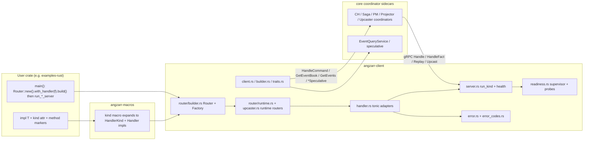

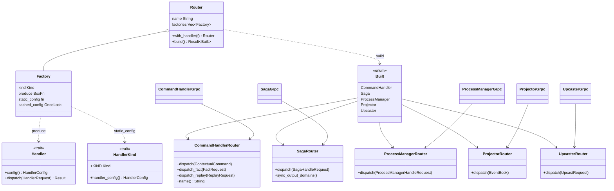

Macro expansion:
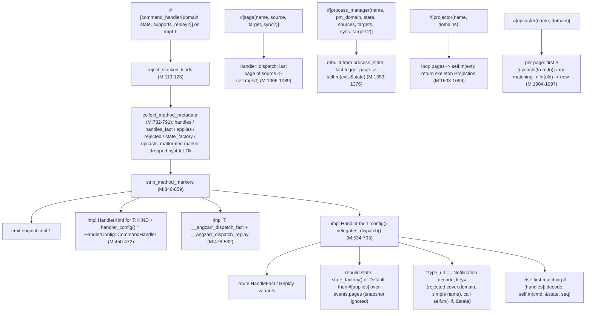

**What each macro expands to.**
- `#[command_handler(domain="d", state=S, supports_replay=bool?)]` (M:145-705). It emits:
  - the original impl;
  - `impl HandlerKind for T { KIND=CommandHandler; handler_config() -> HandlerConfig::CommandHandler{domain, handled: [full_type_url::<C>()...], rejected: [(d,c)...], applies, state_factory: Some(name)|None, handles_fact, supports_replay} }` (M:450-472);
  - hidden inherent fns `__angzarr_dispatch_fact` and `__angzarr_dispatch_replay` (M:478-532):
    - fact: rebuilds state from `prior_events`, then calls `self.m(evt,&state)` per matching fact page and concatenates the pages (M:331-355, 488-519);
    - replay: when `supports_replay`, decodes `base_snapshot.state` into `S` (requires `S: prost::Message`), applies events, and packs `S` into an Any. Otherwise it returns `HANDLER_WRONG_REQUEST_KIND` (M:367-440);
  - `impl Handler for T` (M:534-703). `dispatch`:
    - routes the Fact/Replay variants;
    - rebuilds state (factory or `Default`, then applies over `events.pages`);
    - handles a Notification by recomputing the key and calling `self.m(&notif,&state)` → `BusinessResponse`;
    - otherwise calls `self.m(cmd,&state,seq)` → `EventBook`, wrapped as `BusinessResponse::Events`;
    - errors with `NO_HANDLER_REGISTERED` when nothing matches.
- `#[saga(name, source, target, sync?)]` → config `Saga{...}` plus a Handler that decodes the last source page and calls `self.m(evt)` → `SagaResponse` (M:1049-1178).
- `#[process_manager(name, pm_domain, state, sources=[..], targets=[..], sync_targets=[..]?)]`:
  - compile-time check that sync_targets ⊆ targets (M:1278-1292);
  - the Handler rebuilds state from `process_state`, then calls `self.m(evt,&state)` → `ProcessManagerHandleResponse` (M:1322-1517).
- `#[projector(name, domains=[..])]` → the Handler loops over pages and calls `self.m(evt)` (result discarded, `?` on the error). It returns `Projection{cover, projector:name, sequence}` (M:1590-1699).
- `#[upcaster(name, domain)]`:
  - for each Event page, the first `#[upcasts(from=A,to=B)]` arm calls `<T>::m(old)` and re-packs the result keeping header, created_at, no_commit and cascade_id (M:1884-2001);
  - it uses unqualified `Some`/`Ok`/`Err`/`vec!`/`Vec` (M:1927, 1945, 1965, 1976, 1995).
- Markers `handles`, `handles_fact`, `rejected`, `applies`, `state_factory` and `upcasts` are identity passthroughs. The `upcasts` arg validation (M:1796-1799) never runs inside an `#[upcaster]`, because the outer macro strips the attribute first (M:846-859).
- Every kind macro calls `reject_stacked_kinds` (M:113-125). Marker args must be a bare `Ident` (M:1703-1712). A parse failure is silently skipped (M:748-775).

Test harness topology:
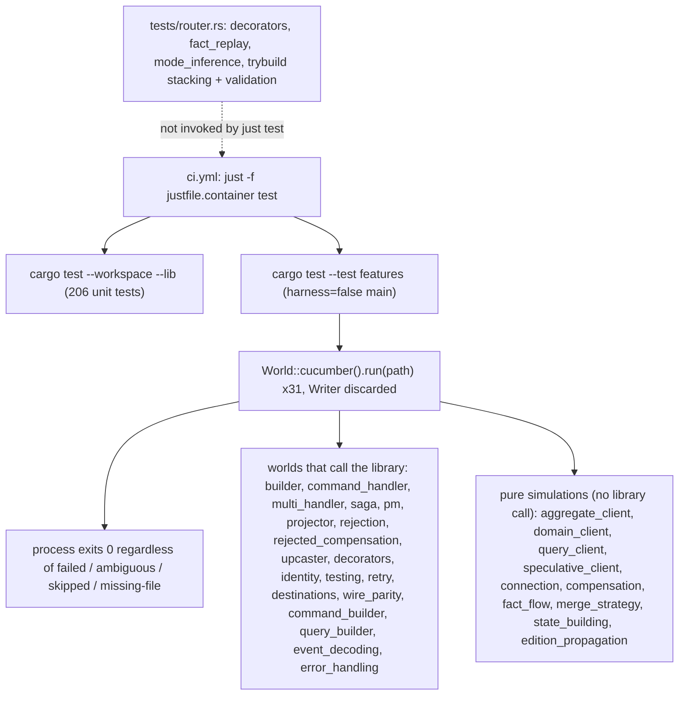

## 4. Sequence diagrams

### 4.1 Aggregate (command handler) handle
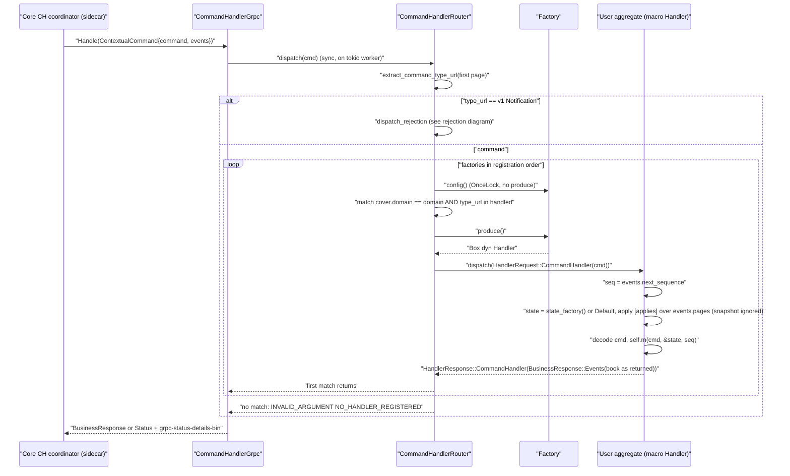
1. The adapter calls the router synchronously inside the async fn (src/handler.rs:48-55).
2. Type URL from the first page (runtime.rs:301-329). Notification short-circuit (runtime.rs:73-75).
3. Match on `(cover.domain, type_url)` against the cached static config (runtime.rs:92-104). `produce()` (106). First match returns (120).
4. A rejection error gets the request cover stamped on it (runtime.rs:28-38, 109).
5. Macro body:
   - `seq = events.next_sequence` (M:601-602).
   - Initial state (M:300-307). Replay over `events.pages` only; `EventBook.snapshot` is never read (M:606-618).
   - Handler call `self.m(cmd,&state,seq)` (M:259). The user returns a complete EventBook, and the framework does not stamp page sequences or `cover.ext`.
6. No match → INVALID_ARGUMENT `NO_HANDLER_REGISTERED` (runtime.rs:127-140). An empty domain yields `"<missing>"` here, whereas Python raises `MISSING_COMMAND_BOOK` (dispatch.py:295-300).
7. Error mapping: `client_error_to_status` (handler.rs:204-236). Rejections pack `google.rpc.Status{ErrorInfo, Cover?}` (error.rs:86-117, 468-491).

### 4.2 Rejection / compensation (Notification → Revocation)
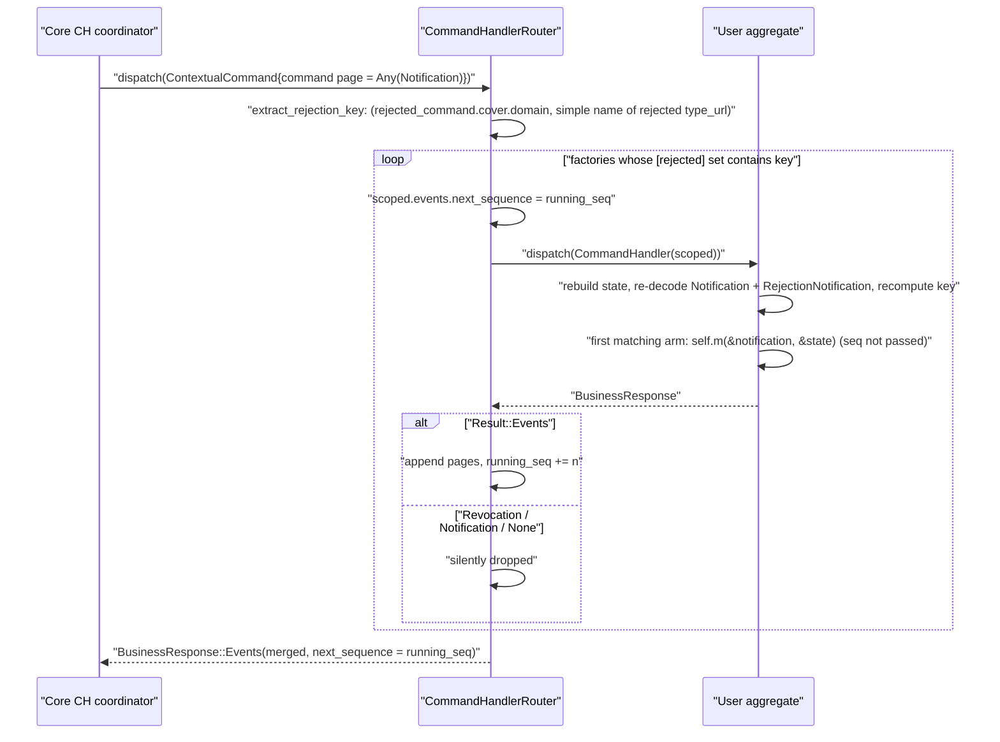
1. Key = `(rejected_command.cover.domain, last '.' segment of rejected type_url)` (runtime.rs:228-297). The macro decodes the Notification a second time (M:621-674).
2. Per match: `scoped.events.next_sequence = running_seq` (runtime.rs:174-177). The macro arm ignores `seq` (M:675), so a handler cannot stamp its compensation pages correctly.
3. Merge keeps `Result::Events` only (runtime.rs:193-215). A `Revocation` from `delegate_to_framework` (compensation.rs:229-242), which the module doc tells users to return (compensation.rs:10-19), becomes an empty Events book.
4. With no matching handler, the router returns an empty Events book (runtime.rs:218-221). A matched macro instance with no arm returns empty Events (M:680-690).
5. Saga and PM `#[rejected]` entries are recorded in config (M:1062-1065, M:1342-1344), but SagaRouter and PMRouter have no Notification branch (runtime.rs:346-413, 471-550).
6. `CompensationContext::from_notification` (compensation.rs:77-124) is a user helper; no router path calls it.

### 4.3 Saga
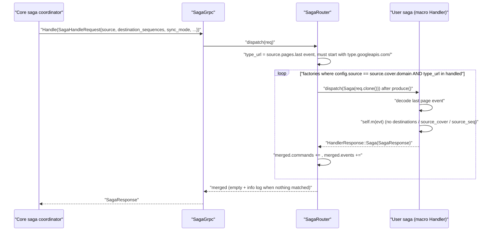
1. Adapter: handler.rs:124-131. Trigger validation: runtime.rs:416-456, which requires the `type.googleapis.com/` prefix.
2. Filter on `config.source == source.cover.domain` and type_url (runtime.rs:368-381). `produce()` runs per match (382).
3. Macro: last page only (M:1145-1165). Call `self.m(evt)` (M:1081). `destination_sequences`, `sync_mode` and the source cover never reach user code. Python passes `destinations`, and `source_cover` / `source_seq` when the handler declares them (dispatch.py:613-640).
4. Merge is verbatim concatenation (runtime.rs:396-397). Nothing matched → info log and empty response (405-410).

### 4.4 Process manager
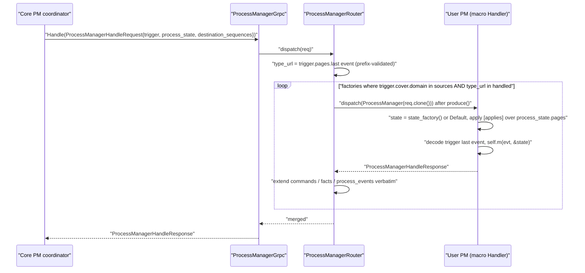
1. Adapter: handler.rs:157-164. Trigger validation: runtime.rs:553-593.
2. Filter on `sources` contains the trigger domain, plus type_url (runtime.rs:496-508).
3. Macro rebuilds state from `process_state.pages` (M:1463-1475). Call `self.m(evt,&state)` (M:1368). Python passes `(evt, state, destinations, source_cover?)` (dispatch.py:711-737).
4. Merge commands / facts / process_events verbatim (runtime.rs:532-534).

### 4.5 Projector
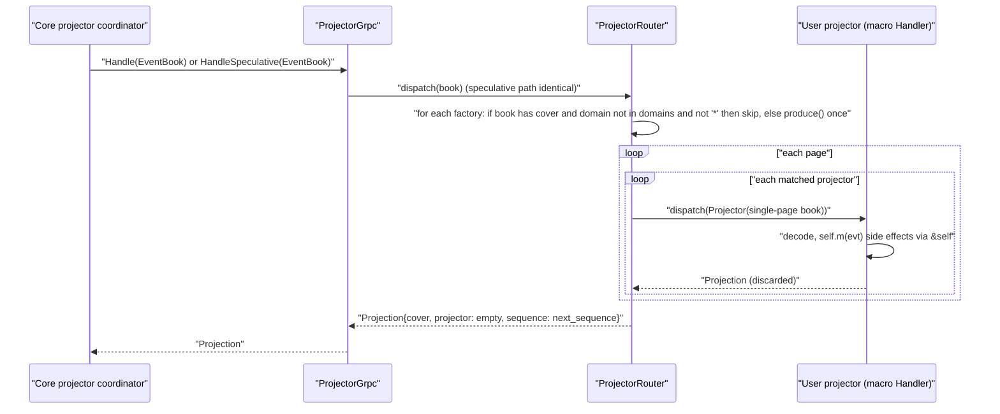
1. `handle_speculative` delegates to `handle` (handler.rs:196-201), so real side effects run.
2. Domain filter only when a cover is present (runtime.rs:626, 640-645). A coverless book reaches **every** projector. Python treats the missing cover as domain `""` and skips unless `"*"` (dispatch.py:788-800).
3. Page-outer and projector-inner loops. Errors propagate mid-book without a cover stamp (runtime.rs:665-683).
4. Synthetic `Projection{projector:""}` (runtime.rs:688-693).

### 4.6 Client command send / query
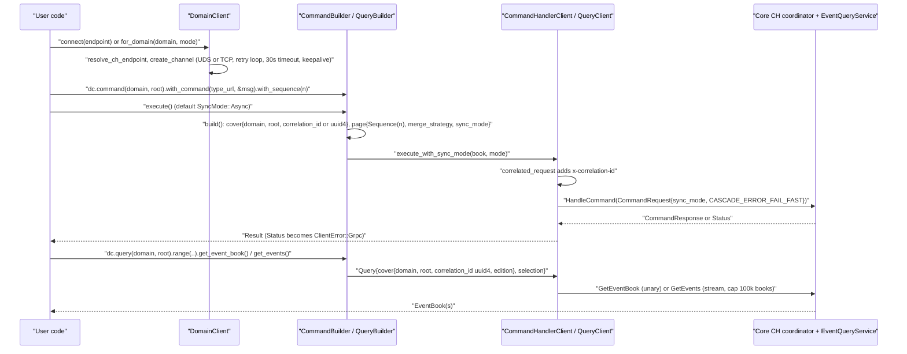
1. `DomainClient::connect` / `for_domain` (client.rs:506-540). `create_channel` (client.rs:129-235) sets the retry loop (174-226), a 30s endpoint timeout plus keepalive (52-58), and UDS detection (107-117).
2. `CommandBuilder::build` requires type_url, payload and sequence (builder.rs:101-122). correlation_id defaults to uuid4 (123-125).
3. `execute` defaults to Async (builder.rs:155-158). `GatewayClient::execute_with_sync_mode` (client.rs:469-481) uses `CASCADE_ERROR_FAIL_FAST`.
4. `x-correlation-id` comes from `Cover.correlation_id` (proto_ext/grpc.rs:10-18; client.rs:420-427).
5. Query:
   - `QueryBuilder::build` always adds a uuid4 correlation_id (builder.rs:261-273).
   - `get_events` stream cap is 100k books, reported as a `Connection`-class error (client.rs:328-355).
   - Server `Status` values are not decoded from `grpc-status-details-bin`; they surface as `ClientError::Grpc` (error.rs:230-234).

### 4.7 Server bootstrap + health / readiness
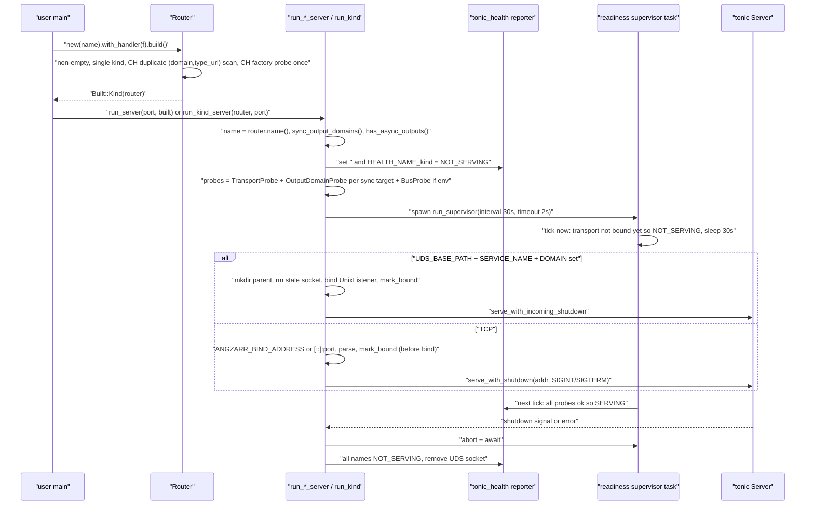
1. `Router::build` (router/builder.rs:112-201). The CH probe invokes every CH factory once at build (175), which contradicts the doc at builder.rs:5-7, 78-81.
2. `run_server` dispatches on the Built variant (server.rs:165-177). Per-kind runners (274-373).
3. `run_kind` (server.rs:383-500):
   - health `""` and the kind name set NOT_SERVING (394-400);
   - probes (402-413);
   - supervisor spawned (420-426) **before** `mark_bound` (454 / 469);
   - TCP `mark_bound` precedes the actual bind inside `serve_with_shutdown` (469-470).
4. The supervisor ticks immediately and then sleeps `interval` (readiness.rs:232-243, default 30s at 51). Readiness therefore flips SERVING up to 30s after bind.
5. An early `?` (ensure dir 438, bind 452, parse 461) returns without aborting the spawned supervisor.
6. Shutdown: abort, await, set all names NOT_SERVING, remove the socket (server.rs:482-491).

## 5. Invariants & contracts
- **Type URLs.**
  - Exact `type.googleapis.com/` + `prost::Name::full_name()` (convert.rs:140-144). Every macro match uses `full_type_url::<T>()`.
  - Marker types must be bare identifiers (M:1703-1712).
  - Saga/PM triggers must carry the googleapis prefix (runtime.rs:448, 585). There is no prefix check on commands.
  - Notification detection in the router uses the v1 FQN (runtime.rs:73). The public `is_notification` uses the pre-v1 FQN (compensation.rs:39). The `proto_ext::type_url` constants use a third scheme `type.angzarr.io/angzarr.X` (type_url.rs:13-29) and are unused (`rg 'proto_ext::type_url' src tests` → doc refs only).
- **Rejection key.** `(rejected.cover.domain, simple type name)` (runtime.rs:272-296; M:649-674). `CompensationContext::dispatch_key` instead yields `domain/full.type.Name` (compensation.rs:148-162); Python has the same asymmetry (compensation.py:160-174).
- **Sequences.**
  - CH `seq = ContextualCommand.events.next_sequence` (M:602), trusted from the coordinator.
  - Emitted pages are passed through unstamped.
  - Rejection fan-out threads `running_seq` into `events.next_sequence` only (runtime.rs:174-218).
  - `Destinations::stamp_command` sets `Sequence(n)` on all pages (state.rs:108-123) but is unreachable from macro handlers.
- **Build.**
  - Non-empty and a single kind (builder.rs:116-136).
  - CH `(domain, type_url)` must be unique across and within factories (148-170).
  - Saga/PM/projector/upcaster fan-out is allowed.
  - CH factories are probed once at build (175).
  - The router name passed to `Router::new` is dropped at build (179-200). `CommandHandlerRouter::name()` returns the domain (725-732).
- **Factory invocation.**
  - Per matched dispatch: CH 106, saga 382, PM 510, projector once per book (646), upcaster once per page per factory (upcaster.rs:101).
  - `dispatch_fact` / `dispatch_replay` call `produce()` before any metadata check (runtime.rs:791, 818).
- **Errors on the wire.**
  - `Status.message` = static message.
  - `grpc-status-details-bin` = `google.rpc.Status{code,message,details:[Any(ErrorInfo{reason=CODE, domain="angzarr.io", metadata}), Any(Cover)?]}` (error.rs:86-117).
  - Rejected maps to INVALID_ARGUMENT / NOT_FOUND / else FAILED_PRECONDITION (error.rs:477-481).
  - Python emits no details trailer; it aborts with code + message only (router/server.py:47-75).
- **Env contract.**
  - Server:
    - UDS iff `UDS_BASE_PATH`+`SERVICE_NAME`+`DOMAIN` are all set (server.rs:106-117);
    - TCP port from `PORT` or `GRPC_PORT`, where a parse failure falls back silently (118-122);
    - `ANGZARR_BIND_ADDRESS` override (153-155).
  - Client:
    - `ANGZARR_MODE` / `ANGZARR_UDS_BASE` / `ANGZARR_NAMESPACE` / `ANGZARR_CH_PORT`, loud-fail on bad values (transport.rs:57-137);
    - readiness `ANGZARR_READINESS_PROBE_{INTERVAL,TIMEOUT}` and `ANGZARR_BUS_ENDPOINT` (readiness.rs:55-79, 202-205).
- **correlation_id.** Client-side only: Cover plus the `x-correlation-id` header. The server ignores metadata, and macro handlers never see the incoming cover, so outbound saga/PM commands cannot inherit it.

## 6. Findings
| ID | Severity | Category | path:line | Finding | Evidence/how verified | Suggested direction |
|---|---|---|---|---|---|---|
| CLIENT-RUST-01 | high | test-infra | tests/features.rs:50-274; justfile.container:76-78 | Every suite uses `.run(path)` and discards the Writer. Failed, ambiguous, skipped and missing-file features all exit 0, so CI's `cargo test --test features` gates nothing. `tests/sour_only_builder.rs:14-17` correctly uses `run_and_exit` | cucumber-0.21.1 `src/cucumber.rs:561` (`run` returns Wr) vs `:1194-1287` (`run_and_exit` panics on failure). Ran (b): SpeculativeClient 1 failed, CommandHandler 6 failed, MultiHandler 1, Upcaster 5, FactFlow 2, EditionPropagation 8, Validation 8 skipped → `EXIT=0` | Use `run_and_exit` (or check `execution_has_failed()` and exit non-zero). Assert that the feature path exists |
| CLIENT-RUST-02 | high | build / submodule drift | src/builder.rs:128, 263; src/testing/builders.rs:51; .gitmodules gitlink 80ce7c2 vs checkout 16fa309 | The on-disk `src/proto/angzarr_client.proto.angzarr.v1.rs` (generated from 16fa309) has `Cover.ext` (line 44). Hand-written `Cover{..}` literals without `ext` fail with E0063, so the dirty tree does not build. At checkout 16fa309, 12 features `tests/features.rs` runs are deleted (parity, identity, testing, connection, command_builder, query_builder, error_handling, event_decoding, retry, decorators, wire_parity, destinations) | Ran (a) → 3× E0063. `git submodule status` → `+16fa309`. `ls features/client` at 16fa309 | Use `..Default::default()` in the Cover literals. Bump the gitlink together with the runner list and Cover.ext support |
| CLIENT-RUST-03 | high | correctness | src/router/runtime.rs:193-215; src/compensation.rs:10-19, 229-242 | Rejection merge keeps only `Result::Events`. Revocation (the documented `delegate_to_framework` return) and Notification are replaced with an empty Events book, so the framework never sees the revocation flags | Read. No test covers a Revocation return (`rg 'delegate_to_framework' tests` → only parity.rs name lists). Python's `@rejected` packs return values as events (dispatch.py:393-398), so it has no Revocation path either; this is a spec gap | Single match: return the handler's BusinessResponse verbatim. Several: define precedence in a cucumber scenario first |
| CLIENT-RUST-04 | high | parity / API | M:1081, M:1368; src/router/state.rs:34-123 | Saga handlers get `(evt)` only; PM handlers get `(evt,&state)`. No `Destinations`, source cover or `source_seq`, so `stamp_command` / `deferred_header` cannot be used and outbound commands cannot copy correlation_id. examples-rust `player/saga-table/src/lib.rs:38-42` declares `source_cover: Option<Cover>`; its pinned client a9dd1c2 has no support (`grep -n source_cover examples-rust/main/angzarr-client-rust/angzarr-macros/src/lib.rs` → 0 hits) | Read macros plus Python dispatch.py:613-640, 711-737 | Detect the extra params in the macro (arity/type) the way Python does, driven by a spec scenario |
| CLIENT-RUST-05 | high | correctness | src/router/runtime.rs:778-833 | `dispatch_fact` / `dispatch_replay` `produce()` each factory and use the **first** CH, regardless of `facts.cover.domain`, `handles_fact` or `supports_replay`. The "single-handler invariant" comment (778) is false: build allows several CH domains (builder.rs:148-170). Replay to a non-opted-in first factory errors with `HANDLER_WRONG_REQUEST_KIND` (M:428-438) | Read | Filter on HandlerConfig before `produce()`. For Replay, reject more than one replay-capable CH at build |
| CLIENT-RUST-06 | high | wire / correctness | src/compensation.rs:33, 39, 318-320, 593-620 | `is_notification` compares against `...angzarr.Notification` (pre-v1), so it returns false for every real v1 Notification. The unit tests pin the stale string. Python uses `...v1.Notification` (compensation.py:68) | Read. Generated `Notification` PACKAGE is `angzarr_client.proto.angzarr.v1` | Use `full_type_url::<Notification>()` and drop the constants |
| CLIENT-RUST-07 | med | wire | src/server.rs:47-61; src/error.rs:72-74; src/proto_ext/constants.rs:15; build.rs:53; src/proto_ext/type_url.rs:13-29 | Remaining pre-v1 literals:  • health names `angzarr_client.proto.angzarr.<Svc>` (Python uses bare `"CommandHandlerService"`, server.py:388, so they are inconsistent across languages)  • Cover Any type_url in the error trailer  • `PROJECTION_TYPE_URL` (Python helpers.py:42 has `.v1`)  • build.rs clippy attribute path no longer matches  • the unused `type.angzarr.io` constants | Read. Generated PACKAGE constants. Python grep | Derive from `NamedService::NAME` / `Name::full_name()`. Agree health keys cross-language in angzarr-project |
| CLIENT-RUST-08 | high | test quality | tests/steps/aggregate_client_steps.rs:1-488; domain_client_steps.rs:1-215; query_client_steps.rs:1-555; speculative_client_steps.rs:1-593; connection.rs:1-353; compensation_steps.rs:50-138; fact_flow_steps.rs:1-405; merge_strategy_steps.rs:1-628; state_building_steps.rs:97-132 | These worlds never call the library; they flip booleans or run local re-implementations. Examples:  • `merge_strategy_steps.rs:574-577` pushes "cherry" before asserting it is present  • `fact_flow_steps.rs:370` `!nil \|\| ==nil`  • `saga_steps.rs:202-215` asserts its own input map  • `state_building_steps.rs:599-607, 617-648, 689-722` empty Thens  • `aggregate_client_steps.rs:184-190` hard-codes `[true,false]`  • `projector_steps.rs:170` `got==n \|\| got<=2`  • `builder_steps.rs:302-304` vacuous NotDecorated  • sequence Thens are no-ops (`rejected_compensation_steps.rs:319-328`; `multi_handler_steps.rs:457-474`; `saga_steps.rs:217-223`; `process_manager_steps.rs:179-182`; `command_handler_steps.rs:273-277`), which hides CLIENT-RUST-11  • `CommonWorld` (tests/common/world.rs) is unused | Read all step files. `rg 'use crate::common'` shows fakes used only by command_builder/query_builder | Drive steps through Router / DomainClient with the `common::fakes` recorders. Delete tautologies |
| CLIENT-RUST-09 | med | test-infra | tests/steps/command_handler_steps.rs:218 vs 353, 232 vs 371; multi_handler_steps.rs:304 vs 687; speculative_client_steps.rs:171 vs 612; 193× `panic!("WIP")` | Old `expr` matchers and new `regex` WIP stubs match the same text, so steps are ambiguous. New-vocabulary stubs panic. The step set matches neither the pinned features (validation.feature: 8 skipped; upcaster: "doesn't match any function") nor the checkout | Ran (b): "Step match is ambiguous" at features2.clean.log lines 694, 1323, 1342, 1435 | Port the steps to one vocabulary before the bump. Delete the duplicate matchers |
| CLIENT-RUST-10 | med | test-infra | justfile.container:75-78; tests/router.rs:15-28 | `just test` runs `--lib` and `--test features` only. `tests/router.rs` (trybuild compile-fail, fact/replay, mode inference, 42 tests) never runs in CI, despite the recipe comment "+ trybuild UI snapshots" | Read. Ran (b) serially: 42 passed. A parallel run gave spurious trybuild failures (see Open questions) | Add `cargo test --test router -- --test-threads=1` |
| CLIENT-RUST-11 | med | parity | M:259, M:675; src/router/runtime.rs:174-218 | CH output EventBooks are passed through: no page sequence stamping and no `cover.ext` propagation. Python `_pack_events` stamps `base_seq+offset` and `_propagate_cover_ext` fills ext (dispatch.py:346-347, 867-928). Rejection arms never receive the threaded `seq`. Cover.ext / Emit scenarios exist only as WIP stubs (command_handler_steps.rs:418-458) | Read Rust and Python | Stamp in the router (or macro) from `next_sequence`. Add ext fill-only propagation once the gitlink is bumped |
| CLIENT-RUST-12 | med | correctness (cross-lang) | M:601-618, M:1463-1475; client-python dispatch.py:233-263 | State rebuild ignores `EventBook.snapshot` and starts from factory/Default. If the coordinator sends snapshot+tail, state is wrong. `coordinator-contract/state_building.feature` is satisfied by a local simulation (state_building_steps.rs:97-132) | Read both languages | Settle the contract in angzarr-project. If snapshots are sent, decode `snapshot.state` and skip pages at or below its sequence |
| CLIENT-RUST-13 | med | ops | src/server.rs:420-426, 454, 469-470; src/readiness.rs:51, 232-243 | The supervisor's first tick runs before `mark_bound` and then sleeps 30s, so readiness is NOT_SERVING for up to 30s. TCP marks bound before bind; a bind failure is reported after "bound" | Read | Bind a `TcpListener` explicitly, then tick via Notify after `mark_bound` |
| CLIENT-RUST-14 | med | performance | src/handler.rs:53, 74, 95, 129, 162, 192, 280; src/router/handler.rs:283 | Synchronous `Handler::dispatch` runs on tokio workers inside async fns. Blocking user I/O (projector DB writes) starves the runtime | Read | Use `spawn_blocking` in the adapters, or add an async handler variant |
| CLIENT-RUST-15 | med | DX / validation | M:748-775, 846-859, 1796-1799; tests/router/ui/method_stack_handles_applies.rs + .stderr | Malformed markers are dropped by `if let Ok` and then stripped, so the handler silently never routes. Examples: `#[handles(a::B)]` (path), `#[rejected(domain="x")]`, bad `#[upcasts]`. Conflicting markers (`#[handles]`+`#[applies]` on one fn) are not detected; the trybuild fixture "passes" only through incidental E0061 arity errors (stderr lines 1-8) | Read macro + fixture | Collect `syn::Error`s into `compile_error!`. Accept `syn::Path`. Detect marker conflicts |
| CLIENT-RUST-16 | med | parity (deploy) | src/server.rs:86-127 | The Rust runner selects UDS by `UDS_BASE_PATH`+`SERVICE_NAME`+`DOMAIN`. Python's actual runner uses `get_transport_config` with `TRANSPORT_TYPE=uds` and defaults (`SERVICE_NAME=business`, base `/tmp/angzarr`, qualifier DOMAIN/SAGA_NAME/PROJECTOR_NAME) (server.py:79-110, 142). Python's `ServerConfig.from_env` (server.py:323-335) matches Rust but is not the runner path | Read both | Specify the server env contract in angzarr-project |
| CLIENT-RUST-17 | low | parity | src/router/runtime.rs:626-645, 669, 688-693; src/handler.rs:196-201 | A coverless EventBook bypasses the projector domain filter; Python skips unless `"*"` (dispatch.py:788-800). Projector errors are not cover-stamped. `handle_speculative` runs real side effects | Read both | Align with Python. Pass a speculative flag |
| CLIENT-RUST-18 | low | dead code | M:1062-1065, 1342-1344; src/router/responses.rs:17-44; src/compensation.rs:258-307; src/router/handler.rs:239-257; src/proto_ext/type_url.rs | Saga/PM `#[rejected]` metadata has no dispatch path. `SagaHandlerResponse` / `ProcessManagerResponse` / `RejectionHandlerResponse` / `PMRevocationResponse` / `DispatchError` are never produced | `rg` for constructors in src/tests → only lib.rs re-exports and parity.rs name lists | Implement saga/PM rejection routing or reject the marker at compile time. Remove unused types |
| CLIENT-RUST-19 | low | docs | src/lib.rs:20-21; src/handler.rs:4; src/router/handler.rs:260-262, 281-282; src/router/runtime.rs:1-10, 56-67; src/router/builder.rs:5-7, 78-81; M:27, 1183-1190, 1526-1537, 1862; src/testing/builders.rs:17-19; TIER5_PLAN.md:8-11, 37, 97-100, 165-171 | Stale or false docs:  • `execute(SyncMode)` takes no argument  • `into_*()` accessors do not exist  • "R1 stub"  • CH dispatch described as fan-out, but it is first-match  • "never invoked at build" contradicts the probe  • CH example with a `cb` param  • PM `domain`/`inputs`  • `#[projects]`  • `make_event_book_at` does not exist  • plan names `#[aggregate]`, dispatch.rs, R8 merge | Read | Fix the docs. Use compile-checked doctests |
| CLIENT-RUST-20 | low | correctness | src/builder.rs:232-236 | `range(..0)` maps to `upper=Some(0)`, which selects seq 0 instead of nothing. `range(5..5)` gives lower 5 / upper 4 | Read | Special-case empty ranges |
| CLIENT-RUST-21 | low | error handling | src/retry.rs:88-91, 145, 162, 175, 192; src/client.rs:174-188 | `with_max_attempts(0)` is allowed; `execute_blocking` / `execute_async` then panic through `expect`. `create_channel` ignores `on_retry` | Read | Clamp to at least 1. Fire `on_retry` in `create_channel` |
| CLIENT-RUST-22 | low | error handling | src/client.rs:341-351 | `STREAM_LIMIT_EXCEEDED` is built as `ClientError::Connection`, so `is_connection_error()` is true and retry logic may retry | Read | Use InvalidArgument or a dedicated variant |
| CLIENT-RUST-23 | low | design | src/router/builder.rs:175, 179-200; src/router/runtime.rs:725-732 | The CH build probe causes factory side effects at build (for gherkin C-0065). The `Router::new(name)` value is discarded at build; CH `name()` returns the domain, which the server logs as `name` | Read | Keep the router name in runtime routers. Challenge C-0065 |
| CLIENT-RUST-24 | low | robustness | src/server.rs:118-122, 420-461 | An unparseable `PORT`/`GRPC_PORT` falls back silently (Python has the same behaviour, server.py:331-335). That contradicts the loud-fail policy in transport.rs:13-18, even though an `INVALID_PORT` code exists. An early `?` after the supervisor spawn leaks the task | Read | Loud-fail on bad input. Abort the supervisor on error paths |
| CLIENT-RUST-25 | low | macro hygiene | M:1927, 1945, 1965, 1976, 1995 | The upcaster expansion uses unqualified `Some`/`Ok`/`Err`/`vec!`/`Vec`, unlike the other kinds (`::std::...`) | Read | Fully qualify |
| CLIENT-RUST-26 | low | parity | src/router/runtime.rs:81-140, 301-329 | A CH command with an empty cover domain → `NO_HANDLER_REGISTERED` (domain `"<missing>"`); Python → `MISSING_COMMAND_BOOK` (dispatch.py:295-300). An empty `type_url` has no check; Python → `MISSING_COMMAND_PAYLOAD` (dispatch.py:306) | Read both | Mirror Python's validation order |
| CLIENT-RUST-27 | low | API surface | src/lib.rs:82-92; src/identity.rs:19-57 | Production root re-exports e-commerce helpers (`cart_root`, …) and the testing module. `compute_root` concatenates without a separator (`("ab","c")` == `("a","bc")`), matching Python | Read | Feature-gate `testing`. Move the domain helpers to examples. Any separator change is cross-language |
| CLIENT-RUST-28 | low | performance | src/router/upcaster.rs:82-116 | `produce()` runs per page per factory; each page is cloned into a single-event request per factory | Read | Produce once per request |

## 7. Open questions
- Does core ever send `EventBook.snapshot` in `ContextualCommand.events` / `process_state`? This decides whether CLIENT-RUST-12 is live. Rust and Python both ignore it.
- What is the intended Revocation contract for `#[rejected]` (CLIENT-RUST-03)? Neither client can return one today. Needs an angzarr-project scenario.
- Which health service name does anything probe? No core usage was found:
  - `rg 'HealthCheckRequest' core/main/src` → 0 hits.
  - Helm `grpc:` probes carry no service (default `""`).
  - The keys are currently inconsistent (Rust pre-v1 FQN vs Python bare name).
- The step files contain both old and new vocabulary. Is the intent to bump the gitlink to 16fa309 on this branch? If so, the runner list in `tests/features.rs:50-274` must drop 12 suites.
- A parallel `cargo test --test router` in the scratch copy reported 6 trybuild "expected to fail but succeeded" results; a serial run was 42/42 green. This may be trybuild shared-dir contention or a concurrent cargo lock in my environment. Not attributed.
- Does tonic `Endpoint::timeout` (client.rs:53) bound the whole `GetEvents` stream or only the response headers? Not verified (prior R28 claim).
- `wip/` holds only `.gitignore`. `TASKS.md` lists only crates.io publishing and rustdoc. `TIER5_PLAN.md` target surface differs from the code (CLIENT-RUST-19).

## 8. Cross-repo interface surface
**Implements (tonic servers, package `angzarr_client.proto.angzarr.v1`)**
- `CommandHandlerService.{Handle, HandleFact, Replay}` (handler.rs:47-99). HandleFact/Replay return UNIMPLEMENTED with `HANDLER_DOES_NOT_SUPPORT_*` unless opted in (66-71, 87-92).
- `SagaService.Handle`, `ProcessManagerService.Handle`, `ProjectorService.{Handle, HandleSpeculative}`, `UpcasterService.Upcast` (handler.rs:123-283).
- `grpc.health.v1.Health` with keys `""` and `angzarr_client.proto.angzarr.<Svc>` (server.rs:57-61, 394-400).

**Consumes (clients)**
- `CommandHandlerCoordinatorService.{HandleCommand, HandleSyncSpeculative}`.
- `EventQueryService.{GetEventBook, GetEvents}`.
- `ProjectorCoordinatorService.HandleSpeculative`, `SagaCoordinatorService.ExecuteSpeculative`, `ProcessManagerCoordinatorService.HandleSpeculative` (client.rs:296-747).
- Header `x-correlation-id`.

**Wire error format:** `grpc-status-details-bin` = google.rpc.Status + ErrorInfo(domain `angzarr.io`) + optional Cover Any, with a stale type_url (error.rs:26, 70-74). This is Rust-only; Python sends no trailer.

**Env:** see §5.

**Relies on angzarr-project:**
- the proto set in build.rs:24-35 (pinned 80ce7c2; checkout 16fa309 adds `Cover.ext`);
- the feature files listed in tests/features.rs:50-274.

**Consumed by examples-rust**, which vendors this repo as submodule `angzarr-client-rust` at a9dd1c2 (`examples-rust/main/Cargo.toml:28`). It depends on:
- macro attribute grammar (M:167-206, 1004-1047, 1230-1305, 1558-1588, 2010-2045);
- method signatures the expansion calls:
  - CH `fn(&self, C, &S, u32) -> CommandResult<EventBook>` (M:259);
  - `#[applies]` `fn(&mut S, E)` (M:292);
  - `#[rejected]` `fn(&self, &Notification, &S) -> CommandResult<BusinessResponse>` (M:317);
  - `#[handles_fact]` `fn(&self, E, &S) -> CommandResult<EventBook>` (M:346);
  - saga `fn(&self, E) -> CommandResult<SagaResponse>` (M:1081);
  - PM `fn(&self, E, &S) -> CommandResult<ProcessManagerHandleResponse>` (M:1368);
  - projector `fn(&self, E) -> CommandResult<_>` (M:1618);
  - upcaster `fn(A) -> B` (M:1919);
- hard-coded paths `::angzarr_client::`, `::prost::`, `::prost_types::`, so consumers must depend on prost directly and must not rename the crate;
- `Router::new().with_handler().build()` → `Built::*` → `run_*_server(router, port)`.

examples-rust `player/saga-table` expects saga `source_cover` injection (CLIENT-RUST-04).

## 9. Prior findings audit
| Prior | Verdict | Evidence |
|---|---|---|
| Summary: sync dispatch; per-dispatch factories + CH build probe | CONFIRMED | handler.rs:53 etc.; runtime.rs:106/382/510/646; builder.rs:175. Prior cited builder.rs:511, but the file is 202 lines |
| Summary: v1 wire drift list | CONFIRMED | server.rs:57-61, error.rs:74, compensation.rs:39, constants.rs:15, build.rs:53 |
| Summary: 12 feature files deleted at 16fa309 | CONFIRMED | `ls features/client` at 16fa309 vs `git ls-tree 80ce7c2` |
| Open Q: "Generated Rust Cover lacks ext (…v1.rs:19-30)" | REFUTED | On-disk generated Cover has `ext` (line 44). The tree fails to compile (CLIENT-RUST-02) |
| Open Q: `1043eb0` @wip-tags 70 scenarios | PARTIAL | 1043eb0 is in `git log 80ce7c2..16fa309`, but `grep -rc @wip features/client features/coordinator-contract` at 16fa309 → 0 |
| R1 health names | PARTIAL | Stale FQN confirmed. "Python derives from pb2 descriptor" is refuted: Python uses bare `"CommandHandlerService"` (server.py:388). No evidence of FQN probing; severity lowered to med (CLIENT-RUST-07) |
| R2 COVER_TYPE_URL | CONFIRMED | error.rs:74. Impact is limited to Rust-trailer readers; Python emits no trailer |
| R3 is_notification | CONFIRMED | compensation.rs:39, 318-320; tests 593-620; Python v1 at compensation.py:68 |
| R4 PROJECTION_TYPE_URL | PARTIAL | `.v1` drift confirmed. "Missing prefix" matches Python (helpers.py:42 has no prefix either) |
| R5 type_url.rs third scheme | CONFIRMED | type_url.rs:13-29. Unused except doc refs (`rg 'proto_ext::type_url'`) |
| R6 Revocation dropped | CONFIRMED | runtime.rs:193-215. Python has no Revocation path either (CLIENT-RUST-03) |
| R7 saga/PM args | CONFIRMED | M:1081, M:1368. examples-rust pinned macros have 0 `source_cover` hits |
| R8 saga/PM #[rejected] dead + unused response types | CONFIRMED | M:1062-1065, 1342-1344. `rg` for constructors → none |
| R9 fact/replay first factory | CONFIRMED | runtime.rs:786-833 |
| R10 snapshot ignored / simulated feature | CONFIRMED | M:606-618, 1463-1475; state_building_steps.rs:97-132. Python identical (dispatch.py:233-263) |
| R11 sync dispatch | CONFIRMED | handler.rs:53, 129, 162, 192, 280 |
| R12 readiness delay / early mark_bound | CONFIRMED | server.rs:420-426, 454, 469; readiness.rs:232-243 |
| R13 UDS env vs Python | PARTIAL | Python `ServerConfig.from_env` equals Rust. Python's runner uses `TRANSPORT_TYPE` via `get_transport_config` (server.py:79-110, 142), so the mismatch vs the runner holds |
| R14 malformed markers silent | CONFIRMED | M:748-775. Also `#[upcasts]` own validation is dead (M:846-859 strips it first) |
| R15 upcaster within-impl chain stops | PARTIAL | M:1931 confirmed, but Python is identical (`break`, dispatch.py:995), so this is parity. The per-page `produce()` part is confirmed (upcaster.rs:101) |
| R16 projector | CONFIRMED | runtime.rs:640, 669, 690; handler.rs:196-201. New: Python filters coverless books (dispatch.py:788-800) |
| R17 `with_command` free-form URL | CONFIRMED | builder.rs:86-90; lib.rs:20 |
| R18 `range(..0)` | CONFIRMED | builder.rs:234 |
| R19 retry panics / on_retry ignored | CONFIRMED | retry.rs:162, 192; client.rs:174-188 |
| R20 trait/struct name collision | CONFIRMED (bad refs) | Traits at traits.rs:21, 47, 72. Prior cited 188/214/239, but the file is 86 lines |
| R21 stale docs | CONFIRMED | router/handler.rs:260-262, 281-282; runtime.rs:1-10, 56-67; handler.rs:4 |
| R22 dead_code allows + duplicate parser | CONFIRMED | M:996, 1222, 1554, 1803-1806, 2004-2007; M:807-841 vs 1802-1842 |
| R23 macro docs wrong | CONFIRMED | M:27, 1183-1190, 1526-1537; also M:1862 `.into_upcaster()` |
| R24 duplicate notification decode | CONFIRMED | runtime.rs:228-297 vs M:621-674 |
| R25 build-time probe | CONFIRMED | builder.rs:171-176 (prior refs 507-512 wrong) |
| R26 identity helpers / separator | CONFIRMED | identity.rs:20; lib.rs:82-92 |
| R27 build.rs attribute | CONFIRMED | build.rs:53 |
| R28 stream limit as Connection; 30s timeout cuts streams | PARTIAL | client.rs:343 confirmed. Timeout-on-stream semantics not verified |
| Prior line refs generally (e.g. "builder.rs:422-537", "M:463-704") | REFUTED (accuracy) | Router builder is 202 lines. Several prior anchors do not exist |

## 10. Read Ledger
| File | Total lines | Lines read (ranges) | Notes |
|---|---|---|---|
| build.rs | 58 | 1-58 | |
| src/lib.rs | 167 | 1-167 | |
| src/proto.rs | 38 | 1-38 | |
| src/router/mod.rs | 41 | 1-41 | |
| src/router/handler.rs | 336 | 1-336 | |
| src/router/builder.rs | 202 | 1-202 | |
| src/router/runtime.rs | 1146 | 1-1146 | |
| src/router/upcaster.rs | 123 | 1-123 | |
| src/router/state.rs | 339 | 1-339 | |
| src/router/responses.rs | 44 | 1-44 | |
| src/handler.rs | 414 | 1-414 | |
| src/error.rs | 688 | 1-688 | |
| src/error_codes.rs | 225 | 1-225 | |
| src/compensation.rs | 622 | 1-622 | |
| src/convert.rs | 346 | 1-346 | |
| src/client.rs | 849 | 1-849 | |
| src/builder.rs | 1107 | 1-1107 | |
| src/server.rs | 689 | 1-689 | |
| src/readiness.rs | 465 | 1-465 | |
| src/transport.rs | 276 | 1-276 | |
| src/retry.rs | 335 | 1-335 | |
| src/traits.rs | 86 | 1-86 | |
| src/identity.rs | 112 | 1-112 | |
| src/validation.rs | 309 | 1-309 | |
| src/proto_ext/mod.rs | 38 | 1-38 | |
| src/proto_ext/constants.rs | 41 | 1-41 | |
| src/proto_ext/type_url.rs | 59 | 1-59 | |
| src/proto_ext/grpc.rs | 22 | 1-22 | |
| src/proto_ext/books.rs | 142 | 1-142 | |
| src/proto_ext/cover.rs | 179 | 1-179 | |
| src/proto_ext/edition.rs | 113 | 1-113 | |
| src/proto_ext/pages.rs | 252 | 1-252 | |
| src/proto_ext/uuid.rs | 95 | 1-95 | |
| src/testing/mod.rs | 18 | 1-18 | |
| src/testing/builders.rs | 214 | 1-214 | |
| src/testing/context.rs | 116 | 1-116 | |
| src/testing/uuid.rs | 101 | 1-101 | |
| angzarr-macros/src/lib.rs | 2046 | 1-420, 420-899, 899-1318, 1318-1717, 1717-2046 | Full |
| angzarr-macros/Cargo.toml | 14 | 1-14 (cat) | |
| src/proto/angzarr_client.proto.angzarr.v1.rs | 6302 | 1-5, 15-45 + grep | Generated (prost-build header). Skipped except the Cover struct and PACKAGE consts |
| src/proto/sererr.v1.rs | 148 | 1-5 | Generated, skipped |
| src/proto/google.api.rs | 404 | 1-5 | Generated, not included by proto.rs, skipped |
| src/proto_ext/grpc.test.rs | 126 | 0 | Unit test for correlated_request; not read (no claims made) |
| tests/features.rs | 275 | 1-275 | |
| tests/common/{mod,world,fakes,fixtures,helpers}.rs | 12/148/403/280/216 | full each | |
| tests/steps/*.rs (31 files) | 12,295 total | full each | All 31 read in full with the Read tool |
| tests/router.rs, tests/router/{decorators,fact_replay,mode_inference,stacking,validation}.rs | 28/445/280/221/20/51 | full each (stacking/validation via cat) | |
| tests/router/ui/*.rs + .stderr | 5-39 each | full (cat) | Fixtures |
| tests/sour_only_builder.rs | 18 | 1-18 (cat) | |
| TIER5_PLAN.md | 217 | 1-217 | |
| TASKS.md | 19 | 1-19 (cat) | |
| wip/ | — | ls | Only `.gitignore` |
