# core-bus

I couldn't save this report to `/tmp/claude-1000/-home-babbitt-workspace-angzarr/ccd05a0a-aae5-45df-9687-170b8d19f097/scratchpad/reviews-v2/core-bus.md`: the harness refused the Write ("Subagents should return findings as text"), so the full report is below. I read all 50 in-scope non-test files, found 19 issues (2 high, 5 medium, 12 low), and all 11 mermaid diagrams render with `mmdc`. The `.mmd` sources are in `/tmp/claude-1000/-home-babbitt-workspace-angzarr/ccd05a0a-aae5-45df-9687-170b8d19f097/scratchpad/mmd/work-core-bus/`.

Repo: /home/babbitt/workspace/angzarr/core/main @ feat/snapshot-temporal-wiring d86b45be.
- The working tree is dirty in scope: `src/proto_ext/mod.rs` and `src/proto_ext/pages.rs` are modified, and `src/proto_ext/enums.rs` and `src/proto_ext/enums.test.rs` are untracked. The review covers the working tree.
- Search caveat: plain `rg` skips `src/bin/**` here because an ignore rule hides it. Every absence claim below was checked with `rg --no-ignore` or `grep -r`.

## 1. Summary
- **Backends.** Four real broker backends exist, each behind a feature flag and each self-registering through `inventory` (src/bus/factory.rs:25-52): AMQP (`amqp`), Kafka (`kafka`), Pub/Sub (`pubsub`) and SNS/SQS (`sns-sqs`).
  - There is no channel/in-memory backend, but `MessagingConfig::default()` is `"channel"` (src/bus/config.rs:48). A default config therefore fails with `UnknownType`.
- **HIGH: aggregate and PM publishers skip the factory.** They only handle `amqp`; any other type falls through to `MockEventBus` (src/bin/angzarr_aggregate.rs:157-171, src/bin/angzarr_process_manager.rs:113-123).
  - Events are stored but never published.
  - Kafka, Pub/Sub and SNS/SQS can only carry saga and projector publishes, plus subscribers.
- **HIGH: "all domains" subscribers get nothing on Pub/Sub and SNS/SQS.** Every bin subscribes with `SubscriberAll`. With no configured domains, these two backends subscribe to a `…-events-events` topic that nothing publishes to (pubsub/bus.rs:166-176, sns_sqs/bus.rs:405-418). CI runs only the AMQP contract suite, so this is not caught.
- **Ordering after a handler failure.** Only Kafka keeps per-root order (it seeks back to the failed offset). AMQP and SQS FIFO keep processing later messages for the same root, so they reorder.
- **No retry cap anywhere.** A failing handler is retried forever on every backend. Only AMQP dead-letters undecodable messages; the others drop them.
- **Claim-check payload offload is unwired.** It also can't be wired as written, because of the `S: Sized` vs `Arc<dyn PayloadStore>` mismatch. Consumers would need wrapping too.
- **gRPC 10 MiB limit is server-only.** It is applied on server services in 3 bins. Every client keeps tonic's 4 MiB decode limit, contrary to the module doc.
- **Field-level merge never runs in coordinators.** Only `angzarr_status` initializes the `proto_reflect` pool, so `merge.rs` in coordinators always compares whole states. Commutative merge therefore behaves like strict conflict detection.
- **proto_ext and validation look sound.** The new enum helpers correctly map proto3 `*_UNSPECIFIED` to the documented defaults.
- **Dead code.** `CommandBus` has no production implementation. `bus::InstrumentedBus` is a pass-through alias that shadows the real `advice::InstrumentedBus`.

## 2. Component inventory
| Component | Kind | path:line | Responsibility | Depends on |
|---|---|---|---|---|
| EventBus | trait | src/bus/traits.rs:71 | publish, subscribe, start_consuming (readiness contract at :88-107), create_subscriber, max_message_size | EventHandler |
| EventHandler / CommandHandler / CommandBus | trait | traits.rs:15,25,44 | handlers and async command bus (the command bus has no production implementation) | — |
| target_matches / any_target_matches / domain_matches_any | fn | traits.rs:167,193,207 | matching on target, event type and domain pattern | Target, CoverExt::routing_key |
| MessagingConfig, backend configs, EventBusMode | config | config.rs:31,59,83,105,145,170 | serde configuration | — |
| BusBackend / init_event_bus / wrap_with_offloading | inventory / fn | factory.rs:25,41,65 | pick backend by type; offloading wrapper (no callers) | inventory |
| dispatch_to_handlers(_with_domain) / process_message / DispatchResult | fn | dispatch.rs:32,53,112,73 | run handlers in sequence and report all-ok; `process_message` and `DispatchResult` have no callers | — |
| AmqpConfig / AmqpEventBus (+otel) | amqp | amqp/mod.rs:89,165; otel.rs:38,45 | topic exchange, publisher confirms, per-queue DLX, reconnecting consumer | lapin 2.5.5, deadpool-lapin |
| KafkaEventBusConfig / KafkaEventBus (+otel) | kafka | kafka/config.rs:7; bus.rs:85; otel.rs | topic per domain, key = root, manual commit, seek-back on failure | rdkafka 0.36 |
| PubSubConfig / PubSubEventBus / consumer helpers | pubsub | pubsub/config.rs:5; bus.rs:26; consumer.rs:31,87,95 | topic per domain, ordering key, one pull loop per domain | gcloud-pubsub 1.6 |
| SnsSqsConfig / SnsSqsEventBus / consumer | sns-sqs | sns_sqs/config.rs:5; bus.rs:32; consumer.rs:96,182 | FIFO SNS to SQS, payload in a binary attribute | aws-sdk-sns/sqs |
| MockEventBus | impl | mock/mod.rs:13 | test double | — |
| OffloadingEventBus / OffloadingConfig / ResolvingHandler | decorator (unwired) | offloading.rs:61,32,301 | claim-check offload on publish, resolve on consume | PayloadStore |
| bus::InstrumentedBus / InstrumentedDynBus | aliases | bus/mod.rs:67-124 | pass-through aliases, never built for a bus | advice |
| PayloadStore / init_payload_store / TtlReaper | trait / fn / struct | payload_store/mod.rs:95,145; reaper.rs:17 | content-addressed storage; factory and reaper (no callers) | sha2 |
| Filesystem / Gcs / S3 PayloadStore | impl | filesystem.rs:27; gcs.rs:27 (gcs); s3.rs:23 (s3) | storage backends | tokio::fs, gcloud-storage, aws-sdk-s3 |
| PayloadOffloadConfig | config | payload_store/config.rs:28 | parsed but never read | — |
| TransportConfig / max_grpc_message_size | config | transport/config.rs:39,17 | TCP vs UDS; socket name `{qualifier}-{service}.sock` | — |
| serve_with_transport(_and_shutdown) | fn | transport/server.rs:31,63 | serve on TCP or UDS | tonic |
| connect_to_address / connect_with_transport / ServiceEndpointConfig | fn | transport/client.rs:32,125,236 | client channel with retry; the last two have no callers | backon |
| prepare_uds_socket / UdsCleanupGuard / grpc_trace_layer | fn | transport/uds.rs:48,8; trace.rs:13 | UDS setup and cleanup; request tracing span | tower-http |
| proto_ext traits and helpers | traits | cover.rs:14; edition.rs:14; pages.rs:39,87,161,250; books.rs:13,67; uuid.rs; enums.rs:26,45; grpc.rs:13; type_url.rs | proto accessors; `routing_key()` returns the domain only (cover.rs:68) | proto |
| proto_reflect | module | proto_reflect/mod.rs:31,227,269,317,370 | descriptor pool, JSON rendering, public reflection, field diff | prost-reflect |
| validation | fns | validation/mod.rs:64,102,133,175,211 | length and character rules for trust-boundary fields | ResourceLimits |

## 3. Architecture diagrams

### 3a. Bus traits to implementations, with feature flags
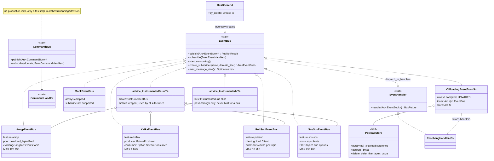

### 3b. Wiring: who builds which bus
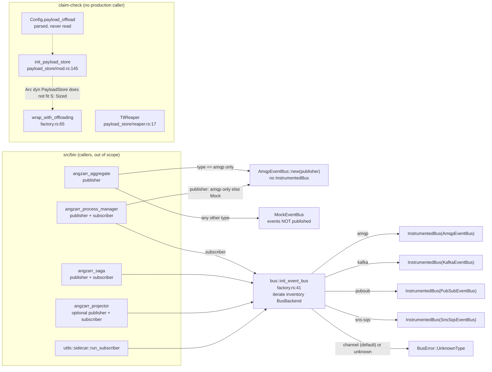

### 3c. Routing, topic and queue naming, and subscription filtering
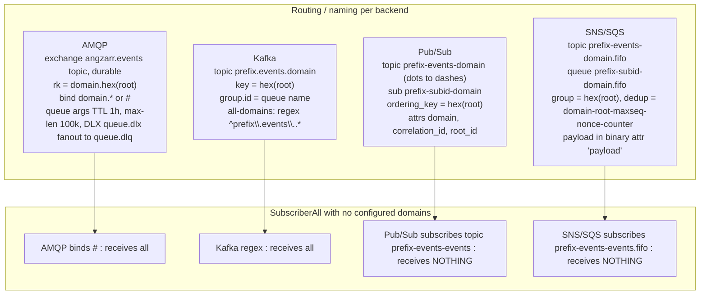

Where filtering happens:
- **AMQP:** the broker binding does it (amqp/mod.rs:130,142). Validated domains contain no `.`, so the `*` in `domain.*` matches exactly the root.
- **Kafka:** a topic list or a regex (kafka/bus.rs:138-150). The prefix is not regex-escaped. Topic metadata refreshes every 5 s (kafka/config.rs:142).
- **Pub/Sub and SNS/SQS:** a per-domain topic, plus a redundant `domain_matches_any` check in the consumer (pubsub/consumer.rs:38, sns_sqs/consumer.rs:141).
- **Event-type filtering** happens above the bus layer, for example process_manager.rs:160.

### 3d. Transport (TCP and UDS)
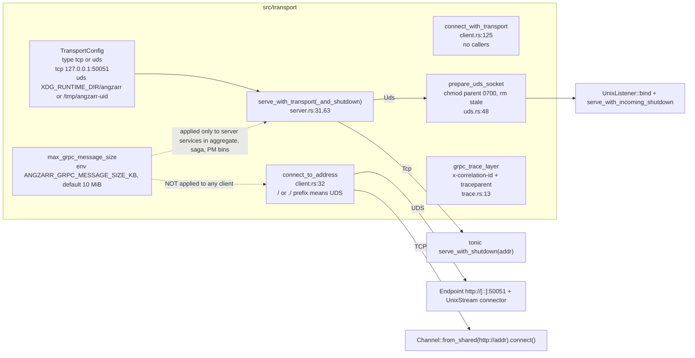

## 4. Sequence diagrams

### 4a. AMQP publish
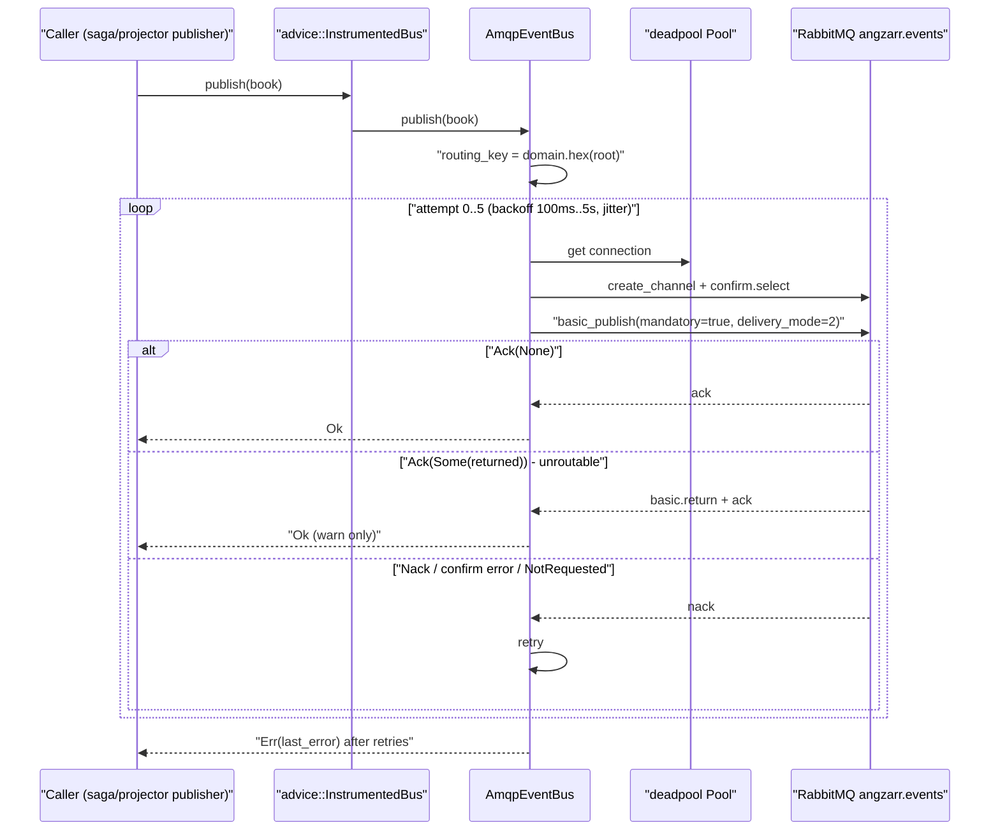
1. The factory wraps the bus in `advice::InstrumentedBus` (amqp/mod.rs:46-81). The aggregate and PM bins build a bare bus instead.
2. The routing key is `{domain}.{hex(root)}`, or `unknown` for missing parts (:268-283).
3. Each attempt gets a fresh channel with `confirm.select` (:225-254). There are up to 5 retries with 100 ms–5 s backoff plus jitter (:713-731).
4. The message is published with `mandatory` set and persistent delivery (:748-777). Confirm handling:
   - A plain ack is success.
   - A returned (unroutable) message is logged as a warning and treated as success.
   - A nack, a missing confirm or a confirm error is retried (:780-853).
5. After the last retry it returns `Err(last_error)` (:867).

### 4b. AMQP subscribe, ack, nack and DLX
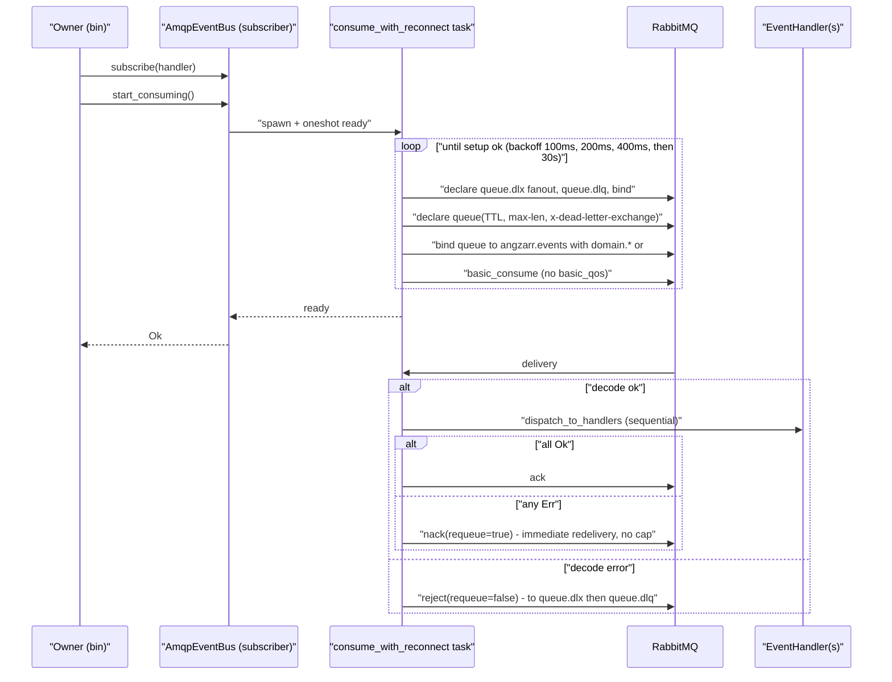
1. `start_consuming` spawns the consumer task and waits on a oneshot until the first setup succeeds (amqp/mod.rs:287-335).
2. Setup declares the DLX and DLQ, then the queue with TTL 1 h, max length 100k and the DLX argument, then binds it and starts consuming (:535-620).
   - No `basic_qos` is set: `rg --no-ignore 'basic_qos|prefetch' src/bus src/dlq` returns 0 hits.
3. Deliveries are processed one at a time (:398-414):
   - Success gets `ack` (:672-675).
   - A handler error gets `nack` with requeue (:676-691).
   - A decode error gets `reject` without requeue, which routes it to the DLX (:694-702).
4. The reconnect backoff uses backon's default `max_times=3` (backon-1.6.0 exponential.rs:62). After three attempts the delay is a fixed 30 s (:357-362,419,432).
5. `create_subscriber` builds a new, uninstrumented bus with its own connection pool (:887-898).

### 4c. Kafka publish and consume
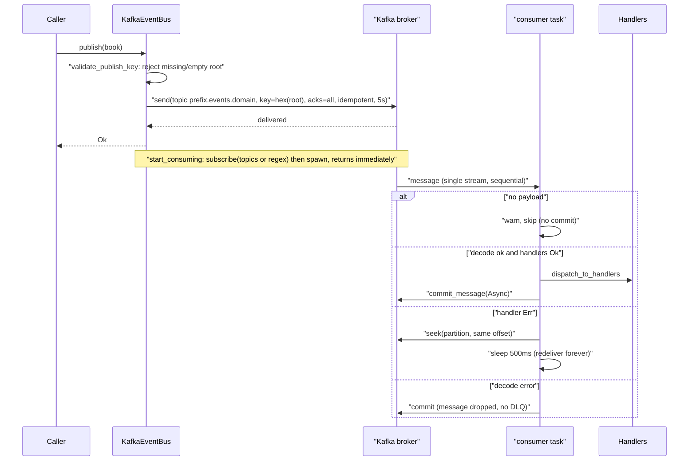
1. Publishing rejects books with no root or an empty root (kafka/bus.rs:52-78, 277-280).
2. The producer uses `acks=all`, idempotence and a 5 s timeout (config.rs:119-128, bus.rs:300-303).
3. The consumer has auto-commit off and `earliest` offset reset (config.rs:131-150). It reads a single stream in sequence (bus.rs:126-270):
   - Success commits.
   - A handler error seeks back and sleeps 500 ms.
   - A decode error commits, dropping the message.
   - A message with no payload is skipped without a commit.
4. `create_subscriber` drops the topic prefix and the SASL/SSL settings (:333-348).

### 4d. Pub/Sub publish and consume
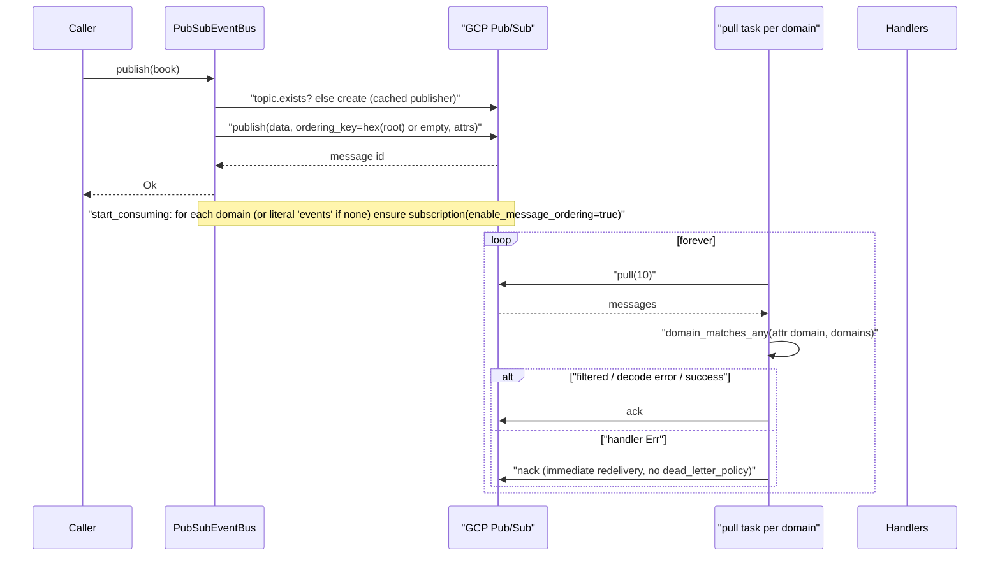
1. The publisher checks whether the topic exists, creates it if not, and caches it (pubsub/bus.rs:63-98).
2. Messages carry the root as the ordering key, or an empty key when there is no root, plus attributes (:104-141).
3. `start_consuming` creates a subscription per domain with message ordering enabled (consumer.rs:87-143), then runs one pull loop per domain (bus.rs:174-248).
   - With no configured domains it subscribes to a literal `"events"` topic (:166-170).
4. Filtered, undecodable and successful messages are acked; handler failures are nacked (:218-234).
   - No dead-letter or retry policy is set: `rg --no-ignore 'dead_letter_policy|retry_policy|RedrivePolicy' src` returns 0 hits.
5. Trace context is extracted onto `Span::current()`, not onto the consume span (:209-216).

### 4e. SNS/SQS publish and consume
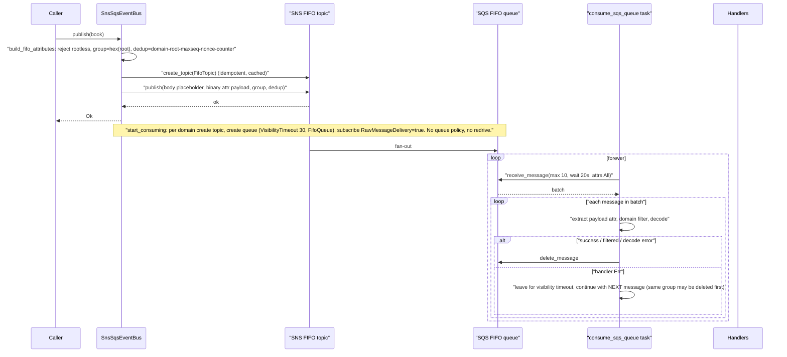
1. The FIFO group is the root, and the dedup id includes a per-instance nonce and a counter. Books without a root are rejected (sns_sqs/bus.rs:96-135).
2. The payload goes in a binary attribute; the message body is a placeholder (:321-379).
3. For each domain, `start_consuming` creates the topic and a queue (visibility timeout 30 s, FIFO, with no access policy and no redrive), subscribes the queue with raw delivery, and spawns a consumer (:397-440, 220-296).
4. The consumer handles each message in the batch (consumer.rs:200-235):
   - Success, filtered and undecodable messages are deleted.
   - A handler failure is left for the visibility timeout, and the loop continues with the next message.
5. `create_subscriber` keeps the region and endpoint but resets the topic prefix (bus.rs:446-460).

### 4f. Payload offload (claim check) — nothing wires it
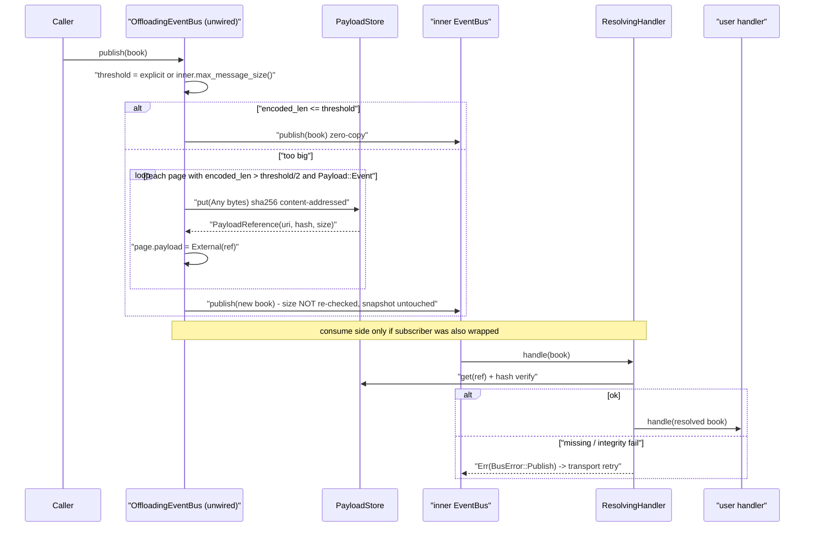
1. Publish side (offloading.rs:78-163):
   - The threshold is either set explicitly or taken from the inner bus's max message size.
   - Only pages larger than half the threshold are offloaded.
   - The resulting book is not re-checked, and the snapshot is never offloaded.
2. Consume side: `subscribe` wraps the handler (:180-189), and `get` verifies the hash (filesystem.rs:108-127). Any failure becomes an `Err`, so the transport retries forever (:236-294).
3. Wiring check: `rg --no-ignore 'wrap_with_offloading|OffloadingEventBus::wrap|init_payload_store|TtlReaper' src tests`, excluding their own modules, returns 0 hits. `payload_offload` appears only as a struct field (config/mod.rs:111).

### 4g. Transport setup (TCP and UDS)
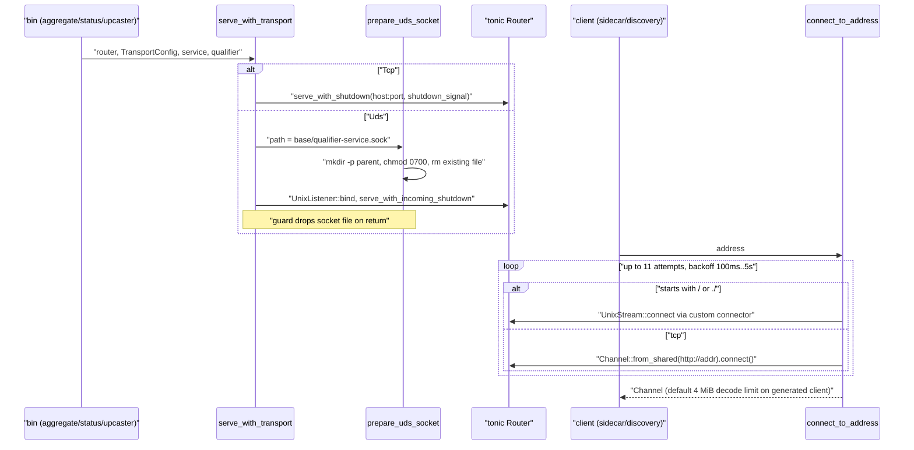
1. Serving (server.rs:63-122):
   - Callers are the aggregate, status and upcaster bins (angzarr_aggregate.rs:257, angzarr_status.rs:118, angzarr_upcaster.rs:76).
   - The saga bin serves TCP directly (angzarr_saga.rs:235-254).
   - The doc at server.rs:29-30 gives the UDS name order backwards.
2. `prepare_uds_socket` chmods any parent directory to 0700 and deletes whatever file is at the path (uds.rs:48-68).
3. Connecting (client.rs:32-111):
   - `connect_to_address` makes 11 attempts with 100 ms–5 s backoff.
   - `sidecar.rs` wraps each call in its own retry (:97,115,131), so retries multiply.
4. Message size: the 10 MiB limit is set only on server services (angzarr_aggregate.rs:248-254, angzarr_saga.rs:241-242, angzarr_process_manager.rs:259-260). Clients keep the 4 MiB default.

## 5. Invariants and contracts
- **Readiness (T10), traits.rs:88-107.** AMQP honors it with a oneshot (amqp/mod.rs:330). Kafka relies on the `earliest` offset reset. Pub/Sub and SNS/SQS create the subscription or queue before returning.
- **At-least-once delivery.** Any handler error causes redelivery to every handler (dispatch.rs:32-47).
- **Publish-side ordering keys.** Kafka keys on the root. Pub/Sub uses the root as ordering key (empty means unordered). SNS uses the root as FIFO group. AMQP has no per-root primitive.
- **Books without a root.** Kafka and SNS reject them. AMQP publishes them as `{domain}.unknown`. Pub/Sub publishes them unordered.
- **Advertised message size limits.** AMQP 128 MiB (amqp/mod.rs:40), Kafka 1 MiB (kafka/mod.rs:33), Pub/Sub 10 MiB (pubsub/mod.rs:50), SNS/SQS 256 KiB (sns_sqs/mod.rs:75).
- **Domain grammar.** `[a-z_][a-z0-9_-]{0,63}` (validation/mod.rs:64-94).
  - It is enforced only at aggregate parsing (orchestration/aggregate/parsing.rs:21,41) and event query (services/event_query/mod.rs:167,248).
  - `_projection.{name}.{domain}` domains contain dots and are never validated (proto_ext/constants.rs:12).
- **Enum defaults.** `SyncMode` and `MergeStrategy` values of UNSPECIFIED or unknown resolve to Async and Commutative (enums.rs:35-62). Every read site uses these helpers, except the PM's deliberate raw read (process_manager/mod.rs:811-821).
- **Routing key.** `routing_key()` returns the domain only (cover.rs:64-70). The comment at traits.rs:170 calling it "edition-prefixed" is stale.

### Backend × capability
| Capability | AMQP | Kafka | Pub/Sub | SNS/SQS |
|---|---|---|---|---|
| Publish | exchange `angzarr.events`, routing key `{d}.{hexroot}`, confirms + mandatory (amqp/mod.rs:710-868) | topic `{p}.events.{d}`, key hexroot (kafka/bus.rs:276-313) | topic `{p}-events-{d}`, ordering_key (pubsub/bus.rs:104-150) | topic `{p}-events-{d}.fifo`, group hexroot (sns_sqs/bus.rs:302-389) |
| Publish retry | 5 attempts, exponential 100 ms–5 s (amqp/mod.rs:713-731) | librdkafka internal, 5 s (kafka/config.rs:122) | client default | SDK default |
| Subscribe | durable queue named after the subscriber (amqp/mod.rs:582-591) | consumer group (kafka/config.rs:144) | subscription `{p}-{sub}-{d}` (pubsub/config.rs:69-75) | queue `{p}-{sub}-{d}.fifo` (sns_sqs/config.rs:101-108) |
| Domain filter | broker binding `{d}.*` or `#` (amqp/mod.rs:130,142); `amqp.domains` ignored | topic list or regex (kafka/bus.rs:138-150) | topic + consumer check (pubsub/consumer.rs:38); **all-domains broken** (bus.rs:166-170) | topic + consumer check (sns_sqs/consumer.rs:141); **all-domains broken** (bus.rs:405-408) |
| Ordering on consume | sequential, but reordered on nack (amqp/mod.rs:398-408,680-691) | preserved by seek-back (kafka/bus.rs:229-250) | message ordering enabled (pubsub/consumer.rs:87-92) | FIFO, but the batch continues after a failure (sns_sqs/consumer.rs:214-223) |
| Dead-letter | per-queue DLX to `{q}.dlq` (amqp/mod.rs:437-453,535-576) | none | none | none |
| Max message size | 128 MiB | 1 MiB | 10 MiB | 256 KiB, attributes included |
| Handler-failure retry | immediate requeue, no cap | 500 ms sleep, no cap (kafka/bus.rs:250) | immediate nack, no cap | 30 s visibility timeout, no cap (sns_sqs/config.rs:34) |
| Reconnect backoff | 3 steps, then fixed 30 s | librdkafka | same as AMQP (pubsub/bus.rs:188-245) | same as AMQP (sns_sqs/consumer.rs:194-233) |
| Contract tests in CI | yes (ci.yml:214) | compile only | compile only | compile only |

## 6. Findings
| ID | Sev | Category | path:line | Finding | Evidence | Direction |
|---|---|---|---|---|---|---|
| CORE-BUS-01 | high | correctness | pubsub/bus.rs:166-176; sns_sqs/bus.rs:405-418; bins saga.rs:196, projector.rs:191, pm.rs:213, sidecar.rs:161 | With `SubscriberAll` and no configured domains, the consumer subscribes to `{p}-events-events(.fifo)`, which nothing publishes to. All bins use `SubscriberAll`. | `topic_for_domain("events")` (pubsub/config.rs:63-66, sns_sqs/config.rs:94-98). `test_multi_domain_subscription` (tests/bus/event_bus_tests.rs:422-493) runs against these backends (bus_pubsub.rs:136, bus_sns_sqs.rs:112), but CI runs only the AMQP suite (ci.yml:214). Found by reading; not executed. | Fail fast, or derive the domains from the component's targets. Run all bus contract suites in CI. |
| CORE-BUS-02 | high | wiring | bin/angzarr_aggregate.rs:157-171; bin/angzarr_process_manager.rs:113-123 | Non-AMQP messaging types, or no messaging config, give the aggregate/PM a `MockEventBus`: events are stored but never published. The AMQP path also skips metrics. | Read the bin code. | Use `init_event_bus(Publisher)` and hard-fail on unknown types. |
| CORE-BUS-03 | med | ordering | amqp/mod.rs:398-408,612-620,676-691; sns_sqs/consumer.rs:214-223 | After a handler failure, AMQP (requeue, no QoS, keeps consuming) and SQS (keeps processing and deleting the batch) handle later same-root events first. | Read the code. `rg --no-ignore 'basic_qos\|prefetch'` returns 0 hits. | Stop processing that root's group after a failure; set `basic_qos(1)`. |
| CORE-BUS-04 | med | error-handling | amqp/mod.rs:676-691; pubsub/bus.rs:231-233; pubsub/consumer.rs:87-92; sns_sqs/bus.rs:233-245; kafka/bus.rs:229-250 | No retry cap or dead-lettering for poison handler failures on any backend. A failing message blocks its key, group or partition forever. | `rg --no-ignore 'dead_letter_policy\|retry_policy\|RedrivePolicy\|redrive' src` returns only one storage comment. | Add a per-transport attempt counter and route to the DLQ publishers. |
| CORE-BUS-05 | med | wiring | factory.rs:65-78; offloading.rs:32,61; payload_store/mod.rs:145; reaper.rs:17; config/mod.rs:111 | Offload is unwired and can't be wired: the `S: Sized` bound rejects `Arc<dyn PayloadStore>`, and subscribers would need wrapping too. Books over 256 KiB or 1 MiB fail to publish after persist. | 0 callers found with `rg --no-ignore`. | Add `?Sized` bounds, wrap both publisher and subscribers, and spawn the reaper. |
| CORE-BUS-06 | med | correctness | transport/mod.rs:9-10,38-40; client.rs:79-80,106-108; sidecar.rs:97,115,131 | The 10 MiB gRPC limit applies to servers only. Clients keep 4 MiB, so responses between 4 and 10 MiB fail. The doc says otherwise. | `rg --no-ignore max_decoding_message_size src` finds only server builders in the 3 bins. | Add a client helper that sets the limit. |
| CORE-BUS-07 | med | wiring | proto_reflect/mod.rs:31,85-92,370; orchestration/aggregate/merge.rs:191-203; bin/angzarr_status.rs:66 | The reflection pool is initialized only in the status bin, with framework types only. Coordinators never do a field-level diff, so any state change counts as a conflict (`"*"`). | `rg --no-ignore 'init_pool\|init_from_embedded\|ensure_initialized'` finds status.rs:66 and tests only. | Initialize the pool with client descriptors in coordinators, or document the limitation. |
| CORE-BUS-08 | low | correctness | kafka/bus.rs:333-348; pubsub/bus.rs:260-271; sns_sqs/bus.rs:446-460 | `create_subscriber` drops the topic prefix (and SASL for Kafka). There are no production callers yet. | Read the code, plus an rg for callers. | Clone the parent config instead. |
| CORE-BUS-09 | low | observability | pubsub/bus.rs:209-216; consumer.rs:57-60 | Pub/Sub consume-side trace parent is set on the wrong span. | Read the code. | Extract onto the consume span, as SQS does. |
| CORE-BUS-10 | low | concurrency | pubsub/bus.rs:75-87; consumer.rs:100-140 | Check-then-create of topics and subscriptions races between replicas; an AlreadyExists error fails publish or startup. | Reasoned from the code; not run. | Treat AlreadyExists as success. |
| CORE-BUS-11 | low | consistency | pubsub/bus.rs:106,116 | Pub/Sub accepts books without a root (unordered), while Kafka and SNS reject them. | Read the code. | Use one shared validation helper. |
| CORE-BUS-12 | low | resilience | amqp/mod.rs:357-362,419,432; pubsub/bus.rs:188-192,238; sns_sqs/consumer.rs:194-198,226 | backon's default `max_times=3` means a fixed 30 s wait after three failures. | backon-1.6.0 exponential.rs:13,62. | Use `.without_max_times()`. |
| CORE-BUS-13 | low | correctness | offloading.rs:93-163 | Offload uses a half-threshold heuristic, never re-checks the result, ignores the snapshot, and ignores envelope overhead (SNS attributes, sns_sqs/bus.rs:326-376). | Read the code; tests only cover single pages. | Offload greedily with an overhead budget, else return `Err`. |
| CORE-BUS-14 | low | security | filesystem.rs:55-59,69-90,108-124; gcs.rs:197-240; s3.rs:214-261; payload_store/config.rs:141,165 | Filesystem: unconfined `file://` reads and a hash leak in errors. The mtime isn't refreshed on dedup, so the reaper can delete a live payload. The `.tmp` name is shared by concurrent writers. With `prefix=None`, the GCS/S3 reapers delete old objects across the whole bucket. | Read the code. | Confine reads to `base_path`, touch mtime on dedup, use unique temp names, and give the prefix a default. |
| CORE-BUS-15 | low | dead-code | bus/config.rs:87-89,111,151,176; amqp/mod.rs:149-158; sns_sqs/config.rs:87-90; dispatch.rs:73-132; config.rs:63-68; transport/client.rs:17,125,236 | Config fields never read: `amqp.domains`, `kafka.group_id`, `pubsub.subscription_id`, `sns_sqs.subscription_id`. Builders and helpers with no callers: `EventBusMode::Subscriber`, `process_message`, `connect_with_transport`, `is_uds_address`. | `rg --no-ignore` for each finds 0 production hits (`amqp.domain` is read only at saga.rs:149). | Wire them or delete them. |
| CORE-BUS-16 | low | docs | traits.rs:77-78,113-114,170; config.rs:10; bus/mod.rs:7; bus/README.md:142-190,304-313; kafka/README.md:3-5,23; server.rs:29-30; validation/mod.rs:31,57-63 | Doc drift: sync-ack wording, Channel/IPC/Outbox backends and the interfaces test (removed in b1eb2416), the "edition-prefixed" comment, Kafka README says "untested" and uses a `brokers` key, UDS name order, and the domain error text. | Read the files; `ls tests` shows no interfaces test. | Update the docs. |
| CORE-BUS-17 | low | correctness | bus/config.rs:45-55; factory.rs:45-51 | The default messaging type `channel` returns `UnknownType`. | Only four `try_create` functions exist. | Make the type required. |
| CORE-BUS-18 | low | robustness | transport/uds.rs:50-65 | Chmods an arbitrary parent directory to 0700 and deletes any file at the socket path. | Read the code. | Only chmod directories it created; check the file is a socket before deleting. |
| CORE-BUS-19 | low | dead-code | bus/traits.rs:25-56; bus/mod.rs:64-124 | `CommandBus` has only a test implementation. The `bus::Instrumented*` aliases are pass-throughs that shadow the real `advice` wrapper. | rg finds the impl only at saga/tests.rs:1847, and `Instrumented::new` only in storage. | Delete them. |

## 7. Open questions
- **lapin 2.5.5 channel drop.** Are the per-attempt publish channels closed when dropped (amqp/mod.rs:225-237)? The lapin source isn't available locally.
- **gcloud-pubsub paused ordering keys.** Does a failed ordered publish pause that key until `resume_publish` is called? The bus never calls it.
- **Real-AWS SQS access policy.** The SQS queue has no access policy granting the SNS topic `SendMessage` (sns_sqs/bus.rs:233-245). Real AWS may require one; the LocalStack tests wouldn't notice.
- **Kafka `start_consuming`.** It returns before the consumer joins its group. Is that accepted for existing groups?
- **SQS visibility vs batch.** The 30 s visibility timeout is shorter than a 10-message batch times handler latency, which can trigger duplicate delivery. Should `SnsSqsBusConfig` expose the timeout?
- **Saga coordinator TCP-only serve.** Is `angzarr_saga.rs:254` serving TCP-only on purpose?

## 8. Cross-repo interface surface
**Provides — bus wire formats:**
- Every bus carries a protobuf `EventBook` (angzarr-project `io.angzarr.v1`).
- AMQP: exchange `angzarr.events`, routing key `{domain}.{hex(root)}`. Python's EventStreamSubscriber binds to this.
- Kafka: topic `{p}.events.{d}`, key is the hex root.
- Pub/Sub: topic `{p}-events-{d}`, attributes `domain`, `correlation_id`, `root_id`.
- SNS: topic `{p}-events-{d}.fifo`, binary attribute `payload`.
- Claim-check references are `file://`, `gs://` or `s3://` URIs with a sha256.

**Provides — gRPC:**
- `x-correlation-id` and `traceparent` headers.
- Type URLs of the form `/io.angzarr.v1.*`. Inbound URLs are matched by fully-qualified name, so `type.googleapis.com/` is also accepted.
- UDS socket names `{qualifier}-{service}.sock`.
- Public reflection covers only the dlq_admin subset plus health.

**Consumes:** `*_UNSPECIFIED=0` enums, `PayloadReference`/`PayloadStorageType`, and `Edition`.

**Helm:** only AMQP is configurable (deployment.yaml:200-220). `COMMAND_BUS__*` values are emitted but no config field reads them.

## 9. Prior findings audit (core-infra, items in scope)
| Prior | Verdict | Evidence |
|---|---|---|
| F4 offload unwired + `?Sized` | CONFIRMED | offloading.rs:32, factory.rs:65 vs payload_store/mod.rs:147. Also: consumers need wrapping too. |
| F13 SubscriberAll binds `#`; `amqp.domains` ignored | CONFIRMED | amqp/mod.rs:137-146; `rg --no-ignore` finds only saga.rs:149 reading `amqp.domain`. |
| F14 requeue hot loop | CONFIRMED | amqp/mod.rs:680-691. Also reorders events (CORE-BUS-03). |
| F15 pre-H-06 queue redeclare hangs | CONFIRMED (reasoned) | amqp/mod.rs:576-591, 418-428, 330. |
| F16 channel per publish | PARTIAL | Channel per attempt confirmed at amqp/mod.rs:734. Drop behavior unverified. |
| F17 AMQP URL logged | CONFIRMED | amqp/mod.rs:205-209. |
| F18 poison messages dropped on non-AMQP backends | CONFIRMED | kafka/bus.rs:253-259; pubsub/bus.rs:226-230; sns_sqs/consumer.rs:73-75,217-221. The prior's pubsub line reference is off. |
| F19 CommandBus has no implementation | CONFIRMED | Only saga/tests.rs:1847. |
| F20 default "channel" fails | CONFIRMED | config.rs:48; factory.rs:51. |
| F21 InstrumentedBus alias shadows the real one | CONFIRMED | bus/mod.rs:64-124 vs advice/instrumented_bus.rs:33,116. |
| F22 offload threshold | CONFIRMED | Broadened in CORE-BUS-13 (snapshot, envelope overhead). |
| F23 filesystem dedup/tmp | CONFIRMED | Broadened in CORE-BUS-14. |
| F32 Kafka create_subscriber | CONFIRMED, broader | Pub/Sub and SNS drop the prefix too. |
| Invariant "per-root order holds on Kafka/SNS" | PARTIAL | Holds on the publish side. SQS reorders on the consume side after a failure. |
| Invariant "no dots in domains, so no hierarchical matching" | PARTIAL | Validation is enforced only at the boundary; `_projection.*` domains contain dots. |
| Open question: SNS dedup id length | CONFIRMED borderline | Worst case 64+32+10+12+20+4 = 142 characters, over the 128 limit, with domains of roughly 50 or more characters. |

## 10. Read Ledger
| File | Total lines | Lines read | Notes |
|---|---|---|---|
| src/bus/mod.rs | 128 | 1-128 | |
| src/bus/traits.rs | 226 | 1-226 | |
| src/bus/config.rs | 190 | 1-190 | |
| src/bus/dispatch.rs | 136 | 1-136 | |
| src/bus/error.rs | 46 | 1-46 | |
| src/bus/factory.rs | 78 | 1-78 | |
| src/bus/offloading.rs | 324 | 1-324 | |
| src/bus/README.md | 315 | 1-315 | |
| src/bus/amqp/mod.rs | 916 | 1-916 | |
| src/bus/amqp/otel.rs | 49 | 1-49 | |
| src/bus/kafka/mod.rs | 125 | 1-125 | |
| src/bus/kafka/bus.rs | 360 | 1-360 | |
| src/bus/kafka/config.rs | 174 | 1-174 | |
| src/bus/kafka/otel.rs | 65 | 1-65 | |
| src/bus/kafka/README.md | 48 | 1-48 | |
| src/bus/mock/mod.rs | 76 | 1-76 | |
| src/bus/pubsub/mod.rs | 106 | 1-106 | |
| src/bus/pubsub/bus.rs | 279 | 1-279 | |
| src/bus/pubsub/config.rs | 76 | 1-76 | |
| src/bus/pubsub/consumer.rs | 147 | 1-147 | |
| src/bus/pubsub/otel.rs | 36 | 1-36 | |
| src/bus/sns_sqs/mod.rs | 136 | 1-136 | |
| src/bus/sns_sqs/bus.rs | 472 | 1-472 | |
| src/bus/sns_sqs/config.rs | 109 | 1-109 | |
| src/bus/sns_sqs/consumer.rs | 240 | 1-240 | |
| src/bus/sns_sqs/otel.rs | 53 | 1-53 | |
| src/payload_store/mod.rs | 201 | 1-201 | |
| src/payload_store/config.rs | 175 | 1-175 | |
| src/payload_store/filesystem.rs | 181 | 1-181 | |
| src/payload_store/gcs.rs | 252 | 1-252 | |
| src/payload_store/reaper.rs | 82 | 1-82 | |
| src/payload_store/s3.rs | 273 | 1-273 | |
| src/transport/mod.rs | 70 | 1-70 | |
| src/transport/config.rs | 143 | 1-143 | |
| src/transport/client.rs | 275 | 1-275 | |
| src/transport/server.rs | 122 | 1-122 | |
| src/transport/trace.rs | 59 | 1-59 | |
| src/transport/uds.rs | 68 | 1-68 | |
| src/proto_ext/mod.rs | 39 | 1-39 | dirty |
| src/proto_ext/books.rs | 95 | 1-95 | |
| src/proto_ext/constants.rs | 35 | 1-35 | |
| src/proto_ext/cover.rs | 126 | 1-126 | |
| src/proto_ext/edition.rs | 95 | 1-95 | |
| src/proto_ext/enums.rs | 66 | 1-66 | untracked |
| src/proto_ext/grpc.rs | 59 | 1-59 | |
| src/proto_ext/pages.rs | 275 | 1-275 | dirty; `git diff` reviewed |
| src/proto_ext/type_url.rs | 117 | 1-117 | |
| src/proto_ext/uuid.rs | 40 | 1-40 | |
| src/proto_reflect/mod.rs | 477 | 1-477 | |
| src/validation/mod.rs | 242 | 1-242 | |
| Tests read fully | — | amqp/mod.test (235), pubsub/mod.test (45), sns_sqs/mod.test (84), sns_sqs/bus.test (239), kafka/bus.test (149), offloading.test (580), bus/mod.test (274), filesystem.test (179), transport/mod.test (279) | Other in-scope `*.test.rs` files not read; no claims depend on them. |
| Out-of-scope excerpts (sed/grep) | — | bin/angzarr_aggregate.rs:150-180,232-258; bin/angzarr_process_manager.rs:105-125; bin/angzarr_saga.rs:232-246; utils/sidecar.rs:90-175; orchestration/aggregate/merge.rs:155-215; tests/bus/event_bus_tests.rs:400-496,905-1000; tests/bus_pubsub.rs:1-60,100-180; deploy/…/deployment.yaml:195-240; backon exponential.rs (grep) | Used only to support wiring claims. |