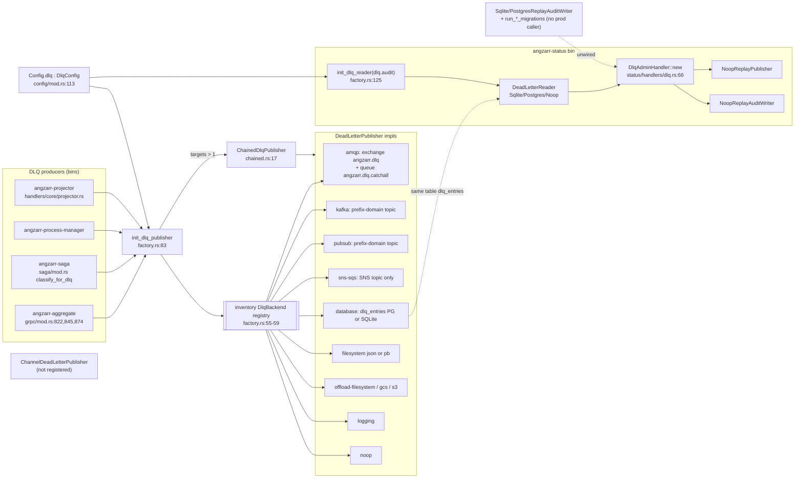
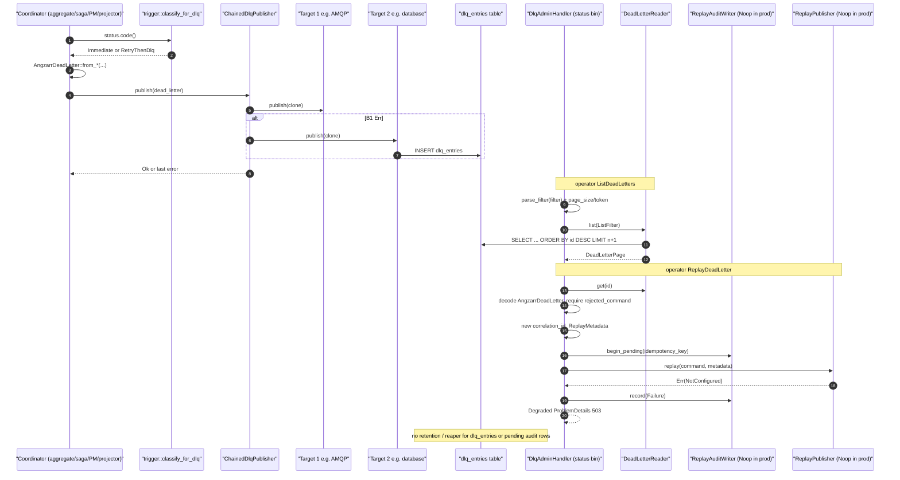
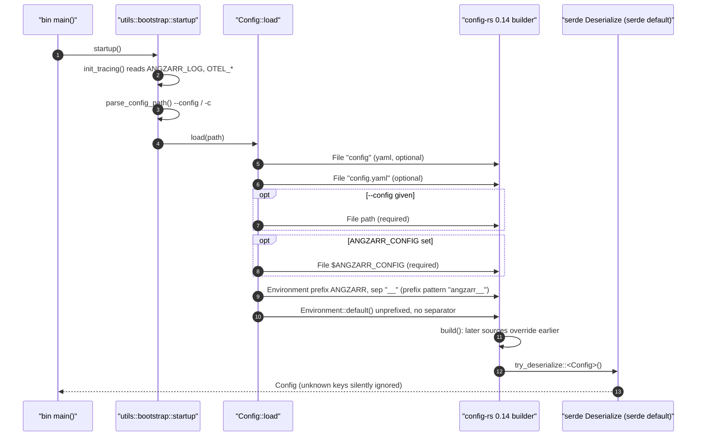
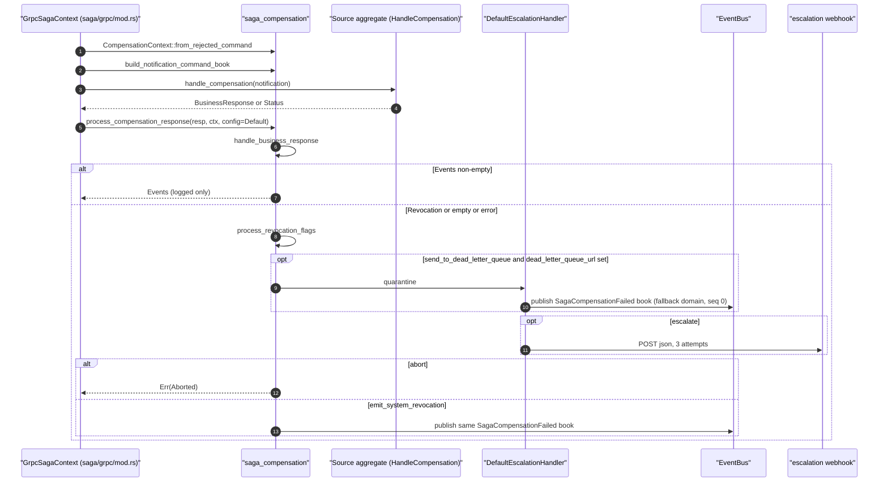

# core-dlq-config
Repo: /home/babbitt/workspace/angzarr/core/main @ feat/snapshot-temporal-wiring d86b45be. The working tree is dirty in scope: `src/utils/saga_compensation/mod.rs` has +7 lines (the D-7 `basis_seq: 0` comment and field at :459-465), and its test file has +1 line.

## 1. Summary
- **DLQ write side works.** It is an inventory-registered factory (`src/dlq/factory.rs:55-102`) with 11 backend types plus a priority chain (`src/dlq/chained.rs:30-49`). The aggregate, saga, PM and projector bins all call `init_dlq_publisher(&config.dlq)` and hard-fail on a bad target.
- **The DLQ admin/replay side is only partly wired.** The status bin builds `DlqAdminHandler::new(reader)` (`src/bin/angzarr_status.rs:106`), which means Noop replay and Noop audit. ReplayDeadLetter always degrades, and the H-31 two-phase fence never persists. There is no DLQ retention or reaper of any kind: nothing covers `dlq_entries` or pending audit rows.
- **In a Helm deploy, the DLQ and status console are inert.** The chart injects no `dlq.*` config into any sidecar, so every sidecar uses the Noop publisher. It injects no `dlq.audit` into status, so the reader is Noop. The status pod binds `127.0.0.1:1390` because the host is never set, so kubelet gRPC probes fail. The `angzarr-status` image is not built anywhere in this repo.
- **Config precedence** is: `config` → `config.yaml` → `--config` → `$ANGZARR_CONFIG` → `ANGZARR__*` env → all unprefixed env (`src/config/mod.rs:127-151`). The documented env form `ANGZARR_<SECTION>__<KEY>` (`config.example.yaml:4-5`) does NOT work. config-rs 0.14.1 uses `"angzarr__"` as the prefix pattern (`env.rs:239-249`), so only `ANGZARR__SECTION__KEY` works.
- **Several Config sections are parsed and never read:** `server`, `limits`, `payload_offload`, `saga_compensation`, `client_logic`, `projectors`, `sagas`, `process_managers`. The saga bin passes `SagaCompensationConfig::default()` (`src/bin/angzarr_saga.rs:177`). No struct uses `deny_unknown_fields`, so typos and dead Helm env vars are silently dropped.
- **The Helm saga and PM sidecars cannot be reached.** Their binaries bind `0.0.0.0:1350` and `:1360` (`ANGZARR_COORDINATOR_PORT` is unset) while the chart declares 1310/1315. The PM Service lacks the `angzarr.io/subscriptions` label that K8s discovery requires. The saga Service's `grpc` port points at the client container.
- **The envoy transcoder allowlist names a non-existent service,** `angzarr_client.proto.angzarr.status.DlqAdminService`. The real service is `io.angzarr.status.v1.DlqAdminService`. REST mode (`rest.enabled`) therefore cannot work, and the helm test pins the wrong name.
- **Broker DLQ backends other than AMQP can drop dead letters.** SNS creates a topic with no subscriber, and Pub/Sub creates a topic with no subscription. Kafka's default prefix (`angzarr.dlq`) disagrees with its own docs and the other backends (`angzarr-dlq`).
- **utils:** retry and trigger classification is consistent except for sequence-conflict FailedPrecondition (by design). Saga compensation's "quarantine" never reaches the DLQ publisher. Several util functions are dead: `validate_sequence`, `sequence_mismatch_error`, `handle_storage_error`, `publish_and_build_response`, `run_subscriber`, `with_metadata`, `from_payload_retrieval_failure`.

## 2. Component inventory
| Component | Kind | path:line | Responsibility | Depends on |
|---|---|---|---|---|
| `AngzarrDeadLetter` + `from_*` ctors | struct | src/dlq/mod.rs:226-587 | Rust form of the proto DLQ entry; `to_proto`, `topic`, `reason_type` | proto, sererr_proto |
| `DeadLetterPublisher` | trait | src/dlq/mod.rs:593-603 | Write side | — |
| `DlqConfig` / `DlqTargetConfig` / backend configs | config | src/dlq/config.rs:39-403 | `dlq.targets[]` priority list plus `dlq.audit` | storage::config |
| `init_dlq_publisher` / `init_dlq_reader` / `DlqBackend` | factory | src/dlq/factory.rs:55-152 | Builds publishers from the inventory registry; builds the reader | inventory |
| `ChainedDlqPublisher` | publisher | src/dlq/chained.rs:17-54 | Tries targets in order and returns the last error | — |
| AMQP / Kafka / PubSub / SNS publishers | publisher | src/dlq/publishers/{amqp,kafka,pubsub,sns_sqs}.rs | Broker DLQ (feature-gated) | lapin, rdkafka, gcloud, aws |
| `Postgres/SqliteDlqPublisher` | publisher | publishers/database.rs:74-367 | `dlq_entries` table, schema created by inline DDL | sqlx |
| Filesystem / Offload(fs, gcs, s3) / Logging / Noop / Channel | publisher | publishers/{filesystem,offload,logging,noop,channel}.rs | Local and object-store sinks; Channel is not in the factory | tokio fs, gcs, s3 |
| `DeadLetterReader`, `ListFilter`, page consts | trait | src/dlq/reader.rs:28-191 | list/get/delete, AIP-158 paging | — |
| `Sqlite/PostgresDlqReader` | reader | publishers/database_reader.rs:100-405 | Keyset paging on `id DESC` | sqlx |
| `parse_filter` | parser | src/dlq/filter.rs:36-186 | AIP-160 subset (6 fields, AND only) | chrono |
| `ReplayPublisher` / `ReplayMode` / `ReplayMetadata` | trait | src/dlq/replay.rs:46-148 | Bus-facing replay; the only impl is Noop | proto::status |
| `ReplayAuditWriter` / `ReplayOutcome` | trait | src/dlq/audit.rs:30-145 | Two-phase audit | — |
| `Sqlite/PostgresReplayAuditWriter`, migrations, H-32 guard | impl | publishers/audit_writer.rs:57-349 | `dlq_replay_audit` table; guard against replicas > 1 | sqlx migrate |
| `CodeDlqExt::classify_for_dlq` | ext trait | src/dlq/trigger.rs:58-85 | Maps a gRPC Code to Immediate or RetryThenDlq | tonic |
| `DlqAdminHandler` | gRPC svc | src/status/handlers/dlq.rs:56-704 | List/Get/Delete/Replay with a `Health<T>` envelope | dlq::* |
| status descriptors / metrics / consts | module | src/status/{descriptors,metrics,mod}.rs | protoset loader, `RPC_DURATION` (unused), ports 1390/8080 | otel |
| `Config` / `Config::load` | config | src/config/mod.rs:85-155 | Aggregates every section; handles source precedence | config-rs 0.14.1 |
| `ServerConfig`, `ServiceConfig`(=TargetConfig), `ServiceConfigRef`, `ExternalServiceConfig`, `HealthCheckConfig` | config | src/config/server.rs:14-276 | Sidecar target; the file-ref types are unused | transport |
| `ServiceEndpoint`, `SagaCompensationConfig`, `ProcessManagerClientConfig`, `TimeoutConfig` | config | src/config/client.rs:20-94 | Endpoint and compensation knobs | — |
| `ResourceLimits` | config | src/config/limits.rs:51-114 | Payload and page caps | — |
| bootstrap | util | src/utils/bootstrap.rs:37-311 | tracing/OTel, `startup`, `shutdown_signal`, `parse_static_endpoints` | otel |
| sidecar | util | src/utils/sidecar.rs:39-181 | Saga/PM bootstrap, endpoint connect | bus, transport |
| retry | util | src/utils/retry.rs:79-258 | Backoffs, `is_retryable_status`, `run_with_retry` | backon |
| saga_compensation | util | src/utils/saga_compensation/mod.rs:53-923 | Rejection → notification → fallback event and escalation | bus, reqwest, sha2 |
| single_sequence_check | util | src/utils/single_sequence_check.rs:42-132 | Sequence-mismatch Status construction and parsing | storage |
| response_builder | util | src/utils/response_builder/mod.rs:24-115 | Extract events from BusinessResponse | bus |
| tracing | util | src/utils/tracing.rs:24-68 | W3C inject/extract | otel |
| Helm chart `angzarr` 0.5.1 | chart | deploy/k8s/helm/angzarr/* | Per-component Deployment and Service, status, gateway, PDB, HPA, RBAC, ESO | — |

## 3. Architecture diagrams
### 3a. DLQ components and wiring

### 3b. DLQ trait/impl map

```mermaid
classDiagram
  class DeadLetterPublisher {
    <<trait>>
    +publish(AngzarrDeadLetter) Result
    +is_configured() bool
  }
  class DeadLetterReader {
    <<trait>>
    +list(ListFilter) DeadLetterPage
    +get(i64) Option
    +delete(i64) bool
    +is_configured() bool
    +source_id() str
  }
  class ReplayPublisher {
    <<trait>>
    +replay(CommandBook, ReplayMetadata) Result
    +is_configured() bool
    +source_id() str
  }
  class ReplayAuditWriter {
    <<trait>>
    +begin_pending(ReplayAuditRecord) Result
    +record(ReplayAuditRecord) Result
    +is_configured() bool
    +source_id() str
  }
  class AngzarrDeadLetter {
    +cover Option~Cover~
    +payload DeadLetterPayload
    +rejection_reason String
    +rejection_details Option~RejectionDetails~
    +occurred_at Option~Timestamp~
    +metadata HashMap
    +source_component String
    +source_component_type String
    +to_proto() ProtoAngzarrDeadLetter
  }
  class DlqAdminHandler {
    -reader Arc~DeadLetterReader~
    -replay Arc~ReplayPublisher~
    -audit Arc~ReplayAuditWriter~
  }
  DeadLetterPublisher <|.. ChainedDlqPublisher
  DeadLetterPublisher <|.. AmqpDeadLetterPublisher
  DeadLetterPublisher <|.. KafkaDeadLetterPublisher
  DeadLetterPublisher <|.. PubSubDeadLetterPublisher
  DeadLetterPublisher <|.. SnsSqsDeadLetterPublisher
  DeadLetterPublisher <|.. PostgresDlqPublisher
  DeadLetterPublisher <|.. SqliteDlqPublisher
  DeadLetterPublisher <|.. FilesystemDeadLetterPublisher
  DeadLetterPublisher <|.. OffloadFilesystemDlqPublisher
  DeadLetterPublisher <|.. LoggingDeadLetterPublisher
  DeadLetterPublisher <|.. NoopDeadLetterPublisher
  DeadLetterPublisher <|.. ChannelDeadLetterPublisher
  DeadLetterReader <|.. SqliteDlqReader
  DeadLetterReader <|.. PostgresDlqReader
  DeadLetterReader <|.. NoopDeadLetterReader
  ReplayPublisher <|.. NoopReplayPublisher
  ReplayAuditWriter <|.. NoopReplayAuditWriter
  ReplayAuditWriter <|.. SqliteReplayAuditWriter
  ReplayAuditWriter <|.. PostgresReplayAuditWriter
  DlqAdminHandler --> DeadLetterReader
  DlqAdminHandler --> ReplayPublisher
  DlqAdminHandler --> ReplayAuditWriter
  DeadLetterPublisher ..> AngzarrDeadLetter
```

### 3c. Helm: resources each deployed component gets

```mermaid
flowchart TB
  subgraph AGGPOD["Deployment {domain}-aggregate (deployment.yaml:5-250)<br/>labels: component=aggregate, angzarr.io/domain"]
    direction LR
    AC["container {name}: client logic<br/>port grpc=.port<br/>env PORT DOMAIN ANGZARR_HOST ANGZARR_PORT ANGZARR_LOG"]
    AS["container angzarr: angzarr-aggregate<br/>ports aggregate=1310, query=1315<br/>env ANGZARR__TRANSPORT__TCP__HOST=0.0.0.0, __PORT=1310,<br/>ANGZARR__TARGET__ADDRESS/DOMAIN, ANGZARR__STORAGE__BACKENDS__DEFAULT__*,<br/>ANGZARR__MESSAGING__TYPE/AMQP__URL, POD_NAME, POD_NAMESPACE"]
    AI["init: wait-for-postgres, wait-for-rabbitmq"]
  end
  AGGSVC["Service {domain}-aggregate<br/>grpc 1310 -> aggregate, query 1315 -> query<br/>labels component=aggregate, angzarr.io/domain"]
  AGGSVC --> AS
  subgraph SAGAPOD["Deployment {name}-saga (deployment.yaml:476-693)<br/>labels: component=saga, angzarr.io/saga"]
    direction LR
    SC["container {name}: saga client<br/>port grpc=.port default 50051"]
    SS["container angzarr: angzarr-saga<br/>declared ports 1310/1315<br/>binary binds 0.0.0.0:1350 (ANGZARR_COORDINATOR_PORT unset)<br/>env ANGZARR_STATIC_ENDPOINTS, TARGET, STORAGE, MESSAGING, AMQP__DOMAIN"]
  end
  SAGASVC["Service {name}-saga<br/>grpc .port -> container grpc (CLIENT)<br/>labels component=saga, angzarr.io/source-domain"]
  SAGASVC --> SC
  subgraph PMPOD["Deployment {name}-pm (deployment.yaml:697-886)<br/>labels: component=process-manager, angzarr.io/pm"]
    direction LR
    PC["container {name}: PM client"]
    PSC["container angzarr: angzarr-process-manager<br/>declared 1310/1315, binary binds 0.0.0.0:1360<br/>env ANGZARR_SUBSCRIPTIONS, ANGZARR_STATIC_ENDPOINTS"]
  end
  PMSVC["Service {name}-pm<br/>grpc 1310 -> aggregate, query 1315<br/>NO angzarr.io/subscriptions label"]
  PMSVC --> PSC
  subgraph PRJPOD["Deployment {name}-projector (deployment.yaml:254-472)"]
    direction LR
    PRC["container {name}: projector client<br/>env DATABASE_URL, EVENT_TOPICS, MESSAGING_*"]
    PRS["container angzarr: angzarr-projector<br/>env SERVER__HOST, SERVER__EVENT_QUERY_PORT, TARGET, STORAGE, MESSAGING"]
  end
  PRJSVC["Service {name}-projector<br/>grpc .port -> client container"]
  PRJSVC --> PRC
  subgraph STPOD["Deployment {fullname}-status x2 (status-deployment.yaml)"]
    direction LR
    ST["container status: angzarr-status<br/>port grpc=1390, env ANGZARR__TRANSPORT__TCP__PORT, POD_REPLICAS<br/>host unset -> binds 127.0.0.1"]
    EN["[opt] envoy :8080, admin :9901<br/>transcoder allowlist angzarr_client.proto.angzarr.status.DlqAdminService"]
  end
  STSVC["Service {fullname}-status grpc 1390 [+http 8080]"]
  STSVC --> ST
  STSVC -.-> EN
  EN --> ST
  KD["K8s discovery (src/discovery/k8s)<br/>lists Services by component label<br/>port named grpc"]
  KD -. reads .-> AGGSVC
  KD -. reads .-> SAGASVC
  KD -. reads .-> PMSVC
  KD -. reads .-> PRJSVC
  SA["ServiceAccount + Role coordinator pods get,patch<br/>Role gateway services get,list,watch (only if gateway.enabled)"]
```

Per-component detail:

| Component | Deployment / labels | Containers | Service (port → target) | Env in the `angzarr` sidecar | Notes |
|---|---|---|---|---|---|
| aggregate | `{domain}-aggregate`; `component=aggregate`, `angzarr.io/domain` (deployment.yaml:10-40) | client + angzarr-aggregate; init containers wait-for-postgres and wait-for-rabbitmq | 1310→aggregate(`grpc`), 1315→query; optional debug NodePort (service.yaml:3-55,265-292) | ANGZARR_LOG, POD_NAMESPACE, POD_NAME, `ANGZARR__TRANSPORT__TCP__{HOST,PORT}`, `ANGZARR__TARGET__{ADDRESS,DOMAIN}`, `ANGZARR__STORAGE__{TYPE,POSTGRES__URI}` (dead), `ANGZARR__STORAGE__BACKENDS__DEFAULT__{TYPE,URI}`, `ANGZARR__MESSAGING__{TYPE,AMQP__URL}`, `ANGZARR__COMMAND_BUS__*` (dead), `ANGZARR_UPCASTER_*`, OTEL_* (deployment.yaml:147-231) | Nothing listens on 1315 |
| projector | `{name}-projector`; `component=projector`, `angzarr.io/app` | client + angzarr-projector | `.port`→`grpc` (the client) | `ANGZARR__SERVER__{HOST,EVENT_QUERY_PORT}` (dead), TARGET, STORAGE, MESSAGING, `AMQP__DOMAIN`=first topic or `#` (deployment.yaml:388-457) | |
| saga | `{name}-saga`; `component=saga`, `angzarr.io/saga`; the Service carries `angzarr.io/source-domain` | client + angzarr-saga | `.port`→`grpc` (the **client**) (service.yaml:104-148) | `ANGZARR__SERVER__*` (dead), TARGET, `ANGZARR_STATIC_ENDPOINTS`, STORAGE, MESSAGING (deployment.yaml:602-677) | Binary binds :1350 |
| PM | `{name}-pm`; `component=process-manager`, `angzarr.io/pm` | client + angzarr-process-manager | 1310→aggregate, 1315→query; no subscriptions label (service.yaml:152-185) | as saga, plus `ANGZARR_SUBSCRIPTIONS` (deployment.yaml:792-871) | Binary binds :1360 |
| status | `{fullname}-status` ×2; `component=infrastructure`, `angzarr.io/service=status` | status [+envoy] [+web-dist init] | 1390→grpc [+8080→http] | `ANGZARR__TRANSPORT__TCP__PORT`, `POD_REPLICAS`, `ANGZARR_STATUS_DESCRIPTORS_DIR` | No HOST, no dlq.audit; PDB minAvailable 1 |
| stream / log | `{fullname}-stream` / `-log` | projector sidecar + stream/log | stream grpc | TARGET, MESSAGING with `#` | Images are not built in this repo |
| gateway | `{fullname}-grpc-gateway`, enabled by default | gateway | 8080 | `GRPC_TARGET=""`, `DESCRIPTOR_PATH` | Needs ConfigMap `gateway-descriptor` |
| RBAC | Role `-coordinator` pods get/patch; Role `-gateway` services get/list/watch only when the gateway is enabled (serviceaccount.yaml:14-69) | | | | |

Other charts (values read):
- `postgres`: CNPG `angzarr-db`.
- `postgres-simple`: CI StatefulSet.
- `rabbitmq`: RabbitmqCluster `angzarr-mq`.
- `rabbitmq-simple`: CI.
- `redis`: standalone.
- `kafka`: Strimzi KRaft.
- `operators`: CNPG and Strimzi.
- `immudb`: 1.9.5.
- `floci`: AWS emulator :4566.
- `observability`: Tempo, Prometheus, Loki, Promtail, OTel collector, Grafana (admin/angzarr, NodePort 30300/30417).
- `mesh-istio` / `mesh-linkerd`: target `angzarr-agg-{domain}-rs`, which does not match `{domain}-aggregate`.
- `values-production.yaml` references non-existent chart names (`angzarr-db-postgres`, `angzarr-mq-*`, `angzarr-db-redis`).

## 4. Sequence diagrams
### 4a. DLQ lifecycle

1. The site classifies the failure (trigger.rs:63-84). Permanent 4xx-class codes (including Aborted and AlreadyExists) go Immediate; 5xx, Cancelled and Ok go RetryThenDlq.
2. The site builds the entry: `from_sequence_mismatch` (mod.rs:247, called at aggregate/grpc/mod.rs:874), `from_event_processing_failure` (:288), `from_saga_command_rejection` (:338), `from_pm_command_rejection` (:378) or `from_pm_persist_failure` (:421). The topic is `angzarr.dlq.{domain}` (:136-141, 501-504).
3. At boot, `init_dlq_publisher` (factory.rs:83-102) returns:
   - an empty target list: Noop;
   - one target: that target directly;
   - several targets: the chain.
   Any construction error aborts boot through `?` (:93).
4. Each target is created by the first matching inventory `try_create` (factory.rs:66-77).
5. Persistence per backend:
   - **AMQP:** declares exchange `angzarr.dlq` and catch-all queue `#`, then publishes with confirms and mandatory (amqp.rs:87-129, 173-223).
   - **Kafka:** `{prefix}-{domain}`, key = correlation_id (kafka.rs:73-145).
   - **Pub/Sub:** create-if-missing topic (pubsub.rs:106-177).
   - **SNS:** create_topic then publish base64 (sns_sqs.rs:120-208).
   - **Database:** INSERT (database.rs:136-218, 284-366).
   - **Filesystem:** filesystem.rs:72-161.
   - **Offload:** offload.rs:79-377.
   - **Logging:** logging.rs:41-75.
   - **Noop:** noop.rs:40-52.
6. The chain returns the first success or the last error (chained.rs:30-49).
7. Status boot: `init_dlq_reader(config.dlq.audit)` (angzarr_status.rs:88). None gives Noop; `sqlite` or `postgres` give the matching reader; anything else fails (factory.rs:125-152). The reader runs no DDL.
8. List: parse_filter (dlq.rs:648-661), then keyset `id < token ORDER BY id DESC LIMIT n+1` (database_reader.rs:122-175). Errors produce degraded responses (dlq.rs:238-281).
9. Get and Delete map directly to the reader (dlq.rs:283-350). A missing id returns `Ok(entry=None)`.
10. Replay (dlq.rs:352-547): idempotency key `replay-{id}-{x-idempotency-key|uuid}` (:225-234); command-only, so event replay returns 400 (:131-167); new correlation_id (:184-207); then begin_pending (:442), replay (:453) and commit_audit (:561-581). In production, Noop replay yields 503 degraded.
11. No reaper exists. `rg -uu -n -i reap src` finds only the cascade and payload_store reapers. `FreshSequence` is not implemented (dlq.rs:193-195).

### 4b. Config load precedence

1. `startup` (bootstrap.rs:306-311), or `bootstrap_sidecar` (sidecar.rs:39-48), runs `init_tracing` then `parse_config_path` (bootstrap.rs:277-284).
2. Sources are added in order (mod.rs:127-151):
   - `config` (:129) and `config.yaml` (:130). Both resolve to the same file, so it is loaded twice.
   - `--config`, required (:133-135).
   - `$ANGZARR_CONFIG`, required (:138-140).
   - Prefixed env (:144-148). config-rs env.rs:239-249 falls back to `separator` for `prefix_separator`, so the pattern is `angzarr__`.
   - Unprefixed flat env (:150).
3. Deserialization (:153): `#[serde(default)]` fills missing sections, and `rg -uu -n deny_unknown_fields src` → 0 hits.

### 4c. Saga compensation

1. `from_rejected_command` (mod.rs:370-387), called from saga/grpc/mod.rs:184.
2. The notification CommandBook targets the source aggregate: MERGE_COMMUTATIVE, `basis_seq: 0` (:428-477).
3. `handle_business_response` (:663-730) → `process_revocation_flags` (:765-828).
4. Quarantine is gated on `dead_letter_queue_url`. It publishes to the event bus (:167-189), never to a `DeadLetterPublisher`.
5. Emit builds the same deterministic-root book (:534-624), and the caller publishes it (:876-889).

## 5. Invariants & contracts
- **R2-15 boot:** bad targets fail boot (factory.rs:93). Empty targets give Noop plus WARN (angzarr_aggregate.rs:100-108). An unreachable `dlq.audit` fails status boot (angzarr_status.rs:88-93).
- **Chain:** first success wins; failed targets are only logged (chained.rs:37-42).
- **AMQP retention** relies on the catch-all queue. mandatory plus confirms turn unroutable or nacked publishes into errors (amqp.rs:184-223).
- **The status admin surface never returns a gRPC error** for backend failures (dlq.rs:17-26).
- **Paging:** 0 → 50, max 500; the token is the last id; newest first (reader.rs:28-33, 99-105; database_reader.rs:45-54, 154).
- **Filter:** AND-only, quoted values, a repeated field is an error, `occurred_before` is exclusive (filter.rs:3-23). `occurred_at` is compared as TEXT and relies on chrono UTC `to_rfc3339` (database.rs:159-166; database_reader.rs:144-149).
- **Audit fence:** UNIQUE `idempotency_key`, conflict → 409 (audit_writer.rs:138-173; dlq.rs:687-694). It is effective only with a DB writer, and none is wired.
- **H-32:** SQLite audit refuses `POD_REPLICAS>1`, unset counts as 1 (audit_writer.rs:66-99). The chart sets `POD_REPLICAS=2` (status-deployment.yaml:85-86).
- **Retry/DLQ classification:** `is_retryable_status` (retry.rs:166-183) equals the RetryThenDlq set minus Ok, plus FailedPrecondition with a `Sequence mismatch:` or `Sequence conflict:` prefix. `classify_for_dlq` maps every FailedPrecondition to Immediate (trigger.rs:68).
- **Compensation root determinism** depends on prost byte stability (saga_compensation/mod.rs:517-527).

### Config key and env var table
"UNUSED" = `rg -uu -n -g '!*.test.rs' -g '!**/tests.rs' <pat> src`, with `src/config/**` excluded, returned 0 consumers.

| Key / env | Parsed at | Consumed at |
|---|---|---|
| `server.{ch_port,event_query_port,host}` | config/server.rs:14-24 (mod.rs:87) | **UNUSED** |
| `storage.*` | mod.rs:89 → storage/config.rs:240 | angzarr_aggregate.rs:113-114; angzarr_process_manager.rs:108-109 |
| `transport.*` | mod.rs:91 → transport/config.rs:40-77 | angzarr_aggregate.rs:126,257; angzarr_projector.rs:96,118; angzarr_upcaster.rs:76; angzarr_status.rs:118; utils/sidecar.rs:59 |
| `messaging.*` | mod.rs:93 → bus/config.rs:31 | angzarr_aggregate.rs:157-170 and angzarr_process_manager.rs:113-122 publish only for `amqp`, otherwise a mock bus is used. Subscriber side: angzarr_projector.rs:136-192, angzarr_saga.rs:80-129, angzarr_process_manager.rs:74,216 |
| `target.{domain,address,name}` | server.rs:43-56 | utils/sidecar.rs:52-60 (server.rs:105-133); angzarr_aggregate.rs:117; angzarr_projector.rs:86 |
| `target.listen_domain` | server.rs:81 | angzarr_projector.rs:167; angzarr_saga.rs:143 |
| `target.{command,working_dir}` | server.rs:72,77 | angzarr_projector.rs:108-120 |
| `target.{port,socket,subscriptions,env,storage}` | server.rs:62,68,86,90,95 | **UNUSED** |
| `ServiceConfigRef` / `ServiceConfigOverrides` / `ExternalServiceConfig` / `HealthCheckConfig` / `config_base_dir` | server.rs:141-276; mod.rs:166 | **UNUSED** |
| `client_logic[]`, `projectors[]`, `sagas[]`, `process_managers[]` (`timeouts`) | mod.rs:97-103; client.rs:20-94 | **UNUSED** |
| `saga_compensation.*` | mod.rs:105; client.rs:32-46 | **UNUSED from config.** angzarr_saga.rs:177 passes `SagaCompensationConfig::default()`. The default's fields are read at saga_compensation/mod.rs:167,209,603,704-706 |
| `upcaster.*` | mod.rs:107 | angzarr_aggregate.rs:140-141 |
| `limits.*` | mod.rs:109; limits.rs:51-72 | **UNUSED.** `ResourceLimits::default()` is hardcoded at services/aggregate.rs:81,126, and `with_limits` (:93) has 0 callers |
| `payload_offload.*` | mod.rs:111 | **UNUSED** (`init_payload_store` has 0 callers) |
| `dlq.targets[].*` | dlq/config.rs:148-403 | factory.rs:92-93; the backends (amqp.rs:41, kafka.rs:73-108, sns_sqs.rs:83-110, database.rs:33-61, filesystem.rs:55-68, offload.rs:55-322); bins aggregate:96, saga:93, PM:87, projector:69 |
| `dlq.targets[].filesystem.max_files` | dlq/config.rs:320 | **UNUSED** |
| `dlq.targets[].pubsub.project_id` | dlq/config.rs:247 | **UNUSED** (pubsub.rs:76-97 uses ADC only) |
| `dlq.audit.*` | dlq/config.rs:53 | factory.rs:125-152 ← angzarr_status.rs:88 |
| `ANGZARR_CONFIG` | mod.rs:23 | mod.rs:138,167 |
| `ANGZARR__*` | mod.rs:25,145 | all keys above |
| `ANGZARR_LOG` | mod.rs:27 | bootstrap.rs:38 |
| `ANGZARR_DISCOVERY` | mod.rs:29-31 | angzarr_aggregate.rs:176 |
| `ANGZARR_STATIC_ENDPOINTS` | mod.rs:44 | angzarr_saga.rs:164 |
| `ANGZARR__TARGET__COMMAND_JSON` | mod.rs:54 | angzarr_projector.rs:102 |
| `STREAM_OUTPUT` | mod.rs:51 | angzarr_projector.rs:144 |
| `NAMESPACE` / `POD_NAMESPACE` | mod.rs:57-59 | discovery/k8s/mod.rs:237-238; bootstrap.rs:183 |
| `POD_NAME` | mod.rs:61 | constant **UNUSED**; the literal is read at bootstrap.rs:171 |
| `EVENT_QUERY_ADDRESS` | mod.rs:63 | discovery/static_discovery.rs:437 |
| `ANGZARR_UPCASTER_{ENABLED,ADDRESS}` | mod.rs:66-68 | services/upcaster.rs:54-73 |
| `OTEL_SERVICE_NAME` | mod.rs:71 | bootstrap.rs:161 |
| `OTEL_SERVICE_VERSION`, `OTEL_DEPLOYMENT_ENVIRONMENT`/`ENVIRONMENT`, `HOSTNAME` | literals | bootstrap.rs:166-179 |
| `OTEL_EXPORTER_OTLP_ENDPOINT` / `OTEL_RESOURCE_ATTRIBUTES` | SDK | bootstrap.rs:53-123 (implicit) |
| `TRANSPORT_TYPE`, `UDS_BASE_PATH`, `PORT`, `DATABASE_URL`, `DESCRIPTOR_PATH`, `STREAM_ADDRESS`, `STREAM_TIMEOUT_SECS` | mod.rs:34-48 | **UNUSED** (`rg -uu -w`). `TRANSPORT_TYPE` is only written for child processes (process/mod.rs:66) |
| `POD_REPLICAS` | audit_writer.rs:57 | audit_writer.rs:118, inside a constructor with no production caller |
| `ANGZARR_STATUS_DESCRIPTORS_DIR` | status/descriptors.rs:34 | angzarr_status.rs:49 |
| `ANGZARR_SUBSCRIPTIONS`, `ANGZARR_COORDINATOR_PORT` | bin-local | angzarr_{projector,saga,process_manager}.rs |
| Helm-only: `ANGZARR__SERVER__*` incl. `AGGREGATE_PORT`, `ANGZARR__STORAGE__{TYPE,POSTGRES__URI}`, `ANGZARR__COMMAND_BUS__*` | deployment.yaml:170-221,401-404,615-620,805-810 | **UNUSED**: no Config field matches and there is no `deny_unknown_fields` |

## 6. Findings
| ID | Sev | Category | path:line | Finding | Evidence | Direction |
|---|---|---|---|---|---|---|
| CORE-DLQCFG-01 | high | deploy | helm/angzarr/templates/status-deployment.yaml:74-112; src/transport/config.rs:73-78; src/transport/server.rs:91 | Status is enabled by default (values.yaml:167), but the chart sets only the port. The binary binds `127.0.0.1:1390`, so kubelet gRPC probes to the pod IP fail and the ClusterIP Service cannot reach it. | Read the env block, `TcpConfig::default` and `serve_with_transport`. Other components set HOST=0.0.0.0 (deployment.yaml:160). | Add `ANGZARR__TRANSPORT__TCP__HOST=0.0.0.0`. |
| CORE-DLQCFG-02 | high | deploy | Containerfile:244-283; skaffold.yaml:33-115; values.yaml:174-176 | The `angzarr-status` image (on by default) is not built by any Containerfile target, skaffold artifact or CI workflow in core. The same holds for stream, log and upcaster. | Grepped the Containerfile and skaffold; `rg -uu angzarr-status .github justfile* build` → 0. | Add a build target, or default status off. |
| CORE-DLQCFG-03 | high | deploy | deployment.yaml:583-620,780-819; angzarr_saga.rs:68-71,218-223; angzarr_process_manager.rs:65-68,235-240; service.yaml:152-185 | The chart never sets `ANGZARR_COORDINATOR_PORT`, so the saga binds :1350 and the PM :1360, while the chart declares 1310/1315 and the PM Service targets 1310. The PM Service lacks `angzarr.io/subscriptions`, so discovery skips it (k8s/mod.rs:544-561). The saga Service's `grpc` port targets the client, and discovery uses the `grpc` port (k8s/mod.rs:611-629). | Read the bins, templates and discovery. | Set the port env, point the Services at the sidecar, and add the subscriptions label. |
| CORE-DLQCFG-04 | med | deploy | status-envoy-configmap.yaml:119-120; tests/test_status_envoy_security.sh:100; proto/io/angzarr/status/v1/dlq_admin.proto:17,213 | The transcoder allowlist uses `angzarr_client.proto.angzarr.status.DlqAdminService`; the real package is `io.angzarr.status.v1` (commit 98c2a441). Envoy rejects a service missing from the descriptor, so REST mode cannot start. The test pins the stale name. | Read the proto package line and git log. | Rename it in both places. |
| CORE-DLQCFG-05 | med | wiring | angzarr_status.rs:106; status/handlers/dlq.rs:66-72; dlq/replay.rs:132; audit_writer.rs:117,224,342 | Production replay and audit are Noop. The audit writer constructors and migrations have 0 production callers, so the H-31 and H-32 protections are dead. FreshSequence is not implemented. No RPC reads the audit table. | `rg -uu` on constructors, migration runners and `ReplayPublisher for`. | Wire `new_with_audit`, a real ReplayPublisher and migrations, or hide Replay. |
| CORE-DLQCFG-06 | med | deploy | deployment.yaml (all); status-deployment.yaml:74-93; values.yaml | The chart injects no `dlq.targets` into any sidecar and no `dlq.audit` into status, so Helm deploys use a Noop DLQ and a Noop reader. | `grep -rni dlq templates` finds only status comments. | Add a `dlq` values block and render env or config for it. |
| CORE-DLQCFG-07 | med | config | config.example.yaml:4-5; config/mod.rs:145-146; config-0.14.1/src/env.rs:239-249 | The documented `ANGZARR_SERVER__HOST` form is ignored because the prefix pattern is `angzarr__`. | Read the config-rs source. | Fix the docs, or set `.prefix_separator("_")`. |
| CORE-DLQCFG-08 | med | dead-config | config/mod.rs:87,97-105,109,111; angzarr_saga.rs:177; services/aggregate.rs:81,93,126 | `server`, `client_logic`, `projectors`, `sagas`, `process_managers`, `saga_compensation`, `limits` and `payload_offload` are parsed and ignored, so operator limits and compensation knobs have no effect. | §5 table. | Wire limits and compensation; delete the rest. |
| CORE-DLQCFG-09 | med | correctness | utils/saga_compensation/mod.rs:162-190,814-821,876-889 | "Quarantine" never uses the DLQ. It is gated on the unused `dead_letter_queue_url` and republishes to the bus. If emit is also set, the same `(fallback_domain, root, seq 0)` book is published twice. It is latent only because config is hardcoded to the default. | Read the flag path. | Route through the saga's `DeadLetterPublisher`; drop the URL field. |
| CORE-DLQCFG-10 | med | correctness | dlq/publishers/sns_sqs.rs:120-208; pubsub.rs:117-128 | SNS and Pub/Sub DLQs create topics with no subscription or queue, so messages are discarded (D1 class). The chain reports success and skips fallback targets. | Read both; there is no subscribe call. | Create a catch-all subscription or queue at init. |
| CORE-DLQCFG-11 | med | config | angzarr_aggregate.rs:157-170; angzarr_process_manager.rs:113-122; values-kafka.yaml | The aggregate and PM publishers support only `amqp`. Other messaging types silently fall to `MockEventBus`. The chart never renders `messaging.kafka.*`. | Read the bins; `grep messaging.kafka templates` → 0. | Use `init_event_bus(Publisher)`; render kafka env. |
| CORE-DLQCFG-12 | low | deploy | serviceaccount.yaml:14-26,43-54; discovery/k8s/mod.rs:883-955 | services list/watch is granted only by the gateway Role. With the gateway disabled, discovery gets 403. | Read both. | Add it to the coordinator Role. |
| CORE-DLQCFG-13 | low | deploy | templates/hpa.yaml:9-12 | The HPA targets a non-existent Deployment `{fullname}`. | Compared with the deployment names. | Render one HPA per component. |
| CORE-DLQCFG-14 | low | deploy | values.yaml:113; deployment.yaml:139-141,594-596,789-791 | The declared query port 1315 has no listener. | Read the bins (single server). | Drop the port or bind it. |
| CORE-DLQCFG-15 | low | dead-config | values.yaml:48,99-107,124,270-279,342-347,371,384-399,492-501,516-517; values-kafka.yaml; values-postgres.yaml:10-26 | Many values keys are not read by any template, including the subchart blocks (Chart.yaml has no dependencies). | Per-key `grep Values.<key> templates` → 0. | Delete or implement them. |
| CORE-DLQCFG-16 | low | robustness | config/mod.rs:150 | The unprefixed flat env source cannot reach nested keys. Env vars named `TARGET`, `DLQ`, etc. break deserialization. | config-rs collect() uses no separator. | Remove it. |
| CORE-DLQCFG-17 | low | naming | dlq/config.rs:233; kafka.rs:3,47,68,113-114 | The Kafka default prefix `angzarr.dlq` yields `angzarr.dlq-order`, while its docs and `::new()` and the other backends use `angzarr-dlq`. | config.test.rs:132 pins it. | Unify. |
| CORE-DLQCFG-18 | low | dead-code | dlq/config.rs:62-71,247,320; dlq/mod.rs:455,490; the 4 `is_configured()` traits | `DlqConfig::channel()` produces an unregistered type (UnknownType). `project_id` and `max_files` are unused. `with_metadata` and `from_payload_retrieval_failure` have 0 production callers. `is_configured()` is never called in production. | `rg -uu is_configured src -g '!*.test.rs'` → docs only. | Delete or register them. |
| CORE-DLQCFG-19 | low | dead-code | utils/single_sequence_check.rs:42-66,104-132; response_builder/mod.rs:80-115; sidecar.rs:156-181 | `validate_sequence`, `sequence_mismatch_error`, `handle_storage_error`, `publish_and_build_response`, `build_command_response` and `run_subscriber` have 0 production callers. | `rg -uu` counts. | Delete them. |
| CORE-DLQCFG-20 | low | docs | single_sequence_check.rs:55-60; retry.rs:136-145 | The doc claims Aborted means retryable storage conflicts. Code maps storage conflicts to FailedPrecondition (:125-128) and treats Aborted as non-retryable. | Read both. | Fix the doc. |
| CORE-DLQCFG-21 | low | schema | dlq/publishers/database.rs:88-125,236-275; database_reader.rs:106-112,261-267 | DDL is inline. SQLite lacks the `occurred_at` index. A reader with no prior publisher (fresh or in-memory audit DB) has no table, so every list returns QueryFailed. PG `created_at` uses session-TZ with a literal Z. | Read both. | Move to `migrations/status`; run it at reader boot. |
| CORE-DLQCFG-22 | low | ops | sidecar.rs:178; angzarr_saga.rs:253-257; bootstrap.rs:103-119,193-208 | ctrl_c-only shutdown means no SIGTERM drain. The meter provider is not retained or flushed. | Read the code. | Use `shutdown_signal()`; store the meter provider. |
| CORE-DLQCFG-23 | low | docs | config.example.yaml:100-120 | The example uses the invalid keys `client_logic[].domain` and `synchronous`, and has no `dlq` section. | Compared with client.rs:20-25. | Refresh the example. |

## 7. Open questions
- Is a lapin 2.5.5 `Channel` closed on drop? The DLQ opens a channel per publish (amqp.rs:165-178). The crate source is not in the local registry.
- The compensation fallback book is published but never persisted (saga_compensation/mod.rs:876-889). Is that intended?
- Do all `classify_for_dlq` call sites check `is_retryable_status` first? The saga, PM and projector sites are out of scope.
- Are the mesh charts aimed at an examples chart's naming?

## 8. Cross-repo interface surface
- **Others rely on:**
  - the `dlq_entries` schema (database.rs:88-103);
  - AMQP `angzarr.dlq` / `angzarr.dlq.catchall`, routing key = domain;
  - Kafka `{prefix}-{domain}`, key = correlation_id;
  - Pub/Sub and SNS `angzarr-dlq-{domain}` with attrs `domain` and `correlation_id` (SNS body is base64);
  - payload `io.angzarr.v1.AngzarrDeadLetter`;
  - gRPC `io.angzarr.status.v1.DlqAdminService` on :1390 with `x-idempotency-key`;
  - the filter field names and `rejection_type` strings;
  - the §5 config/env contract;
  - discovery labels (`app.kubernetes.io/component`, `angzarr.io/domain`, `angzarr.io/source-domain`, `angzarr.io/subscriptions`, Service port `grpc`);
  - the webhook JSON (saga_compensation/mod.rs:218-228).
- **This relies on:**
  - protos. The status proto lives in core `proto/io/angzarr/status/v1/dlq_admin.proto` (build.rs:20,58,83), not in angzarr-project, which conflicts with the "angzarr-project is the sole proto source" rule;
  - sererr-proto;
  - config-rs 0.14.1 env semantics;
  - Envoy's grpc_json_transcoder.

## 9. Prior findings audit (reviews/core-infra.md, in scope)
| Prior | Verdict | Evidence |
|---|---|---|
| F5 Noop replay and audit, no FreshSequence | CONFIRMED | angzarr_status.rs:106 → dlq.rs:66-72; the only `ReplayPublisher for` impl is Noop. Extended in 05. |
| §4c no DLQ reaper | CONFIRMED | `rg -uu -i reap src` |
| F16 AMQP channel + confirm_select per publish | CONFIRMED (DLQ part) | amqp.rs:165-178 |
| F17 credential URIs logged | CONFIRMED | database.rs:127,277. Also missed: database_reader.rs:110,265 and audit_writer.rs:122,248 |
| F19 COMMAND_BUS env ignored | CONFIRMED | deployment.yaml:216-221; no field at mod.rs:85-114 |
| F20 `DlqConfig::channel` unregistered | CONFIRMED | config.rs:62-71; channel.rs:7-9 |
| F28 unprefixed env source | CONFIRMED | mod.rs:150. Missed CORE-DLQCFG-07 |
| F29 `handle_storage_error` dead | CONFIRMED | `rg -uu` → 0. More dead utils in 19 |
| F31 stale status doc + absolute path | CONFIRMED | status/mod.rs:9-18; also angzarr_status.rs:3-7 |
| F34 inline DDL / NOW() Z | CONFIRMED | database.rs:88-103. Extended in 21 |
| F35 SIGINT-only | CONFIRMED | sidecar.rs:178; also angzarr_saga.rs:253-257 |
| §8 "constants … read elsewhere: TRANSPORT_TYPE, UDS_BASE_PATH, PORT, DATABASE_URL, DESCRIPTOR_PATH, STREAM_ADDRESS, STREAM_TIMEOUT_SECS" | REFUTED | `rg -uu -w` finds no readers. Only STREAM_OUTPUT and EVENT_QUERY_ADDRESS are read |
| §8 `ANGZARR__` with `__` separator | CONFIRMED | env.rs:239-249. It did not flag the contradicting example config |
| §8 `AMQP__DOMAIN` is the first topic for projector/saga | PARTIAL | The PM uses `join ","` (deployment.yaml:864-865), and the aggregate sidecar sets none |
| §8 `limits` as a client contract | PARTIAL | The defaults are enforced, but `limits` config is never applied (08) |

## 10. Read Ledger
| File | Total | Read | Notes |
|---|---|---|---|
| src/config/mod.rs | 179 | 1-179 | full |
| src/config/server.rs | 280 | 1-280 | full |
| src/config/client.rs | 98 | 1-98 | full |
| src/config/limits.rs | 118 | 1-118 | full |
| src/config/mod.test.rs | 226 | 1-226 | test, full |
| src/dlq/mod.rs | 607 | 1-607 | full |
| src/dlq/config.rs | 407 | 1-407 | full |
| src/dlq/factory.rs | 156 | 1-156 | full |
| src/dlq/chained.rs | 58 | 1-58 | full |
| src/dlq/error.rs | 53 | 1-53 | full |
| src/dlq/audit.rs | 149 | 1-149 | full |
| src/dlq/filter.rs | 190 | 1-190 | full |
| src/dlq/reader.rs | 195 | 1-195 | full |
| src/dlq/replay.rs | 152 | 1-152 | full |
| src/dlq/trigger.rs | 89 | 1-89 | full |
| src/dlq/publishers/mod.rs | 65 | 1-65 | full |
| src/dlq/publishers/amqp.rs | 255 | 1-255 | full |
| src/dlq/publishers/kafka.rs | 177 | 1-177 | full |
| src/dlq/publishers/database.rs | 380 | 1-380 | full |
| src/dlq/publishers/database_reader.rs | 409 | 1-409 | full |
| src/dlq/publishers/audit_writer.rs | 353 | 1-353 | full |
| src/dlq/publishers/channel.rs | 108 | 1-108 | full |
| src/dlq/publishers/filesystem.rs | 195 | 1-195 | full |
| src/dlq/publishers/logging.rs | 84 | 1-84 | full |
| src/dlq/publishers/noop.rs | 57 | 1-57 | full |
| src/dlq/publishers/offload.rs | 382 | 1-382 | full |
| src/dlq/publishers/pubsub.rs | 208 | 1-208 | full |
| src/dlq/publishers/sns_sqs.rs | 240 | 1-240 | full |
| src/dlq/factory.test.rs | 178 | 1-178 | test, full |
| src/dlq/config.test.rs | 198 | 1-198 | test, full |
| other src/dlq/**/*.test.rs | — | not read | tests; no claim depends on them |
| src/status/mod.rs | 35 | 1-35 | full |
| src/status/descriptors.rs | 101 | 1-101 | full |
| src/status/metrics.rs | 55 | 1-55 | full |
| src/status/handlers/mod.rs | 14 | 1-14 | full |
| src/status/handlers/dlq.rs | 708 | 1-708 | full |
| src/status/**/*.test.rs | — | not read | tests |
| src/utils/mod.rs | 21 | 1-21 | full |
| src/utils/bootstrap.rs | 315 | 1-315 | full |
| src/utils/sidecar.rs | 181 | 1-181 | full |
| src/utils/tracing.rs | 72 | 1-72 | full |
| src/utils/response_builder/mod.rs | 119 | 1-119 | full |
| src/utils/retry.rs | 262 | 1-262 | full |
| src/utils/single_sequence_check.rs | 136 | 1-136 | full |
| src/utils/saga_compensation/mod.rs | 927 | 1-927 | full (working tree) |
| src/utils/**/*.test.rs | — | not read | tests |
| config.example.yaml | 120 | 1-120 | full |
| src/bin/angzarr_status.rs | 121 | 1-121 | out of scope; read for lifecycle |
| helm/angzarr/Chart.yaml | 53 | 1-53 | full |
| helm/angzarr/values.yaml | 535 | 1-535 | full |
| helm/angzarr/values-kafka.yaml | 77 | 1-77 | full |
| helm/angzarr/values-postgres.yaml | 26 | 1-26 | full (cat -n) |
| helm/angzarr/values-observability.yaml | 10 | 1-10 | full (cat -n) |
| helm/angzarr/templates/_helpers.tpl | 150 | 1-150 | full |
| helm/angzarr/templates/deployment.yaml | 1114 | 1-400, 400-799, 800-1114 | full |
| helm/angzarr/templates/service.yaml | 352 | 1-352 | full |
| helm/angzarr/templates/status-deployment.yaml | 192 | 1-192 | full |
| helm/angzarr/templates/status-service.yaml | 37 | 1-37 | full |
| helm/angzarr/templates/status-envoy-configmap.yaml | 178 | 1-178 | full |
| helm/angzarr/templates/pdb.yaml | 162 | 1-162 | full |
| helm/angzarr/templates/gateway-deployment.yaml | 104 | 1-104 | full |
| helm/angzarr/templates/hpa.yaml | 32 | 1-32 | full |
| helm/angzarr/templates/mock-fraud-deployment.yaml | 69 | 1-69 | full |
| helm/angzarr/templates/serviceaccount.yaml | 69 | 1-69 | full |
| helm/angzarr/templates/secrets/secret-store.yaml | 31 | 1-31 | full |
| helm/angzarr/templates/secrets/external-secrets.yaml | 50 | 1-50 | full |
| helm/angzarr/tests/test_status_envoy_security.sh | 138 | 1-138 | full |
| helm/angzarr/icons/*.svg | 0 | — | empty |
| helm/values-production.yaml | 129 | 1-129 | cat |
| helm/{floci,immudb,kafka,mesh-istio,mesh-linkerd,observability,operators,postgres,postgres-simple,rabbitmq,rabbitmq-simple,redis}/values.yaml | 84/76/106/70/49/290/58/97/30/76/35/70 | full each | skim scope |
| other charts' templates / Chart.yaml / tgz / dashboards | — | listed only | skim scope |