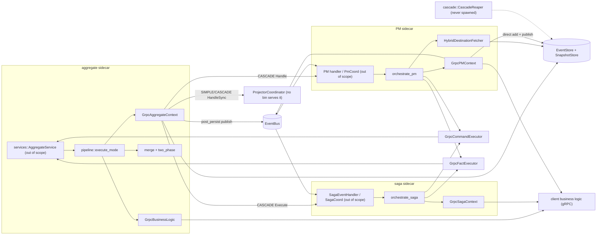
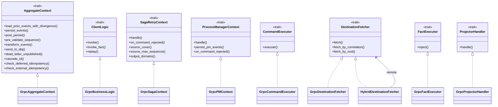
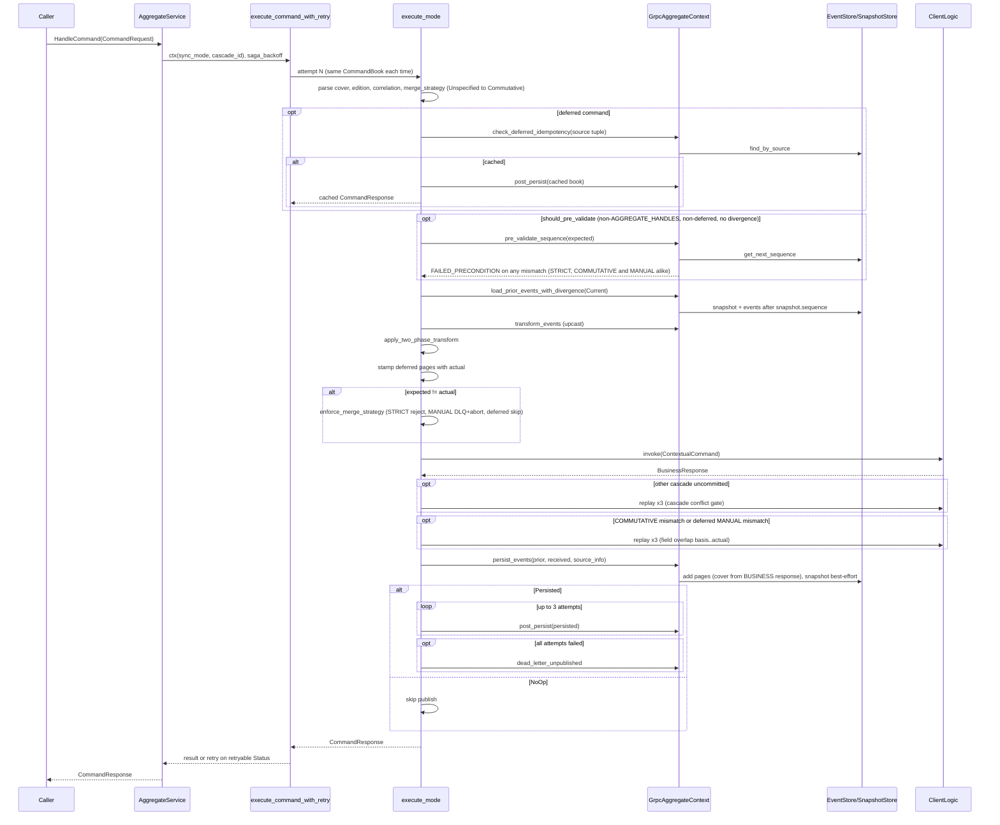
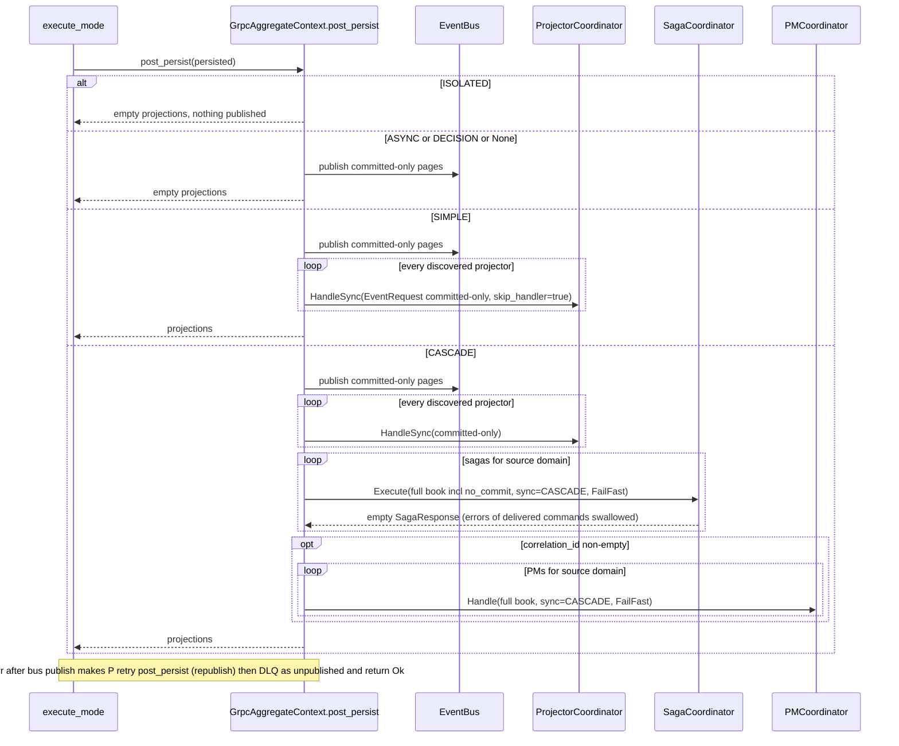
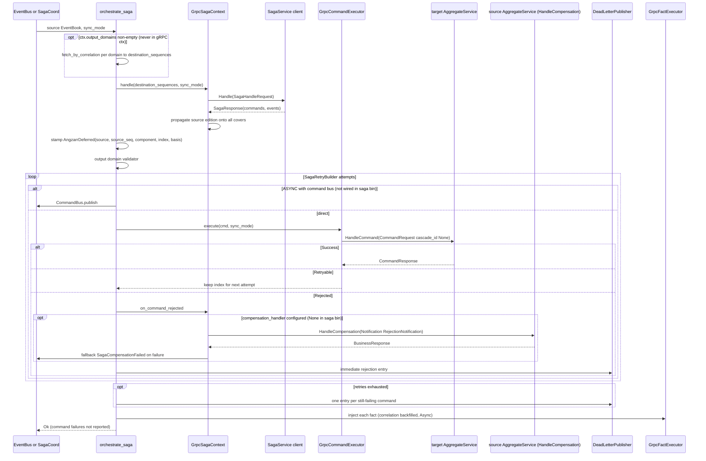
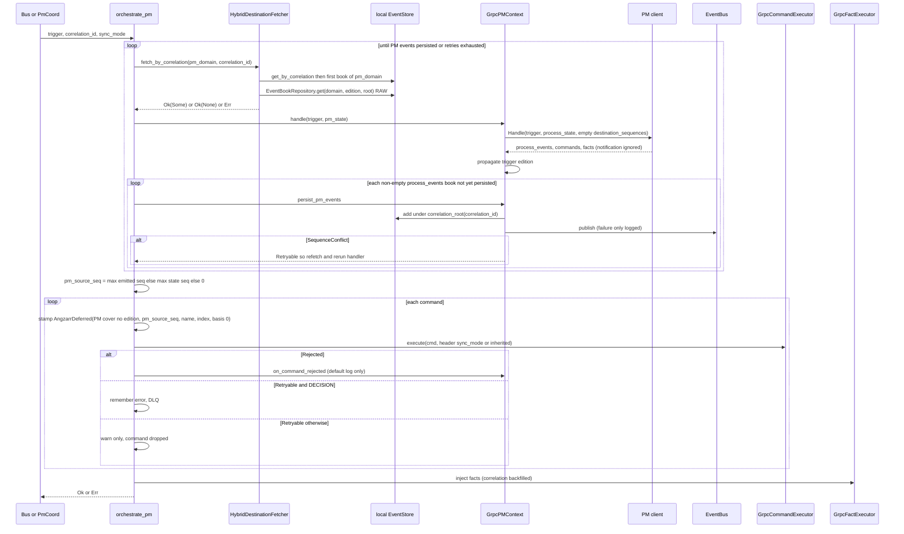
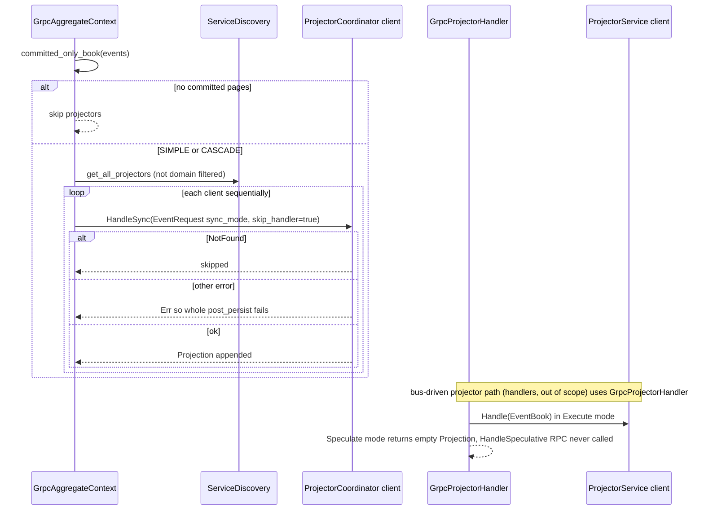
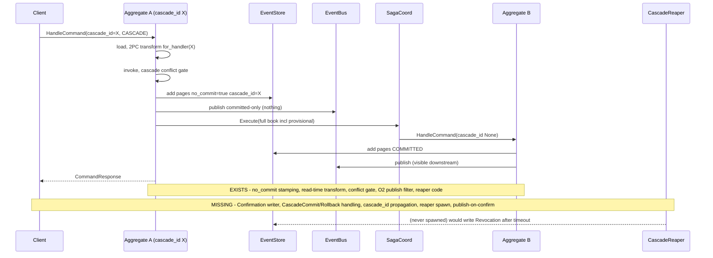
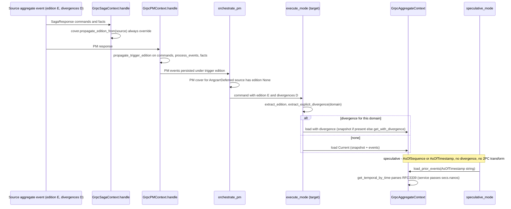

# core-orchestration
Repo: /home/babbitt/workspace/angzarr/core/main @ feat/snapshot-temporal-wiring d86b45be. Working tree DIRTY in scope (uncommitted): src/orchestration/aggregate/{grpc/mod.rs, parsing.rs, pipeline.rs, pipeline.test.rs, tests.rs}, fact/grpc/mod.rs, process_manager/{mod.rs, tests.rs}, saga/{mod.rs, tests.rs} (D-7 `basis_seq`, D-4 Unspecified->Commutative, `skip_handler`). This review reads the working tree. All paths relative to repo root.

## 1. Summary
- `execute_mode` (src/orchestration/aggregate/pipeline.rs:601-850) is the single command decision core; `GrpcAggregateContext` (src/orchestration/aggregate/grpc/mod.rs:143-854) is the only production `AggregateContext`. No `local/` impl exists despite module docs.
- **Merge strategies are mostly dead in production**: pre-validation (pipeline.rs:673-676) runs for STRICT, COMMUTATIVE and MANUAL, and the gRPC impl (grpc/mod.rs:712-740) rejects any mismatch with retryable FAILED_PRECONDITION. The COMMUTATIVE field-overlap merge and MANUAL DLQ only execute for deferred (saga/PM) commands (CORE-ORCH-01).
- `post_persist` bundles bus publish + sync projectors + sync sagas/PMs; any downstream failure after persist is retried in place (republishing), then DLQ'd as "unpublished", and the command returns Ok (CORE-ORCH-02). CASCADE therefore cannot fail, and `CascadeErrorMode` is never read anywhere (CORE-ORCH-03).
- 2PC: storage stamping, read-time transform, conflict gate, publish filter, and a reaper exist. Nothing writes Confirmation, `CascadeReaper` is never constructed, and `cascade_id` never propagates past the first aggregate. Events written under a cascade_id stay invisible forever (CORE-ORCH-04).
- Saga: `orchestrate_saga` (src/orchestration/saga/mod.rs:552-806) swallows command delivery failures (DLQ only). Destination-sequence/basis_seq machinery is unreachable in production because `GrpcSagaContext` never declares output_domains (CORE-ORCH-15). Compensation is not wired in the saga bin (CORE-ORCH-16).
- PM: `orchestrate_pm` (src/orchestration/process_manager/mod.rs:376-659) persists PM events directly (bypassing the pipeline) before dispatching commands. A non-DECISION Retryable command is silently dropped (CORE-ORCH-06). Triggers that emit commands without PM events reuse the idempotency key, and destinations silently swallow the later commands (CORE-ORCH-07).
- Snapshots: the COMMUTATIVE/deferred overlap window loses intervening changes when a snapshot is newer than `expected` (CORE-ORCH-09). Speculative AsOfTimestamp is broken end-to-end because of an untyped string contract (CORE-ORCH-12). Speculative and fact paths skip the 2PC transform (CORE-ORCH-11).
- `src/process/` is dead code: no users in the core repo or any worktree.

## 2. Component inventory
| Component | Kind | path:line | Responsibility | Depends on |
|---|---|---|---|---|
| `FactExecutor`, `FactInjectionError`, `errmsg` | trait/enum/consts | src/orchestration/mod.rs:26-89 | fact-injection seam; shared error strings | proto |
| `AggregateContext` | trait | src/orchestration/aggregate/traits.rs:43-208 | storage, post-persist, DLQ, idempotency seams | storage::SourceInfo |
| `ClientLogic` | trait | src/orchestration/aggregate/traits.rs:215-238 | business invoke/invoke_fact/replay | proto |
| `AggregateContextFactory` | trait | src/orchestration/aggregate/traits.rs:250-259 | per-domain ctx factory (only used by non-bin handler) | — |
| `PersistOutcome` | enum | src/orchestration/aggregate/traits.rs:21-31 | Persisted/NoOp/Duplicate | — |
| `TemporalQuery`, `PipelineMode`, `FactContext`, `FactResponse` | types | src/orchestration/aggregate/types.rs:9-50 | pipeline inputs/outputs | — |
| `GrpcBusinessLogic` | struct | src/orchestration/aggregate/client.rs:21-64 | tonic CommandHandlerService client behind a Mutex | proto client |
| parsing fns | fns | src/orchestration/aggregate/parsing.rs:15-191 | cover/seq/edition/divergence extraction; deferred stamping | validation |
| `execute_command_pipeline`, `execute_command_with_retry`, `execute_mode`, `speculative_mode`, `execute_fact_pipeline` | fns | src/orchestration/aggregate/pipeline.rs:39-1103 | command/fact pipelines, merge gates, B1 publish retry | merge, two_phase, utils::retry, response_builder |
| merge fns | fns | src/orchestration/aggregate/merge.rs:66-317 | commutative overlap, cascade conflict | ClientLogic::replay, proto_reflect |
| `transform_for_two_phase`, `is_noop` | fns | src/orchestration/aggregate/two_phase.rs:71-286 | 2PC read-time visibility | proto framework types |
| sync_policy | fns | src/orchestration/aggregate/sync_policy.rs:20-40 | ISOLATED skip / projector wait predicates | proto SyncMode |
| `GrpcAggregateContext`, `GrpcAggregateContextFactory`, `publish_aggregate_sequence_mismatch_dlq` | struct/fn | src/orchestration/aggregate/grpc/mod.rs:143-985 | load (snapshot/divergence/temporal), persist, post_persist fan-out, DLQ | EventStore, EventBookRepository, SnapshotRepository, ServiceDiscovery, EventBus, Upcaster, DLQ |
| `CommandExecutor`, `CommandOutcome` | trait/enum | src/orchestration/command/mod.rs:15-45 | command dispatch classification | proto |
| `GrpcCommandExecutor` | struct | src/orchestration/command/grpc/mod.rs:27-97 | per-domain HandleCommand; retryable classification | utils::retry |
| `extract_correlation_id`, `ANGZARR_UUID_NAMESPACE` | fn/static | src/orchestration/correlation.rs:19-34 | correlation validation; UUIDv5 namespace | validation |
| `DestinationFetcher` | trait | src/orchestration/destination/mod.rs:39-71 | state fetch, with O9 Ok(None) vs Err contract | proto |
| `GrpcDestinationFetcher` | struct | src/orchestration/destination/grpc/mod.rs:24-125 | EventQuery.GetEventBook per domain | EventQuery client |
| `HybridDestinationFetcher` | struct | src/orchestration/destination/hybrid.rs:42-237 | PM-own-domain local read, others remote | EventStore, EventBookRepository |
| `GrpcFactExecutor` | struct | src/orchestration/fact/grpc/mod.rs:25-78 | HandleEvent (Async, handler routed) | proto client |
| `CorrelationRootExt`, `fill_correlation_id`, `fill_fact_correlation_id` | trait/fns | src/orchestration/shared.rs:29-80 | correlation->PM root (UUIDv5), correlation backfill | correlation |
| `ProjectorHandler`, `GrpcProjectorHandler`, `ProjectionMode` | trait/struct | src/orchestration/projector/mod.rs:19-83 | projector invocation (bus path) | ProjectorService client |
| `SagaHandler`, `SagaContextFactory`, `SagaRetryContext` | traits | src/orchestration/saga/mod.rs:73-177 | saga seams | — |
| `SagaOperation`, `SagaRetryBuilder`, `orchestrate_saga` | struct/fn | src/orchestration/saga/mod.rs:201-806 | fetch dest seqs, translate, stamp provenance, deliver with per-index retry, DLQ, facts | CommandExecutor, CommandBus, DestinationFetcher, FactExecutor, DLQ |
| `GrpcSagaContext`, `GrpcSagaContextFactory`, `handle_command_rejection` | struct/fn | src/orchestration/saga/grpc/mod.rs:36-348 | SagaService call, edition propagation, compensation via HandleCompensation | saga_compensation utils |
| `ProcessManagerHandler`, `ProcessManagerContext`, `PMContextFactory` | traits | src/orchestration/process_manager/mod.rs:133-262 | PM seams | — |
| `orchestrate_pm`, `execute_pm_commands`, `BookFingerprint` | fn/struct | src/orchestration/process_manager/mod.rs:78-903 | fetch state, handle, persist PM events (retry loop), dispatch commands, facts | DestinationFetcher, CommandExecutor, FactExecutor, DLQ |
| `persist_pm_event_book`, `GrpcPMContext`, `GrpcPMContextFactory` | fn/struct | src/orchestration/process_manager/grpc/mod.rs:51-317 | direct EventStore add + bus publish; PM client call | EventStore, EventBus |
| `propagate_trigger_edition` | fn | src/orchestration/process_manager/edition_propagation.rs:13-37 | always-override edition onto PM outputs | CoverExt |
| `CascadeReaper` | struct | src/cascade/reaper.rs:26-325 | revoke stale no_commit cascades (never spawned) | EventStore, EventBus |
| `ProcessEnv`, `ManagedProcess`, `wait_for_ready` | struct/fn | src/process/mod.rs:27-212 | spawn client process (dead code) | transport |

## 3. Architecture diagrams

## 4. Sequence diagrams

### 4.1 Command → aggregate pipeline

1. Service builds ctx per request (src/services/aggregate.rs:195-202, out of scope) → `execute_command_with_retry` (pipeline.rs:96-108). `AggregateOperation::try_execute` re-runs `execute_mode` with a clone of the identical CommandBook (pipeline.rs:81-92).
2. Parse cover/edition/correlation (pipeline.rs:608-610). Unspecified merge strategy normalizes to Commutative (pipeline.rs:620-623).
3. Deferred provenance is captured before stamping (pipeline.rs:636, 125-146). Idempotent replay republishes the cached book (pipeline.rs:640-651, 157-192). The gRPC lookup is `find_by_source` (grpc/mod.rs:770-786).
4. `expected` = explicit seq, or `basis_seq` for AngzarrDeferred (parsing.rs:67-81). Explicit divergence is read from Edition (pipeline.rs:659).
5. Pre-validate (pipeline.rs:673-676, predicate 199-207). The gRPC impl errors on any mismatch (grpc/mod.rs:725-737).
6. Load: the Current path takes snapshot + post-snapshot pages (grpc/mod.rs:456-459). Divergence probes the snapshot, then `get_with_divergence` (grpc/mod.rs:426-453). Upcast (grpc/mod.rs:743-756).
7. 2PC transform (pipeline.rs:697-699, 213-226). Deferred pages are stamped with `actual` (pipeline.rs:705-711, parsing.rs:129-144).
8. Mismatch gate (pipeline.rs:739-765, 238-299).
9. Invoke, then extract events (pipeline.rs:778-782). Cascade gate (796-799), commutative gate (802-805), deferred-MANUAL gate (810-821).
10. Persist (pipeline.rs:824-835 → grpc/mod.rs:475-636): new pages = seq > prior max (487-496). cascade_id stamping (517-526). The cover comes from the business response (529-548). Snapshot write is best-effort (577-616).
11. Publish with in-place retry, then DLQ (pipeline.rs:507-551, 844).

### 4.2 Post-persist fan-out: ISOLATED / ASYNC / DECISION / SIMPLE / CASCADE

1. ISOLATED short-circuits (grpc/mod.rs:640-643; sync_policy.rs:20-22).
2. Bus publish of committed-only pages happens first in every non-ISOLATED mode (grpc/mod.rs:664-670, 124-140).
3. Projectors run for SIMPLE and CASCADE only (sync_policy.rs:35-40; grpc/mod.rs:685-694, 352-390). There is no domain filter, and NotFound is skipped (379-381).
4. CASCADE calls sagas, then PMs, sequentially, each over a fresh channel (grpc/mod.rs:697-706, 235-348). Responses are discarded (274-281, 337-344). PMs are skipped when correlation is empty (300-304).
5. Any error propagates to `publish_unless_noop`, which retries 3x and then DLQs (pipeline.rs:519-550).
6. ASYNC and DECISION do not wait on sagas/PMs. Downstream runs off the bus via SagaEventHandler/PM handler with `SyncMode::Async` (src/handlers/core/saga.rs:171-181, out of scope).

### 4.3 Saga event → commands (incl. rejection/compensation)

1. Phase 1 fetch runs only if `ctx.output_domains()` is non-empty (saga/mod.rs:566-604). `GrpcSagaContext` does not override it, so the trait default `&[]` applies (saga/mod.rs:156-158; saga/grpc/mod.rs:92-166).
2. `handle` calls SagaService and force-propagates the source edition (saga/grpc/mod.rs:93-126).
3. Stamping: explicit Sequence is honored. Handler AngzarrDeferred is merged. Otherwise the default uses source cover + max seq. The framework always stamps component/index; basis_seq is filled from the map (saga/mod.rs:651-718).
4. Delivery with per-index retry (saga/mod.rs:238-376, 502-527). The Async+bus branch (268-301) is unreachable from the saga bin (command_bus None, src/bin/angzarr_saga.rs:182-190).
5. Rejected: `on_command_rejected` → `handle_command_rejection` → HandleCompensation (saga/grpc/mod.rs:142-256), plus an immediate DLQ (saga/mod.rs:320-324, 389-412). The compensation handler is None in production (src/bin/angzarr_saga.rs:174-181).
6. Retry exhaustion leads to DLQ (saga/mod.rs:420-448, 523-526). `execute()` returns `()`, so `orchestrate_saga` still returns Ok (saga/mod.rs:737-742, 805).
7. Facts: missing executor refused (H-15), correlation backfilled, inject (saga/mod.rs:759-803). Injection always uses Async (fact/grpc/mod.rs:63-69).

### 4.4 PM trigger → state load → commands → PM event persist

1. State fetch by correlation (process_manager/mod.rs:429-439). Hybrid local path: `get_by_correlation` → first book with domain == pm_domain → `EventBookRepository::get` (snapshot-aware, 2PC-RAW) (hybrid.rs:136-230).
2. Handle. The request always carries empty `destination_sequences` (process_manager/grpc/mod.rs:202-206). `response.notification` is ignored (214-216). Edition propagation (221-226; edition_propagation.rs:13-37).
3. Persist loop with H-13 fingerprint dedup (process_manager/mod.rs:478-548). `persist_pm_event_book` adds under `correlation_root` with no idempotency key and publishes only the new pages. Publish failure is only logged (process_manager/grpc/mod.rs:65-147).
4. Commands: correlation backfill, PM cover (edition None) and stamping (process_manager/mod.rs:686-786). Effective sync mode comes from the header (816-825). Outcome handling (833-897).
5. Facts (process_manager/mod.rs:612-651).

### 4.5 Projector sync

1. Committed-only filter (grpc/mod.rs:124-140, 685-694).
2. `call_sync_projectors` (grpc/mod.rs:352-390).
3. `GrpcProjectorHandler::handle` (projector/mod.rs:70-83). Speculate short-circuits at :71-73.
4. `ProjectorCoordinatorServiceServer` is not served by any bin (`rg -n ProjectorCoordinatorServiceServer src/bin src/utils src/services` → 0 non-test hits).

### 4.6 2PC / cascade: exists vs stub

Exists:
- cascade_id is set only from `CommandRequest.cascade_id` (src/services/aggregate.rs:197-199).
- Stamping (grpc/mod.rs:517-526), transform (two_phase.rs:71-212), conflict gate (pipeline.rs:796-799; merge.rs:261-317), publish/projector filter (grpc/mod.rs:124-140), reaper (reaper.rs:110-324).

Stub/missing:
- No Confirmation/CascadeCommit/CascadeRollback writer or handler: `rg -n 'type_url::CONFIRMATION|Confirmation \{|CascadeCommit|CascadeRollback|execute_atomic' src` → only doc/test hits.
- `CascadeReaper::new` has no production caller (`rg -n 'CascadeReaper' --type rust . -g '!target'` → only src/cascade and doc comments).
- `GrpcCommandExecutor` always sends `cascade_id: None` (command/grpc/mod.rs:70). SagaHandleRequest/ProcessManagerCoordinatorRequest have no cascade_id field (saga.proto:44-49, process_manager.proto:60-64).
- Doc references nonexistent `execute_atomic()` (src/cascade/mod.rs:8).

### 4.7 Edition / temporal propagation

1. Saga: always-override edition on commands and facts (saga/grpc/mod.rs:113-124).
2. PM: always-override on commands/process_events/facts (process_manager/grpc/mod.rs:221-226; edition_propagation.rs:22-36). The PM rejection-route cover has `edition: None` (process_manager/mod.rs:703).
3. Target: `extract_edition` (parsing.rs:151-157), `extract_explicit_divergence` (parsing.rs:169-180). Load branches (grpc/mod.rs:426-459).
4. Speculative: `(Some(seq),_)` wins over timestamp (pipeline.rs:51-59). `speculative_mode` loads without divergence or 2PC transform (pipeline.rs:867-870). The AsOfTimestamp string is passed to `get_temporal_by_time` (grpc/mod.rs:466-470), which parses RFC3339 (src/repository/event_book/mod.rs:288-289). The service formats it as `"{secs}.{nanos}"` (src/services/aggregate.rs:227).

## 5. Invariants & contracts
- I1: Only ISOLATED skips post_persist; only SIMPLE/CASCADE wait on projectors (sync_policy.rs:20-40, tests sync_policy.test.rs:25-106).
- I2: Bus and projectors see only `no_commit == false` pages. Sagas/PMs in CASCADE see the full book (grpc/mod.rs:124-140, 664-706; pinned by grpc/mod.test.rs:262-621).
- I3: Once persisted, a post_persist failure never fails the command (3 in-place attempts, then `dead_letter_unpublished`) (pipeline.rs:507-551; pipeline.test.rs:527-614). Violated semantically for sync fan-out (CORE-ORCH-02).
- I4: A NoOp persist is never published (pipeline.rs:512-517). Fact pipeline exempt (CORE-ORCH-13).
- I5: The deferred idempotency key is `(dest domain, edition, root, source edition, source domain, source root, source_seq, source_component, command_index)` (pipeline.rs:125-146; grpc/mod.rs:41-69; storage postgres event_store.rs:621-635).
- I6: `basis_seq` 0 means the whole-history overlap window. Nonzero gives `basis..actual`. `basis == actual` means no gate (pipeline.rs:739-752; pipeline.test.rs:1404-1564).
- I7: PM root = `correlation_id.correlation_root()` (UUID passthrough, else UUIDv5(ANGZARR_UUID_NAMESPACE)), at both persist and stamp sites (shared.rs:34-43; process_manager/grpc/mod.rs:65; process_manager/mod.rs:700).
- I8: `DestinationFetcher` Ok(None) means genuinely absent, and Err must propagate (destination/mod.rs:7-21). Honored by saga Phase 1 (saga/mod.rs:581-599) and PM (process_manager/mod.rs:429-439).
- I9: Saga/PM outputs inherit the source/trigger edition (always override) (saga/grpc/mod.rs:113-124; edition_propagation.rs:13-37).
- I10: Handler-stamped explicit `Sequence` on saga/PM commands passes untouched (saga/mod.rs:674; process_manager/mod.rs:745).
- I11: PM events persist before commands dispatch (process_manager/mod.rs:478-594).
- I12: Retryability is decided by `is_retryable_status` (src/utils/retry.rs:166-183): FailedPrecondition is retryable only with the prefix `Sequence mismatch:` or `Sequence conflict:`.
- I13: Merge strategy wire 0 means Commutative (pipeline.rs:620-623, 263).

## 6. Findings
| ID | Severity | Category | path:line | Finding | Evidence/how verified | Suggested direction |
|---|---|---|---|---|---|---|
| CORE-ORCH-01 | high | correctness | src/orchestration/aggregate/pipeline.rs:199-207, :673-676; src/orchestration/aggregate/grpc/mod.rs:712-740 | Pre-validation runs for COMMUTATIVE and MANUAL non-deferred commands. The gRPC impl returns retryable `FAILED_PRECONDITION "Sequence mismatch: ..."` on any `expected != next_sequence` before load. So the COMMUTATIVE post-exec field-overlap merge (the documented default, and wire 0) and the MANUAL DLQ+ABORTED path never run for client commands. They are only reachable in a race window between pre-validate and load. Effect: COMMUTATIVE behaves as STRICT, and MANUAL retries 10x and then fails without a DLQ entry. | Read both. `should_pre_validate(Commutative/Manual,false,false)==true` is pinned by tests (pipeline.test.rs:345-361). Pipeline tests use `TestCtx` whose `pre_validate_sequence` is the trait no-op (traits.rs:108-116), so no test sees the interaction. | Restrict pre-validate to STRICT (or make pre-validate return state without failing for non-STRICT). Add a GrpcAggregateContext-level COMMUTATIVE/MANUAL test. |
| CORE-ORCH-02 | high | correctness/error-handling | src/orchestration/aggregate/pipeline.rs:507-551; src/orchestration/aggregate/grpc/mod.rs:664-706 | `post_persist` bundles bus publish with sync projector/saga/PM calls. After a successful publish, a projector/saga/PM error makes `publish_unless_noop` re-run the whole post_persist up to 3x (republishing to the bus and re-invoking sagas/PMs). It then DLQs the book as "persisted-but-unpublished" (`is_transient=true`) and returns `Ok(vec![])`. SIMPLE/CASCADE callers get success with no projections. | Read. The Err path from `call_sync_projectors` (grpc/mod.rs:382-385) and `call_sync_sagas/pms` (274-281, 337-344) feeds the `?` at 690-705. `publish_unless_noop` loops at 520-540. | Split publish (B1 scope) from sync fan-out. Propagate fan-out errors per CascadeErrorMode without republishing. |
| CORE-ORCH-03 | high | correctness | src/orchestration/saga/mod.rs:502-527, :737-742; src/orchestration/aggregate/grpc/mod.rs:268, :332; src/orchestration/command/grpc/mod.rs:69 | CASCADE cannot fail fast. `SagaRetryBuilder::execute` returns `()`, so rejected and retry-exhausted commands never reach `orchestrate_saga`'s result. `call_sync_sagas` discards the (always empty) SagaResponse. `CascadeErrorMode` is only ever written as FailFast and never read. | `rg -n cascade_error_mode src --type rust` (excluding src/proto, tests) → 5 hits, all constructing requests, 0 reads. Read saga/mod.rs:502-527. | Return a delivery summary; honor cascade_error_mode in SagaCoord/PmCoord/post_persist. |
| CORE-ORCH-04 | med | design/correctness | src/orchestration/aggregate/grpc/mod.rs:517-526, :649-657; src/orchestration/command/grpc/mod.rs:70; src/cascade/reaper.rs:47; src/cascade/mod.rs:8 | 2PC is half-built. Pages written under a cascade_id are `no_commit` and are never confirmed. Revocation happens only via a reaper that is never constructed. The comment promising publish "at the confirmation point" (grpc/mod.rs:655-656) has no implementation. Downstream hops of a cascade commit immediately (cascade_id None). Any `CommandRequest.cascade_id` user loses their events from all standard reads (NoOp) and from the bus forever. | `rg -n 'type_url::CONFIRMATION\|Confirmation \{\|CascadeCommit\|CascadeRollback\|execute_atomic' src` → only doc hits. `rg -n 'CascadeReaper' --type rust . -g '!target'` → no production constructor. | Finish (commit coordinator + reaper spawn + propagation + publish-on-confirm) or reject `cascade_id` at the API until finished. |
| CORE-ORCH-05 | med | security/integrity | src/orchestration/aggregate/grpc/mod.rs:529-548, :596-603 | `persist_events` writes to the business-returned `received.cover` (domain, root, correlation) instead of the coordinator-validated `(domain, root)` parameters. `EventBookRepository::put` derives the target from the cover (src/repository/event_book/mod.rs:508). A buggy or malicious client handler can append events to another aggregate/domain. The snapshot is written to the parameter root, so events and snapshot diverge. | Read persist_events and repository put. No equality check between cover and params anywhere in pipeline.rs:778-835. | Overwrite/validate cover domain+root (and edition) from pipeline params before put. |
| CORE-ORCH-06 | high | correctness | src/orchestration/process_manager/mod.rs:873-879 | A PM command with `CommandOutcome::Retryable` outside DECISION is logged "will be retried" but nothing retries it: no DLQ, no compensation. `orchestrate_pm` returns Ok, the trigger is acked, and PM state is already persisted, so redelivery will not re-emit it. The command is lost. | Read dispatch loop 796-903. PM tests only cover the DECISION variant (tests.rs:702-741, 1137-1178). | Per-index delivery retry like the saga, then DLQ + Err on exhaustion. |
| CORE-ORCH-07 | med | correctness | src/orchestration/process_manager/mod.rs:572-582, :765-782; src/orchestration/aggregate/pipeline.rs:640-651 | PM idempotency-key collision. When a trigger emits commands but no PM events, `pm_source_seq` = max seq of existing PM state (or 0). Two such triggers stamp identical `(PM cover, source_seq, pm_name, command_index)`. At the same destination root, `check_deferred_idempotency` matches the first command's events and returns them as cached, so the second command is silently swallowed. | Read. `find_by_source` matches exactly these columns (src/storage/postgres/event_store.rs:621-635). | Derive source_seq from the trigger (domain/root/seq) or require/enforce a PM event per command-emitting trigger. |
| CORE-ORCH-08 | med | correctness/perf | src/orchestration/aggregate/pipeline.rs:81-92, :248-256, :359-362; src/orchestration/mod.rs:43-44; src/utils/retry.rs:171-179 | STRICT (and via CORE-ORCH-01 COMMUTATIVE/MANUAL) mismatches are retryable, but retries replay the identical CommandBook with the same `expected`. That means up to 10 futile attempts (saga_backoff up to 2s delay), each pre-validate loading the full book for Status details (grpc/mod.rs:727-736). The saga layer then retries again (nested amplification). Conversely the COMMUTATIVE overlap message `"Sequence mismatch with overlapping fields:"` does not match the `"Sequence mismatch:"` prefix, so it is non-retryable, contradicting the doc at pipeline.rs:341. | String/prefix check read in retry.rs:171-179. Backoff in retry.rs:79-85. No test pins either classification. | Make non-deferred sequence mismatch non-retryable at the aggregate (retry only deferred); align overlap classification and docs. |
| CORE-ORCH-09 | med | correctness (snapshot) | src/orchestration/aggregate/merge.rs:135-149, :73-79; src/orchestration/aggregate/grpc/mod.rs:456-459 | The overlap window is wrong when a snapshot exists. Current loads carry `snapshot` plus only post-snapshot pages. `build_events_up_to_sequence(prior, expected)` keeps that snapshot and filters pages `< expected`. If `expected <= snapshot.sequence`, then "state@expected" is actually state@snapshot, and intervening changes in `[expected, snapshot.sequence]` are invisible. This yields false `Disjoint`: COMMUTATIVE or deferred-MANUAL commands merge over genuine conflicts. | Read merge.rs and load path (grpc/mod.test.rs:39-98 confirms snapshot+post-snapshot shape). No test combines snapshot with overlap (aggregate/tests.rs, pipeline.test.rs read fully). | When `expected <= snapshot.sequence`, load raw events from 0 (or the temporal-by-sequence book) for the expected-state replay, or treat as overlap. |
| CORE-ORCH-10 | med | correctness (2PC) | src/orchestration/aggregate/two_phase.rs:182-186; src/orchestration/aggregate/pipeline.rs:217-221; src/orchestration/aggregate/merge.rs:227-247, :274-276 | The cascade conflict gate over-locks. `uncommitted_cascade_ids` is filled before the revoked, confirmed and own-cascade checks, so `has_uncommitted_other_cascades` is true even for only-own or long-confirmed cascades. `partition_by_commit_status` splits on the raw `no_commit` flag, which storage never flips, so confirmed, revoked and own-cascade pages all count as "locked fields". A cascade's second command touching a field its own first command wrote is aborted "Cascade conflict". The gate also passes raw Confirmation/Revocation Anys to client `replay`. | Read. Storage has no flag flip (`rg 'no_commit\s*=\s*false\|SET no_commit'` → only insert-time mapping). pipeline.test.rs:834 cites `merge.test.rs`, which does not exist (`ls src/orchestration/aggregate/`), so the Conflict path has no unit test. | Compute locked set from the transform result (unresolved, other-cascade only); replay transformed books; add tests. |
| CORE-ORCH-11 | med | correctness (2PC/temporal) | src/orchestration/aggregate/pipeline.rs:867-870, :988-993 | `speculative_mode` and `execute_fact_pipeline` never call `apply_two_phase_transform`. The handler (`invoke` / `invoke_fact`) and the fact `next_sequence` see raw unresolved/revoked pages and framework markers. The repository doc says the coordinator applies the transform on these RAW temporal reads (src/repository/event_book/mod.rs:274-279). Speculative results diverge from execute. Speculative also ignores explicit divergence. | Read both functions; transform is called only at pipeline.rs:699. | Share one "load + upcast + 2PC view" helper across all three modes. |
| CORE-ORCH-12 | high | correctness (boundary) | src/orchestration/aggregate/types.rs:15; src/orchestration/aggregate/grpc/mod.rs:466-470; src/services/aggregate.rs:227 | Speculative AsOfTimestamp always fails. `TemporalQuery::AsOfTimestamp(String)` is an untyped string. The service formats `"{seconds}.{nanos}"`, while `get_temporal_by_time` requires RFC3339 (`parse_from_rfc3339`, src/repository/event_book/mod.rs:288-289), so it fails with Internal. EventQuery uses `timestamp_to_rfc3339` correctly (src/services/event_query/mod.rs:106-108). | Read all three sites. `rg AsOfTimestamp\|as_of_timestamp src tests` shows no test of the speculative time path. | Make the variant carry `prost_types::Timestamp` (or chrono) and convert once. |
| CORE-ORCH-13 | med | correctness | src/orchestration/aggregate/pipeline.rs:922, :1069-1082, :965 | The fact pipeline diverges from command-pipeline fixes. NoOp books are published (H-16). A post_persist error after a successful persist propagates (B1 class; the caller retry then hits external_id dedup → cached republish or ABORTED). The fact `correlation_id` is not validated (commands validate at :610). | Read. | Reuse `publish_unless_noop`, `extract_correlation_id`. |
| CORE-ORCH-14 | med | correctness/design | src/orchestration/aggregate/grpc/mod.rs:664-670, :697-706; src/orchestration/command/mod.rs:43; src/orchestration/saga/mod.rs:543-547 | CASCADE both publishes committed pages to the bus and invokes sagas/PMs synchronously, so each saga/PM runs twice per event. Docs claim CASCADE has "no bus publishing". Saga duplicates are absorbed by destination provenance idempotency. PM triggers have no dedup (PM events persisted with no idempotency key, process_manager/grpc/mod.rs:75-80), so the PM handler runs twice. | Read; prior F5. | Decide the contract: suppress the bus publish for CASCADE or mark events cascade-handled; add PM trigger dedup. |
| CORE-ORCH-15 | med | design/dead path | src/orchestration/saga/grpc/mod.rs:92-166, :297-313; src/orchestration/saga/mod.rs:104-106, :567; src/orchestration/process_manager/grpc/mod.rs:202-206, :214-216 | The destination-sequence and D-7 basis machinery is unreachable in production. The gRPC saga ctx/factory never override `output_domains`, and orchestrate_saga reads only the ctx method. `SagaContextFactory::output_domains` is never read. PM always sends empty `destination_sequences`. So `basis_seq` is always 0 and deferred MANUAL uses the whole-history window. All D-7 saga tests use test contexts that override `output_domains` (saga/tests.rs:1291, 1380, 1966). `GrpcPMContext` also drops `ProcessManagerHandleResponse.notification` (process_manager.proto:102). | `rg -n output_domains src` (non-test) → trait defs and orchestrate_saga only. | Wire output domains from config/subscriptions plus a root-keyed fetch, or delete. Forward the PM notification. |
| CORE-ORCH-16 | med | correctness | src/orchestration/saga/grpc/mod.rs:142-157; src/orchestration/process_manager/mod.rs:214-225; src/orchestration/process_manager/grpc/mod.rs:183-259 | Compensation is inert in distributed mode. The saga bin constructs the factory with `compensation_handler: None` (src/bin/angzarr_saga.rs:174-181), so rejections only log. `GrpcPMContext` does not override `on_command_rejected` (the default logs only), so `ProcessManagerHandler::handle_revocation` is never reached. | Read; bin verified via sed of angzarr_saga.rs:165-190. | Wire the source-aggregate compensation client; implement PM rejection handling. |
| CORE-ORCH-17 | med | error-handling | src/orchestration/process_manager/grpc/mod.rs:139-147 | PM event persist succeeds, but a bus publish failure is only logged: persisted-but-unpublished with no DLQ capture (the aggregate has B1 capture). The PM path also skips snapshot writes and upcasting. | Read; the test (grpc/mod.test.rs) doesn't cover a publish failure. | Mirror `dead_letter_unpublished` for PMs. |
| CORE-ORCH-18 | low | correctness | src/orchestration/destination/hybrid.rs:161-167, :192-196 | PM state lookup picks "first book with domain==pm_domain" from `get_by_correlation`, which is assembled from a HashMap (src/storage/helpers/mod.rs:58-82), so the pick is non-deterministic across editions sharing a correlation. A missing edition defaults to `"main"`, which storage treats as a named edition (`is_main_timeline` accepts only `""`/`"angzarr"`, src/storage/helpers/mod.rs:20-22). | Read; rg `"main"` → only hybrid.rs:196. | Filter by trigger edition; use `DEFAULT_EDITION`/`""`. |
| CORE-ORCH-19 | low | correctness (edition) | src/orchestration/process_manager/mod.rs:691-705 | The PM rejection-routing cover (`angzarr_deferred.source`) has `edition: None`, while PM events persist under the trigger edition (process_manager/grpc/mod.rs:66). Edition-branch rejections route to the main-timeline PM. | Read. | Copy the trigger edition onto `pm_cover`. |
| CORE-ORCH-20 | low | design | src/orchestration/projector/mod.rs:70-73 | In `ProjectionMode::Speculate`, `GrpcProjectorHandler` returns an empty Projection instead of calling `ProjectorService.HandleSpeculative` (projector.proto:20). | `rg -n handle_speculative src` (non-proto) → no ProjectorServiceClient caller. | Call HandleSpeculative. |
| CORE-ORCH-21 | low | concurrency | src/orchestration/aggregate/client.rs:37-59; src/orchestration/command/grpc/mod.rs:65-75; src/orchestration/fact/grpc/mod.rs:62-74; src/orchestration/destination/grpc/mod.rs:87-91, :114-121; src/orchestration/saga/grpc/mod.rs:99-105; src/orchestration/process_manager/grpc/mod.rs:208-212 | `tokio::Mutex` guards are held across the RPC await, which serializes all business calls per aggregate sidecar and all commands per destination domain per saga/PM sidecar. In CASCADE the command-executor lock for domain X is held through the downstream cascade, so a cyclic topology re-entering the same sidecar for X would deadlock (not reproduced). | Read. | Clone tonic clients per call (Channel is multiplexed). |
| CORE-ORCH-22 | low | dead code | src/process/mod.rs:1-216; src/orchestration/destination/mod.rs:52-70; src/orchestration/destination/grpc/mod.rs:67-94; src/orchestration/aggregate/grpc/mod.rs:897-985 | Unused in production: the whole `process` module (`rg 'ManagedProcess\|wait_for_ready\|ProcessEnv\|process::'` across the workspace → only src/process and worktree copies), `DestinationFetcher::fetch`/`fetch_by_root` (only `fetch_by_correlation` has callers), `GrpcAggregateContextFactory`, and the saga CommandBus branch (saga bin passes None). | rg as stated. | Delete or wire. |
| CORE-ORCH-23 | low | docs | src/orchestration/aggregate/mod.rs:34; src/orchestration/aggregate/sync_policy.rs:5-9; src/orchestration/saga/mod.rs:28, :543-547, :722, :734; src/orchestration/process_manager/mod.rs:21-23, :37; src/orchestration/command/mod.rs:40-44; src/cascade/mod.rs:8; src/orchestration/aggregate/pipeline.test.rs:834 | Doc drift: `local/` impls and "local context" don't exist. CASCADE is documented as "no bus publishing" but publishes. "Phase 4" appears twice. The PM doc says events are stored under root = correlation_id (actually UUIDv5-derived). `execute_atomic()` doesn't exist. The test comment cites a nonexistent `merge.test.rs`. Heavy ticket/history commentary (B1/H-16/O2/D-7/"pre-fix") conflicts with the no-change-commentary rule. | Read. | Trim to current behavior. |
| CORE-ORCH-24 | low | test quality | src/orchestration/saga/grpc/mod.test.rs:43-68 | Two tests assert on local literals and don't exercise production code (`test_saga_context_factory_name_concept` asserts `"saga-order-fulfillment".starts_with("saga-")`). GrpcSagaContext `handle`/`on_command_rejected` are untested. | Read. | Replace with in-process tonic server tests (pattern in aggregate grpc/mod.test.rs:444-621). |
| CORE-ORCH-25 | low | perf/robustness | src/orchestration/aggregate/grpc/mod.rs:252-282, :316-345 | CASCADE creates a new Channel per saga/PM per event, calls them sequentially, and sets no request deadline. A hung saga blocks the command indefinitely. | Read. | Cache channels in discovery; add timeouts. |
| CORE-ORCH-26 | low | design | src/orchestration/fact/grpc/mod.rs:63-69 | Facts are always injected with `SyncMode::Async`, even inside CASCADE/SIMPLE, so fact-triggered projectors/sagas never join the synchronous flow. | Read. | Thread sync_mode through `FactExecutor::inject`. |
| CORE-ORCH-27 | low | complexity | src/orchestration/aggregate/grpc/mod.rs:41-69, :104-108; src/orchestration/aggregate/pipeline.rs:125-146 | Duplicate deferred→SourceInfo helpers with different bad-UUID behavior (grpc Err vs pipeline None → no provenance persisted). A duplicate `calculate_set_next_seq` shadows `proto_ext::calculate_set_next_seq`. | Read. | Single helper. |
| CORE-ORCH-28 | low | correctness (2PC) | src/cascade/reaper.rs:337-341; src/orchestration/aggregate/pipeline.rs:1036-1037 | The reaper treats a participant as resolved if any committed page carries the cascade_id. The fact pipeline preserves a client-supplied `cascade_id` on committed (`no_commit=false`) pages when no ctx cascade is set, so an injected fact can mask a stale cascade from revocation. The TOCTOU is already documented at reaper.rs:192-195. | Read. | Strip client `cascade_id` from fact pages unless the ctx cascade matches; resolve only on Confirmation/Revocation type_url. |

Counts: high 5 (01, 02, 03, 06, 12), med 12, low 11.

## 7. Open questions
- Is COMMUTATIVE pre-validation (CORE-ORCH-01) intentional, with the pipeline docs stale? It decides whether the default merge strategy exists at all in distributed mode.
- Saga bin names the factory `bootstrap.domain` (src/bin/angzarr_saga.rs:179), which becomes `source_component`. If `target.domain` is the source domain rather than a unique saga name, two sagas on one source domain share a component and can collide on idempotency keys (the O1 scenario in types.proto:188-192).
- `BusinessResponse.notification`: `extract_events_from_response` maps it to an empty book (src/utils/response_builder/mod.rs:37-50), which makes the command a NoOp success. Is it forwarded anywhere?
- Intended CASCADE contract for the bus (CORE-ORCH-14), and who is meant to write Confirmation (CORE-ORCH-04)?
- EventQuery default selection returns `EventBookRepository::get` RAW (src/services/event_query/mod.rs:124; repository doc says not to hand RAW to external consumers). Is this out-of-scope leak known?

## 8. Cross-repo interface surface
- Relies on client business logic (all client-* repos) for:
  - `CommandHandlerService.Handle` returning `BusinessResponse` whose `events.cover` is trusted as the write target (CORE-ORCH-05) and whose pages carry sequences above prior max (grpc/mod.rs:487-496).
  - Optional `HandleFact`.
  - `Replay` returning a stable state `Any` type_url; COMMUTATIVE diffs need proto_reflect to know the type, else it falls back to "*".
- `SagaService.Handle` reads `destination_sequences` (always empty in prod). `ProcessManagerService.Handle` must stamp PM event sequences (storage enforces; conflict → Retryable). `ProjectorService.Handle` is used; `HandleSpeculative` is not.
- Coordinator protos consumed/served: `CommandRequest{sync_mode, cascade_error_mode (ignored), cascade_id}`, `EventRequest.skip_handler`, `SagaHandleRequest`, `ProcessManagerCoordinatorRequest`, `ProjectorCoordinatorService.HandleSync` (no server exists in bins).
- Header semantics clients depend on:
  - `PageHeader.sync_mode` per-command override (PM honored; saga preserved but then executed at inherited mode, since orchestrate_saga passes flow sync_mode to the executor at saga/mod.rs:304).
  - `AngzarrDeferredSequence{source, source_seq, source_component, command_index, basis_seq}` (framework-stamped).
  - `MergeStrategy` wire 0 = Commutative.
- Framework event type_urls matched by FQN regardless of prefix: `io.angzarr.v1.{Confirmation,Revocation,Compensate,NoOp}` (two_phase.rs:126-128). Cross-language producers can emit Confirmation that core honors.
- Correlation→root: UUIDv5(NAMESPACE_DNS "angzarr.dev" → namespace, id) (correlation.rs:19-20; shared.rs:34-43). Clients deriving PM roots must match.
- Rejection path: `CommandHandlerCoordinatorService.HandleCompensation` with a Notification wrapping `RejectionNotification` (saga/grpc/mod.rs:236-244).

## 9. Prior findings audit (reviews/core-runtime.md, in-scope items)
| Prior | Verdict | Evidence |
|---|---|---|
| F1 post_persist swallows downstream failures | CONFIRMED | pipeline.rs:519-550; grpc/mod.rs:685-706 (see CORE-ORCH-02) |
| F2 SagaRetryBuilder returns (), CascadeErrorMode unread | CONFIRMED | saga/mod.rs:502-527, 737-742; rg cascade_error_mode → 0 reads (CORE-ORCH-03) |
| F3 PM non-DECISION Retryable dropped | CONFIRMED | process_manager/mod.rs:873-879 (CORE-ORCH-06) |
| F4 compensation dead in distributed mode | CONFIRMED | bin passes None (angzarr_saga.rs:177-178); GrpcPMContext lacks override (process_manager/grpc/mod.rs:183-259) (CORE-ORCH-16) |
| F5 CASCADE double invocation, PM no dedup | CONFIRMED | grpc/mod.rs:664-706; PM AddMeta without idempotency (process_manager/grpc/mod.rs:75-80) (CORE-ORCH-14) |
| F8 Mutex serialization / deadlock | PARTIAL | Serialization confirmed at all cited sites. The deadlock needs a cyclic saga/PM topology; it is reasoned, not reproduced (CORE-ORCH-21) |
| F9 2PC inert | CONFIRMED | rg for Confirmation writers / CascadeReaper constructors; command/grpc/mod.rs:70 (CORE-ORCH-04) |
| F10 ProjectorCoordinator not served | CONFIRMED (out-of-scope part) | rg ProjectorCoordinatorServiceServer in src/bin,utils,services → 0 |
| F11 fact pipeline divergences | CONFIRMED | pipeline.rs:922, 1069-1082 (CORE-ORCH-13) |
| F13 STRICT futile retry; overlap non-retryable | CONFIRMED, and extended: COMMUTATIVE/MANUAL also hit it because of pre-validate (CORE-ORCH-01/08) | retry.rs:171-179; orchestration/mod.rs:43-44 |
| F14 PM publish failure only logged | CONFIRMED | process_manager/grpc/mod.rs:139-145 (CORE-ORCH-17) |
| F16 destination-sequence phase inert | CONFIRMED | saga/grpc/mod.rs:92-166, 297-313; PM grpc 202-206 (CORE-ORCH-15) |
| F17 EventQuery correlation ignores domain | CONFIRMED (latent) | src/services/event_query/mod.rs:142-158 returns first of `get_by_correlation`. `assemble_event_books` leaves `next_sequence` 0 (storage/helpers/mod.rs:64-80), so a fetched basis would be 0 anyway |
| F20 doc drift | CONFIRMED | aggregate/mod.rs:34; saga/mod.rs:28, 722, 734; process_manager/mod.rs:37 (CORE-ORCH-23) |
| F21 hybrid "main" default | CONFIRMED, low impact | SQL stores return `Some(Edition{name})` via assemble_event_books, so the default rarely fires (CORE-ORCH-18) |
| F22 dead code (in-scope items) | CONFIRMED | CascadeReaper, GrpcAggregateContextFactory, DestinationFetcher::fetch/fetch_by_root unused (rg) (CORE-ORCH-22) |
| F23 per-call channels | CONFIRMED | grpc/mod.rs:252-260, 316-324 (CORE-ORCH-25) |
| F24 DLQ component names | PARTIAL | saga/mod.rs:727 literal "saga" confirmed. grpc/mod.rs:187 default "aggregate" is overridden by the factory (:965), but AggregateService never sets it (out of scope) |
| F26 facts always Async | CONFIRMED | fact/grpc/mod.rs:65 (CORE-ORCH-26) |
| F27 duplicated helpers | CONFIRMED | grpc/mod.rs:41-69, 104-108 vs pipeline.rs:125-146 (CORE-ORCH-27) |
| F28 ticket-ID commentary | CONFIRMED | pipeline.rs:480-506, 611-619, 713-738; grpc/mod.rs:410-425 |

New here, not in the prior report: CORE-ORCH-01, 05, 07, 09, 10, 11, 12, 19, 20, 24, 28.

## 10. Read Ledger
Non-test files in scope (all read with the Read tool, line 1 to end):
| File | Total lines | Lines read (ranges) | Notes |
|---|---|---|---|
| src/cascade/mod.rs | 30 | 1-30 | |
| src/cascade/reaper.rs | 345 | 1-345 | |
| src/orchestration/mod.rs | 89 | 1-89 | |
| src/orchestration/aggregate/mod.rs | 81 | 1-81 | |
| src/orchestration/aggregate/client.rs | 64 | 1-64 | |
| src/orchestration/aggregate/grpc/mod.rs | 989 | 1-989 | dirty |
| src/orchestration/aggregate/merge.rs | 317 | 1-317 | |
| src/orchestration/aggregate/merge_test_support.rs | 60 | 1-60 | cfg(test/test-utils) support |
| src/orchestration/aggregate/parsing.rs | 191 | 1-191 | dirty |
| src/orchestration/aggregate/pipeline.rs | 1107 | 1-1107 | dirty; diff also reviewed via git diff |
| src/orchestration/aggregate/sync_policy.rs | 44 | 1-44 | |
| src/orchestration/aggregate/traits.rs | 259 | 1-259 | |
| src/orchestration/aggregate/two_phase.rs | 290 | 1-290 | |
| src/orchestration/aggregate/types.rs | 50 | 1-50 | |
| src/orchestration/command/mod.rs | 45 | 1-45 | |
| src/orchestration/command/grpc/mod.rs | 101 | 1-101 | |
| src/orchestration/correlation.rs | 38 | 1-38 | |
| src/orchestration/destination/mod.rs | 71 | 1-71 | |
| src/orchestration/destination/grpc/mod.rs | 129 | 1-129 | |
| src/orchestration/destination/hybrid.rs | 241 | 1-241 | |
| src/orchestration/fact/mod.rs | 6 | 1-6 | |
| src/orchestration/fact/grpc/mod.rs | 82 | 1-82 | dirty |
| src/orchestration/process_manager/mod.rs | 906 | 1-906 | dirty |
| src/orchestration/process_manager/edition_propagation.rs | 41 | 1-41 | |
| src/orchestration/process_manager/grpc/mod.rs | 317 | 1-317 | |
| src/orchestration/projector/mod.rs | 83 | 1-83 | |
| src/orchestration/saga/mod.rs | 809 | 1-809 | dirty |
| src/orchestration/saga/grpc/mod.rs | 352 | 1-352 | |
| src/orchestration/shared.rs | 84 | 1-84 | |
| src/process/mod.rs | 216 | 1-216 | |

Test files:
| File | Total lines | Lines read | Notes |
|---|---|---|---|
| src/orchestration/aggregate/pipeline.test.rs | 1580 | 1-1580 | full |
| src/orchestration/aggregate/tests.rs | 1007 | 1-1007 | full |
| src/orchestration/aggregate/two_phase.test.rs | 510 | 1-510 | full |
| src/orchestration/aggregate/grpc/mod.test.rs | 931 | 1-931 | full |
| src/orchestration/aggregate/sync_policy.test.rs | 106 | 1-106 | full |
| src/orchestration/saga/tests.rs | 2134 | 1-2134 | full |
| src/orchestration/saga/grpc/mod.test.rs | 204 | 1-204 | full |
| src/orchestration/process_manager/tests.rs | 1932 | 1-1932 | full |
| src/orchestration/process_manager/grpc/mod.test.rs | 313 | 1-313 | full |
| src/orchestration/process_manager/edition_propagation.test.rs | 291 | 1-291 | full |
| src/orchestration/destination/hybrid.test.rs | 413 | 1-413 | full |
| src/orchestration/destination/mod.test.rs | 99 | 1-99 | full |
| src/orchestration/destination/grpc/mod.test.rs | 89 | 1-89 | full |
| src/orchestration/command/grpc/mod.test.rs | 92 | 1-92 | full |
| src/orchestration/fact/grpc/mod.test.rs | 24 | 1-24 | full |
| src/orchestration/shared.test.rs | 207 | 1-207 | full |
| src/orchestration/correlation.test.rs | 93 | 1-93 | full |
| src/process/mod.test.rs | 184 | 1-184 | full |
| src/cascade/reaper.test.rs | 1438 | 1-160 + fn-name listing | skimmed; no behavioral claim about the reaper relies on it beyond existence |

Protos read in full: angzarr-project/proto/io/angzarr/v1/{types,command_handler,saga,process_manager,projector}.proto.

Out-of-scope files consulted by targeted sed/rg only, for boundary claims:
- src/services/aggregate.rs:100-330
- src/services/saga_coord.rs:60-200
- src/services/pm_coord.rs:110-180
- src/services/event_query/mod.rs:60-200
- src/handlers/core/saga.rs:90-230
- src/bin/angzarr_saga.rs:165-195
- src/utils/retry.rs:79-91, 166-191
- src/utils/response_builder/mod.rs:24-90
- src/repository/event_book/mod.rs:30-60, 110-210, 270-470, 501-524
- src/storage/postgres/event_store.rs:520-580, 607-650
- src/storage/helpers/mod.rs:20-82
- src/utils/sidecar.rs:30-75
- src/utils/single_sequence_check.rs:74-88
