# core-services
Repo: /home/babbitt/workspace/angzarr/core/main @ feat/snapshot-temporal-wiring d86b45be. Working tree is DIRTY in scope: `src/services/aggregate.rs`, `src/services/pm_coord.rs`, `src/services/saga_coord.rs` (SyncMode parsing moved to `SyncMode::or_default_async` from untracked `src/proto_ext/enums.rs`; `EventRequest.route_to_handler` → `skip_handler`). This report describes the working tree. The gateway `gateway/gen/` tree is gitignored (`gateway/.gitignore:2`) and stale (see CORE-SVC-03).

## 1. Summary
- There are 6 Rust binaries (`Cargo.toml:247-269`) and one Go gateway. Only aggregate, status and upcaster use `serve_with_transport` (config transport, UDS/TCP, SIGINT and SIGTERM, OTel flush). Saga and PM bind `0.0.0.0:$ANGZARR_COORDINATOR_PORT` over TCP and stop only on ctrl_c. Projector serves no gRPC at all.
- Services served: aggregate serves `CommandHandlerCoordinatorService` and `EventQueryService`. Saga serves `SagaCoordinatorService`. PM serves `ProcessManagerCoordinatorService`. Status serves `DlqAdminService` plus reflection. Upcaster serves a no-op `UpcasterService`. Nothing serves `ProjectorCoordinatorService` or `EventStreamService`, but the aggregate calls the first (CASCADE/SIMPLE) and the gateway proxies both.
- **High:** `HandleSyncSpeculative` with `as_of_time` always fails. It passes `"{secs}.{nanos}"` into a path that requires RFC3339 (CORE-SVC-01).
- **High:** the `Instrumented<EventStore>` advice wraps every production store but does not forward `get_with_divergence`. Explicit-divergence (new edition branch) reads therefore return `NotImplemented` in production (CORE-SVC-02).
- **High:** the Go gateway imports a stale generated package (`angzarr_client.proto.angzarr.*`) that does not match the current protos (`io.angzarr.v1.*`). It also sends all 7 services to one gRPC target, although that target serves only 2 of them (CORE-SVC-03, -04).
- **High:** the aggregate and PM binaries only build a real publisher for AMQP. Every other messaging type, and every cloud Cargo profile (`gcp-k8s`, `aws-k8s`, `gcp-cloudrun` have no `amqp` feature), falls back silently to `MockEventBus`, so events are persisted but never published (CORE-SVC-05). The same bypass also skips the `InstrumentedBus` metrics and payload offloading.
- The saga and projector sidecars parse `ANGZARR_SUBSCRIPTIONS` and then ignore it. They subscribe with `SubscriberAll` (AMQP `#`) and forward every event on the bus (CORE-SVC-06).
- K8s discovery keeps state in two layers. The watcher's delete/relist never propagates into the inner `StaticServiceDiscovery`, and a relist never evicts stale entries. As a result, deleted projector or aggregate Services keep being routed to (CORE-SVC-07, -08).
- The aggregate coordinator does not check that incoming commands or facts belong to its configured `TARGET_DOMAIN` (CORE-SVC-09).
- Dead or unwired surface: `ProjectorCoord`, `StreamService`/`StreamEventHandler`, `AggregateCommandHandler`, the `registration` module, `client_traits`, `Instrumented{Saga,PM,Projector}Handler`, `SagaCoord/PmCoord::connect` (so `GapFiller` is never used in production), `StaticServiceDiscovery::from_env`, `K8sServiceDiscovery::is_watcher_healthy`, the `COMMAND_*` metrics, and the status DLQ replay (which always returns NotConfigured).

## 2. Component inventory
| Component | Kind | path:line | Responsibility | Depends on |
|---|---|---|---|---|
| angzarr-aggregate | bin | src/bin/angzarr_aggregate.rs:77 | Command coordinator sidecar | Config, DLQ, storage, CommandHandlerService client, Upcaster, EventBus (AMQP/Mock), ServiceDiscovery, AggregateService, EventQueryService |
| angzarr-saga | bin | src/bin/angzarr_saga.rs:74 | Saga sidecar: bus subscriber (ASYNC) + SagaCoordinator (CASCADE) | bootstrap_sidecar, DLQ, SagaServiceClient, init_event_bus, connect_endpoints, GrpcSagaContextFactory, SagaEventHandler, SagaCoord |
| angzarr-process-manager | bin | src/bin/angzarr_process_manager.rs:71 | PM sidecar: bus subscriber + PM coordinator; persists PM state directly | bootstrap_sidecar, DLQ, storage, EventBus (AMQP/Mock), PM client, connect_endpoints, HybridDestinationFetcher, GrpcPMContextFactory, ProcessManagerEventHandler, PmCoord |
| angzarr-projector | bin | src/bin/angzarr_projector.rs:50 | Bus subscriber that forwards to ProjectorService.Handle; optional Projection re-publish; optional child process | Config, DLQ, ManagedProcess, ProjectorServiceClient, init_event_bus, ProjectorEventHandler |
| angzarr-status | bin | src/bin/angzarr_status.rs:39 | DLQ admin + gRPC reflection | startup, proto_reflect, init_dlq_reader, DlqAdminHandler |
| angzarr-upcaster | bin | src/bin/angzarr_upcaster.rs:57 | No-op UpcasterService | startup |
| AggregateService | gRPC svc | src/services/aggregate.rs:38 | HandleCommand / HandleSyncSpeculative / HandleCompensation / HandleEvent | EventStore, SnapshotRepository, ClientLogic(GrpcBusinessLogic), EventBus, ServiceDiscovery, Upcaster, DLQ |
| EventQueryService | gRPC svc | src/services/event_query/mod.rs:20 | GetEventBook / GetEvents / Synchronize / GetAggregateRoots | EventBookRepository (snapshots off), EventStore |
| dispatch_selection | fn | src/services/event_query/mod.rs:83 | Shared selection dispatch (range incl→excl, sequences, temporal) | EventBookRepository |
| SagaCoord | gRPC svc | src/services/saga_coord.rs:34 | Execute / ExecuteSpeculative | SagaContextFactory, CommandExecutor, FactExecutor, orchestrate_saga |
| PmCoord | gRPC svc | src/services/pm_coord.rs:35 | Handle / HandleSpeculative | PMContextFactory, DestinationFetcher, CommandExecutor, orchestrate_pm |
| ProjectorCoord | gRPC svc (unserved) | src/services/projector_coord.rs:35 | HandleSync / Handle / HandleSpeculative fan-out | GapFiller, ProjectorServiceClient |
| GapFiller | lib | src/services/gap_fill/filler.rs:97 | Prepend missing history relative to checkpoint | HandlerPositionStore, EventSource |
| Upcaster / UpcasterConfig | client | src/services/upcaster.rs:87,41 | Calls client UpcasterService on load | UpcasterServiceClient (Mutex) |
| persist_snapshot_if_present | fn | src/services/snapshot_handler/mod.rs:51 | Snapshot write with created_at stamp | SnapshotRepository |
| AggregateCommandHandler | bus handler (unused) | src/handlers/core/aggregate.rs:45 | Bus-delivered wrapped CommandBook execution | AggregateContextFactory |
| SagaEventHandler | bus handler | src/handlers/core/saga.rs:36 | Bus → orchestrate_saga (Async) | SagaContextFactory, CommandExecutor |
| ProcessManagerEventHandler | bus handler | src/handlers/core/process_manager.rs:34 | Bus → target filter → orchestrate_pm (Async) | PMContextFactory, DestinationFetcher, CommandExecutor |
| ProjectorEventHandler | bus handler | src/handlers/core/projector.rs:36 | Bus → ProjectorHandler → DLQ classify → optional republish | ProjectorHandler, EventBus, DLQ |
| StreamService / StreamEventHandler | gRPC svc + bus handler (unserved) | src/handlers/projectors/stream/mod.rs:112,244 | Correlation-id fan-out to stream subscribers | mpsc channels |
| Instrumented<T> | advice | src/advice/instrumented.rs:40 | Storage metrics (EventStore/SnapshotStore/PositionStore) | OTel metrics |
| InstrumentedBus / InstrumentedDynBus | advice | src/advice/instrumented_bus.rs:33,116 | Bus publish metrics | OTel |
| Instrumented{Projector,Saga,PM}Handler | advice (unused) | src/advice/instrumented_handlers.rs:31,95,163 | Handler duration metrics | OTel |
| LossyBus / LossyDynBus | advice (feature `lossy`) | src/advice/lossy.rs:143,242 | Random publish drops | rand |
| metrics | statics | src/advice/metrics.rs:17-205 | Meter + instruments | opentelemetry |
| RepublishStrategy | lib (unused) | src/registration/mod.rs:12 | Fixed / exponential re-registration delay | — |
| ServiceDiscovery | trait | src/discovery/mod.rs:82 | Aggregate/EQ/projector clients; saga/PM endpoints | — |
| K8sServiceDiscovery | impl | src/discovery/k8s/mod.rs:170 | Label watch on Services + inner Static for clients | kube, StaticServiceDiscovery |
| StaticServiceDiscovery | impl | src/discovery/static_discovery.rs:121 | In-memory registry + client cache keyed by URL | transport::connect_to_address |
| Target / parse_subscriptions | lib | src/descriptor.rs:21,98 | Subscription parsing and type match | — |
| connect_channel | fn | src/grpc.rs:25 | Retrying tonic connect (used only by ProjectorCoord) | backon |
| client_traits | traits (unused) | src/client_traits.rs:113,123,148 | Gateway/Speculative/Query client traits | — |
| build.rs | build | build.rs:6 | tonic/prost codegen; public descriptor subset for reflection | angzarr-project/proto, proto/, sererr/proto |
| trivial-delegation | proc-macro | crates/trivial-delegation/src/lib.rs:31 | Adds `#[mutants::skip]` and coverage(off) | syn/quote |
| gateway main | Go bin | gateway/main.go:39 | REST→gRPC (grpc-gateway) + OpenAPI/discovery endpoints | gen/*, discovery pkg |
| gateway discovery | Go pkg | gateway/discovery/service.go:20 | Descriptor-file type discovery → OpenAPI patch | protodesc |

## 3. Architecture diagrams

### 3.1 Per-binary wiring
```mermaid
flowchart LR
  subgraph AGG["angzarr-aggregate"]
    A_CFG["Config::load + DLQ publisher"] --> A_ST["init_event_store / init_snapshot_store"]
    A_ST --> A_CL["CommandHandlerServiceClient (TARGET addr)"]
    A_CL --> A_UP["Upcaster (optional, shared channel)"]
    A_UP --> A_BUS{"messaging.type == amqp AND feature amqp"}
    A_BUS -->|yes| A_AMQP["AmqpEventBus (NOT InstrumentedBus)"]
    A_BUS -->|no| A_MOCK["MockEventBus: events dropped"]
    A_AMQP --> A_DISC{"ANGZARR_DISCOVERY=static?"}
    A_MOCK --> A_DISC
    A_DISC -->|yes| A_SD["StaticServiceDiscovery::new (empty)"]
    A_DISC -->|no and k8s feature| A_K8["K8sServiceDiscovery::from_env + initial_sync + start_watching"]
    A_SD --> A_SVC["AggregateService + EventQueryService"]
    A_K8 --> A_SVC
    A_SVC --> A_SRV["serve_with_transport: health, CHCoordinator, EventQuery"]
  end
  subgraph SAGA["angzarr-saga"]
    S_B["bootstrap_sidecar + DLQ"] --> S_C["SagaServiceClient in Arc Mutex"]
    S_C --> S_P["init_event_bus Publisher"]
    S_P --> S_E["connect_endpoints ANGZARR_STATIC_ENDPOINTS"]
    S_E --> S_F["GrpcSagaContextFactory (compensation None)"]
    S_F --> S_H["SagaEventHandler (no target filter)"]
    S_H --> S_SUB["SubscriberAll queue saga-DOMAIN"]
    S_F --> S_CO["SagaCoord"]
    S_CO --> S_SRV["0.0.0.0:1350 health + SagaCoordinator"]
  end
  subgraph PM["angzarr-process-manager"]
    P_B["bootstrap_sidecar + DLQ"] --> P_ST["event_store + snapshot_store"]
    P_ST --> P_BUS["AmqpEventBus or MockEventBus"]
    P_BUS --> P_E["connect_endpoints"]
    P_E --> P_HF["HybridDestinationFetcher"]
    P_HF --> P_H["ProcessManagerEventHandler with_targets"]
    P_HF --> P_CO["PmCoord (own GrpcPMContextFactory)"]
    P_H --> P_SUB["SubscriberAll queue process-manager-DOMAIN"]
    P_CO --> P_SRV["0.0.0.0:1360 health + PMCoordinator"]
  end
  subgraph PRJ["angzarr-projector"]
    R_CFG["Config + DLQ"] --> R_MP["ManagedProcess spawn if command"]
    R_MP --> R_CL["ProjectorServiceClient"]
    R_CL --> R_H["ProjectorEventHandler (domains unset)"]
    R_H --> R_SUB["SubscriberAll queue projector-DOMAIN"]
    R_H -.->|STREAM_OUTPUT| R_PUB["init_event_bus Publisher"]
  end
  subgraph STS["angzarr-status"]
    T_D["proto_reflect init + descriptors dir"] --> T_R["init_dlq_reader dlq.audit"]
    T_R --> T_H["DlqAdminHandler::new (noop replay+audit)"]
    T_H --> T_SRV["serve_with_transport: health, reflection, DlqAdmin"]
  end
```

### 3.2 Runtime topology (served vs called services)
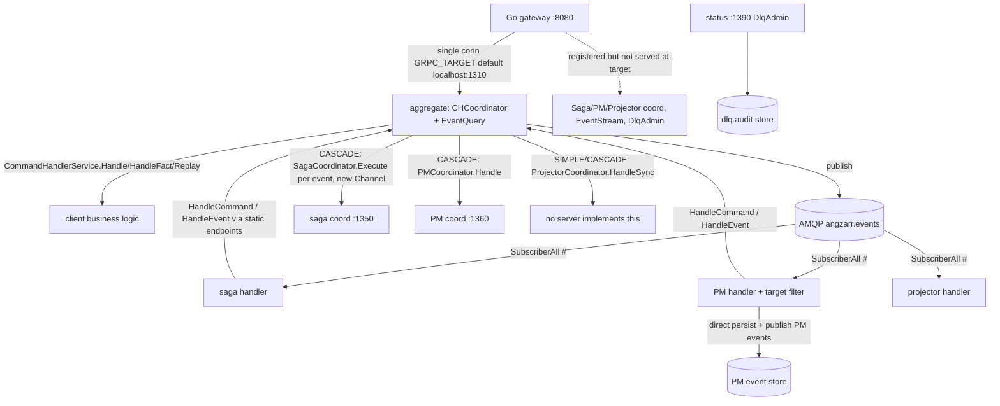

### 3.3 Advice wrappers
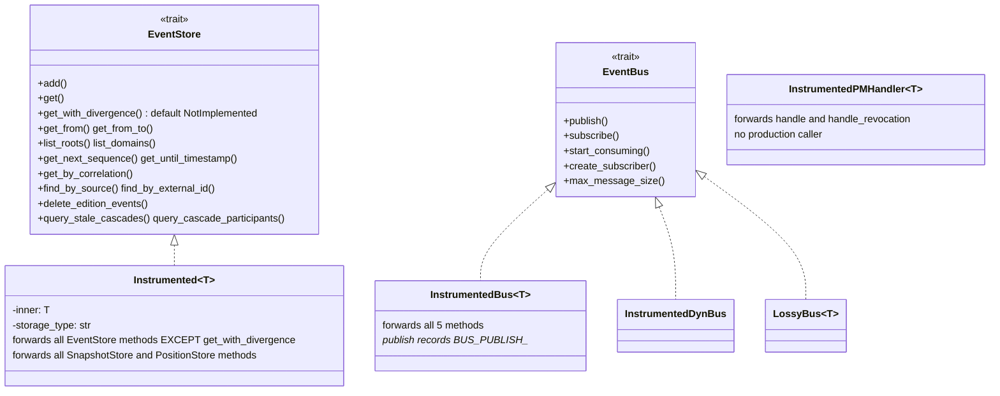

## 4. Sequence diagrams

### 4.1 Aggregate bootstrap
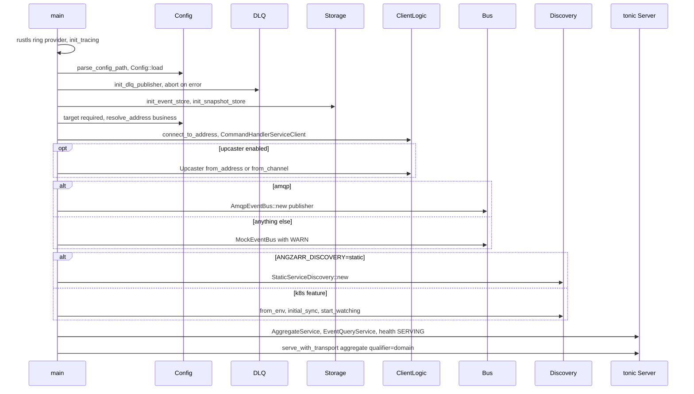
1. `src/bin/angzarr_aggregate.rs:79-81` crypto + tracing (`src/utils/bootstrap.rs:37`).
2. `:83-87` config: `config.yaml`, `--config`/`-c`, `ANGZARR_CONFIG`, `ANGZARR__*`, then unprefixed env (`src/config/mod.rs:124-155`).
3. `:96-111` DLQ hard-fail boot.
4. `:113-114` storage.
5. `:117-127` `target` required; address from `target.resolve_address(transport, "business")`.
6. `:133-135` client connect (retry inside `connect_to_address`, `src/transport/client.rs:32-66`).
7. `:140-155` upcaster (`UpcasterConfig::is_enabled` reads `ANGZARR_UPCASTER_ENABLED`, `src/services/upcaster.rs:64-69`).
8. `:157-171` bus: only AMQP, else Mock (CORE-SVC-05).
9. `:175-206` discovery; K8s failure falls back to empty static with WARN.
10. `:211-227` `SnapshotRepository::new` (read+write), `AggregateService::new(...).with_dlq_publisher`; `with_limits` never called.
11. `:232-257` health + two services, max message size; `serve_with_transport` (`src/transport/server.rs:31-122`) handles SIGINT/SIGTERM + telemetry flush.

### 4.2 Saga / PM bootstrap
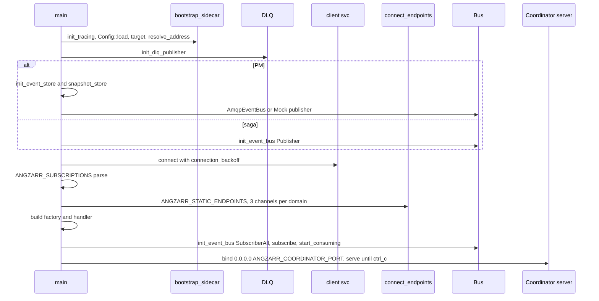
1. Saga `src/bin/angzarr_saga.rs:76-78`; PM `src/bin/angzarr_process_manager.rs:72` (no rustls install); `bootstrap_sidecar` `src/utils/sidecar.rs:39-69`.
2. DLQ: saga `:93-111`, PM `:87-105`.
3. PM storage `:108-109` and hand-rolled bus `:113-123`. Saga publisher `:129-131` (factory, with instrumentation).
4. Client connect: saga `:114-126`, PM `:126-138`.
5. Subscriptions: saga `:134-155` (optional, only logged), PM `:141-148` (required, passed to `with_targets` at `:207`).
6. Endpoints: saga `:164-173` (fetcher discarded), PM `:164-172`; `connect_endpoints` `src/utils/sidecar.rs:75-150`.
7. Saga factory `:174-181` (compensation handler `None`, default `SagaCompensationConfig`) and handler `:182-190`. PM hybrid fetcher `:177-183`, `pm_factory` `:187-194`, handler `:197-207` (builds a second factory internally, `src/handlers/core/process_manager.rs:137-144`).
8. Subscriber `SubscriberAll{queue}`: saga `:195-211`, PM `:212-228`.
9. Coordinator: saga default 1350 `:218-260`, PM default 1360 `:235-278`. Only `ctrl_c`, no transport config.

### 4.3 Projector / status / upcaster bootstrap
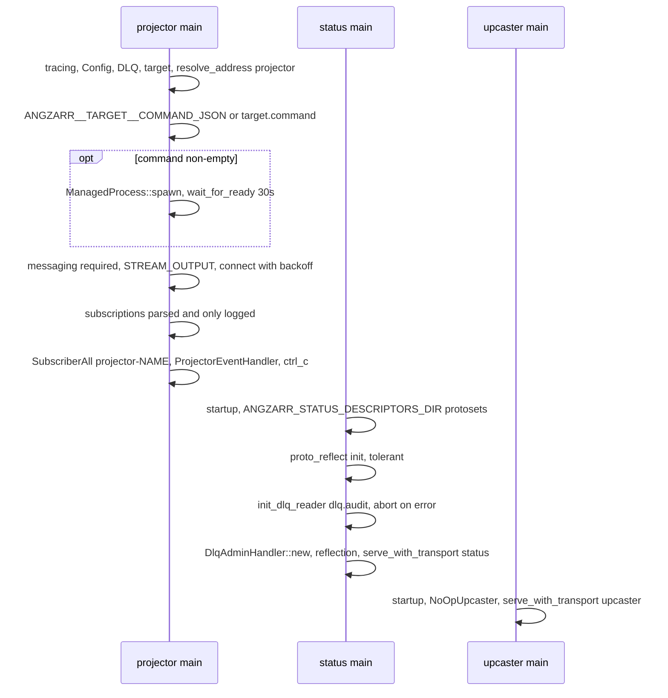
1. Projector `src/bin/angzarr_projector.rs:52-99`, command resolution `:102-111`, spawn `:114-134` (`extract_socket_names` `:229-248`), messaging `:136-146`, connect `:149-161`, subscriptions `:164-174` (never passed to handler), publisher `:177-187`, subscriber `:190-213`, wait `:217`.
2. Status `src/bin/angzarr_status.rs:40-118`.
3. Upcaster `src/bin/angzarr_upcaster.rs:57-76`.

### 4.4 K8s discovery
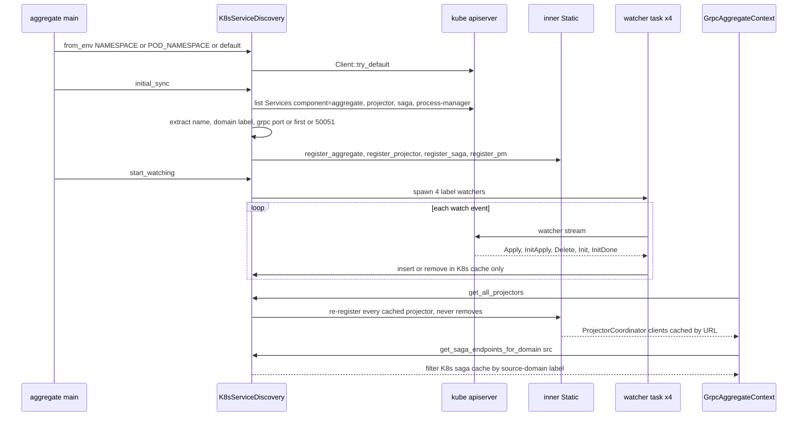
1. `src/discovery/k8s/mod.rs:236-242` namespace; `:193-213` client.
2. `:874-977` initial list per component; saga/PM without label are skipped with WARN (`:520-569`).
3. `:611-647` extraction: address `{name}.{ns}.svc.cluster.local`, port named `grpc` else first else 50051.
4. `:979-995` 4 watchers; loop `:244-314` with reconnect backoff that resets only after an observed event (`:147-156`).
5. `:571-605` event handling: `Init` does not clear the cache (CORE-SVC-08).
6. Lookups: aggregate/EQ/projector re-sync into `inner` then delegate (`:710-784`); saga/PM read K8s cache directly (`:843-864`).
7. Inner client cache: `src/discovery/static_discovery.rs:552-589`. It has no removal API (CORE-SVC-07).

### 4.5 HandleCommand
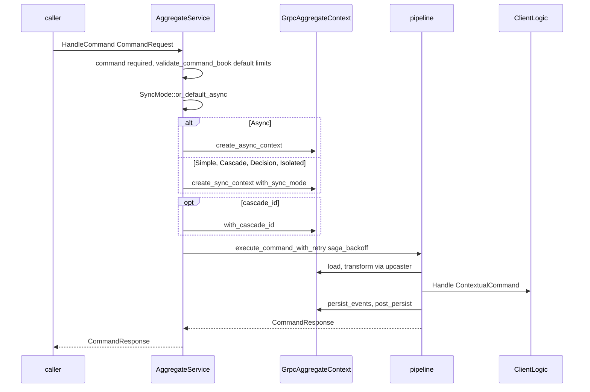
1. `src/services/aggregate.rs:184-205`.
2. Context builders `:132-177`: every context gets `dlq_publisher` and upcaster; none gets `component_name` or domain.
3. The pipeline is outside this scope (see core-runtime); `execute_command_with_retry` is called at `:201-202`.

### 4.6 HandleSyncSpeculative (as-of)
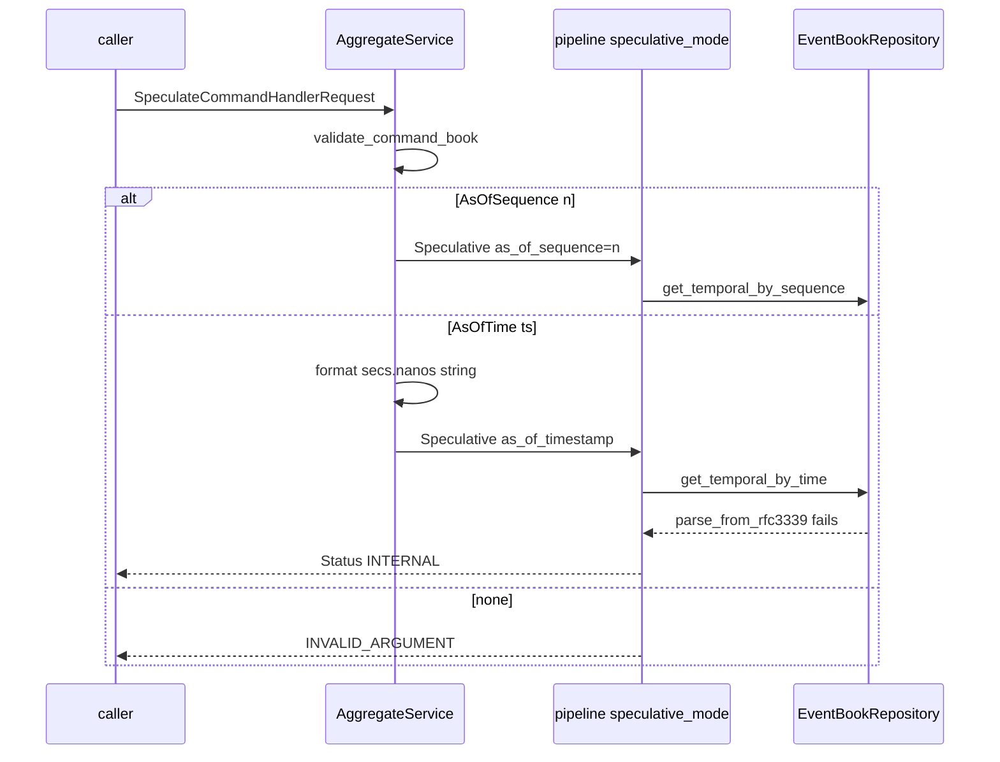
1. `src/services/aggregate.rs:209-249`; timestamp formatting `:226-229`.
2. `src/orchestration/aggregate/pipeline.rs:46-61` maps to `TemporalQuery`.
3. `src/orchestration/aggregate/grpc/mod.rs:466-470` calls `get_temporal_by_time`.
4. `src/repository/event_book/mod.rs:288-289` requires RFC3339 (CORE-SVC-01).
5. The context is always async (`:235`), so no fan-out happens. Nothing is persisted.

### 4.7 HandleEvent (fact) and HandleCompensation
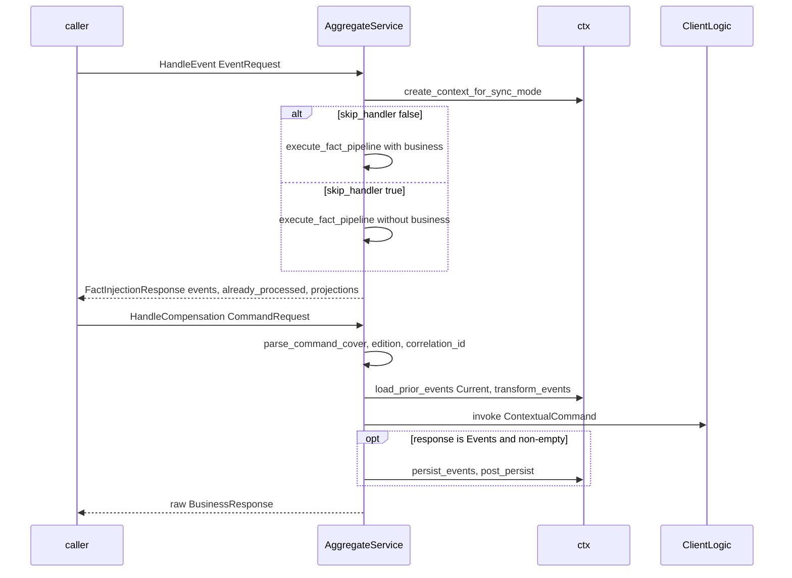
1. Fact: `src/services/aggregate.rs:327-355`. There is no `validate_command_book`-equivalent and no domain guard.
2. Compensation: `:257-309`. There is no validation, no retry, no cascade_id or merge strategy (see prior F12).

### 4.8 EventQuery RPCs
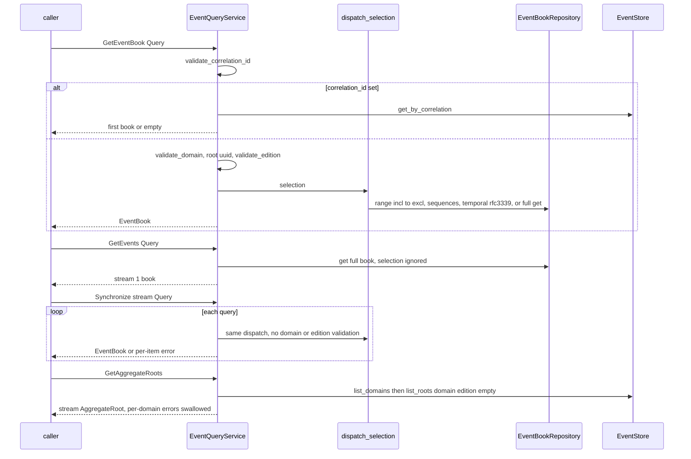
1. Constructed with snapshots disabled (`src/services/event_query/mod.rs:32-34`, used by the aggregate bin `:227`).
2. `dispatch_selection` `:83-126`, with range conversion at `:98`.
3. `get_event_book` `:134-205`; `get_events` `:207-276` (CORE-SVC-11); `synchronize` `:278-390`; `get_aggregate_roots` `:392-435`.

### 4.9 SagaCoord / PmCoord (CASCADE entry)
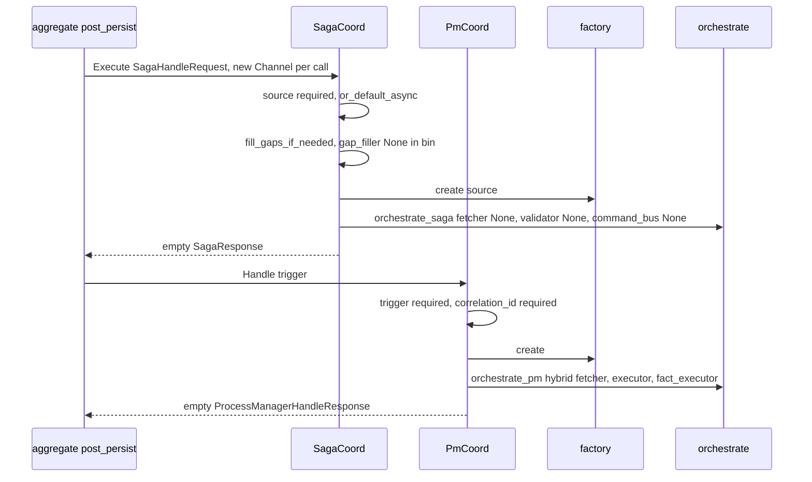
1. Saga `src/services/saga_coord.rs:124-172`; speculative `:178-220` (empty destination_sequences `:212`).
2. PM `src/services/pm_coord.rs:115-174`; speculative `:180-216`. This ignores `req.sync_mode`, while the saga equivalent honours it.
3. The caller is `src/orchestration/aggregate/grpc/mod.rs:235-348`.

### 4.10 Bus handlers (projector)
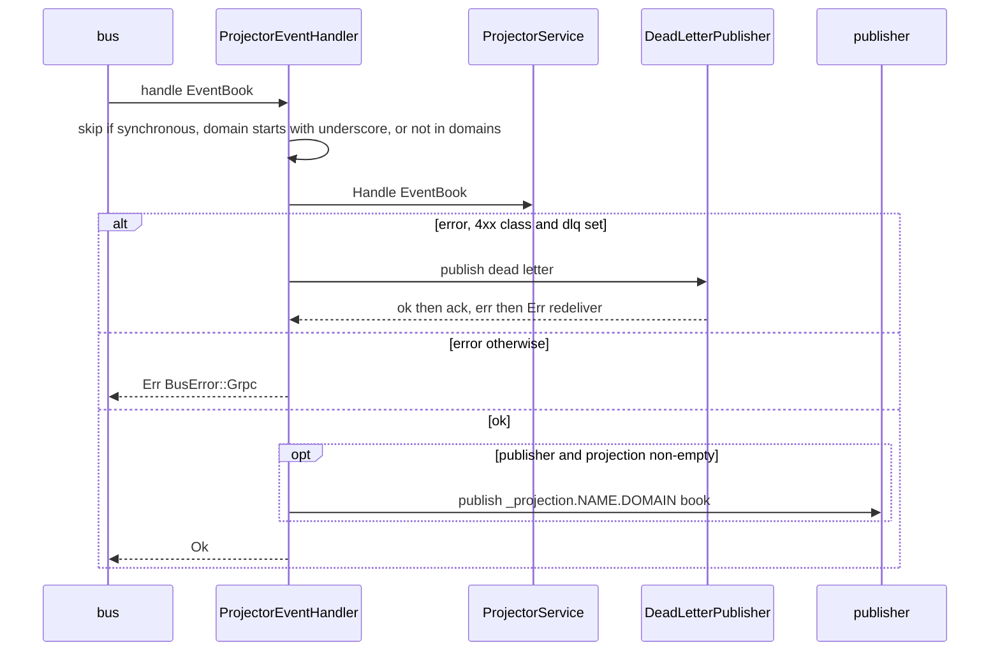
1. `src/handlers/core/projector.rs:101-221`; synthetic book `:229-279`.
2. Saga handler `src/handlers/core/saga.rs:144-199` (no filter; propagates by default).
3. PM handler `src/handlers/core/process_manager.rs:157-226` (target filter, skips when correlation_id is empty).

### 4.11 DLQ admin (status)
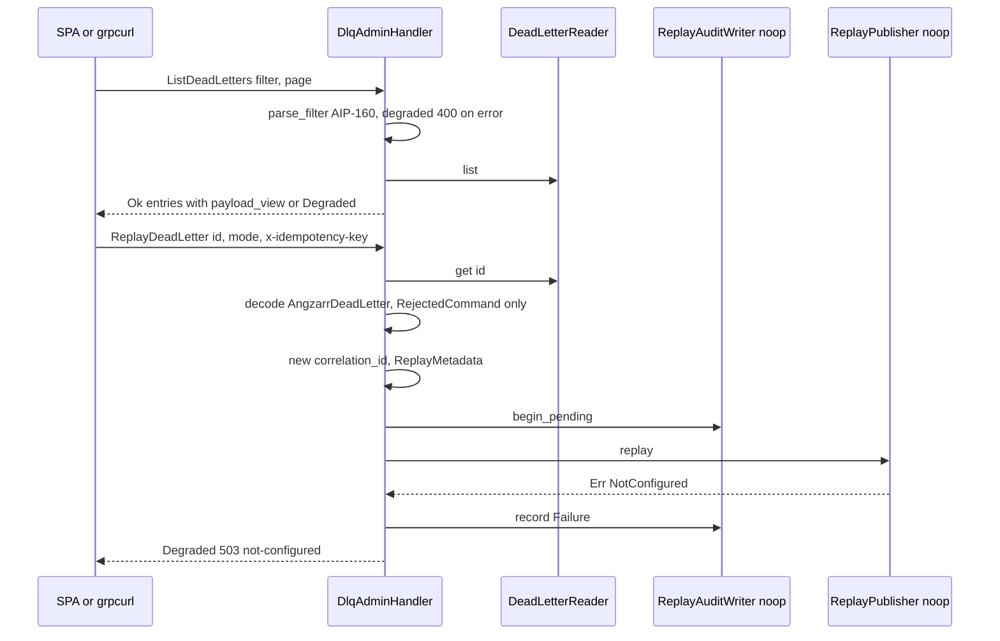
1. `src/status/handlers/dlq.rs:238-548` (supporting read). The bin wires `DlqAdminHandler::new(dlq_reader)` (`src/bin/angzarr_status.rs:106`), so replay and audit are the noop impls. `NoopReplayPublisher::replay` returns `Err(NotConfigured)` (`src/dlq/replay.rs:132-139`).

### 4.12 Gateway request flow
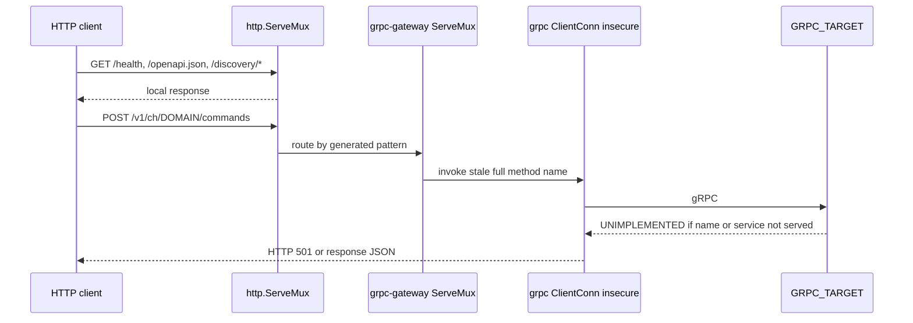
1. `gateway/main.go:42-48` picks the target (flag, then `GRPC_TARGET`, then `localhost:1310`); `:54` sets insecure credentials.
2. `:64-88` registers 7 handlers on the same conn.
3. `:91-104` builds the embedded swagger plus the descriptor patch (`gateway/discovery/service.go:20-69`).
4. `:110-140` mounts the routes; `:143-167` starts the server with a 10s SIGINT/SIGTERM shutdown.

## 5. Invariants & contracts
- SyncMode zero value and unknown ints resolve to Async (`src/services/aggregate.rs:170-177`, `saga_coord.rs:133`, `pm_coord.rs:124`). Speculative saga honours `sync_mode`; speculative PM does not.
- `EventRequest.skip_handler=false` (the zero value) routes facts through `HandleFact` (`src/services/aggregate.rs:342-346`).
- EventQuery `SequenceRange.upper` is inclusive and converted to the exclusive storage bound; `upper=None` means to latest (`event_query/mod.rs:98`). `RemoteEventSource` does the inverse (`gap_fill/filler.rs:355-358`).
- EventQuery unary: a non-empty correlation_id takes precedence over domain/root (`event_query/mod.rs:144-160`).
- EventQueryService never reads snapshots when built with `new` (`:32-34`) and never writes them (`:48-52`).
- Snapshot persistence always stamps `created_at` for temporal-by-time eligibility (`snapshot_handler/mod.rs:71-74`). The sequence is the last page, else the fallback, else 0 (`:22-29`).
- Target matching (`src/descriptor.rs:59-76`): empty types match everything. A dotted type requires exact equality with `type_url`. An undotted type matches the last `.`/`/` token.
- `parse_subscriptions` format: `d1:T1,T2;d2`. Whitespace is not trimmed (`descriptor.rs:103-117`).
- Default error propagation: saga, PM and aggregate bus handlers propagate Err (redeliver) (`handlers/core/saga.rs:81,127`, `process_manager.rs:78,152`, `aggregate.rs:66`). Projector propagates unless the DLQ-immediate path succeeds (`projector.rs:153-188`).
- Projection republish domain is `_projection.{projector}.{source_domain}`. Projectors skip `_`-prefixed domains when no domain filter is set (`projector.rs:115-119,238`).
- Stream slow-consumer policy: a full or closed channel removes the subscriber (`stream/mod.rs:55-85`).
- K8s labels: `app.kubernetes.io/component` ∈ {aggregate, projector, saga, process-manager}, `angzarr.io/domain`, `angzarr.io/source-domain` (saga, required), `angzarr.io/subscriptions` (PM, required, comma list) (`discovery/k8s/mod.rs:62-78`).
- Reflection is exposed only by status, with the public descriptor subset (`build.rs:80-84`, `src/bin/angzarr_status.rs:111`). Other bins intentionally omit reflection.
- The gRPC connect helpers (`src/grpc.rs:25`, `transport/client.rs:32`) retry up to 10 times with 100ms-5s jittered backoff.

## 6. Findings
| ID | Severity | Category | path:line | Finding | Evidence/how verified | Suggested direction |
|---|---|---|---|---|---|---|
| CORE-SVC-01 | high | correctness | src/services/aggregate.rs:226-229 | `HandleSyncSpeculative` with `AsOfTime` builds `format!("{}.{}", seconds, nanos)`. That string ends up in `EventBookRepository::get_temporal_by_time`, which calls `parse_from_rfc3339`. Every as-of-time speculative call therefore fails with INTERNAL "Failed to load temporal events". The nanos are not zero-padded either. EventQuery does this correctly via `timestamp_to_rfc3339` (`event_query/mod.rs:107`). | Read path: aggregate.rs:226 → pipeline.rs:53 → orchestration/aggregate/grpc/mod.rs:466-469 → repository/event_book/mod.rs:288-289. `rg -n 'AsOfTime' src tests --glob '*.rs'` shows no aggregate speculative AsOfTime test (only event_query/mod.test.rs:763). | Use `storage::helpers::timestamp_to_rfc3339` and return INVALID_ARGUMENT on a bad ts. Add a cucumber scenario for speculative as-of-time. |
| CORE-SVC-02 | high | correctness | src/advice/instrumented.rs:70-391 | `impl EventStore for Instrumented<T>` does not override `get_with_divergence`, so it falls back to the trait default, which returns `StorageError::NotImplemented` (`src/storage/event_store.rs:206-226`). The postgres, sqlite, bigtable, dynamo and redis factories all wrap their stores in `Instrumented` (`src/storage/postgres/mod.rs:46`, `sqlite/mod.rs:68`, `factory.rs:161…339`). The explicit-divergence path (`orchestration/aggregate/grpc/mod.rs:447-451`, new edition branch with no snapshot) therefore always fails in production, although postgres and sqlite implement it (`postgres/event_store.rs:329`, `sqlite/event_store.rs:504`). | Read the full Instrumented impl and the trait. `rg -n 'fn get_with_divergence' src` shows impls only in postgres/sqlite/mock/trait default. `rg divergence src/advice` returns 0. | Forward `get_with_divergence` (with a metric). Add a compile-time guard such as a test that exercises every trait method through `Instrumented<MockEventStore>`. |
| CORE-SVC-03 | high | build/contract | gateway/main.go:22,27; gateway/buf.gen.yaml:1-45 | The gateway imports `gen/angzarr_client/proto/angzarr` and `gen/angzarr/status`. The local (gitignored) gen tree was produced from an old `angzarr_client/proto/angzarr/*.proto` layout: its full method names are `/angzarr_client.proto.angzarr.CommandHandlerCoordinatorService/...` and `/angzarr_client.proto.angzarr.status.DlqAdminService/...`. Core serves `io.angzarr.v1.*` and `io.angzarr.status.v1.*` (`build.rs:47-58`), so a binary built from the local gen gets UNIMPLEMENTED on every RPC. A fresh `buf generate` (Containerfile) emits `paths=source_relative` output under `gen/io/angzarr/v1` and `gen/io/angzarr/status/v1`, which does not match the imports in main.go. The container build should therefore fail to compile. | Read `gen/angzarr_client/proto/angzarr/command_handler_grpc.pb.go:23,220` and `gen/angzarr/status/dlq_admin_grpc.pb.go:38`. `git check-ignore` confirms gen is ignored. `ls angzarr-project/proto` has no `angzarr_client` dir. Not built: the scratch copy for `buf generate` was denied. | Regenerate and update imports to `gen/io/angzarr/v1` and `gen/io/angzarr/status/v1`. Add a CI `just gateway-build` that runs `buf generate && go build`. |
| CORE-SVC-04 | high | design/contract | gateway/main.go:42-88 | All 7 handlers (CHCoordinator, EventQuery, EventStream, SagaCoord, ProjectorCoord, PMCoord, DlqAdmin) share one `ClientConn` to a single target (default `localhost:1310`, the aggregate). The aggregate serves only CHCoordinator and EventQuery (`src/bin/angzarr_aggregate.rs:238-255`). EventStream and ProjectorCoord are served nowhere, and DlqAdmin lives in angzarr-status. REST calls for `/v1/ch/{domain}/…` go to whichever single aggregate is targeted, regardless of `{domain}`. The comment at `:83-85` ("status pod serves DlqAdminService on that endpoint via the in-process command-handler binary") does not match the binaries. | Read main.go and all bins. `rg 'EventStreamServiceServer\|ProjectorCoordinatorServiceServer' src` shows no server registration. | Route per service/domain (per-service targets or a router), or register only the services the target serves. Front DlqAdmin with the status service. |
| CORE-SVC-05 | high | correctness/config | src/bin/angzarr_aggregate.rs:157-171; src/bin/angzarr_process_manager.rs:113-123; Cargo.toml:61-67 | Aggregate and PM build their publisher by hand: only `messaging_type=="amqp"` with feature `amqp` gives a real bus. Anything else (kafka, pubsub, sns-sqs, a missing `messaging` section) uses `MockEventBus` with a WARN. The `gcp-k8s`, `aws-k8s` and `gcp-cloudrun` profiles do not enable `amqp`, so these bins can never publish there. The bypass also skips `InstrumentedBus` (no `BUS_PUBLISH_*` from the main publisher; the factory wraps at `bus/amqp/mod.rs:74`) and never calls `wrap_with_offloading`. | Read both bins and `bus/factory.rs:41-52`. `rg 'MockEventBus::new\(\)' src/bin` shows 2 hits. Confirms prior F6. | Use `init_event_bus(messaging, Publisher)`. Fail boot if messaging is absent in these bins. |
| CORE-SVC-06 | med | correctness/perf | src/bin/angzarr_saga.rs:134-161,182-190; src/bin/angzarr_projector.rs:164-174,197-202; src/handlers/core/saga.rs:145-198 | Saga and projector compute subscriptions and only log them. `SagaEventHandler` has no target filter, and `ProjectorEventHandler::with_domains` is never called. The subscriber is `SubscriberAll`, which binds routing key `#` (`bus/amqp/mod.rs:142`). As a result every saga and projector receives, and makes a gRPC call for, every event on the bus, including its own downstream outputs and `_projection.*` books (sagas only; projectors skip `_`). | Read the bins and handlers. `rg 'any_target_matches\|matches_type' src/orchestration/saga src/orchestration/projector` returns 0. Confirms prior F7. | Pass `Vec<Target>` into saga/projector handlers (reuse `any_target_matches`), or bind per-domain queues. |
| CORE-SVC-07 | med | correctness | src/discovery/k8s/mod.rs:592-596,749-765,710-728; src/discovery/static_discovery.rs:121-589 | K8s Delete events remove the entry only from the K8s cache. The inner `StaticServiceDiscovery` has no removal API and is what `get_all_projectors`, `get_aggregate` and `get_event_query` read. Deleted or renamed projector Services therefore stay in the fan-out forever, and each sync call then fails with Unavailable, which turns into a failed SIMPLE/CASCADE command (`orchestration/aggregate/grpc/mod.rs:382-385`). Aggregates are keyed `{domain}-aggregate` in inner, so a deleted domain keeps resolving. | Read both files fully: `rg -n 'remove' src/discovery/static_discovery.rs` returns 0. | Make K8s the single source of truth: rebuild inner or query K8s caches directly, and evict clients on Delete. |
| CORE-SVC-08 | med | correctness | src/discovery/k8s/mod.rs:571-605,462-514 | On watcher (re)start, `Event::Init` only logs, and `InitApply` inserts without resetting the cache. Services deleted while the watch was disconnected are never evicted from the aggregate, projector, saga or PM caches. Saga and PM CASCADE routing reads these caches directly (`:843-864`). | Read the watch loop and handlers. `kube::runtime::watcher` re-lists with Init/InitApply/InitDone on every restart. | Buffer InitApply between Init and InitDone and swap the cache atomically (or use `reflector`). |
| CORE-SVC-09 | med | correctness/security | src/services/aggregate.rs:38-57,184-205,327-355; src/bin/angzarr_aggregate.rs:122,257 | `AggregateService` has no notion of its own domain: `target.domain` is used only for socket naming. HandleCommand, HandleEvent and HandleCompensation accept any `cover.domain`. With `skip_handler=true`, facts for arbitrary domains are persisted into this sidecar's store and published. The gateway (CORE-SVC-04) forwards every `/v1/ch/{domain}` to one aggregate. | Read the struct and handlers. `rg -n -i 'domain mismatch\|expected_domain\|self\.domain' src/orchestration/aggregate src/services/aggregate.rs` shows only the unused factory (`grpc/mod.rs:965,979`). | Pass the domain into AggregateService. Return INVALID_ARGUMENT or FAILED_PRECONDITION on mismatch (use wildcard only if intended). |
| CORE-SVC-10 | med | concurrency/perf | src/bin/angzarr_saga.rs:174-181; src/bin/angzarr_process_manager.rs:186-205; src/services/upcaster.rs:156-157 | The bins wrap single tonic clients in `tokio::Mutex`, and the locks are held across the RPC (`orchestration/saga/grpc/mod.rs:99-105`, `process_manager/grpc/mod.rs:208-212`). The saga factory is shared by the bus handler and SagaCoord, so CASCADE calls queue behind the async backlog. The upcaster lock serializes every aggregate load. | Read the bins, upcaster, and lock sites. Partially confirms prior F8. The deadlock claim was not verified. | Clone the tonic clients per call (a Channel is multiplexed) and drop the Mutexes. |
| CORE-SVC-11 | med | correctness/contract | src/services/event_query/mod.rs:207-276 | `GetEvents` (REST `GET /v1/query/{domain}/events/stream`) ignores `query.selection` (range, sequences, temporal) and skips `validate_edition`. It always streams the full current book, which diverges from `GetEventBook` and `Synchronize`, both of which go through `dispatch_selection`. | Read the handler: `event_book_repo.get` at `:261`. | Route through `dispatch_selection`. |
| CORE-SVC-12 | med | correctness (latent) | src/services/projector_coord.rs:187-244 | `ProjectorCoord::handle_speculative`, documented as "without side effects", calls `ProjectorServiceClient::handle`. That is the real, side-effecting projector RPC. `ProjectorService.HandleSpeculative` exists (`projector.proto:20`) and is never called. `handle_sync` calls only the first projector. This is latent because nothing serves ProjectorCoord. | Read the file and the proto. `rg 'handle_speculative' src/orchestration/projector` is out of scope (GrpcProjectorHandler may map the mode). | Call HandleSpeculative, or delete ProjectorCoord (see CORE-SVC-18). |
| CORE-SVC-13 | med | ops | src/bin/angzarr_status.rs:106; src/status/handlers/dlq.rs:66-72 | The status bin uses `DlqAdminHandler::new(reader)` with the noop ReplayPublisher and noop audit, so `ReplayDeadLetter` always returns Degraded 503 NotConfigured. `new_with_audit` is unused. The bin's module doc (`:3-7`) still says "Phase 0 skeleton … No DLQ admin". DeleteDeadLetter is exposed with no authn and no audit, and the gateway puts it on REST. | Read the bin, the handler (supporting), and `dlq/replay.rs:132-139`. `rg 'new_with_audit\|new_with_replay' src --glob '!*.test.rs'` shows only definitions. | Wire the replay publisher and audit writer from config, or hide the replay/delete routes. Update the doc. |
| CORE-SVC-14 | med | design/config | src/services/aggregate.rs:81,93; src/bin/angzarr_saga.rs:177; src/config/mod.rs:97-113 | `config.limits`, `saga_compensation`, `payload_offload`, `projectors`, `sagas`, `process_managers` and `client_logic` are deserialized and never consumed. `with_limits` is never called. | `rg -n 'limits' src --glob '!*.test.rs' \| grep -v ^src/config/` shows only validation::limits. `rg 'wrap_with_offloading' src` shows only definition/re-export. Confirms prior F15. | Wire or delete, and add a config-consumption test. |
| CORE-SVC-15 | med | ops | src/bin/angzarr_saga.rs:218-260; src/bin/angzarr_process_manager.rs:235-278; src/bin/angzarr_projector.rs:217 | Saga, PM and projector stop only on `ctrl_c`. SIGTERM (K8s) kills them without draining or `shutdown_telemetry`. The coordinators ignore `transport.type=uds` and `transport.tcp.port`. The projector has no gRPC health endpoint. | Read the bins and `utils/bootstrap.rs:222-248`. Confirms prior F18. | Use `serve_with_transport_and_shutdown` / `shutdown_signal()`, and add a health server to the projector. |
| CORE-SVC-16 | low | observability | src/advice/metrics.rs:107-122,162-182,255; src/advice/instrumented_handlers.rs:31-226 | `COMMAND_DURATION`, `COMMAND_TOTAL` and `namespace_attr` are never used. `PM_DURATION`, `SAGA_DURATION` and `PROJECTOR_DURATION` are emitted only by the `Instrumented*Handler` wrappers, which have no production caller. `InstrumentedPMHandler` has no outcome attribute. | A per-symbol `rg -l` loop over src (excluding tests and metrics.rs) shows 0 hits for COMMAND_*/namespace_attr and only instrumented_handlers.rs for the *_DURATION symbols. | Record command metrics in AggregateService and wrap handlers in the bins, or delete them. |
| CORE-SVC-17 | low | correctness | src/descriptor.rs:69-76,103-117 | A dotted subscription type must equal the full `type_url`. `examples.OrderCreated` does not match `type.googleapis.com/examples.OrderCreated` or `/examples.OrderCreated`, so PM events are silently filtered out. Whitespace in `ANGZARR_SUBSCRIPTIONS` is not trimmed. This goes against the lenient-accept (Postel) policy. | Read the code and descriptor.test.rs:77-89, which pins this behaviour. | Compare the dotted type against `type_url` with any `…/` prefix stripped, and trim tokens. |
| CORE-SVC-18 | low | dead-code | src/services/projector_coord.rs:35; src/handlers/projectors/stream/mod.rs:112,244; src/handlers/core/aggregate.rs:45,216; src/registration/mod.rs:12; src/client_traits.rs:113-151; src/services/saga_coord.rs:99; src/services/pm_coord.rs:89; src/services/gap_fill/*; src/discovery/static_discovery.rs:155; src/discovery/k8s/mod.rs:221; src/grpc.rs:25 | These are unwired in any bin: ProjectorCoord, StreamService/StreamEventHandler (which duplicates the `send_to_subscribers` logic at `:276-329` and takes a write lock per bus event), AggregateCommandHandler (malformed wrapped command is silently acked at `:279`), registration, client_traits, `SagaCoord/PmCoord::connect` (GapFiller unused; it would also error `MissingEdition` on books without an edition, `filler.rs:144`), `StaticServiceDiscovery::from_env` (which would panic inside tokio via `blocking_read/blocking_write`, `:166,192`, and downgrades `https://` to `http://`, `:607-621` + `mod.rs:66`), `is_watcher_healthy` (never polled, so H-27 is unwired), and `connect_channel` (only used by ProjectorCoord). | Per-symbol rg over src/ and tests/ (listed in the ledger notes) shows no non-test callers. | Delete, or wire each item with tests. |
| CORE-SVC-19 | low | correctness | src/services/event_query/mod.rs:278-390,392-435 | `Synchronize` skips `validate_domain` and `validate_edition`, which unary applies. `GetAggregateRoots` lists only main-edition roots (`list_roots(&domain, "")`). A per-domain error is only logged, so the stream ends OK with partial data. The garbled doc at `:77-82` is left over from an edit. | Read the file. | Add validation, and send an Err item on per-domain failure. |
| CORE-SVC-20 | low | correctness | src/services/upcaster.rs:132-160; src/orchestration/aggregate/grpc/mod.rs:743-756 | The upcaster response is trusted blindly: no check that the page count and sequences are preserved. The result becomes `prior` for next-sequence computation and for persist diffing (`grpc/mod.rs:486-496`). A buggy upcaster can therefore cause sequence conflicts or skipped pages. | Read both. | Validate that the sequences match the input 1:1, else return INTERNAL. |
| CORE-SVC-21 | low | gateway | gateway/discovery/descriptor.go:84-97; schema.go:112-119,26-37; openapi.go:52-54,71; service.go:19 | `shouldSkipPackage("angzarr.")` does not match the real framework package `io.angzarr.v1`, so framework types leak into the discovered set. Generated `$ref`s point to `#/definitions/<Short>`, but the definitions are stored as `discovered.<Short>` (and underscored full names on collision), so every ref dangles and enums are ref'd as messages. The docs mention "server reflection" and a `DISCOVERY_DESCRIPTOR_FILE` env var that does not exist (the code uses `DESCRIPTOR_PATH`). `http.Server` has no ReadHeaderTimeout and no auth. | Read all 5 non-test Go files. The tests only cover `angzarr.coordinator` (`descriptor_test.go:20`). | Skip `io.angzarr.`, emit refs with the same prefix as the definitions, and fix the docs. |
| CORE-SVC-22 | low | docs | src/bin/angzarr_aggregate.rs:18-20,37-41; src/bin/angzarr_saga.rs:7-27,33-39; src/bin/angzarr_process_manager.rs:7-15,33; src/handlers/core/saga.rs:44-48; src/services/event_query/mod.rs:36-39 | Doc drift. Aggregate/saga/PM document TARGET_COMMAND embedded mode, but only the projector spawns. Saga/PM describe a "Prepare" phase and "GetSubscriptions at startup" that do not exist (SagaService has only Handle; PM subscriptions come from env). `MESSAGING_TYPE` is documented. The `SagaEventHandler.propagate_errors` field doc says default false, but it is true. `with_options` says "true (default)" while `new` passes false. | Read. Confirms and extends prior F20. | Trim the docs to actual behaviour. |
| CORE-SVC-23 | low | correctness | src/bin/angzarr_projector.rs:117,229-248 | Embedded-mode `extract_socket_names` assumes a UDS path. With a TCP address (`localhost:50051`), the stem has no hyphen, so DOMAIN becomes `localhost:50051` in the child env. | Read. | Take the domain from `target.domain` and the service name from config. |
| CORE-SVC-24 | low | correctness | src/bin/angzarr_process_manager.rs:71-72 | The PM bin skips `rustls::crypto::ring::default_provider().install_default()`, which every other TLS-using bin calls, so AMQPS or TLS gRPC can panic. | Read. Confirms prior F25. | Add the install call. |

## 7. Open questions
- Where is the gateway deployed, and against which target? If it is meant to front each aggregate per domain, CORE-SVC-04/09 decide whether cross-domain REST calls silently corrupt stores.
- Is the local stale `gateway/gen` what the current images use? That depends on whether Skaffold builds via the Containerfile, which regenerates the code. CI evidence for the gateway build is needed.
- Do Helm charts put multiple Services per domain (for example the `*-aggregate-debug` NodePorts) with `app.kubernetes.io/component=aggregate` labels? If so, inner registration keyed `{domain}-aggregate` resolves last-writer-wins in HashMap order.
- Coordinator ports: the saga default is 1350 and the PM default is 1360; project memory says the chart must bind the saga to 1310. K8s discovery uses the Service `grpc` port. Is `ANGZARR_COORDINATOR_PORT` always set consistently?
- Should `HandleCompensation` and `HandleEvent` enforce `validate_command_book`-equivalent limits? See prior F12.
- `is_watcher_healthy` uses a 30s silence threshold, but kube watchers emit nothing on a quiet namespace without bookmarks. If this is ever wired to liveness, would it restart healthy pods?

## 8. Cross-repo interface surface
**Served by this repo's bins**
- aggregate (`serve_with_transport`, UDS `{base}/aggregate-{domain}.sock` or TCP `transport.tcp`): `io.angzarr.v1.CommandHandlerCoordinatorService` {HandleCommand, HandleEvent, HandleSyncSpeculative, HandleCompensation}, `io.angzarr.v1.EventQueryService` {GetEventBook, GetEvents, Synchronize, GetAggregateRoots}, `grpc.health.v1` (overall SERVING).
- saga: `SagaCoordinatorService` {Execute→empty SagaResponse, ExecuteSpeculative} on TCP `0.0.0.0:${ANGZARR_COORDINATOR_PORT:-1350}`.
- PM: `ProcessManagerCoordinatorService` {Handle→empty response, HandleSpeculative} on `0.0.0.0:${ANGZARR_COORDINATOR_PORT:-1360}`.
- status: `io.angzarr.status.v1.DlqAdminService` + reflection (public subset) + health.
- upcaster: `UpcasterService.Upcast` passthrough.
- gateway: REST from `google.api.http` annotations (`/v1/ch/{domain}/commands|events|commands/speculative|compensation`, `/v1/query/...`, `/v1/saga/...`, `/v1/pm/...`, `/v1/projector...`, `/v1/stream/{correlation_id}`, `/api/dlq...`), plus `/health`, `/openapi.json`, `/discovery/{info,types,collisions}`.

**Consumed from client-logic repos** (must be served by examples-*/client SDK sidecars): `CommandHandlerService` {Handle, HandleFact, Replay}, optional `UpcasterService` on the same channel, `SagaService.Handle`, `ProcessManagerService.Handle`, `ProjectorService.Handle` (HandleSpeculative is never called by core).

**Env vars read in scope**: `ANGZARR_CONFIG`, `--config/-c`, `ANGZARR_LOG`, `ANGZARR__*`, unprefixed legacy env (`config/mod.rs:150`), `ANGZARR_DISCOVERY`, `NAMESPACE`/`POD_NAMESPACE`, `ANGZARR_UPCASTER_ENABLED`, `ANGZARR_UPCASTER_ADDRESS`, `ANGZARR_SUBSCRIPTIONS`, `ANGZARR_STATIC_ENDPOINTS` (`domain=addr,…`), `ANGZARR_COORDINATOR_PORT`, `STREAM_OUTPUT`, `ANGZARR__TARGET__COMMAND_JSON`, `ANGZARR_STATUS_DESCRIPTORS_DIR`, `EVENT_QUERY_ADDRESS` (static discovery fallback), `ANGZARR_AGGREGATE_*`/`ANGZARR_PROJECTORS` (only via the unused `from_env`), OTel (`OTEL_*`, `POD_NAME`, `HOSTNAME`, `ENVIRONMENT`). Gateway: `GRPC_TARGET`, `DESCRIPTOR_PATH`, flags `-grpc-target -http-port -descriptor-file`.

**K8s labels consumed**: see §5. **Bus queues**: `saga-{domain}`, `process-manager-{domain}`, `projector-{domain}`, all SubscriberAll.

**Relies on from angzarr-project**: `proto/io/angzarr/v1/*.proto` (compiled in build.rs); cucumber features (not in scope).

## 9. Prior findings audit
Prior report: reviews/core-runtime.md. Only findings touching this scope are listed.

| Prior | Verdict | Evidence |
|---|---|---|
| F2 (SagaCoord OK on failed cascade; cascade_error_mode unread) | CONFIRMED (services part) | `saga_coord.rs:151-171` returns an empty OK. `rg cascade_error_mode src` shows only writers (`command/grpc:69`, `saga/grpc:86,239`, `aggregate/grpc:268,332`). The SagaRetryBuilder half is out of scope. |
| F4 (compensation dead in distributed mode) | CONFIRMED (bin part) | `angzarr_saga.rs:178` passes `None` as `compensation_handler` (signature `saga/grpc/mod.rs:280-282`). The PM half is out of scope. |
| F6 (AMQP-only publisher in aggregate/PM) | CONFIRMED, extended | CORE-SVC-05. The cloud profiles lack `amqp` (`Cargo.toml:63-67`), and InstrumentedBus/offload are bypassed. |
| F7 (subscriptions ignored saga/projector) | CONFIRMED | CORE-SVC-06. |
| F8 (Mutex-held RPCs serialize) | PARTIAL | Serialization is confirmed for the saga/PM/upcaster locks (CORE-SVC-10). The deadlock-on-cycle claim was not verified here. |
| F10 (ProjectorCoordinatorService unserved) | CONFIRMED | No `ProjectorCoordinatorServiceServer` registration in any bin. `grpc/mod.rs:357-385` calls HandleSync. |
| F12 (HandleCompensation bypasses pipeline) | CONFIRMED (in-scope parts) | `aggregate.rs:257-309`: no validate, no retry. The comment "speculative path" at `:299` is present. The idempotency details are out of scope. |
| F15 (config keys unused) | CONFIRMED | CORE-SVC-14. |
| F16 (destination-sequence phase inert) | CONFIRMED (bin/services part) | `angzarr_saga.rs:173` discards `_fetcher`; `:185` passes fetcher `None`; `saga_coord.rs:155` passes `None`. |
| F17 (correlation query ignores domain) | CONFIRMED | `event_query/mod.rs:144-160` returns the first book of `get_by_correlation` regardless of `cover.domain`. |
| F18 (ctrl_c only, bind ignores transport) | CONFIRMED | CORE-SVC-15. |
| F19 (static discovery empty) | CONFIRMED | `angzarr_aggregate.rs:178,197,204` uses `::new()`. `from_env` has no callers. Also latent panics and https downgrade (CORE-SVC-18). |
| F20 (doc drift) | CONFIRMED, extended | CORE-SVC-22. |
| F22 (dead public surface) | CONFIRMED for the in-scope items | CORE-SVC-18. The in-scope items checked by rg are ProjectorCoord, StreamService, AggregateCommandHandler, registration, client_traits, Instrumented*Handler, SagaCoord/PmCoord::connect, run_subscriber, connect_channel. `connect_channel` is also used by `tests/grpc_connection.rs`, so it is dead in production only. |
| F24 (DLQ component_name "aggregate") | CONFIRMED | `with_component_name` is called only at `grpc/mod.rs:965` (unused factory). `AggregateService::create_*_context` (`aggregate.rs:132-160`) never sets it. |
| F25 (PM bin no rustls) | CONFIRMED | CORE-SVC-24. |
| F23 (new Channel per CASCADE call) | out of scope (orchestration) | This scope only confirms the caller at `grpc/mod.rs:252-262,316-326`, read as a supporting read. |

## 10. Read Ledger
In-scope non-test files (49). All were read in full with the Read tool.

| File | Total lines | Lines read (ranges) | Notes |
|---|---|---|---|
| src/lib.rs | 47 | 1-47 | |
| src/grpc.rs | 65 | 1-65 | |
| src/client_traits.rs | 151 | 1-151 | |
| src/descriptor.rs | 123 | 1-123 | |
| build.rs | 155 | 1-155 | |
| src/bin/angzarr_aggregate.rs | 260 | 1-260 | |
| src/bin/angzarr_process_manager.rs | 281 | 1-281 | |
| src/bin/angzarr_projector.rs | 248 | 1-248 | |
| src/bin/angzarr_saga.rs | 263 | 1-263 | |
| src/bin/angzarr_status.rs | 121 | 1-121 | |
| src/bin/angzarr_upcaster.rs | 79 | 1-79 | |
| src/services/mod.rs | 90 | 1-90 | |
| src/services/aggregate.rs | 360 | 1-360 | dirty; `git diff` also reviewed |
| src/services/event_query/mod.rs | 440 | 1-440 | |
| src/services/gap_fill/mod.rs | 16 | 1-16 | |
| src/services/gap_fill/analysis.rs | 50 | 1-50 | |
| src/services/gap_fill/error.rs | 34 | 1-34 | |
| src/services/gap_fill/filler.rs | 373 | 1-373 | |
| src/services/pm_coord.rs | 221 | 1-221 | dirty; diff reviewed |
| src/services/saga_coord.rs | 225 | 1-225 | dirty; diff reviewed |
| src/services/projector_coord.rs | 249 | 1-249 | |
| src/services/snapshot_handler/mod.rs | 87 | 1-87 | |
| src/services/upcaster.rs | 169 | 1-169 | |
| src/handlers/mod.rs | 4 | 1-4 | |
| src/handlers/core/mod.rs | 14 | 1-14 | |
| src/handlers/core/aggregate.rs | 284 | 1-284 | |
| src/handlers/core/process_manager.rs | 230 | 1-230 | |
| src/handlers/core/projector.rs | 283 | 1-283 | |
| src/handlers/core/saga.rs | 203 | 1-203 | |
| src/handlers/projectors/mod.rs | 14 | 1-14 | |
| src/handlers/projectors/stream/mod.rs | 338 | 1-338 | |
| src/advice/mod.rs | 65 | 1-65 | |
| src/advice/instrumented.rs | 575 | 1-575 | |
| src/advice/instrumented_bus.rs | 190 | 1-190 | |
| src/advice/instrumented_handlers.rs | 230 | 1-230 | |
| src/advice/lossy.rs | 324 | 1-324 | |
| src/advice/metrics.rs | 319 | 1-319 | |
| src/registration/mod.rs | 134 | 1-134 | |
| src/discovery/mod.rs | 153 | 1-153 | |
| src/discovery/k8s/mod.rs | 1000 | 1-1000 | |
| src/discovery/static_discovery.rs | 634 | 1-634 | |
| crates/trivial-delegation/src/lib.rs | 41 | 1-41 | |
| crates/trivial-delegation/Cargo.toml | 14 | 1-14 | |
| gateway/main.go | 169 | 1-169 | |
| gateway/discovery/descriptor.go | 197 | 1-197 | |
| gateway/discovery/openapi.go | 136 | 1-136 | |
| gateway/discovery/schema.go | 157 | 1-157 | |
| gateway/discovery/service.go | 130 | 1-130 | |
| gateway/discovery/types.go | 47 | 1-47 | |

Supporting reads (out of scope; read to verify wiring claims):

| File | Total lines | Lines read | Notes |
|---|---|---|---|
| src/utils/sidecar.rs | 181 | 1-181 | bootstrap_sidecar / connect_endpoints |
| src/utils/bootstrap.rs | 315 | 1-315 | tracing, shutdown_signal, startup |
| src/transport/server.rs | 122 | 1-122 | serve_with_transport |
| src/config/mod.rs | 179 | 1-179 | env vars, Config::load |
| src/bus/factory.rs | 78 | 1-78 | init_event_bus |
| src/status/handlers/dlq.rs | 708 | 1-708 | DLQ admin sequence |
| src/storage/event_store.rs | ~370 | 150-364 | EventStore trait default methods |
| src/orchestration/aggregate/grpc/mod.rs | — | 200-394 | call_sync_* + discovery usage; plus rg/sed snippets 395-500, 743-773 |
| src/orchestration/saga/grpc/mod.rs | — | 85-124 | lock scope |
| src/orchestration/process_manager/grpc/mod.rs | — | 195-219 | lock scope |
| src/transport/client.rs | 275 | 68-127 (+ rg 32-66) | https/UDS handling |
| src/orchestration/aggregate/pipeline.rs, src/repository/event_book/mod.rs, src/storage/{postgres,sqlite}/event_store.rs, src/storage/helpers/mod.rs, src/bus/amqp/mod.rs, src/bus/traits.rs, src/bus/config.rs, src/dlq/replay.rs | — | rg/sed snippets only | used only to anchor cross-refs in findings 01/02/05/06/13/17 |

Test files: skimmed via grep only. `src/services/aggregate.test.rs` (test names and point_in_time: no AsOfTime test), `src/advice/instrumented.test.rs` (fn list: no divergence test), `src/descriptor.test.rs:55-110` (pins dotted-exact behaviour), `gateway/discovery/descriptor_test.go` (shouldSkipPackage cases). Other `*.test.rs`, `tests.rs` and `*_test.go` files in scope were not read. Generated code (`src/proto`, `gateway/gen`) was not read, except grep of `gateway/gen` method names for CORE-SVC-03.

Absence searches run (scope: `/home/babbitt/workspace/angzarr/core/main/src` unless noted): `rg 'AggregateCommandHandler|wrap_command_for_bus' --glob '*.rs' .`; `rg 'StreamService|StreamEventHandler|EventStreamServiceServer'`; `rg 'ProjectorCoordinatorServiceServer|ProjectorCoord::'`; `rg 'RepublishStrategy|registration::' src tests`; `rg 'Instrumented::new|InstrumentedBus::new|Instrumented(Saga|PM|Projector)Handler|LossyBus'`; `rg 'SagaCoord::connect|PmCoord::connect|run_subscriber|connect_channel|GatewayClient|SpeculativeClient|QueryClient|with_component_name' src tests`; `rg 'from_env\(\)|is_watcher_healthy'`; `rg 'new_with_audit|new_with_replay'`; `rg 'wrap_with_offloading|payload_offload|config\.limits'`; per-metric `rg -l` loop; `rg 'fn get_with_divergence'`; `rg 'AsOfTime' src tests`; `rg 'any_target_matches|matches_type' src/orchestration/saga src/orchestration/projector`; `rg 'cascade_error_mode'`; `rg -i 'domain mismatch|expected_domain|self\.domain' src/orchestration/aggregate src/services/aggregate.rs`.
