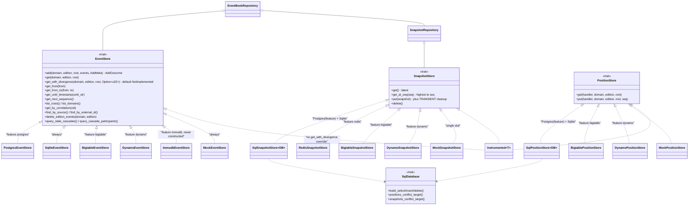
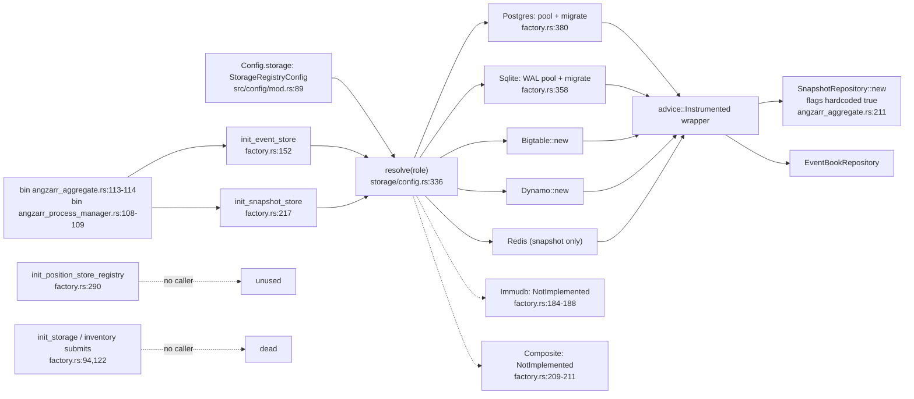
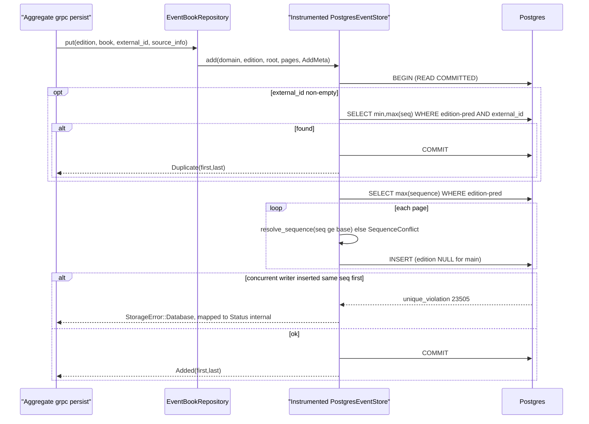
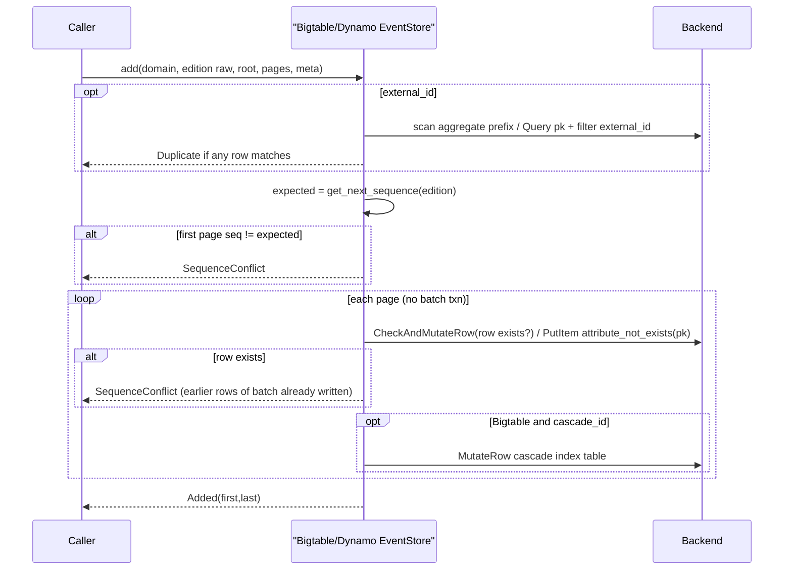
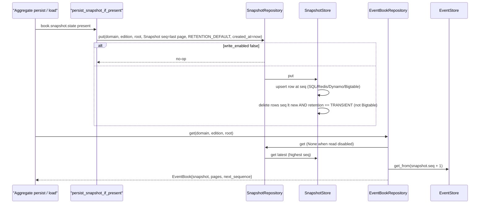
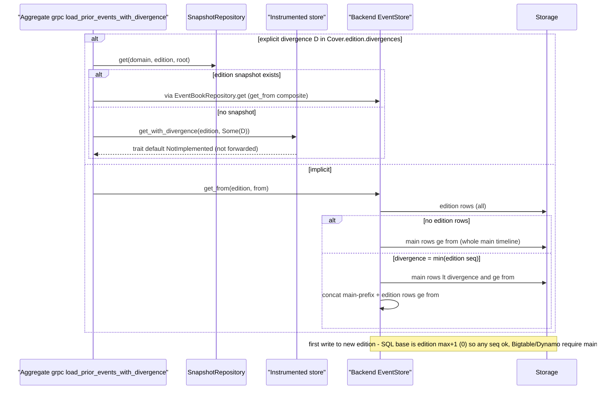
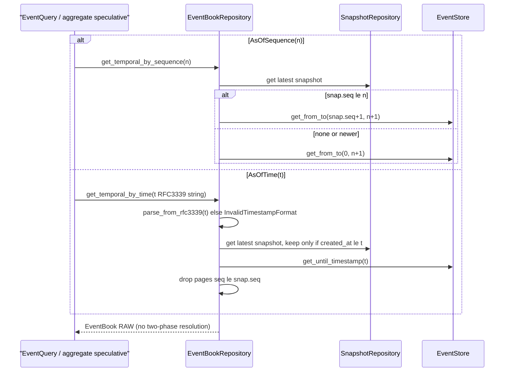
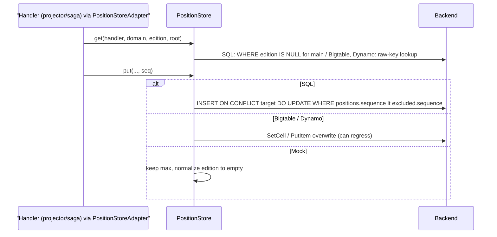

# core-storage
Repo: /home/babbitt/workspace/angzarr/core/main @ feat/snapshot-temporal-wiring d86b45be (working tree clean in scope: `git status --short -- src/storage src/repository migrations` → empty)

## 1. Summary
- Three storage traits (`EventStore` src/storage/event_store.rs:154, `SnapshotStore` src/storage/snapshot_store.rs:38, `PositionStore` src/storage/position_store.rs:26). Backends: Postgres and SQLite (always compiled), Bigtable, Dynamo, ImmuDB, Redis (snapshot only), Mock. The live construction path is the registry factory (`init_event_store`/`init_snapshot_store`, src/storage/factory.rs:152,217), called from src/bin/angzarr_aggregate.rs:113-114 and src/bin/angzarr_process_manager.rs:108-109. The inventory path (`init_storage`, factory.rs:94) has no caller.
- Only the SQL backends meet the edition and main-timeline contract. They store `""` and `"angzarr"` as SQL NULL (postgres/event_store.rs:45, sqlite/event_store.rs:48, sql/snapshot_store.rs:29). Bigtable, Dynamo and ImmuDB write the raw edition string, which the pipeline sets to `""` (src/orchestration/aggregate/parsing.rs:152). Their `get_from` reads the main timeline under `"angzarr"`. Aggregate replay through `EventBookRepository::get` therefore returns nothing on those three backends (HIGH).
- Explicit-divergence reads are broken in production. `Instrumented<T>` does not forward `get_with_divergence` (src/advice/instrumented.rs:71), so every factory-built store hits the trait default `NotImplemented` (event_store.rs:206-226) (HIGH).
- Composite (main-prefix + edition) reads exist only on `get`/`get_from` (plus `get_with_divergence` on SQL and Mock). `get_from_to` and `get_until_timestamp` are edition-only on every backend. As-of-sequence reads, as-of-time reads, EventQuery ranges and gap-fill on a named edition all drop the main-timeline prefix.
- Optimistic concurrency has no expected-version argument. SQL checks `seq >= max+1` inside a transaction and then relies on the unique key. A Postgres race surfaces as `StorageError::Database`, not `SequenceConflict`, so the aggregate returns Internal and the PM path DLQs. Bigtable and Dynamo use a per-row compare-and-set with no batch atomicity. ImmuDB uses BEGIN, PK and string matching.
- DynamoDB never paginates Query or Scan. Streams, dedup probes, snapshot cleanup and cascade scans silently truncate at 1 MB (HIGH).
- Snapshot retention: production always writes `RETENTION_DEFAULT` (src/services/snapshot_handler/mod.rs:66), and every store prunes only TRANSIENT. The proto says DEFAULT is "treated as TRANSIENT otherwise" (types.proto:124), so snapshots grow without bound. Bigtable never prunes, and its `get_at_seq` is exact-match only.
- Positions: SQL and Mock are monotonic (C-17). Bigtable and Dynamo overwrite. No production code constructs a PositionStore (NoOpPositionStore everywhere).
- The `editions` table (both dialects, 0001) and `schema::Editions` are dead: 0 references. Divergence metadata is never persisted and lives only in per-request `Cover.edition.divergences`. A brand-new implicit edition reads [] on Postgres; every other backend returns the full main timeline (stored-proc COALESCE to 0).
- Cascade queries: SQL and Mock use per-participant resolution (C-02). Bigtable and Dynamo still use the pre-C-02 global semantics. ImmuDB returns NotImplemented.

## 2. Component inventory
| Component | Kind | path:line | Responsibility | Depends on |
|---|---|---|---|---|
| EventStore | trait | src/storage/event_store.rs:154-354 | add/get/get_from/get_from_to/get_with_divergence(default NotImplemented 206)/get_until_timestamp/list/idempotency/cascade queries | proto EventPage |
| AddMeta / AddOutcome / SourceInfo / CascadeParticipant | types | event_store.rs:71, 87, 22, 358 | write metadata; Added vs Duplicate; saga provenance key (edition,domain,root,seq,component,command_index) | — |
| SnapshotStore | trait | src/storage/snapshot_store.rs:38-68 | get latest / get_at_seq (≤seq) / put (+TRANSIENT cleanup) / delete | proto Snapshot |
| PositionStore | trait | src/storage/position_store.rs:26-49 | per (handler,domain,edition,root) checkpoint | — |
| StorageError / errmsg | enum | src/storage/error.rs:29-88 | typed errors incl. SequenceConflict, MainTimelineProtected, NotImplemented, Backend | sqlx, prost, redis |
| DomainStorage | struct | src/storage/mod.rs:86-113 | bundle event+snapshot store; builds default-policy EventBookRepository | repository |
| StorageRegistryConfig / BackendConfig / StorageRole | config | src/storage/config.rs:240, 98, 132 | named backends + role refs; capability predicates (163-224); validate (282, never called), resolve (336) | — |
| StorageConfig (legacy flat) | config (dead) | src/storage/config.rs:12-46 | inventory-path config | — |
| init_event_store / init_snapshot_store / init_position_store_registry | fn (live) | src/storage/factory.rs:152, 217, 290 | resolve role → construct backend → wrap `advice::Instrumented`; sqlite_pool/postgres_pool run migrations (358, 380) | sqlx::migrate!, advice |
| init_storage / init_position_store / StoresBackend / PositionBackend | fn/inventory (dead) | src/storage/factory.rs:94, 122, 48, 74; submits in postgres/mod.rs:22,61, sqlite/mod.rs:25,78, bigtable/mod.rs:78,131, dynamo/mod.rs:72,119 | legacy self-registration | inventory |
| helpers | fns | src/storage/helpers/mod.rs:20 (is_main_timeline), 28 (fallback_edition, unused), 58 (assemble_event_books), 95 (resolve_sequence), 107 (parse_timestamp), 128, 169/189 (pct encode/decode) | shared edition/sequence/timestamp/row-key logic | orchestration::aggregate::DEFAULT_EDITION |
| schema (sea-query Iden) | enums | src/storage/schema.rs:10, 56, 79, 101 | Events/Snapshots/Positions/Editions idents (Editions unused) | sea-query |
| SqlDatabase | trait | src/storage/sql/query.rs:11-53 | dialect builder; NULL-aware conflict targets (SQLite override sql/mod.rs:78-114) | sea-query |
| SqlSnapshotStore<DB> (PostgresSnapshotStore / SqliteSnapshotStore) | generic impl via macro | src/storage/sql/snapshot_store.rs:59, 85-300, 304-306; aliases sql/mod.rs:45,121 | multi-row snapshots, upsert + TRANSIENT delete | sqlx |
| SqlPositionStore<DB> | generic impl via macro | src/storage/sql/position_store.rs:14, 40-156, 160-162 | monotonic upsert | sqlx |
| PostgresEventStore | impl (feature postgres) | src/storage/postgres/event_store.rs:67, 159-794 | txn append; stored-proc composite reads | PgPool, migrations/postgres |
| SqliteEventStore | impl (always) | src/storage/sqlite/event_store.rs:67, 431-982 | BEGIN IMMEDIATE append; Rust composite reads | SqlitePool, migrations/sqlite |
| BigtableEventStore / SnapshotStore / PositionStore | impl (feature bigtable) | src/storage/bigtable/event_store.rs:71, 760; snapshot_store.rs:32, 135; position_store.rs:28, 89 | row-key stores; CheckAndMutate append; cascade index table | bigtable_rs |
| DynamoEventStore / SnapshotStore / PositionStore | impl (feature dynamo) | src/storage/dynamo/event_store.rs:38, 253; snapshot_store.rs:20, 59; position_store.rs:15, 57 | pk/sk items; conditional put append; GSIs correlation-index / cascade-index | aws-sdk-dynamodb |
| ImmudbEventStore | impl (feature immudb; unreachable) | src/storage/immudb/event_store.rs:73, 335-845; schema immudb/mod.rs:92-130 | pgwire simple-query append/read | sqlx pg raw_sql |
| RedisSnapshotStore | impl (feature redis) | src/storage/redis/snapshot_store.rs:68, 135-242 | hash per aggregate, field = padded seq | redis ConnectionManager |
| MockEventStore / MockSnapshotStore / MockPositionStore | impl (always compiled, test doubles) | src/storage/mock/event_store.rs:30, 60; snapshot_store.rs:14, 34; position_store.rs:15, 50 | in-memory | tokio RwLock |
| EventBookRepository | struct | src/repository/event_book/mod.rs:103-525 | snapshot+events load (143), resolved range reads (195, 431), RAW range (220), temporal by time (281) / seq (356), put (501) | EventStore, SnapshotRepository, orchestration::aggregate::transform_for_two_phase |
| SnapshotRepository | struct | src/repository/snapshot/mod.rs:21-95 | read/write enable gate over SnapshotStore | SnapshotStore |
| Postgres migrations 0001-0012 | SQL | migrations/postgres/ | tables, stored procs (0002, rewritten 0007, delete proc 0010), NULLS NOT DISTINCT (0007, 0009), idempotency/source/cascade/ext cols | PG ≥15 (NULLS NOT DISTINCT) |
| SQLite migrations 0001-0010 | SQL | migrations/sqlite/ | same columns; nullable edition rebuild (0006); COALESCE unique indexes (0009) | — |
| status migrations | SQL | migrations/status/{postgres,sqlite}/0001-0002 | dlq_replay_audit + idempotency_key UNIQUE | used by src/dlq/publishers/audit_writer.rs:225,343 |

## 3. Architecture diagrams

### 3a. Traits → implementations (feature flags)

### 3b. Construction path (live vs dead)

### 3c. Backend × capability
| Backend | Append | Concurrency check | Snapshots | Editions (composite read) | Divergence (explicit) | Retention | Time queries | Positions |
|---|---|---|---|---|---|---|---|---|
| Postgres (feature `postgres`) | txn per batch, postgres/event_store.rs:161-323 | `seq>=max+1` (214-231, helpers/mod.rs:95-104) + UNIQUE NULLS NOT DISTINCT (0007:29-31); race → `Database` err | SqlSnapshotStore (sql/snapshot_store.rs:88-298; alias sql/mod.rs:45) | stored proc `get_edition_events_from` (postgres/event_store.rs:97-127; 0007:95-142); get_from_to/until edition-only (366-428); new implicit edition → [] (CORE-STORAGE-26) | `get_with_divergence` override (329-346), unreachable via Instrumented | TRANSIENT only, non-txn (sql/snapshot_store.rs:243-263) | `created_at <= until` TEXT (399-428) | SqlPositionStore monotonic (sql/position_store.rs:85-153) |
| SQLite (always) | BEGIN IMMEDIATE (sqlite/event_store.rs:433-498) | `seq>=max+1` in locked txn (256-274, 289) + uq_events_main (sqlite 0009:75-76) | SqlSnapshotStore (alias sql/mod.rs:121) | Rust composite (184-237); get_from_to/until edition-only (545-607) | override (504-523), unreachable via Instrumented | same as PG | TEXT compare (578-607) | monotonic, COALESCE target (sql/mod.rs:78-94) |
| Bigtable (feature `bigtable`) | per-row CheckAndMutate (bigtable/event_store.rs:817-857), non-atomic batch | `first==next` (800-809) + row-exists predicate (837-857) | BigtableSnapshotStore (snapshot_store.rs:135-351) | composite on get_from only (576-608, 897-911); reads main as `"angzarr"` | none → trait default NotImplemented | none (put 242-282); get_at_seq exact (200-240) | in-app filter over non-composite `get` (1079-1103) | overwrite, non-monotonic (position_store.rs:142-187) |
| Dynamo (feature `dynamo`) | per-item conditional PutItem (dynamo/event_store.rs:335-475), non-atomic batch, no pagination | `first==next` (321-330) + `attribute_not_exists(pk)` (444-474) | DynamoSnapshotStore (snapshot_store.rs:59-231) | composite on get_from only (218-250, 517-531); main as `"angzarr"` | none → NotImplemented | TRANSIENT only, unpaginated (154-189) | in-app filter over `get` (700-724) | overwrite (position_store.rs:95-129) |
| ImmuDB (feature `immudb`; not constructible) | BEGIN + per-row INSERT (immudb/event_store.rs:399-528) | `seq>=max+1` (375-379, 406) + PK, string-matched → SequenceConflict (511-521) | none by design (immudb/mod.rs:14-39) | composite (200-248); main as `"angzarr"` | none → NotImplemented | n/a | TIMESTAMP col vs string, seconds precision (594-629, 419-427) | none |
| Redis (feature `redis`) | n/a | n/a | hash per root (redis/snapshot_store.rs:135-242); get_at_seq ≤ (148-177) | n/a | n/a | TRANSIENT only, non-atomic (187-221) | n/a | none |
| Mock (always) | in-memory (mock/event_store.rs:61-174) | rejects existing/in-batch dup only (129-153) | single-slot (mock/snapshot_store.rs:34-63), get_at_seq ignores seq | get_from NOT composite (255-267); get_with_divergence composite (196-253) | override (196-253) | none | in-app filter (284-306) | monotonic, sentinel-normalized (mock/position_store.rs:33-84) |

Delete-edition guard: SQL yes (sqlite 848; postgres 587 + proc 0010:28). Bigtable, Dynamo and Mock have no guard (1197; 800; 382). ImmuDB returns NotImplemented (725).

Cascade queries: SQL and Mock use per-participant logic (sqlite 866-981; postgres 690-793; mock 466-589). Bigtable and Dynamo use the global pre-C-02 logic (bigtable 1381-1533; dynamo 999-1130). ImmuDB returns NotImplemented (827-844).

## 4. Sequence diagrams

### 4a. Append with optimistic concurrency — SQL family (Postgres; SQLite deltas noted)

1. `EventBookRepository::put` extracts the cover and forwards `ext` (src/repository/event_book/mod.rs:501-524).
2. `add` returns early on an empty batch (postgres/event_store.rs:172-177), acquires a connection and begins a transaction (183-184).
3. The external_id probe returns `Duplicate` inside the transaction (186-211).
4. Base = `max(sequence)+1` for the edition predicate (214-232). The `edition_predicate` NULL mapping is at 28-34.
5. Per page: `resolve_sequence` (src/storage/helpers/mod.rs:95-104) rejects only `seq < base`. Gaps and non-contiguous batches pass. INSERT with `edition_to_db` → NULL for main (257-314).
6. The race fence is the `UNIQUE NULLS NOT DISTINCT (domain, edition, root, sequence)` constraint (migrations/postgres/0007_nullable_edition.sql:29-31). No code maps the unique violation (`rg -n 'is_unique_violation|23505' src/storage` → 0 hits). It surfaces as `StorageError::Database` (error.rs:50), then `Status::internal` (src/orchestration/aggregate/grpc/mod.rs:550-557), or PM `Rejected` (src/orchestration/process_manager/grpc/mod.rs:89-104).
7. SQLite: `BEGIN IMMEDIATE` takes the write lock up front (sqlite/event_store.rs:456-457), so a stale writer reads the new max and gets `SequenceConflict` from `resolve_sequence`. The final fence is `uq_events_main` on `COALESCE(edition,'')` (migrations/sqlite/0009_main_timeline_uniqueness.sql:75-76). If the idempotency probe errors, `?` returns at 461-462 without ROLLBACK.

### 4b. Append — Bigtable / Dynamo (per-row CAS) and ImmuDB

1. Bigtable dedup does a prefix scan and in-app filter (bigtable/event_store.rs:788-798, 733-757). Dynamo uses a Query with FilterExpression and no pagination (dynamo/event_store.rs:284-319).
2. Only the first sequence is checked for continuity: `first_seq != expected_next` (bigtable 800-809; dynamo 321-330). For a named edition with no rows, `expected_next` is main max+1 (bigtable 1053-1077; dynamo 639-698), so a branch at an explicit divergence D < head always conflicts.
3. Per-row CAS: Bigtable `CheckAndMutateRowRequest` with a family predicate and `false_mutations` (bigtable 837-857). Dynamo `condition_expression("attribute_not_exists(pk)")`, with ConditionalCheckFailed mapped to `SequenceConflict` (dynamo 444-474). Nothing makes the batch atomic, so a mid-batch failure leaves a partial write.
4. The Bigtable cascade-index dual write happens after the event row (bigtable 859-877). If it fails, the caller gets an error even though the event is persisted.
5. ImmuDB: the external_id probe and base max are read outside the transaction (immudb/event_store.rs:362-379). Then raw `BEGIN` (399-401), per-row string-built INSERT (478-496) and COMMIT (527-528). A PK error is detected by substring match and mapped to `SequenceConflict` (511-521).

### 4c. Snapshot write / read / retention

1. The producer is `persist_snapshot_if_present`. It uses sequence = last page seq, falling back to `fallback_sequence` and then 0, with retention always `RetentionDefault` (src/services/snapshot_handler/mod.rs:22-29, 57-81).
2. `SnapshotRepository::put` is gated by `write_enabled` (src/repository/snapshot/mod.rs:74-85). The bins always build `SnapshotRepository::new`, so the flags are always true (src/bin/angzarr_aggregate.rs:211). `storage.snapshots_enable` is never read (`rg -n snapshots_enable src | grep -v ^src/storage/` → 0 hits).
3. SQL put runs an upsert (sql/snapshot_store.rs:199-241) and then a separate DELETE of TRANSIENT rows with seq < new (243-263). There is no transaction, although the trait doc says "atomically" (snapshot_store.rs:61-64).
4. Redis: HSET, then HVALS, then HDEL of TRANSIENT (redis/snapshot_store.rs:179-230). Dynamo: PutItem, then an unpaginated Query of seq < new, then DeleteItem of TRANSIENT (dynamo/snapshot_store.rs:127-193). Bigtable: MutateRow only, with no cleanup (bigtable/snapshot_store.rs:242-282). Mock: a single slot that overwrites (mock/snapshot_store.rs:41-45).
5. Read: `EventBookRepository::get` loads the snapshot, then `get_from(seq+1)` (src/repository/event_book/mod.rs:143-178). `get_at_seq`: SQL uses `seq <= s ORDER BY DESC LIMIT 1` (sql/snapshot_store.rs:134-178). Redis filters in-app (148-177). Dynamo uses `seq <= :seq` descending with limit 1 (91-125). Bigtable does an exact row lookup (bigtable/snapshot_store.rs:200-240). Mock ignores `seq` (mock/snapshot_store.rs:47-57).

### 4d. Edition create / divergence / read-merge of main timeline

1. Explicit divergence comes only from the request (`extract_explicit_divergence`, src/orchestration/aggregate/parsing.rs:169-180). It is never persisted: the `editions` table (migrations/postgres/0001_initial_schema.sql:43-49, sqlite 0001:43-49) and `schema::Editions` (schema.rs:101) have 0 references (`rg -n 'Editions::' src` and `rg -n -i 'from editions|into editions' src` → 0).
2. The grpc path probes the edition snapshot, then calls `event_store.get_with_divergence` (src/orchestration/aggregate/grpc/mod.rs:420-451). `Instrumented`'s EventStore impl (src/advice/instrumented.rs:71-392) has no `get_with_divergence` (`rg -n get_with_divergence src/advice` → 0 hits), so the default at src/storage/event_store.rs:206-226 returns `NotImplemented`.
3. Implicit composite read:
   - Postgres calls the stored proc `get_edition_events_from` (postgres/event_store.rs:97-127; migrations/postgres/0007_nullable_edition.sql:95-142: `COALESCE(p_explicit_divergence, MIN(edition seq), 0)`).
   - SQLite does it in Rust (sqlite/event_store.rs:184-237).
   - Bigtable reads main rows under `"angzarr"` (bigtable/event_store.rs:576-608, 517-573); Dynamo does the same (dynamo/event_store.rs:218-250, 178-215); ImmuDB also (immudb/event_store.rs:200-248, 170-197).
   - Mock probes both `"angzarr"` and `""` (mock/event_store.rs:229-239).
4. Next sequence on an empty named edition falls back to main max+1 on every backend: sqlite 644-700, postgres 465-520, bigtable 1053-1077, dynamo 639-698, mock 325-355. ImmuDB has no fallback and returns edition max+1 or 0 (immudb 677-683).
5. The delete-edition guard exists in SQL only (sqlite 848-854; postgres 587-593 plus proc migrations/postgres/0010:28-30). Bigtable (1197-1271), Dynamo (800-849) and Mock (382-397) have no guard. ImmuDB returns NotImplemented (725-731). There is no production caller (`rg -n delete_edition_events src | grep -v ^src/storage/` → only advice/instrumented.rs and tests).

### 4e. As-of-sequence and as-of-time reads

1. As-of-sequence: src/repository/event_book/mod.rs:356-408. It uses only the latest snapshot and ignores `get_at_seq`. `get_from_to` is edition-only (non-composite) on SQL (sqlite 545-576, postgres 366-397), Bigtable (913-976), Dynamo (533-577), Mock (269-282) and ImmuDB (557-592).
2. As-of-time: event_book/mod.rs:281-337. The snapshot is kept only if `created_at <= until` (291-301).
   - SQL `get_until_timestamp` does a lexicographic TEXT compare `created_at <= until` (sqlite 578-607; postgres 399-428; column TEXT in migrations/postgres/0001:8).
   - Bigtable, Dynamo and Mock parse RFC3339 and filter over `get()` (bigtable 1079-1103; dynamo 700-724; mock 284-306).
   - ImmuDB compares a TIMESTAMP column with the raw string (immudb 594-629). Its created_at is truncated to seconds at write (419-427).
   - All of these are edition-only.
3. Callers: EventQuery converts `Timestamp` → `timestamp_to_rfc3339` (src/services/event_query/mod.rs:106-110), which is correct. Speculate formats `"{secs}.{nanos}"` (src/services/aggregate.rs:227), which always fails the RFC3339 parse at event_book/mod.rs:288-289.
4. Both temporal reads are RAW with respect to two-phase visibility (documented at event_book/mod.rs:272-280, 351-354).

### 4f. Position store

1. SQL get: `edition_predicate_expr` gives IS NULL for main (sql/position_store.rs:44-83).
2. SQL put: monotonic upsert. The conflict target is the PK columns on Postgres (query.rs:34-41, backed by migrations/postgres/0009:24-26). On SQLite it is the COALESCE expression (sql/mod.rs:78-94, backed by migrations/sqlite/0009:69-70). See sql/position_store.rs:85-153.
3. Bigtable: key `{handler}#{domain}#{edition}#{hex root}` with overwrite and no guard (bigtable/position_store.rs:76-86, 142-187). Dynamo is the same (dynamo/position_store.rs:45-54, 95-129).
4. Mock: `make_key` normalizes both main sentinels to `""`, and put keeps the max (mock/position_store.rs:33-40, 62-84).
5. There is no production use. `PositionStoreAdapter::new` has 0 call sites (`rg -n 'PositionStoreAdapter::new' src` → 0). Coordinators use `NoOpPositionStore` (src/services/saga_coord.rs:28; src/services/mod.rs:31,85).

## 5. Invariants & contracts

**Event key.** `(domain, edition, root, sequence)` is unique:
- PG: `UNIQUE NULLS NOT DISTINCT` (0007:29-31). This requires PG ≥ 15.
- SQLite: PK plus `uq_events_main` on `COALESCE(edition,'')` (0009:75-76).
- Bigtable row key `{pct(domain)}#{pct(edition)}#{root}#{seq:010}` (bigtable/event_store.rs:150-159).
- Dynamo pk `{pct(domain)}#{pct(edition)}#{root}` + sk `seq` (dynamo/event_store.rs:67-74).
- ImmuDB `PRIMARY KEY(domain, edition, root, sequence)` with `edition NOT NULL` (immudb/mod.rs:103-120).

**Edition-name conventions.** The API treats `""` and `"angzarr"` as the main timeline (helpers/mod.rs:20-22). The pipeline emits `""` (parsing.rs:152, 186).

| Backend / store | Main timeline on write | Main timeline on read | Returned to API | Source edition (saga key) |
|---|---|---|---|---|
| Postgres events | NULL (postgres/event_store.rs:45-51, 293) | `IS NULL` (28-34, 139); procs `p_edition IS NULL OR ''` (0007:65,111) | `""` (62-64, 560, 768) | NULL for main (242) |
| SQLite events | NULL (sqlite/event_store.rs:48-57, 305) | `IS NULL` (36-42, 145) | `""` (62-64, 739, 956) | NULL for main (306) |
| SQL snapshots / positions | NULL (sql/snapshot_store.rs:29-40, 202-203; sql/position_store.rs:111-112) | `IS NULL` (sql/snapshot_store.rs:44-53) | n/a | n/a |
| PG stored procs (0002) | `'angzarr'` literal (0002:34,52) superseded by 0007 | 0007 procs no longer accept `'angzarr'` as main (0007:65,111); delete proc rejects NULL/''/'angzarr' (0010:28) | — | — |
| Bigtable events | raw string in row key (`""` gives `d##root#seq`) (bigtable/event_store.rs:819) | `get_from`/composite/fallback read `"angzarr"` (904-907, 528, 587, 1063-1067); `get`/`get_from_to`/`list_roots`/`find_*` read raw (894, 931, 980-985, 1290) | raw from key (1149-1154) | raw (284-315) |
| Bigtable snapshots / positions | raw (snapshot_store.rs:79-88; position_store.rs:76-86) | raw | — | — |
| Dynamo events | raw in pk (dynamo/event_store.rs:273) | `get_from`/composite/fallback `"angzarr"` (524-527, 189, 229, 667-671); others raw (491, 550, 583-587) | raw from pk (751) | raw (387-412) |
| Dynamo snapshots / positions | raw (snapshot_store.rs:49-56; position_store.rs:45-54) | raw | — | — |
| ImmuDB events | raw, NOT NULL column (immudb/event_store.rs:481; mod.rs:106) | `get_from`/`get_from_to`/`get_until_timestamp` map main to `"angzarr"` (549-551, 570-574, 608-612); `get_next_sequence`/`list_roots`/`find_*` raw (680, 691, 751, 794) | raw (658) | raw (460) |
| Redis snapshots | raw in key `prefix:domain:edition:root:snapshots` (redis/snapshot_store.rs:95-100) | raw | — | — |
| Mock events | raw HashMap key (mock/event_store.rs:87) | raw; `get_with_divergence` probes `"angzarr"` then `""` (229-239) | raw | raw struct equality (417-423) |
| Mock positions | normalized to `""` (mock/position_store.rs:33-40) | normalized | — | — |
| Mock snapshots | raw (mock/snapshot_store.rs:36, 42) | raw | — | — |

**Sequence validation.**
- SQL and ImmuDB check `seq >= max+1` per page (helpers/mod.rs:95-104).
- Bigtable and Dynamo check `first == next` only (bigtable 804; dynamo 325).
- Mock rejects existing or in-batch duplicate sequences only (mock/event_store.rs:129-153).
- Gaps are accepted everywhere. Storage README claims consecutive sequences (src/storage/README.md:16).

**Idempotency.**
- external_id: `(domain, edition, root, external_id)` → `Duplicate{min,max}`. The probe runs inside the transaction on SQL (postgres 186-211; sqlite 460-470) and outside a transaction on Bigtable, Dynamo and ImmuDB. There is no unique index on external_id, only a partial non-unique index (migrations/postgres/0003:8-10).
- Saga key: `(edition, domain, root, seq, component, command_index)` (event_store.rs:16-36; migrations 0012 / sqlite 0010). Pre-upgrade rows default to `''/0`. Bigtable and Dynamo also accept absent attributes (bigtable 1296-1323; dynamo 870-883).

**Snapshots.**
- `snapshot.sequence` = last included event, and loads start at +1 (event_book/mod.rs:55-60, 151).
- Several snapshots per root; the PK includes sequence (PG 0007:33-35; SQLite 0006:72 + 0009:72-73).
- Only TRANSIENT (=2) is pruned (sql/snapshot_store.rs:256-259; redis 205-207; dynamo 171). Proto: DEFAULT=0, PERSIST=1, TRANSIENT=2 (angzarr-project/proto/io/angzarr/v1/types.proto:123-127).

**Positions.** Monotonic on SQL (sql/position_store.rs:99-146) and Mock. Not on Bigtable or Dynamo.

**Two-phase visibility.**
- `get_from_to` and `get_sequences` on the repository resolve (event_book/mod.rs:195-207, 431-492).
- `get`, `get_from_to_raw` and the temporal reads are RAW (event_book/mod.rs:135-142, 209-219, 272-280).

**Timestamps.** `created_at` comes from the page, or `now()` if absent (helpers/mod.rs:107-120), stored as RFC3339 TEXT on SQL. Lexicographic comparison is correct only for chrono UTC `to_rfc3339` strings.

**Migrations.**
- Run on every store construction (factory.rs:370-373, 384-387). init_event_store and init_snapshot_store each open a pool and migrate (factory.rs:160, 225).
- PG numbering 0001-0012 vs SQLite 0001-0010: same content, different order.
- DLQ status migrations are separate (migrations/status/*, used by src/dlq/publishers/audit_writer.rs:225,343).

## 6. Findings
| ID | Severity | Category | path:line | Finding | Evidence/how verified | Suggested direction |
|---|---|---|---|---|---|---|
| CORE-STORAGE-01 | high | correctness | src/advice/instrumented.rs:71-392; src/storage/event_store.rs:206-226; src/storage/factory.rs:161-207; src/orchestration/aggregate/grpc/mod.rs:447-451 | `Instrumented<T>` does not override `get_with_divergence`. Every registry-built event store is wrapped, so the trait default returns `NotImplemented`, and explicit-divergence edition loads with no snapshot fail with Status internal. | Read instrumented.rs fn list; `rg -n get_with_divergence src/advice` → 0 hits; the only prod call is grpc/mod.rs:449. The contract test calls the raw store (tests/storage/event_store_tests.rs:1677). | Forward the method in `Instrumented`; make it a required trait method (remove the default). |
| CORE-STORAGE-02 | high | correctness | src/orchestration/aggregate/parsing.rs:152; src/storage/bigtable/event_store.rs:819,904-907,587,1063-1067; src/storage/dynamo/event_store.rs:273,524-527,229,667-671; src/storage/immudb/event_store.rs:481,549-551,215,179 | Main-timeline sentinel split. The pipeline writes with `""`, and `add` keys on raw `""`. `get_from` (and thus `EventBookRepository::get`, event_book/mod.rs:154-157) reads `"angzarr"` → empty history. The next write then conflicts forever: `get_next_sequence("")` sees the rows, but the aggregate's prior book has next_seq 0. Composite edition reads also miss the main prefix. | Traced by reading the key builders and each read path. tests/storage_immudb.rs:140-147 comments "known S2 sentinel failures now surface as individual red tests" (immudb runs `test_main_timeline_sentinel_write_empty_read_both`, event_store_tests.rs:1767-1807). No Bigtable/Dynamo test harness exists (`ls tests/` has no storage_bigtable/dynamo). | Canonicalize the edition at every key builder (one form for main), mirroring SQL `edition_to_db`. Add Bigtable-emulator and dynamodb-local harnesses running the core macro. |
| CORE-STORAGE-03 | high | correctness | src/storage/dynamo/event_store.rs:121-130,193-201,285-300,493-501,553-563,589-598,616-623,732-741,810-819,889-909,957-969,1005-1015,1070-1081; src/storage/dynamo/snapshot_store.rs:155-164,199-208 | No DynamoDB Query or Scan handles `LastEvaluatedKey`. Results silently truncate at 1 MB per call. Aggregate replay loses the tail, external_id dedup misses older claims, list/scan and cascade queries under-report, and snapshot cleanup and edition delete are partial. | `rg -n 'last_evaluated_key\|exclusive_start_key\|into_paginator' src/storage` → 0 hits; read every call site. | Use `.into_paginator().items()` (or a loop) on every Query/Scan. |
| CORE-STORAGE-04 | high | error-handling | src/storage/postgres/event_store.rs:183-317; migrations/postgres/0007_nullable_edition.sql:29-31; src/orchestration/aggregate/grpc/mod.rs:550-557; src/orchestration/process_manager/grpc/mod.rs:89-104 | A Postgres concurrent-append race (two READ COMMITTED transactions read the same max) hits the UNIQUE constraint and returns `StorageError::Database`, not `SequenceConflict`. The aggregate replies Internal instead of FailedPrecondition. The PM returns `Rejected` (DLQ) instead of `Retryable`, which undoes O3 exactly in the concurrent case. | `rg -n 'is_unique_violation\|23505' src/storage` → 0. The concurrent contract test swallows any `Err` (tests/storage/event_store_tests.rs:3216 `Err(_) => continue`). | Map `db.is_unique_violation()` on event inserts to `SequenceConflict` (PG and SQLite). Tighten the contract test to assert the variant. |
| CORE-STORAGE-05 | med | correctness | src/services/snapshot_handler/mod.rs:66; angzarr-project/proto/io/angzarr/v1/types.proto:124; src/storage/sql/snapshot_store.rs:256-259; src/storage/redis/snapshot_store.rs:205-207; src/storage/dynamo/snapshot_store.rs:171; src/storage/bigtable/snapshot_store.rs:242-282 | Every production snapshot is `RETENTION_DEFAULT`, and no store prunes DEFAULT (Bigtable prunes nothing). The spec says DEFAULT is "Persist every 16 events, treated as TRANSIENT otherwise". Snapshot rows grow O(#puts) per aggregate. Redis `get` does HVALS of the whole hash on every load (redis 114-146). | Read the producer and all four put impls. | Implement DEFAULT pruning per the spec in a shared helper, or change the spec and write TRANSIENT. |
| CORE-STORAGE-06 | med | correctness | src/storage/bigtable/snapshot_store.rs:200-240; src/storage/mock/snapshot_store.rs:47-57 | `get_at_seq` contract ("highest ≤ seq"): Bigtable does an exact-row read (returns None unless a snapshot sits exactly at seq). Mock ignores `seq` and can return a snapshot newer than requested. | Read. Mock snapshot is not run through `run_snapshot_store_tests!` (only tests/storage_postgres.rs:163, storage_redis.rs:81). | Reverse-scan the prefix with end key = row_key(seq) in Bigtable; make Mock multi-row. |
| CORE-STORAGE-07 | med | correctness | src/storage/sqlite/event_store.rs:545-607; src/storage/postgres/event_store.rs:366-428; src/storage/bigtable/event_store.rs:893-895,913-976,1079-1103; src/storage/dynamo/event_store.rs:490-515,533-577,700-724; src/repository/event_book/mod.rs:228-231,303-306,374-384,460 | For named editions, `get_from_to` and `get_until_timestamp` (and `get` on Bigtable/Dynamo/Mock) are edition-only, not composite. As-of-seq/as-of-time reads, EventQuery ranges, gap-fill and sparse `get_sequences` (Bigtable/Dynamo) on a branch drop the main-timeline prefix. Composite `get_from` is inconsistent with its sibling reads. | Read every impl plus the repository callers. | Add range and time bounds to the composite read (stored proc args / Rust composite) and route all named-edition reads through it. |
| CORE-STORAGE-08 | med | correctness | src/storage/bigtable/event_store.rs:800-809,1053-1077; src/storage/dynamo/event_store.rs:321-330,639-698 | Bigtable and Dynamo cannot branch at an explicit divergence D < main head. `add` requires `first_seq == get_next_sequence(edition)`, which for an empty edition is main max+1. SQL accepts any `seq >= edition max+1` (0). | Read both paths. | Accept `first_seq <= main next` for the first write to an empty edition, or pass the divergence explicitly to `add`. |
| CORE-STORAGE-09 | med | correctness | src/storage/bigtable/event_store.rs:1381-1451,1453-1533; src/storage/dynamo/event_store.rs:999-1063,1065-1130 vs src/storage/sqlite/event_store.rs:866-981 | Bigtable and Dynamo cascade queries keep pre-C-02 semantics. A cascade is stale only if no row for the cascade_id anywhere is committed AND all rows are older than the threshold. Participants are not filtered by a per-(domain, edition, root) committed marker, so partially revoked cascades are never reaped and resolved participants are re-returned. | Read and compared with the SQL NOT EXISTS predicate. The cascade contract macro runs only for SQL (tests/storage_sqlite.rs:47, storage_postgres.rs:133). | Port the per-participant predicate (group by (cid, domain, edition, root)). |
| CORE-STORAGE-10 | med | correctness | src/storage/bigtable/event_store.rs:1197-1271; src/storage/dynamo/event_store.rs:800-849; src/storage/mock/event_store.rs:382-397 | `delete_edition_events` has no main-timeline guard. With `""` the Bigtable prefix `{domain}##` deletes every main-timeline row of the domain (Dynamo the same). SQL guards (sqlite 848-854, postgres 587-593 + 0010 proc). Deletes are unpaginated and errors are swallowed as warn. | Read. Latent: no production caller (`rg -n delete_edition_events src \| grep -v ^src/storage/` → advice + tests only). | Guard with `is_main_timeline` in all impls (or in `Instrumented`/the trait wrapper). |
| CORE-STORAGE-11 | med | concurrency | src/storage/bigtable/event_store.rs:817-878; src/storage/dynamo/event_store.rs:335-475 | Bigtable and Dynamo multi-event `add` is not atomic: per-row CAS/PutItem. A transient failure mid-batch leaves a partial command. The Bigtable cascade-index write after the event row can fail after the event persisted, and the caller retries into `SequenceConflict`. | Read. | Dynamo: `TransactWriteItems` (≤100 items). Bigtable: single-row batch encoding or a commit-marker row. |
| CORE-STORAGE-12 | med | concurrency | src/storage/sqlite/event_store.rs:456-470,487 | After raw `BEGIN IMMEDIATE`, `check_idempotency(...).await?` (461-462) and the COMMIT `?` (464, 487) return without ROLLBACK. The pooled connection may be released with an open write transaction. | Read. Pool reset behaviour on release not verified against sqlx internals. | Use `pool.begin_with("BEGIN IMMEDIATE")` (sqlx `Transaction`, rollback on drop). |
| CORE-STORAGE-13 | low | correctness | src/storage/bigtable/position_store.rs:142-187; src/storage/dynamo/position_store.rs:95-129 | Bigtable and Dynamo `put` overwrites unconditionally, so it can regress. This violates the C-17 monotonic contract honored by SQL (sql/position_store.rs:99-146) and Mock. There is no sentinel normalization (Mock normalizes). PositionStore has no production consumer. | Read. `rg -n 'PositionStoreAdapter::new' src` → 0. | CheckAndMutate / `ConditionExpression sequence < :new`. |
| CORE-STORAGE-14 | low | correctness | src/storage/helpers/mod.rs:95-104; src/storage/mock/event_store.rs:129-153; src/storage/README.md:16 | Sequence contiguity is not enforced. SQL and ImmuDB accept any `seq >= base` per page (gaps, out-of-order batch). Bigtable and Dynamo check only the first page. Mock accepts gap-fills below max. Each backend has a different contract, and gaps make gap-fill consumers chase holes. | Read. | Enforce `pages[i].seq == base + i` in the shared helper for all backends. |
| CORE-STORAGE-15 | low | correctness | src/storage/snapshot_store.rs:61-64; src/storage/sql/snapshot_store.rs:240-263; src/storage/redis/snapshot_store.rs:187-221 | `put` is documented as atomic, but SQL runs the upsert and DELETE on the pool without a transaction. Redis runs HSET, HVALS and HDEL separately. | Read. | Wrap in a transaction (SQL) / Lua or MULTI (Redis), or fix the doc. |
| CORE-STORAGE-16 | low | dead-code | migrations/postgres/0001_initial_schema.sql:43-49; migrations/sqlite/0001_initial_schema.sql:43-49; src/storage/schema.rs:95-113; src/storage/helpers/mod.rs:28-34 | The `editions` table and `schema::Editions` are never read or written, so divergence metadata is never persisted. `fallback_edition` is unused. | `rg -n 'Editions::' src` → 0; `rg -n -i 'from editions\|into editions' src` → 0; `rg -n fallback_edition src` → only definition + tests. | Either persist edition metadata (and derive divergence from it) or drop the table and helper. |
| CORE-STORAGE-17 | low | dead-code | src/storage/config.rs:28-29,250,424-449; src/bin/angzarr_aggregate.rs:211; src/storage/config.rs:282 | `snapshots_enable.{read,write}` is never consumed; bins hardcode `SnapshotRepository::new`. `StorageRegistryConfig::validate()` is never called. | `rg -n snapshots_enable src \| grep -v ^src/storage/` → 0; `rg -n '\.validate\(\)' src/config src/bin src/utils` → 0. | `SnapshotRepository::with_flags`; call `validate()` at load. |
| CORE-STORAGE-18 | low | dead-code | src/storage/factory.rs:14-136,138-149; src/storage/config.rs:9-46,60-64; src/storage/{postgres,sqlite,bigtable,dynamo}/mod.rs inventory::submit; src/storage/immudb/*; src/storage/factory.rs:184-188 | The legacy inventory path has no caller, and the comments claiming the registry is "not yet wired / unused" are false. ImmuDB is never constructed: the registry returns NotImplemented and there is no inventory registration. ImmuDB cascade queries are NotImplemented (immudb/event_store.rs:827-844). | `rg -n 'init_storage\|init_position_store\(' src tests \| grep -v ^src/storage/` → README only; `rg -n 'ImmudbEventStore::new' src` → 0. | Delete the legacy path; decide whether ImmuDB stays and wire or remove it. |
| CORE-STORAGE-19 | low | correctness | src/storage/immudb/event_store.rs:419-427,594-629,29-54,478-496 | ImmuDB: `created_at` is truncated to whole seconds, which degrades as-of-time precision. Time compares a TIMESTAMP column to an RFC3339 string literal. BLOB decode errors are misreported as `InvalidTimestampFormat`. INSERT is built by string concatenation with `''` escaping. | Read. The TIMESTAMP-vs-string behaviour in immudb is unverified. | Keep nanos (store epoch int), use a typed error, and bind values. |
| CORE-STORAGE-20 | low | perf | src/storage/postgres/event_store.rs:239-249; migrations/postgres/0012_deferred_provenance.sql:22-25; migrations/sqlite/0010_deferred_provenance.sql:22-25 | `idx_events_source` is partial `WHERE source_edition IS NOT NULL`, but main-timeline sources store `source_edition` as NULL. Most saga rows (main timeline) fall outside the widened index, and `find_by_source` uses 0008's index without the component/index columns. | Read. | Change the predicate to `source_domain IS NOT NULL`. |
| CORE-STORAGE-21 | low | correctness | src/storage/sqlite/event_store.rs:593,891; src/storage/postgres/event_store.rs:414,707; migrations/postgres/0001_initial_schema.sql:8 | `until`/`threshold` are strings compared lexicographically with TEXT `created_at`. The comparison is correct only for chrono UTC `to_rfc3339` output. A `Z` suffix, an offset or another precision misorders (e.g. `...:00.5+00:00` < `...:00Z`). The trait takes `&str` with no normalization. | Read. EventQuery normalizes (src/services/event_query/mod.rs:106-110). | Normalize `until` via parse and `to_rfc3339` in the repository, or store epoch nanos / TIMESTAMPTZ. |
| CORE-STORAGE-22 | high | correctness (boundary) | src/services/aggregate.rs:227; src/repository/event_book/mod.rs:288-289 | Speculative AsOfTime passes `"{secs}.{nanos}"`, which the RFC3339 parse always rejects. Time-travel speculation is non-functional. | Read both sites. | Use `helpers::timestamp_to_rfc3339`, or make the repository take `prost_types::Timestamp`. |
| CORE-STORAGE-23 | low | test-gap | tests/storage_mock.rs:53; tests/storage_sqlite.rs:47-175; src/storage/mock/event_store.rs:87,255-267,241-251 | Mock event and snapshot stores are not run through the contract macros (only positions). Mock diverges from SQL: raw edition keys, non-composite `get_from`, `get_with_divergence` filtering edition rows `>= divergence`, no delete guard. The SQLite snapshot store is not run through `run_snapshot_store_tests!`. | `grep` of the macro invocations in tests/storage_*.rs. | Run the core macros against Mock and the snapshot macro against SQLite. |
| CORE-STORAGE-24 | low | perf | src/storage/bigtable/event_store.rs:72,421,811-878,1029-1051,1105-1130 | One `tokio::Mutex<BigTable>` per store is held across every RPC, including the whole add loop, which serializes all process I/O per store. `list_domains` and `get_by_correlation` do full-table scans (no correlation index). | Read. | Clone the client per call (bigtable_rs clients are cheap), and add a correlation index table. |
| CORE-STORAGE-25 | low | naming/docs | src/storage/postgres/README.md:1-35; src/storage/redis/README.md:31-33; src/storage/README.md:74-79,122; src/storage/snapshot_store.rs:32; src/storage/event_store.rs:149-152; migrations/sqlite/0007_deferred_origin_index.sql:2-5; migrations/status/sqlite/0002_idempotency_key.sql:17-21 | Stale docs: the PG README says "untested / MongoDB / init()"; the Redis README key is `:snapshot` (now a hash `:snapshots`); the storage README says "Single Snapshot Per Aggregate" and "Historical snapshots (PostgreSQL only)"; the trait docs list `MongoSnapshotStore` and omit backends; the sqlite 0007 comment says partial indexes are unsupported (0002 uses them); the status 0002 comment describes a backfill key that differs from the SQL. | Read. | Refresh the docs. |
| CORE-STORAGE-26 | med | correctness | migrations/postgres/0007_nullable_edition.sql:121-140; src/storage/postgres/event_store.rs:348-364 vs src/storage/sqlite/event_store.rs:198-204 | Backend divergence on the first read of a brand-new named edition (implicit divergence). Postgres returns []: the divergence COALESCEs to 0, so main `< 0` is empty. Every other backend returns the full main timeline (sqlite 200-204; bigtable 583-589; dynamo 225-231; immudb 212-216; mock 223-233). A branch on Postgres starts from empty state, and `get_next_sequence` (main max+1) disagrees with that empty book. | Read the proc SQL and each Rust composite. There is no contract test for "new edition, no rows, implicit" (edition tests at tests/storage/event_store_tests.rs:1366-1481 all write edition rows first; `test_edition_explicit_divergence_new_branch` covers only explicit). | Decide the semantics (probably "full main timeline") and align the proc: `COALESCE(p_explicit, MIN(ee.sequence), 2147483647)`. Add a contract test. |

## 7. Open questions
- `get_next_sequence` for a named edition with no rows returns main max+1 on every backend, even when the request carries an explicit divergence D. Is the pipeline expected to stamp the first branch event at D (from the `get_with_divergence` book) or at main max+1? That depends on orchestration code outside this scope.
- sqlx pool behaviour for a connection released inside a raw `BEGIN IMMEDIATE` (CORE-STORAGE-12): does sqlx-sqlite detect the open transaction and roll it back on release?
- Are DynamoDB GSI `cascade-index` projections provisioned to include `pk`, `seq`, `committed` and `created_at`? The table and GSI definitions are not in this repo. `query_cascade_participants` needs `pk` and `seq` (dynamo/event_store.rs:1098-1111).
- Bigtable tables need column families `event`, `snapshot`, `position` and `ref`, a `{events}_cascade_index` table, and a GC policy for repeated cell versions (positions/snapshots write new versions on each put). Provisioning lives elsewhere and I have not verified it.
- ImmuDB `MIN()` on an empty set: `get_max_sequence` handles the "0 instead of NULL" quirk (immudb 305-329), but `get_edition_min_sequence` (144-166) does not. It is currently only called when edition rows exist.

## 8. Cross-repo interface surface
- **Relied on by this repo's orchestration/services:**
  - `EventBookRepository::{get, get_from_to, get_from_to_raw, get_temporal_by_time(&str RFC3339), get_temporal_by_sequence, get_sequences, put}`.
  - `SnapshotRepository::{get, put, delete}`.
  - `EventStore::{get_with_divergence, find_by_source, find_by_external_id, get_next_sequence, query_stale_cascades, query_cascade_participants}`.
  - Edition strings: `""` for main from the pipeline (parsing.rs:152). SQL returns `""`; the NoSQL backends return raw.
- **Config surface (consumed by Helm/deploy repos):** `storage.backends.<name>.type` ∈ postgres|sqlite|redis|immudb|bigtable|dynamo|composite, plus per-type fields:
  - postgres/redis/immudb: `uri`
  - sqlite: `path` (empty → in-memory)
  - bigtable: `project_id`, `instance_id`, `events_table`, `snapshots_table`, `positions_table`, `emulator_host`
  - dynamo: `region` (unused by code; the SDK default chain is used, dynamo/event_store.rs:46), `events_table`, `snapshots_table`, `positions_table`, `endpoint_url`
  - role refs `storage.{events,snapshots,positions}.use`; `storage.snapshots_enable` (inert)
  - Source: src/storage/config.rs:98-251; bigtable/mod.rs:46-59; dynamo/mod.rs:43-54.
- **Proto (angzarr-project submodule):** `Snapshot{sequence, state, retention, created_at}` and `SnapshotRetention` (types.proto:123-127, 233-247); `EventPage{header.sequence, created_at, no_commit, cascade_id}`; `Cover{edition{name, divergences}, ext}`; `EventBook.next_sequence`.
- **External infra contracts:**
  - Postgres ≥ 15 (NULLS NOT DISTINCT), with stored procs `get_edition_events[_from]` and `delete_edition_events`.
  - Dynamo tables with GSIs `correlation-index` (pk correlation_id, sk gsi_sk) and `cascade-index`.
  - Bigtable tables plus the `_cascade_index` table.
  - Redis key prefix `angzarr:`.
  - ImmuDB pgwire in simple-query mode.
- **Client repos** (Python/Go/etc.) do not link this code. They see storage semantics only through gRPC (EventQuery temporal and range, Speculate AsOfTime).

## 9. Prior findings audit
Source: reviews/core-infra.md. Only the in-scope findings are audited.
| Prior ID | Verdict | Evidence |
|---|---|---|
| Summary: registry wiring live, legacy dead | CONFIRMED | bin/angzarr_aggregate.rs:113-114; `rg init_storage` → README only. |
| F1 Instrumented omits get_with_divergence | CONFIRMED | = CORE-STORAGE-01. |
| F2 Bigtable/Dynamo/Redis don't normalize sentinel → write/read hit different keys | PARTIAL | Confirmed for Bigtable and Dynamo events (CORE-STORAGE-02), and ImmuDB has the same defect (missed by prior). Redis snapshots, Dynamo/Bigtable snapshots and positions key on the raw edition but never substitute `"angzarr"` internally. They are self-consistent as long as callers pass one sentinel, so there is no split for pipeline callers (redis/snapshot_store.rs:95-100). |
| F3 Speculate AsOfTime format | CONFIRMED | = CORE-STORAGE-22. |
| F6 DEFAULT retention never pruned | CONFIRMED | = CORE-STORAGE-05. Also, Bigtable prunes nothing. |
| F7 snapshots_enable inert | CONFIRMED | = CORE-STORAGE-17. |
| F8 legacy path dead, ImmuDB unreachable, PositionStore unused in prod | CONFIRMED | = CORE-STORAGE-18 / 13. |
| F9 PG race → Database → Internal | CONFIRMED | = CORE-STORAGE-04. Also, the PM path maps it to Rejected/DLQ (process_manager/grpc/mod.rs:89-104). |
| F10 gaps / contiguity | CONFIRMED | = CORE-STORAGE-14. |
| F11 SQLite early return without ROLLBACK | CONFIRMED (code path) | = CORE-STORAGE-12. The pool impact is not verified. |
| F12 get_from_to / get_until_timestamp not composite | CONFIRMED, broader | = CORE-STORAGE-07. Also Bigtable/Dynamo/Mock `get` and all NoSQL backends. |
| F17 URI with credentials logged at INFO (storage site postgres/mod.rs:32) | PARTIAL | The log exists (postgres/mod.rs:32; sqlite/mod.rs:35), but only in the dead inventory path. The live registry factory does not log URIs (factory.rs:152-213). |
| F24 snapshot put not atomic | CONFIRMED | = CORE-STORAGE-15. |
| F25 layering inversion (repository/storage import orchestration::aggregate) | CONFIRMED | src/repository/event_book/mod.rs:68; src/storage/helpers/mod.rs:10; sqlite/event_store.rs:26 import `crate::orchestration::aggregate::DEFAULT_EDITION`, which re-exports proto_ext (src/orchestration/aggregate/mod.rs:78). |
| F26 temporal reads use only latest snapshot | CONFIRMED | event_book/mod.rs:291-301, 364-387. `get_at_seq` is unused by the repository. |
| F27 TEXT created_at lexicographic compare | CONFIRMED | = CORE-STORAGE-21. |
| F30 two pools + double migrate | CONFIRMED | factory.rs:160, 225 each call `sqlite_pool`/`postgres_pool` (358-389). |
| F33 validate() never called | CONFIRMED | = CORE-STORAGE-17. |
| Invariants: "Bigtable requires first == next" | CONFIRMED | bigtable/event_store.rs:804. Dynamo does the same (325); prior omitted it. |
| Invariants: "reaper stale query is per-participant" | PARTIAL | True for SQL and Mock only. Bigtable and Dynamo are not (CORE-STORAGE-09). |
| Open Q: named-edition get_next_sequence returns main max+1 | CONFIRMED (behavior) | All backends except ImmuDB (§4d step 4). Intent is still open. |
| Open Q: PG proc with from > divergence and no edition rows returns empty | REFUTED | When there are no edition rows and no explicit divergence, divergence = COALESCE(NULL, MIN(∅)=NULL, 0) = 0. The proc returns only edition rows, i.e. empty. But Rust never calls the proc for main, and for named editions `get_from` → `composite_read` passes the call through, so a new implicit branch reads EMPTY on Postgres (0007:127-140). SQLite instead returns the whole main timeline (sqlite/event_store.rs:200-204). The divergence is real, but it is NOT "returns only edition rows when from > divergence" as framed. See note below. |

Note on the last row: re-reading 0007:121-140, with no edition rows and `p_explicit_divergence = NULL`, `divergence.seq = COALESCE(NULL, NULL, 0) = 0`. The main-prefix branch is `sequence < 0`, which is empty, and the edition branch is empty. **Postgres implicit read of a brand-new edition returns [] while SQLite, Bigtable, Dynamo, ImmuDB and Mock return the full main timeline** (sqlite 200-204; bigtable 583-589; dynamo 225-231; immudb 212-216; mock 223-233). The prior open question hinted at this but framed it wrong. Recorded as CORE-STORAGE-26 in §6.

## 10. Read Ledger
| File | Total lines | Lines read (ranges) | Notes |
|---|---|---|---|
| src/storage/mod.rs | 117 | 1-117 | full |
| src/storage/event_store.rs | 367 | 1-367 | full |
| src/storage/snapshot_store.rs | 68 | 1-68 | full |
| src/storage/position_store.rs | 49 | 1-49 | full |
| src/storage/error.rs | 88 | 1-88 | full |
| src/storage/config.rs | 453 | 1-453 | full |
| src/storage/factory.rs | 389 | 1-389 | full |
| src/storage/schema.rs | 113 | 1-113 | full |
| src/storage/helpers/mod.rs | 212 | 1-212 | full |
| src/storage/sql/mod.rs | 122 | 1-122 | full |
| src/storage/sql/query.rs | 53 | 1-53 | full |
| src/storage/sql/position_store.rs | 162 | 1-162 | full |
| src/storage/sql/snapshot_store.rs | 306 | 1-306 | full |
| src/storage/sqlite/mod.rs | 118 | 1-118 | full |
| src/storage/sqlite/event_store.rs | 982 | 1-982 | full |
| src/storage/postgres/mod.rs | 89 | 1-89 | full |
| src/storage/postgres/event_store.rs | 794 | 1-794 | full |
| src/storage/postgres/README.md | 35 | 1-35 | full (doc) |
| src/storage/README.md | 137 | 1-137 | full (doc) |
| src/storage/redis/mod.rs | 13 | 1-13 | full |
| src/storage/redis/snapshot_store.rs | 242 | 1-242 | full |
| src/storage/redis/README.md | 49 | 1-49 | full (doc) |
| src/storage/bigtable/mod.rs | 164 | 1-164 | full |
| src/storage/bigtable/event_store.rs | 1534 | 1-800, 800-1534 | full (two pages) |
| src/storage/bigtable/snapshot_store.rs | 351 | 1-351 | full |
| src/storage/bigtable/position_store.rs | 188 | 1-188 | full |
| src/storage/dynamo/mod.rs | 150 | 1-150 | full |
| src/storage/dynamo/event_store.rs | 1131 | 1-600, 600-1131 | full (two pages) |
| src/storage/dynamo/snapshot_store.rs | 231 | 1-231 | full |
| src/storage/dynamo/position_store.rs | 130 | 1-130 | full |
| src/storage/immudb/mod.rs | 130 | 1-130 | full |
| src/storage/immudb/event_store.rs | 849 | 1-849 | full |
| src/storage/mock/mod.rs | 12 | 1-12 | full |
| src/storage/mock/event_store.rs | 590 | 1-590 | full |
| src/storage/mock/position_store.rs | 85 | 1-85 | full |
| src/storage/mock/snapshot_store.rs | 64 | 1-64 | full |
| src/repository/mod.rs | 7 | 1-7 | full |
| src/repository/event_book/mod.rs | 529 | 1-529 | full |
| src/repository/snapshot/mod.rs | 99 | 1-99 | full |
| migrations/postgres/0001..0012 (12 files) | 49,134,10,27,28,37,158,20,26,35,9,25 | each 1-end | full |
| migrations/sqlite/0001..0010 (10 files) | 49,15,27,28,31,109,15,9,76,25 | each 1-end | full |
| migrations/status/postgres/0001, 0002 | 20,16 | 1-end | full |
| migrations/status/sqlite/0001, 0002 | 35,33 | 1-end | full |
| src/storage/bigtable/tests.rs (test) | 291 | 1-291 | full |
| src/storage/dynamo/tests.rs (test) | 71 | 1-71 | full |
| src/storage/immudb/event_store.test.rs (test) | 4 | 1-4 | full |
| src/storage/mock/tests.rs (test) | 1350 | 1225-1350 + fn-name grep | skimmed; read H-24 tests backing CORE-STORAGE-14 |
| src/repository/event_book/mod.test.rs (test) | 1578 | fn-name grep only | skimmed (no behavioral claims rest on it) |
| src/repository/snapshot/mod.test.rs, src/storage/event_store.test.rs, src/storage/helpers/tests.rs, src/storage/config.test.rs (tests) | 261,314,396,239 | fn-name/doc grep | skimmed |
| Out-of-scope cross-checks (targeted reads, not full) | — | src/advice/instrumented.rs fn list + 55-75; src/orchestration/aggregate/grpc/mod.rs:395-580; parsing.rs:140-200; pipeline.rs:35-60,120-145; services/aggregate.rs:218-240; services/event_query/mod.rs:95-115; services/snapshot_handler/mod.rs:20-110; proto_ext/edition.rs:1-60; proto_ext/cover.rs:30-90; process_manager/grpc/mod.rs:80-105; tests/storage/event_store_tests.rs:1740-1808,3171-3240,3326-3500; tests/storage_immudb.rs:1-160; types.proto:123-127,233-247 | verification of cross-boundary claims only |
