# examples-domains
Repo: /home/babbitt/workspace/angzarr/examples-rust/main @ refactor/reservation 977a197. Working tree is **dirty**:
- `angzarr-project` submodule moved 80ce7c2→16fa309 (adds `TableHandCompleteRecorded`, `SeatPlayer.moved_player`, `TableExt`, …). `proto/src/generated/angzarr_client.proto.examples.v1.rs` (May 21) was not regenerated, so it still matches 80ce7c2.
- `proto/src/lib.rs` now includes the `…examples.v1.rs` binding.
- Every BDD runner was renamed `*.rs`→`*_steps.rs`. `tournament_steps.rs` is 100% no-op stubs.
- `tests/tests/acceptance/steps.rs` +514 lines of cluster_tournament stubs (`git diff --stat`).

Scope is player, table, tournament, reservation, pmg-reservation, prj-output, examples-utils, their protos, deploy config, and tests. Hand and pmg-hand-flow are treated as a black box; a sibling review covers them.

## 1. Summary
- **Nothing in the reservation PM can land in a cluster.** Every command it emits has three independent defects, and any one is enough to lose it:
  - (a) a legacy type URL `type.googleapis.com/examples.X`, which the client router rejects (EXD-01);
  - (b) an explicit `Sequence(0)` that core honours as a claimed destination sequence (EXD-02);
  - (c) a fresh `uuid4` correlation that orphans the PM state (EXD-03).
- **Even with (a)–(c) fixed, the buy-in, rebuy and registration flows still cannot complete:**
  - Confirm/Release is routed to `root = reservation_id`, but the pending record lives on whatever root the client used for Initiate (EXD-04).
  - Reserve runs in parallel with Seat/Enroll/Rebuy, asynchronously, with no rejection handler (EXD-05).
- **The ledger does not balance anywhere.**
  - Registration and rebuy fees resolve to 0 in production, yet the tournament prize pool grows (EXD-06).
  - Pot winnings are credited to both the table stack and the bankroll, and losers are never debited (EXD-10).
  - Leaving a table forfeits all chips (EXD-11). Post-hand `ReleaseFunds` always fails (EXD-12).
  - `TransferFunds` mints money (EXD-13). A partial deduct leaks reservations (EXD-14).
  - No tournament payout ever reaches a player (EXD-15). Re-entry is free (EXD-16).
- **Hand-for-hand is structurally dead:**
  - The H4H saga subscribes to `tournament` but needs a `table` event, and it hard-codes empty roots.
  - The tournament never emits `HandForHandEnded`.
  - `RecordTableHandComplete` writes two pages with the same seq (EXD-08, EXD-09).
- **The tournament state machine has holes.** `CloseRegistration` is a no-op; `OpenRegistration` is accepted from Paused/Completed, so a finished tournament can be restarted. The table ignores `hand_for_hand` and new-hands-halted (EXD-17, EXD-18).
- **The build and deploy topology is broken:**
  - The Containerfile cannot build: the proto `cp` glob misses `v1/`, and a workspace member manifest is missing.
  - skaffold and `values.yaml` reference deleted PMs.
  - No config deploys agg-reservation or agg-tournament.
  - The acceptance bootstrap points every domain at the player-only gateway (EXD-21/22/23).
- **The tests hide the defects above:**
  - The in-process client and orchestration steps match by type-name suffix, feed hand-populated PM state and synthesize PM hops.
  - The tournament BDD suite and the cluster_tournament steps are no-ops (EXD-24/25/26).
- The projector builds a fresh instance per dispatch, so cross-event context (names, board) is lost. It also ignores reservation and tournament events (EXD-20).
- **Policy check.** pmg-reservation is genuinely cross-domain (reservation, table, tournament, player), so the PM form is justified. But it contains decision logic (pre-validation) that only runs in tests (EXD-32). Nothing in scope is a single-domain "PM".

## 2. Component inventory
| Component | Kind | path:line | Responsibility | Depends on |
|---|---|---|---|---|
| PlayerAggregate | aggregate `player` | player/agg/src/lib.rs:29-152 | Register/Deposit/Withdraw/Reserve/Release/Transfer/DeductReserved; `#[rejected(table,JoinTable)]` | state.rs, handlers/*, examples-utils |
| PlayerState | state | player/agg/src/state.rs:16-43 | bankroll, reserved_funds, `table_reservations` per-key map | — |
| saga-player-table | saga player→table | player/saga-table/src/lib.rs:34-81 | PlayerSittingOut/ReturningToPlay → PlayerSatOut/SatIn facts (no main.rs) | — |
| upc-player | upcaster | player/upc/src/lib.rs:16-36, main.rs:19 | passthrough PlayerRegistered | — |
| Reservation | aggregate `reservation` | reservation/agg/src/lib.rs:80-454 | Initiate/Confirm/Release × buy-in / registration / rebuy; mints reservation_id | state.rs:34-39 |
| ReservationPm | PM `pmg-reservation` (sources reservation, table, tournament) | pmg-reservation/src/lib.rs:270-1057 | translate lifecycle events → player primitives + table/tournament commands | state.rs, cross_aggregate_state.rs |
| CrossAggregateQuery | helper | pmg-reservation/src/cross_aggregate_state.rs:42-223 | sync pre-validation; injected only in tests (orchestration_steps.rs:175-180) | — |
| TableAggregate | aggregate `table` | table/agg/src/lib.rs:27-223 | Create/Join/Leave/StartHand/EndHand/SeatPlayer/AddRebuyChips/H4H×3/ChangeSeats | state.rs, handlers/* |
| saga-table-hand | saga table→hand | table/saga-hand/src/lib.rs:12-65 | HandStarted → DealCards | hand (black box) |
| saga-table-player | saga table→player | table/saga-player/src/lib.rs:12-50 | HandEnded → ReleaseFunds(key=hand_root) per winner | player |
| saga-table-tournament-h4h | saga (declared source=tournament) | table/saga-tournament-h4h/src/lib.rs:72-149 | H4H fan-out / receipt | table, tournament |
| TournamentAggregate | aggregate `tournament` | tournament/agg/src/lib.rs:40-540 | 30 commands (lifecycle, enrol, rebuy, H4H, penalties, bounty, day-end) | state.rs, handlers/* |
| PrettyOutputProjector | projector (player, table, hand) | prj-output/src/lib.rs:367-787, main.rs:23-34 | stdout lines + sqlite scratch | rusqlite |
| examples-utils | lib | examples-utils/src/lib.rs:25-73, errors.rs:37-66, error_shapes.rs | `pack_event`, `event_page`, `reject`, shape traits | angzarr-client |
| examples-proto | lib | proto/src/lib.rs:12-16, proto/build.rs:12-64 | `include!` gitignored v1 bindings | angzarr-project/proto |
| hand (black box) | aggregate + sagas + pmg-hand-flow | hand/saga-player/src/lib.rs:14-52, hand/saga-table/src/lib.rs:12-61 | PotAwarded→DepositFunds; HandComplete→EndHand | (sibling review) |

## 3. Architecture diagrams

### 3a. Domain / message flow (as coded; dotted = dead or unreachable)
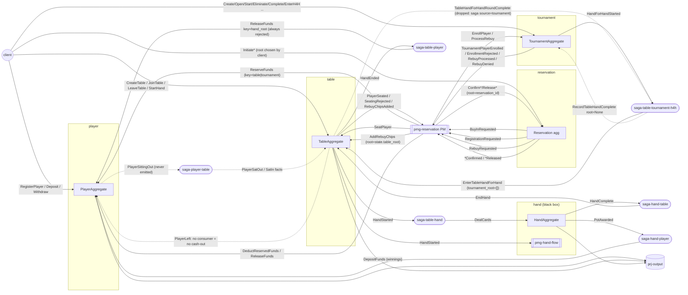

### 3b. Deployment (actual config)
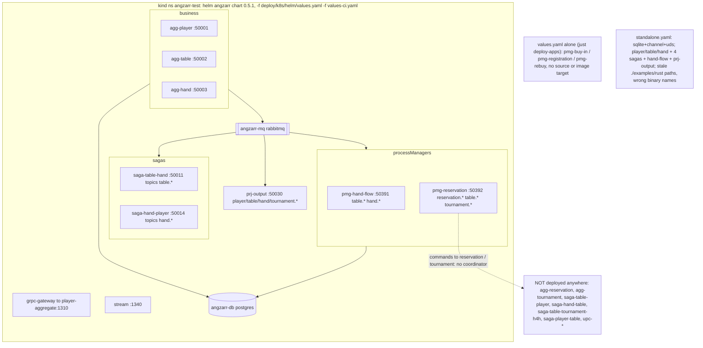

## 4. Sequence diagrams

### 4a. Player registration and funding
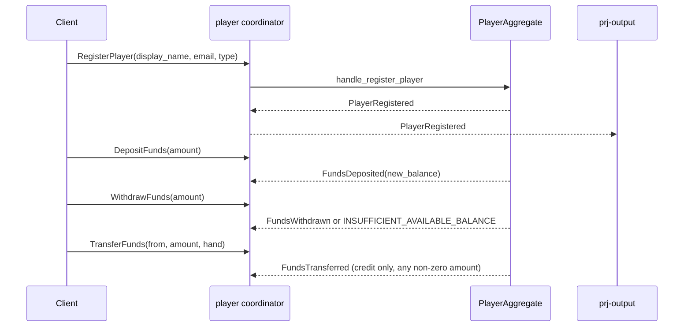
1. RegisterPlayer rejects if the player already exists or display_name/email is empty (player/agg/src/handlers/register.rs:11-26). The applier sets `player_id="player_"+email` and `status="active"` (state.rs:48-55). No transition ever leaves "active".
2. Deposit requires an existing player and amount>0 (deposit.rs:12-27). The applier adds to bankroll (state.rs:57-61).
3. Withdraw requires amount>0 and amount ≤ `bankroll - reserved_funds` (withdraw.rs:18-30; state.rs:36-38).
4. Transfer only checks `amount != 0` (transfer.rs:18-24). The applier credits bankroll and never debits the sender (state.rs:83-87). `to_player_root` holds the bytes of the `player_id` string (transfer.rs:34).
5. The projector renders Registered/Deposited/Withdrawn/Reserved (prj-output/src/lib.rs:453-514). It does not render Released/Deducted/Transferred; they fall to `on_unknown` (lib.rs:783-786).

### 4b. Table creation and seat buy-in through the reservation PM (as coded)
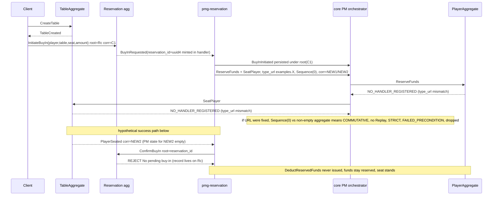
1. CreateTable validation is in table/agg/src/handlers/create.rs:21-53.
2. InitiateBuyIn checks only input shape. It emits BuyInRequested with a freshly minted `reservation_id` (reservation/agg/src/lib.rs:30-32, 86-116), and the applier keys the pending record by hex(reservation_id) (lib.rs:362-374).
3. The PM skips pre-validation because the query is `None` in production (pmg-reservation/src/main.rs:16-18; cross_aggregate_state.rs:193-207; lib.rs:291-333).
4. The PM emits ReserveFunds(key=table_root) and SeatPlayer in parallel (lib.rs:335-373) through `make_command`:
   - type URL `type_url("examples.ReserveFunds")` (lib.rs:97-99);
   - `Sequence(0)`, `MergeCommutative`, `sync_mode: None` (lib.rs:91-96);
   - a fresh correlation (lib.rs:88).
5. The router matches the exact `full_type_url::<T>()` (angzarr-client-rust/src/router/runtime.rs:102; angzarr-macros/src/lib.rs:222). The v1 full name is `angzarr_client.proto.examples.v1.ReserveFunds` (generated v1.rs:699-704). Result: NO_HANDLER_REGISTERED (runtime.rs:130-137).
6. Core honours an explicit Sequence (core process_manager/mod.rs:743-745) and does not fill a correlation that is already set (core shared.rs:51-57). A sequence mismatch under COMMUTATIVE needs Replay (core aggregate/pipeline.rs:343-376). Replay is UNIMPLEMENTED unless `supports_replay` is set (angzarr-client-rust/src/handler.rs:79-91), and no aggregate here sets it (grep `supports_replay` in the examples: 0 hits). The non-Decision Retryable path only logs (mod.rs:873-879).
7. SeatPlayer turns validation failures into a SeatingRejected event rather than an error (table/agg/src/handlers/seat_player.rs:51-89).
8. `on_player_seated` sends ConfirmBuyIn to root = reservation_id (pmg-reservation/src/lib.rs:394-399). The reservation lookup fails (reservation/agg/src/lib.rs:128-132).
9. BuyInConfirmed → DeductReservedFunds(amount, key=table_root) (lib.rs:441-477). BuyInReservationReleased → ReleaseFunds(key) (lib.rs:479-506).

### 4c. Player leave / cash-out
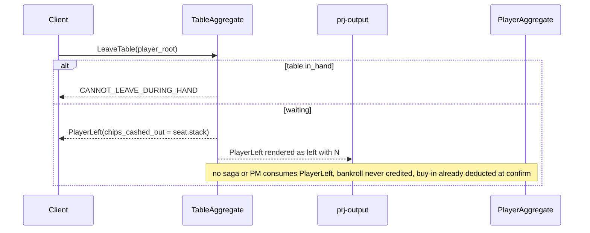
1. The guard rejects a missing table or `status=="in_hand"` (table/agg/src/handlers/leave.rs:11-19). The player must be seated (leave.rs:21-33).
2. `chips_cashed_out = seat.stack` (leave.rs:35-42). The applier removes the seat (state.rs:112-114).
3. The only PlayerLeft handler is prj-output (prj-output/src/lib.rs:554-562). `rg 'handles\(PlayerLeft\)'` over player, table, tournament, reservation, pmg-*, hand and prj-output returns that single hit.

### 4d. Tournament registration, rebuy and elimination (as coded)
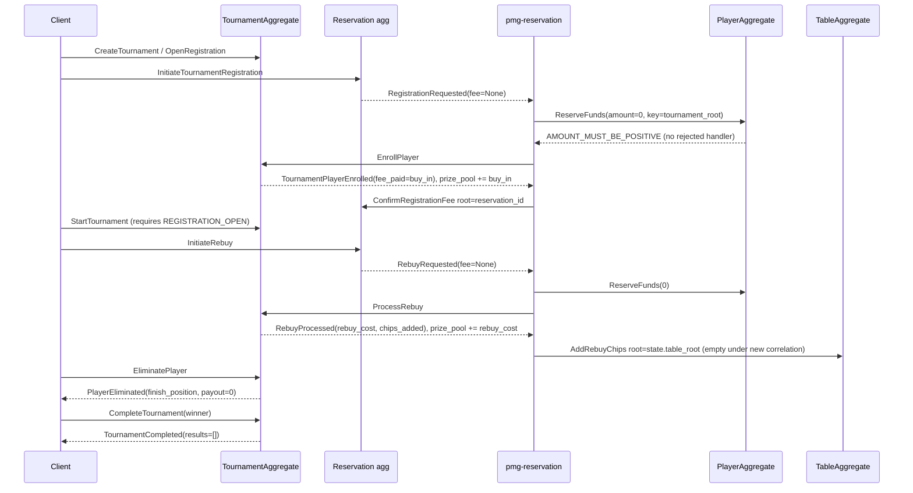
1. Registration is created with `fee: None` (reservation/agg/src/lib.rs:193-199), and the pending fee is recorded as 0 (lib.rs:395).
2. The PM fee is `tour.buy_in`, or `event_fee` when there is no query (pmg-reservation/src/lib.rs:810-815). With no query that is 0. ReserveFunds(0) is rejected (player/agg/src/handlers/reserve.rs:24-28).
3. EnrollPlayer returns an event, not an error, for business denials (tournament/agg/src/handlers/enroll.rs:18-76). `fee_paid = state.buy_in` (enroll.rs:52), and the applier adds it to `total_prize_pool` (state.rs:184).
4. Rebuy handling:
   - The fee is `tour.rebuy_cost` or `event_fee`, which is 0 (pmg-reservation/src/lib.rs:556-560).
   - ProcessRebuy rejects with an Err, not RebuyDenied, when the tournament is not running (rebuy.rs:11-19).
   - The applier adds `rebuy_cost` to the pool (state.rs:199).
   - RebuyProcessed → AddRebuyChips targets `state.table_root` and `state.seat` (pmg-reservation/src/lib.rs:613-624).
5. Elimination: payout is hard-coded 0 (lifecycle.rs:92-93) and the applier removes the registration (state.rs:208-212).
6. Completion: `results: vec![]` (lifecycle.rs:237-242), even though the proto carries `payout_structure` / `finishing_order` (tournament.proto:91-93, 127).

### 4e. Projector output
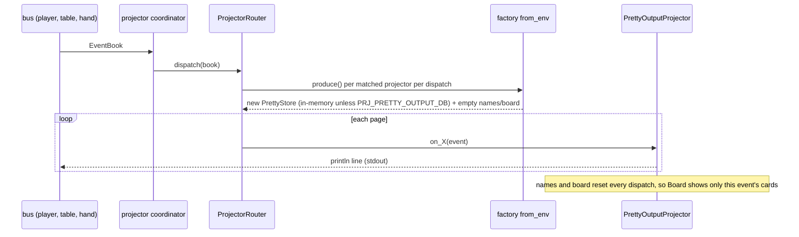
1. Factories are produced per dispatch (angzarr-client-rust/src/router/runtime.rs:615-632). main.rs hands over the `from_env` factory (prj-output/src/main.rs:23-25), and its own comment contradicts this (main.rs:18-22).
2. `from_env` opens the sqlite file from `PRJ_PRETTY_OUTPUT_DB`, or a fresh in-memory DB otherwise (lib.rs:391-399). No deploy file sets `PRJ_PRETTY_OUTPUT_DB` (checked by reading all deploy files). standalone.yaml sets `HAND_LOG_FILE` (standalone.yaml:111), which the code never reads.
3. The store is written (lib.rs:520, 538-540, 566, 652-654) but never read for rendering. `resolve_name` uses only the in-memory `names` map (lib.rs:413-423). `record_board`, `record_pot_total` and `update_hand_phase` are called only from tests (grep: lib.rs:1183-1185).
4. Subscribed domains are player, table and hand (lib.rs:449). Helm topics add `tournament.*` (values.yaml:129-132), but the router domain filter drops those books (runtime.rs:624-630).

## 5. Invariants & contracts

**Player funds** (`available = bankroll - reserved`, state.rs:36-38)
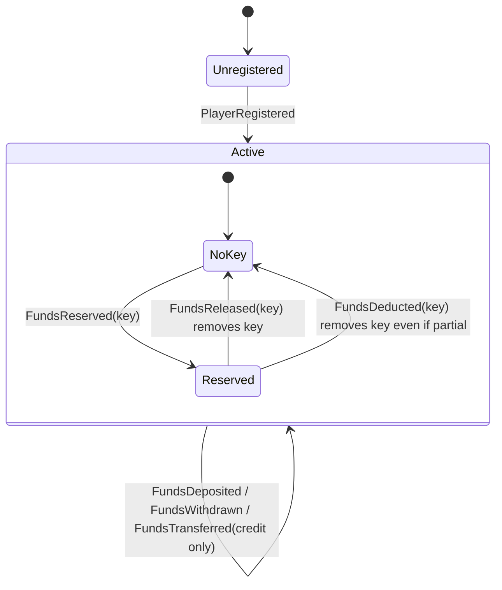
- Enforced:
  - Reserve requires amount>0, available ≥ amount, and a key not already reserved (reserve.rs:24-44).
  - Release requires a non-empty key with reserved>0 (release.rs:18-30).
  - Deduct requires amount ≤ reserved_for_key (deduct.rs:24-41).
- Not enforced:
  - `reserved_funds == Σ table_reservations`: a partial deduct breaks it (state.rs:89-95).
  - bankroll ≥ reserved after a transfer (transfer.rs:18-24).
  - Reserve does not reject an empty key; only release and deduct do (reserve.rs:36-41).

**Reservation** (pending maps keyed by hex(reservation_id) on one root, state.rs:34-39)
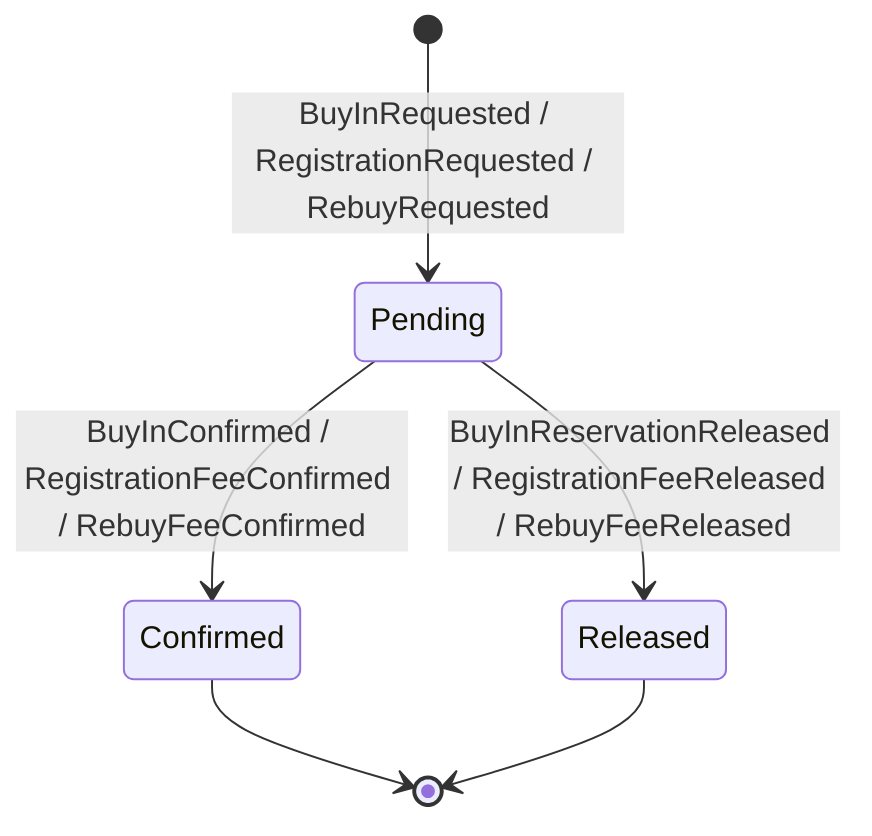
- Initiate is non-idempotent: each call mints a new uuid4 (lib.rs:30-32).
- Confirm/Release require the pending record on the same root (lib.rs:128-132, 157-161, 216-220, 245-248, 308-312, 338-342).

**Table**
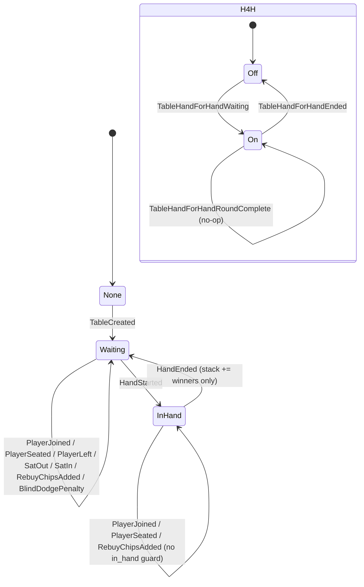
- Enforced:
  - StartHand needs ≥2 active players and not in_hand (start_hand.rs:11-25).
  - Leave is blocked while in_hand (leave.rs:15-17).
  - EndHand hand_root must equal `current_hand_root` (end_hand.rs:23-28).
- Not enforced:
  - StartHand while `hand_for_hand` (contrary to state.rs:36-40 and table.proto:298-315).
  - Join/Seat/AddRebuy mid-hand (join.rs:14-57; seat_player.rs:11-49; add_rebuy_chips.rs:13-47).
  - ChangeSeats has no table-exists or occupancy check and moves nobody (change_seats.rs:24-61).

**Tournament**
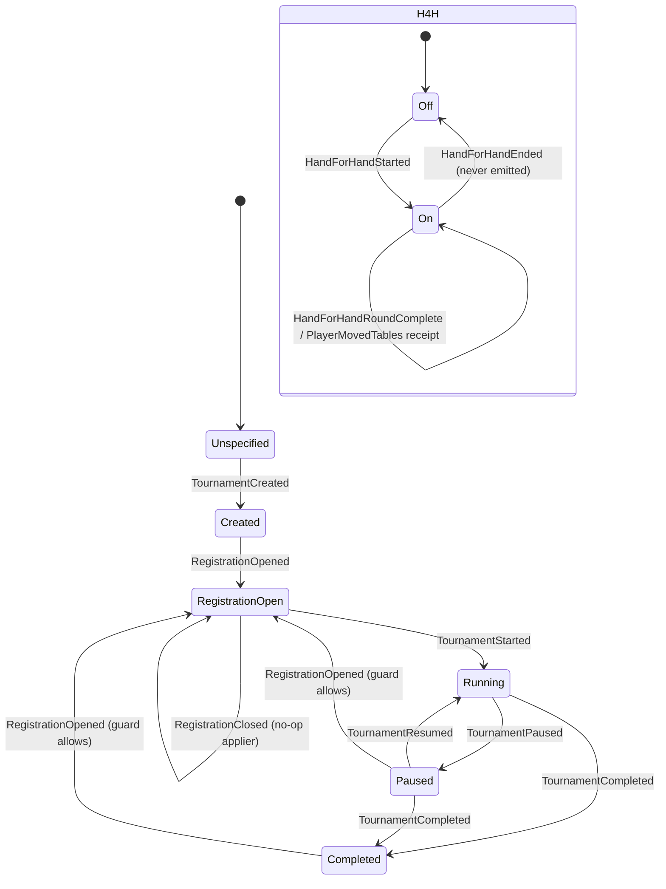
- `guard_open` rejects only when the tournament does not exist, is already open, or is running (registration.rs:15-26).
- `apply_registration_closed` is empty (state.rs:168).
- The statuses HALTING, BAGGED and CANCELLED (tournament.proto:26-33) are never set (grep over tournament/agg/src: 0 hits).

**pmg-reservation PM state** (fields: state.rs:15-28; appliers: lib.rs:989-1056)
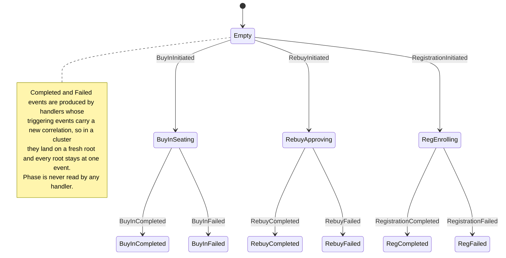

**Money-flow audit** (✗ = unbalanced or missing)
| Flow | Debit | Credit | Code | Verdict |
|---|---|---|---|---|
| Cash buy-in | bankroll −X via Reserve→Deduct | table stack +X via PlayerSeated | pmg-reservation lib.rs:335-373, 441-477; seat_player.rs:61-66 | balanced on paper; unreachable (EXD-01..05) |
| JoinTable (client) | none | table stack +X | join.rs:59-67 | ✗ chips minted; acceptance steps add a separate ReserveFunds that is never settled (acceptance/steps.rs:133-167) |
| Hand result | losers: none | winner table stack +W (end_hand.rs:30-35) and bankroll +W (hand/saga-player/src/lib.rs:17-45) | — | ✗ 2W minted, losses never removed |
| Post-hand release | ReleaseFunds(key=hand_root) | — | table/saga-player/src/lib.rs:22-24 | ✗ always NoFundsReservedForTable |
| Leave table | table stack →0 | none | leave.rs:35-42 | ✗ chips destroyed (no cash-out) |
| Tournament registration | Reserve(0) rejected; Deduct(0) rejected | prize_pool +buy_in | pmg lib.rs:810-815; enroll.rs:52; state.rs:184 | ✗ pool funded from nothing |
| Rebuy | Reserve(0) rejected | prize_pool +rebuy_cost; table stack +chips | pmg lib.rs:556-560; state.rs:199; add_rebuy_chips.rs:44 | ✗ |
| Re-entry | none | new starting stack; registration reset | player_lifecycle.rs:122-146; state.rs:329-349 | ✗ free re-entry |
| Payout / bounty / no-show refund | — | none | lifecycle.rs:92-93, 237-242; state.rs:351-363 | ✗ pool never paid; bounty and held buy-in are bookkeeping only |
| Transfer | none | recipient +amount (may be negative) | transfer.rs:18-44; state.rs:83-87 | ✗ |
| Partial deduct | bankroll −a | reservation key removed, residual stuck | deduct.rs:34; state.rs:89-95 | ✗ |

**Contracts relied on**
- PM root = correlation_id (core process_manager/mod.rs:418-431).
- Explicit Sequence is honoured untouched (mod.rs:743-745).
- A command correlation is back-filled only when empty (core shared.rs:51-57).
- Saga dispatch is filtered by declared source (client runtime.rs:356-365). Command dispatch uses an exact type_url (runtime.rs:102).

## 6. Findings
| ID | Sev | Category | path:line | Finding | Evidence/how verified | Suggested direction |
|---|---|---|---|---|---|---|
| EXD-01 | high | correctness | pmg-reservation/src/lib.rs:97-99 (every `make_command` call, e.g. :187, :362, :365, :397, :470, :622, :845) | Every PM command is packed with `type_url("examples.X")`, i.e. `type.googleapis.com/examples.X`. Handlers register under `full_type_url::<T>()` = `…/angzarr_client.proto.examples.v1.X`, so every command fails NO_HANDLER_REGISTERED. | Read client convert.rs:35-36, router runtime.rs:92-137 (exact `==`), macros lib.rs:222/249, generated v1.rs:699-704. Not run. | Use `full_type_url::<M>()` in `make_command`. Assert the exact URL in unit tests. |
| EXD-02 | high | correctness | pmg-reservation/src/lib.rs:91-96 | PM commands carry an explicit `SequenceType::Sequence(0)`. Core treats that as a claimed destination sequence and skips angzarr_deferred stamping. On any non-empty aggregate a COMMUTATIVE merge needs Replay; no example aggregate sets `supports_replay`, so it degrades to STRICT and returns FAILED_PRECONDITION. The async PM path then only logs. The command is lost and has no idempotency key. | Core process_manager/mod.rs:736-786, 844-879; aggregate/pipeline.rs:238-299, 343-376, 739-765; client handler.rs:79-91. `rg supports_replay` in examples outside the client: 0 hits. | Leave `sequence_type` unset so core stamps angzarr_deferred, as the sagas do (e.g. table/saga-player/src/lib.rs:37-40). |
| EXD-03 | high | correctness | pmg-reservation/src/lib.rs:88; 387, 421, 616-624, 642-646, 869-871 | A fresh `uuid4` correlation on every command. Core keeps an explicit correlation, and PM state is fetched by correlation, so reply events see empty state. AddRebuyChips goes to root `[]` with seat 0, and Completed/Failed events carry empty roots. | Core shared.rs:45-66; process_manager/mod.rs:418-431; process_manager/grpc/mod.rs:58-66. | Leave `correlation_id` empty (core fills it) or copy the trigger's. Add a test asserting it. |
| EXD-04 | high | correctness | reservation/agg/src/lib.rs:30-32, 104-105, 128-132; pmg-reservation/src/lib.rs:394-399, 427-431, 650-655, 683-687, 875-880, 909-913 | Confirm/Release target root = reservation_id, but the pending record lives on the client-chosen Initiate root. The id is minted inside the handler, so no caller can align the two. | Read both sides. Tests hide it with a single shared stream (tests/tests/player_steps.rs:257-280). | Make the aggregate root the reservation id (client-supplied, or UUIDv5 of it), or have the PM route to the source cover root. |
| EXD-05 | high | pm-sync / correctness | pmg-reservation/src/lib.rs:357-373, 583-604, 834-855 | ReserveFunds and Seat/Enroll/ProcessRebuy are sent together, async (`sync_mode: None`, lib.rs:93), and the PM has no `#[rejected]` handler. If Reserve fails, the seat or enrollment stands unfunded. The PM's next step depends on Reserve's outcome, so policy requires SIMPLE/CASCADE. | `rg '#\[rejected' pmg-reservation/src`: 0 hits. | Emit ReserveFunds with SIMPLE (or CASCADE) and issue Seat/Enroll only on success, or chain via FundsReserved. |
| EXD-06 | high | money | reservation/agg/src/lib.rs:197, 289, 395, 428; pmg-reservation/src/lib.rs:554-560, 810-815; main.rs:16-18 | Registration and rebuy fees are 0 in production. ReserveFunds(0) is rejected (reserve.rs:26-28) and DeductReservedFunds(0) is rejected (deduct.rs:29-31). Meanwhile `total_prize_pool` += buy_in / rebuy_cost (tournament state.rs:184, 199) and rebuy chips are added to the table. | Read. | Carry the fee on the tournament event (fee_paid / rebuy_cost) and sequence Reserve → Enroll/Rebuy, or have the client supply the fee and let the tournament validate it. |
| EXD-07 | med | correctness (latent) | pmg-reservation/src/lib.rs:105-128 | Every process event is written at `Sequence(0)`. Once EXD-03 is fixed, the second process event for a correlation conflicts (SequenceConflict → Retryable → exhaust → DLQ). | Core process_manager/grpc/mod.rs:84-96; storage mock/event_store.rs:129-142. | Leave the sequence unset, or use pm_state next_sequence. |
| EXD-08 | high | correctness / deploy | table/saga-tournament-h4h/src/lib.rs:62, 72-76, 90, 119-134, 142-148; tournament/agg/src/handlers/hand_for_hand.rs (no HandForHandEnded) | Hand-for-hand is broken end to end: • The saga declares `source="tournament"` but its receipt handler needs a table event, which the router drops. • It sends RecordTableHandComplete with `table_root=[]` and cover root None. • EnterTableHandForHand carries `tournament_root=[]`. • HandForHandEnded fans out nothing, and no tournament command emits HandForHandEnded, so H4H never ends and EnterHandForHand is rejected forever after. • No Containerfile target and no helm entry exist. | Client runtime.rs:356-365. `rg 'HandForHandEnded \{' tournament/agg/src`: 0 non-test hits. Containerfile has no target for it. | Split into a table-sourced saga that uses `source_cover.root`. Store tournament_root on the table's H4H state. Add an ExitHandForHand command. |
| EXD-09 | high | correctness | tournament/agg/src/handlers/hand_for_hand.rs:92-110 | Both pages use `event_page(seq, …)`, so RecordTableHandComplete emits duplicate sequences on the final table. | Read (the unit test at :279-292 only counts pages). | Use seq, seq+1. |
| EXD-10 | high | money | table/agg/src/handlers/end_hand.rs:30-35; table/agg/src/state.rs:139-150; hand/saga-player/src/lib.rs:17-45 | HandEnded `stack_changes` holds only the winners' +amount, which the table adds to stacks, and saga-hand-player also deposits the same winnings into the bankroll. Chips are double-credited and losses are never removed. | Read (money-flow audit). | EndHand should carry absolute final stacks. Keep chips at the table and credit the bankroll only on cash-out. |
| EXD-11 | high | money | table/agg/src/handlers/leave.rs:35-42 | PlayerLeft has no consumer that credits the player, so all chips are destroyed on leave (the buy-in was already deducted at confirm). | `rg 'handles\(PlayerLeft\)'` over player, table, tournament, reservation, pmg-*, hand, prj-output: only prj-output/src/lib.rs:554. | Add a table→player saga: PlayerLeft → DepositFunds(chips_cashed_out). |
| EXD-12 | med | correctness | table/saga-player/src/lib.rs:16-43 | `ReleaseFunds{key: hand_root}` for each stack_changes key. Reservations are keyed by table or tournament root, so this is always rejected (release.rs:23-29). Also not deployed. | Read. The saga BDD asserts only count and domain (tests/tests/saga_steps.rs:668-674). | Delete it (after deduct-at-confirm nothing stays reserved), or replace it with the cash-out saga. |
| EXD-13 | med | money | player/agg/src/handlers/transfer.rs:18-44; state.rs:83-87 | TransferFunds is a credit-only command that accepts negative amounts with no balance check (bankroll can drop below reserved). `to_player_root` = bytes of the `player_id` string. | Read. | Require amount>0 and model the transfer as debit + credit (saga), or remove it. |
| EXD-14 | med | money | player/agg/src/handlers/deduct.rs:34; state.rs:89-95 | A partial deduct is allowed, but the applier removes the whole key, so the residual stays in `reserved_funds` forever. | Read. | Decrement the key and remove it only at 0, or require the exact amount. |
| EXD-15 | med | money / completeness | tournament/agg/src/handlers/lifecycle.rs:92-93, 237-242; state.rs:351-363 | No payout path: `payout=0`; `results=[]` despite `payout_structure` / `finishing_order` in the proto (tournament.proto:91-93, 127); BountyAwarded and NoShowDetected(buy_in_held) move no funds. Nothing credits players from tournament events. | `rg 'handles\((PlayerEliminated\|TournamentCompleted\|BountyAwarded\|NoShowDetected)\)'`: 0 hits. | Compute results in CompleteTournament and add a tournament→player payout saga. |
| EXD-16 | med | correctness / money | tournament/agg/src/handlers/player_lifecycle.rs:122-146; state.rs:329-349 | ReEntryPlayer does not check the player busted or was registered. It charges no fee, overwrites the registration (resetting rebuys_used) and does not add to the prize pool. | Read. | Route re-entry through the reservation flow. Guard on eliminated status. |
| EXD-17 | med | state-machine | tournament/agg/src/state.rs:168; handlers/registration.rs:15-26; handlers/lifecycle.rs:176-190 | CloseRegistration does nothing, so enrollment continues. If it did change state, StartTournament (which requires REGISTRATION_OPEN) could never follow it. OpenRegistration is accepted from Paused or Completed, so a finished tournament can be reopened and started again (TournamentStarted reseeds total_chips_in_play, state.rs:226-236). HALTING/BAGGED are unused; StopNewHands does not gate tables. | Read. `rg TournamentHalting\|TournamentBagged tournament/agg/src`: 0 hits. | Add RegistrationClosed / Halting / Bagged states. Allow Start from Open or Closed. Reject Open unless status is Created. |
| EXD-18 | med | state-machine | table/agg/src/handlers/start_hand.rs:11-25; state.rs:36-40; change_seats.rs:24-61; join.rs:14-57; add_rebuy_chips.rs:13-47 | StartHand ignores `hand_for_hand` (the doc and table.proto:298-315 say it must reject). ChangeSeats has no table-exists or player-seat check, penalises an empty seat (root `[]`) and never moves anyone. Join, Seat and AddRebuyChips are accepted mid-hand. | Read. | Add the guards. Emit SeatsChanged. |
| EXD-19 | med | money / design | table/agg/src/handlers/join.rs:59-67; player/agg/src/handlers/rejected.rs:12-71; player/agg/src/lib.rs:143-150 | JoinTable seats chips with no funds link. The only compensation, a player `#[rejected(table, JoinTable)]`, is unreachable: no saga or PM issues JoinTable. Its doc cites a non-existent "saga-player-table after FundsReserved", it releases amount 0 when nothing is reserved, and it writes at page `event_page(0, …)` (rejected.rs:65). | `rg 'JoinTable \{' player table pmg-* tournament hand`: only table tests and acceptance steps. | Delete JoinTable, or make it PM-only (SeatPlayer), and drop the dead handler. |
| EXD-20 | med | projector | prj-output/src/main.rs:18-25; lib.rs:391-399, 413-423, 449, 676-682 | A fresh projector instance per dispatch: the in-memory `names` and `board` reset, so the "Board:" line shows only the current event's cards, and sqlite is ephemeral unless `PRJ_PRETTY_OUTPUT_DB` is set (never set). The store is write-only. The subscription omits reservation and tournament (helm lists `tournament.*`, values.yaml:129-132). Released/Deducted/Transferred/PlayerSeated are not rendered. | Client runtime.rs:615-632. The projector BDD reuses one instance (tests/tests/projector_steps.rs:55-68), which hides this. | Build once and share through `Arc` in the factory. Read names and board from the store. Add the missing domains and events. |
| EXD-21 | high | build / deploy | Containerfile:41-44, 131-134, 143-159, 161-182, 195-219; Cargo.toml:4-23; skaffold.yaml:80-99; deploy/k8s/helm/values.yaml:90-119; values-ci.yaml:68, 128-141; standalone.yaml:19-107 | Build and deploy config is broken or stale: • Containerfile `cp …/proto/examples/*.proto` finds nothing (only `v1/` exists at 80ce7c2 and at 16fa309). • The `table/saga-tournament-h4h` manifest is never copied, although it is a workspace member, so the final `cargo build --workspace` fails. • skaffold builds non-existent targets (pmg-buy-in, pmg-registration, pmg-rebuy) and omits agg-reservation and pmg-reservation. • values.yaml deploys the dead PMs. • No values file deploys agg-reservation or agg-tournament, yet values-ci deploys pmg-reservation. The comment "agg-tournament… no Containerfile target" is false (Containerfile:293). • standalone.yaml has stale paths and binary names (`hand-flow` instead of pmg-hand-flow, `prj-output` instead of prj-pretty-output). | `ls angzarr-project/proto/angzarr_client/proto/examples/` → `v1`. `git ls-tree 80ce7c2` shows the same. | Generate from the `angzarr-project/proto` root in-image. Derive targets and values from workspace members. Add agg-reservation and agg-tournament. Delete stale entries. |
| EXD-22 | low | deploy | justfile:307-339, 409-423, 439-452 | `kind-load-images` omits pmg-hand-flow and pmg-reservation although values-ci uses IfNotPresent. `deploy-apps` (values.yaml) never tags the PMs. | Read. | Derive the image list from Containerfile targets. |
| EXD-23 | med | test-harness | tests/scripts/bootstrap-cluster.sh:76-83; deploy/k8s/helm/values.yaml:27-30 | The kind bootstrap exports PLAYER, TABLE and HAND URLs all as `localhost:9084` (the gateway), and the gateway targets only `player-aggregate:1310`. Table and hand commands go to the player coordinator. | Read. The `test-e2e` recipe uses port-forwards instead (justfile:483-510). | Emit per-domain aggregate URLs (port-forward or NodePort). |
| EXD-24 | high | test-harness | tests/tests/acceptance/world.rs:185-190; acceptance/steps.rs:31, 54, 83, 115, 142, 173, 199; command_client.rs:137, 389-394, 147-155, 172-179, 641-646 | Acceptance commands use `type.googleapis.com/examples.X`, which a real coordinator rejects exactly as in EXD-01. InProcessClient hides this with `type_tail` suffix matching. Neither client can reach the reservation or tournament domains, so cluster_tournament.feature cannot be implemented as written. | Read. | Use `full_type_url::<T>()`. Add reservation and tournament channels. |
| EXD-25 | high | test-quality | tests/tests/tournament_steps.rs:53-1851; tests/tests/acceptance/steps.rs:1591-2102; tests/tests/table_steps.rs:217-398, 496-499, 648-697, 864-877, 894-897, 1040-1103; table/agg/tests/router.rs:152-388; tournament/agg/tests/router.rs:167-395 | Vacuous tests: • tournament_steps: 225 step fns, all `let _ = world;`, 0 asserts (HEAD tournament.rs had 36). • acceptance/steps.rs from :1591: 59 step fns (55 pure no-ops; the other 4 only touch world bookkeeping; uncommitted). • table_steps: 38 TODO markers (about 35 stub fns); ChangeSeats BDD is stubbed. • Both router.rs files: 17 + 20 tests whose body is only `let _ = run(ctx)`/`replay_*`, with no assert. | `grep -c assert` per file; read in full. | Port the HEAD bodies. Fail on unimplemented steps (`@wip`). Add asserts to the router tests. |
| EXD-26 | med | test-quality | tests/tests/orchestration_steps.rs:147, 533-543, 693-703, 832-846; tests/tests/player_steps.rs:151-182, 285-307, 422-433; tests/tests/saga_steps.rs:668-674 | The tests encode the broken behaviour or hide it: • PM steps get hand-filled state (hides EXD-03). • Commands are matched by type-name suffix (hides EXD-01), and cover root, correlation, sync_mode and sequence are never checked. • "PM emits no commands" allows Release*. • Player steps synthesize the PM hop (FundsReserved/Deducted) and run the pre-validation production lacks. • The pending buy-in is seeded with an empty player_root. • The saga test for "reserved chips released" never checks the key. | Read. | Drive the PM through `ProcessManagerRouter.dispatch` with real state rebuild, and assert full command covers. |
| EXD-27 | low | errors / idempotency | reservation/agg/src/lib.rs:93-101, 187-192, 274-282; examples-utils/src/lib.rs:53-73 | The reservation aggregate uses the generic EXAMPLE_REJECTED / EXAMPLE_INVALID_ARGUMENT codes, unlike the typed catalogs elsewhere. Initiate* is not idempotent: a retried command creates a second reservation. | Read. | Add a typed errors.rs. Accept a client-supplied reservation_id. |
| EXD-28 | low | dead-code | player/saga-table/src/lib.rs:34-81 (no main.rs); player.proto:58-66 (SitOut/SitIn unhandled); pmg-reservation/src/state.rs:31-55; reservation/agg/src/lib.rs:55-77; pmg-reservation/src/lib.rs:156-162, 290-333, 520-552, 771-808; table/agg/src/state.rs:152-158; prj-output/src/lib.rs:252-313 | Dead or unreachable code: • saga-player-table: PlayerSittingOut is emitted only in tests. • `reservation_key`, `is_initialized`, phase constants and `query_client` are unused. • CrossAggregateQuery pre-validation runs only in tests. • The ChipsAdded applier has no emitter. • The PrettyStore readers are test-only. • The saga's `external_id` `sitout-<player>` dedupes every future sit-out (lib.rs:44, 67). | `rg 'PlayerSittingOut \{'` → only player/saga-table (tests); `rg 'ChipsAdded \{'` → only test code. | Delete, or wire with real emitters. |
| EXD-29 | low | proto drift | proto/src/generated/*.v1.rs (May 21) vs angzarr-project@16fa309; tournament/agg/src/handlers/hand_for_hand.rs:87-95 | The dirty submodule bump adds `TableHandCompleteRecorded` (tournament.proto:555), `moved_player`, `TableExt` and more, but the bindings were not regenerated. The code still repurposes PlayerMovedTables as the H4H receipt (hand_for_hand.rs:87-95). | `grep -c TableHandCompleteRecorded generated/*.v1.rs` = 0; `git show 80ce7c2:…tournament.proto` = 0 hits. | Regenerate. Switch to the dedicated event. |
| EXD-30 | low | design | pmg-reservation/src/lib.rs:282-333, 512-552, 763-808 | Pre-validation (seat free, buy-in range, rebuy window, registration full) is decision logic inside a PM, contrary to "PMs are coordinators". The destination aggregates already re-validate (seat_player.rs:18-49; enroll.rs:18-37; rebuy.rs:25-57). | Read. | Remove it and rely on the aggregates' rejection events. |
| EXD-31 | low | correctness | pmg-reservation/src/lib.rs:376-407, 409-439, 631-663, 858-921 | The PM never checks `event.reservation_id` against state, or the phase. A redelivered or foreign PlayerSeated or Enrolled event re-issues Confirm; a PlayerSeated with an empty reservation_id issues ConfirmBuyIn to root `[]`. | Read. | Guard on state.kind, phase and reservation_id. |
| EXD-32 | low | naming / validation | table/agg/src/errors.rs:58-78; create.rs:30 | BIG_BLIND_MUST_EXCEED_SMALL_BLIND allows equal blinds (`<`) and uses PreconditionFailed for input validation. `table_reservations`, `FundsAlreadyReservedForTable` and `TableRootRequired` also cover tournament keys (player errors.rs:153-191). | Read. | Rename the codes and fix the status. |
| EXD-33 | low | completeness | tournament/agg/src/handlers/chip_economy.rs:26-75; lifecycle.rs:31-66 | ColorUp emits zero deltas. RebalanceTables ignores its command fields (tournament.proto:150-156) and emits empty roots. AdvanceBlindLevel ignores the color-up fields. | Read. | Implement, or narrow the proto. |
| EXD-34 | low | hygiene | build.json:1 | A committed skaffold artifact `{"builds":null}`. | Read. | gitignore it. |

## 7. Open questions
- What should the reservation aggregate root be: per player, per reservation, or global? This decides EXD-04.
- Should chips leave the bankroll at buy-in (deduct) or stay reserved until cash-out? The current mix (EXD-10/11/12) is incoherent; pick one ledger model before fixing the sagas.
- Is JoinTable meant to stay as a client-facing, funds-less path (the acceptance tests depend on it), or be retired in favour of the reservation flow?
- Tournament money: should entry fees be a player→house transfer and payouts a house→player transfer? No house or cashier aggregate exists.
- Which topology is the source of truth: helm values-ci, values.yaml, or standalone.yaml? None is complete.
- Is the uncommitted WIP (stubbed tournament and cluster_tournament steps, submodule bump) meant to land on this branch?

## 8. Cross-repo interface surface
- **Relies on client-rust** (submodule a9dd1c2, dirty):
  - macros `#[command_handler]`, `#[saga(source,target)]`, `#[process_manager(sources,targets,state)]`, `#[projector(domains)]`, `#[rejected]`, `#[upcaster]`;
  - the router's exact type_url match (runtime.rs:102);
  - the saga source filter (runtime.rs:363);
  - the per-dispatch factory (runtime.rs:631);
  - `type_url()` vs `full_type_url()` (convert.rs:35, 140);
  - the Replay gate (handler.rs:79-91).
- **Relies on core:**
  - PM root = correlation (process_manager/mod.rs:418-431; grpc/mod.rs:58-66);
  - correlation back-fill only when empty (shared.rs:51-57);
  - explicit-sequence honouring (mod.rs:743-745);
  - COMMUTATIVE→STRICT degradation without Replay (pipeline.rs:343-376);
  - async PM Retryable only logged (mod.rs:873-879).
- **Relies on angzarr-project:**
  - protos `angzarr_client.proto.examples.v1` (player, table, tournament, buy_in, registration, rebuy, orchestration, poker_types);
  - features `features/example/unit/{player,table,tournament,orchestration,saga,projector,poker_game,sync_modes}.feature` and `acceptance/{cluster,cluster_tournament}.feature`.
- **Relies on helm:** chart `oci://ghcr.io/angzarr-io/charts/angzarr` 0.5.1 values (`applications.business/sagas/processManagers/projectors`, `infrastructure.gateway.grpcTarget`, `images.*` digest pins); infra charts angzarr-db-postgres-simple and angzarr-mq-rabbitmq-simple (justfile:387-393).
- **Exposes:**
  - images `ghcr.io/angzarr-io/examples-rust-{agg-player,agg-table,agg-hand,agg-tournament,agg-reservation,saga-*,pmg-hand-flow,pmg-reservation,prj-output,upc-*}` (Containerfile:275-357);
  - domain names player, table, hand, tournament, reservation, pmg-reservation;
  - env `PORT`, `PRJ_PRETTY_OUTPUT_DB`, `PLAYER_URL`/`TABLE_URL`/`HAND_URL`/`STREAM_URL`, `CLUSTER_PROVIDER`.
- **Parity:** cross_aggregate_state.rs mirrors Python `reservation/pmg/{table_state,tournament_state}.py` (comment at :4-7). Per memory, Python is the structural template.

## 9. Prior findings audit
(Prior report: reviews/examples-rust.md. Items entirely about hand or pmg-hand-flow are marked out of scope.)
| Prior | Verdict | Evidence |
|---|---|---|
| F01 | CONFIRMED (pmg-reservation part) | pmg-reservation/src/lib.rs:88; core shared.rs:51-57; process_manager/mod.rs:418-431. The pmg-hand-flow part is out of scope. Prior missed the co-occurring EXD-01 (type URL) and EXD-02 (Sequence(0)). |
| F02 | CONFIRMED | reservation/agg/src/lib.rs:30-32, 104-105, 128-132; pmg lib.rs:394-399. |
| F03 | CONFIRMED (table side only) | table/saga-hand/src/lib.rs:27-28 `table_root: event.hand_root`. Hand/PM consequences are out of scope. |
| F04, F10, F11, F12, F14, F28, F39 | out of scope (hand / pmg-hand-flow) | — |
| F05 | CONFIRMED | hand/saga-player/src/lib.rs:17-45 + table/agg/src/state.rs:139-150 (EXD-10). |
| F06 | CONFIRMED | end_hand.rs:30-35. |
| F07 | CONFIRMED | table/saga-player/src/lib.rs:22-24; release.rs:23-29. |
| F08 | CONFIRMED | EXD-06. |
| F09 | CONFIRMED | EXD-05. |
| F13 | PARTIAL | tournament_steps.rs 225/225 stubs and acceptance/steps.rs stubs confirmed (1591-2102: 59 fns). hand_steps and game_rules_steps are out of scope. Also missed: `let _ = run(ctx)` router tests (EXD-25). |
| F15 | CONFIRMED | pmg-reservation/src/main.rs:16-18; reservation/agg/src/lib.rs:70-77; player_steps.rs:285-307. |
| F16 | CONFIRMED | hand_for_hand.rs:92-110. |
| F17 | CONFIRMED + extended | Also, the source filter drops the table-event handler (runtime.rs:363), and the tournament never emits HandForHandEnded (EXD-08). |
| F18 | CONFIRMED + extended | state.rs:168. Also, Start requires Open, and Open is allowed from Paused/Completed (EXD-17). |
| F19 | CONFIRMED | transfer.rs:18-44. |
| F20 | CONFIRMED | deduct.rs:34; state.rs:89-95. |
| F21 | CONFIRMED | EXD-11. |
| F22 | CONFIRMED | player/saga-table has no main.rs (directory listing). The only emitters are in tests. |
| F23 | CONFIRMED | rejected.rs:12-71; `event_page(0, …)` at :65. |
| F24 | CONFIRMED | start_hand.rs:11-25 vs state.rs:36-40. |
| F25 | CONFIRMED | change_seats.rs:24-61. |
| F26 | CONFIRMED | runtime.rs:615-632; lib.rs:391-399. |
| F27 | CONFIRMED | table/saga-hand/src/lib.rs:35-39. |
| F29 | CONFIRMED | hand_for_hand.rs:87-95. Note that the working-tree proto now defines TableHandCompleteRecorded (EXD-29). |
| F30 | PARTIAL | The Containerfile cp glob failure is confirmed (41-44, 131-134). Workflow yml and `proto/build.rs` gating confirmed (build.rs:12-15). The acceptance-callable.yml lines are outside my scope (grep only). Prior missed the missing h4h workspace manifest (EXD-21). |
| F31 | CONFIRMED | skaffold.yaml:80-99; values.yaml:90-119; values-ci.yaml:68, 128-141; Containerfile:293. |
| F32 | CONFIRMED | justfile:310-317. |
| F33 | CONFIRMED + extended | standalone.yaml:19, 61, 98, 107 also have wrong binary names. |
| F34 | CONFIRMED | player errors.rs:153-191; state.rs:24-27. |
| F35 | CONFIRMED | reservation/agg/src/lib.rs:93-101. |
| F36 | CONFIRMED | pmg-reservation/src/lib.rs:313-332. |
| F37 | PARTIAL | The six repeated "prefer event else state" blocks in pmg-reservation are confirmed (452-461, 485-494, 704-713, 737-746, 930-939, 963-972). Hand file sizes are out of scope. |
| F38 | CONFIRMED | acceptance/steps.rs:124-129, 155-163, 185-190 (bookkeeping updated even on error). |
| F40 | not audited | README.md is not in my scope. |

## 10. Read Ledger
Everything in this table was read with the Read tool unless the Notes column says otherwise.

| File | Total lines | Lines read (ranges) | Notes |
|---|---|---|---|
| player/agg/src/lib.rs | 557 | 1-557 | |
| player/agg/src/state.rs | 96 | 1-96 | |
| player/agg/src/errors.rs | 356 | 1-356 | |
| player/agg/src/handlers/mod.rs | 19 | 1-19 | |
| player/agg/src/handlers/deduct.rs | 80 | 1-80 | |
| player/agg/src/handlers/deposit.rs | 179 | 1-179 | |
| player/agg/src/handlers/register.rs | 53 | 1-53 | |
| player/agg/src/handlers/rejected.rs | 73 | 1-73 | |
| player/agg/src/handlers/release.rs | 69 | 1-69 | |
| player/agg/src/handlers/reserve.rs | 81 | 1-81 | |
| player/agg/src/handlers/transfer.rs | 61 | 1-61 | |
| player/agg/src/handlers/withdraw.rs | 59 | 1-59 | |
| player/agg/src/main.rs | 30 | 1-30 | |
| player/saga-table/src/lib.rs | 217 | 1-217 | |
| player/upc/src/lib.rs | 116 | 1-116 | |
| player/upc/src/main.rs | 23 | 1-23 | |
| player/agg/tests/router.rs | 204 | 1-204 | test |
| player/saga-table/tests/router.rs | 159 | 1-159 | test |
| player/upc/tests/router.rs | 48 | not read | test; no claims |
| player/*/Cargo.toml | 17/13/14 | full (cat) | manifests |
| reservation/agg/src/lib.rs | 554 | 1-554 | |
| reservation/agg/src/state.rs | 39 | 1-39 | |
| reservation/agg/src/main.rs | 28 | 1-28 | |
| reservation/agg/Cargo.toml | 21 | full (cat) | |
| pmg-reservation/src/lib.rs | 1174 | 1-1174 | |
| pmg-reservation/src/cross_aggregate_state.rs | 223 | 1-223 | |
| pmg-reservation/src/state.rs | 55 | 1-55 | |
| pmg-reservation/src/main.rs | 28 | 1-28 | |
| pmg-reservation/Cargo.toml | 21 | full (cat) | |
| table/agg/src/lib.rs | 744 | 1-744 | |
| table/agg/src/state.rs | 214 | 1-214 | |
| table/agg/src/errors.rs | 521 | 1-521 | |
| table/agg/src/handlers/mod.rs | 23 | 1-23 | |
| table/agg/src/handlers/add_rebuy_chips.rs | 71 | 1-71 | |
| table/agg/src/handlers/change_seats.rs | 182 | 1-182 | |
| table/agg/src/handlers/create.rs | 84 | 1-84 | |
| table/agg/src/handlers/end_hand.rs | 56 | 1-56 | |
| table/agg/src/handlers/hand_for_hand.rs | 178 | 1-178 | |
| table/agg/src/handlers/join.rs | 80 | 1-80 | |
| table/agg/src/handlers/leave.rs | 59 | 1-59 | |
| table/agg/src/handlers/seat_player.rs | 90 | 1-90 | |
| table/agg/src/handlers/start_hand.rs | 110 | 1-110 | |
| table/agg/src/main.rs | 28 | 1-28 | |
| table/saga-hand/src/lib.rs | 116 | 1-116 | |
| table/saga-hand/src/main.rs | 27 | 1-27 | |
| table/saga-player/src/lib.rs | 97 | 1-97 | |
| table/saga-player/src/main.rs | 25 | 1-25 | |
| table/saga-tournament-h4h/src/lib.rs | 258 | 1-258 | |
| table/saga-tournament-h4h/src/main.rs | 25 | 1-25 | |
| table/agg/tests/router.rs | 388 | 1-388 | test |
| table/saga-hand/tests/router.rs | 91 | 1-91 | test |
| table/saga-player/tests/router.rs | 87 | 1-87 | test |
| table/*/Cargo.toml | 18/14/15/19 | full (cat) | |
| tournament/agg/src/lib.rs | 1047 | 1-1047 | |
| tournament/agg/src/state.rs | 558 | 1-558 | |
| tournament/agg/src/errors.rs | 509 | 1-509 | |
| tournament/agg/src/handlers/mod.rs | 33 | 1-33 | |
| tournament/agg/src/handlers/chip_economy.rs | 170 | 1-170 | |
| tournament/agg/src/handlers/create.rs | 88 | 1-88 | |
| tournament/agg/src/handlers/day_end.rs | 249 | 1-249 | |
| tournament/agg/src/handlers/enroll.rs | 77 | 1-77 | |
| tournament/agg/src/handlers/hand_for_hand.rs | 421 | 1-421 | |
| tournament/agg/src/handlers/lifecycle.rs | 249 | 1-249 | |
| tournament/agg/src/handlers/penalty.rs | 372 | 1-372 | |
| tournament/agg/src/handlers/player_lifecycle.rs | 605 | 1-605 | |
| tournament/agg/src/handlers/rebuy.rs | 105 | 1-105 | |
| tournament/agg/src/handlers/registration.rs | 75 | 1-75 | |
| tournament/agg/src/main.rs | 28 | 1-28 | |
| tournament/agg/tests/router.rs | 395 | 1-395 | test |
| tournament/agg/Cargo.toml | 16 | full (cat) | |
| prj-output/src/lib.rs | 1205 | 1-620, 620-1205 | |
| prj-output/src/main.rs | 35 | 1-35 | |
| prj-output/tests/router.rs | 274 | 1-274 | test |
| prj-output/Cargo.toml | 24 | full (cat) | |
| examples-utils/src/lib.rs | 73 | 1-73 | |
| examples-utils/src/errors.rs | 187 | 1-187 | |
| examples-utils/src/error_shapes.rs | 266 | 1-266 | |
| examples-utils/Cargo.toml | 9 | full (cat) | |
| proto/src/lib.rs | 16 | 1-16 | dirty (diff viewed) |
| proto/build.rs | 65 | 1-65 | |
| proto/Cargo.toml | 14 | full (cat) | |
| angzarr-project/proto/…/examples/v1/player.proto | 187 | 1-187 | canonical; examples-proto/ copies are identical in body (diff) |
| …/v1/table.proto | 372 | 1-372 | |
| …/v1/tournament.proto | 926 | 1-470, 470-926 | |
| …/v1/buy_in.proto | 178 | 1-178 | |
| …/v1/registration.proto | 122 | 1-122 | |
| …/v1/rebuy.proto | 162 | 1-162 | |
| …/v1/orchestration.proto | 56 | 1-56 | |
| …/v1/poker_types.proto | 203 | 1-203 | |
| examples-proto/examples/*.proto | 3409 | not read line-by-line | gitignored copies; body diff vs v1 is identical (bash diff) |
| hand.proto, ai_sidecar.proto | 850/258 | not read | hand domain, sibling scope |
| Cargo.toml (workspace) | 51 | full (cat) | |
| skaffold.yaml | 140 | 1-140 | |
| values.yaml | 74 | 1-74 | |
| values-debug.yaml | 18 | 1-18 | |
| standalone.yaml | 115 | 1-115 | |
| Containerfile | 357 | 1-357 | |
| justfile | 575 | 1-575 | |
| build.json | 1 | full (cat) | `{"builds":null}` |
| deploy/k8s/helm/values.yaml | 132 | 1-132 | |
| deploy/k8s/helm/values-ci.yaml | 155 | 1-155 | |
| deploy/kind/cluster.yaml | 24 | 1-24 | |
| tests/src/lib.rs | 390 | 1-390 | |
| tests/Cargo.toml | 94 | 1-94 | dirty |
| tests/build.rs | 4 | 1-4 | |
| tests/scripts/bootstrap-cluster.sh | 245 | 1-245 | |
| tests/tests/acceptance.rs | 160 | 1-160 | dirty |
| tests/tests/acceptance/mod.rs | 28 | 1-28 | |
| tests/tests/acceptance/world.rs | 190 | 1-190 | |
| tests/tests/acceptance/command_client.rs | 741 | 1-741 | |
| tests/tests/acceptance/steps.rs | 2102 | 1-700, 700-1400, 1400-2102 | dirty |
| tests/tests/poker_game_unit.rs | 36 | 1-36 | |
| tests/tests/player_steps.rs | 1933 | 1-650, 650-1300, 1300-1933 | |
| tests/tests/table_steps.rs | 1159 | 1-600, 600-1159 | untracked |
| tests/tests/tournament_steps.rs | 1856 | 1-500, 500-1200, 1200-1856 | |
| tests/tests/orchestration_steps.rs | 857 | 1-857 | |
| tests/tests/saga_steps.rs | 870 | 1-870 | untracked |
| tests/tests/projector_steps.rs | 842 | 1-842 | untracked |
| tests/tests/process_manager_steps.rs | 1730 | not read | pmg-hand-flow (sibling) |
| tests/tests/hand_steps.rs, game_rules_steps.rs, raise_tracking_steps.rs, betting_round.rs | 5081/843/290/204 | not read | hand (excluded by task) |
| tests/tests/shape_classification.rs | 378 | not read | no claims made |
| tests/TEST_ARCHITECTURE.md | 160 | not read | doc; no claims |
| hand/saga-player/src/lib.rs | 53 | 1-53 | out of scope; read for money flow |
| hand/saga-table/src/lib.rs | 62 | 1-62 | out of scope; read for money flow |
| core/main/src/orchestration/shared.rs | 85 | 1-85 | cross-repo check |
| core/main/src/orchestration/process_manager/mod.rs | 907 | 370-907 | cross-repo check (PM orchestrate / execute) |
| core/main/src/orchestration/aggregate/pipeline.rs | — | 230-400, 600-780 | cross-repo check (merge strategy) |
| angzarr-client-rust/src/router/runtime.rs | — | 60-150, 300-470, 560-670, 785-817 | cross-repo check |
| angzarr-client-rust/angzarr-macros/src/lib.rs | — | 155-184, 380-449 | cross-repo check (supports_replay) |
