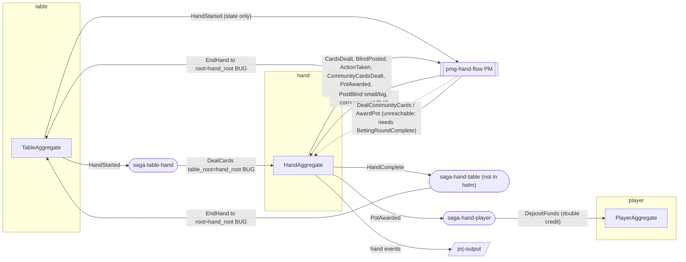
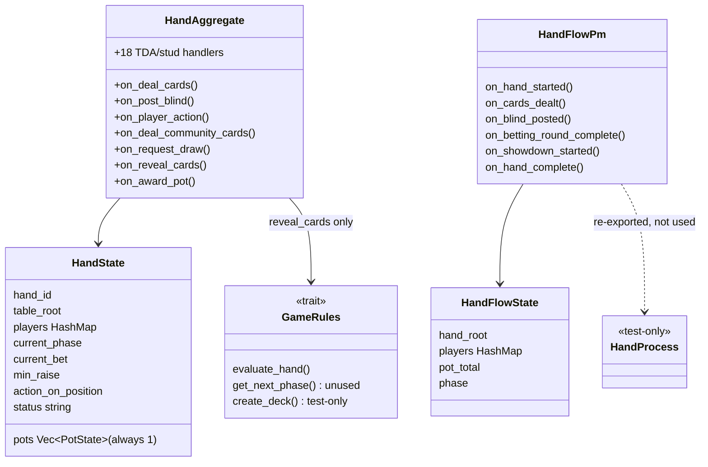
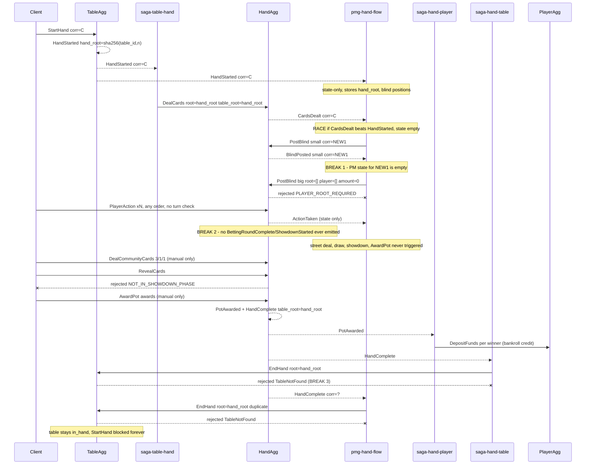
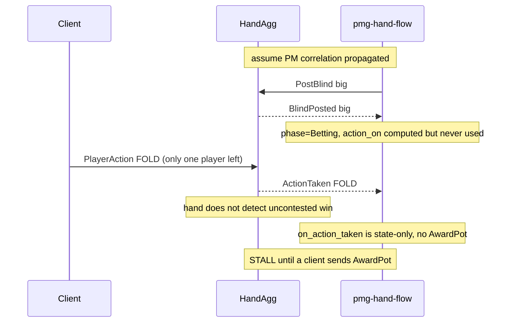
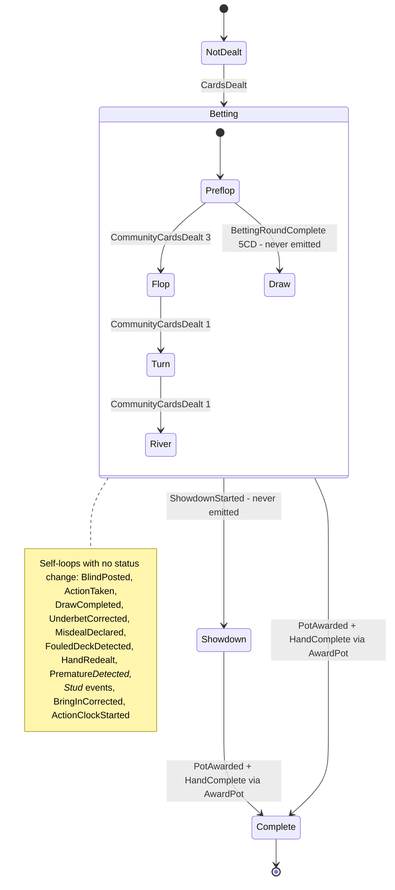
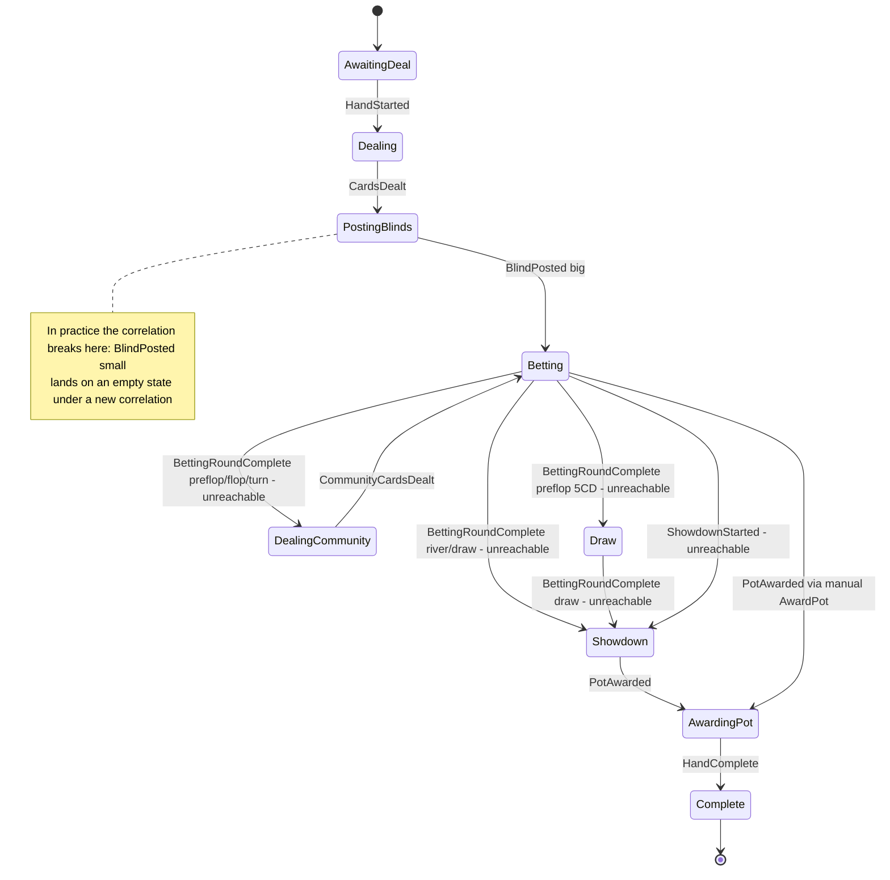

# examples-hand
Repo: /home/babbitt/workspace/angzarr/examples-rust/main @ refactor/reservation 977a197. The working tree is dirty. In scope: `tests/tests/hand_steps.rs` (staged, replaces the deleted `tests/tests/hand.rs`), `tests/tests/game_rules_steps.rs` (staged, replaces `game_rules.rs`), `tests/tests/process_manager_steps.rs` (untracked, replaces the deleted `process_manager.rs`), `tests/tests/acceptance/steps.rs` (+518 lines unstaged), `proto/src/lib.rs` (now includes the `examples.v1` bindings) and the `angzarr-project` submodule pointer. No in-scope production source (`hand/**`, `pmg-hand-flow/**`) is modified.

## 1. Summary
- **A real hand cannot finish.** No production handler emits `BettingRoundComplete` or `ShowdownStarted`. The only constructions are in test code: `rg -n 'BettingRoundComplete \{|ShowdownStarted \{' hand pmg-hand-flow table` returns only `hand/agg/src/lib.rs:580,668` (`#[cfg(test)]`) and `pmg-hand-flow/src/lib.rs:726` (tests). As a result the PM's street, draw and showdown transitions never fire (`pmg-hand-flow/src/lib.rs:259-334`), `RevealCards` is always rejected (`reveal_cards.rs:22`), and `RequestDraw` is always rejected (`request_draw.rs:30`, `state.rs:278-283`).
- **The PM breaks its own correlation.** Each PM command gets a fresh `uuid::new_v4()` correlation (`pmg-hand-flow/src/lib.rs:559`). Core only fills an *empty* correlation (`core/main/src/orchestration/shared.rs:51-57`), aggregate events inherit the command's correlation (`core/main/src/orchestration/aggregate/pipeline.rs:610,782`), and PM state is loaded by correlation (`core/.../process_manager/mod.rs:418-430`). So `BlindPosted(small)` arrives to an empty PM state, and the PM sends `PostBlind{player_root: [], amount: 0}` to root `[]`. That command is rejected with `PLAYER_ROOT_REQUIRED` (`post_blind.rs:25-27`). **The live flow stalls at the big blind.**
- **EndHand is misrouted.** `saga-table-hand` sets `DealCards.table_root = hand_root` (`table/saga-hand/src/lib.rs:28`). As a result `HandComplete.table_root` is the hand root (`award_pot.rs:102`), both EndHand emitters target a table aggregate that does not exist, and the table rejects with TableNotFound (`table/agg/src/handlers/end_hand.rs:14-16`).
- **Poker money rules are missing or wrong.** There are no side pots (`rg 'pots.push'` → 0 hits; only one `main` pot, `state.rs:134-142`). The PM "award" splits the pot evenly among all non-folded players and never evaluates a hand (`pmg-hand-flow/src/lib.rs:579-597`). `AwardPot` accepts negative amounts and gives any shortfall to the first award (`award_pot.rs:29-46,56-73`). `min_raise` is never updated by a raise (`state.rs:195-197` is the only writer). Antes are counted as live bets (`state.rs:177-197`).
- **Several appliers create chips.** `UnderbetCorrected` refunds the stack without reducing the pot (`lib.rs:368-380`; the comment claims `total_pot()` recomputes it, which is false, see `state.rs:128-130`). `BringInCorrected` refunds without reducing the pot or charging the correct player (`state.rs:446-456`).
- **DeclareAction corrupts betting state.** It sets `ActionTaken.amount_to_call = current_bet - bet_this_round` (`declare_action.rs:105`), but the applier treats that field as the new absolute `current_bet` (`state.rs:238`), while `PlayerAction` emits the absolute value (`player_action.rs:158,166`). A declared raise lowers `current_bet`. DeclareAction also skips every legality check: status, all-in, check-facing-bet and min-raise (`declare_action.rs:66-113`).
- **Turn order is not enforced.** `action_on_position` is written only by `ActionClockStarted` (`lib.rs:354-356`). `PlayerAction` never checks it (`player_action.rs:24-147`).
- **pm-vs-aggregate policy violation.** Every PM command except the duplicate EndHand targets `hand` (PostBlind, DealCommunityCards, AwardPot). The only cross-domain input, HandStarted, is state-only (`lib.rs:159-171`), and HandComplete→EndHand duplicates `saga-hand-table` (`hand/saga-table/src/lib.rs:14-61`). pmg-hand-flow is a single-domain hand sequencer and belongs inside HandAggregate.
- **Tests do not cover the hand.** All 626 of 626 steps in `hand_steps.rs` are no-ops, covering the 219 scenarios of `hand.feature`. The PM BDD drives a test-only `HandProcess` model, not `HandFlowPm`. The Rust acceptance hand steps simulate pot and stacks in local bookkeeping and synthesize `HandComplete`/`HandEnded` events (`acceptance/steps.rs:268-279,738-752,916-925`). 15 of the 18 tests in `hand/agg/tests/router.rs` have no assertion.
- **Hand evaluation is correct for high-only Hold'em, Omaha and 5-card draw** (`game_rules.rs:343-498`), and the BDD genuinely tests it. It is never used to pick a winner. Stud, Razz and Hi/Lo variants silently fall back to Hold'em rules with 2 hole cards (`game_rules.rs:144-151`).

## 2. Component inventory
| Component | Kind | path:line | Responsibility | Depends on |
|---|---|---|---|---|
| HandAggregate | aggregate (domain `hand`) | `hand/agg/src/lib.rs:41-453` | 25 `#[handles]` and 26 `#[applies]` | handlers/*, state.rs, client-rust `command_handler` macro |
| HandState / appliers | state | `hand/agg/src/state.rs:16-463` | Per-hand state and event appliers | proto |
| handlers/* (25 files) | command handlers | `hand/agg/src/handlers/*.rs` | guard/validate/compute → EventBook | errors.rs, game_rules, raise_tracking::min_raise_to |
| errors.rs | error catalog | `hand/agg/src/errors.rs:15-1004` | typed `CommandError` codes (`NoMorePhases` :398 unused) | examples_utils |
| game_rules | pure lib | `hand/agg/src/game_rules.rs:52-528` | variant rules and a 5-of-N evaluator; `create_deck`/`deal_hole_cards`/`execute_draw` are test-only | itertools, rand StdRng |
| betting_round | pure lib, **test-only** | `hand/agg/src/betting_round.rs:69-292` | scripted round driver | raise_tracking |
| raise_tracking | pure lib | `hand/agg/src/raise_tracking.rs:14-136` | only `min_raise_to` is used in production (`player_action.rs:114`) | — |
| pot_distribution | pure lib, **test-only** | `hand/agg/src/pot_distribution.rs:71-192` | TDA 20A/20B/20C odd-chip helpers; the doc at :18-20 falsely says AwardPot calls them | — |
| substantial_action | pure lib | `hand/agg/src/substantial_action.rs:31-54` | TDA 36 check, used by `apply_action_taken` (`state.rs:245`) | — |
| agg-hand main | gRPC server :50003 | `hand/agg/src/main.rs:16-27` | run_command_handler_server | client-rust |
| HandPlayerSaga | saga hand→player | `hand/saga-player/src/lib.rs:14-53` | PotAwarded → DepositFunds per winner | — |
| HandTableSaga | saga hand→table | `hand/saga-table/src/lib.rs:12-62` | HandComplete → EndHand (root = `event.table_root`) | — |
| HandUpcaster | upcaster | `hand/upc/src/lib.rs:14-31` | passthrough CardsDealt | — |
| HandFlowPm | PM (`pmg-hand-flow`) | `pmg-hand-flow/src/lib.rs:146-536` | table+hand → PostBlind/DealCommunityCards/AwardPot/EndHand | core PM coordinator |
| HandProcess | state machine, **test-only** | `pmg-hand-flow/src/state_machine.rs:161-494` | parallel model driven only by `tests/tests/process_manager_steps.rs` | — |
| TableHandSaga (out of scope, read) | saga table→hand | `table/saga-hand/src/lib.rs:12-65` | HandStarted → DealCards | — |

## 3. Architecture diagrams

## 4. Sequence diagrams

### 4a. Full hand lifecycle as coded (cluster/standalone), with breaks

Steps:
1. `StartHand` → `HandStarted{hand_root=sha256("angzarr.poker.hand.{table_id}.{n}")[:16], dealer, SB/BB positions}` (`table/agg/src/handlers/start_hand.rs:27-70,91-96`).
2. `saga-table-hand` → `DealCards{table_root: event.hand_root, deck_seed: hand_root}` (`table/saga-hand/src/lib.rs:27-40`). The saga leaves correlation empty, so core fills it from the source (`shared.rs:51-57`).
3. `DealCards` → `CardsDealt` with an SHA-256→SplitMix64 Fisher-Yates shuffle. Cards are dealt from the front of the deck (`deal_cards.rs:34-76,148-157`). The applier sets `status="betting"` and `current_phase=Preflop` (`state.rs:146-175`).
4. PM `on_hand_started` re-emits HandStarted as its own process event (`pmg-hand-flow/src/lib.rs:159-171`). The applier initialises state (`:388-418`).
5. PM `on_cards_dealt` → `PostBlind{small, player_at_position(sb_pos), state.small_blind}` to `state.hand_root` (`:175-199`). The command cover sets `correlation_id: Uuid::new_v4()` (`:559`) and `SyncMode::Decision` (`:564`).
6. `PostBlind` → `BlindPosted` (`post_blind.rs:51-76`). The event inherits correlation NEW1 (`core/.../aggregate/pipeline.rs:610,782`).
7. PM loads the state for NEW1, which is empty (`core/.../process_manager/mod.rs:418-430`). `on_blind_posted` builds a `PostBlind{big, []/0}` to root `[]` (`pmg-hand-flow/src/lib.rs:210-225`, `191`). The hand rejects it (`post_blind.rs:25-27`), and the PM has no `#[rejected]` handler (`rg 'rejected' pmg-hand-flow/src` → comment only, `:548`).
8. `PlayerAction` has no turn-order check (`player_action.rs:24-147`). `ActionTaken` is state-only in the PM (`pmg-hand-flow/src/lib.rs:243-255`).
9. No handler emits `BettingRoundComplete`/`ShowdownStarted` (§1). The PM arms at `:259-334` are dead in production.
10. A manually sent `AwardPot` emits `PotAwarded`+`HandComplete{table_root=state.table_root}` (`award_pot.rs:51-129`), where `state.table_root` is the hand_root from step 2 (`state.rs:147`).
11. `saga-hand-player` → `DepositFunds` for each winner (`hand/saga-player/src/lib.rs:17-51`).
12. `saga-hand-table` → `EndHand{hand_root: source_cover.root}` to `table/event.table_root`, which is the hand_root (`hand/saga-table/src/lib.rs:34-50`). The table rejects it with `TableNotFound` (`table/agg/src/handlers/end_hand.rs:14-16`). The PM sends a second EndHand (`pmg-hand-flow/src/lib.rs:357-384`).

### 4b. What happens even with correlation fixed (fold-to-one path)

1. `on_blind_posted(big)` sends no command (`pmg-hand-flow/src/lib.rs:226-228`). The applier sets `phase=Betting` (`:436-442`).
2. `apply_action_taken` updates flags only (`:445-486`). `on_action_taken` emits no command (`:243-255`). Nothing detects `active_player_count()<=1` in the hand or the PM. `HandState::active_player_count` exists (`state.rs:114-116`) but has no caller: `rg 'active_player_count' hand pmg-hand-flow` → only the definition.

## 5. Invariants & contracts

### Hand aggregate state

- `status` is a string: `""` → `"betting"` → (`"showdown"`) → `"complete"` (`state.rs:154,313,326`). `exists()` = `hand_id != ""` (`state.rs:106-108`).
- `DealCards` is rejected once `hand_id` is set (`deal_cards.rs:15-19`), so RedealHand cannot be followed by a fresh deal on the same root (`redeal_hand.rs:3-5` claims otherwise).
- `PlayerAction` requires `status=="betting"` (`player_action.rs:31-33`). No other betting-type handler (DeclareAction, PostBlind, DealCommunityCards) checks the phase or status beyond exists/complete.
- `MisdealDeclared`/`FouledDeckDetected` only set flags (`state.rs:339-347`). The hand continues, and nothing is refunded or voided (the proto says "all bets are returned, the hand is voided", `hand.proto:656-658`).
- One pot only: `new_hand_state` creates `main` (`state.rs:134-142`), and nothing pushes more pots.
- `PotState.eligible_players` is never written: `rg 'eligible_players' hand/agg/src` → only the definition at `state.rs:36`.

### pmg-hand-flow phase

- Transitions come from the `#[applies]` arms (`pmg-hand-flow/src/lib.rs:388-535`). PM state is keyed by correlation_id, and each PM command mints a new correlation (`:559`), so each reply lands in a fresh `AwaitingDeal` state.
- `Phase` is persisted only implicitly: the PM replays its own re-packed copies of foreign events (`:165,192,229,249,294,311,328,345,377`).

### Command handler → events
| Command | Handler | Events (path:line of emit) | Guards of note |
|---|---|---|---|
| DealCards | `handlers/deal_cards.rs:78` | CardsDealt `:83` | not exists; ≥2 players. **No card-count bound**: `deck[start..end]` panics if players×hole > 52 (`:51-63`). Ignores betting_format, ante, absent_at_deal, declared_rebuy |
| PostBlind | `post_blind.rs:66` | BlindPosted `:71` | exists, !complete, player present, !folded, amount>0, ante-before-blinds. No position/order/duplicate check |
| PlayerAction | `player_action.rs:171` | ActionTaken `:180` | status betting, !folded, !all_in, action legality. No turn check, no reopen check; min_raise never updated |
| DealCommunityCards | `deal_community.rs:85` | CommunityCardsDealt `:94` | community variant, phase-based count. No round-complete check, no burn |
| RequestDraw | `request_draw.rs:102` | DrawCompleted `:111` | 5CD, phase Draw (unreachable), dedup indices. Repeat draws allowed |
| RevealCards | `reveal_cards.rs:70` | CardsMucked `:80` / CardsRevealed `:83` | status showdown (unreachable). **No applier** for either event |
| AwardPot | `award_pot.rs:112` | PotAwarded `:118`, HandComplete `:119` (seq, seq+1) | non-empty, players present, !folded, sum ≤ pot. No sign check; remainder goes to award[0] |
| StartActionClock | `start_action_clock.rs:51` | ActionClockStarted `:64` | position == action_on_position (only set by this event) |
| DeclareAction | `declare_action.rs:66` | ActionTaken `:108` | exists, !complete, !folded, action≠unspecified. **No legality checks** |
| PullBackPriorChip | `pull_back_prior_chip.rs:31` | PriorChipPulledBack `:57` | chips>0. The binding is never enforced (applier no-op `lib.rs:359-366`) |
| CorrectIllegalBet | `correct_illegal_bet.rs:49` | UnderbetCorrected `:82` | reason, amount>0 |
| DeclareMisdeal | `declare_misdeal.rs:40` | MisdealDeclared `:53` | !substantial_action |
| ReportFouledDeck | `report_fouled_deck.rs:29` | FouledDeckDetected `:41` | exists (works even on complete hands) |
| RedealHand | `redeal_hand.rs:44` | HandRedealt `:61` | exists; misdeal not required |
| ReplaceButtonCard | `replace_button_card.rs:53` | ButtonCardReplaced `:66` | player on button. Applier only sets a flag (`state.rs:369-371`), and the card is not added to hole_cards |
| ReportPrematureFlop/Turn/River | `report_premature_{flop,turn,river}.rs:26/24/24` | Premature{Flop,Turn,River}Detected `:36/:34/:34` | flag only; no stub reshuffle |
| DealStudStreet | `deal_stud_street.rs:38` | StudStreetDealt `:51` | street valid, up_cards non-empty; cards come from the command, not the deck |
| DealStudCommunityCard | `deal_stud_community_card.rs:49` | StudCommunityCardDealt `:65` | deck non-empty. The applier does not remove the card from the deck (`state.rs:396-401`) |
| ScrambleAllDownCards | `scramble_all_down_cards.rs:65` | StudDoorCardSelected `:81` | seed non-empty |
| ReportExposedStudDowncard | `report_exposed_stud_downcard.rs:41` | StudDownCardConverted `:54` | player present |
| ReplaceSeventhStreetCard | `replace_seventh_street_card.rs:59` | SeventhStreetCardReplaced `:73` | street is 7th or unspecified |
| CorrectBringIn | `correct_bring_in.rs:60` | BringInCorrected `:74` | window open |
| ReportPrematureStudCard | `report_premature_stud_card.rs:26` | PrematureStudCardDetected `:37` | exists |

The proto commands `RequestShowHand`, `RequestStackCount`, `DiscretionaryColorUp` and `DisputePotDistribution` (`hand.proto:109-135`) have **no handler**. `HandAggregate` has only 25 `#[handles]` (`lib.rs:52-297`).

### Event → consumers
| Event | Hand applier | Other consumers |
|---|---|---|
| CardsDealt | `state.rs:146` | PM `pmg-hand-flow/src/lib.rs:175,420`; upcaster `hand/upc/src/lib.rs:16`; prj-output `prj-output/src/lib.rs:614` |
| BlindPosted | `state.rs:177` | PM `:204,425`; prj-output `:635` |
| ActionTaken | `state.rs:212` | PM `:243,445`; prj-output `:650` |
| BettingRoundComplete | `state.rs:259` | PM `:259,488`. **Never produced** |
| CommunityCardsDealt | `state.rs:286` | PM `:305,509`; prj-output `:672` |
| DrawCompleted | `state.rs:301` | — |
| ShowdownStarted | `state.rs:312` | PM `:321,522`; prj-output `:690`. **Never produced** |
| CardsRevealed / CardsMucked | **none** | prj-output `:696,:719` |
| PotAwarded | `state.rs:316` | saga-hand-player `hand/saga-player/src/lib.rs:16`; PM `:339,527`; prj-output `:726` |
| HandComplete | `state.rs:325` | saga-hand-table `hand/saga-table/src/lib.rs:14`; PM `:357,532`; prj-output `:756` |
| ActionClockStarted, PriorChipPulledBack, UnderbetCorrected | `lib.rs:348,359,368` | — |
| Misdeal/Fouled/Redealt/ButtonCard/Premature*/Stud*/SeventhStreet/BringIn | `state.rs:339-463` | — |

## 6. Findings
| ID | Severity | Category | path:line | Finding | Evidence/how verified | Suggested direction |
|---|---|---|---|---|---|---|
| EXAMPLES-HAND-01 | high | correctness | hand/agg/src/handlers/* ; pmg-hand-flow/src/lib.rs:259-334 | No production code emits `BettingRoundComplete` or `ShowdownStarted`, so a hand never leaves preflop on its own. Showdown, RevealCards and Five-Card-Draw draws are unreachable. | `rg -n 'BettingRoundComplete \{\|ShowdownStarted \{\|"examples.BettingRoundComplete"\|"examples.ShowdownStarted"' hand pmg-hand-flow table` → only `lib.rs:580,668` (cfg(test)) and PM tests/pack-for-replay. Read every handler. | Detect round end inside `handle_player_action`: all active players matched and acted, or ≤1 active. Emit BettingRoundComplete, the next street, ShowdownStarted and the award in-process (policy: aggregate, not PM). |
| EXAMPLES-HAND-02 | high | correctness | pmg-hand-flow/src/lib.rs:559 | The PM mints `Uuid::new_v4()` as the correlation on every command. Core does not overwrite a non-empty value, so reply events load empty PM state. The big-blind command is `PostBlind{[],0}` to root `[]` and is rejected, so the flow stalls. | Read `core/main/src/orchestration/shared.rs:51-57` (fill only if empty), `aggregate/pipeline.rs:610,782` (events take the command's correlation), `process_manager/mod.rs:418-430` (state by correlation), and `post_blind.rs:25-27`. | Leave `correlation_id` empty and let core fill it. Add a test asserting the command cover correlation is empty. |
| EXAMPLES-HAND-03 | high | correctness | table/saga-hand/src/lib.rs:28; hand/agg/src/handlers/award_pot.rs:102; hand/saga-table/src/lib.rs:50; pmg-hand-flow/src/lib.rs:376 | `DealCards.table_root` = hand_root, so `HandComplete.table_root` = hand_root and both EndHand emitters target a non-existent table aggregate (TableNotFound). The table stays `in_hand`. | Read the chain: `state.rs:147` → `award_pot.rs:102` → saga `:48-51`; `table/agg/src/handlers/end_hand.rs:13-21`; `HandStarted` has no table_root field (`table.proto:125-140`). | In saga-table-hand, use `source_cover.root` (the table root) for `DealCards.table_root`. |
| EXAMPLES-HAND-04 | high | poker-rules | hand/agg/src/state.rs:134-142,189-191,235-237; award_pot.rs:24-49 | There are no side pots: one `main` pot, `eligible_players` is never set, and AwardPot ignores `pot_type`/eligibility. A short all-in player can win chips they could not contest. | `rg 'pots.push' hand` → 0 hits; `rg 'eligible_players' hand/agg/src` → definition only. | Compute pots from `total_invested` at round/hand end and validate awards per pot. |
| EXAMPLES-HAND-05 | high | poker-rules / policy | pmg-hand-flow/src/lib.rs:579-597 | "Award" = the pot split evenly among all non-folded players, with the remainder going to the lowest position. There is no hand evaluation (`evaluate_hand` is only called in `reveal_cards.rs:53`), and the odd chip ignores the button (TDA 20A; `pot_distribution.rs` is unused). | Read it. `rg 'split_pot_clockwise_from_button\|split_pot_by_suit\|split_high_low_total'` outside pot_distribution.rs → 0 hits. | The hand aggregate should evaluate revealed hands per pot and use `pot_distribution`. |
| EXAMPLES-HAND-06 | high | pm-vs-aggregate | pmg-hand-flow/src/lib.rs:159-384 | The PM is a single-domain hand sequencer. All commands target `hand` except EndHand, which duplicates saga-hand-table. HandStarted (the only table input) emits nothing. Policy: this belongs in HandAggregate. | Read every `#[handles]` arm: commands at `:191,:220,:273,:283,:290,:327` target hand; `:376` is table (duplicate of `hand/saga-table/src/lib.rs:14-61`). | Fold blind posting, street dealing, showdown and award into the hand aggregate. Delete the PM, or keep sagas only for table↔hand. |
| EXAMPLES-HAND-07 | high | correctness | hand/agg/src/handlers/declare_action.rs:98-106; state.rs:238 | `DeclareAction` writes `amount_to_call = current_bet - bet_this_round`, but the applier sets `state.current_bet = amount_to_call`. A declared raise therefore *lowers* `current_bet` (e.g. bet 100 → Raise resolves 110 chips, current_bet becomes 100). A RAISE amount is also treated as chips added, not as a raise-to (the player's prior bet is ignored), and the action is not converted to ALL_IN when the stack is exhausted. | Compared with `player_action.rs:157-166` (absolute `new_current_bet`). Traced `resolve_declared_amount` `:36-64` by hand. | Route DeclareAction through `player_action::validate/compute` after resolving the amount. |
| EXAMPLES-HAND-08 | high | correctness | hand/agg/src/handlers/declare_action.rs:66-113 | DeclareAction has no status=="betting", is_all_in, check-facing-bet or min-raise checks. Any verbal action is accepted during showdown or by an all-in player, and `Raise` with amount 1 is accepted. | Read the full handler; tests at `:361-383` codify `explicit=1 → 1`. | Same as 07. |
| EXAMPLES-HAND-09 | high | poker-rules | hand/agg/src/state.rs:195-197; handlers/player_action.rs:114 | `min_raise` is set only from blind amounts and never updated by a raise. After BB 10 and a raise to 30, a re-raise to 40 is accepted (the correct minimum is 50). `next_last_raise_increment`/`apply_short_all_in`/`reset_per_round` exist but are test-only. | `rg 'min_raise =' hand` → `state.rs:196` only; the raise_tracking helpers are used only in `tests/tests/raise_tracking_steps.rs`. | Track `last_raise_increment` in the ActionTaken applier, with TDA 47A short-all-in reopen semantics. |
| EXAMPLES-HAND-10 | high | correctness | hand/agg/src/handlers/player_action.rs:24-147; lib.rs:354-356 | No turn order. `action_on_position` is written only by ActionClockStarted, so any player can act at any time, including before blinds are posted. `StartActionClock` only accepts position 0 until a clock sets it. | `rg 'action_on_position' hand` → lib.rs:355 (writer), start_action_clock.rs:43 (reader). | Maintain action_on in the BlindPosted/ActionTaken/CommunityCardsDealt appliers and reject out-of-turn actions. |
| EXAMPLES-HAND-11 | high | correctness | hand/agg/src/lib.rs:368-380; state.rs:446-456 | Chip creation: the UnderbetCorrected and BringInCorrected appliers credit the stack but never reduce `pots[0].amount`, `total_invested`, or (for bring-in) charge the correct player. The comment at lib.rs:371-373 claims `total_pot()` recomputes the pot, but it just sums `pots[].amount` (`state.rs:128-130`). | Read the appliers and `total_pot`. | Emit the pot delta in the event and apply it; charge `correct_root`. |
| EXAMPLES-HAND-12 | high | test-quality | tests/tests/hand_steps.rs:1-5081 (staged) | All 626 of 626 step bodies are `let _ = world;`, so every one of the 219 `hand.feature` scenarios passes vacuously. HEAD `hand.rs` had 61 asserts. | `rg -c '^#\[(given\|when\|then)'` = 626, `rg -c 'let _ = world;'` = 626, `rg -c assert` = 0; `git show HEAD:tests/tests/hand.rs \| rg -c assert` = 61. Read the full file. | Do not commit. Port the HEAD step bodies to the new phrasing (memory: real tests + mutation). |
| EXAMPLES-HAND-13 | high | test-quality | tests/tests/acceptance/steps.rs:226-279,657-925,1238-1437 | The acceptance hand lifecycle never sends PostBlind/PlayerAction/AwardPot. Pot, stacks and winners are computed in local bookkeeping, `HandComplete`/`HandEnded` are synthesized into the received-events buffer (`synth_event` `:268-279`), and `"X attempts to act"` fabricates an error (`:932-938`). "Then" steps mutate state (`:1244-1250`). | Read the full file. `rg 'PostBlind\|PlayerAction\|AwardPot' tests/tests/acceptance/steps.rs` → 0 hits. | Drive real hand commands and assert on bus events (the Python EventStreamSubscriber pattern). |
| EXAMPLES-HAND-14 | medium | test-quality | tests/tests/process_manager_steps.rs:25-28,188-809; pmg-hand-flow/src/state_machine.rs:161-494 | The PM BDD exercises `HandProcess`, a test-only parallel model, not `HandFlowPm`. The only real-PM scenario is HandComplete→EndHand (`:1634-1693`) with a hand-built state. Vacuous asserts: `action_on >= 0` (`:1158-1161`), anchor-only steps (`:1175-1178,1203-1206`), and a TODO no-op (`:411-414`). | Read the full file. `rg HandProcess` outside tests → only the re-export at `pmg-hand-flow/src/lib.rs:32`. | Point the features at `HandFlowPm` handlers, or at the aggregate after 06. |
| EXAMPLES-HAND-15 | medium | test-quality | hand/agg/tests/router.rs:177-369 | 15 of 18 tests are `let _ = run(ctx);` with no assertion, i.e. coverage-only. | `rg -c '#\[test\]'` = 18; `let _ = run\|replay_then_run` = 15. | Assert on emitted event types and state. |
| EXAMPLES-HAND-16 | medium | poker-rules | hand/agg/src/state.rs:177-197; handlers/post_blind.rs:51-64 | Antes are treated as live bets: `bet_this_round += amount`, and `current_bet`/`min_raise` are raised to the ante amount. A player's ante counts toward calling the BB, and a `bb_ante` of 10 plus a BB of 10 gives the BB `bet_this_round=20`. | Read the applier: no `blind_type` distinction except small/big/bring_in bookkeeping. | Add antes to the pot as dead money, not to `bet_this_round`/`current_bet`. |
| EXAMPLES-HAND-17 | medium | correctness | hand/agg/src/handlers/deal_cards.rs:51-63 | There is no bound on players×hole_cards. For example, 11-player Five Card Draw (55 > 52) panics on slice indexing. The handler also allows duplicate player roots and positions. | Read `compute`: `deck[start..end]` without a check. | Validate the card count and uniqueness and return a typed rejection. |
| EXAMPLES-HAND-18 | medium | correctness | hand/agg/src/game_rules.rs:144-151 | SevenCardStud, Razz, StudHiLo and OmahaHiLo map to `TexasHoldemRules`: 2 hole cards and high-only evaluation. The aggregate still accepts the stud commands (DealStudStreet etc.) over a Hold'em deal. | Read `get_rules`; proto variants `poker_types.proto:70-79`. | Reject unsupported variants in DealCards until the rules exist. |
| EXAMPLES-HAND-19 | medium | correctness | hand/agg/src/handlers/award_pot.rs:24-73 | AwardPot accepts negative award amounts (only `sum ≤ pot` is checked) and dumps the remainder into award[0]. It has no status gate, so it can award mid-street. | Read validate/compute. | Require amount > 0 and sum == pot per pot; restrict to showdown or uncontested. |
| EXAMPLES-HAND-20 | medium | correctness | hand/agg/src/handlers/redeal_hand.rs:3-5,44-66; deal_cards.rs:15-19; state.rs:349-367 | A redeal cannot redeal: HandRedealt keeps `hand_id`, so the next DealCards is rejected with HAND_ALREADY_DEALT. Players, bets and the pot are not reset, and no misdeal is required first. | Read all three. | Reset the dealt state in `apply_hand_redealt`, and require `misdeal_declared`. |
| EXAMPLES-HAND-21 | medium | correctness | hand/agg/src/state.rs:339-347 | Fouled-deck and misdeal events only set flags, so play continues with no refund or void (the proto contract says bets are returned and the hand is voided, `hand.proto:656-658`). | Read the appliers; no handler checks `fouled_deck`/`misdeal_declared` (`rg 'state\.(fouled_deck\|misdeal_declared)' hand/agg/src/handlers` → 0). | Emit refunds and set a terminal `void` status. |
| EXAMPLES-HAND-22 | medium | correctness | hand/agg/src/handlers/pull_back_prior_chip.rs:5-8; lib.rs:359-366 | The docs say folds are rejected with BOUND_TO_CALL_OR_RAISE, but that code does not exist and the applier is a no-op. | `rg 'BoundToCall\|BOUND_TO_CALL' hand` → doc comment only. | Add a `bound_to_call_or_raise` flag (the proto already has it, `hand.proto:849`) and enforce it in PlayerAction. |
| EXAMPLES-HAND-23 | medium | correctness | hand/agg/src/handlers/request_draw.rs:36-100 | A player can draw repeatedly in the same draw round (no per-player drawn flag). | Read the handler and `apply_draw_completed` (`state.rs:301-310`). | Track `has_drawn`. |
| EXAMPLES-HAND-24 | medium | correctness | hand/agg/src/state.rs:396-401; handlers/deal_stud_community_card.rs:57 | The StudCommunityCardDealt applier does not consume the card from `remaining_deck`, so repeated commands deal the same card. | Read both. | Slice the deck in the applier. |
| EXAMPLES-HAND-25 | medium | correctness | pmg-hand-flow/src/lib.rs:175-199 | `on_cards_dealt` relies on HandStarted already being applied under the same correlation. If CardsDealt is delivered before HandStarted (different source domains, bus ordering not guaranteed), it emits PostBlind to root `[]`. | Read it: uses `state.hand_root`/`state.small_blind_position`, not the trigger cover. | Moot once 06 moves blinds into the aggregate. |
| EXAMPLES-HAND-26 | medium | correctness | hand/saga-player/src/lib.rs:17-51; table/agg/src/handlers/end_hand.rs:30-35 | Money is credited twice and losses are never debited: PotAwarded → DepositFunds to the bankroll, while EndHand/HandEnded adds winnings to table stacks. EndHand carries only winners, so losers' bets are never subtracted at the table. | Read the saga, `end_hand.rs` and `table/agg/src/state.rs:139-150`. | Send `HandComplete.final_stacks` (absolute) to the table and drop saga-hand-player. |
| EXAMPLES-HAND-27 | medium | correctness | hand/agg/src/handlers/reveal_cards.rs:70-89; lib.rs:299-453 | CardsRevealed/CardsMucked have no applier, so reveals are unbounded and repeatable, a muck followed by a reveal is allowed, and ranking is not retained for awarding. `tabled_indices` and `plays_the_board` (proto) are ignored. | `#[applies]` list at lib.rs:301-452 has no entry for either. | Apply them (revealed/mucked flags and rank) and use them in the award step. |
| EXAMPLES-HAND-28 | low | correctness | hand/agg/src/handlers/player_action.rs:80-98 | A BET below `min_raise` is rejected even when it is the player's whole stack; only the ALL_IN action covers a short all-in bet. The RAISE error reports `bound: state.min_raise` instead of the target (`:115-119`). | Read it. | Allow all-in-for-less on BET, and report `min_target`. |
| EXAMPLES-HAND-29 | low | dead-code | hand/agg/src/game_rules.rs:79-140; errors.rs:398-408; state.rs:57-59 | `create_deck` (StdRng, not the SplitMix64 used by DealCards), `deal_hole_cards` (pops from the back), `execute_draw`, `phases`, `get_next_phase`, `NoMorePhases`, and `small_blind_position`/`big_blind_position` in HandState are unused in production. The seeded-deck BDD therefore tests a different shuffle than the one players get. | `rg 'create_deck\|deal_hole_cards\|execute_draw\|get_next_phase\|NoMorePhases'` → only definitions or tests. | Delete them, or make DealCards use `GameRules`. |
| EXAMPLES-HAND-30 | low | test-quality | hand/agg/src/handlers/scramble_all_down_cards.rs:224-249 | `selection_varies_with_seed` has no assertion (`let _ = (...)`). | Read it. | Assert the chosen cards differ for the chosen seeds. |
| EXAMPLES-HAND-31 | low | design | pmg-hand-flow/src/lib.rs:545-552,564 | The comment says the PM "branches on whether each downstream command was accepted", but there are no `#[rejected]` handlers and no branching. | `rg 'rejected' pmg-hand-flow/src` → comment only. | Remove the claim, or implement compensation. |
| EXAMPLES-HAND-32 | low | deploy | standalone.yaml:66-100; hand/saga-table/src/main.rs:24; table/saga-hand/src/main.rs:26; pmg-hand-flow/src/main.rs:25 | standalone.yaml has saga-hand-table on :50011 (code :50012) and saga-table-hand on :50010 (code :50011). Its PM is binary `hand-flow` on :50091 with pm_domain `hand-flow`, while the workspace builds `pmg-hand-flow` on :50391. Helm `values.yaml:60-88` does not deploy saga-hand-table. | Read both configs and the mains; `git log standalone.yaml` = initial extraction only. | Regenerate the deploy configs from the workspace. |
| EXAMPLES-HAND-33 | low | design | table/saga-hand/src/lib.rs:35-39 | `deck_seed = hand_root = sha256(table_id, n)`, so decks are predictable from public data. | Read it. | Use server entropy in production. |

### Poker-rules review (condensed)
- **Betting.** Check/call/bet/raise legality is mostly right for a single street (`player_action.rs:61-131`). Missing pieces: turn order (10), min-raise tracking (09), and reopen-after-short-all-in, since there is no has_acted gating beyond the unused `has_acted` flag. Round end is never detected (01). DealCommunityCards can run with bets unmatched (`deal_community.rs:36-70`). There is no burn card. Pot-limit and fixed-limit rules are absent: `betting_format`, `small_bet` and `raise_cap_per_round` are ignored (`deal_cards.rs:65-75`).
- **All-in / side pots.** Short all-ins are auto-promoted to ALL_IN (`player_action.rs:133-137`) and blinds that exhaust a stack mark the player all-in (`state.rs:185-187`). There are no side pots (04).
- **Hand evaluation.** For 5-card high it is correct. Scores use a category base (1M..10M) plus a rank encoding. Kickers are compared as a tuple `(score, kickers)` inside `find_best_hand_default`/Omaha (`game_rules.rs:243,350`). The wheel and the steel wheel are handled (`:384-393,421-426,479`). Omaha enforces exactly 2 hole + 3 board (`:229-249`). Traced by reading, and cross-checked against the genuinely asserting `game_rules_steps.rs:282-333,579-599`. `HandRank` is not `Ord`, and no production caller compares players (05). Stud, Razz and Hi/Lo are unsupported (18).
- **Pot splitting.** `pot_distribution` implements TDA 20A/20B/20C correctly (read, with unit tests at `:228-475`) but is unused. The production path is the PM's even split with the remainder going to the lowest position (05), or AwardPot's "remainder to award[0]" (19).

## 7. Open questions
- Is `spec-framework-analysis.md`'s "Keep HandController as PM" superseded by the memory policy? This review treats pmg-hand-flow as a violation (06).
- Should the PM use `SyncMode::Decision` together with `MergeCommutative` and `Sequence(0)` (`pmg-hand-flow/src/lib.rs:563-567`)? How core pre-validates `Sequence(0)` against an existing hand stream under MergeCommutative was not verified; that question sits outside this scope.
- Which topology is authoritative: helm (no saga-hand-table, PM does EndHand) or standalone (both)?
- Should hands be keyed as today by `sha256(table_id,n)` (deterministic, re-deal impossible), or by a fresh UUID per attempt so a redeal can use a new root?

## 8. Cross-repo interface surface
- **Relies on client-rust**: `command_handler`/`handles`/`applies`/`state_factory` macros, `saga` with an optional `source_cover` param (`hand/saga-table/src/lib.rs:18`), `process_manager` macro with `sources/targets/state` (`pmg-hand-flow/src/lib.rs:146-152`), `upcaster`, and the `Router`/`run_*_server` API. `angzarr_client::now()` and `full_type_url` are also used.
- **Relies on core**: filling the PM command correlation only when it is empty (`shared.rs:51-57`); PM state keyed by correlation (`process_manager/mod.rs:418-430`); PMs skipped on an empty correlation (`aggregate/grpc/mod.rs:301-304`); and `SyncMode::Decision` semantics.
- **Relies on angzarr-project protos**: `angzarr_client.proto.examples.v1` hand/table/poker_types (`proto/src/lib.rs` working-tree change). Many proto fields are unimplemented (betting_format, ante, absent_at_deal, declared_rebuy_amount, bet_method, chip_motion, chip_count, tabled_indices, plays_the_board, face_up_required, bound_to_call_or_raise, down_cards), and 4 commands have no handler.
- **Relies on examples-utils**: `event_page`, `pack_event`, `reject`, and the `error_shapes` traits.
- **Offers to table**: `HandComplete{table_root, winners, final_stacks}` → EndHand. This contract is broken by 03. The table expects `EndHand.hand_root == current_hand_root` (`table/agg/src/handlers/end_hand.rs:23-27`).
- **Offers to player**: `PotAwarded` → DepositFunds. Conflicts with table stack accounting (26).
- **Cross-language parity**: the SplitMix64 shuffle (`deal_cards.rs:122-157`) and the SHA-256 door-card pick (`scramble_all_down_cards.rs:55-63`) are documented as byte-parity with Python.

## 9. Prior findings audit
| Prior ID | Verdict | Evidence |
|---|---|---|
| Summary: "Both PMs break correlation" (hand part) / F01 | CONFIRMED | 02: `pmg-hand-flow/src/lib.rs:559`; core `shared.rs:51-57`, `pipeline.rs:610,782`. |
| Summary: hand→table routing / F03 | CONFIRMED | 03. |
| Summary: never finishes a betting round / F04 | CONFIRMED | 01. |
| F05 winnings credited twice | CONFIRMED (hand side) | `hand/saga-player/src/lib.rs:17-51` + `table/agg/src/state.rs:139-150`. Only the hand side was fully read. |
| F06 losers never subtracted | CONFIRMED | `table/agg/src/handlers/end_hand.rs:30-35`; the hand side sends winners only (`hand/saga-table/src/lib.rs:20-29`). |
| Summary: winner selection in PM / F10 | CONFIRMED | 05, 06. |
| F11 EndHand sent twice | PARTIAL | Both emitters exist (`hand/saga-table/src/lib.rs:14`, `pmg-hand-flow/src/lib.rs:357`). Helm `values.yaml` does not deploy saga-hand-table, so the duplicate exists only in standalone. The second EndHand is rejected mainly because both hit TableNotFound (03), not because of the duplicate itself. |
| F12 no turn-order check | CONFIRMED | 10. |
| F13 hand_steps 626/626 stubs; game_rules 31/76 | CONFIRMED | Counts re-run: 626/626 and 31 TODO of 76 steps. Acceptance "59 stubs" was not recounted; the hand-related steps are bookkeeping, not stubs (13). |
| F14 HandProcess / betting_round / pot_distribution test-only | CONFIRMED | 14, 05, 29. `betting_round` is used only by `tests/tests/betting_round.rs:10`. |
| F27 predictable deck seed | CONFIRMED | 33. |
| F28 PM persists foreign event copies | CONFIRMED | `pmg-hand-flow/src/lib.rs:165,192,229,249,294,311,328,345,377`. |
| F33 standalone stale | CONFIRMED + extended | 32: port and binary-name mismatches were also found. |
| F37 large files (errors.rs, hand_steps.rs) | CONFIRMED | 1090 and 5081 lines (wc). This is a size observation only. errors.rs is a flat catalog, which is acceptable. |
| F39 AwardPot remainder to first award | CONFIRMED + extended | 19 adds the missing sign check and missing status gate. |
| §5 Hand state machine (`NotDealt→Betting→Showdown→Complete`, `action_on_position` only by ActionClockStarted, no round-complete guard on DealCommunityCards) | CONFIRMED | `state.rs:146-333`, `lib.rs:354-356`, `deal_community.rs:21-70`. |
| §5 pmg-hand-flow phase diagram | CONFIRMED | Matches appliers `lib.rs:388-535`. The prior diagram omits the `Draw→Showdown` and `Betting→AwardingPot` (manual AwardPot) edges. |
| (new, missed by prior) | — | 07/08 DeclareAction, 09 min_raise, 11 chip creation in appliers, 16 antes as live bets, 17 deal panic, 18 stud→holdem, 20-24, 27. |

## 10. Read Ledger
| File | Total lines | Lines read (ranges) | Notes |
|---|---|---|---|
| hand/agg/src/lib.rs | 969 | 1-969 | incl. applier_tests/handler_tests |
| hand/agg/src/state.rs | 463 | 1-463 | |
| hand/agg/src/errors.rs | 1090 | 1-1090 | |
| hand/agg/src/game_rules.rs | 528 | 1-528 | |
| hand/agg/src/betting_round.rs | 360 | 1-360 | |
| hand/agg/src/pot_distribution.rs | 476 | 1-476 | |
| hand/agg/src/raise_tracking.rs | 288 | 1-288 | |
| hand/agg/src/substantial_action.rs | 196 | 1-196 | |
| hand/agg/src/main.rs | 28 | 1-28 | |
| hand/agg/src/handlers/mod.rs | 53 | 1-53 | |
| hand/agg/src/handlers/deal_cards.rs | 157 | 1-157 | |
| hand/agg/src/handlers/post_blind.rs | 77 | 1-77 | |
| hand/agg/src/handlers/player_action.rs | 186 | 1-186 | |
| hand/agg/src/handlers/deal_community.rs | 100 | 1-100 | |
| hand/agg/src/handlers/request_draw.rs | 117 | 1-117 | |
| hand/agg/src/handlers/reveal_cards.rs | 90 | 1-90 | |
| hand/agg/src/handlers/award_pot.rs | 130 | 1-130 | |
| hand/agg/src/handlers/start_action_clock.rs | 200 | 1-200 | |
| hand/agg/src/handlers/declare_action.rs | 384 | 1-384 | |
| hand/agg/src/handlers/pull_back_prior_chip.rs | 170 | 1-170 | |
| hand/agg/src/handlers/correct_illegal_bet.rs | 228 | 1-228 | |
| hand/agg/src/handlers/declare_misdeal.rs | 166 | 1-166 | |
| hand/agg/src/handlers/report_fouled_deck.rs | 119 | 1-119 | |
| hand/agg/src/handlers/redeal_hand.rs | 182 | 1-182 | |
| hand/agg/src/handlers/replace_button_card.rs | 244 | 1-244 | |
| hand/agg/src/handlers/report_premature_flop.rs | 94 | 1-94 | |
| hand/agg/src/handlers/report_premature_turn.rs | 92 | 1-92 | |
| hand/agg/src/handlers/report_premature_river.rs | 92 | 1-92 | |
| hand/agg/src/handlers/deal_stud_street.rs | 182 | 1-182 | |
| hand/agg/src/handlers/deal_stud_community_card.rs | 192 | 1-192 | |
| hand/agg/src/handlers/scramble_all_down_cards.rs | 293 | 1-293 | |
| hand/agg/src/handlers/report_exposed_stud_downcard.rs | 172 | 1-172 | |
| hand/agg/src/handlers/replace_seventh_street_card.rs | 254 | 1-254 | |
| hand/agg/src/handlers/correct_bring_in.rs | 289 | 1-289 | |
| hand/agg/src/handlers/report_premature_stud_card.rs | 124 | 1-124 | |
| hand/saga-player/src/lib.rs | 53 | 1-53 | |
| hand/saga-player/src/main.rs | 25 | 1-25 | |
| hand/saga-table/src/lib.rs | 62 | 1-62 | |
| hand/saga-table/src/main.rs | 25 | 1-25 | |
| hand/upc/src/lib.rs | 70 | 1-70 | |
| hand/upc/src/main.rs | 18 | 1-18 | |
| hand/{agg,upc,saga-player,saga-table}/Cargo.toml | 19/18/14/14 | all (via cat) | config, not source |
| pmg-hand-flow/src/lib.rs | 754 | 1-754 | |
| pmg-hand-flow/src/state_machine.rs | 647 | 1-647 | |
| pmg-hand-flow/src/main.rs | 28 | 1-28 | |
| pmg-hand-flow/Cargo.toml | 16 | all (via cat) | config |
| angzarr-project/proto/angzarr_client/proto/examples/v1/hand.proto | 850 | 1-850 | `examples-proto/examples/hand.proto` is identical except package/import (diffed) |
| angzarr-project/proto/.../poker_types.proto | 203 | 1-203 | |
| angzarr-project/proto/.../table.proto | — | 45-68, 125-153 (rg -A) | HandStarted/EndHand/HandEnded only; out of scope |
| hand/agg/tests/router.rs | 369 | 1-369 | test |
| hand/saga-table/tests/router.rs | 103 | 1-103 | test |
| hand/saga-player/tests/router.rs | 85 | 1-85 | test |
| pmg-hand-flow/tests/router.rs | 240 | 1-240 | test |
| tests/tests/hand_steps.rs (staged) | 5081 | 1-5081 | all no-op |
| tests/tests/process_manager_steps.rs (untracked) | 1730 | 1-1730 | |
| tests/tests/acceptance/steps.rs (dirty) | 2102 | 1-2102 | |
| tests/tests/game_rules_steps.rs (staged) | 843 | 1-843 | |
| tests/tests/betting_round.rs | 204 | 1-204 | |
| table/saga-hand/src/lib.rs | 116 | 1-116 | out of scope, read for the chain |
| table/agg/src/handlers/end_hand.rs | 56 | 1-56 | out of scope, read for the chain |
| table/agg/src/handlers/start_hand.rs | 110 | 1-110 (sed) | out of scope, cross-check only |
| table/saga-player/src/lib.rs | — | 1-80 (sed) | out of scope, cross-check only |
| core/main/src/orchestration/shared.rs, aggregate/pipeline.rs, aggregate/grpc/mod.rs | — | 51-80; 170-200, 950-970, rg; 290-310 | out of scope, contract verification only |
