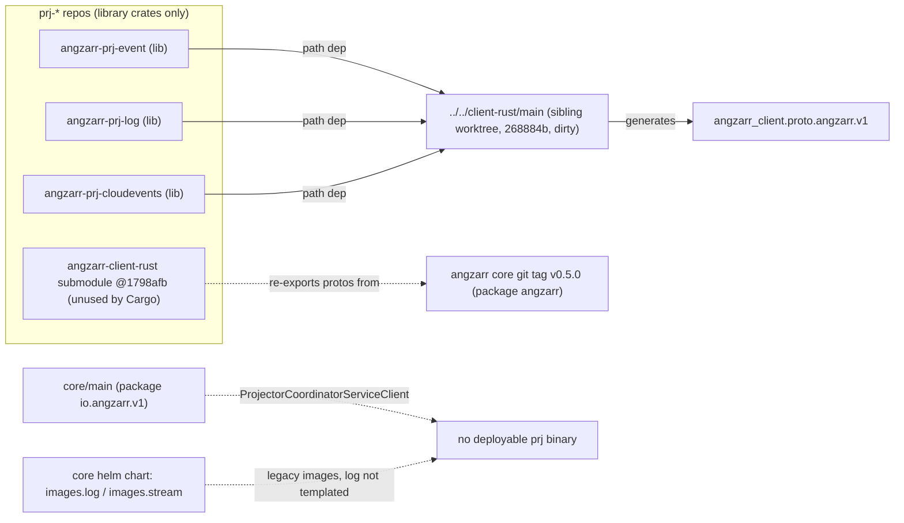
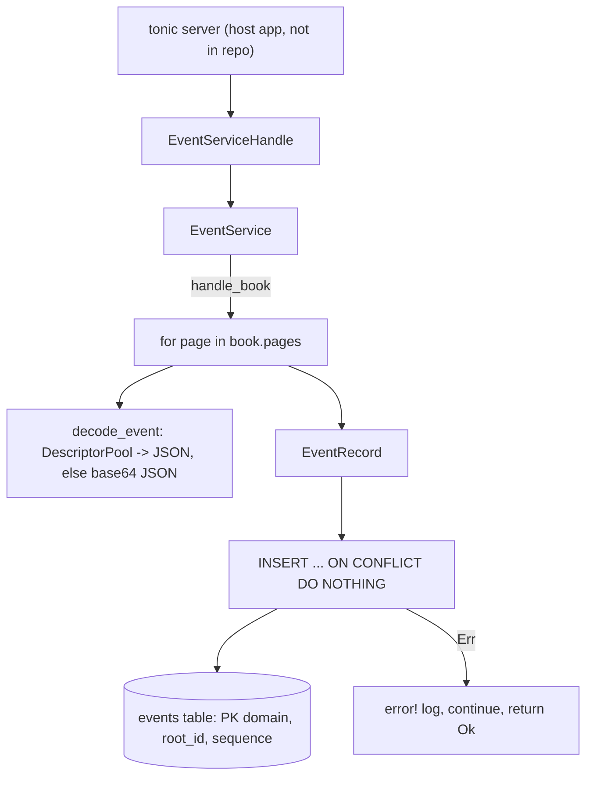
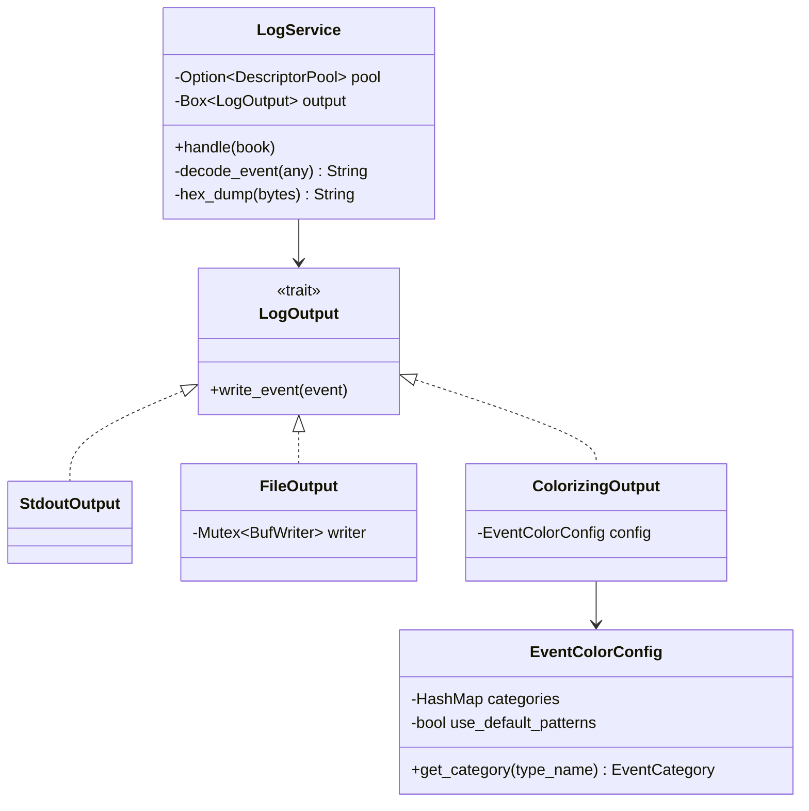
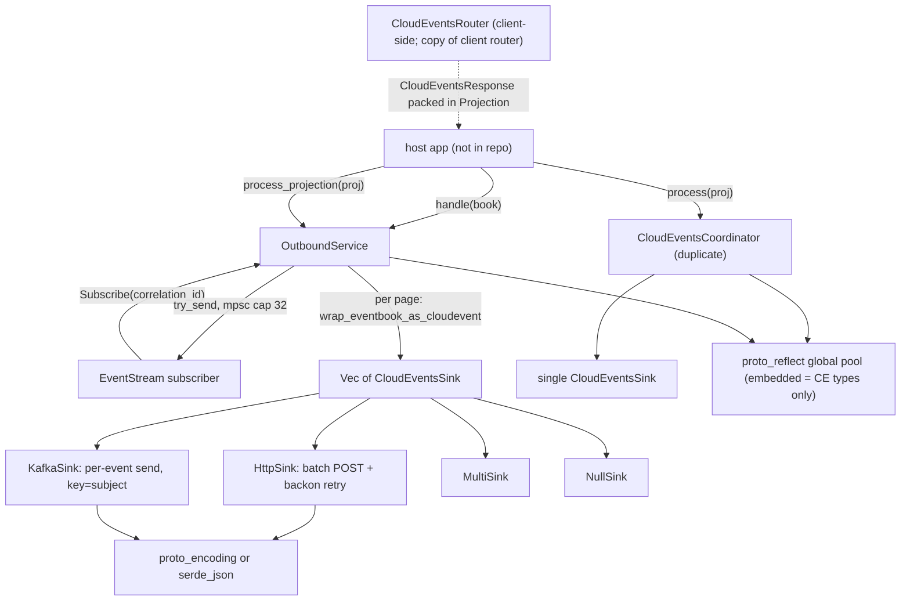
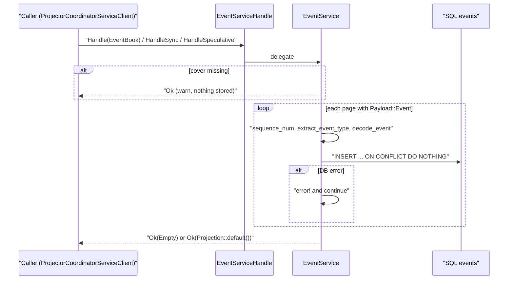
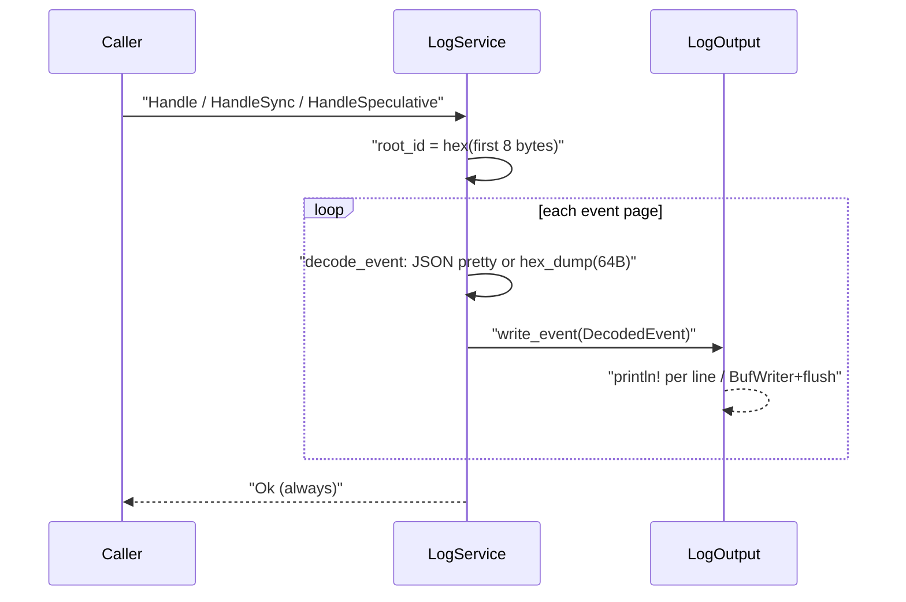
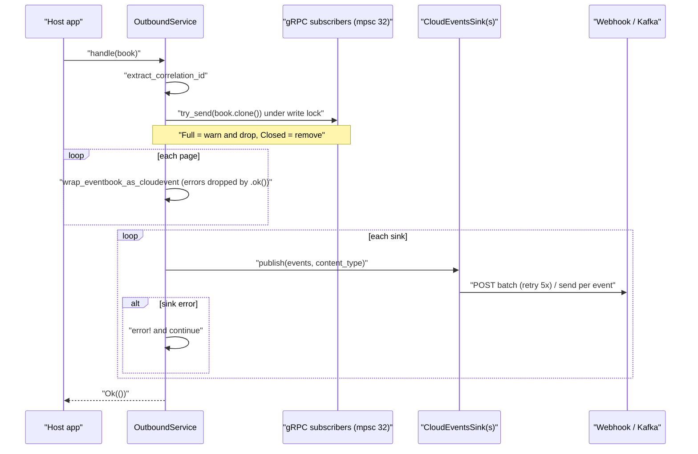
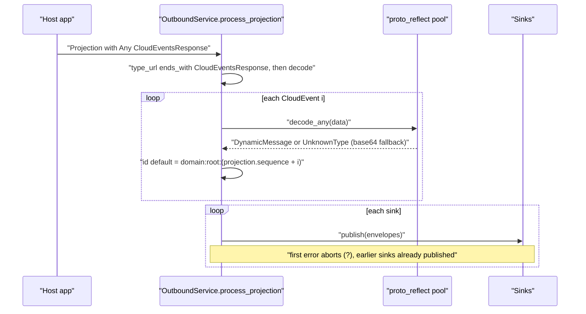

# prj-projectors
Repos (all on branch `main`, single commit "feat: initial commit" dated 2026-05-19):
- `/home/babbitt/workspace/angzarr/prj-event/main` @ main 201df30
- `/home/babbitt/workspace/angzarr/prj-log/main` @ main 0d39463
- `/home/babbitt/workspace/angzarr/prj-cloudevents/main` @ main 24e105a

Working tree: in-scope files are clean. In all three repos the `angzarr-client-rust` submodule is dirty (`git status` → ` m angzarr-client-rust`). The only change is in its `justfile`, where `podman run` became `docker run`. That is outside the review scope, but a local `just check-submodules-clean` fails because of it.

Vendored client: all three pin `angzarr-client-rust` at **1798afb** ("fix: update TYPE_URL_PREFIX format strings (#5)", `git describe` inside the submodule gives v0.5.0-3-g1798afb, VERSION 0.5.0). `/home/babbitt/workspace/angzarr/client-rust/main` is at 268884b on branch `feat/python-rust-parity-cleanup` with a dirty tree. It is **102 commits ahead** of 1798afb (`git rev-list --count 1798afb..HEAD` = 102), with a 133-file diff (+18280/−5914). That range includes `a9dd1c2 refactor(proto): consume angzarr v1 protos` and `487c806 … extract CloudEvents`. The builds do **not** use the vendored copy (see PRJ-01).

## 1. Summary
- None of the three repos has a binary, Containerfile, chart or CI build/test. Each is a **library crate** only: no `main.rs`, no `[[bin]]`, and CI runs only `just check-submodules-clean`. Core says the opposite at `core/main/src/handlers/projectors/mod.rs:9` ("Each ships its own binary and image").
- All three depend on `angzarr-client = { path = "../../client-rust/main" }`, which is the sibling worktree and not the vendored `angzarr-client-rust/` submodule. As a result the vendored submodule is dead weight, and the build depends on whatever branch is checked out next door. Against the current client-rust/main (268884b, dirty) the build **fails to compile** (E0063 `missing field ext` in `Cover`). Against the vendored 1798afb, every test passes: prj-event 4/4 (sqlite and postgres), prj-log 8/8, prj-cloudevents 49/49.
- **prj-event** (`EventService`): writes every event page to a SQL `events` table, keyed by `(domain, root_id, sequence)` with `ON CONFLICT DO NOTHING`. It **swallows DB errors and still returns OK**, so events are lost silently (verified by a probe). It also **writes to the DB on `HandleSpeculative`**, which the proto contract forbids. `u32` sequences above `i32::MAX` are stored as negative numbers (verified by a probe).
- **prj-log** (`LogService`): pretty-prints each event page to stdout or a file, with ANSI colour by event-name suffix. It is best-effort by design. Stdout printing uses one `println!` per line, so output from concurrent requests can interleave. File output does blocking I/O and flushes on every event inside an async handler.
- **prj-cloudevents** has three separate parts:
  - `OutboundService`: fans each EventBook out to gRPC stream subscribers keyed by correlation_id, and wraps each page as a CloudEvent sent to HTTP/Kafka sinks.
  - `CloudEventsCoordinator` and `OutboundService::process_projection`: convert a client `CloudEventsResponse` into CloudEvents.
  - `CloudEventsRouter`: a verbatim copy of the vendored client's `router/cloudevents.rs`.
- In prj-cloudevents, `OutboundService::handle` **logs sink failures and returns Ok** (verified by a probe), so HTTP/Kafka delivery is at-most-once. The gRPC stream **silently drops events beyond 32** buffered for a slow subscriber (probe: 32 of 40 received).
- In prj-cloudevents, `CLOUDEVENTS_BATCH_SIZE=0` makes `HttpSink::publish` **panic** (`chunks(0)`, verified). The module docs name the env var `OUTBOUND_SINKS`, but the code reads `CLOUDEVENTS_SINK`. The default sink is Http, not the documented "none".
- In prj-cloudevents, the embedded descriptor pool holds only the CloudEvents and Any/Timestamp types (verified). Client `data` payloads therefore always fall back to `{_type,_binary,_size}` unless the host application calls `init_pool` with its own descriptor set.
- The proto wire packages have drifted:
  - The vendored client (via the core git tag v0.5.0) uses package `angzarr`.
  - Core main uses `io.angzarr.v1`.
  - client-rust/main uses `angzarr_client.proto.angzarr.v1`.

  gRPC method paths differ between these, so a prj built today cannot serve core main's `ProjectorCoordinatorServiceClient`.
- Nothing in core's helm chart or in examples-rust consumes these crates. The chart's `images.log` / `infrastructure.log` values are **not rendered by any template**. `stream` still points at the legacy `angzarr-stream` image, and examples-rust pins `angzarr-stream-dev`/`angzarr-log-dev` from 2026-02-22.

## 2. Component inventory
| Component | Kind | path:line | Responsibility | Depends on |
|---|---|---|---|---|
| `EventService` | struct + `ProjectorCoordinatorService` impl | prj-event `src/event.rs:120`, `:375` | Decode each event (via prost-reflect, falling back to base64) and INSERT it into `events` | sqlx Pool, sea-query, prost-reflect, angzarr_client::proto |
| `EventServiceHandle` | Arc newtype + service impl | prj-event `src/event.rs:409`, `:419` | Shares `EventService` across the tonic server | `EventService` |
| `EventRecord::build_insert` | fn | prj-event `src/event.rs:86` | INSERT … ON CONFLICT(domain, root_id, sequence) DO NOTHING | sea-query |
| `EventService::init` | async fn | prj-event `src/event.rs:166` | CREATE TABLE plus 3 indexes, IF NOT EXISTS | sqlx |
| `connect_pool` | fn (cfg postgres/sqlite) | prj-event `src/event.rs:441`, `:446` | Builds the backend pool (sqlite uses create_if_missing) | sqlx |
| `LogService` | struct + `ProjectorCoordinatorService` impl | prj-log `src/log.rs:32`, `:189` | Decode each event and write it to a `LogOutput` | prost-reflect, `LogOutput` |
| `LogServiceHandle` | Arc newtype | prj-log `src/log.rs:158` | Shares `LogService` | `LogService` |
| `LogOutput` trait | trait | prj-log `src/output.rs:46` | Output-sink abstraction | — |
| `StdoutOutput` / `FileOutput` / `ColorizingOutput` | impls | prj-log `src/output.rs:176`, `:193`, `:257` | Plain stdout / append-to-file with mutex and flush / ANSI stdout | std io |
| `EventColorConfig` | struct | prj-log `src/output.rs:96` | Maps a type name to an `EventCategory` (exact name, simple name, or suffix patterns) | — |
| `OutboundService` | struct + `EventStreamService` impl | prj-cloudevents `src/outbound.rs:135`, `:344` | gRPC fan-out by correlation_id, plus per-page CloudEvent publishing to sinks | tokio mpsc/RwLock, `CloudEventsSink` |
| `OutboundService::process_projection` | async fn | prj-cloudevents `src/outbound.rs:190` | Converts a client `CloudEventsResponse` into CloudEvents and publishes to every sink | `convert_proto_events` |
| `outbound::from_env` | fn | prj-cloudevents `src/outbound.rs:666` | Builds the service from env vars | `sink_from_env` |
| `CloudEventsCoordinator` | struct | prj-cloudevents `src/coordinator.rs:23` | Same job as `process_projection`, but with one sink (duplicate code) | `CloudEventsSink`, `proto_reflect` |
| `CloudEventsRouter` / `CloudEventsProjector` | struct / trait | prj-cloudevents `src/projector.rs:110`, `:76` | Client-side handlers mapping event type to `CloudEvent` | prost `Name` |
| `CloudEventsSink` trait, `MultiSink`, `NullSink` | trait / impls | prj-cloudevents `src/sink.rs:39`, `:56`, `:102` | Sink abstraction | async-trait |
| `HttpSink` | impl | prj-cloudevents `src/http_sink.rs:100` | Batched POST with backon retry (5 attempts, 100ms–5s, jitter) | reqwest, backon |
| `KafkaSink` (feature `kafka`) | impl | prj-cloudevents `src/kafka_sink.rs:154` | Sends one record per event, keyed by subject, acks=all, idempotent producer | rdkafka |
| `proto_encoding` | module | prj-cloudevents `src/proto_encoding.rs:23`, `:111` | Converts an SDK Event into `io.cloudevents.v1.CloudEvent` / `CloudEventBatch` | prost |
| `proto_reflect` | module | prj-cloudevents `src/proto_reflect/mod.rs:15`, `:119` | Global `OnceLock` DescriptorPool, `decode_any`; also `diff_fields`, which is unused here | prost-reflect |
| `SinkType` / `sink_from_env` | enum / fn | prj-cloudevents `src/lib.rs:42`, `:81` | Env-driven sink selection | — |
| `proto/angzarr/cloudevents.proto`, `proto/io/cloudevents/v1/cloudevents.proto` | protos | prj-cloudevents `proto/…` | Local copies compiled by `build.rs:13-23` | tonic-prost-build |

## 3. Architecture diagrams

### 3.1 Dependency and deployment reality (all three)

### 3.2 prj-event

### 3.3 prj-log

### 3.4 prj-cloudevents

## 4. Sequence diagrams

### 4.1 prj-event: event arrives, then a DB row is written

1. RPC entry points: `handle_sync` (`src/event.rs:376-384`), `handle` (`:386-390`) and `handle_speculative` (`:392-401`). The speculative path also calls `handle_book` and so writes to the DB.
2. A missing cover causes `warn` and `Ok(())` (`:274-280`). A missing root becomes `"unknown"` (`:283-287`).
3. For each page: `sequence_num()` (`:292`); non-event payloads are skipped (`:294-297`); `decode_event` (`:231-251`); `created_at` falls back to `Utc::now()` (`:301-309`).
4. `store_event` calls `build_insert` and runs it through `sqlx::query(&string)`. Values are inlined by sea-query rather than bound as parameters (`:261-270`, `:86-114`).
5. On error: `error!`, then the loop continues. `handle_book` always returns `Ok(())` (`:321-341`).
6. The response is `Projection::default()`, with no cover or sequence (`:383`, `:400`).

### 4.2 prj-log: event arrives, then stdout or file

1. The descriptor pool is loaded once, from `DESCRIPTOR_PATH`, when the service is built (`src/log.rs:47-63`).
2. The RPCs (`:190-214`) call the synchronous `handle` (`:107-144`). That runs blocking I/O on the tokio worker thread.
3. `root_id` is truncated to 8 bytes (`:116-120`).
4. `decode_event` (`:78-93`) produces pretty JSON, falling back to `hex_dump` (`:96-104`).
5. The output is `ColorizingOutput` (`src/output.rs:275-293`), `StdoutOutput` (`:178-190`) or `FileOutput` (`:210-251`). Errors go to stderr and are never propagated.

### 4.3 prj-cloudevents: EventBook arrives, then gRPC subscribers and HTTP/Kafka

1. `handle` (`src/outbound.rs:172-182`) calls `forward_to_grpc_subscribers` (`:251-282`). If there is no correlation_id, it skips the stream step (`:252-258`).
2. `send_to_subscribers` (`:72-102`) uses `try_send`. When a subscriber's buffer is full, the event is dropped with a `warn` and the subscriber is kept (`:86-97`). The channel capacity is 32 (`:363`).
3. `publish_to_sinks` (`:288-334`) splits the book into single-page books. `wrap_eventbook_as_cloudevent(...).ok()` silently drops build errors (`:307`).
4. The CloudEvent `id` is `{domain}:{root_hex}:{seq}`, the type is `angzarr.{type}`, and the data is protobuf `EventBook` bytes (`:413-475`).
5. Sink failures are logged and the loop continues; the method returns `Ok(())` (`:316-333`).
6. HttpSink (`src/http_sink.rs:228-256`): `chunks(batch_size)` per batch, then `post_batch` (`:150-223`) retried by `backoff()` (`:129-135`) when the error is a timeout/connect error or `Unavailable` (429/5xx). Other 4xx responses map to `SinkError::Config`.
7. KafkaSink (`src/kafka_sink.rs:233-242`): sends events one at a time and stops at the first error. The key is the subject, falling back to the id (`:200-201`).

### 4.4 prj-cloudevents: client CloudEventsResponse, then sinks

1. Type detection is `ends_with("CloudEventsResponse")` (`src/outbound.rs:201`). This works for any package prefix.
2. `convert_proto_events` (`:478-514`): every event gets its `time` from the first source page (`:493-497`). The default id uses `projection.sequence + idx` (`:508`).
3. `convert_single_proto_event` (`:517-595`) lowercases extension keys but does not validate their characters (`:585-588`).
4. `any_to_json` (`:598-634`) uses the global pool, which holds only CloudEvents types unless the host initialises it with its own descriptors.
5. Sinks are published with `?` (`:237-239`). This is inconsistent with `handle`, which swallows sink errors. `CloudEventsCoordinator::process` (`src/coordinator.rs:46-98`) is the same logic for a single sink.

## 5. Invariants & contracts
- Proto contract (`angzarr-project/proto/.../projector.proto:40`): "HandleSpeculative — returns projection without side effects." prj-event breaks this (`src/event.rs:392-401`). prj-log only prints, and prints without marking the output as speculative (`src/log.rs:206-214`).
- The three prj crates implement **`ProjectorCoordinatorService`** (the coordinator/sidecar surface) and not `ProjectorService` (the client surface). So they are meant to be called directly by aggregate coordinators through discovery (`core/main/src/discovery/mod.rs:115-121`), not placed behind the `angzarr-projector` sidecar, which calls `ProjectorServiceClient` (`core/main/src/orchestration/projector/mod.rs:9,56`).
- Idempotency key:
  - prj-event: PK `(domain, root_id, sequence)` with DO NOTHING (`src/event.rs:107-111`, `:178-183`). A replay is a no-op, and a changed payload for the same key is silently ignored.
  - prj-cloudevents: the CloudEvent `id` is `domain:root:seq` (`src/outbound.rs:453`), so consumers can dedupe on it.
  - prj-log: none.
- Position tracking: **none of the three** tracks a checkpoint or cursor. They rely on the caller (coordinator or bus) for redelivery, but they also return success on failure (PRJ-02, PRJ-10), so redelivery never happens.
- Ordering:
  - Kafka key = subject = root hex (`src/kafka_sink.rs:199-205`), with `enable.idempotence=true` and `acks=all` (`:123-124`).
  - HTTP batches are sent in order, one after another (`src/http_sink.rs:238-253`).
- A root_id of `"unknown"` is used when `cover.root` is missing, in all three: `src/event.rs:287`, `src/log.rs:120`, `src/outbound.rs:422`.
- `proto_reflect` pool is a process-global `OnceLock` and can be initialised only once (`src/proto_reflect/mod.rs:15`, `:59-61`).

## 6. Findings
| ID | Severity | Category | path:line | Finding | Evidence/how verified | Suggested direction |
|---|---|---|---|---|---|---|
| PRJ-01 | high | Build / packaging | prj-event `Cargo.toml:17`; prj-log `Cargo.toml:12`; prj-cloudevents `Cargo.toml:17` | `angzarr-client = { path = "../../client-rust/main" }` points outside the repo at the sibling worktree. The vendored `angzarr-client-rust` submodule (1798afb) is never used. A fresh clone cannot build, and local builds depend on the sibling's branch and dirty state. | Read Cargo.toml. Built scratch copies twice: against client-rust/main HEAD 268884b, the `angzarr-client` lib fails with 3× E0063 `missing field ext in Cover`; against the vendored 1798afb, all tests pass. | Point to `path = "angzarr-client-rust"` (or a git tag/crates.io), and pick one client version on purpose. |
| PRJ-02 | high | Error handling / data loss | prj-event `src/event.rs:321-341` | `handle_book` logs INSERT errors and returns `Ok(())`. The caller acks, the event is never retried, and a DB outage silently loses rows. | Probe: `EventService::new(pool)` without `init()`, then `handle_book` returns `Ok` (table missing). | Propagate `Status::unavailable` on the first failure; rely on DO NOTHING for replay. |
| PRJ-03 | high | Contract violation | prj-event `src/event.rs:392-401` | `HandleSpeculative` persists rows. The proto says speculative handling must have no side effects (`projector.proto:40`). A what-if run pollutes the event table, and the PK then blocks the real event if its payload differs. | Probe: `handle_speculative` produced 1 row in `events`. | Make it a no-op (or decode-only) and return `Projection::default()`. |
| PRJ-04 | high | Deployment | `core/main/src/handlers/projectors/mod.rs:9`; the three repo roots | Core says "Each ships its own binary and image", but none of the repos has `main.rs`, `[[bin]]`, a Containerfile, or a CI build/test job. The core chart's `images.log`/`infrastructure.log` (`values.yaml:25-28`, `:129-139`) are not referenced by any template, and `stream` still uses the legacy `angzarr-stream` image. examples-rust pins `angzarr-stream-dev`/`angzarr-log-dev` (`deploy/k8s/helm/values-ci.yaml:28-55`). | `find … -name main.rs -o -iname 'Containerfile*' -o -name Chart.yaml` → 0 results in all 3 repos. `rg 'infrastructure\.log\|images\.log' core/main/deploy/k8s/helm/angzarr/templates` → 0 hits. CI yml has only the submodules job. | Add bin targets plus Containerfiles and CI (build, test, image), then wire the chart templates to the new images, or remove the stale chart values. |
| PRJ-05 | med | Wire compatibility | vendored `angzarr-client-rust/src/proto.rs:6`, `angzarr-client-rust/Cargo.toml:20`; `core/main/build.rs:11`; `core/main/angzarr-project/proto/io/angzarr/v1/projector.proto:2` | The service packages differ: vendored client (core tag v0.5.0) uses `package angzarr`, core main uses `io.angzarr.v1`, and client-rust/main uses `angzarr_client.proto.angzarr.v1`. gRPC paths (`/<pkg>.ProjectorCoordinatorService/Handle`, `/<pkg>.EventStreamService/Subscribe`) do not match, so core main's discovery client would get UNIMPLEMENTED. | Ran `grep '^package'` on each proto source (cargo git checkout 5ec4235, core/main, client-rust/main). | Re-pin to the client version that matches the core version you deploy, and add a wire-parity check. |
| PRJ-06 | med | Data integrity | prj-event `src/event.rs:101` | `(self.sequence as i32)` wraps any sequence above `i32::MAX` to a negative value, and the column is `integer`. | Probe: sequence 3_000_000_000 was stored as `-1294967296`. | Use `big_integer()` with `i64::from(u32)`. |
| PRJ-07 | med | Idempotency | prj-event `src/event.rs:283-287` | A missing `cover.root` becomes `"unknown"`, so every root-less book in a domain shares one PK space and later events are silently dropped by DO NOTHING. The same fallback exists at prj-log `src/log.rs:120` and prj-cloudevents `src/outbound.rs:422` (CloudEvent id collisions). | Read code; the PK is `(domain, root_id, sequence)` at `:178-183`. | Reject (InvalidArgument) or skip with an error, instead of using a sentinel. |
| PRJ-08 | med | Crash / config | prj-cloudevents `src/http_sink.rs:59-62`, `:238` | `CLOUDEVENTS_BATCH_SIZE=0` parses fine, and then `events.chunks(0)` panics inside `publish`. | Probe: `with_batch_size(0)` makes `publish` panic at `http_sink.rs:238:29`. | Validate `batch_size >= 1` in `new`/`from_env`. |
| PRJ-09 | med | Backpressure / data loss | prj-cloudevents `src/outbound.rs:86-97`, `:363` | A slow gRPC subscriber silently loses events once 32 are buffered: `try_send` Full is logged as a warn, the subscriber stays registered, and nothing tells the client there is a gap. Core's `StreamService` has the same code (`core/main/src/handlers/projectors/stream/mod.rs:193`). | Probe: 40 events sent, 32 received. | Close the stream with `Status::resource_exhausted` on Full so the client resubscribes or replays, or make the capacity configurable. |
| PRJ-10 | med | Error handling | prj-cloudevents `src/outbound.rs:316-333` | `publish_to_sinks` logs sink errors and returns `Ok`, so HTTP/Kafka delivery is at-most-once. `process_projection` (`:237-239`) instead aborts on the first error after earlier sinks have already published, and `MultiSink` tries every sink and returns the first error. There are three different semantics. | Probe: failing sink, then `handle` returned `Ok`. | Propagate the error and let the caller redeliver (ids are deterministic). Pick one fan-out policy. |
| PRJ-11 | med | Silent drop | prj-cloudevents `src/outbound.rs:307` | `wrap_eventbook_as_cloudevent(...).ok()` in `filter_map` discards build errors with no log at the call site. | Read code. | Log the error, or propagate it. |
| PRJ-12 | med | Config / doc drift | prj-cloudevents `src/outbound.rs:27-32` vs `src/lib.rs:70-74`, `:65` | The module docs describe `OUTBOUND_SINKS` (comma list, default none). The code reads `CLOUDEVENTS_SINK`, and when it is unset **or unrecognised** it defaults to `Http`, which then fails if `CLOUDEVENTS_HTTP_ENDPOINT` is missing. Without the `kafka` feature, `CLOUDEVENTS_SINK=kafka` silently becomes Http. The angzarr-project docs say the default is `null`. | `rg OUTBOUND_SINKS` finds only the doc line (outbound.rs:29). The angzarr-project site `framework-projectors.mdx:180` says the default is `null`. | Default to Null, return an error on unknown values, and fix the docs. |
| PRJ-13 | med | Idempotency | prj-cloudevents `src/outbound.rs:508`; `src/coordinator.rs:131` | The default CloudEvent id is `domain:root:(projection.sequence + idx)`. When a projection emits N>1 events, the ids run into the ranges of later projections. | Probe: projection seq 5 with 2 events gave ids `d:01:5`, `d:01:6`; the next projection (seq 6) also gave `d:01:6`. The exact meaning of `Projection.sequence` is not documented in types.proto:218-223. | Derive the id from the source page sequence plus a per-event index suffix (e.g. `…:{seq}#{i}`). |
| PRJ-14 | med | Functionality | prj-cloudevents `src/proto_reflect/mod.rs:82`, `:100`; `build.rs:17-22` | The embedded descriptor set contains only CloudEvents, Any and Timestamp. Client `data` (domain messages) never decodes to JSON unless the host calls `init_pool` with its own FDS, and because of `OnceLock` it can do so only once and cannot merge. Nothing in the crate calls `init_*`. | Probe: listed the embedded pool's messages (9, all CE/wkt). `rg 'init_from_embedded\|init_pool'` → definitions only. | Accept a `DescriptorPool` in constructors, as prj-event and prj-log do, or support `DESCRIPTOR_PATH`. |
| PRJ-15 | low | Spec conformance | prj-cloudevents `src/types.rs:69-71`; `src/outbound.rs:585-588` | Extension names are only lowercased. The CloudEvents spec requires `[a-z0-9]`, but `my-ext.Key` is accepted as `my-ext.key`. | Probe output: `Ok(["my-ext.key"])`. | Validate or strip, and reject invalid names. |
| PRJ-16 | low | Data fidelity | prj-cloudevents `src/proto_encoding.rs:66` | `ExtensionValue::Integer(i64)` is cast `as i32` into `ce_integer`, which silently truncates. | Read code. | Encode as `ce_string` when the value is out of i32 range, or return an error. |
| PRJ-17 | low | Concurrency / ops | prj-log `src/output.rs:180-189`, `:280-292`; `src/log.rs:190-214` | Each event is written as several `println!` calls without holding the stdout lock, so concurrent RPCs interleave blocks. `FileOutput` flushes on every event under a std `Mutex` on the async executor thread. ANSI codes are always emitted, even without a TTY (for example in k8s logs). | Read code. | Build one string per event and use `stdout().lock()`; use `spawn_blocking` for file output; detect TTY. |
| PRJ-18 | low | Diagnostics | prj-log `src/log.rs:47-67` | When `DESCRIPTOR_PATH` is set but unreadable, `std::fs::read(...).ok()?` swallows the error and the log says "No DESCRIPTOR_PATH set". | Read code. | `warn!` with the io error. |
| PRJ-19 | low | Duplication | prj-cloudevents `src/coordinator.rs:101-286` vs `src/outbound.rs:478-663`; `src/projector.rs` vs vendored `angzarr-client-rust/src/router/cloudevents.rs` | The CloudEvent conversion and `any_to_json` are duplicated in the same crate. `base64_encode` is hand-rolled three times (prj-event `event.rs:346`, coordinator.rs:260, outbound.rs:637), even though `base64 = "0.22"` is a dependency (`Cargo.toml:44`, unused: `rg 'base64::'` → 0). `projector.rs` is a verbatim copy of the client router; `diff` shows only the imports differ. | `diff`; rg. | Keep one `convert_*`, use the base64 crate, and drop whichever `CloudEventsCoordinator` or `process_projection` is not needed. |
| PRJ-20 | low | Dead code | prj-cloudevents `src/proto_reflect/mod.rs:139-227`, `:230-242`; `src/projector.rs:76-82`; prj-event `Cargo.toml:30` | `diff_fields`/`fields_are_disjoint`/`format_any` (state-diff helpers copied from core) have no callers. The `CloudEventsProjector` trait is documented as an OO pattern, but nothing dispatches `on_*` methods. `sea-query-binder` is an unused dependency. The `ANGZARR_PRJ_*_VERSION` env vars emitted by `build.rs` are never read. | rg for each symbol → definitions or tests only. | Remove them. |
| PRJ-21 | low | Router correctness | prj-cloudevents `src/projector.rs:157`, `:238-244` | Handlers are keyed by the simple name (`T::NAME`), so `a.Created` and `b.Created` collide. The last registration wins, and the other type then fails `to_msg` and returns `None` silently (`:158-161`). | Read code. | Key by full name (`T::full_name()`). |
| PRJ-22 | low | Timestamp fidelity | prj-cloudevents `src/outbound.rs:493-497`; `src/coordinator.rs:116-120`; prj-event `src/event.rs:301-309` | CloudEvents from a projection all take the **first** source page's time. prj-event falls back to `Utc::now()` when `created_at` is missing, so replays are not deterministic. | Read code. | Use each page's own time, or the empty/null value. |
| PRJ-23 | low | Tests | prj-log `src/output.test.rs:94-107`; prj-cloudevents `src/proto_reflect/mod.test.rs:176-191` | `test_stdout_output` asserts nothing ("doesn't panic"). The pool-error tests only check `Display` strings. None of the repos tests the error or speculative paths behind PRJ-02, 03 and 10. | Read tests. | Add behavioural tests (sqlite in-memory for prj-event, and a failing sink). |
| PRJ-24 | low | Proto source of truth | prj-cloudevents `proto/angzarr/cloudevents.proto:2`; `build.rs:17-22` | This is a local copy of `angzarr-project/proto/angzarr_client/proto/angzarr/cloudevents.proto`, with the package rewritten to `angzarr` (the upstream is `angzarr_client.proto.angzarr` / `…v1`). It duplicates the spec source and goes against the project rule against copying protos. Detection by `ends_with` hides the type_url mismatch. | `diff` of the two files: only the package line and region markers differ. | Compile from the `angzarr-project/proto` submodule. |

## 7. Open questions
1. Which service surface is intended: `ProjectorCoordinatorService` (called directly by aggregate coordinators) or `ProjectorService` behind the `angzarr-projector` sidecar? The chart's `stream` deployment uses the sidecar pattern (`core/main/deploy/k8s/helm/angzarr/templates/deployment.yaml:891-990`), which OutboundService cannot serve because it implements neither service.
2. What does `Projection.sequence` mean: the last source sequence, or the next one? PRJ-13's severity depends on the answer.
3. Is `CloudEventsRouter` meant to live here, or in client-rust? client-rust/main removed it in `487c806` ("extract CloudEvents … to a new separate repo (angzarr-io/cloudevents)"). The repo name in that commit message differs from `angzarr-prj-cloudevents`.
4. Should prj-event store JSON as `text` or as `jsonb` on Postgres? It is `text` today (`src/event.rs:175`), so JSON querying is not indexed.
5. Is `Cargo.lock` being gitignored (`.gitignore`) intended, once these become binaries?

## 8. Cross-repo interface surface
- **What these repos rely on:**
  - `angzarr_client::proto::{EventBook, EventRequest, Projection, SpeculateProjectorRequest, EventStreamFilter, Cover, event_page::Payload}`.
  - The `projector_coordinator_service_server::ProjectorCoordinatorService` and `event_stream_service_server::EventStreamService` traits.
  - `proto_ext::EventPageExt::sequence_num`.
  - They rely on the sibling `client-rust/main` for all of this, not the vendored copy.
  - The `angzarr-project/submodule.just` recipes (justfile:5), used by lefthook and CI.
- **What they expose:**
  - prj-event: `EventService`, `EventServiceHandle`, `connect_pool`, `Pool`.
  - prj-log: `LogService`, `LogServiceHandle`, `LogOutput` + 3 impls, `EventColorConfig`, `EventCategory`.
  - prj-cloudevents: `OutboundService` (`EventStreamService` impl plus inherent `handle` and `process_projection`), `from_env`, `CloudEventsCoordinator`, `CloudEventsRouter`, `CloudEventsSink`, `HttpSink`, `KafkaSink`, `MultiSink`, `NullSink`, `proto::{CloudEvent, CloudEventsResponse}` (package `angzarr`), `proto_reflect`.
- **Consumers found:** none. `rg -i 'prj-event|prj-log|prj-cloudevents|EventServiceHandle|LogServiceHandle|OutboundService'` over `core/main/deploy` and `examples-rust/main` (excluding submodule docs) → only a doc comment at `examples-rust/main/prj-output/src/lib.rs:19`. The angzarr-project docs (`framework-projectors.mdx:57,125,190`) still show the old import paths `angzarr::handlers::projectors::{LogService…, OutboundEventHandler}`.
- **Duplicated in core:** core's `StreamService` (`core/main/src/handlers/projectors/stream/mod.rs:112-241`) has the same subscription registry, cleanup task and `mpsc(32)` as `OutboundService`.

### Shared-pattern comparison
| Aspect | prj-event | prj-log | prj-cloudevents |
|---|---|---|---|
| gRPC surface | `ProjectorCoordinatorService` (3 RPCs) | `ProjectorCoordinatorService` (3 RPCs) | `EventStreamService` only; ingest is the inherent `handle()` |
| Arc newtype for orphan rule | `EventServiceHandle` (event.rs:409) | `LogServiceHandle` (log.rs:158) | none (tonic wraps it) |
| Descriptor source | `with_descriptors` / `load_descriptors(path)` (event.rs:135,143) | env `DESCRIPTOR_PATH` in ctor (log.rs:47) | global `OnceLock`, embedded CE-only (proto_reflect:15,82) |
| Decode fallback | JSON `{_type,_binary,_size}` via hand-rolled base64 | hex dump, first 64B | JSON `{_type,_binary,_size}` via hand-rolled base64 (×2) |
| Sink | SQL (sqlite/postgres) | stdout / file | gRPC mpsc, HTTP, Kafka |
| Idempotency | PK + DO NOTHING | n/a | deterministic CE id (domain:root:seq) |
| Position tracking | none | none | none |
| Error to caller | always Ok (PRJ-02) | always Ok | `handle`: Ok (PRJ-10); `process_projection`: Err |
| Speculative | **writes** (PRJ-03) | prints | n/a |
| Backpressure | none (sequential awaits) | none (blocking) | drop at 32 (PRJ-09); HTTP retry, 5×(30s timeout) |
| Config | ctor args + cargo features | env `DESCRIPTOR_PATH` | env `CLOUDEVENTS_*`, `OUTBOUND_CONTENT_TYPE` |
| Missing-root fallback | `"unknown"` | `"unknown"` | `"unknown"` |
| Tests | 4 (pure fns) | 8 (1 without assertion) | 49 (unit; no failure-path tests) |
| Binary/image | none | none | none |

## 9. Prior findings audit
No prior report for `prj-projectors` (none in `…/scratchpad/reviews/`). Skipped, as instructed.

## 10. Read Ledger
| File | Total lines | Lines read (ranges) | Notes |
|---|---|---|---|
| prj-event/main/src/event.rs | 455 | 1-455 | full |
| prj-event/main/src/lib.rs | 10 | 1-10 | full |
| prj-event/main/src/event.test.rs | 125 | 1-125 | test, read fully |
| prj-event/main/Cargo.toml | 38 | 1-38 | full |
| prj-event/main/build.rs | 8 | 1-8 | full |
| prj-event/main/justfile | 8 | 1-8 | full |
| prj-event/main/lefthook.yml | 23 | 1-23 | full |
| prj-event/main/.github/workflows/ci.yml | 23 | 1-23 | full |
| prj-event/main/VERSION, .gitmodules, .gitignore | 1/6/12 | all (cat) | trivial metadata |
| prj-log/main/src/log.rs | 219 | 1-219 | full |
| prj-log/main/src/output.rs | 306 | 1-306 | full |
| prj-log/main/src/lib.rs | 16 | 1-16 | full |
| prj-log/main/src/log.test.rs | 77 | 1-77 | test, read fully |
| prj-log/main/src/output.test.rs | 107 | 1-107 | test, read fully |
| prj-log/main/Cargo.toml | 28 | 1-28 | full |
| prj-log/main/build.rs | 8 | 1-8 | full |
| prj-log/main/justfile | 8 | 1-8 | full |
| prj-log/main/lefthook.yml | 23 | 1-23 | full |
| prj-log/main/.github/workflows/ci.yml | 23 | 1-23 | full |
| prj-log/main/VERSION, .gitmodules, .gitignore | 1/6/12 | all (cat) | trivial metadata |
| prj-cloudevents/main/src/lib.rs | 106 | 1-106 | full |
| prj-cloudevents/main/src/coordinator.rs | 290 | 1-290 | full |
| prj-cloudevents/main/src/outbound.rs | 685 | 1-685 | full |
| prj-cloudevents/main/src/projector.rs | 272 | 1-272 | full (includes inline test) |
| prj-cloudevents/main/src/sink.rs | 125 | 1-125 | full |
| prj-cloudevents/main/src/types.rs | 75 | 1-75 | full |
| prj-cloudevents/main/src/http_sink.rs | 265 | 1-265 | full |
| prj-cloudevents/main/src/kafka_sink.rs | 251 | 1-251 | full |
| prj-cloudevents/main/src/proto_encoding.rs | 123 | 1-123 | full |
| prj-cloudevents/main/src/proto_reflect/mod.rs | 246 | 1-246 | full |
| prj-cloudevents/main/src/*.test.rs (coordinator, outbound, http_sink, kafka_sink, sink, types, proto_encoding, proto_reflect/mod) | 162/388/71/55/99/94/154/210 | all, fully | tests |
| prj-cloudevents/main/proto/angzarr/cloudevents.proto | 53 | 1-53 | full |
| prj-cloudevents/main/proto/io/cloudevents/v1/cloudevents.proto | 60 | 1-60 | full |
| prj-cloudevents/main/Cargo.toml | 55 | 1-55 | full |
| prj-cloudevents/main/build.rs | 28 | 1-28 | full |
| prj-cloudevents/main/justfile | 8 | 1-8 | full |
| prj-cloudevents/main/lefthook.yml | 23 | 1-23 | full |
| prj-cloudevents/main/.github/workflows/ci.yml | 23 | 1-23 | full |
| prj-cloudevents/main/VERSION, .gitmodules, .gitignore | 1/6/12 | all (cat) | trivial metadata |
| */angzarr-client-rust/** | — | not reviewed (per instructions) | only diffed/describe'd; build.rs, Cargo.toml:20, src/proto.rs:1-40 viewed to establish the proto source |
| core/main/src/handlers/projectors/stream/mod.rs (out of scope) | 338 | 100-269 | read for the duplication comparison only |

Verification method: scratch copies of the three repos were built against (a) client-rust/main HEAD, which failed to compile, and (b) the vendored 1798afb, where all tests passed. The probe tests were appended only to the **scratch** copies, with the cargo target under `~/.cache/prj-review-target`. No repo file was modified.
